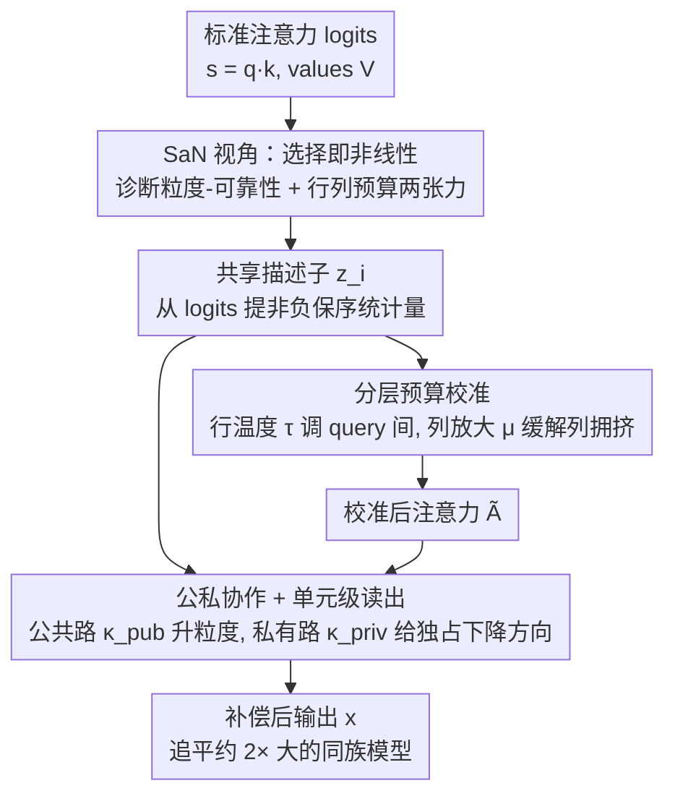

# Selection-as-Nonlinearity: Bridging Attention and Activation via a Joint Game-Decision Lens for Interpretable, Discriminative Visual Representations

**会议**: CVPR 2026  
**论文**: [CVF Open Access](https://openaccess.thecvf.com/content/CVPR2026/html/Cai_Selection-as-Nonlinearity_Bridging_Attention_and_Activation_via_a_Joint_Game-Decision_Lens_CVPR_2026_paper.html)  
**代码**: https://github.com/SudongCAI/CSaN  
**领域**: 可解释性 / 视觉 Transformer  
**关键词**: 注意力机制, 激活函数, 弱独立性, 预算分配博弈, 表达能力补偿

## 一句话总结
这篇论文提出 SaN（Selection-as-Nonlinearity）视角，把注意力重新理解成"在单位预算约束下、由上下文打分驱动的合作式选择博弈"，用它诊断出"去掉 FFN 后纯注意力栈大幅掉点"的弱独立性现象源于两个结构张力，并据此设计了几乎零开销的补偿模块 CSaN（分层预算校准 + 公私协作读出），让 Swin / ViT / Hiera 的小模型在 ImageNet 上追平甚至超过约 2 倍大的同族大模型。

## 研究背景与动机
**领域现状**：自注意力已经成为视觉模型的主流 token 混合算子，理论上一个带独立前/后投影的自注意力块在紧致域上满足万能逼近性质（UAP），看起来本身就足够强。标准的视觉 Transformer 都是"注意力层 + FFN 层"交替堆叠的宏观骨架。

**现有痛点**：作者做了一个简单却扎眼的消融——把每个 FFN 都替换成注意力块、保持深度和分辨率不变，得到一个"纯注意力栈"。结果精度大幅下滑：Swin-Min 上从交替架构的 72.2% 掉到纯注意力的 62.8%，即使把宽度补齐到同参数量也只有 67.5%。也就是说，理论上能做万能逼近的注意力，一旦脱离 FFN 单独使用，能力就"实现不出来"。作者把这个现象命名为注意力的弱独立性挑战（weak-independence challenge）。

**核心矛盾**：问题不在于注意力"原则上能不能强"，而在于"为什么它单独用时强不起来"。已有工作要么从计算效率角度改注意力（窗口、低秩、稀疏），要么从 UAP 角度证明它表达力够，却没人回答这个落地能力与理论能力之间的鸿沟从何而来。

**切入角度**：作者提出一个统一的认知透镜——有效的非线性（激活）本质上是"有方向的、软的特征选择"。先用上下文算出一个重要性度量，再按这个度量给特征加权使用；一个 token 的权重就是它属于"重要特征"这个模糊集合的隶属度，而激活就是软选择。在这个视角下，注意力恰好是"上下文门控激活单元在共享 value 上的聚合"，而行 softmax 的归一化则把它变成一个单位质量预算下的合作分配博弈。

**核心 idea**：用"选择即非线性 + 预算分配博弈"这个联合的博弈-决策视角，把弱独立性归因为两个具体的结构张力（粒度-可靠性权衡、行-列预算困境），然后设计一个保留归一化器、只在"预算绑死的地方"松绑的轻量补偿模块 CSaN，而不是去掉或重写注意力。

## 方法详解

### 整体框架
整篇工作分两段：先用 SaN 视角把注意力拆解清楚并诊断病灶，再用 CSaN 模块对症下药。SaN 把一行注意力 $\boldsymbol{y}_i=\sum_j \alpha_{ij}\boldsymbol{v}_j$（其中 $\alpha_{ij}=\mathrm{softmax}_j(\boldsymbol{q}_i^\top\boldsymbol{k}_j)$）读成"query $i$ 把单位质量的预算分配到一组共享的 value 上"，由此推出两个张力：一是头数多寡带来的粒度-可靠性权衡，二是"一行内分配是零和、一列 value 又被多 query 共享"导致的行-列预算困境。CSaN 则是一个包在标准注意力块外面、不改 Q/K/V 投影和残差拓扑的 drop-in wrapper：它先从注意力 logits 里提炼一个非负、保序的描述子 $\boldsymbol{z}_i$，再用它同时驱动"分层预算校准"和"公私协作的单元级读出"两条补偿路径。

### 关键设计

**1. SaN 视角：把注意力读成"单位预算下的合作选择博弈"，并据此定位两个病灶**

这是全文的理论地基，专治"为什么纯注意力强不起来说不清楚"这个痛点。作者先给出一个上下文门控原语 $\Phi(\boldsymbol{x},\boldsymbol{c})=\rho(\boldsymbol{c})\,\boldsymbol{x}$，其中门 $\rho\ge 0$ 且满足保序性（分越高、保留越多）。命题指出：只要同一个 token $\boldsymbol{x}$ 在不同上下文下得到不同的保留量，这个映射就在 $(\boldsymbol{x},\boldsymbol{c})$ 上非线性、且不存在只依赖 $\boldsymbol{x}$ 的线性替代——这正是"选择产生有效非线性"。把它特化到注意力：每个 $(i,j)$ 贡献就是一个上下文门控单元 $\Phi_{i,j}=\rho(c_{ij})\boldsymbol{v}_j$，$c_{ij}=\boldsymbol{q}_i^\top\boldsymbol{k}_j$，行 softmax 充当归一化器，输出对共享 value bank 聚合。作者进一步证明，在匹配粒度下，一个带独立前后投影的 $H$ 头注意力块的表达力不弱于一个 $H$ 组门控的 FFN（表达力对等定理）——所以"注意力天生比 FFN 弱"不成立，弱的是"单独用时实现得出来的那部分"。

真正的病灶来自把一行注意力看成博弈后的两个张力。第一个是粒度-可靠性权衡：头少、头宽大时很多通道共享一个门，选择粗糙；头多、头窄时门细了但每个头容量小、重要性估计变脆。第二个、也是更关键的是行-列预算困境。一阶梯度耦合给出了精确刻画：$\frac{\partial \ell}{\partial s_{ij}}=\alpha_{ij}\,\boldsymbol{g}_i^\top(\boldsymbol{v}_j-\boldsymbol{y}_i)$ 而 $\frac{\partial \ell}{\partial \boldsymbol{v}_j}=\sum_i \alpha_{ij}\boldsymbol{g}_i$。横向看，一行的预算是单纯形约束（增大一个权重必然挤掉别的，零和）；纵向看，同一列 value 被很多 query 共享，一次列更新要同时满足众多行的下降约束。定理给出：存在一个让所有相关行都严格下降的 $\Delta\boldsymbol{k}_j$，当且仅当对应的 $\boldsymbol{q}$ 锥严格可分（或活跃 $\boldsymbol{g}_i$ 同处一个开半空间）——这种方向对齐很罕见，否则"帮了一行就伤另一行"。这就在机制层面解释了弱独立性：不是注意力不够强，而是共享预算把它绑死了。

**2. 分层预算校准：把单阶段分配升级成"先 query 间、再 query 内"两级，给绑死的约束松绑**

针对行-列困境，作者的思路不是去掉归一化器（那会丢掉选择语义和额外表达力），而是保留它、只松动预算的几何形状。具体把原来的单阶段分配拆成两级：先做一个 query 间的标度，再做常规的 query 内列分配。设头内 logits 为 $s_{ijh}=\boldsymbol{q}_{ih}^\top\boldsymbol{k}_{jh}$，从共享描述子生成行温度 $\tau_{ih}=1+f_\tau(\boldsymbol{z}_i)$ 和列放大系数 $\mu_{jh}=1+f_\mu(\bar{\boldsymbol{z}})$（$\bar{\boldsymbol{z}}$ 是跨行池化的状态），校准后的注意力为

$$\tilde{\boldsymbol{A}}_{ijh}=\mathrm{softmax}_j\!\big(\tau_{ih}\,s_{ijh}\big)\cdot \mu_{jh}.$$

这里 $\tau$ 负责在 query 之间重新分配预算（缓解"每行各自为政"），$\mu$ 缓解列侧的拥挤（同一列被多行抢占）。两者一起放松了定理里的一阶可行性约束，却完整保留了行归一化器 $R$，因此选择的语义不变。描述子 $\boldsymbol{z}_i$ 的构造也很讲究：先从 logits 张量按列做一个准线性非负映射的均值、乘上输入投影得到的头模板，构成 token-头描述子 $\iota_{ih}=\sigma(u_{ih})\cdot\frac{1}{N}\sum_j \phi_\beta(s_{ijh})$，再经轻量 reducer 与非线性得到 $\boldsymbol{z}_i=\psi\circ f_\iota(\iota_{i,:})$；它非负、保序，且避免了"朴素取均值会把普遍性和显著性混为一谈"的问题。

**3. 公私协作 + 单元级读出：在不加头数的前提下升粒度，并给每个 token 一条独占的下降通路**

针对粒度-可靠性权衡，作者把读出从"头级"细化到"单元级"（头 × 通道），并引入公共路/私有路两条通道。从描述子生成每 token 增益 $\boldsymbol{\kappa}^{\mathrm{pub}}_{ih}=\boldsymbol{1}+f_a(\boldsymbol{z}_i)$ 和 $\boldsymbol{\kappa}^{\mathrm{priv}}_{ih}=f_v(\boldsymbol{z}_i)$，最终输出为

$$\boldsymbol{x}_{ih}=\big(\tilde{\boldsymbol{A}}_{i,:,h}\,\boldsymbol{V}_{:,h}\big)\odot \boldsymbol{\kappa}^{\mathrm{pub}}_{ih}\ \oplus\ \boldsymbol{V}_{i,h}\odot \boldsymbol{\kappa}^{\mathrm{priv}}_{ih}.$$

公共路 $\boldsymbol{\kappa}^{\mathrm{pub}}$ 负责跨 token 混合，并在通道粒度上补偿表达力——相当于不增加头数就把"一个门管一大片通道"的粗粒度问题拆细；私有路 $\boldsymbol{V}_{i,h}\odot\boldsymbol{\kappa}^{\mathrm{priv}}_{ih}$ 只用 token 自己的 value，给每行一条独占的下降方向，它的梯度 $\partial\ell/\partial \boldsymbol{x}^{\mathrm{priv}}_i=\boldsymbol{g}_i$ 直接绕过了行单纯形和列共享这两个绑死约束。这就在实践层面同时化解了两个张力：公共路解决"粒度不够"，私有路解决"列更新要全体行同意才行"。整个 CSaN（描述子 → 分层预算 → 公私读出）默认用线性层实现各 $f$，约简比 $r_u=4$、$r_b=8$，$\beta=0.25$，对参数量和 FLOPs 只增加约 5%。

## 实验关键数据

### 弱独立性诊断（Swin-Min, ImageNet）
这张表是全文动机的实证，也顺带预览了 CSaN 的补偿效果（♢ 表示宽度扩展到与标准注意力-FFN 同参数量的变体）。

| 骨架 | Token-Mixer | #Params | FLOPs | Top-1 (%) |
|------|-------------|---------|-------|-----------|
| Swin-Min | Swin-Original（注意力-FFN） | 11.8M | 1.6G | 72.2 |
| Swin-Min | 纯注意力 | 8.6M | 1.1G | 62.8 |
| Swin-Min | 纯注意力 ♢（同参数量） | 11.8M | 1.6G | 67.5 |
| Swin-CSaN | 纯注意力 | 9.5M | 1.3G | **72.4** |
| Swin-CSaN | 纯注意力 ♢ | 13.6M | 1.8G | **75.9** |

去掉 FFN 后纯注意力栈掉了约 9.4 个点（72.2 → 62.8），即使补齐宽度也只有 67.5；而 CSaN 让纯注意力栈以更低开销反超原始交替基线（72.4 vs 72.2），宽度扩展后进一步到 75.9。

### 主实验（ImageNet-1K，三大 Transformer 家族）
CSaN 在仅增加约 5% 参数/FLOPs 的前提下稳定涨点，并让轻量变体追平约 2 倍大的同族模型。

| 模型 | 设置 | #Params | FLOPs | Top-1 (%) |
|------|------|---------|-------|-----------|
| Swin-Min | Original | 11.8M | 1.6G | 72.2 |
| Swin-Min | CSaN | 12.2M | 1.7G | **75.0** |
| Swin-Tiny | Original | 28.3M | 4.4G | 81.3 |
| Swin-Tiny | CSaN | 29.5M | 4.6G | **82.7** |
| Swin-Base | Original | 87.8M | 15.1G | 83.5 |
| Swin-Small | CSaN | 51.8M | 8.9G | **83.5**（≈0.5× 参数追平 Base） |
| ViT-Base/16 | Original | 86.6M | 16.9G | 81.8 |
| ViT-Base-Slim/16 | CSaN | 40.6M | 7.9G | **82.1**（≈0.5× 参数超过 Base） |
| Hiera-Base | Original | 51.5M | 8.8G | 82.4 |
| Hiera-Tiny-Plus | CSaN | 29.1M | 4.9G | **82.4**（≈0.56× 参数追平 Base） |

COCO 目标检测（Swin-Tiny + RetinaNet，两模型都从同一 ImageNet 预训练权重初始化、CSaN 的私有 key 随机初始化以剥离预训练精度优势）：mAP 从 37.3 提升到 38.0，AP50/AP75/APM/APL 全面提升。

### 消融实验
| 配置 | 骨架 | #Params | Top-1 (%) | 说明 |
|------|------|---------|-----------|------|
| Swin-Original | Swin-Tiny | 28.3M | 81.3 | 基线 |
| CSaN-Head-Wise | Swin-Tiny | 29.0M | 82.5 | 头级粒度（头内通道共享一个权重） |
| CSaN（单元级） | Swin-Tiny | 29.5M | 82.7 | 头 × 通道的最大粒度，推荐默认 |
| Swin-CSaN-V2 | Swin-Min | 12.3M | 77.1 | CSaN 输出后接 7×7 深度卷积 |
| Swin-CSaN-V2 | Swin-Small | 52.3M | 83.9 | 明确超过 Swin-Base(83.5) |

### 关键发现
- **粒度确实有用，但不是全部**：把读出从单元级降回头级（CSaN-HdW），精度从 82.7 掉到 82.5，但仍远高于基线 81.3——说明"分层预算 + 公私协作"这个主框架贡献了大头，单元级粒度只是锦上添花。作者据此推荐用开销很小的单元级作为默认。
- **可扩展性强**：只在 CSaN 输出后加一个 7×7 深度卷积就得到 CSaN-V2，在更深骨架上增益更明显（与结构化线索互补），把 Swin-Small 推到 83.9 超过 Swin-Base。
- **跨家族通用**：在窗口注意力（Swin）、全局注意力（ViT）、多尺度局部-全局注意力（Hiera）上都稳定涨点，且涨幅相近，支撑了"弱独立性是注意力的共性问题、SaN 诊断具有普适性"这一论断。

## 亮点与洞察
- **把"激活 = 选择"和"注意力 = 预算博弈"统一在一个透镜下**：这个视角的巧妙之处在于它既解释了注意力为什么比无约束线性混合更有表达力（归一化器带来的额外结构），又解释了这份表达力为什么单独用时难以兑现（同一个约束把行列绑死了）。同一个机制既是力量来源又是瓶颈来源，叙事自洽。
- **诊断到药方是一条直线**：两个张力（粒度-可靠性、行-列困境）分别对应 CSaN 的两个组件（单元级公私读出、分层预算校准），不是拍脑袋堆模块，每个设计都能回指到一阶条件里某个被松绑的约束，可解释性贯穿始终。
- **私有路这个 trick 很值得迁移**：给每个 token 一条绕过共享归一化/共享 value 的独占下降方向（梯度直通 $\boldsymbol{g}_i$），本质上是"在合作博弈里给每个玩家留一点私产"，这种思路可以推广到任何"共享资源导致梯度互相打架"的场景（如共享专家的 MoE、共享 codebook 的量化）。
- **几乎零成本的性价比**：约 5% 开销换来跨家族 1.5~3 个点、并让小模型追平 2 倍大模型，作为 drop-in wrapper 落地门槛很低。

## 局限与展望
- **缺与同类轻量增强模块的横向对比**：论文主要和"原始 baseline / 纯注意力变体"比，没有系统对比 GLU、通道注意力（SE）、DWConv 增强等同样低开销的增强手段，因此"CSaN 是不是同等开销下最优补偿"还缺直接证据。
- **理论是一阶 / 局部刻画**：行-列不可兼容性基于一阶梯度和锥/半空间分离条件，是局部、瞬时的判据，没有刻画训练全程的动力学，"松绑一阶约束"和"最终精度提升"之间还隔着经验关联。
- **超参与描述子设计的敏感性交代不足**：$\beta$、约简比 $r_u/r_b$、准线性映射 $\phi_\beta$ 的形式都放在补充材料，正文没有给这些选择的敏感性分析，复现时不确定性较大。
- **只验证了视觉分类/检测**：弱独立性是不是在 NLP/多模态注意力里同样成立、CSaN 能否迁移到语言 Transformer，论文没有触及，而这恰恰是检验"SaN 是否真普适"的关键场景。

## 相关工作与启发
- **vs 高效注意力（窗口/低秩/稀疏/快核）**：那些工作的目标是把 $O(N^2)$ 降下来、在效率上做文章，CSaN 明确说自己是正交的——它不碰计算复杂度，而是在结构/表达力层面补偿，因此可以叠加在任意高效注意力之上。
- **vs UAP / 表达力理论**：经典结果证明注意力在温和条件下万能逼近、把非多项式激活和 UAP 挂钩；本文反过来问"为什么这份表达力单独用时兑现不出来"，把瓶颈从"原理上能不能"挪到"实践上实现得了吗"，是对表达力理论的一个落地补充。
- **vs GLU 家族 / 通道注意力 / 稀疏-熵正则注意力**：这些方法都用学到的门去调制特征、或把选择写成代价敏感优化；SaN 把它们统一进"代价约束下的选择"这个框架，但落点不同——它瞄准的是注意力内部的行列耦合，而不是单纯加一个门。
- **vs MetaFormer**：MetaFormer 强调"宏观骨架比具体 token mixer 更重要"；本文立场互补但不同——它下沉到算子层面，追问"在强骨架之外、注意力这个算子自身为什么单独用时退化"，回答的是 mixer 内部的机理问题。

## 评分
- 新颖性: ⭐⭐⭐⭐⭐ 用"选择即非线性 + 预算分配博弈"重新统一注意力与激活，并由此诊断出一个未被命名的弱独立性现象，视角和落点都新。
- 实验充分度: ⭐⭐⭐⭐ 覆盖三大家族多尺度 + 检测下游 + 关键消融，证据扎实；但缺与同类轻量增强模块的横向对比、且未验证 NLP/多模态。
- 写作质量: ⭐⭐⭐⭐ 从现象到理论到方法到实验一条逻辑链贯穿，可解释性叙事清晰；定理密集、部分构造细节下沉到补充材料，正文略显跳跃。
- 价值: ⭐⭐⭐⭐⭐ 几乎零开销的 drop-in wrapper 让小模型追平 2 倍大模型，且理论视角对"注意力到底强在哪、弱在哪"有普适启发，工程与认知价值都高。

<!-- RELATED:START -->

## 相关论文

- [\[CVPR 2026\] Learning complete and explainable visual representations from itemized text supervision](learning_complete_and_explainable_visual_representations_from_itemized_text_supe.md)
- [\[AAAI 2026\] Concepts from Representations: Post-hoc Concept Bottleneck Models via Sparse Decomposition of Visual Representations](../../AAAI2026/interpretability/concepts_from_representations_post-hoc_concept_bottleneck_models_via_sparse_deco.md)
- [\[CVPR 2026\] NeuroRule: Bridging Vision and Logic with Differentiable Rule Induction](neurorule_bridging_vision_and_logic_with_differentiable_rule_induction.md)
- [\[CVPR 2026\] Improving Sparse Autoencoder with Dynamic Attention](improving_sparse_autoencoder_with_dynamic_attention.md)
- [\[CVPR 2026\] Draft and Refine with Visual Experts](draft_and_refine_with_visual_experts.md)

<!-- RELATED:END -->
