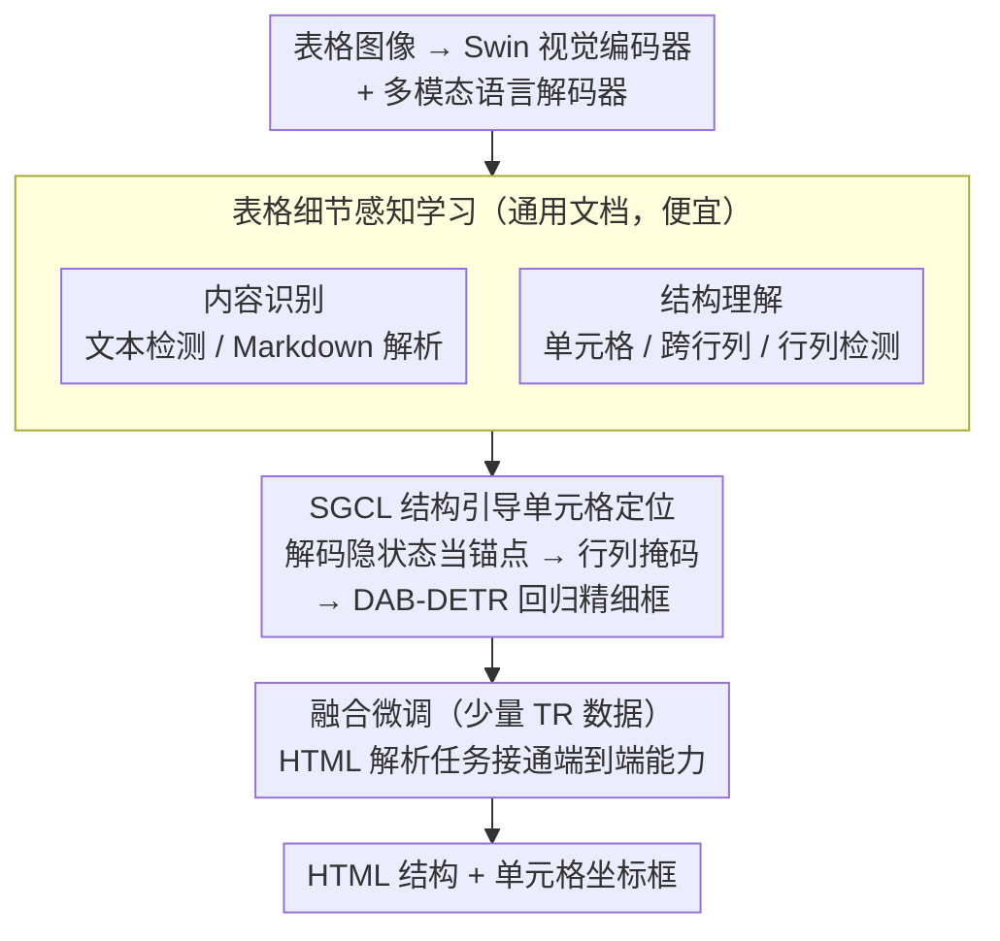

# TDATR: Improving End-to-End Table Recognition via Table Detail-Aware Learning and Cell-Level Visual Alignment

**会议**: CVPR2026  
**arXiv**: [2603.22819](https://arxiv.org/abs/2603.22819)  
**代码**: [github.com/Chunchunwumu/TDATR.git](https://github.com/Chunchunwumu/TDATR.git)  
**领域**: 可解释性  
**关键词**: 表格识别, 端到端, 细节感知学习, 单元格定位, 视觉-语言对齐

## 一句话总结
提出TDATR框架，通过"先感知后融合"策略和结构引导的单元格定位模块，在有限标注数据下实现端到端表格识别，在7个基准上无需数据集特定微调即达到SOTA。

## 研究背景与动机
表格识别(TR)是文档分析的核心任务，需将表格图像转换为HTML等机器可读格式。现有方法主要分两类：
- **模块化TR**：分别建模表格结构(TSR)和内容(TCR)，独立训练后通过后处理融合，但忽略了结构与内容的内在依赖，导致次优整合和误差累积
- **端到端TR**：统一生成结构化输出，但严重依赖大规模TR标注数据，在数据受限场景下泛化能力差；且大多不提供单元格空间对应关系，缺乏可解释性

核心矛盾：端到端方法虽然简化了流程，但TR数据标注成本极高（需同时标注结构和内容），导致现有方法在真实场景多样性表格上表现不佳。

本文切入角度：将TR能力学习解耦为"感知"和"融合"两阶段——先通过多任务预训练获取细粒度表格细节感知能力，再用少量TR数据学习融合，并引入结构引导的单元格定位增强可解释性。

## 方法详解

### 整体框架
TDATR 要解决的问题是：端到端表格识别(TR)虽然流程简洁，却高度依赖昂贵的 TR 专用标注，数据一受限就泛化崩塌，且通常不给出单元格的空间位置、缺乏可解释性。它的破解思路是把"学会识别表格"这件事拆成两步——先**感知**、再**融合**。整条管线由三部分串起来：视觉编码器(Swin Transformer)把表格图像编码成多分辨率特征，多模态语言解码器在统一的语言建模范式下生成结构化文本，结构引导单元格定位(SGCL)模块则从解码过程的隐状态里"长出"每个单元格的精确坐标框。训练上对应 perceive-then-fuse 两阶段：第一阶段在海量通用文档上喂各种感知任务，第二阶段才用少量 TR 数据把感知到的细节融合成端到端的 HTML 输出。

### 关键设计

**1. 表格细节感知学习：用便宜的通用文档数据，预存出昂贵 TR 标注才能给的感知能力**

端到端 TR 的死穴是标注成本——同时标结构和内容代价极高，所以现有方法要么数据不够、要么泛化差。这个设计的做法是绕开 TR 专用数据，在统一的语言建模范式下设计两类自监督/弱监督预训练任务，全部从大规模多源文档(网页、论文、README 等)里取材。一类是**内容识别**任务，包括空间有序文本检测、带框查询的文本检测、Markdown 解析，专门磨练 OCR 与布局理解；另一类是**结构理解**任务，包括单元格检测、跨行跨列检测、行列检测、结构解析，从单元格级和行列级两个粒度建立对表格骨架的感知。这样一来，模型在还没见过几条 TR 标注前，就已经把"哪里是文字、哪里是单元格边界、哪些格子跨行跨列"这些细节摸熟了，后续只需少量 TR 数据点一下"如何把它们拼成完整 HTML"，从根上把数据需求从稀缺的端到端标注转移到了易得的文档数据上。

**2. 结构引导单元格定位(SGCL)：让坐标框从 TR 解码过程里直接长出来，天然与输出对齐**

模块化方法靠后处理把结构和内容对齐，端到端方法又常常干脆不给坐标，可解释性和对齐都成问题。SGCL 的关键在于：不另起炉灶检测单元格，而是直接复用语言解码器的隐状态当锚点。具体地，它从解码器不同层的隐状态里用可学习权重聚合出单元格表示——对每个单元格，在 `<td` 与 `</td>` 两个标记之间做平均池化得到初始表示 $C$。接着把 $C$ 投影到行/列特征空间，用内积算出格子之间的邻接关系，二值化成结构掩码：

$$M_{xy}^k = \mathbb{1}\left[\text{Sigmoid}\left(\langle C_x^k, C_y^k \rangle / \text{dim}(C^k)\right) > 0\right]$$

这个掩码再去引导一轮双向上下文注意力，把 $C$ 增强成结构感知的 $C'$；最后用 MLP 从 $C'$ 回归一个初始框，并借助多分辨率视觉特征 $P'_3$、$P'_4$ 经 DAB-DETR 解码层逐步精细化。整个过程像这样走一遍：解码器吐出 HTML 序列时，每碰到一对 `<td>...</td>` 就对应一个隐状态团块，SGCL 把它当成该单元格的"种子锚点"，先按行列关系互相校准，再让视觉特征把框拉到像素级准确的位置。因为锚点本身就是 TR 输出的隐状态，单元格框和生成序列天然一一对应——既不用后处理拼接，也避开了 DETR 系常用的二分(匈牙利)匹配带来的训练不稳定。

**3. 融合微调阶段：用一个 HTML 解析任务把前一阶段攒下的感知"接通"成端到端能力**

第一阶段攒了一身感知细节，但还没学会"把它们组装成完整表格"。这一阶段就用 HTML 表格解析任务做监督，让模型在生成结构化序列的同时由 SGCL 预测每个单元格的精确坐标。此时模型不再需要海量 TR 数据，而是隐式聚合前一阶段学到的文本、布局、行列结构等细节来完成端到端 TR——这也是为什么它能用远少于基线的微调数据就达到 SOTA。

### 损失函数 / 训练策略
感知阶段：所有任务用交叉熵损失 $L_{ce}$

融合阶段：$L_f = \lambda_{ce} L_{ce} + \lambda_b L_b + \lambda_{iou} L_{iou} + \lambda_m L_m + \lambda_s L_s$
- $L_b$: 单元格回归损失; $L_{iou}$: IoU损失
- $L_m$: 掩码对齐损失(Mask-DINO风格)，增强C'与图像特征的对齐
- $L_s$: 结构引导损失(BCE)，优化行列关系矩阵
- 权重: $\lambda_b=0.05, \lambda_{iou}=0.03, \lambda_m=0.03, \lambda_s=0.05, \lambda_{ce}=1.0$

两阶段各训练3个epoch，使用16×64GB 910B NPU。

## 实验关键数据

### 主实验

| 数据集 | 指标 | TDATR | 之前SOTA | 提升 |
|--------|------|-------|----------|------|
| iFLYTAB-full | TEDS | 93.22 | 84.36 (DeepSeek-OCR) | +8.86 |
| TabRecSet | TEDS | 92.70 | 70.70 (EDD) | +22.00 |
| PubTables-1M | TEDS | 97.97 | 95.48 (Dolphin) | +2.49 |
| PubTabNet | TEDS | 提供了-ft版本进一步提升 | - | - |

### 消融实验

| 配置 | 关键指标 | 说明 |
|------|---------|------|
| 无细节感知学习 | 性能显著下降 | 验证了perceive-then-fuse策略 |
| 无SGCL | TEDS-D增大 | 结构-内容对齐变差 |
| TDATR-ft(PubTabNet额外微调) | TSR/TR均提升 | 确认数据量的收益 |

### 关键发现
- 端到端TR的TSR性能超越了专家TSR模型，证明内容识别对结构识别有正向促进
- 使用远少于基线的微调数据仍达SOTA，验证了解耦学习策略的有效性
- TEDS-Delta(TEDS-TEDS_S)显著优于模块化方法，说明端到端避免了后处理误差累积

## 亮点与洞察
- "先感知后融合"是一个优雅的解耦思路：将难以获取的端到端TR标注需求转化为更容易获取的文档数据预训练 + 少量TR微调
- SGCL模块设计精巧，利用TR解码过程的隐状态作为DAB-DETR的锚点初始化，避免了匈牙利匹配的训练不稳定问题
- 新数据集iFLYTAB-full填补了中文真实场景表格识别评估的空白

## 局限与展望
- 在PubTabNet等数字表格上TSR略逊于最佳专家模型，因为完整TR序列长度约为TSR的两倍，加大了生成难度
- 模型参数量600M，相比大型OCR VLM(Qwen2.5-VL-72B)虽小但仍较大
- 未探索与LLM backbone的集成，可能限制了对复杂文档上下文的理解

## 相关工作与启发
- Dolphin是同类端到端TR方法，TDATR在相同建模方式下超越其2.5%+ TEDS
- 与OmniParser等多解码器方法不同，TDATR用单解码器统一结构和内容生成
- 结构引导定位的思路可推广到其他需要布局-内容对齐的文档理解任务

## 评分
- 新颖性: ⭐⭐⭐⭐ perceive-then-fuse策略和SGCL模块设计新颖
- 实验充分度: ⭐⭐⭐⭐⭐ 7个基准、无数据集特定微调、完整消融
- 写作质量: ⭐⭐⭐⭐ 结构清晰，方法描述详实
- 价值: ⭐⭐⭐⭐ 在数据受限下表格识别的实用性很强

## 补充说明
- 视觉编码器采用Swin Transformer (300M)，语言解码器Transformer (300M)，共600M参数
- SGCL中DAB-DETR解码层数Ld=3，双向增强分支包含2个自注意力块和1个交叉注意力块
- 最大解码长度4096 token，输入图像长边不超过2048像素

<!-- RELATED:START -->

## 相关论文

- [\[CVPR 2026\] SafeDrive: Fine-Grained Safety Reasoning for End-to-End Driving in a Sparse World](safedrive_fine-grained_safety_reasoning_for_end-to-end_driving_in_a_sparse_world.md)
- [\[NeurIPS 2025\] Table as a Modality for Large Language Models](../../NeurIPS2025/interpretability/table_as_a_modality_for_large_language_models.md)
- [\[ICLR 2026\] Stress-Testing Alignment Audits with Prompt-Level Strategic Deception](../../ICLR2026/interpretability/stress-testing_alignment_audits_with_prompt-level_strategic_deception.md)
- [\[CVPR 2026\] Learning complete and explainable visual representations from itemized text supervision](learning_complete_and_explainable_visual_representations_from_itemized_text_supe.md)
- [\[CVPR 2026\] Improving Sparse Autoencoder with Dynamic Attention](improving_sparse_autoencoder_with_dynamic_attention.md)

<!-- RELATED:END -->
