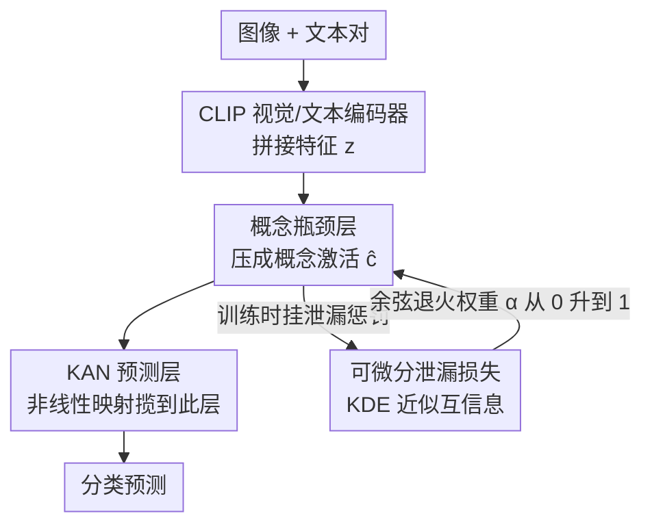

# Towards Faithful Multimodal Concept Bottleneck Models

**会议**: CVPR 2026  
**arXiv**: [2603.13163](https://arxiv.org/abs/2603.13163)  
**代码**: 待确认  
**领域**: 可解释性  
**关键词**: 概念瓶颈模型, 可解释性, 泄漏缓解, KAN网络, 多模态分类

## 一句话总结
提出f-CBM——首个忠实的多模态概念瓶颈模型框架，通过可微分泄漏损失减少概念表示中的非预期信息泄漏，同时用Kolmogorov-Arnold Network (KAN) 预测头提升概念检测精度，在任务准确率、概念检测和泄漏减少间取得最优Pareto前沿。

## 研究背景与动机
**领域现状**：概念瓶颈模型(CBM)通过将预测路由通过人可理解的概念层来提供可解释性，已在视觉和NLP领域广泛研究，但在多模态场景中几乎未被探索。

**现有痛点**：CBM的忠实性面临双重挑战——(a) 概念检测不够准确，(b) 概念表示中存在泄漏(leakage)：任务泄漏(概念编码了超出其语义的任务相关信号)和概念间泄漏(不同概念间编码了非预期的互信息)。

**核心矛盾**：现有方法将概念检测和泄漏缓解作为独立问题处理，改善一方面往往牺牲任务准确率。独立训练协议可减少泄漏但降低性能；残差连接虽吸收遗漏信息但降低了可解释性。

**本文目标**：在多模态场景中同时保证概念检测准确性、泄漏最小化和任务准确率三个目标。

**切入角度**：初步分析发现任务泄漏和概念间泄漏高度正相关，且概念检测精度高的概念泄漏更低——因此同时优化概念检测和任务泄漏即可间接减少概念间泄漏。

**核心 idea**：用可微分的互信息估计做训练时泄漏正则化，加KAN层替代线性层增强预测表达力，联合优化三个目标。

## 方法详解

### 整体框架
f-CBM 要在多模态分类里同时把三件本来互相打架的事做好：概念检测要准、概念表示里不能藏任务信号（泄漏要低）、最终任务准确率不能掉。整条路径是：图像+文本对先各自过 CLIP 的视觉与文本编码器，特征拼成 $z=[f^v(x^v)\|f^t(x^t)]$；$z$ 经概念瓶颈层 $\Phi^C$ 压成一组人可读的概念激活值 $\hat{c}$；最后这组概念激活不再走普通线性层，而是过一个 KAN 层 $\Phi^{\text{kan}}$ 得到分类预测。两处关键改动——瓶颈到预测之间换成 KAN，以及训练时给概念表示挂一个可微分的泄漏惩罚——分别管"表达力够不够"和"有没有偷藏信息"，配合余弦退火让两者按节奏生效。

### 关键设计

**1. 可微分泄漏损失：把"概念是否偷藏了任务信号"变成能反传的训练目标**

CBM 不忠实的核心病根之一是概念-任务泄漏（CTL）——概念激活除了编码自己该有的语义，还偷偷编码了任务标签信号，于是表面可解释、实则预测靠的是藏起来的捷径。问题在于以前衡量泄漏的指标基于离散分箱，分箱这一步切断了梯度，没法直接拿来当训练目标。f-CBM 改用核密度估计（KDE）配高斯核来近似互信息，$\hat{I}(x;y) = N^{-1}\sum_i \log[\hat{p}(x_i|y_i)/\hat{p}(x_i)]$，高斯核让整个估计保持可微、梯度能一路传回概念层。泄漏损失写成预测概念 $\hat{c}$ 与真概念 $c$ 对任务标签互信息之差、再用标签熵 $H(y)$ 归一并平方：

$$\mathcal{L}_{\text{leak}} = \left[\frac{\hat{I}(\hat{c}_i;y)-\hat{I}(c_i;y)}{H(y)}\right]^2$$

平方形式给的是双向梯度——真概念本该携带的那部分任务相关信息要保留，超出这部分的额外泄漏才被惩罚，于是不会矫枉过正把有用语义也压没。

**2. KAN 预测层：从源头堵住"线性层太弱逼概念层补信息"的泄漏**

把瓶颈接预测的那层换成 Kolmogorov-Arnold Network。动机很直接：如果概念到预测之间只是一个线性层，表达力不够，模型为了把任务做对就会反过来逼概念层在激活里多塞信息来补偿——这正是泄漏的来源之一。KAN 的输出 $\Phi_o^{\text{kan}}(x) = s_o \times \sum_{i=1}^{N}\phi_{i,o}(x)$，其中每个 $\phi_{i,o}$ 是一阶三角基函数的线性组合 $\sum_m c_{i,o,m} \cdot B_m(x)$，把非线性映射的活揽到这一层自己来做，概念层就能专心做准确的概念检测而不必兼职藏捷径。而且单层 KAN 没牺牲可解释性——每个概念对应的 $\phi_{i,o}$ 是一条可画出来的响应曲线，反而多给了一个解释维度。实验也印证这条因果链：上了 KAN 后概念检测误差 c-RMSE 从 0.101 降到 0.056，泄漏随之间接下降。

**3. 余弦退火的泄漏损失权重：先学会认概念，再逐步收紧泄漏约束**

泄漏损失的权重 $\alpha$ 沿余弦曲线从 0 退火到 1。如果一开始就用满泄漏惩罚，模型还没把概念检测学利索就被约束拽着走，概念学习阶段会被干扰；让 $\alpha$ 早期接近 0、后期才升到 1，相当于先把概念认准、再回过头把偷藏的信息挤出去，两个阶段不互相绊脚。

### 损失函数 / 训练策略
总损失 $\mathcal{L} = \mathcal{L}_{\text{cls}} + \tilde{\lambda}\mathcal{L}_C + \tilde{\lambda}_{\text{leak}}\alpha\mathcal{L}_{\text{leak}}$，分别对应分类损失、概念检测损失和退火加权的泄漏损失；两个辅助损失的权重 $\tilde{\lambda}$ 用 running mean 动态归一化，避免不同损失量纲悬殊导致某一项主导。CLIP backbone 以 lr=1e-5 微调，新加的线性/KAN 层走余弦退火 schedule、学习率从 0.1 或 0.01 起降。

## 实验关键数据

### 主实验 (N24News数据集, CLIP-base)

| 方法 | %ACC↑ | c-RMSE↓ | CTL↓ | ICL↓ |
|------|-------|---------|------|------|
| Black-box | 98.5 | — | — | — |
| Indep.-CBM | 96.0 | **0.043** | 0.028 | 0.005 |
| Label-free | 98.2 | 1.264 | 0.212 | 0.050 |
| CT-CBM | 98.1 | 0.101 | 0.244 | 0.059 |
| **f-CBM (ours)** | **98.1** | 0.056 | **0.005** | **0.006** |

### 跨数据集和模型规模

| 数据集 | Backbone | f-CBM ACC | f-CBM CTL | f-CBM ICL |
|--------|----------|-----------|-----------|-----------|
| N24News | CLIP-base | 98.1 | 0.005 | 0.006 |
| N24News | CLIP-large | 98.5 | 0.004 | — |
| CUB-200 | CLIP-base | 93.7 | 0.008 | 0.009 |
| AG News | CLIP-base | 90.6 | 0.005 | 0.006 |

### 关键发现
- f-CBM在CTL上比Label-free降低了约40倍，同时保持相当的任务准确率
- KAN层改善概念检测（c-RMSE从0.101降至0.056），间接减少泄漏
- 泄漏损失和KAN层的贡献是互补的——只用其中一个效果不如联合使用
- 初步分析的假设得到验证：减少CTL确实同步降低了ICL
- f-CBM也适用于纯文本数据集（AG News、DBpedia），体现多模态框架的通用性

## 亮点与洞察
- **因果链分析**：通过初步实验发现概念检测精度↔任务泄漏↔概念间泄漏的正相关关系，据此设计"优化两个就能改善第三个"的策略，分析驱动方法设计的典范。
- **KDE可微分互信息估计**：将离散的泄漏量化指标转变为可微分训练目标，这一技巧可推广到其他需要互信息约束的训练场景。
- **KAN的可解释性应用**：KAN不仅提升表达力，其逐概念响应曲线还提供了额外的可解释性维度，一举两得。

## 局限与展望
- KDE估计的计算复杂度为 $O(N^2)$，对大规模概念集可能成为瓶颈
- 概念标注依赖LLM（Claude 4.5 Sonnet）和CLIP相似度，标注质量上限有限
- 仅使用CUB和N24News两个主要数据集，更多领域验证（如医疗、法律）将增强说服力
- 泄漏损失的余弦退火schedule是固定的，自适应schedule可能更优

## 相关工作与启发
- **vs CT-CBM**：CT-CBM用残差连接吸收泄漏信息，训练后移除以恢复可解释性；f-CBM通过泄漏损失从源头减少泄漏，更根本
- **vs Independent-CBM**：独立训练有最低泄漏但任务准确率差；f-CBM通过KAN+泄漏损失在联合训练中接近独立训练的泄漏水平

## 评分
- 新颖性: ⭐⭐⭐⭐ 可微分泄漏损失和KAN预测头的组合新颖且有效
- 实验充分度: ⭐⭐⭐ 数据集种类有限，CUB仅选了15类
- 写作质量: ⭐⭐⭐⭐ 初步分析部分写得好，方法动机清晰
- 价值: ⭐⭐⭐⭐ CBM忠实性是可解释AI的核心问题，多模态扩展有实际意义

<!-- RELATED:START -->

## 相关论文

- [\[CVPR 2026\] Rethinking Concept Bottleneck Models: From Pitfalls to Solutions](rethinking_concept_bottleneck_models_from_pitfalls_to_solutions.md)
- [\[CVPR 2026\] Rounded or Streamlined Head? Bridging Concept Bottleneck Models and Attribute-Described Object Parts](rounded_or_streamlined_head_bridging_concept_bottleneck_models_and_attribute-des.md)
- [\[ICLR 2026\] There Was Never a Bottleneck in Concept Bottleneck Models](../../ICLR2026/interpretability/there_was_never_a_bottleneck_in_concept_bottleneck_models.md)
- [\[AAAI 2026\] Partially Shared Concept Bottleneck Models](../../AAAI2026/interpretability/partially_shared_concept_bottleneck_models.md)
- [\[AAAI 2026\] Flexible Concept Bottleneck Model](../../AAAI2026/interpretability/flexible_concept_bottleneck_model.md)

<!-- RELATED:END -->
