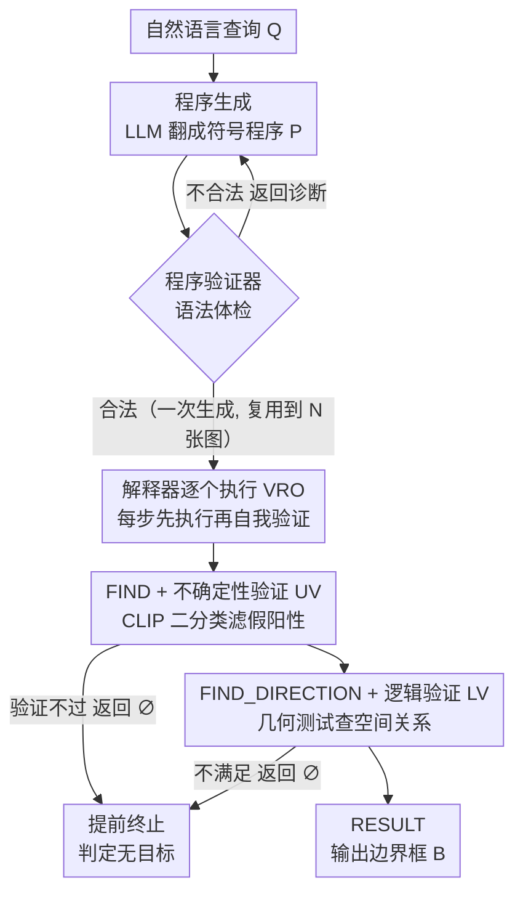

# VIRO: Robust and Efficient Neuro-Symbolic Reasoning with Verification for Referring Expression Comprehension

**会议**: CVPR 2026  
**arXiv**: [2601.12781](https://arxiv.org/abs/2601.12781)  
**代码**: [https://github.com/ml-postech/VIRO-neuro-symbolic-reasoning-with-verification](https://github.com/ml-postech/VIRO-neuro-symbolic-reasoning-with-verification)  
**领域**: 可解释性  
**关键词**: 指代表达理解, 神经符号推理, 算子级验证, 零样本学习, 无目标检测

## 一句话总结
VIRO在神经符号REC管道中嵌入轻量算子级验证机制（CLIP不确定性验证+空间逻辑验证），使每个推理步骤能自我验证并在无目标时提前终止，在零样本设置下以61.1%平衡准确率大幅超越组合推理baselines，同时保持0.3%以下的程序失败率和高效推理速度。

## 研究背景与动机

1. **领域现状**：指代表达理解（REC）旨在根据自然语言描述定位图像中的目标区域。近年来，基于LLM和VLM的神经符号方法通过将查询分解为结构化程序并逐步执行，实现了可解释推理和强大的零样本泛化能力。

2. **现有痛点**：现有组合推理管道假设每一步中间结果都是正确的，但实际上开放词汇检测器（OVD）经常产生高置信度的假阳性（FP）。这些错误会沿推理链级联传播，在没有目标的场景中尤其严重——系统被迫从假阳性中选择一个作为答案（"强制预测"问题）。

3. **核心矛盾**：现有方法缺乏中间推理步骤的验证机制。一方面，OVD生成的候选框可能是视觉或语义相似的假阳性；另一方面，空间关系推理也可能在不满足约束时仍然输出结果。此外，很多系统将大型多模态LLM放在推理内循环中，导致严重的延迟问题，且程序生成与执行紧耦合，每张图都需重新生成推理程序。

4. **本文目标** (a) 如何在推理步骤中嵌入验证以防止级联错误？(b) 如何在无目标场景中正确"弃权"而非强制预测？(c) 如何在保持准确性的同时提高效率和可扩展性？

5. **切入角度**：在每个推理算子内部集成轻量级验证模块——利用CLIP进行不确定性验证过滤OVD假阳性，利用几何测试进行逻辑验证检查空间关系是否成立。

6. **核心 idea**：在神经符号推理管道中让每个算子"先执行再验证"，验证不通过就返回空集并提前终止，从而实现稳健的无目标检测。

## 方法详解

### 整体框架

VIRO要解决的核心矛盾是：现有神经符号REC管道默认每一步中间结果都对，可开放词汇检测器（OVD）经常给出高置信度的假阳性，错误沿推理链级联放大，在"图中根本没有目标"的场景里更被迫从假阳性里硬选一个交差。VIRO的应对是把"验证"下沉到每个推理算子内部，并把程序生成和执行彻底拆开。

整条管道分两阶段。预执行阶段，一个LLM把自然语言查询翻译成由验证推理算子（VRO）串成的符号程序 $P = (o_1, o_2, \dots, o_T)$，再交给程序验证器做一遍语法体检。执行阶段，解释器在图像上从头到尾跑这串算子，每个算子跑完都做一次自我验证——只要某步验证不过就立刻返回空集 $\varnothing$ 并掐断整条管道。于是最终输出要么是一个定位到的边界框，要么是空集（判定无目标），把REC的输出形式化为 $Y = B$ 或 $Y = \varnothing$ 两种结果。

### 关键设计

**1. 验证推理算子（VRO）：让每一步推理自带验证开关**

传统组合推理把算子当成纯执行单元，结果对不对要等到管道末端才知道，错误早已扩散。VIRO定义了一个有限算子集合作为推理积木，分四类——识别算子（FIND、PROPERTY）、绝对空间算子（LOCATE、SIZE、ORDER）、相对空间算子（FIND_DIRECTION、FIND_NEAR、FIND_INSIDE）、终止算子（RESULT）。关键改动在于：每个算子不只执行推理动作，还要自我验证执行结果，验证条件不满足就返回 $\varnothing$ 触发提前终止。验证放在算子级别而非管道末端，意味着错误在最早的出错点就被掐断、不会再往下级联，同时"无目标"这种情况能借提前退出高效结束，而不必把整条链跑完。

**2. 不确定性验证（UV，嵌在 FIND 算子里）：用 CLIP 当二分类器筛掉假阳性**

OVD（如GroundingDINO）在开放词汇下特别容易对视觉/语义相似但不对的物体给高分，光看检测置信度拦不住。UV的做法是对每个OVD候选框 $B_j$ 裁出对应图像区域 $I_j$，预先挑 $K$ 个常见类别当负锚点，再用CLIP算一个验证分数：

$$S(l|I_j) = \frac{1}{K}\sum_{k=1}^K \frac{\exp(\text{sim}(I_j, l)/\tau)}{\exp(\text{sim}(I_j, l)/\tau) + \exp(\text{sim}(I_j, c_k)/\tau)}$$

也就是把"候选标签 $l$ vs 每个负锚点 $c_k$"逐一做二分类、取平均概率。分数低于阈值 $\delta_l$ 的候选框被滤掉。这里用的是CLIP的判别能力而非检索能力——它当二分类器开销极小，却能把那些"长得像但不是"的假阳性按下去。为抵消CLIP对不同标签的内在偏好，阈值 $\delta_l$ 不是全局一刀切，而是在ImageNet上逐标签校准得到。

**3. 逻辑验证（LV，嵌在 FIND_DIRECTION 算子里）：让空间关系也要过几何测试**

即便候选框都通过了UV，空间关系本身仍可能不成立——查询说"大象左边的人"，可图里那个人偏偏不在大象左边。LV对所有输入候选做几何测试，逐个检查目标候选相对参考目标是否真满足指定的方向关系，不满足就返回空集。这一步把"实体对了但位置不对"的错误又过滤掉一层，和UV分别守住识别与空间两道关口。

**4. 程序生成与受限验证循环：把运行时错误压到 0.3% 以下**

LLM偶尔会吐出语法不合法的程序。VIRO用Qwen2.5-72B-Instruct-AWQ做few-shot生成 $P = \text{LLM}(Q|m)$，再让程序验证器查语法；一旦不过就回一条简洁的诊断反馈，触发LLM自我修正。能压住失败率的真正原因是算子空间受限——VIRO只允许在固定的符号结构里组合，而不像ViperGPT那样生成开放的Python代码，搜索空间一窄，运行时报错就大幅减少，程序失败率降到0.3%以下。

**5. 解耦式架构：把延迟从乘法降成加法**

把程序生成和执行绑死，会导致每张新图都要重跑一遍LLM生成。VIRO反其道而行：一个查询只生成一次程序，然后在全部 $N$ 张图像上复用，总耗时是 $T_{\text{total}} = T_{\text{pre}} + N \times T_{\text{exec}}$——生成开销 $T_{\text{pre}}$ 只摊一次，图越多越划算。这正对上机器人视觉搜索这类"一句话查询、要在大量图像里找"的实际场景；相比之下HYDRA和NAVER每张图都重新生成程序，延迟随图像数乘法式膨胀。

### 一个完整示例：在"无大象"的图里查询"大象左边的人"

设查询是"the person to the left of the elephant"，图中其实没有大象。LLM先把它翻成程序：`FIND(elephant) → FIND_DIRECTION(person, left) → RESULT`，程序验证器确认语法合法后进入执行。第一个 `FIND(elephant)` 让OVD检测，假设它误把一头灰色的牛以高置信度当成大象返回一个候选框；UV立刻裁出该区域用CLIP打分，"elephant vs {cow, horse, ...}"的平均概率低于校准阈值 $\delta_{\text{elephant}}$，这个假阳性被滤掉，FIND返回 $\varnothing$。由于参考目标已为空，管道在这里直接提前终止、不再去跑 `FIND_DIRECTION`，最终输出空集，正确判定"无目标"。对照之下，没有验证的旧管道会拿那个假大象继续往下推，被迫从错误前提里硬选出一个人交差——这正是VIRO在gRefCOCO的TNR从7.5%提到50.2%所修掉的失败模式。

## 实验关键数据

### 主实验

| 数据集/分割 | 指标 | VIRO | 之前SOTA (组合推理) | 提升 |
|--------|------|------|----------|------|
| gRefCOCO+RefCOCO TestA | Balanced Acc. | 61.1% | 35.2% (HYDRA) | +25.9 |
| gRefCOCO TestA | TNR (N-acc) | 50.2% | 7.5% (HYDRA) | +42.7 |
| RefCOCO TestA | TPR (Acc@0.5) | 71.9% | 66.7% (ViperGPT) | +5.2 |
| RefCOCO TestA | 程序失败率 | 0.07% | 3.45% (ViperGPT) | 大幅降低 |
| RefCOCO TestA | 执行延迟 | 0.71s | 1.49s (ViperGPT) | 2.1× 更快 |
| RefEgo (全帧) | ACC@0.5+n | 51.9% | 23.0% (ViperGPT) | +28.9 |

### 消融实验

| 配置 | Balanced Acc. | TNR | TPR | 说明 |
|------|---------|------|------|------|
| Detector-only | 40.0% | 22.8% | 57.1% | 仅OVD |
| + Operators | 56.8% | 38.9% | 74.6% | +组合推理算子 |
| + LV | 57.0% | 39.3% | 74.6% | +逻辑验证 |
| + UV (fixed) | 58.8% | 43.1% | 74.4% | +不确定性验证(固定阈值) |
| + UV (adaptive) | 61.1% | 50.2% | 71.9% | +自适应阈值(完整模型) |

### 关键发现
- 组合推理算子本身贡献最大（Balanced Acc +16.8），UV验证对无目标检测提升显著（TNR +11.3），但存在TPR-TNR trade-off
- 自适应阈值比固定阈值在TNR上提升7.1%但TPR下降2.5%，反映精度-召回权衡
- 在1-query-N-images场景中，VIRO和ViperGPT因解耦架构而优于HYDRA/NAVER，但VIRO执行延迟更低
- CLIP backbone选择：ViT-H/14比ViT-L/14 TPR高3.1%但执行延迟增加29%

## 亮点与洞察
- **算子级验证是关键创新**：不是在整个管道末端验证，而是在每个推理步骤内部"执行+验证"，这是同类方法中首次实现的设计，使得错误在源头被捕获
- **CLIP作为轻量二分类验证器**：巧妙利用CLIP的判别能力（而非通常的检索能力），通过与负锚点集合的逐一比较计算验证分数，计算开销极小但效果显著
- **无目标检测作为"弃权"而非"分类"**：通过空集返回机制自然实现，无需额外的无目标检测训练，这个设计理念可迁移到任何需要"拒绝回答"的视觉推理系统

## 局限与展望
- TPR和TNR存在固有trade-off——提升无目标检测能力会牺牲有目标情况下的准确率（TPR从74.6%降到71.9%）
- 依赖固定的算子集合，面对复杂查询时覆盖能力有限（如涉及动作、时间等更复杂语义时可能需扩展算子集）
- CLIP验证使用ImageNet校准阈值，对领域外数据的泛化能力有待验证
- 逻辑验证目前仅限于简单几何测试，更复杂的空间关系（遮挡、相对大小等）可能需更强的推理机制

## 相关工作与启发
- **vs ViperGPT**: ViperGPT生成开放Python代码但缺乏验证，程序失败率3.45%；VIRO用受限算子+验证器将失败率降到0.07%，同时TPR更高
- **vs HYDRA/NAVER**: 这两者将程序生成与执行紧耦合，导致每张图重新生成推理程序，且依赖大型多模态LLM，延迟和失败率都远高于VIRO
- **vs 监督式REC (GREC-UNINEXT)**: VIRO在无目标检测上接近甚至超越需要无目标标注训练的监督方法，展示了零样本方法的潜力

## 评分
- 新颖性: ⭐⭐⭐⭐ 算子级验证+弃权机制是组合推理REC中的重要创新，但整体思路较直觉
- 实验充分度: ⭐⭐⭐⭐⭐ 覆盖多个标准REC基准+无目标基准+视频基准+效率+可扩展性+全面消融
- 写作质量: ⭐⭐⭐⭐ 清晰的问题定义和方法阐述，图表丰富
- 价值: ⭐⭐⭐⭐ 在实际应用中（机器人搜索、无目标检测）有重要意义，填补了组合推理方法的关键空白

<!-- RELATED:START -->

## 相关论文

- [\[AAAI 2026\] Attention as Binding: A Vector-Symbolic Perspective on Transformer Reasoning](../../AAAI2026/interpretability/attention_as_binding_a_vector-symbolic_perspective_on_transformer_reasoning.md)
- [\[ICML 2026\] IQA-Spider: Unifying Multi-Granularity Image Quality Assessment with Reasoning, Grounding and Referring](../../ICML2026/interpretability/iqa-spider_unifying_multi-granularity_image_quality_assessment_with_reasoning_gr.md)
- [\[ICML 2026\] Towards Long-Horizon Interpretability: Efficient and Faithful Multi-Token Attribution for Reasoning LLMs](../../ICML2026/interpretability/towards_long-horizon_interpretability_efficient_and_faithful_multi-token_attribu.md)
- [\[NeurIPS 2025\] Efficient Vision-Language Reasoning via Adaptive Token Pruning](../../NeurIPS2025/interpretability/efficient_vision-language_reasoning_via_adaptive_token_pruning.md)
- [\[CVPR 2026\] Beyond Top Activations: Efficient and Reliable Crowdsourced Evaluation of Automated Interpretability](beyond_top_activations_efficient_and_reliable_crowdsourced_evaluation_of_automat.md)

<!-- RELATED:END -->
