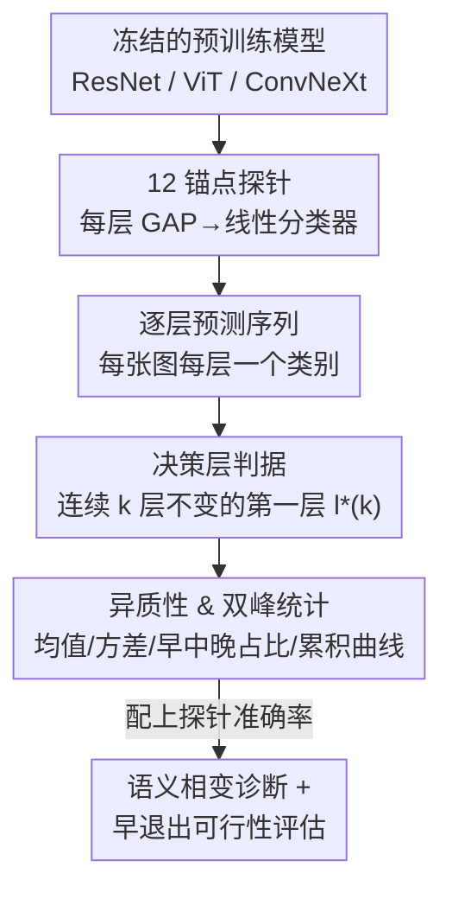

# When Do Models Actually Decide? Mapping the Layer-Wise Decision Timeline in Pretrained Neural Networks

**会议**: CVPR 2026  
**论文**: [CVF Open Access](https://openaccess.thecvf.com/content/CVPR2026/html/Lee_When_Do_Models_Actually_Decide_Mapping_the_Layer-Wise_Decision_Timeline_CVPR_2026_paper.html)  
**代码**: 待确认  
**领域**: 可解释性 / 表示分析  
**关键词**: 决策时间线, 线性探针, 早退出, 语义相变, ImageNet

## 一句话总结
作者在 ResNet-18/50/101（外加 ViT-B/16、ConvNeXt-Tiny）的每个锚点层训练线性探针，追踪每张 ImageNet 图像的预测在第几层"定下来"，发现网络存在强烈的双峰决策分布和集中在最后残差阶段的"语义相变"，并据此泼了一盆冷水：基于稳定性的早退出几乎换不到真实的加速—精度收益。

## 研究背景与动机
**领域现状**：深度网络通常被当成一个"黑箱整体"——任何输入都要走完全部 50 层。一类提升效率的工作是早退出网络（early exit），在中间层加可训练的出口分支 + 门控模块，让简单样本提前出网络。另一条线是探针（probing），用冻结的中间激活训练轻量分类器，看每层"编码了什么信息"。

**现有痛点**：早退出方法都要改架构、加专门的训练目标和门控，问的是"我们能不能造一个早退出系统"；而探针方法问的是"某层编码了什么属性"。两者都没有直接回答一个更基础的问题：在**未经改动**的预训练模型里，预测到底在**第几层自然地稳定下来**？

**核心矛盾**："信息何时被编码"（what is encoded）和"决策何时形成"（when decisions crystallize）是两回事。一个层的表示可能和下一层很相似（CKA 高），但这并不说明分类决策已经定型；探针准确率高也只说明类别可分，不说明模型已经"拿定主意"。缺一个直接刻画**决策时刻**的工具。

**本文目标**：把探针方法从"测 what"改造成"测 when"——对每张图像，找出它的预测类别在哪一层开始保持不变；再用这个量去刻画不同样本、不同架构在计算需求上的异质性，以及它对早退出到底意味着什么。

**切入角度**：用"取证式分析"（forensic analysis）的视角——不动 base model、不加任何训练目标，只在固定锚点层上挂探针，观察预测如何随深度演化。这样得到的是模型**内在的**决策时间线，而不是被外部训练目标塑造出来的。

**核心 idea**：在每层挂线性探针，把"预测连续 $k$ 层不变的第一层"定义为该样本的决策层 $l^*(k)$，用它统计性地画出整个数据集的逐层决策时间线。

## 方法详解

### 整体框架
整套方法是一个诊断流水线：拿一个冻结的预训练分类器 → 在 12 个代表性锚点层挂线性探针 → 单次前向时用 forward hook 抽出每层激活 → 每层给出一个预测 → 按"连续 $k$ 层预测不变"判定每张图的决策层 → 在整个 ImageNet 验证集上统计决策层分布、双峰结构、对稳定性准则的敏感度，并评估这些异质性能否转化为真实早退出收益。输入是一张图，输出不是一个新模型，而是一组**关于"模型何时决策"的统计画像**。

对每个架构，取 12 个锚点（$T+1=12$，故 $T=11$）：ResNet 取 stem、各 stage 残差末端、最后的池化层；ViT-B/16 与 ConvNeXt-Tiny 取深度匹配的锚点，保证都能在统一的 12 锚点粒度上对比。卷积层产生空间特征图 $h^{(l)}\in\mathbb{R}^{B\times C\times H\times W}$ 时，先做全局平均池化得到定长向量：

$$\bar h^{(l)}=\frac{1}{HW}\sum_{i=1}^{H}\sum_{j=1}^{W} h^{(l)}_{:,:,i,j}\in\mathbb{R}^{B\times C}$$

### 关键设计

**1. 决策层判据与稳定性窗口 $k$：把"何时决策"变成可量化的第一稳定层**

这是全文的核心定义，针对的痛点是"决策何时形成"此前根本没有可操作的度量。对图像 $i$，令 $\hat y^{(l)}_i=\arg\max_c P_l(\bar h^{(l)}_i)_c$ 为第 $l$ 个锚点上探针的预测类别，决策层 $l^*_i(k)$ 定义为预测在长度 $k$ 的持续窗口内首次保持不变的锚点：

$$l^*_i(k)=\min\Big\{\, l\in\{0,\dots,T-k\}:\ \hat y^{(l)}_i=\hat y^{(l+1)}_i=\dots=\hat y^{(l+k)}_i \,\Big\}$$

若不存在这样的锚点，则按约定令 $l^*_i(k)=T$——也就是说，终端锚点 $T$ 同时充当"从不稳定样本"的兜底桶（fallback bucket），并不总代表一个真·晚决策。超参 $k$ 控制严格度：$k=1$ 只要求相邻一步一致，$k=4$ 要求连续四个锚点预测都不变，从而过滤掉"先一致、后又变卦"的瞬态一致。关键的诚实之处在于：**稳定 ≠ 正确**——早层可能给出"稳定但错误"的预测（探针准确率很低却已经定型），所以作者同时追踪探针准确率 $\alpha^{(l)}=\frac1N\sum_i \mathbb{1}[\hat y^{(l)}_i=y_i]$，用来区分"稳定且错"和"稳定且对"。

**2. 线性探针：只测表示内在可分性，不让探针自己"加戏"**

每层训练一个线性探针 $P_l:\mathbb{R}^C\to\mathbb{R}^{1000}$，$P_l(\bar h^{(l)})=W_l\bar h^{(l)}+b_l$，对 ImageNet 1000 类做交叉熵最小化。之所以坚持**线性**，是为了保证测到的性能反映的是表示 $h^{(l)}$ 的内在类别可分性，而不是探针本身的容量——非线性探针会把"决策何时形成"和"探针有多强"混在一起。训练用验证集的 70% 做训练、30% 留出评估泛化；SGD 动量 $\mu=0.9$、初始学习率 $\eta_0=0.1$、权重衰减 $10^{-4}$、最多 100 epoch + 早停（patience 10）。较高学习率 + 较长训练保证探针不欠拟合、能逼近其最优表现，早停又防止过拟合。

**3. 异质性与双峰的量化：均值会骗人，要看分布形状**

针对"网络是否对所有样本一视同仁"，作者用一组统计量刻画决策层分布：均值 $\mu_k=\frac1N\sum_i l^*_i(k)$、中位数、标准差 $\sigma_k=\sqrt{\frac1N\sum_i (l^*_i(k)-\mu_k)^2}$。$\sigma_k$ 大说明计算需求高度异质。再按相对深度把样本分三类：$l^*_i(k)<0.3T$ 为**早决策**、$0.3T\le l^*_i(k)<0.7T$ 为**中**、$l^*_i(k)\ge 0.7T$ 为**晚决策**，对应占比 $f_{\text{early}},f_{\text{mid}},f_{\text{late}}$。三者质量接近 = 均衡分布；早晚两端高、中间空 = 双峰。配合累积决策曲线 $F_k(l)=\frac1N\sum_i \mathbb{1}[l^*_i(k)\le l]$ 看"到第 $l$ 层有多少样本已稳定"：早期陡升说明很多样本早早定型，终端处的大跳变则提示有大量"从不稳定"样本被兜底分配到 $T$。这套量化是后面所有结论的基础——比如均值 5.51 其实卡在两团质量中间，单看会被误导。

### 损失函数 / 训练策略
探针训练目标就是逐层独立的交叉熵；base model 全程冻结、不参与梯度更新。$k$ 在 $\{1,2,3,4\}$ 上扫描以测敏感度。所有实验单卡、batch size 256。额外地，作者在轻量损坏（高斯噪声、高斯模糊、亮度扰动，severity 1–2）下重测 $k=2$ 的决策层，看时间线在分布偏移下是否稳定。

## 实验关键数据

数据集：完整 ImageNet 验证集 50,000 张；预处理 resize 256→center crop 224→标准归一化。主研究对象是 torchvision 的 ResNet-18/50/101，扩展验证 ViT-B/16 与 ConvNeXt-Tiny。

### 主结果：语义相变与双峰结构（ResNet，$k=2$）

| 架构 | 末层探针准确率 | 早决策占比 | 晚/兜底占比 | 均值决策层 |
|------|--------------|-----------|------------|-----------|
| ResNet-18 | 64.8% | 22.5% | 53.9% | 7.40 |
| ResNet-50 | ~74% | 38.6% | 42.2% | 5.51 |
| ResNet-101 | 75.2% | 33.3% | 38.9% | 5.5–5.6 |

探针准确率呈**相变**而非渐进：ResNet-50 从 L0 的 0.6% 缓慢爬到 L8 的 4.9%，到 L9 骤跳至 46.7%，末层约 74%；ResNet-101 类似（6.1%→60.6%→75.2%）。也就是说 L0–L8 在搭"非判别性的特征底座"，真正的语义工作挤在 L9–L11 这个窄窗口。

### 稳定性敏感度：$k$ 一变，决策图景全变

| 架构 | 均值@k=1 | k=2 | k=3 | k=4 | 倍数 |
|------|---------|------|------|------|------|
| ResNet-50 | 2.86 | 5.51 | 7.84 | 9.10 | 3.2× |
| ResNet-18 | 4.12 | 7.40 | 9.24 | 10.00 | 2.4× |

ResNet-50 的早决策占比从 $k=1$ 的 67.7% 暴跌到 $k=4$ 的 15.4%，晚决策从 9.4% 升到 79.0%——52 个百分点从早迁到晚。标准差也随 $k$ 先升后降（ResNet-50：2.94→4.10→4.38→3.81），说明适度加严会暴露更多异质性，过严则把样本都塞进兜底桶反而压缩了分布。

### 跨架构与分布偏移（$k=2$，Table 1）

| 模型 | 末层探针 | 均值决策层 | 早/晚/从不稳定 | 决策层稳定但错率 | 损坏下决策深度变化 $\Delta\bar d$ |
|------|---------|-----------|---------------|----------------|-------------------------------|
| ResNet-50 | 0.737 | 5.51 | 39% / 42% / 18% | 59.7 | +0.71 |
| ViT-B/16 | 0.808 | 4.98 | 40% / 24% / 7% | 53.3 | +0.01 |
| ConvNeXt-T | 0.793 | 9.51 | 5% / 87% / 62% | 30.3 | +0.27 |

（注：从不稳定是晚/兜底桶的子集，三个百分比不要求加和为 100%。）

### 关键发现
- **早退出的负面结论**：纯稳定性门控只有 34.68% 准确率 @ 28.73 ms；要把准确率拉回 73.65% 就得用置信度阈值，延迟 49.13 ms，几乎等于全深度基线（76.15% @ 49.46 ms）。Pareto 前沿近乎垂直——想保住精度就得算到底。根因正是"稳定 ≠ 正确"：早层探针准确率 <10%，早稳定的预测大多是"自信地答错"。
- **均值会骗人**：ResNet-50 的晚侧质量主要堆在 L9（23.54%）和终端 L11 兜底桶（17.63%），中间 L4–L7 只占 19.18%；均值 5.51 卡在两团质量中间，必须看完整分布才不被误导。
- **晚语义巩固跨家族普适，但分布强烈依赖架构**：ViT-B/16 决策最浅（4.98）、ConvNeXt-Tiny 极度偏晚（87% 晚、62% 从不稳定）。决策时间线也不是干净 ImageNet 的固定属性——轻度损坏下 ResNet-50 漂移 +0.71 个锚点，ViT 几乎不动（+0.01）。

## 亮点与洞察
- **把"决策时刻"做成一个可操作的量**：$l^*(k)$ 这个定义简单却抓住了"模型何时拿定主意"，且严格区分于"信息何时被编码"和"表示何时相似"，是探针方法论的一个干净延伸。
- **稳定 vs 正确的解耦**：同时追踪稳定性和探针准确率，揭示了"稳定但错"这一关键现象——这是后面早退出失败结论的根，也是最有价值的"啊哈"点。
- **诚实的负面结果**：作者没有为了卖点把异质性包装成"免费加速"，而是明确指出 stability-based 早退出的天花板，并把它转化为对未来工作的指引（学习型门控 / 置信度校准 / 多个语义巩固点的架构）。
- **可迁移**：这套 12 锚点 + 决策层 + 双峰统计的诊断框架可直接搬到任意冻结模型上，做"该不该早退出 / 哪些层值得压缩"的体检；也解释了迁移学习——早层是通用底座，微调主要动晚期语义层。

## 局限与展望
- **作者承认的局限**：主研究集中在卷积架构，ViT/ConvNeXt 只是小规模跨家族扩展；只在 ImageNet 上分析，专门领域可能更偏早退出；门控策略只用了简单启发式，学习型门控也许能换更好的折中。
- **自己发现的局限**：决策层只看"预测类别是否不变"，对类别数极多、长尾时可能噪声较大；锚点只取 12 个（且 ResNet 与 ViT 的"深度匹配"本身有主观性），粒度变化可能影响早/中/晚占比；终端兜底桶把"从不稳定"和"真·晚决策"混在 $T$，使晚侧占比偏高，需谨慎解读。
- **改进思路**：把单一稳定性判据换成"稳定 + 探针置信度达标"的联合判据，或训练一个轻量门控网络从早层特征预测"决策就绪度"，有望真正跨过稳定—正确的鸿沟。

## 相关工作与启发
- **vs 早退出网络（JEI-DNN / ClassyNet / Jazbec et al.）**：他们加可训练出口分支和门控、改架构换效率；本文不改模型、只做取证式分析，揭示已部署模型的内在决策异质性，并给出"为什么简单早退出不灵"的诊断——是给早退出设计提供原则性指引，而非又一个早退出系统。
- **vs 标准探针（Alain & Bengio 等）**：他们测"某层编码了什么属性（what）"；本文把探针改造成测"预测何时定型（when）"，并加上稳定性窗口 $k$ 这一时间维度。
- **vs 表示相似度分析（CKA / SVCCA / CCA）**：它们测层间表示有多相似，但相似不等于决策已形成；本文直接追踪预测形成，是对相似度分析的互补，对分类任务给出更直接的冗余度量。

## 评分
- 新颖性: ⭐⭐⭐⭐ 把探针从"测 what"转成"测 when"，并用诚实的负面结果重新审视早退出，视角清新。
- 实验充分度: ⭐⭐⭐⭐ 全 ImageNet 验证集、三档 ResNet + 两类异架构、$k$ 扫描与轻度损坏，覆盖到位；缺多数据集/多任务验证。
- 写作质量: ⭐⭐⭐⭐ Observation–Mechanism–Interpretation 结构清晰，对"均值误导""稳定≠正确"等陷阱交代得很坦诚。
- 价值: ⭐⭐⭐⭐ 给早退出和模型压缩研究提供了可操作的诊断框架与一记必要的冷水，方法可直接复用。

<!-- RELATED:START -->

## 相关论文

- [\[CVPR 2026\] Hidden Monotonicity: Explaining Deep Neural Networks via their DC Decomposition](hidden_monotonicity_explaining_deep_neural_networks_via_their_dc_decomposition.md)
- [\[ICLR 2026\] Modal Logical Neural Networks for Financial AI](../../ICLR2026/interpretability/modal_logical_neural_networks_for_financial_ai.md)
- [\[ICML 2025\] On the Effect of Uncertainty on Layer-wise Inference Dynamics](../../ICML2025/interpretability/on_the_effect_of_uncertainty_on_layer-wise_inference_dynamics.md)
- [\[ICLR 2026\] Addressing Divergent Representations from Causal Interventions on Neural Networks](../../ICLR2026/interpretability/addressing_divergent_representations_causal.md)
- [\[ICLR 2026\] SALVE: Sparse Autoencoder-Latent Vector Editing for Mechanistic Control of Neural Networks](../../ICLR2026/interpretability/salve_sparse_autoencoder-latent_vector_editing_for_mechanistic_control_of_neural.md)

<!-- RELATED:END -->
