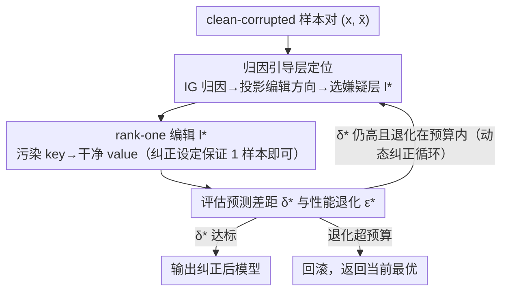

# Attribution-Guided Model Rectification of Unreliable Neural Network Behaviors

**会议**: CVPR 2026  
**arXiv**: [2603.15656](https://arxiv.org/abs/2603.15656)  
**代码**: 无  
**领域**: 知识编辑  
**关键词**: rank-one model editing, 归因分析, 后门防御, 虚假相关, 模型纠正

## 一句话总结
提出归因引导的动态模型纠正框架，将rank-one model editing从领域适配重定位为行为纠正，通过Integrated Gradients量化各层可编辑性自动定位嫌疑层，仅需1个清洁样本即可修复后门攻击、虚假相关和特征泄漏三类不可靠行为。

## 研究背景与动机

**领域现状**：神经网络在面对分布不一致时表现出不可靠行为，包括后门触发器（neural Trojans）、虚假相关（spurious correlations）和特征泄漏（feature leakage），严重影响模型在安全关键场景中的部署。

**现有痛点**：主流修复策略依赖数据清洗+模型重训，计算和人工代价巨大。Rank-one model editing已在生成/判别模型中展现知识编辑能力，但用于领域适配时存在两个结构性瓶颈：(1) out-of-span残差——新key $k^*$ 不在训练key span内导致已有关联被破坏（Lemma 1）；(2) 样本复杂度——分布偏移下需大量样本精确估计key（Lemma 2）。

**核心矛盾**：现有模型编辑方法固定在最后特征层操作（因其编码高层语义），但实验表明不同层的可编辑性差异显著——对ResNet-18各层分别做rectifying后排名差异可达数倍（Fig. 2），没有哪一层是普遍最优的。

**要解决什么**：(1) data-efficient条件下（甚至仅1个清洁样本）修复模型不可靠行为；(2) 自动定位导致不可靠行为的最关键层，而非手动指定固定层。

**切入角度**：将rank-one editing从"领域适配"重新定位为"行为纠正"（rectification），利用模型训练时已见过clean-corrupted对的结构性质绕开标准编辑的理论瓶颈；再用归因方法量化各层可编辑性作为层选择依据。

**核心idea**：计算corrupted→clean路径上各层Integrated Gradients归因，投影到rank-one编辑方向得到可编辑性标量得分，选得分最高层进行编辑，迭代执行直至行为纠正完成。

## 方法详解

### 整体框架
这篇论文要解决的是：模型已经训坏了——藏着后门触发器、学了虚假相关、或者把无关特征当成判别依据——但你既不想重新收集数据训一遍，手头甚至只有一两个干净样本。作者的整体思路是把已有的 rank-one model editing 拿来当"行为纠正"工具，但不再像以前那样固定改最后一层，而是先用归因找出"哪一层最该改"，改完再看效果，没改干净就接着找下一层改。

具体到一次循环里有三件事在转：先给定一对样本——被污染的 $\tilde{x}$ 和它对应的干净版 $x$——以 $\tilde{x}$ 为参考点、用 Integrated Gradients 算出每一层对"从坏行为变回好行为"的归因 $M^l(x, \tilde{x})$；再把这个归因投影到 rank-one 的编辑方向上、压成一个标量可编辑性得分 $\hat{G}_l = \|M^{*,l}\|_F$，得分最高的那层 $l^* = \arg\max_l \hat{G}_l$ 就是这一轮的"嫌疑层"；最后对 $l^*$ 做一次 rank-one 权重更新，把"污染 key → 干净 value"这条新关联焊进去。整个三步外面套一个 while 循环：每轮重新定位、重新编辑，直到污染样本和干净样本的预测差距 $\delta^*$ 降到阈值以下，或者累计的性能退化触到预算 $\epsilon$ 才停。

### 关键设计

**1. 纠正设定的理论优势：为什么"1 个样本就够"不是运气（Rectifiability & Span-Aligned Control）**

rank-one editing 直接搬到分布偏移的领域适配上会撞两堵墙：新 key $k^*$ 落在训练 key 张成的 span 之外，编进去会带一截 out-of-span 残差、把原有的 key-value 关联一并扯坏（Lemma 1）；而且分布一偏，想精确估出 key 就得喂大量样本（Lemma 2）。作者的关键观察是：行为纠正这个设定天生没有这两个毛病。因为模型训练时**本来就见过**干净样本和被污染的样本，污染 key $k^*$ 自然落在训练 key 的 span 内（Proposition 4.1, Rectifiability），out-of-span 残差直接消失，已有关联不被破坏；又因为干净-污染是成对监督（paired supervision），key 的估计误差趋于零，不再靠样本量堆精度（Proposition 4.2, Span-Aligned Control）。这两条命题正是"仅 1 个清洁样本即可修复"在结构上的理论支撑——把任务从"领域适配"重定位成"行为纠正"，等于一开始就绕开了标准编辑的两个瓶颈，而不是靠技巧硬补。

**2. 归因引导的层定位：不是问"哪层重要"，而是问"改哪层最有效"（Attribution-Guided Layer Localization）**

老方法固定编辑最后一层，理由是它编码高层语义；但作者在 ResNet-18 上逐层做纠正后发现各层可编辑性差出几倍，没有哪一层普遍最优（Fig. 2）。要自动选层，第一步是衡量每层对坏行为的贡献：以污染 $\tilde{x}$ 为 reference、干净 $x$ 为 input 算 IG 归因 $M^l_i(x, \tilde{x}) = (f_l(x_i) - f_l(\tilde{x}_i)) \cdot \int_0^1 \frac{\partial f(\hat{x})}{\partial f_l(\hat{x}_i)} \, d\alpha$，并借 Completeness 公理（Lemma 3：各层归因之和恒等于输出变化 $f(x)-f(\tilde{x})$）让不同层的归因落在同一把尺子上、可以横向比。但仅有归因大小还不够——它只回答"这层对坏行为有多重要"，回答不了"我编辑这层能压下去多少坏行为"。所以作者把归因再投影到实际的编辑方向上：

$$M^{*,l} = M^l \cdot (C^{-1}k^*)^T$$

取它的 Frobenius 范数作为可编辑性得分。这一步"归因 × 编辑方向"的交叉信号才是关键——它直接对应一阶下降系数 $G_l$，即沿这个编辑方向走一步、坏行为指标下降的速率，因此选得分最高的层等价于选"单步收益最大"的层，而不是单纯选最显眼的层。

**3. 动态模型纠正框架：编完一层再看，让瓶颈层逐个浮现（Algorithm 1）**

只编辑一次往往不够：改完一层，模型整体状态变了，原本排第二、第三的层可能反而成了新的主瓶颈。所以作者不做"一锤子买卖"，而是把定位+编辑塞进 while 循环。每轮先检查预测差距 $\delta^* = f(x) - f(\tilde{x})$ 是否还高于目标 $\delta$、且累计性能退化 $\epsilon^*$ 还没超预算；若是，就用设计 2 重新定位嫌疑层、做 $T$ 个 epoch 的 rank-one 编辑，然后评估编辑后的模型——退化可接受就保留这次编辑、进入下一轮重新定位，退化超标就回滚这步并返回当前最优结果。这样多层修复路径是被"逐步探索"出来的，而不是预先指定固定层数；动态版相比只改最后层的静态版，在所有场景中都更稳（CIFAR-10 后门、$n=1$：ASR 2.57→1.34、OA 92.93→93.65）。

### 一个完整示例：CIFAR-10 上用 1 个样本拆后门

以 ResNet-18 被植入后门为例（干净准确率 OA=93.67，但攻击成功率 ASR=99.94，几乎一触即中）。手头只有一对样本：贴了触发器的 $\tilde{x}$ 和它去掉触发器的干净版 $x$。

- **第 1 轮定位**：以 $\tilde{x}$ 为参考算各层 IG 归因，再投影到编辑方向得到每层的可编辑性得分。和"固定最后层"的直觉不同，得分最高的并不一定是最后一层——动态框架挑出当前回合真正最该改的那层。
- **第 1 轮编辑**：对选中层做 rank-one 更新，把"触发器 key → 干净类别 value"焊进去，编辑 $T$ 个 epoch。评估发现 OA 几乎没掉、ASR 明显下降，退化在预算内 → 保留这次编辑。
- **后续轮次**：模型状态变了，重新算归因，上一轮非最优的层现在可能升为新瓶颈，再定位再编辑。每轮都检查 $\delta^*$ 是否已降到阈值、$\epsilon^*$ 是否还在预算内。
- **收敛**：循环若干轮后预测差距降到阈值以下，停止。最终 ASR 从 99.94 压到 1.34，OA 几乎不变（93.67→93.65）——全程只用了那 1 个清洁样本。

> ⚠️ 每轮选中的具体层号、迭代轮数与逐轮的 ASR 轨迹原文未逐一给出，此处按 Algorithm 1 的流程描述，具体数字以原文为准。

### 损失函数 / 训练策略
Rank-one 编辑的优化目标是一个约束最小二乘：$\min_\Lambda \|v^* - f_l(k^*; W')\|$，约束 $W' = W + \Lambda(C^{-1}k^*)^T$。其中 $k^*$ 是污染样本在该层的特征 key，$v^*$ 是干净样本在该层期望的输出 value，$C = KK^T$ 是训练样本 key 的二阶矩统计量。更新量是两个向量的外积，因此严格是 rank-one、且有闭式解，这也是它能"少样本、低开销"的根源。动态框架里每轮编辑 $T$ 个 epoch 后，用验证指标 $\zeta$ 衡量性能退化程度，决定保留还是回滚。

## 实验关键数据

### 主实验

**表1：后门攻击修复（CIFAR-10 & ImageNet）**

| 方法 | #样本 | CIFAR-10 OA↑ | CIFAR-10 ASR↓ | ImageNet OA↑ | ImageNet ASR↓ |
|------|:---:|:---:|:---:|:---:|:---:|
| Trojaned模型 | - | 93.67 | 99.94 | 69.05 | 87.24 |
| Fine-tune | 1 | 90.83 | 73.07 | 65.95 | 79.91 |
| Fine-tune | 20 | 91.58 | 13.22 | 68.42 | 21.86 |
| P-ClArC | 20 | 89.97 | 6.21 | 65.42 | 8.09 |
| A-ClArC | 20 | 92.53 | 6.32 | 67.17 | 8.73 |
| Stat. rectifying | 1 | 92.93 | 2.57 | 67.87 | 3.01 |
| **Dyn. rectifying** | **1** | **93.65** | **1.34** | 66.77 | **1.61** |
| **Dyn. rectifying** | **20** | **93.61** | **0.26** | **68.84** | **0.12** |

**表4：虚假相关缓解（CIFAR-10 & ImageNet，Spurious列数字为相对Clean的偏差↓）**

| 方法 | #样本 | CIFAR-10 Overall↑ | Clean↑ | Spurious偏差↓ | ImageNet Overall↑ | Clean↑ | Spurious偏差↓ |
|------|:---:|:---:|:---:|:---:|:---:|:---:|:---:|
| Benign模型 | - | 94.00 | 94.42 | +5.58 | 69.04 | 81.25 | +10.41 |
| A-ClArC | 20 | 92.41 | 76.77 | +2.57 | 67.01 | 75.66 | +6.59 |
| P-ClArC | 20 | 88.29 | 16.89 | +0.23 | 66.84 | 8.32 | +2.59 |
| **Dyn. rectifying** | **1** | 92.93 | 94.29 | **+1.86** | 67.50 | 81.66 | **+4.17** |
| **Dyn. rectifying** | **20** | **93.99** | 94.30 | **+0.12** | **68.94** | 81.25 | **+2.08** |

**表5：特征泄漏缓解（BlockMNIST）**

| 方法 | #样本 | Accuracy↑ | Feature Leakage↓ |
|------|:---:|:---:|:---:|
| Benign模型 | - | 99.17 | 3.597 |
| IG-SUM正则化 | - | 94.14 | 3.417 |
| Fine-tune | 20 | 98.67 | 2.929 |
| Stat. rectifying | 1 | 98.97 | 2.655 |
| **Dyn. rectifying** | **1** | **99.03** | **2.417** |

### 消融实验

**静态 vs 动态修复（CIFAR-10后门，n=1）**

| 配置 | OA↑ | ASR↓ | 说明 |
|------|:---:|:---:|------|
| Patched model (n=20) | 89.70 | 12.19 | 神经元剪枝，损失OA |
| Static rectifying (n=1) | 92.93 | 2.57 | 只编辑最后层 |
| **Dynamic rectifying (n=1)** | **93.65** | **1.34** | 归因定位+迭代编辑 |

**触发器泛化——不同可见度（ResNet-18, CIFAR-10, n=1, 用φ=0.5训练）**

| 方法 | OA↑ | ASR(0.3)↓ | ASR(0.5)↓ | ASR(0.7)↓ | ASR(1.0)↓ |
|------|:---:|:---:|:---:|:---:|:---:|
| Patched | 89.61 | 30.84 | 26.86 | 32.42 | 37.19 |
| **Dyn. rectifying** | **91.21** | **6.84** | **5.17** | **7.65** | **7.91** |

**触发器泛化——不同位置（用BR样本修复, n=1）**

| 方法 | OA↑ | ASR(BR)↓ | ASR(TL)↓ | ASR(C)↓ | ASR(BL)↓ |
|------|:---:|:---:|:---:|:---:|:---:|
| Patched | 89.22 | 29.31 | 34.42 | 34.58 | 34.88 |
| **Dyn. rectifying** | **90.85** | **6.36** | **9.24** | **9.47** | **8.95** |

**真实场景：ISIC皮肤病变（EfficientNet-B4, n=10）**

| 方法 | Overall↑ | Clean↑ | Spurious偏差↓ |
|------|:---:|:---:|:---:|
| Benign模型 | 79.00 | 61.50 | +26.00 |
| Fine-tune (n=20) | 80.50 | 53.00 | +11.50 |
| A-ClArC (n=20) | 79.50 | 54.50 | +5.00 |
| Stat. rectifying (n=10) | 79.50 | 60.00 | +4.50 |
| **Dyn. rectifying (n=10)** | **80.00** | 61.00 | **+1.50** |

### 关键发现
- **极致数据效率**：仅1个清洁样本，动态修复将CIFAR-10上ASR从99.94%降至1.34%，OA几乎不变（93.67→93.65）
- **动态始终优于静态**：在所有场景中，动态修复一致优于只改最后层的静态修复，验证了归因层定位的必要性
- **跨触发器泛化**：用特定可见度/位置的触发器样本修复后，对其他可见度（0.3-1.0）和位置（TL/C/BL/BR）均有效
- **三场景统一有效**：同一框架在后门、虚假相关、特征泄漏三个场景均表现优异，体现了统一建模的泛化能力
- **实际应用验证**：ISIC皮肤病变数据集上，用10个手动清洁样本将spurious偏差从+26.00降至+1.50，远优于A-ClArC和fine-tuning
- **P-ClArC的代价**：P-ClArC虽能缩小spurious偏差，但代价是Clean准确率暴跌（CIFAR-10从94.42→16.89），本文方法无此问题

## 亮点与洞察
- **理论-实证闭环**：Rectifiability和Span-Aligned Control两个命题严格证明了为什么1个样本就够——corrupted key在训练span内（无残差）且paired supervision消除估计误差，data-efficient是结构性保证而非偶然
- **"归因×编辑方向"的交叉信号**：不是直接用归因大小选层（那只是"该层多重要"），而是投影到rank-one更新方向后衡量"编辑这层能减少多少不可靠性"——直觉简明但理论上关联一阶下降系数
- **不增加推理成本**：与P-ClArC/A-ClArC添加artifact module不同，本文直接编辑权重，模型架构和推理开销完全不变
- **BlockMNIST可视化佐证**：IG归因热力图直观展示了benign模型将归因分配到null patch（泄漏），而rectified模型归因集中在digit区域（Fig. 5），提供了可解释性证据

## 局限与展望
- **需要clean-corrupted pair**：修复前提是知道哪个样本被corrupted并拥有其clean版本，实际中可能需要额外的后门检测步骤（如SpRAy、SPECTRE）
- **线性关联假设**：Rank-one编辑将每层视为线性关联记忆，对高度非线性层可能不够精确
- **仅验证分类任务**：对目标检测、分割、生成等任务的适用性未探索
- **大模型适用性未知**：实验基于ResNet-18/EfficientNet-B4等中等规模CNN，对ViT/LLM级别模型效果待验证（LLM领域有token-level causal analysis可辅助层定位，但视觉模型缺乏此机制）
- **层定位开销**：需对所有层计算Integrated Gradients并估计二阶矩统计量 $C$，层数多时有额外计算成本

## 相关工作与启发
- **vs ROME/MEMIT**：ROME用于编辑LLM事实知识，本文将rank-one editing适配到视觉判别模型的行为纠正，核心创新在rectification设定的理论分析和归因层选择
- **vs P-ClArC/A-ClArC**：它们添加artifact module修补模型，本文直接编辑权重——不增加推理开销且仅需更少样本；P-ClArC的clean准确率崩塌问题在本文方法中不存在
- **vs Fine-tuning**：Fine-tuning n=1时ASR仍高达73%，n=20时OA也明显下降；rank-one编辑更精准，OA保持更好
- **vs Neural Cleanse/SPECTRE**：前者侧重检测后门是否存在，本文侧重修复——两者可结合形成detect+rectify pipeline
- **启发**：归因投影到编辑方向的思路可推广到LLM知识编辑中的自动层选择（当前ROME/MEMIT也面临层选择问题）

## 评分
- 新颖性: ⭐⭐⭐⭐ 归因引导层定位idea新颖，rectification设定的理论分析有实质贡献，但rank-one editing框架本身非新
- 实验充分度: ⭐⭐⭐⭐⭐ 三类不可靠行为×多数据集×触发器变体×泛化性实验×真实场景ISIC，设计全面
- 写作质量: ⭐⭐⭐⭐ 理论部分Lemma/Proposition链条清晰严谨，但正文篇幅偏长
- 价值: ⭐⭐⭐⭐ 1样本修复后门的实用价值高，但需clean-corrupted pair先验是实际部署门槛

<!-- RELATED:START -->

## 相关论文

- [\[ACL 2025\] ChainEdit: Propagating Ripple Effects in LLM Knowledge Editing through Logical Rule-Guided Chains](../../ACL2025/knowledge_editing/chainedit_propagating_ripple_effects_in_llm.md)
- [\[CVPR 2026\] SAME: Sparse and Anchored Model Editing for Heterogeneous Incremental Learning under Limited Data](same_sparse_and_anchored_model_editing_for_heterogeneous_incremental_learning_un.md)
- [\[ICLR 2026\] Fine-tuning Done Right in Model Editing](../../ICLR2026/knowledge_editing/fine-tuning_done_right_in_model_editing.md)
- [\[ICML 2026\] Reverse-Engineering Model Editing on Language Models](../../ICML2026/knowledge_editing/reverse-engineering_model_editing_on_language_models.md)
- [\[ICLR 2026\] Energy-Regularized Sequential Model Editing on Hyperspheres](../../ICLR2026/knowledge_editing/energy-regularized_sequential_model_editing_on_hyperspheres.md)

<!-- RELATED:END -->
