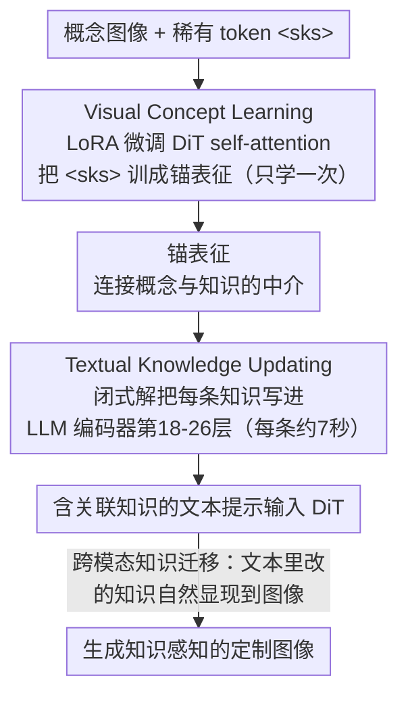

# MoKus: Leveraging Cross-Modal Knowledge Transfer for Knowledge-Aware Concept Customization

**会议**: CVPR 2026  
**arXiv**: [2603.12743](https://arxiv.org/abs/2603.12743)  
**代码**: 无  
**领域**: 图像生成 / 概念定制 / 知识编辑  
**关键词**: 概念定制, 跨模态知识迁移, 知识编辑, DiT, LLM文本编码器  

## 一句话总结
提出"知识感知概念定制"新任务，发现LLM文本编码器中的知识编辑可以自然迁移到视觉生成模态（跨模态知识迁移），基于此提出MoKus框架：先用LoRA微调将稀有token绑定为视觉概念的锚表征，再通过知识编辑技术将多条自然语言知识高效映射到锚表征上，每条知识更新仅需约7秒。

## 背景与动机
现有概念定制方法（如DreamBooth、Textual Inversion）用稀有token（如`<sks>`）表示目标概念，存在两个根本缺陷：(1) **性能不稳定**——稀有token在预训练数据中极少出现，缺乏语义基础，与正常文本提示组合时生成质量波动大；(2) **知识不感知**——稀有token只编码视觉外观，无法承载概念的内在知识（如"丹麦哥本哈根港口的铜像"→小美人鱼雕像），导致知识相关的提示（如"Little Mermaid Statue Denmark"）生成失败。编码器式方法（如IP-Adapter、BLIP-Diffusion）需要大规模数据重新训练来支持新知识。

## 核心问题
如何让生成模型理解"概念是什么"（视觉外观）的同时也理解"概念代表什么"（关联知识），并能在给定包含知识的文本提示时生成高保真定制图像？更进一步，单个概念可能关联多条知识（客观描述、主观感受等），如何高效地将所有知识绑定到同一个概念上？

## 方法详解

### 整体框架
MoKus 要做的是"知识感知的概念定制"——既让模型记住概念长什么样，又让它理解概念背后的知识。它建在 LLM 文本编码器 + DiT 生成骨干（Qwen-Image）之上，分两阶段：第一阶段 Visual Concept Learning 用 LoRA 微调 MMDIT 的 self-attention 层，把一个稀有 token 学成概念的视觉表征（锚表征）；第二阶段 Textual Knowledge Updating 用知识编辑技术，把一条条自然语言知识映射到锚表征所在的文本空间，完成"知识→概念"的绑定。视觉只学一次，之后每加一条知识只需秒级更新。

### 关键设计

**1. 跨模态知识迁移现象：文本里改的知识会自己跑到图像里**

这是 MoKus 立论的核心观察。在用 LLM 当文本编码器的文生图模型里，如果用知识编辑改掉 LLM 内部的某条知识（比如把"贝多芬最喜欢的乐器"从"钢琴"改成"吉他"），生成的图会自然跟着变（画出吉他而非钢琴）——即文本模态里的知识修改会**自然迁移**到视觉生成。值得注意的是 GapEval、UniSandbox 用直接微调 LLM 编码器并没看到明显迁移，而 MoKus 用的是更精细的知识编辑方法（UltraEdit/AlphaEdit），迁移才显现出来。整套方法正是建在这个现象上。

**2. Visual Concept Learning：把稀有 token 训成"锚表征"**

直接拿稀有 token（如 `<sks>`）生成不稳定，因为它在预训练里几乎没出现过、缺语义基础。这一步用 `<sks> dog` 作文本输入，通过 LoRA 微调 DiT 的 self-attention 层学概念的视觉外观，训练目标是标准的 Rectified Flow velocity matching 损失 $\mathcal{L}(\theta_v) = \mathbb{E}[\|v_\theta(z_t, t, h) - (z_0 - z_1)\|^2]$。微调后的稀有 token 不直接拿去生成，而是当"锚表征"——一个连接概念和知识的中介。

**3. Textual Knowledge Updating：闭式解把知识写进编码器**

有了锚表征，就能把每条知识绑上去。做法是把知识 $k_i$ 写成问题 $q_i$、把锚表征 $y$ 当成期望答案：将 $q_i$ 输入 LLM 编码器取隐状态 $h_i$ 和梯度 $\nabla_{\theta_t} y_i$，算更新方向 $v_i = -\eta \cdot \|h_i\|^2 \cdot \nabla y_i$，再用正则化最小二乘求闭式解 $\Delta\theta_t^* = (H^\top H + I)^{-1} H^\top V$，把参数偏移加到 LLM 编码器第 18–26 层的 Gate Projection 和 Up Projection（共 16 个参数矩阵）上。因为是闭式解、不走反向传播，每条知识更新只要约 7 秒，5 条知识总共约 360 秒。

**4. KnowCusBench 基准：给这个新任务配一把尺子**

新任务没有现成评测，作者顺手建了首个知识感知概念定制 benchmark：35 个概念、每个概念 5 条知识（来自个人关系/物理属性/功能/价值/来源/情感 6 个视角）、199 个生成提示（背景变换/插入新物体/风格变换/属性修改 4 个视角），合计 5,975 张评估图像，6×4 的正交设计保证了覆盖度。

### 损失函数 / 训练策略
- Visual Concept Learning：标准Rectified Flow损失，lr=2e-4，AdamW优化器，仅训练LoRA参数
- Textual Knowledge Updating：不涉及反向传播训练，而是通过闭式解直接计算参数偏移，缩放因子η=1e-6，batch size=1
- 仅修改LLM编码器第18-26层的MLP（Gate Proj + Up Proj），共16个参数矩阵

## 实验关键数据

| 任务 | 指标 | MoKus | Naive-DB | Enc-FT | 说明 |
|--------|------|------|----------|------|------|
| 重建 | CLIP-I | 0.867 | 0.874 | 0.582 | 接近DB，远超Enc-FT |
| 重建 | CLIP-I-Seg | 0.764 | 0.758 | 0.553 | 最佳(分割后评估更准确) |
| 生成 | CLIP-I-Seg | 0.718 | 0.717 | 0.562 | 最佳 |
| 生成 | CLIP-T | 0.305 | 0.291 | 0.197 | 最佳(提示对齐) |
| 生成 | Pick Score | 21.30 | 20.80 | 18.34 | 最佳(人类偏好) |
| 效率 | 训练时间 | 6min | 27min | 10min | 最高效 |
| WISE子集 | WiScore | 1.33 | - | 0.81(baseline) | 显著提升世界知识 |

### 消融实验要点
- **知识数量影响**：从1到5条知识，CLIP-I-Seg仅从0.761波动到0.764，性能极稳定；每增加一条知识仅多约7秒训练时间（331s→360s），效率极高
- **缩放因子η**：η=1e-6为最优；η过大(1e-5)导致编码器分布严重偏移，生成崩溃（类似Enc-FT的失败模式）；η过小(1e-7)则更新不足
- **更新层选择**：仅修改第18-26层MLP，层数过少则更新能力不足，层数过多则影响预训练知识

## 亮点
- 跨模态知识迁移是一个非常有洞察力的发现——知识编辑原本是NLP领域的技术，这里发现它在多模态生成中也天然起效，且比直接微调LLM编码器更有效
- 两阶段解耦设计极其高效：Visual Concept Learning只做一次（~6min），之后每条新知识只需~7秒就能绑定，无需重新训练
- KnowCusBench的构建标准化了评估，6个知识视角+4个提示视角的正交设计确保了覆盖度
- 方法可自然扩展到虚拟概念创建和概念擦除——通过修改知识答案就能控制生成行为
- 在WISE世界知识benchmark上也能提升表现，说明知识更新是真正"写入"了模型

## 局限与展望
- 依赖LLM作为文本编码器（如Qwen-Image）——传统CLIP文本编码器的模型（如SD1.5/2.1）无法直接使用此方法
- 知识必须能表达为"问题-答案"格式，对于难以问题化的知识（如抽象风格偏好）可能受限
- 评估仍依赖CLIP系指标，可能对某些细粒度视觉差异不够敏感
- 目前仅支持图像域，作者提出未来扩展到视频概念定制
- 闭式解的正则化项(identity矩阵)可能不够灵活，更复杂的正则化策略或许能进一步提升

## 与相关工作的对比
- **vs DreamBooth (Naive-DB)**：DB需要为每条知识重新完整训练（27min），且用稀有token直接生成——在组合新提示时性能不稳定。MoKus只需训练一次锚表征，后续每条知识7秒更新，且通过自然语言知识（而非稀有token）做生成条件，泛化性更好。
- **vs Enc-FT（直接微调LLM编码器）**：这是GapEval和UniSandbox使用的策略。直接微调会严重破坏编码器输出分布，导致生成质量崩溃（CLIP-I仅0.582 vs MoKus 0.867）。MoKus通过精确的知识编辑（仅修改特定层特定方向的参数）避免了这一问题。
- **vs IP-Adapter等编码器式方法**：需要大规模数据重新训练编码器来支持新知识/概念，不够灵活。MoKus的知识更新完全是参数高效的（闭式解，秒级完成）。

## 启发与关联
- 跨模态知识迁移现象表明LLM文本编码器在多模态模型中的角色远比"提取文本特征"更丰富——它存储了可以影响视觉生成的世界知识
- 这一思路可用于解决diffusion模型的"知识盲区"问题（生成正确的地标、名人特征等）
- 知识编辑 + 生成模型的组合为可控生成开辟了新方向——不再通过修改提示来控制，而是修改模型的"认知"
- 关联idea: `20260316_concept_bottleneck_world_model.md`（概念层面的知识表达）

## 评分
- 新颖性: ⭐⭐⭐⭐⭐ [提出全新任务+发现跨模态知识迁移现象+设计高效的两阶段框架，创新度很高]
- 实验充分度: ⭐⭐⭐⭐ [构建了专门benchmark，消融充分，但仅用一个生成骨干(Qwen-Image)验证]
- 写作质量: ⭐⭐⭐⭐⭐ [motivation清晰，观察→方法的推导自然流畅，图文配合优秀]
- 价值: ⭐⭐⭐⭐ [知识感知定制是有实际价值的新方向，跨模态知识迁移的发现对理解多模态模型有深远意义]

<!-- RELATED:START -->

## 相关论文

- [\[CVPR 2026\] Attribution-Guided Model Rectification of Unreliable Neural Network Behaviors](attribution-guided_model_rectification_of_unreliable_neural_network_behaviors.md)
- [\[CVPR 2026\] SAME: Sparse and Anchored Model Editing for Heterogeneous Incremental Learning under Limited Data](same_sparse_and_anchored_model_editing_for_heterogeneous_incremental_learning_un.md)
- [\[ICML 2026\] Do Text Edits Generalize to Visual Generation? Benchmarking Cross-Modal Knowledge Editing in UMMs](../../ICML2026/knowledge_editing/do_text_edits_generalize_to_visual_generation_benchmarking_cross-modal_knowledge.md)
- [\[ICLR 2026\] GOT-Edit: Geometry-Aware Generic Object Tracking via Online Model Editing](../../ICLR2026/knowledge_editing/got-edit_geometry-aware_generic_object_tracking_via_online_model_editing.md)
- [\[ICML 2026\] KORE: Enhancing Knowledge Injection for Large Multimodal Models via Knowledge-Oriented Controls](../../ICML2026/knowledge_editing/kore_enhancing_knowledge_injection_for_large_multimodal_models_via_knowledge-ori.md)

<!-- RELATED:END -->
