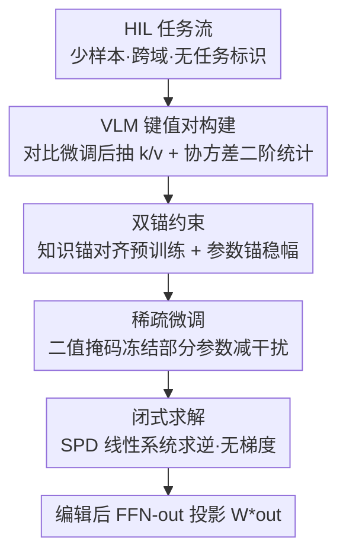

# SAME: Sparse and Anchored Model Editing for Heterogeneous Incremental Learning under Limited Data

**会议**: CVPR 2026  
**论文**: [CVF Open Access](https://openaccess.thecvf.com/content/CVPR2026/html/Duan_SAME_Sparse_and_Anchored_Model_Editing_for_Heterogeneous_Incremental_Learning_CVPR_2026_paper.html)  
**代码**: 原文标注有 Project Page，但未给出明确代码仓库 ⚠️  
**领域**: 知识编辑 / 持续学习  
**关键词**: 模型编辑, 异构增量学习, 视觉语言模型, 少样本, 双锚约束

## 一句话总结
把大语言模型里的「定位—编辑 FFN 键值对」思路搬到 CLIP 这类视觉语言模型上，提出在无任务标识、跨域、少样本的「异构增量学习（HIL）」新设定下，用稀疏微调 + 双锚约束 + 闭式求解把每个新任务的知识直接写进 FFN 输出投影矩阵，不加任何额外参数，平均精度比现有持续学习方法高 6.8%、保留 oracle 性能的 95.8%。

## 研究背景与动机

**领域现状**：基础模型虽强，但在增量学习（IL）上仍易灾难性遗忘。现有 IL 基本只在两种理想设定下评测——类增量（CIL，单域、按类别切分）和任务增量（TIL，多域但推理时给出任务标识）。

**现有痛点**：真实部署里这两个假设都不成立。模型会在不可预测的环境中遇到**异构的数据分布**、**模糊或未知的任务边界**，而且常常**只有少量标注**。任务增量方法依赖隐式任务分类把样本路由到专家，但域之间高度同质时路由就不可靠；少样本 IL 方法又往往要引入可学习参数、还需要一个有充足数据的基训练阶段，和「监督受限」的前提自相矛盾。

**核心矛盾**：增量学习的根本张力在「注入新知识」与「保留旧能力」之间——越激进地拟合新任务越容易冲掉预训练语义，越保守又学不会新任务；而异构 + 少样本会同时放大这两端的风险。

**本文目标**：先定义一个贴近现实的评测设定 HIL（同时考察域内连续性、跨域异构性、少样本，且不给任务标识），再设计一个能在该设定下稳定注入知识、且**不增参数、不依赖任务标识、对任务顺序不敏感**的方法。

**切入角度**：作者观察到——大模型的事实/任务知识主要编码在 FFN 层，LLM 的「定位即编辑」（如 ROME/MEMIT/AlphaEdit）正是靠改写 FFN 输出投影的键值映射来注入知识。这套机制天然适合 IL：能高效写入新知识又尽量不动其它部分。但它几乎只在 NLP 里验证过，搬到 CLIP 这类 VLM 上还是空白。

**核心 idea**：把 VLM 的 FFN 输出投影 $W_{out}$ 当作可编辑对象，从少样本数据里抽出紧凑的任务键值对 $(K_1,V_1)$，在「知识锚 + 参数锚」双重约束下，用一个对称正定线性系统**闭式求解**出编辑后的权重——既学到新任务，又锚回预训练语义，全程无梯度迭代、内存恒定。

## 方法详解

### 整体框架
SAME 把每个增量任务都当成一次「模型编辑」：对当前任务先对 FFN 输出投影做稀疏微调并抽取键值统计量，再把这些统计量连同原始预训练模型的键值统计量一起，塞进一个带双锚正则的最小二乘目标，最后对该目标求导置零得到闭式解，直接把解写回 $W_{out}$。整条线没有反向传播迭代，编辑结果只取决于协方差矩阵，因此天然对任务到达顺序不敏感、可并行处理多任务。

### 关键设计

**1. VLM 键值对构建：把 LLM 的 FFN 编辑搬到双模态上，并用协方差统计压缩存储**

LLM 编辑把 FFN-out 的输入特征记为键 $k$、输出记为值 $v$，键值对 $(k,v)$ 编码了局部知识。本文把它扩展到 VLM：给定图文对 $(I,T)$，用视觉/文本编码器得到 $h_v=f_v(I),\ h_t=f_t(T)$，在当前任务上用原始的对比损失微调所有层的 $W_{out}$，再把训练样本喂回适配后的模型，逐层抽取每层 FFN-out 的输入特征 $k$ 和输出特征 $v$。直接存 token 级特征代价太大，作者改为只累计**二阶统计量** $K^\top K=\sum_b k_b^\top k_b$、$K^\top V=\sum_b k_b^\top v_b$（展平 batch 与序列维度后相加，因协方差对独立样本可加，展平不影响结果）。多任务时再对 $M\times N$ 个子数据集求平均得到全局统计 $\bar K^\top\bar K,\ \bar K^\top\bar V$。这样每个任务无论多少样本，存下来的都是固定大小的协方差矩阵，内存恒定，这正是「无额外参数」的关键。

**2. 双锚约束：让编辑既学新任务又不漂离预训练语义**

单纯拟合新键值对会冲掉旧知识。作者给编辑目标加两个互补的锚（式 5）：

$$W^* = \arg\min_W \|K_1 W - V_1\|_F^2 + \lambda_k\|K_0 W - V_0\|_F^2 + \lambda_p\|W - W_{out}\|_F^2$$

第一项拟合当前任务键值对 $(K_1,V_1)$ 学新知识；**知识锚** $\lambda_k\|K_0 W-V_0\|^2$ 强制编辑后的投影仍能再现**原始预训练 VLM**（不做任何微调）抽出的键值映射 $(K_0,V_0)$——由于预训练于大规模数据、泛化强，$(K_0,V_0)$ 是可靠的参考知识，这项把更新拽回原始特征空间、防语义漂移；**参数锚** $\lambda_p\|W-W_{out}\|^2$ 直接约束权重幅度别偏离原参太远，维持跨任务的表征连续性与数值稳定。两个锚一个管「特征层面对齐」、一个管「参数层面稳幅」，共同把「适配 vs 保留」的张力调到平衡。

**3. 稀疏微调：抽键值前先随机冻结一部分参数，抑制异构任务间的相互干扰**

在对每个任务微调 $W_{out}\in\mathbb{R}^{d_k\times d_v}$ 之前，先采一个二值掩码 $M\in\{0,1\}^{d_v\times d_k}$，按固定比例 $p$ 随机把参数冻住（$M_{ij}=0$），其余 $(1-p)$ 可更新。优化时梯度被掩码过滤：$\nabla\mathcal{L}_{masked}=\nabla\mathcal{L}\odot M$，只有未冻结子集会动。这样更新被限制在 $W_{out}$ 的一个子空间内，迫使模型复用预训练的表征基、减少异构任务之间的破坏性干扰，是 SAME 抑制冲突的「第一道防线」，也让新键值对 $(K_1,V_1)$ 能更平滑地和旧知识融合。

**4. 闭式求解：无梯度、内存恒定、对任务顺序不敏感的编辑**

把式 5 对 $W$ 求导置零，得到一个对称正定（SPD，当 $\lambda_k,\lambda_p>0$）线性系统：

$$H = \bar K_1^\top\bar K_1 + \lambda_k \bar K_0^\top\bar K_0 + \lambda_p I,\qquad W^* = H^{-1}\big(\bar K_1^\top\bar V_1 + \lambda_k \bar K_0^\top\bar V_0 + \lambda_p W_{out}\big)$$

编辑后投影直接取 $W_{out}^\star=W^*$。由于全局统计已对所有任务做了平均聚合（式 4），求解一次即把全部任务知识 + 锚定先验融合进去——**无需逐任务反向传播迭代、内存恒定、且因为只依赖可加的协方差矩阵，对任务到达顺序天然不敏感、可并行**。这与传统对任务顺序敏感的增量方法形成鲜明对比。

### 损失函数 / 训练策略
微调阶段沿用 CLIP 原始的图文对比损失，仅用于把任务知识压进 $W_{out}$ 并抽取键值统计；真正的「编辑」由式 8 的闭式解完成，不参与梯度优化。骨干为 CLIP ViT-B/16，优化器 AdamW，每个任务在 5-shot 下训练 500 次迭代。全实验固定超参 $\lambda_p=300,\ \lambda_k=0.1$，稀疏比 $p=0.3$。

## 实验关键数据

**评测设定**：MTIL 基准（11 个视觉语言域），按 Order I 固定域序，每个域再按类别切成 $N$ 个子任务；Split-2（$N{=}2$，共 22 个序列任务）与 Split-3（$N{=}3$，共 33 个任务），均 5-shot。推理时用余弦相似度在所有域类别上匹配，模拟类增量推理（不给任务标识）。**Oracle (FFN)** 指对每个子任务独立微调、无任何增量约束的上界；**保留率**定义为本文平均精度 ÷ Oracle 精度。

### 主实验：Split-2 / 5-shot 平均精度对比（%）

| 方法 | 类型 | 平均精度 | 与本文差 |
|------|------|----------|----------|
| Oracle (FFN) | 上界 | 68.9 | — |
| Continual FT | IL | 46.0 | −20.0 |
| Wise-FT | IL | 50.8 | −15.2 |
| DIKI | IL | 53.9 | −12.1 |
| ZSCL | IL | 56.1 | −9.9 |
| GNSP | IL | 58.7 | −7.3 |
| MoE-Adapter | IL | 59.2 | −6.8 |
| Consensus TA | 模型融合 | 58.6 | −7.4 |
| Task Arithmetic | 模型融合 | 60.2 | −5.8 |
| TIES-Merging | 模型融合 | 61.7 | −4.3 |
| **SAME (ours)** | 编辑 | **66.0** | — |

SAME 平均 66.0%，比最强 IL 基线（MoE-Adapter 59.2）高 6.8 个点，比最强模型融合基线（TIES-Merging 61.7）高 4.3 个点，且达到 Oracle 上界的 66.0/68.9 ≈ **95.8%**。

### 分域亮点：SAME 在难域上的优势（Split-2 / 5-shot，%）

| 域 | MoE-Adapter | TIES-Merging | Oracle | SAME |
|----|-------------|--------------|--------|------|
| EuroSAT | 60.1 | 69.3 | 66.2 | **80.9** |
| MNIST | 53.4 | 57.6 | 90.8 | **89.5** |
| Flowers | 65.1 | 71.4 | 84.3 | 75.3 |
| Aircraft | 28.6 | 23.9 | 36.3 | 26.1 |

值得注意：SAME 在 EuroSAT 上 80.9% 甚至**反超了 Oracle 上界（66.2%）**，说明跨任务的锚定/聚合带来了正向迁移；在 MNIST 上几乎追平 Oracle（89.5 vs 90.8），而其它增量方法在这些「分布差异大」的域上掉得很厉害（MoE-Adapter MNIST 仅 53.4）。

### 关键发现
- **稳定性来自双锚而非更多参数**：SAME 全程不加任何可学习参数，靠知识锚把表征拽回预训练空间、参数锚稳住幅度，就拿到了接近 oracle 的保留率，反衬出「灾难性遗忘」很大程度是无约束更新导致的语义漂移。
- **闭式 + 协方差聚合带来顺序无关性**：因为编辑只依赖可加的协方差统计，任务可乱序、可并行注入，避免了传统增量方法对任务顺序敏感的痼疾。⚠️ 原文另含 Split-3 结果及对双锚/稀疏比的消融，本笔记基于缓存正文，具体消融数值以原文表格为准。
- **跨任务正迁移**：在 EuroSAT 上超过逐任务独立微调的 oracle，提示全局键值聚合在域间存在可利用的共享结构。

## 亮点与洞察
- **把 NLP 的「定位—编辑 FFN」范式干净地迁到 VLM**：明确把视觉 + 文本联合决定的 FFN-out 输入/输出当键值，用协方差二阶统计代替显式存特征，既复用了成熟机制又解决了「少样本下怎么紧凑记知识」的工程问题——这套压缩思路可迁移到任何需要按任务存知识的持续学习场景。
- **HIL 设定本身是贡献**：同时把「域内连续 + 跨域异构 + 少样本 + 无任务标识」四个现实约束揉进一个评测协议，比单一 CIL/TIL 更逼近真实部署，给后续工作立了更硬的标尺。
- **无梯度闭式编辑很优雅**：把增量学习化成一个 SPD 线性系统，一次求逆解决，内存恒定且顺序无关，这种「用解析解替代迭代训练」的思路对算力/内存受限的边缘增量很有吸引力。

## 局限与展望
- **依赖 FFN 知识假设**：方法建立在「任务知识主要编码于 FFN-out」的前提上，对注意力主导或更深耦合的知识可能失效，作者也承认这一机制在 VLM 上仍属早期探索。
- **固定超参与随机掩码**：$\lambda_k,\lambda_p,p$ 全任务固定、掩码随机采样，缺乏按任务/按层自适应，难域上可能并非最优；随机冻结也可能偶发地冻掉关键参数。
- **闭式解需存全模型协方差**：虽然单任务内存恒定，但要对所有层 $W_{out}$ 维护 $d_k\times d_k$ 的 $H$，维度大时求逆与存储成本不可忽视。
- **改进方向**：把稀疏掩码改成基于重要度的结构化选择、让双锚系数随任务相似度自适应、并验证在更大 VLM / 更长任务流上的可扩展性。

## 相关工作与启发
- **vs 模型编辑（ROME / MEMIT / AlphaEdit）**：它们在 LLM 里靠定位 FFN 做事实改写，AlphaEdit 还把更新约束到零空间保护旧知识；本文把同一范式迁到 VLM 并用「双锚 + 闭式」实现，区别在于面向的是跨域少样本增量而非单条事实改写。
- **vs 模型融合（Task Arithmetic / TIES-Merging / Consensus TA）**：融合法把各任务微调后的权重做算术/裁剪合并；本文在 FFN-out 层的键值空间求闭式编辑，比直接权重融合更精细地保留预训练语义，Split-2 上高出 TIES-Merging 4.3 点。
- **vs 任务/少样本增量（MoE-Adapter / DIKI / 少样本 IL）**：MoE-Adapter 等靠隐式任务路由或额外可学习模块，且常需充足数据的基训练；SAME 不加参数、不需任务标识、5-shot 即可，且对任务顺序不敏感，正好补上这些方法在异构少样本下的短板。

## 评分
- 新颖性: ⭐⭐⭐⭐ HIL 新设定 + 把 FFN 编辑迁到 VLM 并配双锚闭式解，组合新颖，但单个组件多有先例。
- 实验充分度: ⭐⭐⭐⭐ 11 域 22/33 任务、多类基线对比扎实；缓存正文未完整呈现双锚消融数值。
- 写作质量: ⭐⭐⭐⭐ 设定动机与方法推导清晰，公式与算法完整。
- 价值: ⭐⭐⭐⭐ 无参数、顺序无关、少样本的增量编辑对真实部署有吸引力，HIL 协议也有沉淀价值。

<!-- RELATED:START -->

## 相关论文

- [\[ACL 2026\] HiEdit: Lifelong Model Editing with Hierarchical Reinforcement Learning](../../ACL2026/knowledge_editing/hiedit_lifelong_model_editing_with_hierarchical_reinforcement_learning.md)
- [\[ACL 2025\] CompKe: Complex Question Answering under Knowledge Editing](../../ACL2025/knowledge_editing/compke_complex_question_answering_under_knowledge_editing.md)
- [\[CVPR 2026\] Attribution-Guided Model Rectification of Unreliable Neural Network Behaviors](attribution-guided_model_rectification_of_unreliable_neural_network_behaviors.md)
- [\[ICLR 2026\] Rote Learning Considered Useful: Generalizing over Memorized Training Examples](../../ICLR2026/knowledge_editing/rote_learning_considered_useful_generalizing_over_memorized_training_examples.md)
- [\[NeurIPS 2025\] Edit Less, Achieve More: Dynamic Sparse Neuron Masking for Lifelong Knowledge Editing in LLMs](../../NeurIPS2025/knowledge_editing/edit_less_achieve_more_dynamic_sparse_neuron_masking_for_lifelong_knowledge_edit.md)

<!-- RELATED:END -->
