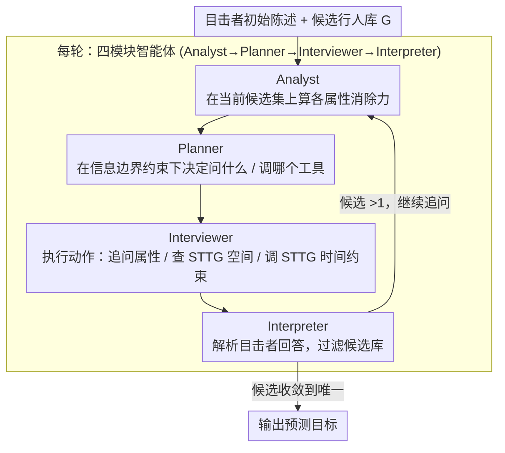

# ARGOS: Who, Where, and When in Agentic Multi-Camera Person Search

**会议**: CVPR 2026  
**arXiv**: [2604.12762](https://arxiv.org/abs/2604.12762)  
**代码**: 无  
**领域**: LLM Agent  
**关键词**: 多摄像头搜索, 智能体推理, 时空拓扑图, 交互式对话, 行人搜索

## 一句话总结
本文提出 ARGOS，首个将多摄像头行人搜索重新定义为交互式推理问题的基准和框架，智能体通过与目击者进行多轮对话、调用时空工具并在信息不对称下推理排除候选人，包含 2,691 个任务、3 个渐进式赛道。

## 研究背景与动机

1. **领域现状**：多摄像头行人搜索是监控领域的基础需求。传统行人重识别依赖清晰的视觉查询，文本驱动和交互式方法仅使用外观描述。现有空间推理基准和智能体评估框架局限于单图或通用场景。
2. **现有痛点**：现有方法缺乏主动提问规划能力，无法利用目击者提供的时空线索（如"我在仓库看到他们，几分钟后在大厅附近"）。没有方法同时整合多模态交互、空间定位和时间推理。
3. **核心矛盾**：真实世界的行人搜索本质上是一个主动推理问题——需要在信息不对称下决定"问什么、何时调用工具、如何解释模糊回答"，但现有基准和方法都将其简化为被动的视觉匹配。
4. **本文目标**：定义交互式多摄像头行人搜索任务，构建包含语义感知（Who）、空间推理（Where）和时间推理（When）的渐进式基准。
5. **切入角度**：将摄像头网络编码为时空拓扑图（STTG），作为任务构建的结构骨架和智能体的定位工具，支持基于物理约束的时间可行性推理。
6. **核心 idea**：用 LLM 驱动的四模块智能体（分析→规划→访谈→解释）在 STTG 上进行多轮对话推理，通过工具调用消除不可行的候选人。

## 方法详解

### 整体框架
智能体在一局对话开始时只拿到两样东西：目击者的初始陈述（例如"我在仓库看到一个穿红色上衣的人"）和一个候选行人库 $\mathcal{G}$（一组带属性的画廊条目）。它的任务是在有限轮次内把 $\mathcal{G}$ 收敛到唯一目标。每一轮它可以做三件事之一：向目击者**追问视觉属性**、**查询空间位置**、或**调用时间推理**。三者的共同后端是时空拓扑图（STTG）——它既告诉智能体哪些摄像头物理相邻，也提供经验统计的转移时间，从而把"目击者的模糊回忆"翻译成"可计算的候选集过滤"。在实现上，智能体每一轮都按**四个模块顺序流转**：Analyst 在当前候选集上算各属性的消除力，Planner 据此决定这一轮问什么、调用哪个工具，Interviewer 执行动作（向目击者追问属性 / 查 STTG 空间关系 / 调用 STTG 时间约束），Interpreter 解析目击者的自然语言回答并据此过滤候选库；如此循环，直到候选收敛到唯一目标或耗尽轮次预算。

下面先讲清楚三个最容易被略过的核心概念，再给一个完整的推理 walkthrough。

### 关键设计

**1. 时空拓扑图（STTG）：把"多久能走到"变成图约束**

STTG 是一张有向加权图 $\mathcal{T}=(V,E)$。节点 $V$ 是摄像头（各自带一个区域标签），边 $E$ 分三类：`OVERLAP`（两摄像头共享视野）、`SOFT_ADJ`（软相邻，人可短时走到）、`TRAVEL`（需要明显走动）。每条边挂着一组实测转移时间统计 $(t_{\min}, t_{\text{med}}, t_{\max}, n)$，其中 $n$ 是样本数；由 `OVERLAP` 边连成的连通分量自然定义出"区域"。

它的价值在于一图两用：**构建基准时**，从 STTG 采样可达/不可达路径来生成有明确真值的任务；**智能体推理时**，把它当作环境的世界模型——当目击者说"先在仓库、几分钟后在大厅"，智能体就能查 STTG 里仓库→大厅这条边的 $t_{\min}$，凡是转移耗时低于 $t_{\min}$ 的候选轨迹在物理上不可能，直接剔除。原本只能"凭感觉"的时间判断，变成了一次确定性的图查询。

**2. 属性消除力与"信息边界"：在不确定下决定问什么**

智能体并非随便提问，而是由 Analyst 模块为每个可问属性估计**消除力（elimination power）**：在当前候选集上，假如得知该属性的取值，期望能排除掉多少候选人——本质是按属性取值把候选集分桶后的区分度（取值越均匀、桶越多，区分度越高）。理想情况下应优先问消除力最大的属性。

但这里有一道关键约束——**信息边界**。任务总共定义了 21 个行人属性，可一个目击者在某局里只"看清"了其中很少几个（典型只有 3 个，如性别、上衣颜色、下衣颜色）可被回答；其余属性无论怎么问都得到"不记得/没看清"。要命的是，智能体**事先并不知道哪 3 个可观测**。于是它必须在信息不对称下做权衡：是把宝贵的轮次押在理论消除力最高、但可能根本问不出来的属性上，还是先试探性地摸清目击者的"可回答边界"。正是这道设定让任务从"贪心问最优属性"升级成"带探索的策略决策"。

**3. 三赛道渐进式基准**

三个赛道按"感知 → 空间 → 时间"逐级加难，便于精确定位能力瓶颈：

- **Track 1 · Who（989 任务）**——纯语义感知。智能体拿到完整对话记录，只需抽取属性、过滤行人库，不涉及主动提问规划。
- **Track 2 · Where（550 任务）**——空间推理。目击者只报告"在某区域看到目标"，智能体要靠空间问题 + 属性问题把范围收敛到具体子区域（oracle 平均仅需 2.02 轮）。
- **Track 3 · When（1,152 任务）**——时间推理。目击者给出两次不同时间、不同地点的目击，智能体调用 STTG 的转移时间约束，排除"在这点时间内不可能完成转移"的候选人（oracle 平均 1.89 轮）。

评测用 **Turn-Weighted Success (TWS)** 同时衡量"答对没"和"用了几轮"，思路借鉴具身导航里的 SPL——成功不够，还要高效。对单局：成功则按 oracle 最优轮数与实际轮数之比打折，失败计 0；全数据集取平均：

$$\text{TWS} = \frac{1}{N}\sum_{i=1}^{N} S_i \cdot \min\!\left(1, \frac{T^{*}_i}{T_i}\right)$$

其中 $S_i\in\{0,1\}$ 表示第 $i$ 局是否找对目标，$T^{*}_i$ 是 oracle 的最优轮数，$T_i$ 是智能体实际花的轮数。所以 TWS=1 意味着"既全对、又每局都打到 oracle 步数"，而一个总能答对但绕远路的智能体，Top-1 很高、TWS 却会被狠狠拉低——这正是表中 Top-1 与 TWS 差距悬殊的原因。

### 一个完整 walkthrough（Track 3·When）
1. **初始**：目击者称"14:00 在仓库（Cam-3）、14:06 在大厅（Cam-9）看到目标"。候选库 $\mathcal{G}$ 有 30 人。
2. **Interpreter** 解析两次目击的（时间, 摄像头）对。
3. **Interviewer** 调用 STTG 时间可行性工具：查 Cam-3→Cam-9 边的 $t_{\min}=8$ 分钟，而两次目击间隔只有 6 分钟 < 8 分钟——凡轨迹经过这条边的候选人全部不可行，库从 30 人砍到 11 人。
4. **Analyst** 在剩余 11 人上算各属性消除力，发现"上衣颜色"区分度最高（把 11 人分成 5 桶）。
5. **Planner** 决定提问上衣颜色；目击者恰好"看清"了这一属性，答"红色"，库收敛到 3 人。
6. 再问一个高消除力属性 → 收敛到 1 人，**2 轮命中**，TWS 接近 1。

这条链清楚地展示了三类动作如何协同：时间工具做粗筛、消除力做属性选择、信息边界决定哪些问题"白问"。

### 训练策略
无需训练。全部使用**冻结**的 LLM 骨干（GPT-5.2、GPT-4o、GPT-5-mini、Claude Sonnet 4）直接 zero-shot 推理，温度 0.0，每局 20 轮预算。

## 实验关键数据

### 主实验

| 骨干模型 | Track 2 TWS | Track 2 Top-1 | Track 3 TWS | Track 3 Top-1 |
|---------|------------|--------------|------------|--------------|
| Oracle | 1.000 | 100.0% | 1.000 | 100.0% |
| GPT-5.2 | 0.338 | 73.1% | **0.590** | **88.2%** |
| Claude Sonnet 4 | **0.383** | **76.0%** | 0.548 | 82.8% |
| GPT-4o | 0.323 | 74.5% | 0.567 | 80.6% |

### 消融实验

| 配置 | Track 3 TWS | 说明 |
|------|------------|------|
| 完整工具集 | 0.590 | GPT-5.2 |
| 移除时空工具 | ~0.30 | 下降 49.6 百分点 |
| 移除属性分析工具 | ~0.45 | 策略选择变差 |

### 关键发现
- **基准远未被解决**：最佳 TWS 仅 0.383（Track 2）和 0.590（Track 3），Oracle 均为 1.0
- **工具移除造成巨大性能下降**（49.6 百分点），证明领域特定工具对任务至关重要
- **空间推理是最大瓶颈**：Track 2 的 TWS 远低于 Track 3，因为空间消歧需要更多轮次且更依赖策略规划

## 亮点与洞察
- **将行人搜索重定义为交互式推理**是视角创新：从被动的视觉匹配转为主动的对话推理，更贴近真实安防场景中人与系统的交互模式
- **STTG 的双重角色**设计巧妙：既是数据集构建的结构骨架（保证任务有明确真值），又是智能体的推理工具（提供可计算的时空约束）
- **信息边界设计**增加了任务的策略深度：智能体不知道目击者能回答什么，必须在有限预算下智能探索

## 局限与展望
- 目击者模拟器是确定性的（固定模板），缺乏真实人类回答的噪声和歧义
- 仅使用 3 个可观测属性（性别、上衣颜色、下衣颜色），实际场景中目击者可能提供更丰富的描述
- 16 个摄像头的规模较小，未验证在大规模摄像头网络上的可扩展性
- 未来可引入视觉理解能力，让智能体直接从摄像头画面中提取信息

## 相关工作与启发
- **vs 传统 Re-ID**: Re-ID 是给定图像查找匹配，ARGOS 是通过对话和推理主动缩小候选范围，信息获取方式根本不同
- **vs GT-Bench / VS-Bench**: 这些是多智能体博弈基准，ARGOS 是单智能体在结构化环境中的推理基准，侧重于工具使用和时空约束

## 评分
- 新颖性: ⭐⭐⭐⭐⭐ 首次将多摄像头行人搜索定义为交互式推理问题，STTG 设计原创
- 实验充分度: ⭐⭐⭐⭐ 四个 LLM、三个赛道，但缺少与传统 Re-ID 方法的对比
- 写作质量: ⭐⭐⭐⭐ 问题定义清晰，赛道设计逻辑连贯
- 价值: ⭐⭐⭐⭐ 开辟了行人搜索的新范式，基准有长期价值

<!-- RELATED:START -->

## 相关论文

- [\[CVPR 2026\] HAVEN: Hierarchical Long Video Understanding with Audiovisual Entity Cohesion and Agentic Search](haven_hierarchical_long_video_understanding_with_audiovisual_entity_cohesion.md)
- [\[ICLR 2026\] MC-Search: Evaluating and Enhancing Multimodal Agentic Search with Structured Long Reasoning Chains](../../ICLR2026/llm_agent/mc-search_evaluating_and_enhancing_multimodal_agentic_search_with_structured_lon.md)
- [\[ACL 2026\] BAPO: Boundary-Aware Policy Optimization for Reliable Agentic Search](../../ACL2026/llm_agent/bapo_boundary-aware_policy_optimization_for_reliable_agentic_search.md)
- [\[ACL 2026\] Rethinking Reasoning-Intensive Retrieval: Evaluating and Advancing Retrievers in Agentic Search Systems](../../ACL2026/llm_agent/rethinking_reasoning-intensive_retrieval_evaluating_and_advancing_retrievers_in_.md)
- [\[ACL 2026\] MAGMA: A Multi-Graph based Agentic Memory Architecture for AI Agents](../../ACL2026/llm_agent/magma_a_multi-graph_based_agentic_memory_architecture_for_ai_agents.md)

<!-- RELATED:END -->
