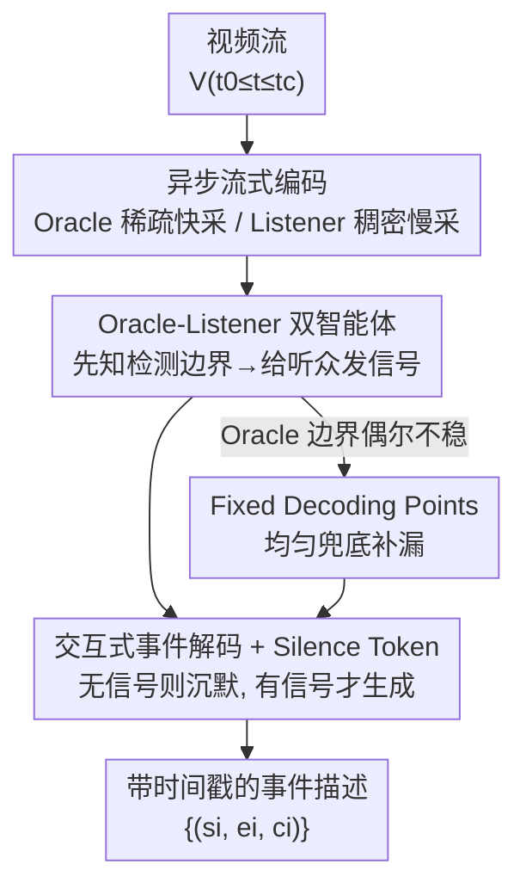

# Asynchronous Temporal Modeling with Two-Agent Framework for Streaming Dense Video Captioning

**会议**: CVPR 2026  
**论文**: [CVF Open Access](https://openaccess.thecvf.com/content/CVPR2026/html/Tang_Asynchronous_Temporal_Modeling_with_Two-Agent_Framework_for_Streaming_Dense_Video_CVPR_2026_paper.html)  
**代码**: 待确认  
**领域**: 视频理解 / Agent / 多模态VLM  
**关键词**: 流式稠密视频描述, 双智能体, 事件边界检测, 阈值-门控失配, Silence Token  

## 一句话总结
针对流式稠密视频描述里"何时该说话"难以靠阈值控制的痛点，本文用一个小模型当"先知"（Oracle）抢跑检测事件边界、一个大模型当"听众"（Listener）收到信号才生成描述的双智能体异步框架 Takusen，从机制上消除阈值，在 ActivityNet Captions 和 YouCook2 上取得流式 SOTA。

## 研究背景与动机

**领域现状**：稠密视频描述（dense video captioning）要为一段视频里的每个事件同时定位时间段 $(s_i, e_i)$ 并生成描述 $c_i$。流式版本更难——视频是边来边处理的实时流，模型只能看到当前时刻 $t_c$ 之前的帧，必须一边维护长时记忆、一边实时判断"现在要不要吐字幕"。

**现有痛点**：当前流式方法走了两条偏路。一是堆砌复杂的外部记忆机制来维护跨帧上下文，却没用上大多模态模型（LMM）本身就具备的长上下文记忆能力；二是频繁地反复调用 LLM 来解码，处理流式输入时效率低。

**核心矛盾**：要让一个 LMM 在单次推理里完成流式描述，最核心的难题是判断"何时沉默、何时生成"。作者把这个难题命名为 **Threshold-Gated Discrepancy（TGD，阈值-门控失配）**：流式描述任务里绝大多数帧都该沉默，严重的数据不平衡让模型学成了"逢帧就预测沉默 token"，于是推理时必须人为设一个阈值去翻转这个偏置——但训练时根本没有阈值，造成训练-推理失配。更糟的是（见原文 Figure 2），合适的阈值在不同视频间差异极大、有效区间极窄，稍微偏一点模型就要么全程沉默、要么每帧狂吐字幕；想再训一个网络去动态预测阈值也不现实。

**切入角度**：既然"用一个阈值门控同一个模型的沉默/生成"是病根，那就把"判断何时说"和"说什么"这两件事**拆给两个智能体**，彻底绕开阈值这个开关。

**核心 idea**：让一个轻量小多模态模型（SMM）当 Oracle，靠稀疏采样跑得快、提前"看到未来"检测事件边界；让一个大多模态模型（LMM）当 Listener，平时安心沉默、只在收到 Oracle 信号时才生成描述——用"信号触发"代替"阈值触发"，从机制上根除 TGD。

## 方法详解

### 整体框架

Takusen 是一个异步双智能体框架，输入是连续视频流 $V^{t_0 \le t \le t_c}$，输出是一组带时间戳的事件描述 $\{(s_i, e_i, c_i)\}$。它的核心是两个角色的**速度差**与**信号协作**：

- **Oracle（先知，SMM）**：对视频流做稀疏采样、快速编码，因为采得稀、跑得快，它能"领先于" Listener 看到更靠后的帧，从而提前检测出事件的起止边界 $(s_i, e_i)$，并把这些边界打包成提示消息发给 Listener。
- **Listener（听众，LMM）**：对视频流做稠密采样、流式编码，吃进远多于 Oracle 的视觉 token 以保证描述质量。它在单次连续推理里自回归地逐帧处理，绝大多数时刻预测特殊的 **Silence Token $\varnothing$** 保持沉默；只有当它走到某个 Oracle 标记的边界时刻，才把 Oracle 消息并入上下文，去确认事件开始或生成完整描述。

由于 Listener 的"说/不说"完全由 Oracle 的信号决定，训练和推理时都不再需要阈值，TGD 被从根上消除；同时所有帧、提示、回复都在 video LMM 的单轮推理里处理，不需要外挂复杂记忆。为应对 Oracle 偶尔的边界预测不稳，框架再叠加一组均匀分布的 **Fixed Decoding Points（FDP，固定解码点）** 兜底。

### 关键设计

**1. Oracle-Listener 双智能体异步架构：用"分工"根除阈值依赖**

这是全文的命门，直接针对 TGD。以往做法是让同一个模型既判断"该不该说"又负责"说什么"，于是"说不说"只能靠一个阈值去卡沉默 token 的概率，而阈值天生训练时不存在、推理时又因视频而异。Takusen 把这两件事拆开：Oracle 只管"何时"（检测边界 $(s_i, e_i)$），Listener 只管"什么"（生成 $c_i$）。Listener 的沉默不再是"概率低于某阈值"的被动结果，而是"没收到信号就理所当然地沉默"的主动状态——它可以放心地大部分时间沉默，等 Oracle 来叫它。因为决策方式从"阈值门控"变成了"信号触发"，训练目标和推理过程天然对齐，TGD 失配被从机制上抹掉，而不是靠调参缓解。两个 agent 的强弱互补也被用满：小模型负责对算力敏感、需要抢跑的定位，大模型负责需要长上下文和语言能力的描述。

**2. 异步流式编码：稀疏快采 vs 稠密慢采制造"时间差"**

为什么 Oracle 能"看到未来"？关键在两者的采样率/处理速度不对称。给定同一段流 $V^{t_0\le t\le t_c}$，Oracle 在 $t_{c(O)} \le t_c$ 处以固定低帧率稀疏采样、快速抽取视觉特征 $F_O^{t_0\le t\le t_{c(O)}}$；Listener 则从 $t_0$ 起逐帧稠密接收，在当前 $t_{c(L)}$ 处编码得到 $F_L^{t_{c(L)}}$，并经可学习 projector 投到 LLM 输入空间。三者时序满足 $t_{c(L)} \le t_{c(O)} \le t_c$——也就是 Oracle 的处理位置始终领先 Listener，于是它能在 Listener 还没走到事件结束点之前，就预判出边界并提前发信号。稀疏采样足以做时间定位、却省算力让 Oracle 跑得快，稠密采样保证 Listener 有足够 token 把描述写细，二者各取所需。

**3. 交互式事件解码 + Silence Token：信号注入上下文，沉默成为默认**

Oracle 检测到边界对 $(s_i, e_i)$ 后，按预定义模板构造两条提示消息 $(M_{O}^{s_i}, M_{O}^{e_i})$，分别指示 Listener "在 $s_i$ 开始追踪事件 $i$"和"事件 $i$ 已结束，请描述它"。Listener 在单次连续推理里自回归地预测下一 token：

$$\max\ P(w_j \mid w_{0:j-1},\ F_L^{t \le t_{c(L)}})$$

每一步 $w_j$ 要么是文本 token、要么是特殊 Silence Token $\varnothing$。当 Listener 走到的时刻匹配某个 Oracle 边界（$t_{c(L)} = s_i$ 或 $t_{c(L)} = e_i$）时，它把对应消息并入上下文：

$$w_{0:j-1} := w_{0:j-1} \cup M_O^{t_{c(L)}}$$

随后：在事件开始点确认追踪（如"Sure, I will track Event i"），在事件结束点生成描述 $c_i=[w_j,\dots,w_{j+k-1}]$ 并以 $w_{j+k}=\varnothing$ 收尾；其余所有时刻都预测 $\varnothing$ 继续往下走。这样"沉默"成了无信号时的默认行为，而非被阈值强行压住的概率结果，正是它让训练与推理一致。

**4. Fixed Decoding Points：均匀兜底，补 Oracle 漏检的事件**

Oracle 的边界预测偶尔会不稳——边界对可能过多、过少或不完整。为此在推理时叠加一组均匀分布的固定解码点 $\{d_i\}$，在常规间隔处额外构造提示 $(M^{s=d_{i-1}}, M^{e=d_i})$；当 $t_c=d_i$ 时把消息发给 Listener，让它在 Oracle 没覆盖到的地方补生成描述，捕捉被漏掉的事件。FDP 的数量是个精度-召回的权衡旋钮：点太少会漏关键事件，太多则生成冗余描述拉低精度（YouCook2 上 10 个点最优，见实验）。它和 Oracle 是互补关系——单靠任一方都次优，二者协同才最佳。

### 损失函数 / 训练策略

训练用一个混合损失，同时管"边界处生成文本"和"事件间保持沉默"：

$$L = \frac{1}{N}\sum_{j=0}^{N}\left(-\mathbb{I}^{[w_j\neq\varnothing]}\log P_j^{w_j} - \mathbb{I}^{[w_j=\varnothing]}\log P_j^{\varnothing}\right)$$

其中 $\mathbb{I}$ 是条件指示函数，$P_j$ 是第 $j$ 个 token 的概率。第一项是 **text loss**（在边界帧鼓励生成准确文本），第二项是 **silence loss**（在非事件帧鼓励预测 $\varnothing$）。关键在于：以往方法只在推理时引入阈值，而这个训练目标直接对齐推理过程，从源头消除了 TGD 的训练-推理失配。训练用参数高效微调：冻结预训练视觉编码器和 LLM，只更新它们之间的 projector 和 LLM 里的 LoRA，既护住视觉/语言原能力又大幅省训练时间。

## 实验关键数据

### 主实验

在 ActivityNet Captions 和 YouCook2 上对比 SOTA（均只用视觉输入）：

| 数据集 | 指标 | Takusen | Streaming Vid2Seq | Streaming GIT |
|--------|------|---------|-------------------|---------------|
| ActivityNet | CIDEr | **43.7** | 37.8 (+5.9) | 41.2 (+2.5) |
| ActivityNet | SODAc | **7.5** | 6.2 | 6.6 |
| ActivityNet | F1 | **54.0** | 52.9 | 50.9 |
| YouCook2 | CIDEr | **40.7** | 32.9 (+7.8) | 15.4 |
| YouCook2 | SODAc | **8.4** | 6.0 | 3.2 |
| YouCook2 | F1 | **37.0** | 24.1 | 16.6 |

和 7B/8B 量级 Video-LLM 对比（Takusen 仍在流式约束下，其余非流式，ActivityNet）：

| 模型 | CIDEr | SODAc | METEOR | F1 |
|------|-------|-------|--------|------|
| VTG-LLM | 20.7 | 5.1 | 5.9 | 34.8 |
| TRACE | 25.9 | 6.0 | 6.4 | 39.3 |
| VideoLLaMA3 | 26.8 | 6.1 | 6.9 | 39.2 |
| TRACE-uni | 29.2 | 6.4 | 6.9 | 40.4 |
| **Takusen (流式)** | **43.7** | **7.5** | **9.7** | **54.0** |

即便在更苛刻的实时流式设定下，Takusen 的 CIDEr 仍大幅领先这些非流式 Video-LLM。

### 消融实验

ActivityNet 上拆解各组件（节选）：

| 配置 | CIDEr | F1 | 说明 |
|------|-------|------|------|
| Takusen (Oracle=CM2) | **43.7** | 54.0 | 完整模型 |
| w/o Oracle（Best FDP） | 30.4 | 47.0 | 去掉 Oracle、只用最优 FDP，CIDEr 掉 13.3 |
| w/o Oracle（Avg. FDP） | 18.3 | 33.2 | 只用平均 FDP，掉得更狠 |
| w/o FDP（Oracle=CM2） | 12.3 | 53.5 | 去掉 FDP 兜底，CIDEr 崩到 12.3 |
| w/o Listener（CM2 单干） | 33.1 | 54.2 | 没有大模型 Listener 生成 |
| Boundary-aware（边界已知） | 107.5 | – | 假设边界完美时的上界 |

### 关键发现
- **Oracle 与 Listener 的协同是性能来源**：单靠 Oracle 或单靠 FDP 都明显次优，必须二者配合；Oracle 的边界 F1 越高，Listener 的描述质量越好。
- **FDP 不可或缺**：去掉 FDP 后 CIDEr 从 43.7 崩到 12.3，说明它对 Oracle 边界不稳的兜底极其关键。
- **FDP 数量是精度-召回权衡**（YouCook2，无 Oracle 时）：点数 2→16，召回从 5.3 升到 35.9，但精度从 21.5 降到 18.9；10 个点最优（CIDEr 17.9、F1 24.5），再多反而因冗余下滑。
- **天花板很高**：边界已知（boundary-aware）时 CIDEr 飙到 107.5，说明只要把 Oracle 的边界检测做得更准，整个系统还有巨大上升空间。

## 亮点与洞察
- **把"训练-推理失配"定义清楚再解决**：作者没有一上来就改模型，而是先把流式描述里阈值触发的病理命名为 TGD（数据不平衡→偏好沉默→需阈值翻转→训练无阈值），这种"先把问题讲透"的叙事让后面的双智能体方案显得顺理成章。
- **用速度差换取"预知未来"**：Oracle 靠稀疏采样跑得比 Listener 快，从而在因果约束（不能看未来帧）下仍能"提前"给出边界信号——这是个很巧的工程化思路，可迁移到任何"需要实时决策但又想要前瞻性"的流式任务。
- **Silence Token + 信号触发**：把"沉默"从"被阈值压制的低概率"变成"无信号时的默认状态"，是消除 TGD 的关键一招，对其他需要稀疏触发的序列生成任务（如流式语音、事件检测）有借鉴意义。

## 局限与展望
- 作者承认 Oracle 边界预测存在不稳定（过多/过少/不完整），目前只能靠 FDP 兜底；boundary-aware 上界（CIDEr 107.5）与实际（43.7）的巨大落差表明瓶颈主要在 Oracle 的检测精度。
- ⚠️ FDP 的最优数量依赖数据集人工调（YouCook2 是 10），换数据集需重新搜索，缺乏自适应机制。
- 评测只在 ActivityNet Captions 和 YouCook2 两个标准基准上，更长、更开放域的流式场景表现未知。
- 改进方向：把 Oracle 做得更准（向 boundary-aware 上界逼近），或让 FDP 数量随视频内容自适应。

## 相关工作与启发
- **vs Streaming Vid2Seq / Streaming GIT**：它们仍用固定解码点 + 复杂记忆，且面临阈值触发问题；Takusen 用双智能体的信号触发绕开阈值，ActivityNet CIDEr 分别 +5.9 / +2.5，YouCook2 优势更大。
- **vs 复杂外部记忆类方法**：以往靠外挂记忆维护长上下文，本文转而复用 LMM 自身的单轮长上下文能力，在单次推理里处理全部帧/提示/回复，架构更简单高效。
- **vs 非流式 Video-LLM（VideoLLaMA3、TRACE-uni 等）**：这些 7B/8B 模型在完整视频上工作仍被 Takusen 的流式结果超过（CIDEr 43.7 vs 26.8/29.2），说明显式的事件感知 + Silence Token 比单纯堆大模型更能对齐时间。

## 评分
- 新颖性: ⭐⭐⭐⭐⭐ 明确定义并从机制上根除 TGD，双智能体异步框架思路新颖
- 实验充分度: ⭐⭐⭐⭐ 两数据集 SOTA + 细致的组件与 FDP 消融，但基准偏少、缺真实长流测试
- 写作质量: ⭐⭐⭐⭐⭐ 问题定义清晰、方法叙事顺畅，TGD 的铺垫尤其到位
- 价值: ⭐⭐⭐⭐ 为流式稠密描述提供了可复用的"信号触发代替阈值"范式

<!-- RELATED:START -->

## 相关论文

- [\[ICLR 2026\] VideoMind: A Chain-of-LoRA Agent for Temporal-Grounded Video Reasoning](../../ICLR2026/llm_agent/videomind_a_chain-of-lora_agent_for_temporal-grounded_video_reasoning.md)
- [\[CVPR 2026\] Think, Then Verify: A Hypothesis-Verification Multi-Agent Framework for Long Video Understanding](think_then_verify_a_hypothesis-verification_multi-agent_framework_for_long_video.md)
- [\[CVPR 2026\] WorldMM: Dynamic Multimodal Memory Agent for Long Video Reasoning](worldmm_dynamic_multimodal_memory_agent_for_long_video_reasoning.md)
- [\[CVPR 2026\] Nerfify: A Multi-Agent Framework for Turning NeRF Papers into Code](nerfify_multiagent_nerf_paper_to_code.md)
- [\[CVPR 2026\] HAVEN: Hierarchical Long Video Understanding with Audiovisual Entity Cohesion and Agentic Search](haven_hierarchical_long_video_understanding_with_audiovisual_entity_cohesion.md)

<!-- RELATED:END -->
