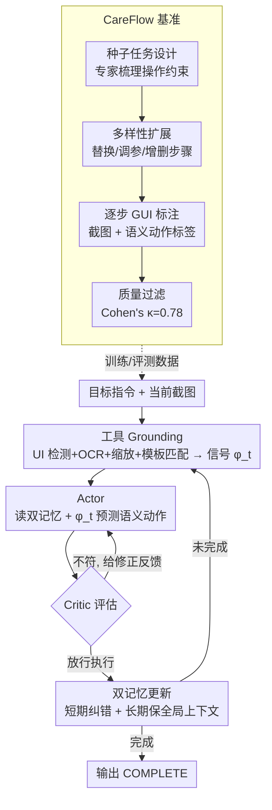

# CarePilot: A Multi-Agent Framework for Long-Horizon Computer Task Automation in Healthcare

**会议**: CVPR 2026 Findings  
**arXiv**: [2603.24157](https://arxiv.org/abs/2603.24157)  
**代码**: 有 (Carepilot项目页)  
**领域**: LLM Agent / 医疗自动化  
**关键词**: 医疗软件自动化, 多Agent框架, Actor-Critic, 长视界GUI交互, 双记忆机制

## 一句话总结
提出CareFlow基准（1050个医疗软件长视界工作流任务，8-24步，覆盖DICOM/3D Slicer/EMR/LIS四大系统）和CarePilot框架（基于Actor-Critic范式，集成工具grounding和双记忆机制），在CareFlow上超越GPT-5约15%的任务准确率。

## 研究背景与动机

**领域现状**：多模态Agent已在Android/桌面/Web环境取得进展（Mind2Web、SeeAct、UI-TARS等），但缺乏面向医疗软件的标准化基准。

**医疗软件的独特挑战**：(1) 日常临床操作需链接10-15个依赖步骤（打开研究→配置视图→标注→导出→更新记录）；(2) 各平台高度异构且频繁更新；(3) 严格的数据完整性、审计追踪和隐私合规要求；(4) 界面布局机构特异性强——过度拟合表面布局的Agent脆弱。

**现有痛点**：(1) 无公开医疗软件长视界交互基准；(2) 现有VLM（GPT-4o、Gemini等）在医疗GUI上表现差——步级准确度尚可但任务完成率极低。

**切入角度**：构建首个医疗软件长视界基准 + 设计具备工具grounding和记忆机制的Actor-Critic Agent。

**核心idea**：Actor预测下一步动作→Critic评估并修正→双记忆（短期+长期）维持工作流上下文→迭代仿真训练提升鲁棒性。

## 方法详解

### 整体框架
CarePilot 面向的是医疗软件里那种"8–24 步、错一步全盘崩"的长流程任务（如在 DICOM 浏览器里调出某序列再标注）。它的一步闭环是：自然语言目标 + 当前截图 → **工具 Grounding**（UI 检测 + OCR + 缩放 + 模板匹配）定位控件 → **Actor** 读双记忆 + grounding 信号预测语义动作 → **Critic** 评估（给修正反馈或放行执行）→ 更新记忆 → 进入下一步。整套设计由四块组成：一个领域基准（CareFlow）、感知层（工具 Grounding）、记忆层（双记忆）、决策层（Actor-Critic）。

### 关键设计

**1. CareFlow 基准：先有靠谱的医疗任务数据**

医疗 GUI 自动化缺数据，作者先用四阶段标注流程造了一个基准：

- **(i) 种子任务设计**：与领域专家协作，梳理各软件的使用模式与操作约束，提取核心任务清单。
- **(ii) 多样性扩展**：控制替换（"MRI 报告"→"X 光报告"）、调参数、增删步骤。
- **(iii) 逐步 GUI 标注**：每步存截图 + 精确的下一步语义动作标签。
- **(iv) 质量过滤**：按时间顺序一致性 + 任务完整性 + 指令清晰度筛，标注一致性 Cohen's κ=0.78。

覆盖 Weasis/Orthanc（DICOM）、3D Slicer（标注）、OpenEMR（EMR）、OpenHospital（LIS）；规模 1050 任务（735 训练 + 315 测试，含 50 OOD），每任务 8–24 步，6 种动作（CLICK/SCROLL/ZOOM/TEXT/SEGMENT/COMPLETE）。

**2. 工具 Grounding：把"看不清的小控件"先定位准**

医疗软件控件密、字小、主题多变，直接让 VLM 点容易点偏。CarePilot 用四个感知模块兜底，输出聚合成统一 grounding 信号 $\phi_t$：开放词汇 **UI 目标检测**（给文本查询返回控件 bbox）、**Zoom/Crop**（放大看小控件）、**OCR**（提取序列名/患者字段/订单号等文本标签）、**模板/图标匹配**（对主题、缩放、语言变化鲁棒）。

**3. 双记忆：对抗长流程里的误差累积**

长流程最怕错误一步步滚雪球。CarePilot 给 Actor 配两层记忆：

- **短期记忆** $\mathcal{M}_t^S = f^S(x_{t-1}, a_{t-1}, r_{t-1})$：装上一步的截图、动作、Critic 反馈，负责"快速反应、立即纠错"。
- **长期记忆** $\mathcal{M}_t^L = f^L(\mathcal{M}_{t-1}^L, \mathcal{M}_t^S, \phi_t)$：一个紧凑的轨迹嵌入，整合历史状态/动作/结果，负责"保持全局上下文不跑偏"。

动作预测同时条件化于两者：$a_t = \pi_\theta(g, x_t, \mathcal{M}_t^S, \mathcal{M}_t^L)$——短期管细节、长期管大局，两者互补才扛得住 20+ 步。

**4. Actor-Critic：边做边自查**

Actor 和 Critic 都用 Qwen-VL 2.5-7B 实例化，只是输入条件和角色不同。Actor 看当前界面 + 指令 + grounding 信号 + 记忆，提出语义动作；Critic 评估这个提议，给修正反馈或批准执行，并更新双记忆。训练时 Critic 对照参考轨迹给信号，推理时则靠执行结果或验证器反馈——相当于每一步都过一道"自查"，降低错误进入历史的概率。

### 一个完整 walkthrough（"在 Weasis 里打开 T2 序列并测量病灶"）
1. **Grounding**：当前截图送四模块 → UI 检测找到序列列表、OCR 读出各序列名 → $\phi_t$ 标出"T2"那一项的 bbox。
2. **Actor**：结合目标 + $\phi_t$ + 记忆，提议 `CLICK(T2 序列项)`。
3. **Critic**：核对——目标确实要 T2，放行执行；短期记忆记下"已选 T2"。
4. **下一步**：界面切换到 T2 视图，长期记忆保留"任务进度=已定位序列，待测量"，Actor 提议 `ZOOM` 放大病灶区。
5. **纠错示例**：若某步 Actor 误点成 T1，Critic 比对目标发现不符 → 不放行、给修正反馈 → Actor 重选，错误不进长期记忆，避免后续步骤在错状态上累积。
6. **收尾**：完成测量后输出 `COMPLETE`。

这条链显示四块如何协同：Grounding 让点击点得准、双记忆扛住长流程、Critic 在错误扩散前拦截。

### 训练策略
任务建模为序列决策，成败由验证器 $V$ 判定整条工作流是否成功完成：

$$\hat{a}_{1:T} = \mathbb{1}[V(g, x_{1:T}, a_{1:T}) = 1]$$

## 实验关键数据

### 主实验（CareFlow）

| 模型 | Weasis SWA/TA | 3D Slicer SWA/TA | OpenEMR SWA/TA | Average SWA/TA |
|------|:-:|:-:|:-:|:-:|
| Qwen2.5 VL 7B | 58.6/1.3 | 61.4/1.7 | 63.2/1.7 | 57.2/1.8 |
| Llama 4 Maverick | 88.2/18.7 | 71.6/3.4 | 78.0/25.7 | 80.5/19.2 |
| GPT-4o | 85.3/20.0 | 77.5/27.4 | 85.1/27.5 | 83.1/25.4 |
| GPT-5 | 88.7/31.3 | 81.4/37.9 | 83.8/31.3 | 85.2/36.2 |
| **CarePilot (7B)** | **90.4/40.0** | **82.1/54.8** | - | **SOTA** |

CarePilot(基于7B模型)在Task Accuracy上超越GPT-5约15%。

### 消融实验

| 配置 | Avg SWA | Avg TA | 说明 |
|------|---------|--------|------|
| Qwen-VL 7B (基线) | 57.2 | 1.8 | 无Agent框架 |
| + 工具Grounding | +提升 | +提升 | 感知增强 |
| + 双记忆 | +提升 | +提升 | 上下文保持 |
| + Actor-Critic | **SOTA** | **SOTA** | 修正反馈关键 |

### 关键发现
- **步级准确度vs任务准确度的巨大鸿沟**：GPT-4o步级准确度83%但任务完成率仅25%——长视界中错误累积导致任务完成率急剧下降
- CarePilot的Critic修正机制有效缓解了错误累积，将任务完成率从基线的~2%提升到40%+
- 3D Slicer(医学标注)是最难的软件——需要精细的空间操作(分割/测量)，CarePilot在此子集上改进最大
- OOD测试集(50个任务)上CarePilot仍有3.38%的改进，证明一定程度的泛化能力
- 工具Grounding中OCR对EMR系统最关键（大量文本字段需精确识别）

## 亮点与洞察
- **首个医疗GUI长视界基准**：CareFlow填补了医疗软件AI自动化评测的空白。四阶段标注流程严谨，种子任务来自真正的临床从业者日常操作
- **7B模型超越GPT-5**：CarePilot证明了合适的Agent框架比更大的模型更重要——工具增强+记忆+修正反馈让7B模型在领域任务上超越GPT-5
- **Actor-Critic的医疗适配**：Critic不仅评估对错，还提供"怎么修正"的反馈——这对安全关键的医疗场景尤为重要
- **步级准确度≠任务成功**：这个发现对所有长视界Agent研究都有警示——不能仅看单步指标

## 局限与展望
- CareFlow仅覆盖5个开源医疗软件——商业系统(Epic, Cerner)的泛化有待验证
- Actor和Critic基于同一模型可能导致"盲点一致性"——不同模型做Actor和Critic可能更好
- 当前迭代仿真训练依赖参考轨迹——真实部署中需要不依赖参考的在线学习方案
- 安全性评估不足——医疗场景中错误操作可能有严重后果

## 相关工作与启发
- **vs WebArena/AppWorld**: 通用桌面/Web Agent基准，不覆盖医疗领域特殊需求
- **vs Voyager/Reflexion**: 记忆和反思机制启发了CarePilot的设计，但它们面向游戏/通用场景
- **vs Mind2Web/SeeAct**: 短视界GUI Agent，无法处理医疗工作流的长依赖链

## 评分
- 新颖性: ⭐⭐⭐⭐ 领域应用创新(首个医疗GUI基准)，框架设计合理
- 实验充分度: ⭐⭐⭐⭐⭐ 多系统、多基线(含GPT-5)、OOD测试、充分消融
- 写作质量: ⭐⭐⭐⭐ 基准构建过程详细，框架描述清晰
- 价值: ⭐⭐⭐⭐⭐ 对医疗AI自动化有直接应用价值

<!-- RELATED:START -->

## 相关论文

- [\[CVPR 2026\] Think, Then Verify: A Hypothesis-Verification Multi-Agent Framework for Long Video Understanding](think_then_verify_a_hypothesis-verification_multi-agent_framework_for_long_video.md)
- [\[ICLR 2026\] The Tool Decathlon: Benchmarking Language Agents for Diverse, Realistic, and Long-Horizon Task Execution](../../ICLR2026/llm_agent/the_tool_decathlon_benchmarking_language_agents_for_diverse_realistic_and_long-h.md)
- [\[ICLR 2026\] AgentSynth: Scalable Task Generation for Generalist Computer-Use Agents](../../ICLR2026/llm_agent/agentsynth_scalable_task_generation_for_generalist_computer-use_agents.md)
- [\[CVPR 2026\] Nerfify: A Multi-Agent Framework for Turning NeRF Papers into Code](nerfify_multiagent_nerf_paper_to_code.md)
- [\[ICLR 2026\] Efficient Agent Training for Computer Use](../../ICLR2026/llm_agent/efficient_agent_training_for_computer_use.md)

<!-- RELATED:END -->
