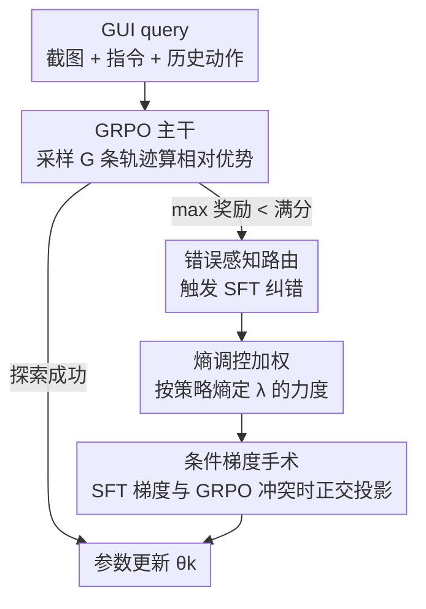

# CGL: Advancing Continual GUI Learning via Reinforcement Fine-Tuning

**会议**: CVPR 2026  
**论文**: [CVF Open Access](https://openaccess.thecvf.com/content/CVPR2026/html/Yao_CGL_Advancing_Continual_GUI_Learning_via_Reinforcement_Fine-Tuning_CVPR_2026_paper.html)  
**代码**: 论文称将开源（benchmark / code / model），尚未给出仓库地址  
**领域**: Agent / 持续学习 / 强化微调  
**关键词**: GUI Agent, 持续学习, GRPO, 梯度手术, 策略熵  

## 一句话总结
针对 GUI agent 在 app 频繁更新下"学新忘旧"的问题，本文发现 SFT 学得快但会覆写旧知识、RL（GRPO）抗遗忘但学得慢，于是提出 CGL 框架——用"错误感知路由 + 熵调控加权 + 条件梯度手术"把 SFT 和 GRPO 拧成一股绳，在自建的 AndroidControl-CL 基准上同时拿到最高准确率和近乎为零的遗忘度。

## 研究背景与动机
**领域现状**：GUI agent 借助多模态大模型（MLLM）已经能看懂界面截图、按自然语言指令一步步点按操作。主流训练范式要么纯 SFT（在大规模标注 GUI 轨迹上监督微调），要么用 GRPO 这类 RL 做强化微调。但这些范式都假设任务集是静态的。

**现有痛点**：真实世界的 GUI 一直在变——app 更新、新品类出现、登录页布局或菜单层级微调，都可能让原来学好的交互策略整个失效。把 agent 顺序丢进一串演进中的 app 里训练，它在"祖先任务"上的表现会断崖式下跌。而 GUI 任务是长程动作依赖：一整条轨迹的成败取决于每一个中间步骤是否精确，这让灾难性遗忘比传统视觉/NLP 持续学习更致命。

**核心矛盾**：作者做了一组关键的对照实验（Fig. 2）揭示出 SFT 和 RL 走在两条相反的优化路径上。SFT 梯度更新很"猛"，强行把模型参数拉向新任务的流形，从而破坏旧知识的结构完整性——学得快但遗忘重。GRPO 则有一种"内在韧性"：它保留更宽的行为多样性，能在不抹掉底层交互逻辑的前提下优化奖励——抗遗忘但样本复杂度高、在陌生环境里收敛慢，达不到现实的效率要求。于是稳定性（旧任务）和可塑性（新任务）成了一对此消彼长的 trade-off。

**本文目标**：在持续学习设定下，让 agent 既能快速吸收新 app 的交互技能，又不踩坏已掌握技能的"逻辑红线"。

**切入角度**：既然 SFT 强在可塑性、GRPO 强在稳定性，那就不要二选一，而是让两者协同——用 GRPO 当主干保护旧逻辑，只在 GRPO 探索失败时才有针对性地注入 SFT，并在参数层面消解两者的梯度冲突。

**核心 idea**：以 GRPO 为锚、SFT 为补丁，通过"何时注入 SFT（路由）、注入多强（熵调控）、注入方向如何不伤旧知识（梯度手术）"三件事，把监督信号约束在不破坏 GRPO 抗遗忘方向的子空间里。

## 方法详解

### 整体框架
CGL 把 agent 当作一个策略网络 $\pi_\theta$，在每个时间步看到当前截图 $v_t$ 和全局自然语言指令 $I$，输出文本形式的下一步动作 $a_t$，再解析成可执行的 GUI 指令（点按坐标、滑动、输入文本）。持续学习协议是严格的：任务 $T_1,\dots,T_N$ 按时间顺序到来，各任务的 app 集合互不重叠（$A_i \cap A_j=\varnothing$），训练第 $k$ 个任务时只能用 $D_k^{train}$、不能回看任何历史训练数据，但评测要在累计测试集 $\bigcup_{i=1}^{k} D_i^{test}$ 上做。

整个框架围绕一个联合优化目标展开，把 GRPO 损失和被动态加权的 SFT 损失加在一起：

$$\mathcal{L} = \mathcal{L}_{GRPO} + \lambda(H, step)\cdot \mathcal{L}_{SFT}$$

其中 GRPO 是主干（负责抗遗忘），SFT 是受控补丁（负责快速纠错），权重 $\lambda$ 由策略熵 $H$ 和训练步数共同决定。三个核心模块各管一件事：**错误感知路由**决定"什么时候"触发 SFT，**熵调控加权**决定 SFT 的"力度"，**条件梯度手术**决定 SFT 更新的"方向"不能伤到 GRPO 的抗遗忘方向。

### 关键设计

**1. 错误感知路由：只在 GRPO 探索失败时才请 SFT 出手**

纯 GRPO 训 GUI agent 有个致命短板：当策略还没学会某个新交互模式时，对同一条指令采样出的 G 条 rollout 可能全错。GRPO 的优势是组内相对的——$A_{i,t}=\frac{r_i-\mu_r}{\sigma_r+\epsilon}$（$\mu_r,\sigma_r$ 是该组奖励的均值和标准差）。如果整组都拿不到满分，相对优势就退化成几乎无差别的信号，agent 陷入无效探索、学不动新技能。错误感知路由就是来打破这个死锁：对每条指令检查它 $K$ 条 rollout 的奖励，只要 $\max_k r(\tau_k) < r_{max}$（最高奖励都够不到满分），就判定策略自己探索不出正确解，于是把这次更新路由到一步 SFT，用 ground-truth 演示 $\tau^*$ 优化似然 $\mathcal{L}_{SFT}=-\frac{1}{|o^*|}\sum_t \log\pi_\theta(o^*_t\mid s, o^*_{<t})$。对坐标类空间动作，还会在目标框内采样 $G$ 个有效点做增强 SFT，提升空间泛化。这样 SFT 只被用来修"病态偏差"（GRPO 怎么试都试不出成功路径的地方），而不是无差别地覆写。

**2. 熵调控加权：用策略熵控制 SFT 注入的"温度"，先升温探索后降温收敛**

光有路由还不够——SFT 注入太多会盖过 GRPO 伤旧知识，太少又救不了卡死的探索。作者把 SFT 权重 $\lambda$ 做成策略熵 $H(\pi_\theta(\cdot|s))=-\sum_a \pi_\theta(a|s)\log\pi_\theta(a|s)$ 的函数，并给出一阶理论：一步优化引起的熵变可近似为当前对数概率与 logit 更新的负协方差 $\Delta H \approx -\mathrm{Cov}_{a\sim\pi_\theta}(\log\pi_\theta(a|s), \Delta z_a)$。基于此分两阶段：

- **阶段一·熵注入（warmup）**：前 $step_w$ 步把 $\lambda$ 线性升到最大。此时模型常常病态地偏向错误动作、ground-truth 动作概率趋近 0；SFT 更新 $\Delta z^{SFT}_a \propto (\mathbb{I}[a=a^*]-\pi_\theta(a|s))$ 给低概率的 $a^*$ 一个大正更新、给高概率错误动作负更新，制造强负协方差从而注入熵（$\Delta H_{SFT}>0$），把分布"加热"、跳出局部极小、逼 agent 去探索正确空间。
- **阶段二·熵衰减（收敛）**：一旦基本能力建立，$\lambda$ 按熵的指数函数衰减

$$\lambda(H) = (\lambda_{max}-\lambda_{min})\,\min\!\big(1,\, k e^{\gamma H}\big) + \lambda_{min}$$

此时 GRPO 更新（$\Delta z^{GRPO}_a \propto \pi_\theta(a|s)A(s,a)$）主导，因"马太效应"强化已高概率且正优势的动作，产生正协方差把熵压下去（$\Delta H_{GRPO}<0$）。随着 $H$ 下降 $\lambda$ 同步衰减，保证 SFT 不再干扰 GRPO 的精确收敛，让知识固化下来利于长期保留。

**3. 条件梯度手术：只在 SFT 梯度与 GRPO 抗遗忘方向打架时才"动刀"**

即使控制了时机和力度，SFT 和 GRPO 在参数层面仍可能方向冲突，破坏旧知识。作者用条件式手术：只有当两梯度夹角超过 90°（余弦相似度为负）才修正，否则原样保留。冲突判据是 $\cos\alpha = \frac{\nabla_\theta\mathcal{L}_{SFT}\cdot\nabla_\theta\mathcal{L}_{GRPO}}{\|\nabla_\theta\mathcal{L}_{SFT}\|_2\,\|\nabla_\theta\mathcal{L}_{GRPO}\|_2} < 0$。一旦检测到冲突，就把 SFT 梯度里与 GRPO 反向的平行分量 $\nabla_\parallel = \frac{\nabla_\theta\mathcal{L}_{SFT}\cdot\nabla_\theta\mathcal{L}_{GRPO}}{\|\nabla_\theta\mathcal{L}_{GRPO}\|_2^2}\nabla_\theta\mathcal{L}_{GRPO}$ 剪掉，只保留与 GRPO 正交的部分 $\nabla_\theta\mathcal{L}_{SFT}^* = \nabla_\theta\mathcal{L}_{SFT}-\nabla_\parallel$。最终 SFT 更新为：

$$\nabla_\theta\mathcal{L}_{SFT}^{final} = \begin{cases}\nabla_\theta\mathcal{L}_{SFT}^*, & \cos\alpha<0\ (\text{冲突})\\[2pt] \nabla_\theta\mathcal{L}_{SFT}, & \text{否则}\end{cases}$$

这样既消除了对抗 GRPO 抗遗忘方向的更新分量，又保留所有与之正交（即不冲突）的 SFT 信息，相当于在不踩"逻辑红线"的前提下尽量吸收新知识。

### 损失函数 / 训练策略
全局目标即 $\mathcal{L}=\mathcal{L}_{GRPO}+\lambda(H,step)\cdot\mathcal{L}_{SFT}$；GRPO 用带 clip 和 KL 约束的标准目标（KL 系数 0.01），公平起见所有方法都先在首任务上 SFT 建立共享基线，后续任务再各按持续学习策略顺序学习。关键超参：$\lambda_{max}=1,\lambda_{min}=0,H_{max}=0.45,step_w=5,\gamma=20,k=e^{-10}$；GRPO/CGL 基于 verl，batch 16、rollout batch 512、学习率 $10^{-6}$、采样组 8；8×Ascend 910B NPU 训练。

## 实验关键数据

### 主实验
自建 Android-CL（AndroidControl-CL）基准，把 GUI 任务按 7 个 app 品类（购物 SP / 通讯 CO / 生产力 PO / 出行 TT / 系统工具 ST / 教育科学 ES / 生活娱乐 LE）切成顺序任务组，并定义 3 种任务顺序检验鲁棒性。指标含 Step-wise Accuracy、Trajectory-wise Accuracy 和遗忘度 FM（$FM=\frac{1}{N-1}\sum_{k=1}^{N-1}(A_{N,k}-A_{k,k})$，越接近 0 越不遗忘）。下表为 QwenVL2.5-3b 在 Task Order 1 下的对比：

| 方法 | Avg. Step-Acc.(%) | Avg. Traj-Acc.(%) | Avg. FM |
|------|------|------|------|
| SFT | 76.90 | 23.53 | -5.73 |
| SFT+KL | 80.84 | 34.69 | -1.01 |
| SFT+Replay | 79.80 | 30.19 | -3.11 |
| GRPO | 81.53 | 36.78 | -0.62 |
| RIF-RFT | 80.44 | 32.91 | -0.58 |
| **CGL (Ours)** | **82.33** | **38.03** | **-0.02** |
| SFT-Joint-Training（上界） | 83.48 | 41.66 | - |

CGL 在两种规模骨干（LLaVA-OneVision-0.5b 与 QwenVL2.5-3b）上都拿到最高 Step/Traj 准确率和最小 FM。轻量 0.5b 上 Step-Acc 77.84%、比各 baseline 高 1.27–5.18 pp，FM 仅 -0.52（远好于 SFT 的 -6.81）。跨 3 种任务顺序也稳定领先，其中 Task Order 2 下 CGL 甚至拿到 **正向 FM(+0.13)**——持续学习里罕见的"不仅不忘旧任务、还略有增益"。

### 消融实验
QwenVL2.5-3b 在 Task Order 1 下逐模块叠加（D-SFT=动态 SFT、D-λ=动态权重、G-Surg=梯度手术）：

| 配置 | Step-Acc(%) | Traj-Acc(%) | FM |
|------|------|------|------|
| SFT | 76.90 | 23.53 | -5.73 |
| SFT+KL | 80.84 | 34.69 | -1.01 |
| GRPO(+KL) | 81.53 | 36.78 | -0.62 |
| GRPO+静态SFT | 81.68 | 36.79 | -0.57 |
| GRPO+D-SFT | 81.90 | 37.12 | -0.33 |
| GRPO+D-SFT+D-λ | 82.23 | 37.62 | -0.07 |
| GRPO+D-SFT+G-Surg | 82.10 | 37.57 | -0.05 |
| **Full CGL** | **82.33** | **38.03** | **-0.02** |

### 关键发现
- **GRPO 的抗遗忘不只来自 KL**：SFT+KL 三项指标仍全面逊于 GRPO，说明 GRPO 的持续学习能力另有来源（相对优势机制本身保留了行为多样性）；而 GRPO 离了 KL 约束会直接崩溃、跑不出数。
- **动态优于静态**：把静态全量 SFT 换成 D-SFT（只在弱点处纠错）就把 Step-Acc 从 81.68 提到 81.90，避免冗余知识干扰；再加 D-λ 进一步到 82.23 且 FM 收到 -0.07。
- **两路互补**：D-λ 管权重、G-Surg 管梯度方向，合在一起 FM 收敛到 -0.02，比单加任一个都好，验证"力度"与"方向"是两件正交的事。
- **λ 取值敏感性**：固定 $\lambda=1$/0.2/0.01 时 Step-Acc 分别为 81.62/81.58/81.90，固定值都不如熵动态调控，佐证按熵自适应的必要性。

## 亮点与洞察
- **"SFT 学新、RL 守旧"的对照实证很有说服力**：先用一组干净的 Fig. 2 实验把 SFT 与 GRPO 的可塑性/稳定性差异量化出来，再顺势设计协同机制，动机扎实而非堆模块。
- **把策略熵当成可控旋钮**：用一阶熵变 ≈ 负协方差的近似，把"先升温探索、后降温收敛"翻译成 $\lambda$ 的两阶段调度，思路可迁移到任何 SFT+RL 混合训练里调节探索-利用。
- **条件梯度手术只在真冲突时动刀**：相比无差别正交化，余弦判据 + 正交投影既保住不冲突的 SFT 信息又剪掉对抗分量，是个轻量可复用的 trick，适合任何多目标联合优化场景。
- **AndroidControl-CL 把"软件版本演进"做成可评测协议**：按 app 品类切任务、严格数据隔离、多任务顺序，给 GUI-CL 提供了一个标准化竞技场。

## 局限与展望
- **基准是自建且单一来源**：实验只在 AndroidControl-CL（7 类 Android app）上做，是否能推广到 iOS / 桌面 / Web GUI、以及真实线上版本更迭，尚待验证。
- **依赖 ground-truth 演示做纠错**：错误感知路由触发 SFT 时需要可用的 $\tau^*$ 标注，现实持续学习场景下新 app 的高质量演示未必随手可得 ⚠️。
- **奖励函数细节在附录**：正文未展开 reward 设计（仅指向 Sup.2），坐标动作的奖励/容差怎么定会显著影响路由触发频率，复现需留意。
- **超参偏多**：$\lambda_{max},H_{max},step_w,\gamma,k$ 等需调，跨任务/跨模型迁移时的调参成本未充分讨论。

## 相关工作与启发
- **vs 纯 SFT / SFT+Replay**：传统范式靠监督或重放历史数据抗遗忘，但 SFT 梯度过猛覆写旧知识、Replay 受 buffer 大小与历史数据可得性限制；CGL 不存历史数据，靠 GRPO 内在韧性 + 受控 SFT 实现抗遗忘。
- **vs GRPO（DeepSeek-R1 系）**：UI-R1 / GUI-G1 / GUI-G2 等把 R1-zero 式 RL 用于 GUI grounding，但都聚焦静态任务且收敛慢；CGL 首次在持续学习设定下分析 SFT、RL 及其融合如何影响 GUI agent，并补上 RL 学新慢的短板。
- **vs RIF-RFT**：同为面向大模型持续后训练的框架（基于 rollout 的实例过滤），但 CGL 在准确率和 FM 上均优于它，差别在于 CGL 显式做了"路由 + 熵调权 + 梯度手术"三层协同而非仅样本筛选。

## 评分
- 新颖性: ⭐⭐⭐⭐ 首次系统分析 SFT/RL/融合在 GUI 持续学习下的作用，三模块协同设计有机串联。
- 实验充分度: ⭐⭐⭐⭐ 两骨干 × 三任务顺序 + 逐模块消融 + λ 敏感性，较完整；但仅单一自建 Android 基准。
- 写作质量: ⭐⭐⭐⭐ 动机—机制—公式链条清晰，熵动力学推导给出直觉，附录承载较多细节。
- 价值: ⭐⭐⭐⭐ 给 GUI agent 落地（app 频繁更新）提供了实用的抗遗忘训练范式与可复用的梯度手术/熵调权 trick。

<!-- RELATED:START -->

## 相关论文

- [\[CVPR 2026\] SAGE: Training Smart Any-Horizon Agents for Long Video Reasoning with Reinforcement Learning](sage_training_smart_any-horizon_agents_for_long_video_reasoning_with_reinforceme.md)
- [\[CVPR 2026\] SenseSearch: Empowering Vision-Language Models with High-Resolution Agentic Search-Reasoning via Reinforcement Learning](sensesearch_empowering_vision-language_models_with_high-resolution_agentic_searc.md)
- [\[AAAI 2026\] MoralReason: Generalizable Moral Decision Alignment For LLM Agents Using Reasoning-Level Reinforcement Learning](../../AAAI2026/llm_agent/moralreason_generalizable_moral_decision_alignment_for_llm_agents_using_reasonin.md)
- [\[CVPR 2026\] OS-Oracle: A Comprehensive Framework for Cross-Platform GUI Critic Models](os-oracle_a_comprehensive_framework_for_cross-platform_gui_critic_models.md)
- [\[ACL 2026\] Temp-R1: A Unified Autonomous Agent for Complex Temporal KGQA via Reverse Curriculum Reinforcement Learning](../../ACL2026/llm_agent/temp-r1_a_unified_autonomous_agent_for_complex_temporal_kgqa_via_reverse_curricu.md)

<!-- RELATED:END -->
