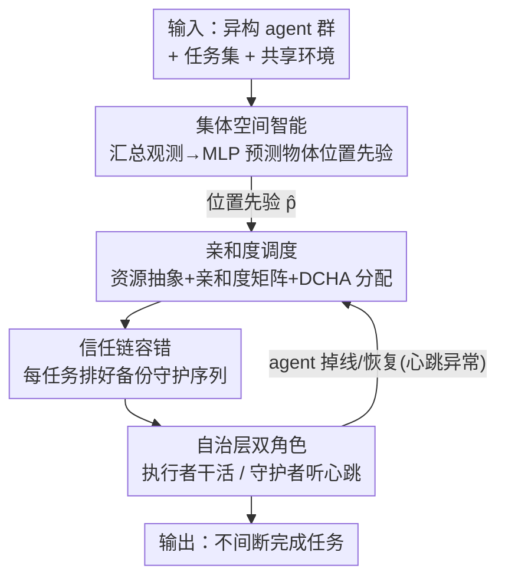

# DRAMA: Next-Gen Dynamic Orchestration for Resilient Multi-Agent Ecosystems in Flux

**会议**: CVPR 2026  
**论文**: [CVF Open Access](https://openaccess.thecvf.com/content/CVPR2026/html/Zhao_DRAMA_Next-Gen_Dynamic_Orchestration_for_Resilient_Multi-Agent_Ecosystems_in_Flux_CVPR_2026_paper.html)  
**代码**: 无（论文未提供）  
**领域**: Agent  
**关键词**: 具身多智能体、动态编排、容错接管、匈牙利算法、集体空间智能

## 一句话总结
DRAMA 把具身多智能体系统里的 agent 和 task 统一抽象成"资源实体"，用亲和度矩阵 + 改造版匈牙利算法做事件触发的动态调度，再加一条"信任链"做去中心化故障接管，让团队在 agent 中途掉线/加入/恢复时仍能不间断完成任务，在 VirtualHome-Social 上比 SOTA 平均步数更少、冲突率更低、吞吐更高。

## 研究背景与动机
**领域现状**：基于 LLM 的具身多智能体系统（EMAS）已经能让一组异构 agent 协作完成长程、开放世界的家务类任务，靠的是 agent 间的规划、通信和分工。

**现有痛点**：绝大多数 EMAS 框架是**静态架构**——agent 的能力和任务分配在初始化时（$t=0$）就定死，整个执行过程不再改。论文把这点写成公式：静态范式相当于 $f_t = f_0,\ \forall t \in [1,T]$，于是系统目标退化成只对 $f_0$ 做一次性优化。可现实环境里团队组成和任务都是"流动"的：agent 会临时掉线、故障、又恢复，新 agent 会加入，任务也会变更优先级。

**核心矛盾**：静态分配一旦定死，就会出现 agent 空转、任务过载、对故障毫无响应、扩展性差等问题。根子在于系统**没有一个持续监控 + 反馈重分配**的机制把 $f_t$ 随环境演化更新。

**本文目标**：做一个能实时响应 agent 到达/掉线/恢复的弹性编排框架——既要在稳定场景下高效，又要在团队人数频繁波动时不中断任务。

**切入角度**：作者的关键观察是——如果把 agent 和 task 都看成"资源实体"，那么"谁来干哪个任务"就变成一个可以反复重解的**带约束分配问题**，再配上一套备份接管协议，动态性就被自然地纳入了调度框架。

**核心 idea**：用"亲和度驱动的事件触发再调度 + 分层信任链接管"替代固定分配，并用一个共享的集体空间记忆给调度提供位置先验。

## 方法详解

### 整体框架
DRAMA 是一个**三层架构**：上面是 **Strategic Layer（策略层）**，负责把 agent–task 的分配映射 $f_t$ 动态优化好，并预先排好容错备份；中间是 **Collective Intelligence Layer（集体智能层）**，把所有 agent 的视觉观测汇总成共享的空间先验，预测"某个物体/任务大概在哪"；底层是 **Autonomous Layer（自治层）**，每个 agent 同时扮演"执行者"和"守护者"两个角色，一边感知-规划-导航-行动，一边监听同伴心跳。

整条回路是**事件触发**的：集体智能层给出物体位置先验 $\hat{\mathbf{p}}_j$ → 策略层据此算亲和度并用 DCHA 分配任务、再排出信任链 → 自治层的执行者去干活、守护者盯着心跳 → 一旦某 agent 失联（掉线/故障），守护者立刻按信任链接管未完成任务，并触发策略层局部重算亲和度、重新调度。整个过程不需要中央协调器逐步指挥，故障恢复是去中心化的。

### 关键设计

**1. 资源统一抽象 + 亲和度驱动调度：把"谁干哪个任务"变成可反复重解的分配问题**

静态框架的硬伤是分配定死。DRAMA 把 agent 和 task 都当成"资源实体"统一建模，于是分配就是一个可以在任意时刻重解的指派问题。在时刻 $t$，agent $a_i$ 与任务 $q_j$ 的瞬时亲和度定义为可用工作量容量和预测空间距离的加权组合：

$$\mathcal{S}_{ij,t} = w_1 \cdot v_i(t) - w_2 \cdot \mathrm{Dist}\big(\mathbf{x}_i(t), \hat{\mathbf{p}}_j(t)\big)$$

其中 $v_i(t)$ 是 agent 当前可用度，$\mathbf{x}_i(t)$ 是它当前位置，$\hat{\mathbf{p}}_j(t)$ 是集体智能层预测的任务位置，$\mathrm{Dist}(\cdot)$ 是欧氏距离，$w_1, w_2 > 0$ 为权重。直觉是：越闲、离目标越近的 agent，越适合接这个任务。全局调度的目标就是找一组分配最大化总亲和度：$f_t^* = \arg\max_{f_t} \sum_{j=1}^{M} \mathcal{S}_{f_t(q_j)j,t}$。这套抽象让协调变得模块化、解耦——任何时刻只要环境一变，重算亲和度矩阵再求一次最优指派即可，不必重构系统。

**2. Dual-Capacity Hungarian Assignment（DCHA）：把经典匈牙利算法改造成"一个 agent 可接两个任务"的全局最优指派**

经典匈牙利算法只能做一对一指派，但现实里一个 agent 应当能同时负责多个任务。DRAMA 的做法很巧：给每个真实 agent $a_i$ 拆出**两个虚拟槽位** $\{v_{i,1}, v_{i,2}\}$（即容量上限为 2），用这些虚拟槽位和任务构建代价矩阵 $C[v_{i,k}, t_j] = -\mathrm{Aff}(a_i, t_j)$（取负是因为匈牙利求最小代价、而我们要最大亲和度），再把矩阵补成 $K \times K$（$K=\max(|V|,|T|)$，空缺填 $\infty$）以套用标准匈牙利求解，最后把虚拟槽位的指派结果合并回真实 agent、过滤掉 dummy 任务。这样既保留了匈牙利算法的**全局最优**保证，又支持一对多分配，避免了贪心式分配常见的局部最优。

**3. 分层信任链接管：让每个任务都有一条有序备份序列，故障时无缝接力**

只会重新分配还不够——agent 真掉线的瞬间需要立刻有人顶上。DCHA 给出主分配后，DRAMA 对每个任务 $q_j$ 按亲和度降序把所有 agent 排成 $a_{(1)} \succ a_{(2)} \succ \cdots \succ a_{(N)}$，被选中的 $a_{(1)} = f_t^*(q_j)$ 作为主执行者占据链头，其余 agent 组成有序守护序列 $a_{(1)} \rightarrow a_{(2)} \rightarrow \cdots \rightarrow a_{(N)}$，箭头表示"守护方向"：每个守护者监督它前面那个 agent 的运行状态、随时待命接管。若 $a_{(1)}$ 失效，责任立即交给 $a_{(2)}$；$a_{(2)}$ 又失效则 $a_{(3)}$ 顶上，依此类推。每次接管后做一次**局部重校准**，更新工作量平衡和亲和度关系，保证后续调度仍连贯。这条链是 DRAMA 能"唯一支持掉线/恢复场景"的关键——故障恢复是去中心化、即时的，不依赖中央调度器重新洗牌。

**4. 集体空间智能 + 自治层双角色：共享空间先验喂给调度，每个 agent 自己执行又互相守护**

这一条把中间层和底层一起讲。**集体智能层**让每个 agent 探索时记录视觉观测 $H_{i,t} = \{(o_k, p_k)\mid k<t\}$（$o_k$ 是看到的物体/任务类型，$p_k$ 是其坐标），所有 agent 把历史合并成共享记忆 $H_t = \bigcup_{i=1}^N H_{i,t}$，捕捉物体-位置的共现关系。它不止用经验频率这种粗先验，而是训练一个 MLP 预测器 $\hat{\mathcal{P}}_\theta(o,p\mid x_t) = f_\theta(x_t)$ 来逼近联合分布 $P(o,p)$，给定上下文 $x_t$（当前房间特征、语义线索、共现物体）输出物体出现在某位置的概率，再取期望或 argmax 得到查询物体的最可能位置 $\hat{\mathbf{p}}_j$——这个先验正是第 1 条亲和度公式里的 $\hat{\mathbf{p}}_j(t)$，也能泛化到没探索过的区域。**自治层**则给每个 agent 配两条并行通路：执行者通路维持感知-规划-导航-行动的闭环，并用**分层记忆管理**（关键子任务保留细节、近期次要事件压缩成摘要、过时数据丢弃）控制上下文膨胀；守护者通路持续监听同伴心跳，一旦发现延迟/掉线/故障，takeover 模块就按当前工作量和空间邻近度把未完成任务重分配出去并触发重执行。

## 实验关键数据

环境为 Unity 的 **VirtualHome-Social**（在 C-WAH 基础上加大物体数量和任务多样性），三项指标：**Average Steps（AS，越低越好）**、**Conflict Rate（CR，越低越好，衡量两 agent 同时对同一物体做同一动作的冲突比例）**、**Throughput（TP，越高越好，成功目标数 / 总步数）**。对比 CoELA、MCTS、ProAgent、AgentVerse-static/dynamic。

### 主实验（效率对比，节选场景）

| 场景 | 指标 | DRAMA | 最强 baseline | 说明 |
|------|------|-------|---------------|------|
| Static-3 | AS↓ / CR↓ / TP↑ | **59.98 / 0.027 / 0.189** | ProAgent 64.86 / 0.038 / 0.166 | 稳定小队，全面领先 |
| Static-5 | AS↓ / CR↓ / TP↑ | **46.70 / 0.083 / 0.252** | ProAgent 47.68 / 0.109 / 0.237 | 满员，冲突率明显更低 |
| Dropout 5→4→3 | AS↓ / CR↓ / TP↑ | **52.80 / 0.076 / 0.216** | ProAgent 54.96 / 0.111 / 0.208 | 级联掉线仍最优 |
| Recovery 4→3→4 | AS↓ / CR↓ / TP↑ | **55.07 / 0.044 / 0.204** | AV-static 56.82 / 0.064 / 0.207 | 离队又归队场景 |

作者汇总：动态条件下 AS 平均降约 4%、最高动态场景降 7–8%；TP 整体提升 10–20%。注：MCTS 因纯规则静态策略 CR 偶尔更低，但无法适应实时变化，AS 也最高（最慢）。

### 鲁棒性（场景成功与否，Table 2）

| 场景 | CoELA | MCTS | ProAgent | AV-static | AV-dynamic | DRAMA |
|------|:----:|:----:|:--------:|:---------:|:----------:|:-----:|
| Static | ✓ | ✓ | ✓ | ✓ | ✓ | ✓ |
| Dropout | ✗ | ✗ | ✗ | ✗ | ✗ | **✓** |
| Addition | ✓ | ✓ | ✓ | ✓ | ✓ | ✓ |
| Recovery | ✗ | ✗ | ✗ | ✗ | ✗ | **✓** |

DRAMA 是**唯一**能可靠处理 agent 掉线和恢复的框架——其余方法都缺少 agent 离队时重分配未完成任务的能力。

### 消融实验（Table 4）

| 配置 | Static-3 (AS/CR/TP) | Dropout 4→3 (CR) | 说明 |
|------|---------------------|------------------|------|
| Full DRAMA | 59.98 / 0.027 / 0.189 | 0.026 | 完整模型 |
| w/o 集体智能层 | 65.43 / 0.037 / 0.171 | 0.029 | AS 升 CR 升 TP 降，效率主要靠它 |
| w/o 信任链 | 61.64 / 0.022 / 0.182 | **0.044** | 动态下 CR 翻倍，容错主要靠它 |

### 关键发现
- **两个核心模块分工明确**：去掉集体智能层主要伤"效率"（AS 涨 ~9%、TP 跌），去掉信任链主要伤"动态鲁棒性"（4→3 掉线场景 CR 从 0.026 翻到 0.044）。即效率来自空间先验、鲁棒性来自接管链。
- **模型无关**：换 GPT-4.1 / GPT-4o-mini / Qwen-Max / DeepSeek-V3.2 四种 backbone，AS/CR/TP 三项指标在掉线和加入两种动态场景下都高度一致，说明增益来自编排机制而非某个 LLM。
- **稳定性**：在复杂任务上跑 50 次独立实验，DRAMA 的 AS/CR 中位数更低、分布更紧，TP 更高更稳。

## 亮点与洞察
- **把"动态性"转化成"反复求解的指派问题"**：一旦 agent 和 task 都被抽象成资源实体，环境变化就只是触发重新解一次最优分配，工程上非常干净——这是整套框架优雅的根源。
- **DCHA 的虚拟槽位技巧很可复用**：用"拆双槽 + 补方阵 + 合并回真实 agent"把一对一的匈牙利算法扩成容量受限的一对多，保留全局最优性，这个 trick 可直接迁移到任何带容量上限的资源调度场景。
- **信任链 = 把容错前置编排**：不是等故障发生才临时找人，而是分配时就按亲和度排好一条有序备份链，故障时去中心化即时接力，这正是它成为唯一能扛掉线/恢复场景的原因。

## 局限与展望
- **规模上限小**：系统当前最大只支持 5 个 agent，论文明确说这是容量上界，大规模团队（几十上百 agent）下匈牙利求解和信任链维护的开销与有效性都未验证。
- **只在单一仿真平台**：全部实验在 VirtualHome-Social 一个 Unity 仿真里完成，没有真实机器人或跨平台验证，sim-to-real 差距未知。⚠️ 增益百分比在不同场景间波动较大（AS 4%~8%、TP 10%~20%），引用单一数字时需注意场景差异。
- **每 agent 容量固定为 2**：DCHA 把容量写死成 2 个虚拟槽位，对"该多接还是少接任务"缺乏自适应；MLP 空间预测器的训练细节被放进了补充材料，正文难以完整复现。

## 相关工作与启发
- **vs AgentVerse-Dynamic**：AV-Dynamic 只在"任务完成时"才周期性重分配剩余任务，是被动、粗粒度的；DRAMA 是事件触发（含 agent 掉线/恢复）+ 全局最优重指派 + 预排备份链，因此在掉线场景下 AV-Dynamic 直接失败而 DRAMA 成功。
- **vs ProAgent**：ProAgent 完全去中心化、靠 agent 间通信预测协商、无中央调度器，在静态场景里是最强 baseline，但缺乏统一的资源指派和备份接管，掉线场景同样失败；DRAMA 在策略层做全局最优分配、在自治层做去中心化接管，兼顾了全局协调与故障弹性。
- **vs MCTS / MASTER**：基于蒙特卡洛树搜索的规划在固定搜索预算内选高回报方案，规则静态、CR 偶尔更低，但 AS 显著最高（最慢）、无法适应实时变化。

## 评分
- 新颖性: ⭐⭐⭐⭐ 资源统一抽象 + DCHA 双槽改造 + 信任链容错的组合在具身 MAS 动态调度里是清晰的新框架
- 实验充分度: ⭐⭐⭐⭐ 覆盖静态/掉线/加入/恢复/替换多场景 + 消融 + 4 个 backbone 泛化 + 50 次稳定性，但只限单一仿真、最多 5 agent
- 写作质量: ⭐⭐⭐⭐ 三层架构和公式表述清楚，部分关键细节（MLP 预测器）下放到补充材料
- 价值: ⭐⭐⭐⭐ 为"团队人数会波动"的真实多智能体部署提供了可落地的弹性编排范式

<!-- RELATED:START -->

## 相关论文

- [\[ACL 2026\] Towards Scalable Lightweight GUI Agents via Multi-role Orchestration](../../ACL2026/llm_agent/towards_scalable_lightweight_gui_agents_via_multi-role_orchestration.md)
- [\[CVPR 2026\] WorldMM: Dynamic Multimodal Memory Agent for Long Video Reasoning](worldmm_dynamic_multimodal_memory_agent_for_long_video_reasoning.md)
- [\[CVPR 2026\] Nerfify: A Multi-Agent Framework for Turning NeRF Papers into Code](nerfify_multiagent_nerf_paper_to_code.md)
- [\[ACL 2026\] Dynamic Generation of Multi-LLM Agents Communication Topologies with Graph Diffusion Models](../../ACL2026/llm_agent/dynamic_generation_of_multi-llm_agents_communication_topologies_with_graph_diffu.md)
- [\[CVPR 2026\] Think, Then Verify: A Hypothesis-Verification Multi-Agent Framework for Long Video Understanding](think_then_verify_a_hypothesis-verification_multi-agent_framework_for_long_video.md)

<!-- RELATED:END -->
