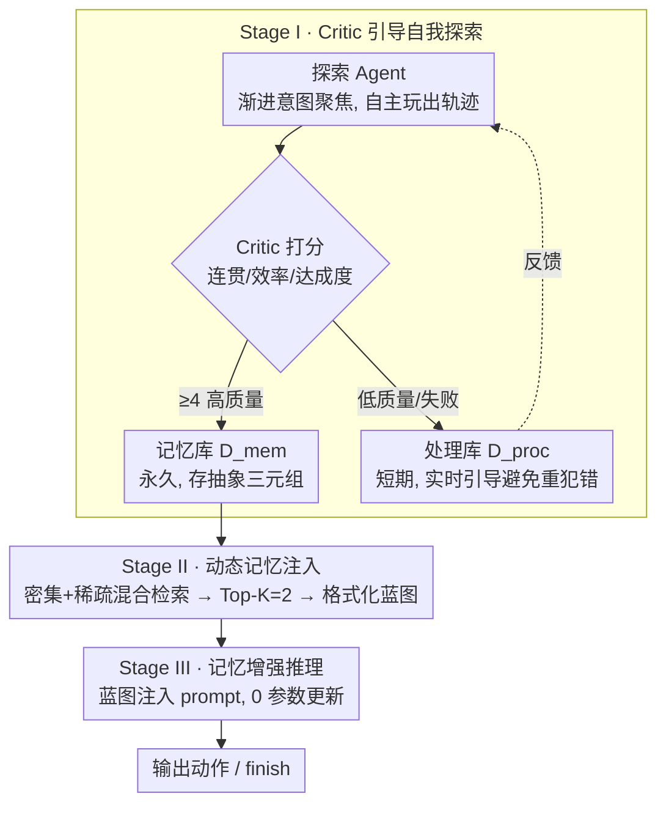

# EchoTrail-GUI: Building Actionable Memory for GUI Agents via Critic-Guided Self-Exploration

**会议**: CVPR 2026  
**arXiv**: [2512.19396](https://arxiv.org/abs/2512.19396)  
**代码**: 有  
**领域**: LLM Agent / GUI自动化  
**关键词**: GUI Agent, 可操作记忆, 自我探索, Critic引导, RAG推理

## 一句话总结

提出EchoTrail-GUI三阶段闭环框架：探索Agent自主与GUI环境交互生成轨迹 → Critic奖励模型过滤仅保留高质量轨迹构建记忆库(EchoTrail-4K) → 新任务到来时通过密集+稀疏混合检索注入最相关记忆引导推理，将无状态GUI Agent转变为记忆增强系统，在AndroidWorld上GPT-4o达51.7% SR(+17.2pp)，在AndroidLab上Qwen2.5-VL-72B SR从23.9%提升至37.5%。

## 研究背景与动机

**领域现状**：大型视觉-语言模型(VLM)驱动的GUI Agent已能直接解析GUI截图并执行点击、滚动、输入等多步操作。但当前Agent普遍存在"数字健忘症"——每个任务独立处理，无法积累和复用操作经验，导致重复犯错、泛化差。

**核心矛盾**：(1) **经验获取瓶颈**——高质量交互轨迹是GUI Agent的基石，但人工标注代价高、不可扩展，无引导的自主探索又会产出大量噪声和不连贯的轨迹；(2) **知识应用鸿沟**——即使有轨迹库，大多数Agent仍依赖静态prompt或手工示例，无法根据当前任务动态检索和利用历史经验。

**现有方案不足**：从视频/教程合成轨迹(AgentTrek)受限于数据来源覆盖面；自主探索(GUI-explorer)缺乏轨迹质量控制；RAG-GUI依赖外部知识库但缺乏高质量自建经验。

**核心idea**：模拟人类"学习→记忆→应用"的认知循环，构建全自动化的自改进闭环——Agent自主探索产生经验→Critic评判筛选好经验→好经验引导Agent做更好的决策，全程无需人工监督。

## 方法详解

### 整体框架

EchoTrail-GUI 想解决的是：GUI Agent 每次执行任务都"从零开始"，不会把过去成功的操作经验沉淀下来复用。它的办法是给 Agent 配一套**可复用的记忆**，整条流水线是"探索 → 记忆 → 推理"：先让一个探索 Agent 自动玩出大量轨迹并由 Critic 筛出高质量的存进记忆库，遇到新任务时检索最相关的历史轨迹注入 prompt 引导决策——全程不改 Agent 参数。

形式上，标准 Agent 策略是 $\pi_{base}(a_t|s_t, I, H_t)$，EchoTrail 把它升级成记忆增强策略 $a_t \sim \pi_{aug}(a_t|s_t, I, H_t, M_t)$，其中 $M_t \subset D_{mem}$ 是当前检索到的相关记忆。下面三个阶段分别回答：高质量记忆从哪来、怎么检索、怎么用。

### 关键设计

**1. Stage I · Critic 引导自我探索：自动攒出高质量记忆库**

难点在于"全自动且高质量"——无引导的随机探索会产出一堆垃圾轨迹，而人工标注又不可扩展。EchoTrail 用"探索 Agent + Critic 把关 + 双数据库"三件套解决：

- **探索 Agent** $\pi_{explore}$（Gemini 2.5 Flash）自主与 GUI 交互，每条轨迹最长 30 步。它采用**渐进意图聚焦**：前期是"好奇驱动"优先点新 UI 元素以求多样，经过 $T_{focus}$ 步后切到"目标聚焦"，定下具体子目标（如"加入购物车"）再执行——保证轨迹既铺得开又有连贯目的。
- **Critic 奖励模型** $R_{critic}$（Gemini 2.5 Flash Lite）给每条完整轨迹打 1–5 分（连贯性 / 效率 / 目标达成度），只有 $R_{critic}(\tau) \geq \theta_{good}=4$ 的才进永久记忆库——这是质量闸门。
- **轨迹抽象化存储**：不存原始截图，转成轻量三元组 {界面文本描述, Agent 意图摘要, 执行动作}，既省存储、又消除设备偏差、还更跨环境通用。
- **双数据库**：处理库 $D_{proc}$（短期易失）存进行中的成功+失败轨迹，给当前探索实时引导 $G_t$ 避免重复犯错；记忆库 $D_{mem}$（永久）只存 Critic 放行的高质量轨迹，作为下游核心资产。

**2. Stage II · 动态记忆注入：密集 + 稀疏混合检索**

新任务来了，要从记忆库里捞出最相关的历史轨迹。纯语义检索会漏掉关键术语、纯关键词检索又不懂近义，于是两者加权融合：

$$\text{Score}(\tau, I) = \alpha \cdot S_{dense}(\tau, I) + (1-\alpha) \cdot S_{sparse}(\tau, I)$$

其中 $S_{dense}$ 是 FAISS + Qwen3-Embedding-4B 的余弦相似度，$S_{sparse}$ 是 BM25 词法匹配分。取 Top-K=2 条轨迹（消融证明是质量/噪声的最优平衡点）。检索到的轨迹再**格式化**成结构化分步指南——每步 {界面描述, Agent 意图, 执行动作}，成为一份可读的"操作蓝图"。

**3. Stage III · 记忆增强推理：即插即用注入 prompt**

记忆系统与 Agent 模型完全解耦（plug-and-play），不动任何参数，纯靠 VLM 的上下文学习消化经验。每步推理的 prompt 为：

$$P_t = f(I, M_t, H_t, s_t, E_{sum}(s_t))$$

整合任务指令 $I$、格式化记忆 $M_t$、动作历史 $H_t$、当前截图 $s_t$，以及截图文本摘要 $E_{sum}$（由 Qwen3-30B-Instruct 生成）。Agent 输出特殊 "finish" 动作表示任务完成。

### 一个完整 walkthrough（执行"把某商品加入购物车"）

1. **检索**：用指令 $I$ 在 $D_{mem}$ 里混合检索，捞到 2 条过去"加购"成功轨迹（语义命中"购物车"+词法命中"add to cart"）。
2. **格式化**：把这 2 条转成分步蓝图——"①搜索框输入商品 → ②点进商品页 → ③点 Add to Cart"。
3. **推理第 1 步**：prompt $P_1$ 注入蓝图 + 当前首页截图，Agent 据经验直接定位搜索框输入。
4. **逐步执行**：每步用最新截图 + 蓝图对照推进；即使本次 App 版本按钮位置略有不同，VLM 也能借蓝图的"意图"泛化定位。
5. **完成**：到达购物车页，Agent 输出 "finish"。全程 0 参数更新，靠的就是被检索进来的历史经验。

### 数据资产：EchoTrail-4K

上述 Stage I 自动产出 4000+ 条高质量 Android 交互轨迹。UMAP 可视化显示：生成轨迹与真实测试任务高度语义对齐，且覆盖了测试集未涉及的语义区域——说明探索策略既准又多样。

## 实验关键数据

### 主实验：AndroidWorld基准

| Agent | Model | Training-Free | SR(%) |
|-------|-------|:---:|:---:|
| AppAgent | GPT-4o | ✓ | 14.9 |
| Gemini | Gemini-1.5-Pro | ✓ | 22.8 |
| Claude | Claude-CU | ✓ | 27.9 |
| GPT-4o | GPT-4o | ✓ | 34.5 |
| M3A | GPT-4o | ✓ | 40.5 |
| ScaleTrack | GPT-4o | ✗ | 44.0 |
| URST | GPT-4o + Reflexion | ✗ | 46.6 |
| GUI-explorer | GPT-4o | ✓ | 47.4 |
| **EchoTrail-GUI** | **GPT-4o** | **✓** | **51.7** |
| Aguvis | Aguvis-72B | ✗ | 26.1 |
| Qwen2.5-VL | Qwen2.5-VL-72B | ✓ | 35.0 |
| RAG-GUI | RAG-GUI-72B-RSF | ✗ | 45.7 |
| UI-TARS | UI-TARS-72B-SFT | ✗ | 46.6 |
| **EchoTrail-GUI** | **Qwen2.5-VL-72B** | **✓** | **46.6** |

→ 闭源最优：GPT-4o + EchoTrail达**51.7%**，超过所有基线(含需要训练的方法)，比裸GPT-4o高+17.2pp；开源端：Qwen2.5-VL + EchoTrail(46.6%)无需训练即追平UI-TARS-72B-SFT(46.6%)

### 主实验：AndroidLab基准(多维度)

| Agent | Model | Sub-SR | RRR | ROR | SR(%) |
|-------|-------|:---:|:---:|:---:|:---:|
| GPT-4o | GPT-4o | 35.0 | 87.3 | 85.4 | 31.2 |
| AutoGLM | AutoGLM | — | — | — | 36.2 |
| **EchoTrail-GUI** | **GPT-4o** | **50.7** | **97.9** | **88.5** | **48.1** |
| UI-TARS-72B-ft | UI-TARS-72B | 28.4 | 81.4 | 81.6 | 22.1 |
| Qwen2.5-VL-72B | Qwen2.5-VL-72B | 26.1 | 68.7 | 81.4 | 23.9 |
| Qwen2.5-VL-72B-ft | Qwen2.5-VL-72B | 30.9 | 81.3 | 79.3 | 25.0 |
| **EchoTrail-GUI** | **Qwen2.5-VL-72B** | **41.1** | **89.4** | **92.1** | **37.5** |

→ GPT-4o + EchoTrail：SR 31.2%→48.1%(+16.9pp)，Sub-SR 35.0→50.7；Qwen2.5-VL + EchoTrail：SR 23.9%→37.5%(+13.6pp)，且ROR从81.4提升到92.1——不仅完成率提升，操作冗余度降低、合理性也显著改善

### 消融实验(AndroidWorld, Qwen2.5-VL-72B)

| 配置 | Easy | Medium | Hard | Avg SR(%) |
|------|:---:|:---:|:---:|:---:|
| Qwen2.5-VL-72B(无记忆) | 46.7 | 23.6 | 13.2 | 34.1 |
| w/o Critic过滤 | 47.5 | 13.9 | 10.5 | **31.0**(↓3.1) |
| w/o 混合检索 | 60.7 | 20.8 | 13.2 | 40.5 |
| w/o 实时引导 | 62.3 | 25.0 | 13.2 | 42.7 |
| **EchoTrail-GUI(完整)** | **65.6** | **30.6** | **15.8** | **46.6** |

### 关键发现

- **低质量记忆是毒药**：去掉Critic过滤后SR从46.6%降至31.0%，甚至**低于无记忆基线**(34.1%)——注入噪声记忆比不注入更差，这是全文最关键的发现
- **混合检索互补有效**：去掉混合检索SR降6.1pp→语义+关键词双通道不可或缺
- **实时引导提升探索质量**：去掉后SR降3.9pp→双数据库的在线反馈机制有效
- **K=2为检索最优数量**：过少信息不足，过多引入噪声和prompt膨胀，K=2取得最佳平衡
- **探索质量持续提升**：实时引导使高质量轨迹在探索过程中占比稳步上升，复杂App(OsmAnd, VLC)提升近20pp
- **模型无关性**：对GPT-4o和Qwen2.5-VL均有效，验证Plug-and-play特性

## 亮点与洞察

- **"数字健忘症"的精准诊断与解决**：将GUI Agent从无状态升级为记忆增强系统，是能力的根本性跃迁；全自动化的"生成→评价→积累→检索→应用"闭环极具工程价值
- **Critic过滤是核心而非可选**：消融证明无过滤记忆有害——这打破了"记忆越多越好"的朴素直觉，揭示了经验质量 > 经验数量的核心原则
- **自我改进的数据飞轮**：Agent探索→Critic筛选→好记忆引导更好探索→产出更多好记忆——正反馈循环使探索效率持续提升
- **Training-free + Plug-and-play**：不修改任何模型参数，纯靠上下文记忆注入就超越需要微调的方法——对实际部署友好

## 局限性

- 探索阶段需要Gemini 2.5 Flash大量API调用——构建记忆库的计算/经济成本较高
- 记忆库构建后为静态(不随Agent能力提升而更新/修剪)——缺乏记忆的遗忘与精炼机制
- 轨迹抽象化丢弃了原始截图视觉信息——对需要精确视觉定位的任务可能不利
- 应用UI更新后旧轨迹中的布局描述可能过时——记忆的时效性未被考虑
- 仅在Android环境验证，Web/Desktop GUI场景的泛化性待验证

## 相关工作与启发

- **vs GUI-explorer**：同为自主探索构建经验，但GUI-explorer缺乏Critic质量控制→EchoTrail的过滤机制是关键差异化
- **vs RAG-GUI**：RAG-GUI使用外部知识指南，EchoTrail用Agent自建经验→自建经验更贴合实际操作序列
- **vs UI-TARS**：UI-TARS需72B参数微调才达46.6%，EchoTrail在Qwen2.5-VL上无需训练即追平→记忆增强可作为微调的高效替代
- **启发**：Critic过滤的思想可推广到所有经验驱动的Agent系统——任何自我改进框架都应有严格的质量把关而非盲目积累

## 评分

- 新颖性: ⭐⭐⭐⭐ Critic引导自探索+记忆增强推理的闭环设计新颖，"低质量记忆有害"洞察深刻
- 实验充分度: ⭐⭐⭐⭐⭐ 双基准(AndroidWorld+AndroidLab)、双backbone(GPT-4o+Qwen)、四维度指标、完整消融+敏感性分析+探索质量追踪
- 写作质量: ⭐⭐⭐⭐ 三阶段架构图清晰，Algorithm 1完整，消融分析层次分明
- 价值: ⭐⭐⭐⭐⭐ Training-free即超越微调方法，对GUI自动化有直接实用推动；EchoTrail-4K数据集也有独立价值

<!-- RELATED:START -->

## 相关论文

- [\[CVPR 2026\] GUI-CEval: A Hierarchical and Comprehensive Chinese Benchmark for Mobile GUI Agents](gui-ceval_a_hierarchical_and_comprehensive_chinese_benchmark_for_mobile_gui_agen.md)
- [\[ICML 2026\] SE-GA: Memory-Augmented Self-Evolution for GUI Agents](../../ICML2026/llm_agent/se-ga_memory-augmented_self-evolution_for_gui_agents.md)
- [\[CVPR 2025\] GUI-Xplore: Empowering Generalizable GUI Agents with One Exploration](../../CVPR2025/llm_agent/gui-xplore_empowering_generalizable_gui_agents_with_one_exploration.md)
- [\[CVPR 2026\] HATS: Hardness-Aware Trajectory Synthesis for GUI Agents](hats_hardness-aware_trajectory_synthesis_for_gui_agents.md)
- [\[CVPR 2026\] Towards GUI Agents: Vision-Language Diffusion Models for GUI Grounding](towards_gui_agents_vision-language_diffusion_models_for_gui_grounding.md)

<!-- RELATED:END -->
