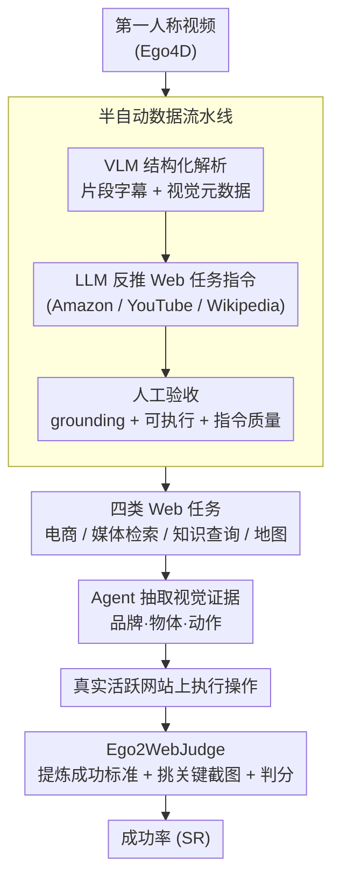

# Ego2Web: A Web Agent Benchmark Grounded in Egocentric Videos

**会议**: CVPR 2026  
**arXiv**: [2603.22529](https://arxiv.org/abs/2603.22529)  
**代码**: [https://github.com/Yui010206/Ego2Web](https://github.com/Yui010206/Ego2Web)  
**领域**: Agent  
**关键词**: Web Agent, 第一人称视频, 多模态基准, 跨模态迁移, 自动评测

## 一句话总结

提出 Ego2Web，首个将第一人称视频感知与 Web 代理执行相结合的基准测试，配套半自动数据构建流程和 Ego2WebJudge 自动评测框架，实验揭示当前最强 Agent 在真实视觉感知到在线行动的跨模态迁移上仍有巨大差距，最高仅 48.2% 成功率。

## 研究背景与动机

**领域现状**：多模态 AI Agent 正在快速发展，从简单的对话式助手向能够在真实网页环境中执行操作（如购物、搜索、查询地图）的方向演进。当前已有多个 Web Agent 基准（如 WebArena、MiniWoB++、Mind2Web 等）用于评测 Agent 在在线环境中的任务完成能力。

**现有痛点**：现有 Web Agent 基准存在一个根本性限制——它们完全聚焦于 Web 端的交互和感知，缺乏与用户真实物理环境的关联。这意味着一个关键场景无法评测：当 Agent 需要先通过第一人称视觉（如 AR 眼镜）识别用户周围环境中的物体，然后在线完成相关任务（如看到一个零食后在 Amazon 上搜索购买）。这种从"看见"到"在线执行"的桥接能力是未来 AI 助手的核心需求。

**核心矛盾**：当前 Web Agent 的评测只考虑了数字世界内的能力，完全忽略了 Agent 从物理世界获取视觉线索并将其转化为数字世界行动的能力。这导致我们无法了解当前模型在"见到→理解→行动"完整链路上的真实水平。

**本文目标**：构建一个将第一人称视频感知与 Web 行动执行相结合的基准，系统评测 Agent 的视觉理解、任务规划和在线交互能力。

**切入角度**：利用已有的大规模第一人称视频数据集（如 Ego4D），结合 VLM+LLM 的自动数据生成流水线和人工验证，构建高质量的视频-Web 任务对。

**核心 idea**：将第一人称视频中的视觉证据（如品牌、物体、动作）作为 grounding 信息，要求 Agent 在真实 Web 环境中完成相关任务，从而评测跨物理-数字世界的 Agent 能力。

## 方法详解

### 整体框架

Ego2Web 要解决的问题是：现有 Web Agent 基准只考数字世界内的交互，没人测过"先用第一人称视觉看见东西、再上网完成相关任务"这条物理-数字桥接链路。整篇工作因此落在三件事上——先搭一条把第一人称视频变成"视频+Web任务"配对的半自动流水线，攒出覆盖电商、媒体检索、知识查询、地图服务四类场景的基准数据集，再配一个能在实时网站上自动判分的 Ego2WebJudge。评测时，Agent 拿到一段第一人称视频，要从中抽出关键视觉证据（品牌、物体、动作），然后在真实活跃网站上执行操作，最后由 Ego2WebJudge 比对操作轨迹和视觉证据，判定任务是否真正完成。

### 关键设计

**1. 半自动数据流水线：让每个样本既有真实视觉依据、又能在线执行**

纯手工标注一条条视频-任务对成本太高，纯自动生成又压不住质量，这条流水线就是要在两者间找平衡。它分三步走：先用 VLM（如 Gemini）对第一人称视频做结构化解析，产出片段级字幕和视觉元数据，把视频里的物体、品牌、动作都识别标注出来；再让 LLM 拿着这些视觉元数据，到 Amazon、YouTube、Wikipedia 这类真实活跃网站上反推出对应的 Web 任务指令（比如视频里出现某零食，就生成"在 Amazon 上搜索购买它"）；最后由人工标注员逐样本验收三件事——视觉 grounding 是否准确、Web 任务是否真的可执行、指令质量是否过关。这样自动化扛掉了大部分体力活，人工只在最后把关，既保证规模又锁住质量。

**2. 四类 Web 任务：用不同任务结构去逼出 Agent 不同维度的短板**

日常 AI 助手要处理的网页交互五花八门，单一任务类型测不全。基准因此把任务切成四大类，每类都要求 Agent 先从视频取证、再到 Web 上落地：电商（看到零食后搜索购买）考的是精细物体识别，媒体检索（看到健身动作后搜教程视频）考的是动作理解，知识查询（看到大学名后查录取信息）考的是文本识别，本地/地图服务（看到商店后搜导航路线）考的是空间定位。四类任务对应"识物、辨动作、认字、定位"四种视觉能力，哪一维弱，对应那类任务的成功率就会塌下来——这正是后面实验里电商和地图最难的原因。

**3. Ego2WebJudge：用 LLM 当裁判，在实时网页上做可扩展判分**

在活的网站上评测，URL/文本精确匹配这类传统方法太脆（页面一变就失效），人工逐条判又不可扩展，所以需要一个既灵活又能自动跑的裁判。Ego2WebJudge 接收任务指令、Agent 的完整操作轨迹、Web 截图和视频里标注的视觉证据后，先从指令里提炼出关键成功标准（success criteria），再从一长串操作轨迹里挑出最相关的几张截图，最后判定 Agent 是否在视觉证据与 Web 内容一致的前提下正确完成了任务。和只看 URL 是否匹配不同，它真正校验了"看到的东西"和"网页上做的事"对不对得上，因此能达到约 84% 的人类判断一致率，远高于现有精确匹配类方法。

### 评测指标

Ego2Web 是评测基准而非训练方法，不涉及训练损失。核心指标是**成功率（Success Rate, SR）**——由 Ego2WebJudge 自动判定每个视频-任务对是否完成，再按任务类型和总体分别统计完成比例。

## 实验关键数据

### 主实验

| Agent (模型) | 电商 SR | 媒体检索 SR | 知识查询 SR | 地图 SR | 总体 SR |
|--------|------|------|----------|------|------|
| Qwen3-VL-Flash | 21.7 | 30.1 | 50.0 | 23.1 | 29.0 |
| GPT-4o | 26.9 | 30.3 | 63.0 | 22.5 | 34.6 |
| Gemini-2.5 Pro | 38.2 | 50.7 | 75.0 | 48.3 | 48.2 |
| 人类评测 | - | - | - | - | 58.6 |

### 消融实验（视觉感知影响）

| 视频输入 | 详细描述 | 电商 | 知识查询 | 总体 SR |
|------|---------|------|------|------|
| ✗ | ✗ | 2.6 | 5.4 | 4.4 |
| ✗ | ✓ | 13.0 | 39.1 | 23.6 |
| ✓ | ✗ | 38.2 | 75.0 | 48.2 |

### 关键发现

- **当前最强 Agent 也远未完美**：Gemini-2.5 Pro 作为最佳模型仅达到 48.2% SR，人类评测也仅 58.6%（因为部分任务本身有难度），展示了巨大的提升空间
- **原始视频远优于文本描述**：直接输入视频比用 VLM 生成文本描述后输入效果好一倍以上（48.2% vs 23.6%），说明视觉 grounding 必须来自原始视觉信号
- **错误分析**：36% 的失败来自物体误识别，18% 来自时序/动作误解，16% 来自跨模态检索失败，证明视觉感知是当前 Agent 的首要瓶颈
- **电商和地图任务最难**：需要精细的视觉识别和空间理解，当前 Agent 在这两类任务上表现最差

## 亮点与洞察

- **首创性的物理-数字世界桥接基准**：Ego2Web 填补了现有 Web Agent 评测中"视觉感知→在线行动"链路的空白。这种设计反映了未来 AR/智能助手的真实使用场景，具有前瞻性
- **Ego2WebJudge 评测方案**：84% 的人类一致率使其成为可靠的自动评测工具，避免了在实时 Web 环境中人工评测的巨大成本。这一框架可以迁移到其他需要在线评测的 Agent 任务
- **视觉感知瓶颈的定量揭示**：实验清楚地展示了"看→理解→行动"链路中每一步的瓶颈，为未来研究提供了明确的改进方向

## 局限与展望

- 数据规模相对有限，尚未覆盖所有日常 Web 任务场景（如社交媒体操作、日程管理等）
- 基准依赖于实时 Web 环境，网站变更可能影响评测的可复现性
- 当前仅评测了已有的通用 Agent，尚未设计针对 Ego2Web 任务特点的专用 Agent 架构
- 未来可扩展到多轮对话场景（如用户在观看视频后提出后续需求）和多模态 Web 交互（如语音指令+视觉感知）

## 相关工作与启发

- **vs WebArena**：WebArena 聚焦纯 Web 端任务执行，没有真实世界的视觉输入；Ego2Web 引入了从第一人称视频到 Web 行动的完整链路
- **vs Ego4D**：Ego4D 是纯视频理解基准，不涉及在线行动执行；Ego2Web 利用 Ego4D 的视频数据但要求 Agent 在真实 Web 上完成任务
- **vs Mind2Web**：Mind2Web 使用静态 Web 页面截图，Ego2Web 则在实时 Web 环境中评测，更接近真实应用场景

## 评分

- 新颖性: ⭐⭐⭐⭐⭐ 首个桥接第一人称视频与 Web Agent 执行的基准，填补重要空白
- 实验充分度: ⭐⭐⭐⭐ 多模型评测+输入消融+错误分析，但缺少更多 Agent 架构的对比
- 写作质量: ⭐⭐⭐⭐⭐ 动机清晰、问题定义精准、数据流程描述详细
- 价值: ⭐⭐⭐⭐⭐ 对 AI Agent 和具身智能社区有重要推动作用

<!-- RELATED:START -->

## 相关论文

- [\[ICLR 2026\] ST-WebAgentBench: A Benchmark for Evaluating Safety and Trustworthiness in Web Agents](../../ICLR2026/llm_agent/st-webagentbench_a_benchmark_for_evaluating_safety_and_trustworthiness_in_web_ag.md)
- [\[ICML 2026\] Weasel: 通过重要性-多样性数据选择实现 Web Agent 的域外泛化](../../ICML2026/llm_agent/weasel_out-of-domain_generalization_for_web_agents_via_importance-diversity_data.md)
- [\[CVPR 2026\] Learning to Adapt: Self-Improving Web Agent via Cognitive-Aware Exploration](learning_to_adapt_self-improving_web_agent_via_cognitive-aware_exploration.md)
- [\[CVPR 2026\] ProactiveMobile: A Comprehensive Benchmark for Boosting Proactive Intelligence on Mobile Devices](proactivemobile_a_comprehensive_benchmark_for_boosting_proactive_intelligence_on.md)
- [\[ICLR 2026\] VideoMind: A Chain-of-LoRA Agent for Temporal-Grounded Video Reasoning](../../ICLR2026/llm_agent/videomind_a_chain-of-lora_agent_for_temporal-grounded_video_reasoning.md)

<!-- RELATED:END -->
