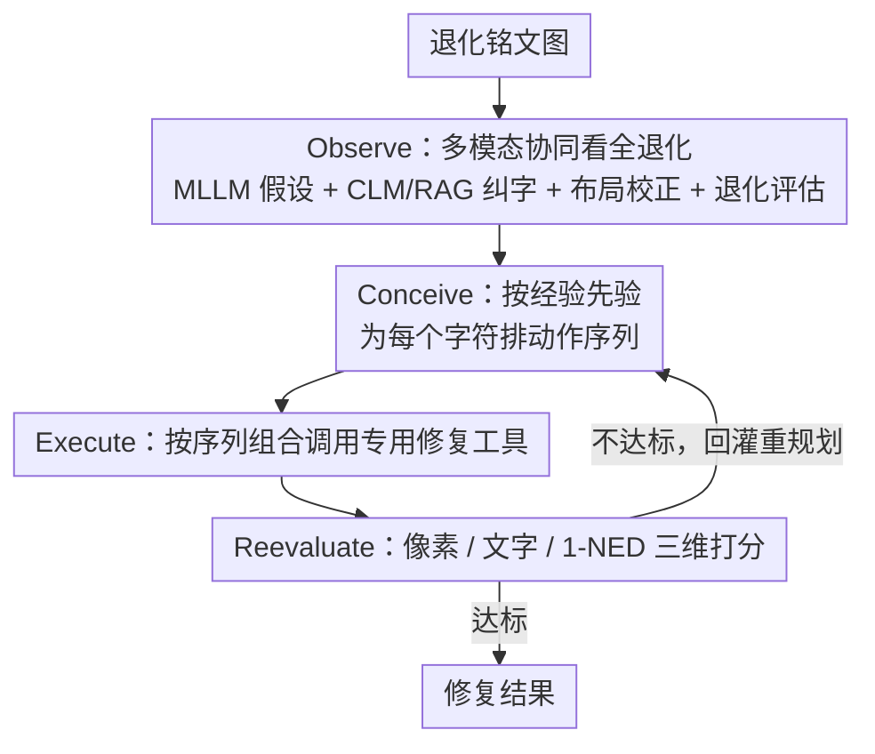

# EpiAgent: An Agent-Centric System for Ancient Inscription Restoration

**会议**: CVPR 2026  
**arXiv**: [2604.09367](https://arxiv.org/abs/2604.09367)  
**代码**: [https://github.com/blackprotoss/EpiAgent](https://github.com/blackprotoss/EpiAgent)  
**领域**: LLM Agent/数字人文  
**关键词**: 古代铭文修复, LLM Agent, 多模态分析, 迭代优化, 文化遗产保护

## 一句话总结

EpiAgent是首个面向古代铭文修复的Agent系统，通过LLM中央规划器协调多模态分析、专用修复工具和迭代自我优化，在文字真实性和视觉保真度上超越现有方法。

## 研究背景与动机

**领域现状**：AI驱动的古代文字修复已有进展，但现有方法要么局限于单字符级修复，要么使用固定流水线进行全铭文修复，无法处理异构退化模式。

**现有痛点**：(1) 基于图像到图像翻译的方法常扭曲原始字形，导致过度/不足修复；(2) 固定流水线缺乏对异构退化模式的适应性；(3) 铭文修复需要同时保证文字真实性和视觉保真度的双重要求。

**核心矛盾**：铭文修复不是简单的图像增强，而是需要像人类铭文学家那样协调多模态分析、专业技能判断和审美评价的复杂认知过程。

**本文目标**：构建一个模仿人类铭文学家工作流程的Agent系统，实现灵活自适应的铭文修复。

**切入角度**：将铭文修复形式化为分层规划问题，由LLM中央规划器在"观察-构思-执行-再评估"循环中驱动。

**核心idea**：用Agent架构替代固定流水线，使修复过程能根据退化模式动态调整工具选择和执行顺序。

## 方法详解

### 整体框架

EpiAgent 把铭文修复当成一个"像人类铭文学家那样反复推敲"的过程，而不是一条固定的图像增强流水线。一张退化的铭文图进来，系统以 LLM 为中央规划器，在 Observe-Conceive-Execute-Reevaluate（观察-构思-执行-再评估）四阶段循环中转动：先 Observe 把这块碑"看清楚"——退化在哪、字是什么、缺了多少；再 Conceive 根据历史经验为**每个字符**单独排一套修复动作；然后 Execute 按计划组合调用专用修复工具；最后 Reevaluate 用自动指标（外加可选的专家反馈）打分，不满意就把信息回灌给规划器重来一轮。关键在于"工具用哪些、按什么顺序"不是写死的，而是规划器根据每个字的退化模式临场决定，因此能应付同一块碑上空间不均、结构耦合的异构退化。

### 关键设计

**1. Observe：多模态协同把退化状态"看全"，给后续规划一份可靠底稿**

固定流水线的通病是只看到图像表面，看不出"这个字其实是什么、哪块是彻底缺失"。EpiAgent 的 Observe 阶段分两步把这份底稿做扎实。第一步让 MLLM 对整图给出初始的版面布局假设和逐字文字假设；第二步用三个专门模块去纠偏：校正语言模型（CLM）是一个微调过的 7B LLM，配合 RAG 查询大规模中文古籍语料，把 MLLM 认错的字纠正回历史上真实出现过的文本；布局校正模块负责预测完整版面，连**完全缺失、图像里根本没有像素**的区域也要补全位置；退化评估模型则输出像素级的退化分割掩码和严重程度等级。这一步的产物是一份观察记录 $T_r$——既有"这个字应该是什么"的语义判断，也有"哪里坏了、坏到什么程度"的空间判断，恰好覆盖了铭文退化空间变化、结构耦合、多尺度的三重特性。

**2. Conceive：用历史日志里的统计先验，为每个字符单独排一套动作序列**

知道了哪里坏、坏成什么样，接下来要决定"先用哪个工具、再用哪个"。EpiAgent 不靠人手写规则，而是从历史执行日志里挖出一份经验先验——对每种退化模式 $\mathcal{S}_d$ 统计各修复工具 $f$ 的效用分布 $p(f\mid\mathcal{S}_d)$，本质是"过去遇到这类退化，哪个工具好使"的频率表。规划器 $\pi$ 同时吃观察记录 $T_r$ 和这份经验先验 $T_e$，**对每个字符独立**生成一条动作序列：

$$P_c = \big(f_1^{(c)}, f_2^{(c)}, \dots, f_{N_c}^{(c)}\big)$$

逐字规划是这里的要害——同一块碑上，有的字只是轻微磨损、一步去噪就够，有的字结构性崩坏、得多个工具串联，全图一刀切只会过度或不足修复。经验先验则让规划器不必从零试错，直接把退化模式映射到大概率好使的工具组合上。

**3. Reevaluate：三维度闭环打分，不达标就回灌重规划**

最后要回答"这一轮到底修好没有"。铭文修复的好坏不能只看图好不好看，还要看字对不对、整体读不读得通，所以 Reevaluate 从三个维度同时评：像素质量（PSNR / SSIM / LPIPS）管视觉保真，文字识别（Top-1 / Top-5 准确率）管单字是否认得出，端到端的 1-NED（基于归一化编辑距离）管整篇文本的连贯可读性。需要时还能接入第三方专家反馈做人机协作校验。三个维度的评估结果不是终点，而是回灌给 Conceive 阶段触发下一轮重规划——哪一维拖后腿，下一轮就针对性地换工具或加步骤，构成真正的闭环迭代。

### 一个完整示例

拿一块同时含轻度磨损和重度缺失字符的拓片走一遍：**Observe** 阶段 MLLM 先读出 12 个字的初步假设，CLM 查语料库把其中被认成形近字的 2 个字纠正回史料里的正确写法，布局校正模块补上右下角一个完全缺失字的位置框，退化评估模型标出"左侧 8 字轻度、右下 4 字重度耦合退化"。**Conceive** 阶段规划器查经验先验，给左侧轻度字各排一步去噪工具，给右下重度字排"去噪 → 结构补全 → 字形精修"三步串联，每个字一条独立序列。**Execute** 按序列组合调用工具完成首轮修复。**Reevaluate** 打分发现整体 PSNR、识别准确率都已达标，但重度缺失字所在区域的 1-NED 偏低、读不通顺，于是把这块的信息回灌规划器，第二轮针对那几个字加一步上下文一致性精修，再评估通过、退出循环。整个过程工具的选择和轮数都由退化模式现场决定，而非预设流水线。

### 损失函数 / 训练策略

EpiAgent 主体是推理时的 Agent 编排，不做端到端训练；需要单独训练的只有两个子模块：CLM 通过微调 7B LLM 并配合 RAG 实现文字校正，退化评估模型则以像素级退化分割为目标进行训练。规划器的经验先验来自历史执行日志的统计，无需梯度训练。

## 实验关键数据

### 主实验

| 方法 | PSNR↑ | SSIM↑ | LPIPS↓ | Top-1 Acc↑ | 1-NED↑ |
|------|-------|-------|--------|------------|--------|
| CharFormer | 19.74 | 0.9503 | 0.0478 | 0.9109 | 0.8313 |
| DocDiff | 20.61 | 0.9565 | 0.0361 | 0.9275 | 0.8439 |
| MambaIR | 21.10 | 0.9599 | 0.0377 | 0.9093 | 0.8251 |
| IR3 | 21.15 | 0.9540 | 0.0388 | 0.9626 | 0.8855 |
| EpiAgent | **22.14** | **0.9684** | **0.0254** | **0.9889** | **0.9069** |
| 完整原件 | - | - | - | 0.9971 | 0.9120 |

### 消融实验

| 配置 | 关键指标 | 说明 |
|------|---------|------|
| 无CLM校正 | 识别准确率下降 | 文字指导不准确 |
| 无经验先验 | 修复质量下降 | 工具选择不优化 |
| 无迭代优化 | 质量次优 | 单次修复不充分 |
| 完整EpiAgent | 最优 | 四阶段闭环协同 |

### 关键发现

- EpiAgent的识别准确率(0.9889)接近完整原件(0.9971)，说明修复后的文字几乎完全可读
- 在真实退化铭文上的泛化能力显著优于固定流水线方法
- Agent的迭代优化机制在复杂耦合退化场景下特别有效

## 亮点与洞察

- **Agent范式在文化遗产保护中的开创性应用**：将LLM Agent从通用任务引入到高度专业化的铭文学领域，是数字人文的重要突破
- **可选专家反馈的闭环设计**：系统支持人类专家在评估阶段介入，实现了人机协作的修复工作流
- **字符级精细规划**：不同于全图一刀切的处理，EpiAgent对每个字符独立规划修复策略，处理空间耦合退化

## 局限与展望

- LLM推理的计算开销大，单张铭文的修复可能需要数分钟
- 高度依赖CLM的文字校正质量，在极度退化的铭文上可能失效
- 仅针对中文古代铭文验证，扩展到其他文字体系需要额外工作

## 相关工作与启发

- **vs IR3**: IR3使用全局-局部框架进行全铭文修复但存在错误传播，EpiAgent的Agent架构天然支持错误修正
- **vs AutoHDR**: AutoHDR使用LLM预测损坏内容但风格迁移可能扭曲字形，EpiAgent通过专用工具保持书法真实性

## 评分

- 新颖性: ⭐⭐⭐⭐⭐ Agent范式在文化遗产保护中的首次应用
- 实验充分度: ⭐⭐⭐⭐ 在合成和真实退化数据上全面评估
- 写作质量: ⭐⭐⭐⭐ 工作流描述清晰
- 价值: ⭐⭐⭐⭐ 对数字人文领域有重要意义

<!-- RELATED:START -->

## 相关论文

- [\[CVPR 2026\] RAAS: LLM Agentic System Architecture Search with GRPO](raas_llm_agentic_system_architecture_search_with_grpo.md)
- [\[ACL 2026\] HiGMem: A Hierarchical and LLM-Guided Memory System for Long-Term Conversational Agents](../../ACL2026/llm_agent/higmem_a_hierarchical_and_llm-guided_memory_system_for_long-term_conversational_.md)
- [\[ICML 2025\] AGACCI: Affiliated Grading Agents for Criteria-Centric Interface in Educational Coding Contexts](../../ICML2025/llm_agent/agacci_affiliated_grading_agents_for_criteria-centric_interface_in_educational_c.md)
- [\[ICML 2025\] Open Source Planning & Control System with Language Agents for Autonomous Scientific Discovery](../../ICML2025/llm_agent/open_source_planning_control_system_with_language_agents_for_autonomous_scientif.md)
- [\[CVPR 2026\] Ego2Web: A Web Agent Benchmark Grounded in Egocentric Videos](ego2web_a_web_agent_benchmark_grounded_in_egocentric_videos.md)

<!-- RELATED:END -->
