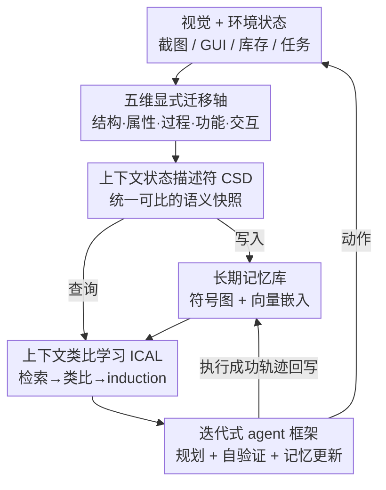

# Experience Transfer for Multimodal LLM Agents in Minecraft Game

**会议**: CVPR 2026  
**论文**: [CVF Open Access](https://openaccess.thecvf.com/content/CVPR2026/html/Li_Experience_Transfer_for_Multimodal_LLM_Agents_in_Minecraft_Game_CVPR_2026_paper.html)  
**代码**: 无  
**领域**: Agent / 多模态VLM  
**关键词**: 经验迁移, 多模态具身智能体, 上下文类比学习, 结构化记忆, Minecraft  

## 一句话总结
本文提出 Echo——一个面向"迁移"的记忆框架，把可复用知识显式拆成结构/属性/过程/功能/交互五个迁移维度，封装进统一的上下文状态描述符（CSD），再用上下文类比学习（ICAL）主动地从记忆库里推断并验证新任务，在 Minecraft 从零学习场景里把物品解锁速度提升 1.3×–1.7×，并出现"链式爆发解锁"现象。

## 研究背景与动机

**领域现状**：以 Voyager、JARVIS-1 为代表的多模态 LLM 智能体在 Minecraft 这类开放世界里，靠"感知-推理-行动-记忆"循环做开放式探索，能在没有大规模任务监督的情况下分解目标、规划子任务、调用工具。它们普遍依赖长期记忆来复用技能、支撑长程规划。

**现有痛点**：尽管这些方法都带"记忆"，但它们把记忆当成**被动仓库**——历史行为的索引、可复用技能的图书馆。In-Context Learning 在这些系统里只是被动地"为当前目标检索几个 few-shot 样例"，而真正让经验**可迁移**的深层结构始终没被显式建模。结果是：换个世界、换个材料，智能体往往要把已经会的东西重新学一遍。

**核心矛盾**：开放世界存在大量重复出现的结构性规律——工具/护甲的"形状原型"、材料家族之间的"可替换性"、"采集→冶炼→合成"这类公共加工链、武器之间的功能对称性。但传统 MLLM 智能体面对不同任务时，看到的是**不同的状态转移和因果关系**，无法把"任务结构相同、只是材料不同"这件事识别出来；再叠加 MLLM 在开放场景下的幻觉与不可控推理，迁移既不稳定也不可验证。

**本文目标**：让检索从"被动服务当前目标"转为"主动发现可迁移的新任务"，实现对新任务**快速、稳定、可解释**的泛化；同时把"哪段旧经验在新情境里还适用"这件事变成可计算、可对齐的。

**切入角度**：作者观察到——"虽然工具、武器、护甲的材料不同（木/石/铁/钻石），但它们合成配方里的模式是一致的"。于是只要把迁移的"轴"（形状、材料、过程、功能）显式表示出来并与多模态嵌入对齐，智能体就不必重学已知知识，而是快速地重组、复用既有知识。

**核心 idea**：把可迁移知识沿五个显式语义轴（结构/属性/过程/功能/交互）拆解，压成统一可比的上下文状态描述符（CSD），再用上下文类比学习（ICAL）做"检索-类比-执行-验证"的主动迁移。

## 方法详解

### 整体框架
Echo 沿用经典 agent 模型（感知-决策-执行 + 短/长期记忆四层），但把核心放在"如何让记忆可迁移"上。整个系统的运转是一个闭环：感知层把视觉与环境状态编码成一份**CSD**（沿五个迁移轴组织的语义快照）；这份 CSD 既写入长期记忆库，又作为查询去检索 top-K 相似历史任务；**ICAL** 把这些样例拼成上下文，让指令微调过的 MLLM 类比推断出"可能的新任务"并输出动作序列；动作经**自验证 + 预检查**后执行，成功轨迹回写记忆、失败则记录——如此持续累积、自主扩张知识。

关键的设计哲学是：五个迁移轴回答了具身智能体迁移知识必须同时回答的三个根本问题——世界**是什么样**（结构 + 属性）、世界**怎么变**（过程 + 功能）、智能体**怎么和世界打交道**（交互）。

### 关键设计

**1. 五维显式迁移轴：把"任务为什么可迁移"摊开成五条可对齐的语义轴**

传统方法看不见"任务结构相同、材料不同"这件事，是因为它对任务做的是**隐式整体相似度**，无法定位到底是哪一维在迁移。本文把可迁移知识显式拆成五条轴：**结构轴**（世界如何组织——空间布局、层级关系、可达性）、**属性轴**（物体的视觉/物理性质——颜色、纹理、硬度、材质，支持替换/兼容性推理）、**过程轴**（世界如何变化——动作改变环境的因果规则与状态转移序列）、**功能轴**（物体能做什么——用途与角色，支撑语义级泛化与跨域复用）、**交互轴**（智能体如何与世界互动——感知-动作回路与反馈）。

这五轴不是随意拼凑，而是分层依赖的：结构与属性提供静态脚手架，过程与功能刻画动态，交互闭合"感知→动作→反馈"回路。显式建模的价值在于，智能体能在语义上解释任务间的对应与相似，从而做出可解释的跨任务对齐与类比——比如靠功能轴识别"橡木板和石头功能相似"，就能把"造木镐"的任务结构搬到"造石镐"上。作者特别区分了自己与 MrSteve 的"What-Where-When 记忆"：后者意在给智能体引入情景记忆，本文则是用结构化记忆去**驱动任务迁移**。

**2. 上下文状态描述符 CSD：把异构多模态输入压成统一、可比、可验证的语义快照**

光有五条轴还不够，得有个统一容器把视觉、文本、交互这些异构信号装进去并对齐。CSD 由六个部分组成：一个 `meta`（记录生成时间戳、来源环境、模型版本）加上 `struct / attr / proc / func / inter` 五个字段，逐一对应五条迁移轴。每个字段既存符号化内容（如 JSON 描述"铁矿石占熔炉上槽、木炭作燃料在下槽"），又存全局嵌入用于快速向量检索。这样 CSD 就同时具备**可解释性**（符号图）和**可检索性**（向量），成为后续稳定检索与推理的统一基座。

为了让 MLLM 可靠地产出格式规整的 CSD，作者在训练时做了**指令微调**：用大量结构化任务样例（多模态任务指令、历史执行轨迹、验证器反馈）教模型把任务描述与五轴证据对齐，输出符合统一规范的 CSD。CSD 库还会离线周期性维护——合并、清洗、去重、聚类；聚类后的 CSD 支持知识推断与模式抽象（例如把"冶炼铁矿石→铁锭"外推到"冶炼金矿石→金锭"，或推导出新合成路线），实现自主的知识扩张。

**3. 上下文类比学习 ICAL：把 ICL 从"被动取样例"改造成"主动推断并验证新任务"**

这是 Echo 与 DEPS、JARVIS-1 等经典方法最本质的区别。后者用 ICL 只是从记忆库里取几个 few-shot 来辅助生成当前目标的子任务序列；ICAL 则把 ICL 当成**主动过程**——它会主动从记忆库里捞出"潜在的新任务"去验证和执行。具体是一套五步工作流：(1) **任务选择**——挑一个代表性任务（最成功或最近学会的），提取其完整 CSD；(2) **样例检索**——在五个 CSD 分量（attr/struct/func/proc/inter）上算多维语义相似度，取 top-K 最相关任务；(3) **ICL 上下文构造**——把这些样例拼成上下文；(4) **新任务归纳**——模型从上下文里泛化，只输出"潜在新任务"的动作序列；(5) **执行与验证**——执行并评估，成功轨迹入库、失败记录在案。

检索算子可写成 $\mathcal{S}_K = R(x_t, M, T)$，其中 $M$ 是记忆、$T=\{\text{struct, attr, proc, func, inter}\}$ 是迁移空间，它返回 $K$ 个样例及其跨轴相似度证据。这套流程让经验积累、知识迁移、自主任务发现连成一条自驱动的链——记忆越多，能"凭空"推断出的新任务越多，这正是后面"链式爆发解锁"现象的机制来源。

**4. 迭代式 agent 框架与迁移形式化：用三层架构 + 自验证 + 双通道记忆更新稳住开放世界里的迁移**

MLLM 在开放场景的幻觉会让迁移结果不可信，因此整体框架在 ICAL 之外套了一层稳定化机制。系统是三层架构（感知层 / 决策层 / 执行层）配短期 + 长期记忆：感知层产出场景描述、物体列表、空间关系；决策层的 Planner 生成计划与命令序列，先过 Pre-checker（检查资源/位置）；执行后看是否成功，失败则调用 MLLM 做 Error Recovery 修命令，成功则由 Task Manager 更新进度/下一子目标。

作者把这套迁移推理形式化：指令微调的冻结参数 MLLM $f_\theta$ 做结构化 in-context 学习，输出层级计划 $\pi_t$ 与自验证断言 $\mathcal{A}ss_t$：

$$[\pi_t,\ \mathcal{A}ss_t] = f_\theta(x_t, \mathcal{S}_K, \text{protocol})$$

随后验证器 $V$ 给出 $\{pass, fail\} = V(\pi_t, \mathcal{A}ss_t, x_t)$，保证计划与断言的内部逻辑一致性和外部任务可行性；执行器 $Exec(\pi_t)\to trace_t$ 收集轨迹；记忆更新 $M' = U(M, trace_t)$ **同时更新符号图与向量两个通道**做持续学习。其中"自验证/自一致性检查"被实验证明是跨世界稳定性的关键——去掉它的 baseline（如 JARVIS-1 的 SelfCheck）成功率会掉 10–20 个点。

### 一个完整示例：从木镐迁移到石镐

以 Case Study 里的例子走一遍：目标是造木镐，任务步骤为——(1) 橡木原木→橡木板；(2) 木板→木棍；(3) 直接造镐失败，意识到需要工作台；(4) 造并放置工作台；(5) 在工作台上摆木板和木棍造出木镐。这条成功轨迹连同其 CSD 入库。

之后造石镐时，ICAL 通过**功能轴**检索——因为"橡木板"和"石头"的功能描述相似（都是"造工具的材料兼建材"），于是把木镐的任务结构类比过来，归纳出造石镐的步骤：(1) 用木镐挖石头拿到石料；(2) 收集木板造木棍；(3) 造并放置工作台；(4) 在工作台上摆石头和木棍造石镐。ICAL 识别的正是"采集材料→用工作台→摆放材料"这个任务模式，只换了材料就完成迁移——智能体没有重学配方，而是复用了结构。

## 实验关键数据

实验都在 Minecraft 的**从零学习（from-scratch / cold-start）**设定下做，用 Success@0→10 / Success@0→30 衡量前 10、前 30 个 episode 的平均成功率，任务分四族：Recipe（结构/形状配方迁移）、Functional Eq.（功能等价替换）、Crafting Chain（多步依赖）、Utility Blocks（功能方块短程任务）。

### 主实验

下表节选 Table 1 中几个代表任务（Succ@0→10 / Succ@0→30，越高越好），对比强 baseline 与 Echo 的 few-shot 变体：

| 方法 | Iron Pickaxe (Recipe) | WeaponEq (Func Eq.) | ArmorSet (Chain) | CraftTable (Utility) |
|------|------|------|------|------|
| Voyager [42] | 30.0 / 57.5 | 15.0 / 32.5 | 17.5 / 40.0 | 35.0 / 65.0 |
| MrSteve [36] | 20.0 / 37.5 | 42.5 / 72.5 | 12.5 / 27.5 | 17.5 / 35.0 |
| MP5 [38] | 37.5 / 65.0 | 37.5 / 65.0 | 30.0 / 57.5 | 35.0 / 65.0 |
| JARVIS-1 [45] | 50.0 / 85.0 | 40.0 / 70.0 | 30.0 / 65.0 | 55.0 / 82.5 |
| Echo (2-shot) | 50.0 / 87.5 | 40.0 / 65.0 | 22.5 / 67.5 | 55.0 / 87.5 |
| **Echo (8-shot)** | **52.5 / 87.5** | 45.0 / 75.0 | **27.5 / 67.5** | **55.0 / 87.5** |

Echo 在 Recipe 和 Crafting Table 族上最高达到 62.5 / 92.5（Bed/CraftGrid 等列），整体随 shot 数（k=1→8）稳步上升。值得注意的是：MrSteve 在功能等价任务上最强但在结构/多步任务上弱；JARVIS-1 是最稳的总体 baseline；Echo 即便只有 2-shot 也已具竞争力，但在功能等价任务上 8-shot 仍未超过 JARVIS-1 的绝对峰值——不过其学习曲线更平滑。

### 持续学习与消融实验

**持续学习（31 个 episode）**：Echo 早期慢、episode 10 后加速，终段稳定在 46–48%；episode 30 时成功率排名为 Echo(45) > MP5(43) > JARVIS-1(35) > MrSteve(33) > Voyager(18)。对比之下 JARVIS-1 靠预训练策略库冷启动快，但 20 episode 后饱和，说明其在多任务长程推理上扩展性有限。

**单轴消融（Keep-Only / Remove，Δ成功率%）**：

| 移除的轴 | 受影响最大的任务族 | 成功率变化 |
|---------|------------------|-----------|
| Attribute | Recipe | -11% |
| Structural | Functional Eq. / Crafting Chain | -7% / -9% |
| Procedural | Crafting Chain（长程） | -12% |
| Functional | Functional Eq.（几乎瘫痪） | -9% |
| Interaction | Utility Blocks（短程） | -7% |

### 关键发现
- **移除某一轴的掉点远大于只保留某一轴**，说明五轴是协同互补、而非各自独立——这正是"显式建模优于隐式整体相似度"的直接证据。
- **过程轴对长程任务（Crafting Chain）影响最大（-12%）**，因为长程任务最依赖因果链和状态转移的正确推理；功能轴几乎决定功能等价任务的存亡（-9%）。
- **"链式爆发解锁"现象**：冷启动积累一定知识后，中后段会在很短时间内爆发式解锁一批相似物品——这是 ICAL 主动从记忆推断新任务带来的复利效应，也是 1.3×–1.7× 提速的来源。
- **慢启动是代价**：Echo 牺牲了早期速度换长期可持续增长，本质上是"前期建库、后期收割"的权衡。

## 亮点与洞察
- **把"迁移"从口号落成可计算的五条轴**：大多数 agent 都说自己能复用记忆，但 Echo 第一次把"为什么可迁移"拆成结构/属性/过程/功能/交互五条可对齐、可消融的语义轴，并用消融证明每条轴各自管哪类任务——这种"可定位的迁移"很难得。
- **ICL → ICAL 的语义升级很巧妙**：同样是 in-context learning，把"被动检索样例服务当前目标"改成"主动检索潜在新任务去验证执行"，一字之差却把记忆库从仓库变成了发动机，直接催生链式爆发解锁。
- **符号 + 向量双通道记忆**可迁移到任何需要"既要可解释又要快检索"的 agent 系统：符号图给人看/给验证器查一致性，向量嵌入给检索器算相似度，两者在同一份 CSD 里共存。
- **功能轴驱动的类比**（木板↔石头）展示了一种通用的零样本任务合成思路：只要能算出"材料功能相似"，就能把整条任务结构搬过去，不必重学配方。

## 局限与展望
- **作者承认**：Echo 偏"技能获取与学习"而非"探索/感知"，在信息稀疏环境里更依赖先验与检索，主动探索能力弱于 MP5 这类主动感知方法；且初始学习速率偏慢。
- **作者承认**：评测主要在 Minecraft——一个开放但规则简单一致的理想化环境；真实世界任务更多样、更模糊、因果更复杂，迁移会更依赖大模型自身的推理泛化，不会像 Minecraft 这么直接。
- **自己发现的局限**：⚠️ 论文对 CSD 嵌入的具体编码方式、五轴相似度的加权/聚合公式、指令微调的数据规模都只给了定性描述，缺少可复现的量化细节，且未开源代码，复现门槛高。
- **改进思路**：把"何时该探索 vs 何时该迁移"也纳入显式建模（缓解信息稀疏场景），或引入主动感知模块补上 Echo 弱在探索的短板；在更接近真实物理、规则不一致的环境里验证五轴的鲁棒性。

## 相关工作与启发
- **vs Voyager / JARVIS-1**：它们把记忆当被动仓库、用 ICL 取 few-shot 辅助当前目标；Echo 用 ICAL 主动推断新任务并验证。Echo 长期增长更强、扩展性更好，但冷启动慢于 JARVIS-1（后者有预训练策略库）。
- **vs MrSteve（What-Where-When 记忆）**：MrSteve 引入情景记忆做事件回溯，在功能等价任务上很强但弱于结构/多步；Echo 用结构化记忆驱动任务迁移，结构与长程任务更强。
- **vs MP5**：MP5 靠主动感知持续获取新信息、鲁棒性好；Echo 靠先验与检索，信息稀疏时较弱——两者其实互补，"主动感知 + 显式迁移轴"是值得合并的方向。

## 评分
- 新颖性: ⭐⭐⭐⭐⭐ 首次把多模态记忆迁移显式拆成五条可对齐、可消融的语义轴，并把 ICL 升级为主动的 ICAL。
- 实验充分度: ⭐⭐⭐⭐ 四族任务 + 强 baseline + 单轴消融 + 持续学习曲线较完整，但缺真实环境验证与公式级细节。
- 写作质量: ⭐⭐⭐⭐ 动机与五轴叙述清晰、案例直观；个别公式排版与定量细节偏粗。
- 价值: ⭐⭐⭐⭐ "可定位的经验迁移 + 链式爆发解锁"对开放世界 agent 的记忆设计有明确启发，惜未开源。

<!-- RELATED:START -->

## 相关论文

- [\[CVPR 2026\] Learning to Select Visual Tools from Experience](learning_to_select_visual_tools_from_experience.md)
- [\[CVPR 2026\] ReFAct: Empowering Multimodal Web Agents with Visual and Context Focusing](refact_empowering_multimodal_web_agents_with_visual_and_context_focusing.md)
- [\[ICML 2026\] EvolveR: Self-Evolving LLM Agents through an Experience-Driven Lifecycle](../../ICML2026/llm_agent/evolver_self-evolving_llm_agents_through_an_experience-driven_lifecycle.md)
- [\[ICLR 2026\] Toward a Dynamic Stackelberg Game-Theoretic Framework for Agentic AI Defense Against LLM Jailbreaking](../../ICLR2026/llm_agent/toward_a_dynamic_stackelberg_game-theoretic_framework_for_agentic_ai_defense_aga.md)
- [\[CVPR 2026\] ViLoMem: Agentic Learner with Grow-and-Refine Multimodal Semantic Memory](vilomem_agentic_learner_with_grow-and-refine_multimodal_semantic_memory.md)

<!-- RELATED:END -->
