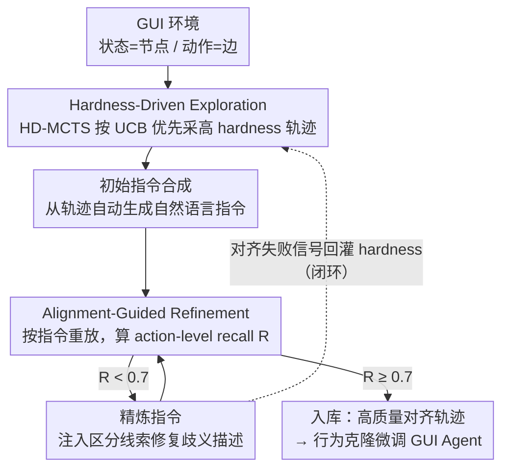

# HATS: Hardness-Aware Trajectory Synthesis for GUI Agents

**会议**: CVPR 2026  
**arXiv**: [2603.12138](https://arxiv.org/abs/2603.12138)  
**代码**: [JiuTian-VL/HATS](https://github.com/JiuTian-VL/HATS)  
**领域**: LLM Agent  
**关键词**: GUI Agent, 轨迹合成, 语义歧义, Monte Carlo Tree Search, 数据对齐

## 一句话总结

提出难度感知的轨迹合成框架 HATS，通过 hardness-driven exploration 和 alignment-guided refinement 的闭环机制，专注采集和修正语义歧义动作的训练轨迹，大幅提升 GUI Agent 在复杂真实场景中的泛化能力。

## 研究背景与动机

基于大型视觉语言模型 (VLM) 的 GUI Agent 在自动化数字任务方面展现了巨大潜力。现有工作（如 OS-Genesis）通常采用轨迹合成 (trajectory synthesis) 的方式构建训练数据——让模型在模拟环境中自主探索，记录操作轨迹并配对指令。然而，这类方法训练出的 Agent 在简单交互上表现尚可，面对复杂场景时却难以泛化。

作者发现问题的根源在于**语义歧义动作 (semantically ambiguous actions)** 被忽视。这类动作的含义高度依赖于上下文、操作顺序或视觉线索，具体分为三种类型：

**上下文依赖 (Context-dependent)**：同一个图标/按钮在不同页面或不同状态下触发完全不同的功能。例如"+"按钮在邮件应用中是新建邮件，在日历中是新建事件。

**顺序依赖 (Order-dependent)**：某些操作必须在特定前置步骤完成后才能正确执行，跳过中间步骤会导致完全不同的结果。

**视觉歧义 (Visually ambiguous)**：外观高度相似的 UI 元素实际对应不同功能，模型容易混淆。

在现有的随机探索策略下，超过 70% 的采集轨迹都是"打开菜单"、"点击返回"等简单操作，语义歧义动作严重代表性不足。更糟糕的是，即便采集到这类轨迹，单次指令生成也往往产生模糊描述，导致指令与执行之间的语义不对齐。这双重问题严重限制了合成数据的质量和多样性。

## 方法详解

### 整体框架

HATS 要解决的是 GUI Agent 训练数据的一个老毛病：随机采轨迹会让"点设置、点确定"这类简单高频动作被反复采到，而真正难学的语义歧义动作却采不到几条。HATS 用两个模块组成一个闭环来纠偏——**Hardness-Driven Exploration** 主动去采"难"的轨迹，**Alignment-Guided Refinement** 保证采到的轨迹"指令-执行"语义对齐，并把对齐失败的信号回灌给探索，让系统越跑越聚焦在难样本上。

### 关键设计

**0. 先讲清楚 hardness 到底是什么**

整套方法围着 **hardness（一个动作的语义歧义程度）** 转，所以先把它定下来。直觉上，一个动作越"歧义"，就越是：同一个界面状态下有多个外观/语义相近的可点目标，单看一句笼统指令无法唯一确定该点哪个。HATS 用**重放可复现性**来量化它——一条轨迹配上自动生成的指令后，让 Agent 按指令重新执行，用 **action-level reconstruction recall $R$**（重放出的动作序列与原轨迹逐动作匹配的召回率）衡量对齐度；$R$ 越低，说明该动作越容易在重放时走偏，hardness 越高。于是 hardness 不是凭感觉打的标签，而是可由"重放掉了多少动作"实测出来的量。

> ⚠️ 笔者按：原文对 hardness 的精确计分公式未在解读素材中给出，上述"以 $1-R$ 类比 hardness"是基于论文描述（hardness 作为 MCTS 价值估计、$R$ 作为对齐度量）给出的自洽解释，具体定义以原文为准。

**1. Hardness-Driven Exploration（HD-MCTS）：把探索预算花在难处**

HATS 把 GUI 探索建模成树搜索：每个 UI 状态是节点、每个动作是边，用 Monte Carlo Tree Search 框架，以 hardness 作为节点价值信号。选择下一步时用 UCB（Upper Confidence Bound）公式，在**利用**（已知高 hardness 的分支）和**探索**（访问不足的新状态）之间权衡：优先走 (a) 已知高 hardness 的动作分支、(b) 访问次数不够的新状态，并在搜索中动态更新 hardness 统计。结果是采样分布从"偏向简单高频动作"被掰向"困难歧义动作"。

**2. Alignment-Guided Refinement：把笼统指令修到能复现**

光采到难轨迹还不够——一条轨迹可能执行正确，但配的指令太笼统（如"点击设置"），重放时根本无法唯一确定路径。Refinement 用"重放验证 + 迭代精炼"做质量闸门：

| 步骤 | 操作 | 说明 |
|:---:|:---|:---|
| 1 | 初始指令合成 | 从探索轨迹自动生成自然语言指令 |
| 2 | 指令重放 | 在同一环境中按指令重新执行 |
| 3 | 对齐度量 | 计算 action-level reconstruction recall $R$ |
| 4 | 指令精炼 | 注入缺失的上下文线索，修复模糊描述 |
| 5 | 迭代检查 | 重复 2–4 直到 $R \geq 0.7$ |

只有通过对齐检查（$R \geq 0.7$）的轨迹才进入最终训练语料。

**3. 闭环：难样本越难，探索权重越高**

两个模块用双向信息流接成正反馈：Exploration 把挑战性轨迹交给 Refinement 验证修复；Refinement 在重放中发现对齐失败的动作，把它们的 hardness 信号回传给搜索模块，抬高这些动作在未来探索中的优先级。于是越难对齐的动作获得越高的探索权重，系统持续往"高质量困难样本"自我聚焦。

### 一个完整 walkthrough（采集一条"歧义按钮"轨迹）

1. **探索**：HD-MCTS 在某设置页发现"右上角有两个外观相近的图标"，该状态 hardness 高，UCB 优先展开，采到一条点击其中一个图标的轨迹。
2. **初始指令**：自动合成指令="点击图标"——笼统。
3. **重放**：Agent 按"点击图标"重放，结果点错成另一个相似图标，$R=0.4 < 0.7$，未通过。
4. **精炼**：注入区分线索，指令改成"点击右上角齿轮状的设置图标（非旁边的铃铛图标）"。
5. **再重放**：这次唯一命中，$R=1.0 \geq 0.7$，轨迹入库。
6. **回灌**：该动作的对齐失败历史抬高了它的 hardness，未来探索会在类似"多相似图标"状态上投入更多采样。

这条链展示了三件事如何环环相扣：MCTS 找到难点、重放暴露指令歧义、精炼 + 回灌把难样本变成高质量训练数据。

### 训练策略

HATS 的价值在数据合成，最终训练用标准**行为克隆 (Behavior Cloning)**：用合成的高质量轨迹微调 VLM-based GUI Agent，目标是标准的 next-action prediction loss。关键不在训练算法，而在数据——HATS 保证了语义歧义动作被充分表示且指令正确对齐。

## 实验关键数据

### 主实验

在两个主流 GUI Agent 基准上与现有方法的对比：

| 方法 | AndroidWorld (SR%) | WebArena (SR%) |
|:---|:---:|:---:|
| 基础 VLM (无微调) | ~5.0 | ~3.0 |
| Random Exploration | ~8.5 | ~4.5 |
| OS-Genesis | 11.30 | 6.53 |
| AgentTrek | ~12.5 | ~8.0 |
| DigiRL | ~14.0 | ~9.5 |
| **HATS (本文)** | **22.60** | **20.60** |

HATS 相比最强基线 OS-Genesis 在 AndroidWorld 上提升约 **100%**，在 WebArena 上提升约 **215%**，优势极为显著。

### 消融实验

各模块贡献的消融研究：

| 配置 | AndroidWorld (SR%) | WebArena (SR%) |
|:---|:---:|:---:|
| Full HATS | **22.60** | **20.60** |
| w/o HD-MCTS (随机探索) | ~15.0 | ~12.5 |
| w/o Alignment Refinement | ~16.5 | ~13.0 |
| w/o 闭环反馈 | ~17.5 | ~14.0 |
| w/o Hardness 信号 (均匀 UCB) | ~18.0 | ~15.5 |

### 关键发现

1. **两个模块缺一不可**：移除 HD-MCTS 或 Alignment Refinement 都导致显著性能下降，证明探索质量和数据对齐同样重要。
2. **闭环反馈是关键催化剂**：单独使用两个模块（无反馈连接）也有提升，但闭环集成带来的额外增益说明自适应 hardness 更新至关重要。
3. **数据效率极高**：HATS 用更少的轨迹数据就能超过基线用大量数据的效果，因为每条轨迹的信息密度更高。
4. **对齐阈值 $R \geq 0.7$ 的选择**：过低的阈值引入噪声数据，过高则过度过滤导致数据量不足，0.7 是实验验证的最佳平衡点。

## 亮点与洞察

1. **问题定义精准**：首次明确提出"语义歧义动作"这一概念，并系统性地将其分为上下文依赖、顺序依赖、视觉歧义三类，为后续研究提供了清晰的分析框架。

2. **闭环设计优雅**：Exploration 和 Refinement 不是简单的流水线串联，而是通过 hardness 信号形成正反馈循环，这种自适应机制让系统能够自动聚焦最需要改进的部分。

3. **质量优于数量**：在 GUI Agent 数据合成领域，大多数工作追求更多轨迹，HATS 则证明对轨迹分布和对齐质量的精细控制远比数量重要。

4. **MCTS 的巧妙应用**：将 GUI 探索建模为树搜索并非首创，但以语义歧义程度作为 MCTS 的奖励信号是非常新颖的设计，将搜索策略与数据质量目标直接挂钩。

5. **可复现性强**：数据集和模型均已开源在 HuggingFace (wvvvvvw/HATS-Dataset, wvvvvvw/HATS-Model)，便于社区验证和复用。

## 局限与展望

1. **环境依赖**：HATS 的探索需要可交互的 GUI 环境（Android 模拟器、Web 浏览器），对环境搭建和运行效率有较高要求，规模化部署成本不低。

2. **对齐验证的天花板**：Alignment Refinement 依赖 VLM 自身的判断能力来评估对齐度，如果 VLM 本身对某些歧义动作理解不足，可能产生"盲区"。

3. **hardness 冷启动**：初始阶段缺乏 hardness 先验信息，前几轮探索可能效率不高，需要一定的预热过程。

4. **跨平台泛化**：目前验证了 Android 和 Web 两类平台，但 Desktop GUI（如 Windows/macOS 原生应用）的交互模式差异较大，适用性有待验证。

5. **可扩展到更复杂任务**：当前任务大多是单步或短序列操作，对于需要长期规划的复杂多步任务（如跨应用的工作流自动化），HATS 的 MCTS 搜索树可能面临指数级膨胀。

## 相关工作与启发

- **OS-Genesis**：此前最强的 GUI 轨迹合成方法，使用随机探索+单次指令生成。HATS 明确针对其两个核心缺陷（探索偏差和对齐不足）提出解决方案。
- **AgentTrek**：另一种轨迹合成方法，关注任务多样性但未处理语义歧义问题。
- **DigiRL**：将强化学习引入 GUI Agent 训练，但 RL 的奖励设计在开放世界环境中极具挑战。
- **MCTS in LLM**：AlphaCode、Tree-of-Thought 等工作已展示 MCTS 在 LLM 推理中的价值，HATS 将其创新性地应用于数据合成场景。
- **启发**：该工作的核心思想——"关注数据中的困难样本并确保其质量"——具有很强的通用性，可迁移到其他需要合成训练数据的领域（如机器人操作、自动驾驶决策）。

## 评分

| 维度 | 分数 (1-5) | 说明 |
|:---|:---:|:---|
| 创新性 | ⭐⭐⭐⭐ | 首次定义语义歧义动作并提出闭环合成框架 |
| 技术深度 | ⭐⭐⭐⭐ | HD-MCTS + 对齐验证的设计扎实且理论动机清晰 |
| 实验充分度 | ⭐⭐⭐⭐ | 两个主流基准上大幅超越基线，消融完整 |
| 写作质量 | ⭐⭐⭐⭐ | 问题定义清晰，三类歧义动作分析直观 |
| 实用价值 | ⭐⭐⭐⭐⭐ | 数据和模型开源，对 GUI Agent 社区有直接推动 |
| **总评** | **⭐⭐⭐⭐** | **GUI Agent 数据合成的重要进展，闭环设计是核心亮点** |

<!-- RELATED:START -->

## 相关论文

- [\[ICML 2026\] Recovering Policy-Induced Errors: Benchmarking and Trajectory Synthesis for Robust GUI Agents](../../ICML2026/llm_agent/recovering_policy-induced_errors_benchmarking_and_trajectory_synthesis_for_robus.md)
- [\[ACL 2025\] OS-Genesis: Automating GUI Agent Trajectory Construction via Reverse Task Synthesis](../../ACL2025/llm_agent/os_genesis_gui_agent_trajectory.md)
- [\[AAAI 2026\] History-Aware Reasoning for GUI Agents](../../AAAI2026/llm_agent/history-aware_reasoning_for_gui_agents.md)
- [\[CVPR 2026\] GUI-CEval: A Hierarchical and Comprehensive Chinese Benchmark for Mobile GUI Agents](gui-ceval_a_hierarchical_and_comprehensive_chinese_benchmark_for_mobile_gui_agen.md)
- [\[CVPR 2026\] MMBench-GUI: A Unified Hierarchical Evaluation Framework for Multi-Platform GUI Agents](mmbench-gui_a_unified_hierarchical_evaluation_framework_for_multi-platform_gui_a.md)

<!-- RELATED:END -->
