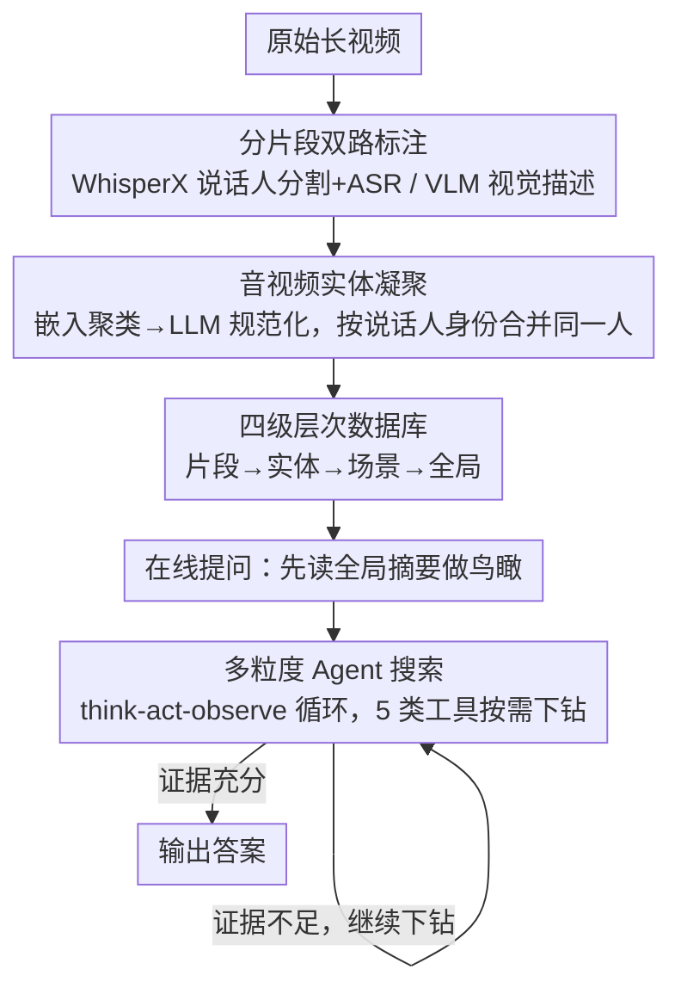

# HAVEN: Hierarchical Long Video Understanding with Audiovisual Entity Cohesion and Agentic Search

**会议**: CVPR 2026  
**arXiv**: [2601.13719](https://arxiv.org/abs/2601.13719)  
**代码**: 无  
**领域**: LLM Agent  
**关键词**: 长视频理解, 层次索引, 实体一致性, Agent搜索, 音视频融合

## 一句话总结
HAVEN 提出音视频实体凝聚 + 层次索引 + Agent搜索的统一框架，通过说话人身份作为跨模态一致性信号，构建全局-场景-片段-实体四级层次数据库，在LVBench上达到84.1%整体准确率的SOTA。

## 研究背景与动机
1. **领域现状**：长视频理解是VLM面临的重大挑战，现有方案（RAG、Agent框架）在处理小时级视频时仍存在严重不足。
2. **现有痛点**：（i）基于朴素分块的RAG导致信息碎片化和全局连贯性丧失；（ii）缺乏层次化视频表示，Agent只能做低效的多轮检索来恢复跨片段连续性。
3. **核心矛盾**：长视频中的事件跨越长时间跨度和多场景演变，局部片段的描述无法捕捉全局叙事结构和远程实体关联。
4. **本文目标**：从碎片化检索转向连贯的结构化理解——通过离线构建层次化数据库+在线Agent自适应搜索。
5. **切入角度**：利用说话人身份作为跨模态的长程一致性信号（即使视觉线索不可靠时仍有效），构建稳健的实体表示。
6. **核心idea**：音视频实体凝聚（通过说话人身份整合碎片化观察）+ 四级层次数据库 + 目标驱动的多粒度Agent搜索。

## 方法详解

### 整体框架

HAVEN 把"看懂一段长视频"拆成离线与在线两个阶段。**离线**一次性把原始视频加工成一座四级层次数据库 $\mathcal{D} = \{\tilde{\mathcal{C}}, \tilde{\mathcal{E}}, \tilde{\mathcal{S}}, \tilde{\mathcal{G}}\}$——从细到粗依次是片段（Clip）、实体（Entity）、场景（Scene）、全局（Global）。**在线**回答问题时，Agent 不再重新扫一遍视频，而是先拿到全局摘要做"鸟瞰"，再通过 think-act-observe 循环在这座数据库里按需下钻。下面三个设计分别回答：碎片化的人物如何被认成同一个人、信息如何分层组织、Agent 如何在层级间导航。

### 关键设计

**1. 音视频实体凝聚：用"声音"当跨片段的胶水**

长视频里同一个人会反复出现，但遮挡、换镜头、光照变化会让纯视觉描述把"同一个人"误判成好几个人。HAVEN 的关键洞察是：**说话人身份比视觉外观稳定得多**——声音不会因为背过身或灯光变暗而改变。

具体做法：每个片段先抽两路标注——音频侧用 WhisperX 做说话人分割 + ASR，视觉侧用 VLM 生成描述，拼成片段表示 $C_i^t = [P_i'; T_i; V_i]$。然后两步整合实体：（1）**嵌入聚类**把所有实体描述编码后聚成候选组；（2）**LLM 规范化**逐个核验聚类，决定合并成一个规范实体还是拆开。整合时有一条优先规则——只要多个片段共享同一个说话人标签，就优先把对应角色合并，哪怕它们的视觉描述因遮挡/视角而看起来不同。这正是把"声音"当作跨片段一致性胶水的体现。

**2. 四级层次数据库：让不同问题各取所需**

不同问题需要的信息粒度天差地别，HAVEN 因此把内容索引成四层：

- **片段级 $\tilde{\mathcal{C}}$**：每 30 秒一段，含文本 + 视觉嵌入，回答"第 12 分钟发生了什么"。
- **实体级 $\tilde{\mathcal{E}}$**：规范实体 + 它在每个关联片段里的聚焦重描述，回答"Sarah 的表情怎么变化"。
- **场景级 $\tilde{\mathcal{S}}$**：LLM 把语义连续的片段自适应分组并生成场景摘要，回答"这场戏在讲什么"。
- **全局级 $\tilde{\mathcal{G}}$**：由场景摘要汇总出的总体概述，回答"整个视频讲什么"。

这样"视频讲什么/某分钟发生什么/某人怎么变化"三类问题分别落到全局层、片段层、实体层，互不干扰。

**3. 多粒度 Agent 搜索：按需下钻而非全量扫描**

Agent 配 5 类工具——全局场景浏览 $T_{\text{scene}}$、片段描述搜索 $T_{\text{caption}}$、片段视觉搜索 $T_{\text{visual}}$、实体搜索 $T_{\text{entity}}$、定向检查 $T_{\text{inspect}}$（文本/视觉双模式）。它从全局摘要初始化，进入 think-act-observe 循环：选工具 → 执行查询 → 收证据 → 推理 → 决定继续下钻还是作答。关键在于这条路径是 Agent 自主规划的——可以"先粗后细"，也可以在已知人物时直接命中实体层，避免无谓的全量扫描。

### 一个完整 walkthrough（"Sarah 在和谁争吵后离开？"）
1. **鸟瞰**：Agent 读全局摘要 $\tilde{\mathcal{G}}$，定位到"争吵"相关的场景。
2. **定场景**：调 $T_{\text{scene}}$ 找到含争吵的场景级条目，缩小到约 3 个片段的时间窗。
3. **定实体**：调 $T_{\text{entity}}$ 检索 Sarah 的规范实体——因为离线已用说话人身份把她跨片段合并，即便此处她背对镜头也能正确关联。
4. **取证据**：在目标窗口调 $T_{\text{caption}}$/$T_{\text{visual}}$，发现与 Sarah 同框、对话标签匹配的另一实体 = "Mark"。
5. **核验**：调 $T_{\text{inspect}}$ 确认争吵后 Sarah 独自离开画面，输出答案"Mark"，全程只下钻了一条场景→实体→片段的路径，未扫全片。

这条链把三个设计串起来：层次库提供下钻入口、实体凝聚保证人物不被认错、Agent 搜索决定走哪条最短路径。

### 训练策略
全流程**免训练**。离线构建层次库只靠 VLM/LLM 调用，在线搜索用预训练推理 LLM，无任何参数更新。

## 实验关键数据

### 主实验

| 方法 | LVBench Overall | LVBench Reasoning | EgoSchema | 说明 |
|------|----------------|-------------------|-----------|------|
| HAVEN (2fps) | **84.1** | **80.1** | - | SOTA |
| DVD w. subtitle | 76.0 | 68.7 | - | 之前最优Agent |
| OpenAI o3 | 57.1 | 50.8 | 63.2 | 闭源模型 |
| GPT-4o | 48.9 | 50.3 | 70.4 | 闭源模型 |

### 消融实验

| 配置 | Overall | 说明 |
|------|---------|------|
| Full HAVEN | 84.1 | 完整框架 |
| w/o 说话人身份 | 下降 | 实体整合质量降低 |
| w/o 层次索引 | 显著下降 | 退化为平坦RAG |
| w/o 多粒度工具 | 下降 | 搜索效率降低 |

### 关键发现
- HAVEN在推理类别上表现尤为突出（80.1%），说明层次化结构对复杂推理特别有帮助。
- 说话人身份在长视频实体整合中是不可替代的线索。
- 与DVD相比，HAVEN在所有子类别上都有提升，且需要的搜索迭代更少。

## 亮点与洞察
- **说话人身份作为实体凝聚的"胶水"**是一个被严重忽视但非常有效的创新。
- **四级层次架构**的设计符合人类理解长视频的认知模式（先整体后细节）。
- 离线构建+在线搜索的架构使得重复查询不需要重新处理视频。

## 局限与展望
- 离线构建层次数据库本身需要一定计算成本（多次LLM调用）。
- 依赖WhisperX的说话人分割质量，对非对话类视频效果有限。
- 片段固定长度（30秒）可能不是所有视频类型的最优划分。

## 相关工作与启发
- **vs DVD**: DVD使用简单的片段描述+全局实体注册，缺少层次结构。HAVEN的四级层次提供了更高效的导航。
- **vs VideoRAG**: 基于碎片化片段检索，缺乏全局连贯性。HAVEN通过层次索引保持了叙事结构。

## 评分
- 新颖性: ⭐⭐⭐⭐⭐ 音视频实体凝聚和四级层次索引都是创新设计
- 实验充分度: ⭐⭐⭐⭐ LVBench SOTA + 多基准验证
- 写作质量: ⭐⭐⭐⭐⭐ 框架清晰，方法描述系统化
- 价值: ⭐⭐⭐⭐⭐ 长视频理解领域的里程碑式工作

<!-- RELATED:START -->

## 相关论文

- [\[CVPR 2026\] Think, Then Verify: A Hypothesis-Verification Multi-Agent Framework for Long Video Understanding](think_then_verify_a_hypothesis-verification_multi-agent_framework_for_long_video.md)
- [\[CVPR 2026\] WorldMM: Dynamic Multimodal Memory Agent for Long Video Reasoning](worldmm_dynamic_multimodal_memory_agent_for_long_video_reasoning.md)
- [\[NeurIPS 2025\] Deep Video Discovery: Agentic Search with Tool Use for Long-form Video Understanding](../../NeurIPS2025/llm_agent/deep_video_discovery_agentic_search_with_tool_use_for_longfo.md)
- [\[CVPR 2026\] Resolving Evidence Sparsity: Agentic Context Engineering for Long-Document Understanding](resolving_evidence_sparsity_agentic_context_engineering_for_long-document_unders.md)
- [\[CVPR 2026\] SAGE: Training Smart Any-Horizon Agents for Long Video Reasoning with Reinforcement Learning](sage_training_smart_any-horizon_agents_for_long_video_reasoning_with_reinforceme.md)

<!-- RELATED:END -->
