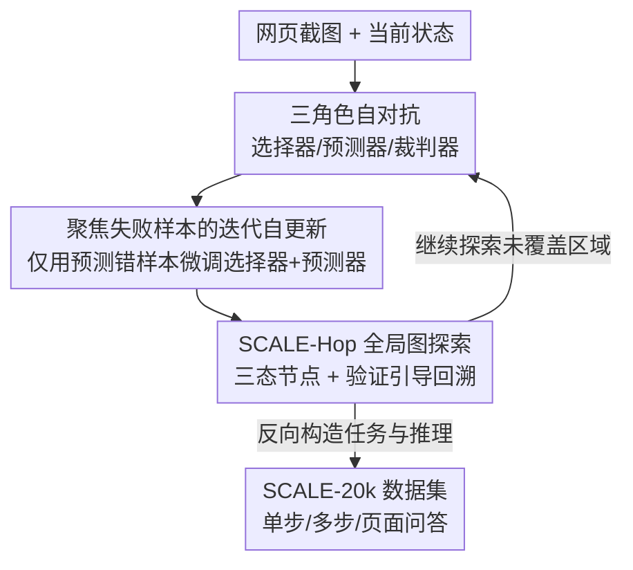

# Learning to Adapt: Self-Improving Web Agent via Cognitive-Aware Exploration

**会议**: CVPR 2026  
**论文**: [CVF Open Access](https://openaccess.thecvf.com/content/CVPR2026/html/Chen_Learning_to_Adapt_Self-Improving_Web_Agent_via_Cognitive-Aware_Exploration_CVPR_2026_paper.html)  
**代码**: 待确认  
**领域**: Agent / 多模态VLM / 自监督  
**关键词**: 网页 Agent、自驱动探索、认知边界、自对抗学习、自改进

## 一句话总结
针对网页 Agent 依赖人工流水线或昂贵专家轨迹、难以适应动态网页的问题，作者提出 SCALE——让同一个 MLLM 扮演选择器/预测器/裁判三个对抗角色，通过"预测失误"自动发现并扩展自身认知边界，再用 SCALE-Hop 图探索做全局规划，最终为 InternVL2.5-8B 和 Qwen2.5-VL-7B 分别带来 231.8% 和 176.3% 的平均任务成功率提升，并产出 2 万条 SCALE-20k 数据集。

## 研究背景与动机
**领域现状**：基于多模态大模型（MLLM）的网页 Agent 在商品搜索、网购、导航等网页自动化任务上已有不错表现，主流做法是直接复用 MLLM 的预训练能力。

**现有痛点**：现实网页高度多样且动态，Agent 的先验知识与真实网页之间存在显著鸿沟。为弥合它，已有工作要么依赖**人工设计的执行流水线**（如 Tree-of-Thought、ReAct、世界模型规划），要么依赖**昂贵的人工标注专家轨迹**做微调。这两条路都有硬伤：流水线/轨迹往往为特定场景定制，遇到不可预测的真实网页就失灵；而且 Agent 变得被动、依赖既定任务流，缺乏探索陌生环境的能力。

**核心矛盾**：现有方法忽略了一个关键问题——**如何评估和扩展 Agent 自身的"认知边界"**。认知边界指 Agent 基于先验知识难以理解或决策的物件与操作。不去主动探测这条边界，Agent 就只能在熟悉区打转，无法针对"自己不懂的地方"补课。

**本文目标**：让 Agent 摆脱对专家轨迹和人工流水线的依赖，能够主动适应新环境、持续扩展认知边界。拆成两个子问题：① 如何在没有外部监督下自动发现 Agent 不懂的动作；② 如何从局部交互上升到全局规划，避免陷在局部死角。

**切入角度**：人类学习新工具时，会主动尝试不确定的操作、预判结果、再用真实反馈校正。作者把这个"自我质疑—预测—验证"的循环搬进 Agent，让同一个模型分饰三角自我对抗。

**核心 idea**：用 Selector–Predictor–Judger 三角色自对抗，把"预测与真实结果不符"的样本当作认知边界信号去定向学习，再用图结构做全局探索——以**自认知感知探索**替代被动模仿。

## 方法详解

### 整体框架
SCALE 的核心是让一个 MLLM 同时扮演三个角色自我对抗：**选择器**专挑罕见/陌生的动作去为难自己，**预测器**预判该动作的结果与理由，**裁判器**在动作真正执行后比对"预测 vs 实际"，判断 Agent 是否真懂这个动作。整条流程分三阶段——输入编码（用 Set-of-Mark 纯视觉处理截图）→ 自检（三角色对抗探测认知边界）→ 迭代更新（只拿"预测错"的失败样本去微调选择器和预测器）。在此之上，**SCALE-Hop** 把探索历史建成有向图，用三态节点标记 + 验证引导回溯做全局规划，避免局部死角。最后把所有探索轨迹反向构造成 **SCALE-20k** 数据集，可直接用于训练其他 MLLM。

### 关键设计

**1. 选择器–预测器–裁判器三角色自对抗：用"预测失误"定位认知边界**

痛点是：Agent 不知道自己"不懂什么"，只会重复熟悉操作。SCALE 让同一个 MLLM 扮演三角色形成闭环——选择器（$\pi_{sel}$）专门挑罕见、令人困惑的元素生成探索动作（如商品页里不去点商品，而去点站点 logo），预测器（$\pi_{pre}$）基于现有知识预判该动作的结果与解释，裁判器在动作执行后对比预测与真实观测。形式化地，选择器先产出 $a_i, r_{sel_i} = \pi_{sel}(O_i)$，预测器给出 $p_i, r_{pre_i} = \pi_{pre}(O_i, a_i, r_{sel_i})$，动作执行得到新观测 $O_{i+1} = \Omega(T(S_i, a_i))$，裁判器判定 $j_i = \mathrm{Judger}(O_i, O_{i+1}, a_i, p_i, r_{pre_i}) \in \{0,1\}$。这里的精妙在于**选择器与预测器是对抗关系**：一个想暴露 Agent 不懂的行为，一个想准确预测来反驳，裁判器提供反馈让两者都进步。预测不一致（$j_i=0$）就意味着踩到了认知边界。

**2. 聚焦失败样本的迭代自更新：只从"不懂的地方"学**

发现边界后怎么用？SCALE 明确**只聚焦失败样本**。当 $j_i = 0$（预测错），说明该动作超出当前知识，裁判器进一步生成真实结果描述 $t_i, r_{t_i} = \mathrm{Judger}(\cdot)$，把这条经验存为 $\mathrm{ExploreData}_i = \langle O_i, a_i, r_{sel_i}, t_i, r_{t_i}\rangle$；若 $j_i = 1$（已懂，无学习价值），则重置环境、让选择器重采样新动作直到产生一个不熟悉的动作。攒满 $K$ 步后，用这批失败数据 SFT 微调选择器与预测器：$\pi_{sel_{j+1}} = \mathrm{SFT}(\pi_{sel_j}, \mathrm{ExploreData}_j)$、$\pi_{pre_{j+1}} = \mathrm{SFT}(\pi_{pre_j}, \mathrm{ExploreData}_j)$，而裁判器在迭代中保持固定。之所以聚焦失败而非成功样本，是因为失败样本暴露了认知盲区、提供最大学习信号；选择器与预测器在这个相互强化的循环中协同进化，不断发现并扩展边界。

**3. SCALE-Hop 图表示与验证引导回溯：从局部交互升到全局规划**

只靠 SCALE 难以获得全局视角，容易困在局部。SCALE-Hop 把探索建成有向图 $G=(N, E)$，节点 $n_i = (O_i, u_i)$ 由观测和 URL 共同定义：URL 是新的就直接建新节点；URL 已存在时，用结构相似性指标 SSIM 比较新观测与同 URL 旧节点，只有当所有 SSIM 分都低于阈值 $\delta$ 才视为新环境插入新节点——以此去重并识别真正的新状态。**验证引导回溯**给每个节点动态标三态：未探索 / 部分探索 / 完全探索。当某节点局部探索停滞，就触发验证：从该节点采 $N$ 个随机动作让预测器预测，若全部命中则标为"完全探索"，否则维持"部分探索"；验证通过后 Agent 回溯到最近的未探索/部分探索节点。这套机制在"广覆盖"和"重点探索"之间取得平衡，避免随机游走式的盲目铺开。

**4. SCALE-20k 数据集构建：把探索轨迹反向变成可训练数据**

为缓解高质量网页任务数据稀缺，作者用 SCALE 在 19 个真实网站上的探索数据，借 GPT-4o 辅助分三阶段反向构造数据集：① 单步任务——从有效探索动作反推对应的单步任务与推理；② 多步任务——从 SCALE-Hop 图里抽逻辑连贯的多步轨迹，反推任务与推理；③ 页面理解问答——为图中每个节点生成 QA 对，补充页面级监督。最终 SCALE-20k 含 15042 个单步任务、3780 个多步任务、6886 个页面理解 QA，由 Qwen2.5-VL-7B 和 InternVL2.5-8B 采集。

### 损失函数 / 训练策略
SCALE 用监督微调（SFT）在每轮 $K$ 步探索后更新选择器与预测器，裁判器全程固定不训练，从而构成迭代式自改进闭环。整套探索-学习不需要外部专家轨迹或奖励模型，也不增加推理时额外开销。

## 实验关键数据

### 主实验
评测指标：**SR（Success Rate，任务成功率，%）越高越好**，**AS（Average Steps，平均步数）越低越好**（更简洁的推理路径）。基准为 VisualWebArena（Shopping / Classifieds / Reddit 三域）与 WebVoyager（真实网站、动态内容）。下表节选 SR 对比：

| 骨干 / 策略 | Shopping SR | Classifieds SR | Reddit SR | WebVoyager SR |
|-------------|-------------|----------------|-----------|---------------|
| GPT-4o（零样本） | 17.2 | 13.7 | 6.7 | 9.6 |
| Qwen2.5-VL-7B 零样本 | 4.1 | 6.0 | 2.4 | 0.6 |
| Qwen2.5-VL-7B + GPT 轨迹模仿 | 18.3 | 10.7 | 3.3 | — |
| Qwen2.5-VL-7B + OS-Genesis | 11.2 | 8.6 | 1.4 | 6.7 |
| **Qwen2.5-VL-7B + SCALE** | 14.4 | 12.0 | 4.8 | **7.9** |
| InternVL2.5-8B 零样本 | 3.9 | 0.4 | 1.4 | 0.0 |
| **InternVL2.5-8B + SCALE** | 11.0 | 6.4 | 3.3 | 1.8 |

SCALE 相对各自零样本基线，平均任务成功率提升 231.8%（InternVL2.5-8B）和 176.3%（Qwen2.5-VL-7B），在 WebVoyager 这类动态网页上优势尤其明显（静态轨迹难以覆盖）；同时 AS 多数域取得最低或次低，说明推理路径更简洁。把 SCALE-20k 直接拿去训练与探索模型无关的 LLaVA-NeXT-8B，也能提升其 Agent 能力，验证数据集的通用性。

### 消融实验
| 配置 | Shopping SR | 整体 SR | 访问节点数 | 说明 |
|------|-------------|---------|-----------|------|
| 随机游走 | 14.8 | 10.4 | 399 | 盲目铺开、覆盖低质 |
| w/o SCALE-Hop | 13.5 | 10.1 | 277 | 缺全局规划，节点少 |
| SCALE（完整） | 14.4 | **11.6** | **876** | 覆盖最广、成功率最高 |

不同探索深度（外循环 hop 数 × 内循环 25 步）对 Qwen2.5-VL-7B 整体 SR：SCALE(20-25) 7.2 → SCALE(40-25) 7.9 → SCALE(60-25) **11.9**，探索越深越好。

### 关键发现
- **自对抗机制是探索质量的关键**：相比随机游走，SCALE 在成功率和覆盖（访问节点数 876 vs 399）上都更优，且更多节点落在罕见区域，产出"信息量大、能暴露错误"的数据。
- **SCALE-Hop 带来全局视野**：去掉它后访问节点骤降（277）、整体 SR 下降，说明图表示 + 验证回溯有效避免局部死角。
- **探索越深收益越大**：增加 hop 数持续提升 SR，说明更深探索能发现更有信息量的行为。
- **数据集可迁移**：SCALE-20k 直接训练无关模型仍有效，体现框架的通用性。

## 亮点与洞察
- **"让模型为难自己"的自对抗设计很巧**：选择器专挑陌生动作、预测器努力预测、裁判器裁定，三角色同源却对抗，把"我不懂什么"变成可计算的预测失误信号，无需任何外部标注。
- **只学失败样本**：明确丢掉"已懂"的成功样本、只用 $j_i=0$ 的失败数据微调，学习信号集中在认知盲区，比无差别收集数据更高效——这一取舍思路可迁移到其他自改进 Agent。
- **局部探索 + 全局图规划的分层结构**：SCALE 管单页/单动作，SCALE-Hop 用三态节点 + SSIM 去重 + 验证回溯管全局覆盖，两层配合既深入又不困在局部，是探索类 Agent 值得复用的范式。

## 局限与展望
- **裁判器固定不训练**：整个自改进闭环的正确性高度依赖裁判器的判定质量，若裁判器本身判错（把懂判成不懂或反之），会污染训练数据，论文未深入讨论这种误差传播。⚠️ 以原文为准。
- **依赖 GPT-4o 构造数据集**：SCALE-20k 三阶段构造都借助 GPT-4o 辅助任务生成与验证，数据质量与成本受外部强模型制约。
- **绝对成功率仍偏低**：多数域 SR 仍在个位到十几（如 Reddit 域普遍低于 5%），说明真实动态网页任务整体仍难，相对提升大但绝对天花板未突破。
- **改进方向**：把裁判器也纳入可学习/可校准范畴以降低误判；探索更高效的边界探测策略减少无效随机采样。

## 相关工作与启发
- **vs 人工流水线（ReAct / Tree-of-Thought / 世界模型规划）**：它们用显式模块结构化推理，但需大量人工设计、超出预定义场景就失灵；SCALE 不依赖人工模块，靠自驱动探索适应新环境。
- **vs 专家轨迹微调（Mind2Web / OSWorld / AGUVIS）**：依赖大规模人工标注，成本高、多样性与适应性受限，产出被动 Agent；SCALE 完全免专家标注，让 Agent 自评自扩能力。
- **vs 探索类方法（OS-Genesis / Learn-by-Interact）**：它们靠无监督交互生成轨迹再用奖励模型过滤，但多数没有系统探测/扩展认知边界；SCALE 聚焦自认知感知探索，主动定位并拓宽自身边界。

## 评分
- 新颖性: ⭐⭐⭐⭐ 三角色自对抗 + 认知边界探测 + 图全局回溯，把"主动找自己不懂的地方"做成可训练闭环，思路新颖。
- 实验充分度: ⭐⭐⭐⭐ 两骨干 + 两基准 + 多基线 + 探索深度/消融分析较完整，但绝对 SR 偏低。
- 写作质量: ⭐⭐⭐⭐ 框架与形式化清晰，三阶段叙述到位，符号略密。
- 价值: ⭐⭐⭐⭐ 免专家标注的自改进范式 + 可复用的 SCALE-20k 数据集，对网页 Agent 研究有实用价值。

<!-- RELATED:START -->

## 相关论文

- [\[ICLR 2026\] Web-CogReasoner: Towards Knowledge-Induced Cognitive Reasoning for Web Agents](../../ICLR2026/llm_agent/web-cogreasoner_towards_knowledge-induced_cognitive_reasoning_for_web_agents.md)
- [\[ACL 2026\] TheraAgent: Self-Improving Therapeutic Agent for Precise and Comprehensive Treatment Planning](../../ACL2026/llm_agent/theraagent_self-improving_therapeutic_agent_for_precise_and_comprehensive_treatm.md)
- [\[ICLR 2026\] Agentic Context Engineering: Evolving Contexts for Self-Improving Language Models](../../ICLR2026/llm_agent/agentic_context_engineering_evolving_contexts_for_self-improving_language_models.md)
- [\[ACL 2026\] Don't Adapt Small Language Models for Tools; Adapt Tool Schemas to the Models](../../ACL2026/llm_agent/don39t_adapt_small_language_models_for_tools_adapt_tool_schemas_to_the_models.md)
- [\[ACL 2025\] GUI-explorer: Autonomous Exploration and Mining of Transition-aware Knowledge for GUI Agent](../../ACL2025/llm_agent/gui_explorer_autonomous.md)

<!-- RELATED:END -->
