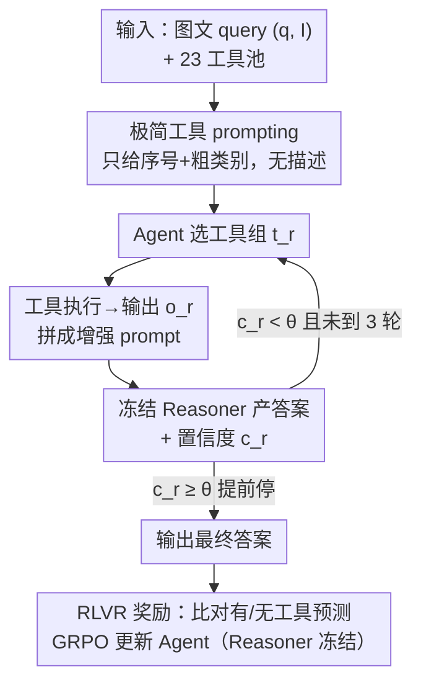

# Learning to Select Visual Tools from Experience

**会议**: CVPR 2026  
**论文**: [CVF Open Access](https://openaccess.thecvf.com/content/CVPR2026/html/Huang_Learning_to_Select_Visual_Tools_from_Experience_CVPR_2026_paper.html)  
**代码**: https://oodbag.github.io/vista_web/ （项目页）  
**领域**: Agent / 多模态VLM  
**关键词**: 工具选择, 强化学习, 可验证奖励, 视觉推理, GRPO

## 一句话总结
本文提出 VisTA（VisualToolAgent），用强化学习训练一个 agent，让它仅凭"任务做对没做对"的反馈，就自主学会从 23 个异构视觉工具里挑出对当前 query 最有用的组合，喂给一个**冻结的** VLM 推理器，在 ChartQA/Geometry3K/MathVerse/BlindTest 上显著超过免训练和微调基线，且学到的策略能直接迁移到更强的推理器（如 GPT-4o）而无需重训。

## 研究背景与动机
**领域现状**：给 LLM/VLM 接外部工具（Python 解释器、目标检测器、图表解析器等）是当前扩展模型能力的主流路径。视觉领域常见做法是让模型生成调用代码、把复杂视觉任务拆成子任务交给专用模块。

**现有痛点**：现有工具集成方式分两类，都不会"主动试错选工具"。一类是**免训练 prompting**，纯靠模型内部世界知识 + 工具文字描述来决定用哪个工具；另一类是**大规模监督微调**，靠人类示范/标注教模型怎么调工具。前者受限于工具描述是否准确，后者要大量人工监督。两类都默认工具种类不多、各工具能力清晰可描述。

**核心矛盾**：现实里同一类工具往往有**多个变体**，能力参差不齐（同样是"图表转表格"，三个实现精度各不相同），且工具的真实表现常常和它的文字描述对不上。没有"从经验里学"的机制，系统既判断不出对某个具体 query 哪个工具最优，也发现不了工具之间的协同组合。

**本文目标**：在一个大而异构的工具池里，学会**按 query 自适应地选工具/组工具**，且不要人工监督、不要改动推理模型本身。

**切入角度**：工具选择本质是一个"探索-利用"的决策问题——天然适合强化学习。RL 能让 agent 通过和环境反复交互，凭**经验表现**而非预设规则去评估并挑出最有效的工具，甚至发现描述里看不出来的非显然组合。

**核心 idea**：把"选工具"建模成一个 RL 策略，用**可验证奖励（RLVR）** 只根据最终答案对错来训练 agent；推理器全程冻结，于是学到的工具选择策略可以即插即用地换到别的推理器上。

## 方法详解

### 整体框架
VisTA 由两个解耦的角色组成：一个**可训练的 agent**（视觉语言模型，QwenVL2.5-7B）负责选工具，一个**冻结的 reasoner**（VLM）负责根据工具输出产出答案。给定一个图文 query $(q, I)$，agent 从统一工具池 $T=\{T_1,\dots,T_M\}$（$M=23$）里选出一组工具 $t_1=\langle T^{(1)},\dots,T^{(K)}\rangle$；这些工具在图像上执行得到输出 $o_1$，与原始输入拼成增强 prompt 交给冻结 reasoner，得到答案 $y_{img+tools}=f_\omega(q,I,o_1)$。训练期同时算一个无工具的基线预测 $y_{img}=f_\omega(q,I)$，用来度量工具到底有没有帮上忙。

在此之上叠加**多轮精炼**：reasoner 每轮额外吐一个置信度 $c_r\in[0,1]$，若 $c_r$ 超过阈值（经验取 $0.9$）就提前停、出答案，否则 agent 带着历史决策和置信度进入下一轮，最多三轮。整个 pipeline 用 GRPO + 任务奖励端到端优化 agent，reasoner 不更新。

### 关键设计

**1. 可验证奖励（RLVR）+ 对照式奖励，零推理监督**

针对"现有方法要么靠工具描述、要么靠人类示范，学不到工具的真实效用"这个痛点，VisTA 完全不给 agent 任何推理范例或工具语义，只用最终答案是否正确来塑形。关键在于奖励是**有/无工具的对照**：对每个采样的工具组，比较冻结 reasoner 的基线预测 $y_{img}=f_\omega(q,I)$ 和用工具后的预测 $y_{img+tools}$。奖励定义为：工具把原本错的变对（$y_{img}\neq y^\* $ 且 $y_{img+tools}=y^\*$）给 $r=+1$；工具把原本对的弄错（$y_{img}=y^\*$ 而 $y_{img+tools}\neq y^\*$）给 $r=-0.5$；两者都对给 $r=+1$；两者都错给 $r=0$。这等于直接奖励"有增量贡献"的工具、惩罚"帮倒忙"的工具，让 agent 学到的是工具对这个 reasoner 的**经验效用**，而不是描述里写的功能。

**2. Agent 与冻结 Reasoner 解耦，策略可跨推理器迁移**

这是 VisTA 最关键的部署优势。训练时 reasoner 始终冻结，agent 学到的只是"对什么样的 query 该选什么工具"这一层策略，并不依赖某个具体 reasoner 的参数。于是同一个用 QwenVL-7B 训出来的工具选择策略，可以**不重训**直接配上更强的 GPT-4o 当 reasoner——论文实测这样迁移后在 ChartQA 上达到 88.1%、ChartQA-OoD 75.6%，比最好的免训练 GPT-4o 基线分别高 3.5 和 2.3 分。相比"直接微调 reasoner"的路线，这种解耦既保住了 reasoner 在其他任务上的泛化能力，又给了部署期换更强骨干的灵活性。

**3. 置信度驱动的多轮工具精炼**

单轮选一次工具对难题往往不够。多轮机制让 agent 在 $r>1$ 轮观察到完整历史 $s_r=(q,I,\{(t_1,c_1),\dots,(t_{r-1},c_{r-1})\})$，其中 $c_i$ 是 reasoner 对"当前累积的工具输出够不够答题"给出的标量置信度。$c_r$ 超过阈值 $\theta=0.9$ 就提前停止，否则继续补充工具，最多三轮。为了让梯度只落在 agent 的工具决策上，训练时对 reasoner 产生的置信度等 observation token 加 **token-wise loss mask** 屏蔽掉。置信度早停让计算很省——ChartQA 上平均只用 1.1 轮，难数据集（OoD/Geometry3K/MathVerse）1.4–1.8 轮，精炼只在真正难的 query 上触发。多轮在 ChartQA-OoD 上比 GRPO 微调 reasoner 高 11.5 分（75.8 vs 64.3）。

**4. 极简工具 prompting，逼 agent 从经验而非描述学**

工具池有 23 个工具，跨图表分析、图解析、数学、低层感知四大类，很多类有多个能力不同的变体。但 prompt **只列工具序号和粗粒度功能类别**（如 chart analysis / object detection），不给任何详细描述或使用示例。这一刻意的"信息匮乏"设计，正是为了不让 agent 走"读描述照着选"的捷径，强迫它通过 RL 反馈去发现每个工具的真实效用。论文用 Pearson 相关印证了这点：训练中工具使用频率与其单独准确率的相关系数从近 0 升到 0.8 以上，说明 agent 确实在向高效工具收敛，而非靠固定启发式。

## 实验关键数据

### 主实验
统一 agent 为 QwenVL2.5-7B，reasoner 冻结。VisTA 单轮/多轮在四个基准上全面超过免训练和 RL 微调基线（准确率 %）：

| 方法 | ChartQA | ChartQA-OoD | Geometry3K | MathVerse |
|------|---------|-------------|------------|-----------|
| Training-Free（QwenVL-7B reasoner） | 76.4 | 62.3 | 54.0 | 46.7 |
| RL 微调 reasoner（GRPO，无工具） | 77.5 | 64.3 | 41.0 | 49.2 |
| VisTA 单轮 | 79.1 | 72.7 | 55.3 | 50.8 |
| VisTA 多轮（≤3 轮） | **79.9** | **75.8** | **57.0** | **52.1** |

迁移实验：把 QwenVL-7B 训出的策略**不重训**配 GPT-4o reasoner，ChartQA 88.1 / OoD 75.6 / Geometry3K 52.0 / MathVerse 55.8，均超对应最强免训练 GPT-4o 基线。BlindTest（低层视觉感知，连 GPT-4o 都吃力）上 VisTA 53.4，高于训练免训 GPT-4o 的 51.8。

### 工具选择分析与消融
| 配置 / 对照 | ChartQA | 说明 |
|------|---------|------|
| 无工具基线 | 76.4 | reasoner 单干 |
| 最佳单个工具 T2 | 78.3 | 静态用一个最好的工具 |
| VisTA 学到的策略 | 79.1 | 超过任何单工具 |
| 伪上界（任一工具能答对即算对） | 88.0 | 完美单工具选择的松上界 |

多轮消融（≤1/2/3 轮，含置信度早停的平均轮数）：

| 轮数 | ChartQA | ChartQA-OoD | Geometry3K | MathVerse |
|------|---------|-------------|------------|-----------|
| 1 轮 | 79.1 | 72.7 | 55.3 | 50.8 |
| ≤2 轮 | 79.6 | 74.4 | 56.3 | 51.7 |
| ≤3 轮 | 79.9 | 75.8 | 57.0 | 52.1 |
| 平均实际轮数 | 1.1 | 1.8 | 1.4 | 1.5 |

### 关键发现
- **没有"万能工具"**：单工具最高 78.3% 离伪上界 88.0% 差很远，不同 query 的最优工具不同——这正是要学自适应策略的理由。
- **多轮收益集中在难/分布外样本**：ChartQA-OoD 上多轮比 GRPO 微调 reasoner 高 11.5 分，说明"反复用工具补证据"比"直接优化冻结模型"更能加强视觉 grounding。
- **agent 真的在学效用排序**：工具使用频率与单工具准确率的 Pearson 相关随训练从近 0 升到 >0.8，强偏好高效的 chart-to-table 工具（T1/T2），冷落低效的 chart-to-SVG（T3）和 caption（T6）。

## 亮点与洞察
- **对照式 RLVR 奖励很巧**：用"有工具 vs 无工具"两次预测的差，把"工具贡献"直接变成奖励信号，比单纯"答对得分"更能区分工具是帮忙还是帮倒忙——这个思路可迁移到任何"外挂模块是否有用"的场景（检索、记忆、外部 API）。
- **训练弱、部署强的解耦范式**：用便宜的 QwenVL-7B 学策略、部署时换 GPT-4o，策略零成本迁移。这把"agent 能力"和"reasoner 能力"拆成两个可独立升级的轴，对工程落地很有价值。
- **故意"少给信息"的 prompting**：不给工具描述、只给序号类别，反而逼出更可靠的经验学习——提示"工具描述可能骗人"时，让模型从结果学比从说明书学更稳。

## 局限与展望
- 作者承认：VisTA 把每个工具当**黑盒模块**做高层选择，没有建模真实工具接口的完整参数结构。需要显式构造参数的场景（如调 zoom-in 工具时要指定 bounding box）目前覆盖不了，参数化工具调用是未来方向。
- 自己看到的：⚠️ Table 3 与正文存在 OCR/笔误层面的小冲突（如正文称 ChartQA "90.8 vs 88.4 vs 88.1" 第三、却又写"surpasses Molmo-72B"两次），具体 SOTA 排名以原文为准；评测仅限四个推理/图表基准，工具池也偏视觉推理类，是否能推广到更开放的视觉任务待验证。
- 改进思路：把奖励从"最终答案对错"细化到"工具调用是否高效/低成本"，可同时优化准确率和工具调用预算；或引入参数生成头，让 agent 不止选工具还能填参数。

## 相关工作与启发
- **vs 免训练工具 prompting（如 VisProg/ViperGPT 一类）**：它们靠模型内部知识 + 工具描述选工具，本文用 RL 从任务结果里学经验效用，区别在于能发现描述看不出的工具协同、并对多变体工具做细粒度偏好，优势是泛化与 OoD 鲁棒，代价是要 RL 训练。
- **vs RL 微调 reasoner（如把 DeepSeek-R1 思路搬到视觉推理）**：它们直接训练推理模型本身做端到端视觉推理，本文取**正交**视角——不动 reasoner，只训"选工具"的 agent，因此能保住 reasoner 的通用泛化、且策略可跨 reasoner 迁移。
- **vs ReTool / o3 "think with images"**：ReTool 用 RL 教 LLM 调代码做文本推理，o3 动态用 zoom/flip 等少数视觉操作；本文针对的是**工具种类多、最优工具依赖 query** 的更难设定，要求 agent 自适应地从异构大池里选。

## 评分
- 新颖性: ⭐⭐⭐⭐ 把工具选择建成 RLVR 问题、对照式奖励 + agent/reasoner 解耦迁移，组合很扎实，但 RL 选工具的大框架并非首创
- 实验充分度: ⭐⭐⭐⭐ 五个基准 + 迁移 + 多轮消融 + 工具频率-效用相关性分析，较完整；但工具池偏视觉推理类，开放任务覆盖有限
- 写作质量: ⭐⭐⭐⭐ 动机和方法讲得清楚，奖励/多轮公式完整；个别 SOTA 表述有笔误
- 价值: ⭐⭐⭐⭐ "弱训练强部署"的可迁移工具策略对实际多模态系统落地很有吸引力

<!-- RELATED:START -->

## 相关论文

- [\[CVPR 2026\] ReFAct: Empowering Multimodal Web Agents with Visual and Context Focusing](refact_empowering_multimodal_web_agents_with_visual_and_context_focusing.md)
- [\[ICML 2026\] Skill-Pro: Learning Reusable Skills from Experience via Non-Parametric PPO for LLM Agents](../../ICML2026/llm_agent/skill-pro_learning_reusable_skills_from_experience_via_non-parametric_ppo_for_ll.md)
- [\[CVPR 2026\] Experience Transfer for Multimodal LLM Agents in Minecraft Game](experience_transfer_for_multimodal_llm_agents_in_minecraft_game.md)
- [\[CVPR 2026\] CGL: Advancing Continual GUI Learning via Reinforcement Fine-Tuning](cgl_advancing_continual_gui_learning_via_reinforcement_fine-tuning.md)
- [\[CVPR 2026\] ORCA: Orchestrated Reasoning with Collaborative Agents for Document Visual Question Answering](orca_orchestrated_reasoning_with_collaborative_agents_for_document_visual_questi.md)

<!-- RELATED:END -->
