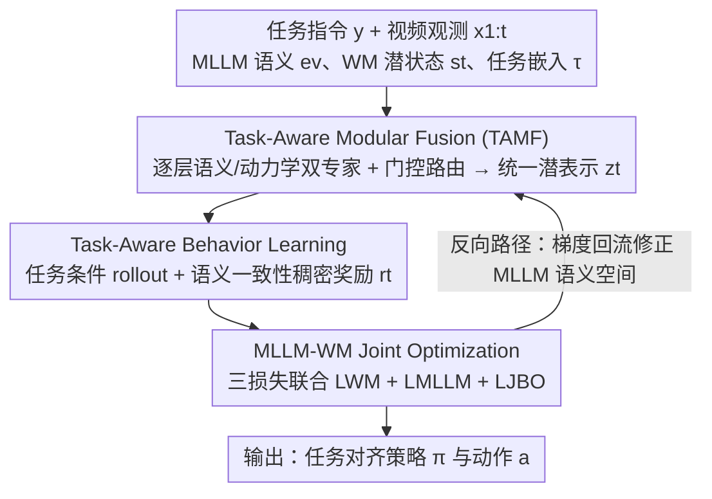

# ModularAgent: A Task-Aware Modular Framework for Joint Optimization of Multimodal Large Language Models and World Models

**会议**: CVPR 2026  
**论文**: [CVF Open Access](https://openaccess.thecvf.com/content/CVPR2026/html/Zhan_ModularAgent_A_Task-Aware_Modular_Framework_for_Joint_Optimization_of_Multimodal_CVPR_2026_paper.html)  
**代码**: 未公开  
**领域**: Agent / 具身智能  
**关键词**: 世界模型, 多模态大模型, 双向耦合, 任务感知路由, 强化学习

## 一句话总结
ModularAgent 让多模态大模型（MLLM）和世界模型（WM）在潜空间里**双向耦合**：前向把 MLLM 的语义注入 WM 引导"想象"，反向用 WM 生成的稠密文本对齐奖励反过来修正 MLLM 的语义空间，并通过任务感知的逐层双专家路由缓解多任务冲突，在 DMC 运动控制的多任务与跨环境迁移上超过 GenRL/FOUNDER 等基线。

## 研究背景与动机

**领域现状**：要造能在真实世界泛化的"通才具身智能体"，需要同时具备两种能力——MLLM 提供强语义先验和跨模态泛化（能读懂"打开台灯、小心花瓶"这类高层指令），世界模型（WM，如 Dreamer/PlaNet 这类 RSSM）则擅长在潜空间建模环境动力学、做长视野的想象（imagination）和规划。把两者拼起来看似是通向开放式具身智能的捷径。

**现有痛点**：现有融合方式都很"浅"。一类（planner/reward 范式）把 MLLM 当外部工具，只用它做高层规划或算奖励，MLLM 和 WM 的学习目标彼此割裂、表示对不上；另一类（GenRL、FOUNDER）学一个 connector 把 MLLM 嵌入映射进 WM 潜空间，但有两个硬伤：(1) 是**单向投影**——信息只从 MLLM 流向 WM，环境动力学的反馈永远回不到 MLLM；(2) connector 是**任务无关**的，对所有任务用同一套对齐策略，任务间差异大时参数互相打架，多任务和跨任务泛化都受限。

**核心矛盾**：语义推理（MLLM）和物理动力学（WM）天然在不同的表示流形上，单向、静态的连接器既无法闭环纠错，又无法按任务自适应——多任务一上来就出现梯度冲突。

**本文目标**：建一个统一框架，既能让语义意图紧耦合进 WM 的潜动力学，又能让 WM 的物理反馈回流修正 MLLM，并且这套耦合要**任务感知**、支持多任务学习与跨环境泛化。

**切入角度**：作者主张从"静态架构设计"转向"任务感知的动态联合机制"，把耦合做成**双向**（forward + backward）且**逐层模块化路由**。

**核心 idea**：用一对互补通路（前向语义注入 WM 做语义引导的想象、反向用稠密文本奖励把梯度回传修正 MLLM）+ 任务条件门控的逐层双专家融合，实现 MLLM 与 WM 在潜空间的双向联合优化。

## 方法详解

### 整体框架
ModularAgent 的输入是任务指令 $y$、视频观测序列 $x_{1:t}$ 和历史动作 $a_{t-1}$，输出是与任务语义一致的动作策略 $\pi$。整条管线由三个组件串成一个"前向想象、反向纠错"的闭环：**Task-Aware Dynamic Joint Learning**（核心是 Task-Aware Modular Fusion，TAMF）把 MLLM 语义 $e_v$ 和 WM 潜状态 $s_t$ 在任务嵌入 $\tau$ 引导下融成统一潜表示 $z_t$；**Task-Aware Behavior Learning** 在这个共享想象空间里做任务条件 rollout，并算出稠密的语义一致性奖励；**MLLM-WM Joint Optimization** 用一个三项联合损失把语义对齐、动力学预测和行为优化绑到同一个训练范式里，让梯度真正在 MLLM 和 WM 之间流动。前向路径 A→B→C 让语义引导想象，反向路径则把联合损失的梯度从 D 回传到 TAMF/MLLM，使语义表示能按真实物理动力学自我校正。

### 关键设计

**1. Task-Aware Modular Fusion（TAMF）：用任务条件的逐层双专家路由把语义和动力学融在一起，又不让多任务互相打架**

这一步针对的是"connector 任务无关、多任务参数互相冲突"的痛点。给定 MLLM 视觉语义 $e_v \in \mathbb{R}^{d_m}$ 和 WM 潜状态 $s_t \in \mathbb{R}^{d_s}$，先用轻量投影拼出初始融合表示 $z^{(0)} = h_{\text{fuse}}([\,e_v;\,s_t\,])$。TAMF 由 $L$ 层堆叠组成，每层含两个专家适配器——语义专家 $A^{(\ell)}_{\text{sem}}$ 负责对齐文本/视觉表示，动力学专家 $A^{(\ell)}_{\text{dyn}}$ 负责整合物理状态转移。关键在于**任务引导的门控**：把任务嵌入 $\tau$ 过一个轻量网络 $p = \sigma(W_2\,\text{GELU}(W_1\,\text{LN}(\tau)))$ 得到 $(0,1)$ 的路由系数，每层用它在两个专家间加权：

$$z^{(\ell)} = z^{(\ell-1)} + (1-p^{(\ell)})\,A^{(\ell)}_{\text{sem}}(z^{(\ell-1)}) + p^{(\ell)}\,A^{(\ell)}_{\text{dyn}}(z^{(\ell-1)})$$

每个专家适配器是 Pre-LayerNorm → GEGLU → Linear → LayerScale → Residual 的轻量块。与"单层多专家"不同，TAMF 是**逐层独立门控**：这样梯度传播被拆成多个局部决策、收敛更稳；每层都能在高层语义抽象和低层物理推理之间渐进平衡；而且某一层门控失准只影响局部计算、不会污染整条特征流。对不同任务，语义/动力学分支的相对权重被自适应调整，从而在任务间共享低层表示的同时保留任务特异性，缓解异构任务的梯度冲突。

**2. Task-Aware Behavior Learning：在共享想象空间里做任务条件 rollout，并用稠密语义奖励代替人工奖励**

针对"WM 想象纯由物理转移驱动、和任务语义脱节"的问题，这一步让想象本身带上任务语义。在融合潜表示 $z_t = f_{\text{TAMF}}(e_v, s_t, \tau)$ 上，策略网络与转移函数迭代展开 rollout：$a_t \sim \pi_\psi(a_t\,|\,z_t)$，$\tilde z_{t+1} \sim p_\theta(z_{t+1}\,|\,z_t, a_t)$，对视野 $H$ 得到想象轨迹 $\{\tilde z_{t+h}, a_{t+h}\}_{h=1}^H$；与传统 model-based rollout 不同，它显式带入 MLLM 视觉信息、隐式依赖任务嵌入 $\tau$，因此轨迹在整个时间演化上都保持语义一致。

奖励则在潜想象空间里**自学**而非人工定义：先把任务嵌入映射进 WM 状态流形 $z^\tau_t = f_{\text{map}}(\tau)$，再用文本想象模块预测任务对齐的下一状态 $\tilde z^\tau_{t+1} \sim \tilde p_\psi(z^\tau_{t+1}\,|\,z^\tau_t, a_t)$，把静态目标变成随时间演化的目标轨迹。稠密奖励定义为想象状态与任务参考轨迹的语义一致性 $r_t = \text{Sim}(z_t, \tilde z^\tau_t)$（⚠️ 原文 Eq. 10 写作余弦相似度，而联合损失 Eq. 14 处又说 $\text{Sim}(\cdot)$ 实现为负 KL 散度，二者表述略有出入，以原文为准）。这个稠密信号比稀疏环境奖励更平滑，能引导策略走向既物理可行、又语义对齐的行为。

**3. MLLM-WM Joint Optimization：用三项联合损失把前向注入和反向纠错绑成一次梯度更新**

前两步搭好了双向通路，但只有把它们放进同一个可微目标，反向路径才真正成立。总损失为

$$L_{\text{total}} = \lambda_{\text{WM}} L_{\text{WM}} + \lambda_{\text{MLLM}} L_{\text{MLLM}} + \lambda_{\text{JBO}} L_{\text{JBO}}$$

其中 $L_{\text{WM}}$ 是 RSSM 标准目标（先验-后验 KL 一致性的动力学项 + 观测重建项），负责让 WM 学到紧凑可预测的想象空间；$L_{\text{MLLM}}$ 是语义重建 $\lVert e_v - f_{\text{dec}}(z_t)\rVert_2^2$ 加跨模态对齐 $\lVert e_v - f_\psi(\tau)\rVert_2^2$，让 MLLM 的可控语义表示既能从潜状态解码回视觉、又能和任务文本对齐；$L_{\text{JBO}}$ 是任务条件的联合行为优化目标 $L_{\text{JBO}} = -\mathbb{E}_t[\,w_{t+h}\cdot \text{Sim}(z_{t+h}, \tilde z^\tau_{t+h})\,]$，并按 DreamerV3 用折扣权重 $w_{t+h} = \gamma^{t+h}$ 压低长视野想象、优先近期可靠预测。同时训练里还最小化 WM rollout 分布与任务条件想象分布之间的 KL（Eq. 9），强制想象轨迹既物理一致又语义连贯。由于奖励在潜空间可微，它能穿过联合损失把梯度回传到 MLLM——这正是"反向路径"得以成立、让语义空间按真实动力学自我校正的关键。

### 损失函数 / 训练策略
训练分两阶段：先预训练世界模型及相关组件 100K 步，再进入行为学习阶段更新 50K 步。所有 model-based 基线与本方法统一用 InternVideo2 作视频-语言骨干，视觉观测渲染为 64×64，batch size 64，序列长度 32。$\lambda_{\text{WM}}/\lambda_{\text{MLLM}}/\lambda_{\text{JBO}}$ 等权重与门控网络等超参在原文补充材料给出。

## 实验关键数据

> **指标说明**：DMC（DeepMind Control Suite）上报告的是归一化 episodic reward——用 min-max 缩放，随机策略对应 0、专家策略对应 1，10 个随机种子的均值 ± 标准误。

### 主实验
四个运动控制环境（Cheetah / Walker / Quadruped / Stickman）、Stand/Walk/Run 三类任务，单环境多任务求解结果（节选 + overall）：

| 任务 | GenRL | FOUNDER | ModularAgent |
|------|-------|---------|--------------|
| walker run | 0.77 | 0.78 | **0.87** |
| quadruped run | 0.86 | 0.94 | **0.95** |
| stickman stand | 0.70 | 0.91 | **0.95** |
| cheetah run | 0.74 | **0.81** | 0.79 |
| overall（10 任务平均） | 0.82 | 0.87 | **0.91** |

ModularAgent 在 10 个任务中拿下 9 个最好，overall 0.91 高于 FOUNDER 0.87、GenRL 0.82；model-free 基线（IQL 0.39 / TD3+BC 0.34 / TD3 0.45）因不显式建模动力学，长时序一致性差，整体明显落后。唯一不占优的 cheetah run 也仅差 FOUNDER 0.02。值得注意的是它对"已被解好"的任务（walker stand/walk）保持竞争力，同时在更难的 run 上把分数从 0.78 提到 0.87，说明任务感知模块融合确实缓解了任务特异的架构冲突。跨环境迁移（Walker 训练 → Quadruped / Stickman 评测）上同样全面优于 WM-CLIP、GenRL 及 w/o TAMF 变体（Fig. 3）。

### 消融实验
Walker 三任务（Stand / Walk / Run）逐组件累加：

| 配置 | walker stand | walker run | walker walk | 说明 |
|------|------|------|------|------|
| base（GenRL 式单向映射，仅 $L_{\text{WM}}$） | 0.89 | 0.67 | 0.86 | 最小基线 |
| + $L_{\text{MLLM}}$ | 0.96 | 0.76 | 0.90 | 加语义重建/对齐损失，语义-视觉对齐受益 |
| + TAMF | 1.00 | 0.83 | 1.00 | 加任务感知双专家融合，缓解任务干扰 |
| + 联合优化（TARO ⚠️） | **1.03** | **0.87** | **1.02** | 加稠密文本奖励的联合优化，最优 |

> ⚠️ 表格最后一行原文标注为 "+TARO"，正文对应描述为 "+ MLLM-WM Joint Optimization"（数值 1.03/0.87/1.02 一致），TARO 的具体全称原文未明确展开，推测指任务感知奖励/rollout 优化，以原文为准。

### 关键发现
- **贡献最大的两块是 TAMF 和联合优化**：加 TAMF 让 run 从 0.76 跳到 0.83、stand/walk 拉满到 1.00，说明逐层任务条件路由是缓解多任务干扰的主力；再加稠密文本奖励的联合优化把最难的 run 顶到 0.87，证明可微稠密奖励在想象空间里提供了稳定监督。
- **双向耦合优于任一单向**：WM-CLIP（WM→MLLM 单向）和 GenRL/FOUNDER（MLLM→WM 单向）都只用了一半互补性，ModularAgent 的双向联合在统一潜空间里整合语义抽象与物理建模，决策更准。
- **想象轨迹可视化**（Fig. 4）显示行为学习后，任务条件想象轨迹解码出的观测能很接近真实观测，间接验证了"用想象轨迹当奖励参考"这一设计的有效性。

## 亮点与洞察
- **把"反向通路"做成可微稠密奖励**：以往 MLLM-WM 融合都卡在单向投影，本文让奖励在潜空间可微、能穿过联合损失回传修正 MLLM，这是从"拼接"走向"联合优化"的关键一招，思路可迁移到任何"大模型 + 动力学模型"的耦合场景。
- **逐层双专家 + 任务门控**：把多专家路由下沉到每一层、用任务嵌入做门控，既共享低层表示又保任务特异性，比单层门控的梯度更干净——这是缓解多任务冲突的一个轻量且通用的 trick。
- **稠密语义奖励替代人工奖励**：用任务条件想象轨迹作参考、算语义一致性当奖励，绕开了 RL 里手工设计奖励的老大难，对长视野具身任务尤其友好。

## 局限与展望
- 评测集中在 DMC 的低维运动控制（64×64 渲染、locomotion），未覆盖真实机器人操作、复杂视觉场景或更开放的指令空间，泛化到真实世界仍待验证。
- 奖励定义在 Eq. 10（余弦相似度）和 Eq. 14（负 KL）之间存在表述出入，且 "+TARO" 缩写未在正文展开，实现细节需查补充材料。
- 训练涉及三项损失 + 多组权重 $\lambda$ + 逐层门控，超参较多，原文未给充分的敏感性分析，复现成本和稳定性边界不清。
- 与 FOUNDER 的对比因其官方实现未释放，跨域部分只能与 WM-CLIP/GenRL 比，证据链略弱。

## 相关工作与启发
- **vs GenRL / FOUNDER**：它们学单向 connector 把 MLLM 表示映入 WM 潜空间注入语义先验，但信息只能 MLLM→WM、且任务无关；本文做**双向**耦合 + 任务条件路由，环境动力学反馈能回流修正 MLLM，多任务/跨域更稳。
- **vs WM-CLIP**：WM-CLIP 是 GenRL 的反向变体（WM→MLLM 单向映射），同样只用了一半互补性；ModularAgent 在统一潜空间里双向联合优化，决策更准。
- **vs planner/reward 范式（把 MLLM 当外部工具）**：那类方法 MLLM 与 WM 目标割裂、表示不通；本文在潜表示层做梯度级联合优化，语义-动力学真正闭环。

## 评分
- 新颖性: ⭐⭐⭐⭐ 首个在 MLLM 与世界模型之间做任务感知双向耦合 + 联合优化的框架，方向清晰
- 实验充分度: ⭐⭐⭐ DMC 多任务/跨域 + 逐组件消融较完整，但只在低维运动控制、缺真实场景与超参敏感性分析
- 写作质量: ⭐⭐⭐⭐ 动机和三组件逻辑顺畅，但奖励定义/TARO 缩写有小瑕疵
- 价值: ⭐⭐⭐⭐ 为"大模型 + 世界模型"耦合提供了可借鉴的双向优化范式

<!-- RELATED:START -->

## 相关论文

- [\[ACL 2026\] Agent-GWO: Collaborative Agents for Dynamic Prompt Optimization in Large Language Models](../../ACL2026/llm_agent/agent-gwo_collaborative_agents_for_dynamic_prompt_optimization_in_large_language.md)
- [\[CVPR 2026\] SenseSearch: Empowering Vision-Language Models with High-Resolution Agentic Search-Reasoning via Reinforcement Learning](sensesearch_empowering_vision-language_models_with_high-resolution_agentic_searc.md)
- [\[CVPR 2026\] Towards GUI Agents: Vision-Language Diffusion Models for GUI Grounding](towards_gui_agents_vision-language_diffusion_models_for_gui_grounding.md)
- [\[ACL 2026\] Feedback-Driven Tool-Use Improvements in Large Language Models via Automated Build Environments](../../ACL2026/llm_agent/feedback-driven_tool-use_improvements_in_large_language_models_via_automated_bui.md)
- [\[CVPR 2026\] OS-Oracle: A Comprehensive Framework for Cross-Platform GUI Critic Models](os-oracle_a_comprehensive_framework_for_cross-platform_gui_critic_models.md)

<!-- RELATED:END -->
