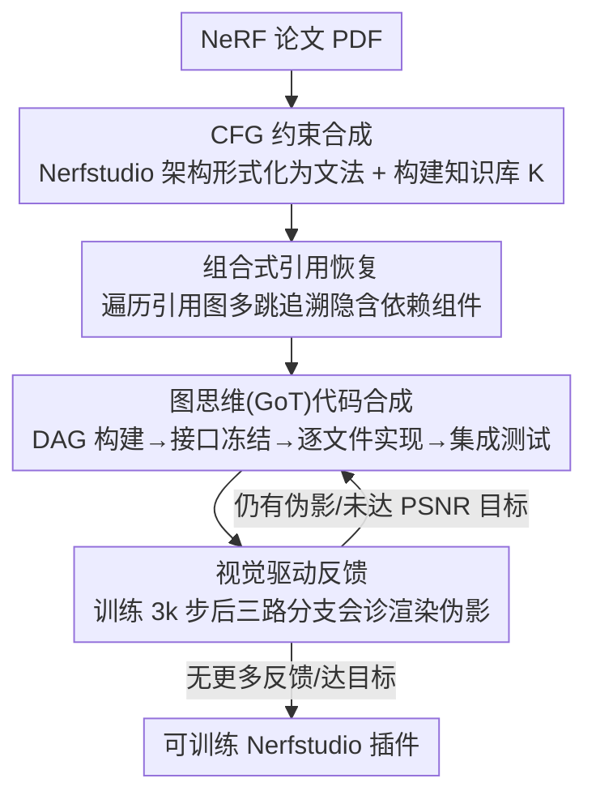

# Nerfify: A Multi-Agent Framework for Turning NeRF Papers into Code

**会议**: CVPR 2026  
**arXiv**: [2603.00805](https://arxiv.org/abs/2603.00805)  
**代码**: 即将公开  
**领域**: 3D视觉 / 代码生成  
**关键词**: NeRF, paper-to-code, multi-agent, code synthesis, context-free grammar

## 一句话总结
提出 Nerfify，一个多智能体框架，通过上下文无关文法约束、图思维代码合成和组合式引用恢复，将 NeRF 论文自动转换为可训练的 Nerfstudio 插件代码，在 30 篇论文基准上实现 100% 可执行率，视觉质量与专家实现差距仅 ±0.5 dB PSNR。

## 研究背景与动机
**领域现状**：NeRF 领域自 2020 年以来已有超过 1000 篇后续论文，但大多数缺少公开代码或标准化实现，每项后续工作都需要大量人力重新实现已有方法。

**现有痛点**：通用的 paper-to-code 系统（如 Paper2Code、AutoP2C）在 NeRF 领域严重失败——当前最佳系统 O1 在复杂论文上仅达 26.6% 准确率，且基本无法生成可训练的 NeRF 代码。GPT-5 等前沿模型也只能生成语法正确但无法收敛的代码。

**核心矛盾**：NeRF 实现要求跨体积渲染、计算机视觉和神经优化的专业知识，一个错误的激活函数或不正确的射线-球体交叉就会导致从 NaN 梯度到退化解的各种故障。更困难的是，现代 NeRF 论文具有深层的引用依赖——例如一句 "we adopt the distortion loss from [3]" 就需要追溯多篇论文提取正确实现。

**本文目标**：如何自动将 NeRF 研究论文转化为可训练、可收敛、且匹配专家实现视觉质量的标准化代码。

**切入角度**：用领域特定的多智能体框架替代通用 paper-to-code 方法，将 Nerfstudio 架构形式化为上下文无关文法来约束代码生成。

**核心 idea**：通过将 Nerfstudio 架构编码为 CFG 约束 LLM 合成、图思维拓扑有序生成多文件仓库、组合式引用恢复自动追溯依赖论文，实现 NeRF 论文到可训练代码的可靠转换。

## 方法详解

### 整体框架
Nerfify 分四阶段把 NeRF 论文转成代码：(1) CFG 约束合成，把 Nerfstudio 架构形式化为上下文无关文法（CFG）、构建知识库 $\mathcal{K}$；(2) 组合式引用恢复，遍历引用图谱多跳追溯隐含的依赖组件；(3) 图思维（GoT）代码合成，按拓扑序协调多文件仓库生成；(4) 视觉驱动反馈，用训练运行的视觉分析迭代改进实现质量。四个阶段与下面四个关键设计同序一一对应。

### 关键设计

**1. 上下文无关文法（CFG）约束合成：从构造上保证编译正确**

通用 LLM 生成的代码往往语法正确，却因缺乏领域知识而模块接线错误、数学公式实现不对。Nerfify 把 Nerfstudio 的模块组合和接口规约形式化为 CFG——仓库 $\mathcal{C} = (F, G)$，其中文件集 $F = \{f_1, f_2, \ldots, f_n\}$、$G = \text{BuildRepoDAG}(F)$ 为有向无环依赖图——LLM 在 CFG 约束下生成，从构造上保证编译正确。

**2. 组合式引用恢复：自动追溯隐含的依赖组件**

NeRF 论文本质组合性强，一篇论文可能隐含依赖数十篇论文的具体技术组件。Nerfify 构建引用依赖图 $G' = (V', E')$，对目标论文做迭代多跳检索：依赖发现→递归解析→组件提取→终止判断。例如 K-Planes 要从 7 篇直接引用和 12 篇传递依赖里提取 proposal network、hash encoder、VM 分解等组件。

**3. 图思维（GoT）代码合成：按拓扑序协调多文件生成**

NeRF 管线里配置→数据管理器→场→模型→训练管线文件间紧密耦合，单体生成容易接口不一致。Nerfify 用主合成智能体协调多个专用文件智能体分四阶段推进：DAG 构建把论文映射到 Nerfstudio 组件依赖；接口冻结按拓扑序建立 API 规约；实现阶段每个节点生成经类型签名、tensor 形状验证的代码；集成测试运行烟雾测试并自动修复。

**4. 视觉驱动反馈：用三路分支会诊渲染伪影**

代码能训练不等于渲染对。第四阶段先实际训练 3k 迭代，再由三路分支分析渲染结果：指标分支计算局部窗口 PSNR/SSIM 图、用形态学操作定位最高误差区域；几何分支实现跨视图伪影共识（Cross-View Artifact Consensus）、标记视图不一致的浮体和鬼影；语义分支用 Qwen3 VLM 分析伪影三元组、输出结构化诊断和候选补丁。迭代精修直到无更多反馈、达最大迭代次数、或达到论文报告的 PSNR 目标。

### 一个完整示例：把 K-Planes 变成可训练插件
以 K-Planes 为例：先把论文按 CFG 形式化、识别出 proposal network、hash encoder、VM 分解等待补组件；再顺引用图从 7 篇直接引用递归到 12 篇传递依赖、逐个补全这些组件的实现；然后映射成组件 DAG、冻结接口后按拓扑序逐文件合成并验证 tensor 形状、跑烟雾测试；最后训练 3k 步，三路分支会诊出低 PSNR 区域和浮体后由 VLM 生成补丁回灌，直到追平论文指标。产出一份与官方实现一致、可直接训练的 Nerfstudio 插件。

## 实验关键数据

### 主实验

| 论文 | 数据集 | 专家 PSNR↑ | Nerfify PSNR↑ | 专家 SSIM↑ | Nerfify SSIM↑ |
|------|--------|-----------|--------------|-----------|-------------|
| KeyNeRF | Blender | 25.70 | 26.12 | 0.89 | 0.90 |
| mi-MLP NeRF | Blender | 22.64 | 22.85 | 0.87 | 0.87 |
| ERS | DTU | 26.87 | 27.02 | 0.90 | 0.90 |
| TVNeRF | Blender | 26.81 | 27.30 | 0.92 | 0.92 |

所有基线 (Paper2Code, AutoP2C, GPT-5, R1) 均**无法生成可训练代码**。

### 消融实验

| 配置 | 可执行率 | 关键发现 |
|------|---------|---------|
| Nerfify (完整) | 100% | 与专家实现差距 ±0.5 dB PSNR |
| Paper2Code | 5% | 可编译但不可训练 |
| AutoP2C | 0% | 导入无法解析 |
| GPT-5 | 0% | 可编译但训练不收敛 |
| 无引用恢复 | 部分 | 缺失关键依赖组件 |
| 无视觉反馈 | 100% | 性能差距更大 |

### 关键发现
- Nerfify 在从未实现过的论文上（Set 1）也能达到与专家实现相当的视觉质量
- 对已有 Nerfstudio 实现的论文，Nerfify 生成的代码与官方仓库完全一致
- K-Planes 的引用依赖图涉及 7 篇直接依赖和总共 12 篇论文的传递依赖

## 亮点与洞察
- 首次证明领域感知的多智能体框架能可靠地将复杂视觉论文转化为可训练代码
- CFG 约束是关键——将框架的架构知识编码为形式化文法，从构造上保证代码正确性
- 组合式引用恢复解决了 NeRF 论文中普遍存在的隐含依赖问题
- 实现时间从数周缩短到数分钟，民主化了 NeRF 研究的可重现性

## 局限与展望
- 目前仅针对 Nerfstudio 框架，扩展到其他框架需要重新定义 CFG
- 依赖高质量的 PDF 解析工具（MinerU），论文中的数学公式或图表解析错误可能传播
- 视觉反馈需要实际训练 3k 迭代，计算开销非零
- 对于完全原创的、不基于已有组件的 NeRF 方法，引用恢复的帮助有限

## 相关工作与启发
- **Paper2Code/AutoP2C**：通用 paper-to-code 系统，缺乏领域特定约束
- **Scene Language**：类似地使用 CFG 约束视觉程序合成
- **Graph of Thoughts**：将推理泛化为有向图，Nerfify 将其应用于代码生成
- 启发：任何具有标准化框架的领域（如 MMDetection、HuggingFace Transformers）都可以用类似方法构建 paper-to-code 系统

## 评分
- 新颖性: ⭐⭐⭐⭐⭐ 首次实现 NeRF 论文到可训练代码的自动转换，CFG+GoT+引用恢复的组合独创
- 实验充分度: ⭐⭐⭐⭐ 30 篇论文基准，包含从未实现的论文，对比充分
- 写作质量: ⭐⭐⭐⭐ 结构清晰，四阶段分解逻辑严密
- 价值: ⭐⭐⭐⭐⭐ 极具实用价值，有望加速整个 NeRF 社区的可重现性研究

<!-- RELATED:START -->

## 相关论文

- [\[CVPR 2026\] Think, Then Verify: A Hypothesis-Verification Multi-Agent Framework for Long Video Understanding](think_then_verify_a_hypothesis-verification_multi-agent_framework_for_long_video.md)
- [\[CVPR 2026\] CarePilot: A Multi-Agent Framework for Long-Horizon Computer Task Automation in Healthcare](carepilot_a_multi-agent_framework_for_long-horizon_computer_task_automation_in_h.md)
- [\[CVPR 2026\] MMBench-GUI: A Unified Hierarchical Evaluation Framework for Multi-Platform GUI Agents](mmbench-gui_a_unified_hierarchical_evaluation_framework_for_multi-platform_gui_a.md)
- [\[ACL 2025\] METAL: A Multi-Agent Framework for Chart Generation with Test-Time Scaling](../../ACL2025/llm_agent/metal_a_multi-agent_framework_for_chart_generation_with_test-time_scaling.md)
- [\[ACL 2025\] MAM: Modular Multi-Agent Framework for Multi-Modal Medical Diagnosis via Role-Specialized Collaboration](../../ACL2025/llm_agent/mam_modular_multi-agent_framework_for_multi-modal_medical_diagnosis_via_role-spe.md)

<!-- RELATED:END -->
