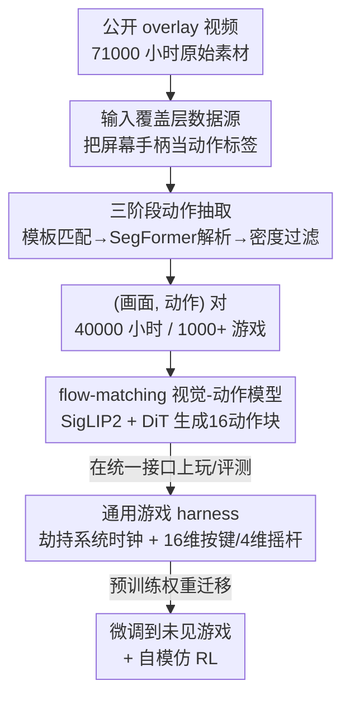

# NitroGen: An Open Foundation Model for Generalist Gaming Agents

**会议**: CVPR 2026  
**论文**: [CVF Open Access](https://openaccess.thecvf.com/content/CVPR2026/html/Magne_NitroGen_An_Open_Foundation_Model_for_Generalist_Gaming_Agents_CVPR_2026_paper.html)  
**代码**: 待开源（项目页 https://nitrogen.minedojo.org，论文承诺录用后放出数据集 / 模拟器 / 权重）  
**领域**: 通用游戏 Agent / 具身基础模型 / 视觉-动作策略  
**关键词**: 游戏 Agent, 视觉-动作模型, 行为克隆, flow matching, 互联网级数据

## 一句话总结
NitroGen 把「玩家在直播画面里叠加的手柄按键 overlay」当成天然动作标签，从 4 万小时、1000+ 款游戏的公开视频里自动抽出 (画面, 动作) 对，用 flow-matching 训练一个单一的视觉-动作 Transformer，让一个模型在 2D/3D 多种游戏里直接玩，且预训练权重微调到没见过的游戏上成功率最高相对提升 52%。

## 研究背景与动机
**领域现状**：视觉和语言模型靠「互联网规模预训练」拿到了泛化能力，但具身智能（embodied AI）一直卡在没有大规模、多样、带动作标签的数据。电子游戏是具身 AI 的理想试验场——视觉丰富、可交互、任务难度跨度大。

**现有痛点**：之前的玩游戏 AI 各有硬伤。LLM-based 方法（Voyager、Cradle）要么靠手写程序 API 读游戏内部状态、要么靠复杂感知模块抽文本和检测物体，需要大量针对单个游戏的定制；强化学习（AlphaStar、OpenAI Five）能在单个游戏超人，但智能体很窄、训练昂贵、依赖专用模拟器，而绝大多数商业游戏根本没有模拟器接口；纯像素的行为克隆（VPT）则受限于昂贵的演示数据采集，只能覆盖极少数游戏。

**核心矛盾**：要做「通用」游戏智能体就需要海量带动作标签的多游戏数据，但动作标签恰恰是最难拿的——绝大多数游戏录像只有画面、不含玩家按了什么键。规模和标签之间存在根本性的获取矛盾。

**本文目标**：(1) 用一种可扩展、几乎零标注成本的方式从公开视频里恢复动作标签；(2) 给任意商业游戏套上统一的评测接口；(3) 证明只用嘈杂的互联网数据就能行为克隆出一个跨游戏的通用策略。

**切入角度**：作者注意到速通（speedrun）和不少动作游戏的主播会在画面角落叠加一个实时手柄可视化（input overlay）——按下哪个键、摇杆推到哪，屏幕上都画出来了。这块 overlay 本身就是「动作的图像化标注」，只要把它从画面里解析出来，就等于免费拿到了动作标签。

**核心 idea**：把屏幕上的手柄 overlay 当成动作标签源，自动解析出按键和摇杆状态，从而把行为克隆扩展到互联网级别的多游戏视频上。

## 方法详解

### 整体框架
NitroGen 由三个相互衔接的部件构成：① 一个互联网级、带动作标签的多游戏视频数据集（靠解析 overlay 得到标签）；② 一个能给任意商业游戏套上 Gymnasium API 的通用 harness，并在其上定义统一的观测-动作空间和多游戏评测套件；③ 一个用大规模行为克隆训练的视觉-动作模型（flow matching 生成未来动作块）。整条管线是「视频 → 自动抽动作 → 质量过滤 → 行为克隆训练 → 在统一 harness 上评测/微调」。

### 关键设计

**1. 输入覆盖层数据源：把屏幕上的手柄 overlay 当成天然动作标签**

行为克隆要的是 (观测, 动作) 对，可互联网上的游戏录像几乎只有画面、没有玩家输入，这正是把行为克隆做大的最大障碍。作者发现一类公开视频自带答案：玩家用 input overlay 软件（Open Joystick Display、Input Overlay、GamePad Viewer 等）在画面角落实时渲染一个 2D 手柄图，按下的键高亮、摇杆位置同步移动。这块 overlay 等价于「动作的逐帧图像化标注」，只要能把它从画面里识别并解析出来，就等于免费拿到了动作标签。这种数据源天然规模可扩展——overlay 视频虽只占一小部分，但足够多，作者据此爬到 71,000 小时原始素材；为避免单个热门游戏过度占比，用关键词搜索 + 按内容多样性筛选，覆盖不同游戏、题材和水平的玩家。和 VPT（靠逆动力学在 Minecraft 上标 7 万小时，但只限一个游戏）、teleoperation 机器人数据集（昂贵、规模受限）相比，这条路几乎零标注成本且天生跨上千款游戏。

**2. 三阶段动作抽取流水线：从 overlay 图像精确恢复按键与摇杆**

光知道「答案画在屏幕上」还不够，得把它可靠地解析出来——不同主播的手柄类型（Xbox/PlayStation/其他）、透明度、视频压缩伪影千差万别。作者用三阶段流水线解决。**阶段一·模板匹配**定位手柄区域：准备约 300 个常见手柄模板，对每段视频采样 25 帧，用 SIFT 和 XFeat 特征与所有模板做特征匹配，估计仿射变换并要求至少 20 个内点才算有效，取匹配分最高的区域作为手柄位置并裁剪出来。**阶段二·动作解析**用微调过的 SegFormer：输入两帧连续画面（沿空间维拼接以捕捉短时动态），输出一张分割掩码把摇杆定位到离散的 $11\times11$ 网格上，再加二值化的按键状态——作者实测「用分割掩码估计摇杆位置」明显优于「直接回归摇杆坐标」。这个解析模型靠合成数据训练：从训练集采帧、用三种 overlay 软件程序化叠加手柄模板，每个模板随机按键和摇杆位置、并随机改透明度/手柄尺寸/压缩程度模拟真实伪影，共造出 8M 标注帧。推理时对整段视频检测每个摇杆的轮廓，用所有「被判为居中」帧的平均求出中心，再用 99 百分位归一化到 $[-1,1]$ 抑制离群点。**阶段三·质量过滤**解决一个具体毛病：直接用 71,000 小时会让模型像 VPT 那样过度预测「空动作」，于是按动作密度过滤——只保留「至少 50% 时间步有非零按键或摇杆动作」的片段，最终留下 55% 的数据（约 4 万小时），并把屏幕上的手柄 overlay 涂掉，防止模型偷看 overlay 当捷径。

**3. 通用游戏 harness 与统一观测-动作空间：让任意商业游戏都能被一个策略驱动**

商业游戏几乎都没有 Gymnasium 那样的程序化控制接口，没接口就没法做逐帧的训练/评测。作者写了一个通用 harness：劫持游戏引擎的系统时钟来控制仿真时间，从而在不改游戏代码的前提下实现逐帧交互——只要游戏用系统时钟驱动物理和交互（这是常见做法）就适用（作者验证频繁暂停/恢复不改变游戏物理）。在此之上定义统一接口：观测是单张 RGB 帧；动作是标准化的 16 维二值向量（4 个方向键、4 个面板键、2 肩键、2 扳机、2 摇杆按下、start、back）加 4 维连续的摇杆位置。和「为每个游戏/任务定义专属动作空间」的旧做法不同，这套统一布局让同一个策略能直接跨游戏迁移。评测套件覆盖 10 款游戏、30 个任务（5 款 2D、5 款 3D），按 11 个战斗、10 个导航、9 个游戏专属三类划分，成功率由人工评估。

**4. flow-matching 视觉-动作模型：用扩散式动作块生成做单帧反应式控制**

策略本身要把「当前画面」映射成「接下来的动作」。NitroGen 借鉴生成式建模和机器人领域，用 **flow matching** 在视觉观测条件下生成未来动作块，架构改自 GR00T N1、去掉语言和状态编码器、只留单个动作头。$256\times256$ 的 RGB 帧经 SigLIP 2 ViT 编码成 256 个图像 token；动作侧用 DiT（diffusion transformer）一次前向生成多个动作：带噪声的动作块先经 MLP 编码成「每个时间步一个动作 token」，再过若干交替「自注意力 + 交叉注意力」的 DiT 块，交叉注意力把动作生成条件在图像 token 上，最后用一个沿时间维独立作用的 MLP 把动作 token 解码成连续动作向量。训练用标准条件 flow-matching 目标，作用在 16 个动作的块上、配单帧 $256\times256$ 上下文；推理走对应去噪过程、$k=16$ 步。一个有意思的设计取舍：作者发现即使加大时间间隔，用多于一帧的历史也没有收益，因为这些动作游戏的初始状态已经提供了足够上下文，于是只用单帧上下文 + 生成 16 动作块（比逐动作生成时间一致性更好）。这也决定了模型的定位——一个 system-1 式的快速反应感知模型，而非长程规划器。

### 损失函数 / 训练策略
用标准条件 flow-matching 目标训练，作用于 16 动作块、单帧上下文。图像增强包括随机亮度/对比度/饱和度/色调、$-5^\circ\sim5^\circ$ 随机旋转、随机裁剪。优化器 AdamW（weight decay 0.001），用 warmup-stable-decay (WSD) 学习率调度（恒定阶段 lr 0.0001，可不设固定预算地训更久），并维护衰减 0.9999 的 EMA 权重——所有结果都用 EMA 权重，作者发现它稳定优于非 EMA。动作解析的 SegFormer 单独训练：AdamW、lr 0.0001、线性衰减、weight decay 0.1、batch 256。

## 实验关键数据

### 主实验
动作抽取流水线本身先要够准。作者用 OBS 录 6 款游戏、随机化透明度/手柄尺寸/类型来模拟真实条件，逐帧对比真值。

| 评测对象 | 指标 | 结果 |
|----------|------|------|
| 摇杆位置抽取 | $R^2$ score | 0.84 |
| 按键状态抽取 | 逐帧准确率 | 0.96 |

500M 模型在整套数据上预训练后、**不做任何针对性微调**直接评测，跨视觉风格（3D / 2D 俯视 / 2D 横版）都能完成非平凡任务（每款游戏 3 个任务 × 5 次 rollout 的平均完成率）：

| 视觉风格 | 战斗 | 导航 | 游戏专属 |
|----------|------|------|----------|
| 3D | 61.2% | 55.0% | 56.3% |
| 2D 俯视 | 46.0% | 52.0% | 61.5% |
| 2D 横版 | 44.8% | 37.9% | 54.0% |

作者强调这套数据噪声很大（overlay 软件有延迟、解析有误差；画面常有直播弹幕/订阅提示/进度条；不同玩家灵敏度和按键映射不同会改变同一输入的语义），但预训练仍得到一个鲁棒的多游戏策略；且在「可记忆的固定布局」和「程序生成、每局唯一」两类任务上表现没有显著差异，说明模型既能利用记忆也能适应未见场景。

### 迁移 / 微调实验
留出一款游戏不参与预训练，再用少量数据微调，与「相同架构、相同数据和算力从头训」对比。

| 设置（3D action-RPG, 30h, 按任务类型相对提升） | 微调 vs 从头 | 相对提升 |
|------|------|---------|
| 战斗 Combat | 73.3% vs 48.3% | +52% |
| 导航 Navigation | 60.0% vs 48.0% | +25% |
| 游戏专属 Game-specific | 66.6% vs 63.3% | +5% |

| 设置（等距 roguelike, 按数据量, 完成率） | 微调 | 从头 |
|------|------|------|
| 60h | 53.0% | 48.1% |
| 120h | 65.6% | 57.8% |
| 240h | 81.0% | 76.0% |

等距 roguelike 平均相对提升约 10%，3D action-RPG 约 25%（差异源于训练分布里 3D action-RPG 更常见）。预训练对「战斗、导航」这类通用技能迁移收益大，对游戏专属机制收益很小（+5%），说明它学到的是可迁移的通用玩法模式，专属机制仍需在新环境上针对性训练。

### 自模仿 RL 实验
在一款 2D 类银河恶魔城游戏的「第一个 boss」上（boss 行为非确定、约 2 分钟一次、无法靠记忆），把当前模型的最佳 rollout 混回训练数据做多轮自模仿：

| 设置 | 成功率 |
|------|--------|
| 基础模型 | 18.7% |
| 仅用原始 BC 数据微调 50K 步 | 30.1% |
| 1 轮自模仿 | 53.9% |
| 3 轮自模仿 | 90.5% |

### 关键发现
- **动作解析靠分割而非回归**是个关键经验：把摇杆位置预测成 $11\times11$ 网格上的分割掩码，明显优于直接回归坐标，这条让整条免标注数据管线得以成立。
- **质量过滤是必需的**：不过滤就会像 VPT 一样过度预测空动作；按动作密度只留 55% 数据反而训出更鲁棒的策略，说明「数据量」不如「动作密度」重要。
- **多帧历史没用**：单帧上下文就够，因为这些动作游戏的初始视觉状态已能决定下一步——这把模型钉死在 system-1 反应式定位上。
- **自模仿的提升不是单纯多见数据**：同样 50K 步，纯 BC 只到 30.1%，1 轮自模仿到 53.9%，证明收益来自「拿自己的好轨迹再训」而非额外曝光，3 轮到 90.5% 说明 NitroGen 很适合像素级 RL 适配。

## 亮点与洞察
- **把「标注」转化成「感知问题」**：动作标签难拿，作者没去标注，而是发现一类视频自带把动作画在屏幕上的 overlay，于是「拿到动作标签」变成「从画面里解析 overlay」——这是一个非常巧妙的数据视角转换，几乎零成本拿到 4 万小时跨上千游戏的动作标签。
- **统一观测-动作空间 + 系统时钟 harness**：用单 RGB 帧 + 16 维按键/4 维摇杆的统一接口，配上「劫持系统时钟、不改游戏代码」的通用 harness，把任意商业游戏纳入同一个可训练/可评测的框架，这套工程基建本身就是可复用的资产。
- **flow-matching 动作块用到游戏上**：把机器人领域成熟的「flow matching 生成动作块」迁到像素游戏控制，且实证单帧上下文 + 16 动作块比逐动作生成时间一致性更好，是一条干净的 system-1 策略设计。
- 「分割优于回归」「动作密度过滤优于堆数据量」这两条经验可迁移到任何「从嘈杂视频里恢复结构化标签」的任务。

## 局限与展望
- **定位是 system-1 反应模型**（作者自承）：不做端到端通关、不做长程规划、不跟语言指令，只能在视觉上下文足够清晰时玩几秒钟，也不是为未见游戏的鲁棒零样本设计。要零样本需进一步研究（如让模型在上下文里学游戏物理和按键语义）。
- **数据分布偏向手柄动作游戏**（作者自承）：数据偏 action 类、且偏「用手柄玩」的游戏；纯键盘游戏或需要复杂操作的游戏代表性不足，可能限制对策略/模拟类（更依赖规划和键盘输入）游戏的泛化。
- **评测依赖人工**：成功率全靠人工评估，30 个任务规模虽不小，但缺乏自动化指标会让大规模 scaling 实验成本高、可复现性受限。
- **标签本身有噪声**：overlay 软件有延迟、解析有误差，按键映射/灵敏度差异会改变同一输入的语义，论文虽然证明「带噪也能训」，但没有量化噪声对最终策略上限的影响。

## 相关工作与启发
- **vs VPT [3]**：VPT 用逆动力学模型标注 7 万小时数据，但只限 Minecraft 单一游戏；NitroGen 改用「屏幕 overlay 即标签」，把行为克隆扩展到 1000+ 款游戏，是「单游戏深耕」到「跨游戏广度」的转向。
- **vs 强化学习路线（AlphaStar / OpenAI Five / Dreamer 3）**：它们能单游戏超人但依赖工程化奖励和专用模拟器，智能体很窄；NitroGen 走纯像素行为克隆 + 通用 harness，牺牲单游戏峰值换跨游戏通用性和可扩展性。
- **vs LLM-based agent（Voyager / Cradle）**：它们靠结构化 API 或复杂感知做高层推理，需大量定制；NitroGen 直接从像素到动作端到端映射，去掉语言条件，专注可扩展的视觉-动作。
- **vs VLA 模型 / GR00T N1**：NitroGen 架构改自 GR00T N1 但去掉语言和状态编码器，区别在于丢弃语言条件、专注用多样游戏数据做可扩展的视觉-动作映射。
- **vs Game-TARS [62]（并行工作）**：同样训多游戏 agent，但 Game-TARS 结合 contractor 和多模态推理数据（>2 万小时）；NitroGen 走纯 overlay 内容自动标注的更可扩展数据源。

## 评分
- 新颖性: ⭐⭐⭐⭐⭐ 「屏幕 overlay 即动作标签」是个让人拍案的数据视角，几乎零成本解锁互联网级多游戏动作数据。
- 实验充分度: ⭐⭐⭐⭐ 抽取精度、跨游戏零微调、迁移微调、自模仿 RL 四组实验都做了，但成功率全靠人工评测、缺自动化指标，规模上略受限。
- 写作质量: ⭐⭐⭐⭐ 三部件结构清晰、动机和取舍交代到位；部分关键数学细节推给补充材料。
- 价值: ⭐⭐⭐⭐⭐ 开源数据集 + 模拟器 + 权重，为通用游戏/具身 agent 提供了可扩展的数据获取范式和基建，社区价值高。

<!-- RELATED:START -->

## 相关论文

- [\[CVPR 2026\] RetouchIQ: MLLM Agents for Instruction-Based Image Retouching with Generalist Reward](retouchiq_mllm_agents_for_instruction-based_image_retouching_with_generalist_rew.md)
- [\[AAAI 2026\] AutoGLM: Autonomous Foundation Agents for GUIs](../../AAAI2026/llm_agent/autoglm_autonomous_foundation_agents_for_guis.md)
- [\[ICLR 2026\] AgentSynth: Scalable Task Generation for Generalist Computer-Use Agents](../../ICLR2026/llm_agent/agentsynth_scalable_task_generation_for_generalist_computer-use_agents.md)
- [\[CVPR 2026\] SceneAssistant: A Visual Feedback Agent for Open-Vocabulary 3D Scene Generation](sceneassistant_a_visual_feedback_agent_for_openvoc.md)
- [\[CVPR 2026\] Seeing as Experts Do: A Knowledge-Augmented Agent for Open-Set Fine-Grained Visual Understanding](seeing_as_experts_do_a_knowledge-augmented_agent_for_open-set_fine-grained_visua.md)

<!-- RELATED:END -->
