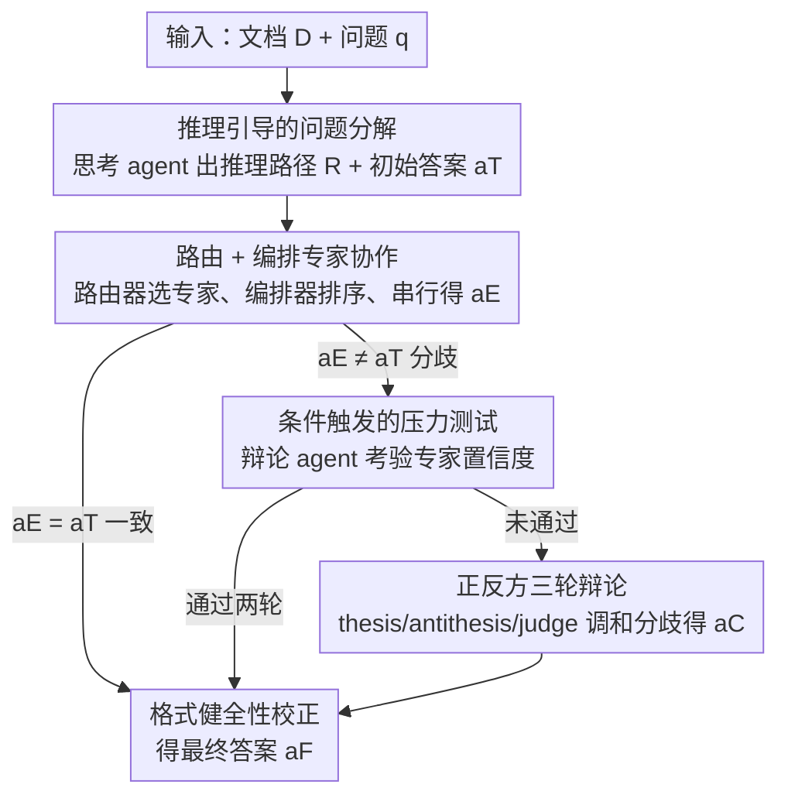

# ORCA: Orchestrated Reasoning with Collaborative Agents for Document Visual Question Answering

**会议**: CVPR 2026  
**论文**: [CVF Open Access](https://openaccess.thecvf.com/content/CVPR2026/html/Lassoued_ORCA_Orchestrated_Reasoning_with_Collaborative_Agents_for_Document_Visual_Question_CVPR_2026_paper.html)  
**代码**: https://github.com/AymenLass/ORCA  
**领域**: Agent / 多模态文档理解  
**关键词**: DocVQA、多智能体、推理引导路由、对抗式验证、条件激活

## 一句话总结
ORCA 把单页文档问答（DocVQA）做成一条五阶段多智能体流水线——先用思考 agent 把问题拆成推理路径，再按内容类型路由并编排九个专精 agent 作答，仅在专家答案与思考答案不一致时才触发压力测试与正反方辩论验证，最后做格式校正——在三个文档理解基准上几乎全面超越单模型 SOTA，且辩论只在 8.3% 的样本上激活、把算力集中在真正存疑的难例上。

## 研究背景与动机
**领域现状**：单页 DocVQA 要求模型读懂含文本、表格、图表、表单、手写体的"视觉富文档"并完成多步推理。主流做法要么是 LayoutLM/Donut 这类专用多模态 transformer，要么是 Qwen3-VL、InternVL、GLM-4.5V 等通用 VLM 直接读图作答。

**现有痛点**：作者指出现有方法有三个具体短板。其一，**用单个模型包打天下**——一个问题若涉及"带手写批注的表格"，同时需要结构化数据抽取和 OCR/HTR 能力，通用模型对这种异质信息源处理得很不稳。其二，**直接吐答案、不暴露推理**，缺乏规划与可解释性；即便加了 CoT，也仍是单模型串所有推理步，没有内容感知的专精分工、没有自我验证、没有按文档成分自适应选择 agent。其三，**缺迭代精炼与交叉验证**，模型常在没有充分置信度评估的情况下给答案，可靠性不足。

**核心矛盾**：文档问题的**异质性**（不同成分需要不同专长）与单模型的**同质处理**之间存在根本错配；而无差别地给所有样本加重型验证又会带来不可接受的算力开销。

**本文目标**：拆成三个子问题——(1) 如何把复杂问题分解并按文档成分路由给合适专家；(2) 如何让专家间有序协作、信息流动；(3) 如何在不爆算力的前提下，仅对真正存疑的预测做对抗式验证。

**切入角度**：作者观察到「显式推理可以引导 agent 选择」「顺序编排可让专家间传递信息」「辩论机制可调和思考者与专家的分歧」，于是把这三点串成一条带条件激活的协作流水线。

**核心 idea**：用「推理引导的动态路由 + 专家顺序编排 + 条件触发的对抗验证」替代「单模型直接作答」，把专精分工和自我验证统一进一个框架，并靠条件激活把验证开销压到最低。

## 方法详解

### 整体框架
给定单页文档 $D$ 和自然语言问题 $q$，ORCA 走一条五阶段流水线产出答案 $a$。**阶段 1** 思考 agent 把问题拆成推理路径 $R$ 并给出初始答案 $a_T$；**阶段 2** 路由器按推理路径决定激活哪些专家、编排器决定执行顺序，串行产出专家答案 $a_E$；**阶段 3** 当 $a_E \neq a_T$ 时触发压力测试，辩论 agent 出难题考验专家置信度；**阶段 4** 若压力测试显示不确定，则启动正方/反方/裁判的三轮结构化辩论得 $a_C$；**阶段 5** 健全性检查器做格式校正得最终答案 $a_F$。关键在于阶段 3/4 是**条件激活**的——大多数样本在思考者与专家答案一致时直接跳到阶段 5。

### 关键设计

**1. 推理引导的问题分解 + 答案掩码：用结构化推理路径指挥下游、又防确认偏置**

针对「单模型直接吐答案、不规划」的痛点，阶段 1 用具备思考能力的 GLM-4.5V-9B 作为思考 agent $A_{think}$，联合分析问题与文档图像，产出两样东西：一条把问题拆成逻辑步的**推理路径** $R = \{r_1, r_2, \dots, r_n\}$，和一个**初始答案** $a_T$，即 $(R, a_T) = A_{think}(q, D)$。比如问"Q3 总营收是多少"，$R$ 可能是"定位季度营收表→找 Q3 列→抽取总营收值"。这条 $R$ 既指导后续 agent 选择与编排，又有一个巧妙之处：当它把答案传给最后一个专家时，会做**答案掩码**——若初始答案 $a_T$ 在推理步里出现频次超过阈值 $\tau$，就把所有出现处掩掉，记为 $R^*$，最后专家用 $a_E = \sigma_n(q, D, a_{n-1}, R^*)$ 作答。这样设计是为了**防止确认偏置**：不掩码会让专家盲从思考者答案，消融显示掩码带来 +0.7/+0.4 的稳定提升（见下表）。这是 ORCA 与普通 CoT/工具调用的关键区别。

**2. 推理引导的动态路由（Turbo DFS）+ 顺序编排：把异质问题分发给九个专精专家并让它们串行接力**

针对「单模型处理异质成分不稳」的痛点，阶段 2 维护一个含**九类专精 agent** 的 agent dock：$A_{ocr}$（手写/难辨文本）、$A_{table}$（表格/列表）、$A_{figure}$（图表）、$A_{layout}$（版面）、$A_{form}$（表单）、$A_{text}$（自由文本）、$A_{image}$（照片）、$A_{yesno}$（是非题）、$A_{other}$（其他），均由 Qwen3-VL-8B 变体按任务微调。路由器 $A_{route}$（基座 Qwen2.5-VL-7B）把"该激活哪些专家"建模成**九标签多标签分类**，输出二元激活向量 $v \in \{0,1\}^9$，$v = A_{route}(q, D, R)$，激活集 $A_{active} = \{A_i \mid v_i = 1\}$。关键创新是**不走 sigmoid 阈值**，而把路由当成受约束生成任务，用 **Turbo DFS（带分数引导剪枝的深度优先搜索）** 解码、再对排名候选取并集得到最终激活集——这与 Visual ChatGPT/HuggingGPT 的手工路由规则形成对比。编排器再给激活的 $n$ 个专家定执行顺序 $\sigma = (\sigma_1, \dots, \sigma_n)$，专家**串行接力**：每个专家拿到前一个的答案 $a_i = \sigma_i(q, D, a_{i-1})$，让信息在专家间流动而非各自孤立作答。

**3. 条件触发的两级对抗验证：只在真正存疑时才花算力辩论**

针对「无差别加验证太贵、不加又不可靠」的矛盾，ORCA 把验证设计成**条件激活**的两级机制。第一级**压力测试（阶段 3）**仅在专家答案与思考答案不一致（$a_E \neq a_T$）时启动：辩论 agent $A_{debate}$ 据 $(q, D, a_E)$ 生成刁难性追问 $q_{debate}$，专家给出回应并可能修正答案，评估 agent $A_{eval}$ 做 pass/fail 二元判定，连考两轮；两轮都过则采纳 $a_E$ 直接进阶段 5，否则进第二级。第二级**多轮辩论（阶段 4）**引入正方 $A_{thesis}$（与专家同基座，捍卫 $a_E$）、反方 $A_{anti}$（InternVL3-8B-hf，生成替代答案 $a_{alt}$ 并反驳）、裁判 $A_{judge}$（LLM）。反方按 [REFERENCE]/[CRITICISM]/[CONCLUSION] 三段式发言，正方只收到证据与批评、需为自己辩护，裁判每轮判断是否有人被说服、生成摘要、三轮无果则做语言学分析判定谁更自信，得 $a_C$。这套条件激活的统计很说明问题：阶段 3 只在 23.4% 的样本激活，其中 35.7% 失败进入阶段 4，最终**多轮辩论仅在 8.3% 的样本上发生**——把重型算力精准砸在真正存疑的难例上。最后阶段 5 健全性检查器 $A_{sanity}$ 只做格式对齐（补空格、调标点），$a_F = A_{sanity}(q, D, a_{prev})$。

## 实验关键数据

作者在 Single-Page DocVQA、InfographicsVQA、OCRBench-v2(en) 三个基准上评测（DocVQA/InfoVQA 报 ANLS，OCRBench-v2 用官方八子任务多维评测的均值），全套在 4×L4 GPU（96GB 显存）上跑。

### 主实验
ORCA 在不同基座上一致超越单模型基线，且**越是需要复杂推理/跨模态的基准、增益越大**。

| 基准 | 单模型基线(Qwen3VL-8B) | ORCA(Qwen3VL-8B) | 提升 |
|------|----------------------|------------------|------|
| DocVQA (ANLS) | 96.1 | 97.2 | +1.1（相对误差降 28.2%：3.9%→2.8%） |
| InfographicVQA (ANLS) | 83.1 | 88.0 | +4.9 |
| OCRBench-v2 (avg) | 65.4 | 67.1 | +1.7 |
| ChartQA | 85.7 | 90.1 | +4.4（图表/数值推理泛化） |
| VQAv2 | — | — | +4.7（通用 VQA 泛化） |

跨三种基座看，**模型越小、增益越大**：OCRBench-v2 上 Qwen2.5-VL-7B 涨 +3.6、而 Qwen3VL-8B 只涨 +1.7，说明多智能体协作主要靠专精分工**补偿小模型的能力缺口**。增益还集中在 Understanding、Reasoning、Spotting 这些最吃结构化推理与模态专精的子任务上，正中 ORCA 设计目标。

### 消融实验
阶段级消融（基座 Qwen3VL-8B）清楚地分出"核心组件"与"精炼组件"：

| 配置 | DocVQA | InfoVQA | OCRBench-v2 | 说明 |
|------|--------|---------|-------------|------|
| ORCA (Full) | 97.2 | 88.0 | 67.1 | 完整流水线 |
| w/o 阶段1（推理） | 96.5 (-0.7) | 84.9 (-3.1) | 66.1 (-1.0) | 缺任务分解，InfoVQA 掉最多 |
| w/o 阶段2（专家协作） | 96.3 (-0.9) | 84.1 (-3.9) | 66.0 (-1.1) | 掉点最大，逼近基线 |
| w/o 阶段3（压力测试） | 97.0 (-0.2) | 87.5 (-0.5) | 66.9 (-0.2) | 增益小 |
| w/o 阶段4（多轮辩论） | 96.9 (-0.3) | 87.2 (-0.8) | 66.7 (-0.4) | 增益小 |
| w/o 阶段5（格式校正） | 97.1 (-0.1) | 87.9 (-0.1) | 67.0 (-0.1) | 仅修格式 |
| w/o 阶段2–5（=单模型） | 96.2 (-1.0) | 84.1 (-3.9) | 65.6 (-1.5) | 退化到基线附近 |

另有答案掩码消融：关掉推理路径掩码后 DocVQA/InfoVQA/OCRBench-v2 从 97.2/88.0/67.1 降到 96.5/87.6/66.4（-0.7/-0.4/-0.7），印证掩码确实在压制确认偏置。

### 关键发现
- **阶段 2（专家协作）是绝对核心**：去掉它性能直接逼近单模型基线（InfoVQA 88.0→84.1），证明多智能体专精分工才是架构创新的主心骨；阶段 1（推理）次之，提供必要的任务分解。
- **验证阶段贡献小但有的放矢**：阶段 3/4/5 单独只贡献 0.1–0.8 点，但这是**条件激活**的必然结果——多轮辩论仅在 8.3% 样本上发生，平均贡献自然小，价值在于专门兜住"思考者与专家真分歧"的难例。
- **延迟-精度权衡可控**：得益于 vLLM 加速（约 5×）、思考者与专家一致时的提前终止（77% 样本只走阶段 1–2）、跨阶段复用基座，提前终止模式下延迟 2.9–4.5s（基线 0.3–0.8s）、已能拿 +2~3% 增益；完整流水线 9.6–13.1s 用于精度敏感场景。

## 亮点与洞察
- **"条件激活"把重型验证变得经济**：辩论只在 8.3% 样本上发生，等于把对抗验证的算力精准投在真正存疑处——这个"按需付费"的思路可迁移到任何"验证昂贵但只有少数样本需要"的场景（如多步数学推理、代码生成自检）。
- **答案掩码防确认偏置是个小而巧的设计**：让推理路径指导专家、又不把答案直接喂给专家，避免下游盲从，+0.7 的稳定增益证明"信息要给得恰到好处"。
- **小模型受益更大的实证**：多智能体协作在 7B 模型上增益（+3.6）明显大于 8B（+1.7），暗示"用编排补能力"可能是比"无脑堆参数到 100B+"更省的路线——作者也明确把 ORCA 定位成"靠结构化编排而非暴力扩参提升推理质量"的算力高效替代方案。

## 局限与展望
- **作者承认/可见的局限**：完整流水线延迟是单模型的 10~16×，重型验证场景成本不低；框架组件极多（思考者 + 9 专家 + 路由 + 辩论 + 正反方 + 评估 + 裁判 + 健全检查），工程复杂度与可复现门槛高，且各 agent 用了 GLM-4.5V/Qwen3-VL/InternVL/Qwen3 等异构基座。
- **自己发现的局限**：增益在已近饱和的 DocVQA 上仅 +0.8%（低误差区），主要红利集中在 InfoVQA/OCRBench 这类高难基准；只针对**单页**文档，多页/超长文档的协作与信息流未涉及；Turbo DFS 路由、阶段激活率等关键细节多放在补充材料，正文不够自足（⚠️ 细节以原文/补充为准）。
- **可改进方向**：把条件激活阈值做成可学习/可校准的，或用更轻的统一基座替代异构 agent 以降部署成本；将"推理 trace + 路由决策"作为监督信号回流训练（作者已提及）以摊薄长期算力。

## 相关工作与启发
- **vs Visual ChatGPT / HuggingGPT**：它们用语言模型当控制器、靠**手工路由规则**编排视觉/语言模块；ORCA 训了一个专门做文档类型路由的 VLM、用 Turbo DFS 受约束生成代替手工规则，路由更自适应。
- **vs CoT / 工具调用（ReAct、Reflexion）**：这些仍是单模型串所有推理步、缺内容感知专精与自我验证；ORCA 的推理路径掩码显式防确认偏置，并按内容类型分发给九个专家。
- **vs 普遍的辩论/验证方法**：多数无差别地对所有样本上验证；ORCA 用条件激活只在 8.3% 样本辩论，把开销集中在真正存疑处，是"可靠性 vs 算力"权衡上的更优解。

## 评分
- 新颖性: ⭐⭐⭐⭐ 推理引导路由 + Turbo DFS 受约束生成 + 答案掩码 + 条件激活验证的组合在 DocVQA 多智能体里有新意，但单个机制（多 agent、辩论、CoT）多有前身。
- 实验充分度: ⭐⭐⭐⭐⭐ 三基准 + 三基座 + 阶段级/掩码消融 + 延迟分析 + ChartQA/VQAv2 泛化，论证扎实。
- 写作质量: ⭐⭐⭐⭐ 五阶段流水线讲得清楚、消融与激活率分析到位，但 Turbo DFS、路由训练等细节甩给补充材料。
- 价值: ⭐⭐⭐⭐ 在多个文档理解基准刷到 SOTA，且"条件激活省算力"的范式对成本敏感的多智能体系统有借鉴意义。

<!-- RELATED:START -->

## 相关论文

- [\[CVPR 2026\] Resolving Evidence Sparsity: Agentic Context Engineering for Long-Document Understanding](resolving_evidence_sparsity_agentic_context_engineering_for_long-document_unders.md)
- [\[AAAI 2026\] COVR: Collaborative Optimization of VLMs and RL Agent for Visual-Based Control](../../AAAI2026/llm_agent/covrcollaborative_optimization_of_vlms_and_rl_agent_for_visu.md)
- [\[ACL 2025\] A Multi-Agent Framework for Mitigating Dialect Biases in Privacy Policy Question-Answering Systems](../../ACL2025/llm_agent/multi_agent_dialect_bias_privacy_qa.md)
- [\[ICML 2025\] KBQA-o1: Agentic Knowledge Base Question Answering with Monte Carlo Tree Search](../../ICML2025/llm_agent/kbqa-o1_agentic_knowledge_base_question_answering_with_monte_carlo_tree_search.md)
- [\[CVPR 2026\] ReFAct: Empowering Multimodal Web Agents with Visual and Context Focusing](refact_empowering_multimodal_web_agents_with_visual_and_context_focusing.md)

<!-- RELATED:END -->
