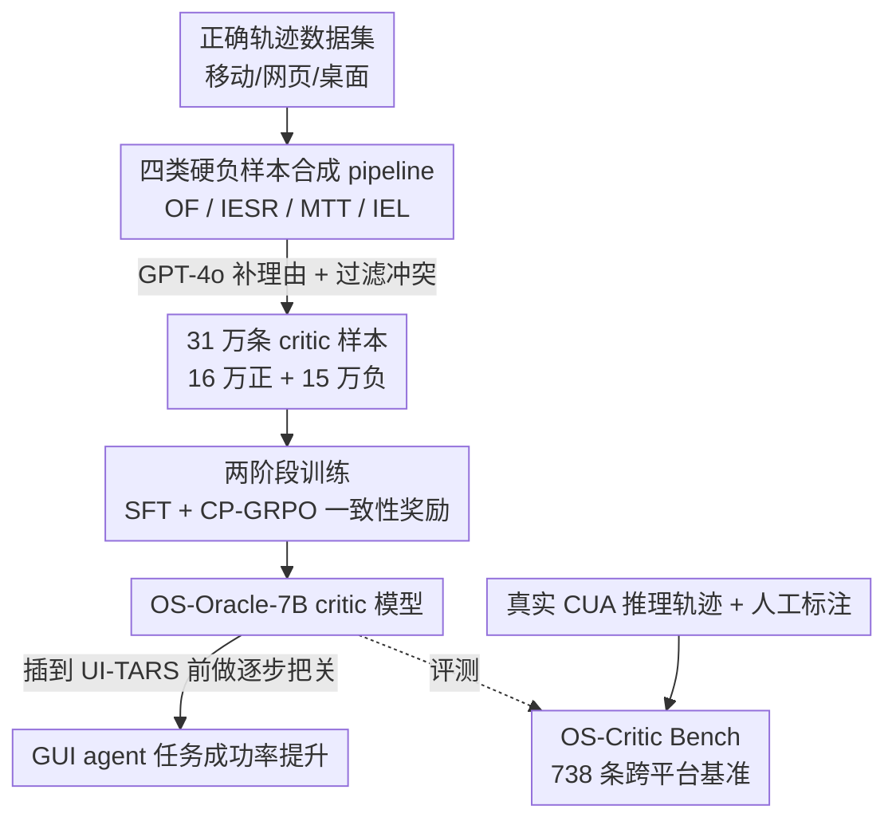

# OS-Oracle: A Comprehensive Framework for Cross-Platform GUI Critic Models

**会议**: CVPR 2026  
**论文**: [CVF Open Access](https://openaccess.thecvf.com/content/CVPR2026/html/Wu_OS-Oracle_A_Comprehensive_Framework_for_Cross-Platform_GUI_Critic_Models_CVPR_2026_paper.html)  
**代码**: https://github.com/numbmelon/OS-Oracle  
**领域**: Agent  
**关键词**: GUI Agent, Critic Model, 硬负样本合成, GRPO, 跨平台基准

## 一句话总结
针对"看屏幕操作电脑"的 GUI agent 缺乏可靠的逐步判错器这一痛点，OS-Oracle 用一条从正样本轨迹自动伪造四类典型错误动作的数据流水线造出 31 万条 critic 样本，再用 SFT + 一致性保持的 CP-GRPO 两阶段训练出 7B critic 模型，并配套首个覆盖移动/网页/桌面的人工标注 critic 基准 OS-Critic Bench，开源模型里拿到 SOTA 并能实测提升 UI-TARS 的任务成功率。

## 研究背景与动机
**领域现状**：VLM 驱动的 computer-using agent（CUA）已经能看着屏幕截图自己点按钮、填表单、完成多步任务。但在长程工作流里，一步错就会层层累积，有些动作（如删除、提交）还不可逆。一个自然的解法是给 agent 配一个 **critic 模型**：在每一步动作执行前，先判断这个动作对不对、要不要重来。相比直接用 RL 去优化 agent 本体（reward 难设计、要海量真实环境交互、贵），critic 是更便宜、更可扩展的路线——它可以基于小 VLM 训练，然后插到各种 agent 前面用，不用反复重训。

**现有痛点**：critic 模型目前发展不起来，卡在两个数据缺口上。其一是**缺训练数据**，尤其缺高质量负样本：公开的 GUI 轨迹几乎全是专家正确演示，天然没有错误样本；而想从 CUA 自己跑出来的轨迹里挑出"哪一步错了"又极难——成功的轨迹里也夹杂大量冗余步，失败的轨迹里又难精确定位到底哪步是元凶，单靠最终任务成败来判断每一步对错非常不可靠。其二是**缺评测基准**：已有的 critic benchmark 要么从开源数据搭建、有数据泄漏风险，要么只覆盖单一平台（仅 web 或仅 desktop）。

**核心矛盾**：训练 critic 需要大量"带正确标签的错误动作"，但真实轨迹里既难找又难标，而硬靠人工或靠 GPT 判对错噪声又大。

**本文目标**：搭一套端到端全栈框架，把 critic 的"造数据 → 训模型 → 做评测"三件事一次性解决，且要跨移动/网页/桌面三平台通用。

**切入角度**：与其去判断真实轨迹里哪步错（难），不如反过来——**从正确步骤主动伪造错误**。作者先归纳 CUA 实际会犯的四类典型错误，再用规则把一个正确动作改造成对应的错误动作，这样负样本的"错误类型 + 原因"天然已知，标注和质量控制都好做。

**核心 idea**：用"正样本 → 规则化注错"的可控合成代替"从失败轨迹挖错误"，再用一致性奖励让 critic 的判断和它给的理由不打架。

## 方法详解

### 整体框架
OS-Oracle 是一条三段式全栈流水线。输入是已有的 GUI 任务轨迹数据集（移动/网页/桌面三平台），输出是一个逐步打分的 critic 模型 OS-Oracle-7B 外加一个评测基准。

critic 的工作形式是**逐点打分**（pointwise）：给定任务目标 $g$、历史记忆 $m_t$、当前截图 $o_t$ 和待评估动作 $a_t$，模型输出一段理由 $r_t$ 和一个二元判断 $j_t \in \{\text{Yes}, \text{No}\}$（即 $r_t, j_t = M_{\text{critic}}(g, m_t, o_t, a_t)$）。作者特意没用 pairwise 排序，因为 GUI 里经常两个候选动作都是错的，强行二选一没意义。

整条管线分三步：先**合成数据**——从正确轨迹里抽正样本三元组，再按四类错误模式规则化伪造负样本动作，并用 GPT-4o 给每条样本补理由，最终得到约 16 万正 + 15 万负共 31 万条；再**两阶段训练**——SFT 打底判别与说理能力，CP-GRPO 用一致性奖励对齐理由与判断；最后**人工搭基准**——从真实 CUA 推理轨迹采样动作、人工标二元对错，得到 738 条的 OS-Critic Bench。

### 关键设计

**1. 四类硬负样本合成 pipeline：把"挖错误"反转成"按错误类型造错误"**

这是全文最核心的贡献，直接解决"负样本难找难标"的痛点。作者先把 CUA 在实践中反复犯的错归纳成四类，再为每类设计一套规则，从正确步骤自动注错：

- **Operation Failure（OF，操作失灵）**：模拟 agent 感知不到细微状态变化。具体三种——把 `type` 动作插到对应 `click` 之前（模拟没察觉输入框还没激活就开始打字）；重复一次可点击操作（模拟没注意到点击后界面已变、又点一遍）；在滚动到边界后再追加 `scroll`（模拟没意识到已经滚到底、徒劳滚动）。
- **Inefficient Error State Recovery（IESR，错误状态恢复失败）**：模拟 agent 进了意外界面却不会 `back`。用**状态注入**——对一个正确步，先检索观测高度相似的其它轨迹，随机取一条把它的后续步注入进来当作"意外的下一状态"，此时除了 `back` 之外的所有动作都算负样本。
- **Mistimed Task Termination（MTT，结束时机错）**：模拟对任务终止状态判断不准。要么给已完成的轨迹追加多余操作，要么把没完成的轨迹提前截断再补一个 `terminate`。
- **Inaccurate Element Localization（IEL，定位不准）**：模拟动作类型对但点错元素。先用 OmniParser V2 检测可交互元素，有 accessibility tree 等元数据时算检测框与元数据框的 IoU、保留 IoU > 0.7 的，再把图划成 2×2 网格、每格最多采一个元素，得到多样化的"点错位置"候选。

这套设计的巧妙之处在于**绕开了"判断某步是否正确"这个最难的环节**：负样本是从正确动作改出来的，错误类型和原因天生已知，既保证了高保真，又能规模化覆盖四类典型失败。

**2. SFT + CP-GRPO 两阶段训练：用一致性奖励治"理由和判断打架"**

光有数据还要训得出能说理的 critic。作者以 Qwen2.5-VL-7B 为底座分两阶段训练。第一阶段 **SFT** 在全量数据上微调，目标是同时学会生成理由和判断，损失为两者的交叉熵之和：

$$\mathcal{L}_{\text{SFT}} = -\mathbb{E}_{(x,r,j)\sim D}\big[\log P_\theta(r \mid x) + \log P_\theta(j \mid x, r)\big]$$

其中输入 $x = (g, m_t, o_t, a_t)$。第二阶段在 GRPO 基础上做强化学习，但作者观察到一个具体问题：模型常常**理由写得明明支持这个动作是对的，最终判断却说它错**——推理和结论自相矛盾。为此提出 **Consistency-Preserving GRPO（CP-GRPO）**，在奖励里加一项一致性奖励 $R_{\text{consistency}}$。

一致性奖励用"规则优先、模型兜底"的混合方案算理由的极性：先用正/负词典 $L^+, L^-$ 统计理由里支持/反对的语义单元数 $c_i^+, c_i^-$，规则极性取 $p_i^{\text{rule}} = \text{sgn}(c_i^+ - c_i^-)$；若规则判不出（得分为 0），就用 Qwen3-8B 读理由生成代理判断、按 Yes/No 的 logits 大小定极性 $p_i^{\text{model}}$。最终极性 $\tilde{p}_i$ 与判断 $j_i$ 一致时 $R_{\text{consistency}} = 1$，否则为 0。总奖励为三项加权：

$$R(x_i, \hat r_i, \hat j_i) = \alpha R_{\text{acc}} + \beta R_{\text{format}} + \gamma R_{\text{consistency}}$$

其中 $R_{\text{acc}} = \mathbb{1}[\hat j_i = j_i]$ 是判断正确性，$R_{\text{format}}$ 是格式合规。实验里 $\alpha=0.9, \beta=0.05, \gamma=0.05$。这个设计直接针对"理由-判断脱节"，让 critic 给出的解释可信、能被下游 agent 当成纠错依据。

**3. OS-Critic Bench：首个跨平台、人工标注、抗泄漏的 critic 基准**

为了评测 critic 而非 agent，作者单独搭了 OS-Critic Bench。数据源覆盖三平台：移动取自 AndroidControl / GUIOdyssey，网页取自 guiact + ScaleCUA-Web 的非重叠子集，桌面取自 AgentNet-Bench。流程是用 Qwen2.5-VL-7B 对每张截图采样候选动作，关键在于**质量控制不走"和 ground-truth 动作比对"的老路**——因为 GUI 任务解不唯一，一个偏离原轨迹但仍推进目标的动作也该判对。所以改由**人类专家给最终二元标签**，哪怕动作偏离原始轨迹只要有效就标对。最终精筛出 738 条，每条含任务目标、记忆、截图、待评动作、critic prompt 和人工标签。这套人工标注同时规避了已有基准的数据泄漏问题。

## 实验关键数据

### 主实验
在 OS-Critic Bench 上对比专有模型、开源模型与 OS-Oracle（Overall 列，准确率/F1）：

| 模型 | 类型 | Overall Acc | Overall F1 |
|------|------|------|------|
| GPT-5 | 专有 | 68.16 | 67.94 |
| Claude-4.5-Sonnet | 专有 | 66.94 | 67.03 |
| Gemini-2.5-Pro | 专有 | 67.62 | 70.16 |
| Qwen2.5-VL-7B（底座） | 开源 | 58.27 | 66.23 |
| GUI-Critic-R1 | 开源 critic | 59.49 | 68.76 |
| OS-Oracle-7B-SFT | 本文 | 63.14 | 71.49 |
| **OS-Oracle-7B** | 本文 | **68.02** | **72.81** |

OS-Oracle-7B 在所有开源模型里 Overall 准确率最高（68.02），且在 Mobile 子项（Acc 70.78）上**超过所有专有模型**；相比底座 Qwen2.5-VL-7B 提升近 10 个点。

动态评测里把 critic 插到 UI-TARS-1.5-7B 前做"动作不对就最多重试 3 次"：OS-Oracle-7B 把 OSWorld 成功率从 29.2% 提到 31.0%、AndroidWorld 从 31.6% 提到 33.2%；而用 GPT-4o 当 critic 反而拖累 agent（因为它缺 GUI 专门知识，误判操作元素把 agent 带进错误状态）。

### 消融实验
| 配置 | 关键指标 | 说明 |
|------|---------|------|
| 合成负样本 vs GPT 标注负样本 | Acc 60.03 vs 55.42 | 同样 50k 正样本下，本文合成负样本明显优于 GPT-4o 标注的负样本；后者甚至低于不加负样本的 baseline（58.27） |
| SFT + GRPO | Acc 66.53 / Consistency 80.89 | 标准 GRPO 理由-判断一致性仅 80.89% |
| SFT + CP-GRPO | Acc 68.02 / Consistency **99.73** | 加一致性奖励后一致性飙到 99.73%，准确率也更高 |
| critic 引导 SFT（数据飞轮） | AndroidWorld 15.52 | 用 OS-Oracle 筛 10k rollout 再训，比全量 SFT（12.07）高 3.45 个点 |

### 关键发现
- **合成负样本质量高于 GPT 标注**：GPT-4o 直接标的负样本噪声大，作为负监督反而有害（掉到 baseline 以下），印证了"规则化注错"比"让 LLM 判错"更可靠。
- **一致性奖励几乎零成本治好脱节**：CP-GRPO 把理由-判断一致性从 ~81% 拉到 ~99.7%，且不牺牲准确率——说明标准 GRPO 在 critic 任务上确实会诱发推理与结论不一致。
- **数据规模持续受益**：SFT 样本从 10k 扩到全量 31 万，Overall 准确率从 ~58 单调升到 63.1，验证了可扩展数据流水线的价值。
- **critic 能反哺数据采集**：用 OS-Oracle 过滤低质动作再训 agent，下游成功率提升，构成"critic 筛数据 → 数据训 agent"的飞轮。

## 亮点与洞察
- **"反转造错"的数据哲学**：不去解"判断每步对错"这个难题，而是从正确步主动伪造已知类型的错误，把难问题换成易问题——这个思路可迁移到任何"负样本稀缺但错误模式可枚举"的判别任务。
- **四类错误的归纳本身就是产物**：OF/IESR/MTT/IEL 是对 CUA 失败模式的系统拆解，即便不做 critic，这套错误分类法也能指导 agent 的鲁棒性诊断。
- **一致性奖励的混合实现**：规则词典优先、判不出再用小模型 logits 兜底，是个低成本又稳的极性判定 trick，可复用到任何需要"对齐生成解释与最终标签"的 RLHF 场景。
- **critic 当 pre-critic 即插即用**：训好后不改 agent 本体、只在动作前把关就能涨点，比重训 agent 便宜得多，也是 critic 路线相对 RL 的核心卖点。

## 局限与展望
- 负样本全靠规则伪造，覆盖的是作者归纳的四类**已知**错误模式；真实环境里的长尾错误（如语义层面的误解、跨步骤的逻辑错）未必能被规则注错覆盖。
- critic 是二元 Yes/No 判断，缺乏对"错误严重程度/可恢复性"的细粒度刻画，下游 agent 只能拿到"重试与否"信号。
- 动态评测只在 UI-TARS-1.5-7B 一个 agent、两个环境上验证，重试上限固定为 3 次，跨更多 agent/更长程任务的收益还需观察。⚠️ 一致性奖励里用 Qwen3-8B 兜底判极性可能引入该模型自身偏置，论文未充分分析其影响。
- 改进方向：把规则注错与真实失败轨迹挖掘结合、引入连续置信度分数、让 critic 直接给纠正建议而非仅判对错。

## 相关工作与启发
- **vs RL 优化 native agent（UI-TARS-2 等）**：他们把 agent 本体当 outcome reward model 在线优化，reward 难设计、环境交互贵；本文走 critic 外挂路线，离线造数据训小模型即插即用，成本低、可跨平台。
- **vs GUI-Critic-R1 / UI-Genie**：同为 GUI critic，但它们只在移动数据上训、跨平台泛化差；本文统一覆盖移动/网页/桌面，且基准也跨三平台。
- **vs OS-Genesis / NNetnav（用通用 VLM 当 in-context critic）**：直接 prompt 通用 VLM 打分有强"接受偏置"、判断不稳；本文专门训练 critic 并用一致性奖励稳住理由-判断对齐。
- **vs AgentRewardBench / CUARewardBench**：它们人工搭建但分别只限 web / desktop；OS-Critic Bench 从真实 CUA 推理轨迹采样 + 人工标注，覆盖三平台且抗数据泄漏。

## 评分
- 新颖性: ⭐⭐⭐⭐ "反转造错"的四类硬负样本合成 + 一致性保持 GRPO 都是针对 critic 痛点的具体新设计，组合扎实但单点不算颠覆。
- 实验充分度: ⭐⭐⭐⭐ 离线/动态/数据飞轮三类评测 + 多组消融，覆盖全面；动态评测的 agent 与环境数偏少。
- 写作质量: ⭐⭐⭐⭐ 四类错误归纳清晰、框架完整、公式齐全，少量笔误。
- 价值: ⭐⭐⭐⭐ 全栈开源（数据 pipeline + 模型 + 基准），对做 GUI agent 可靠性的人很实用。

<!-- RELATED:START -->

## 相关论文

- [\[CVPR 2026\] MMBench-GUI: A Unified Hierarchical Evaluation Framework for Multi-Platform GUI Agents](mmbench-gui_a_unified_hierarchical_evaluation_framework_for_multi-platform_gui_a.md)
- [\[CVPR 2026\] GUI-CEval: A Hierarchical and Comprehensive Chinese Benchmark for Mobile GUI Agents](gui-ceval_a_hierarchical_and_comprehensive_chinese_benchmark_for_mobile_gui_agen.md)
- [\[CVPR 2026\] Towards GUI Agents: Vision-Language Diffusion Models for GUI Grounding](towards_gui_agents_vision-language_diffusion_models_for_gui_grounding.md)
- [\[CVPR 2026\] CGL: Advancing Continual GUI Learning via Reinforcement Fine-Tuning](cgl_advancing_continual_gui_learning_via_reinforcement_fine-tuning.md)
- [\[CVPR 2026\] ShowUI-π: Flow-based Generative Models as GUI Dexterous Hands](showui-p_flow-based_generative_models_as_gui_dexterous_hands.md)

<!-- RELATED:END -->
