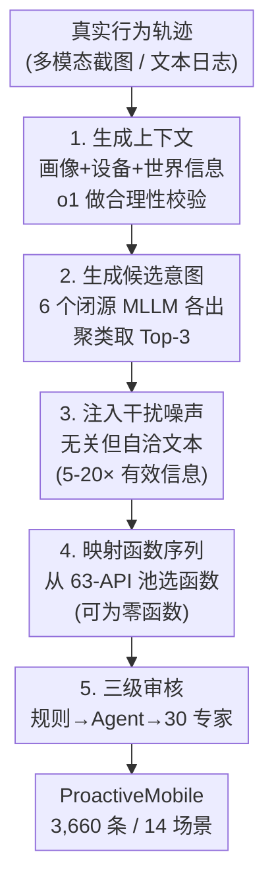

# ProactiveMobile: A Comprehensive Benchmark for Boosting Proactive Intelligence on Mobile Devices

**会议**: CVPR 2026  
**论文**: [CVF Open Access](https://openaccess.thecvf.com/content/CVPR2026/html/Kong_ProactiveMobile_A_Comprehensive_Benchmark_for_Boosting_Proactive_Intelligence_On_Mobile_CVPR_2026_paper.html)  
**代码**: https://github.com/xiaomi-research/proactive-mobile  
**领域**: Agent / 多模态VLM  
**关键词**: 主动智能、移动 GUI 智能体、Benchmark、函数调用、意图推断

## 一句话总结
针对当前移动智能体只会"被动执行命令"的局限，本文提出 ProactiveMobile——一个把"主动智能"形式化为「从四维设备上下文推断潜在用户意图并生成可执行函数序列」的大规模基准（3,660 条多意图样本 / 14 个场景 / 63 个 API），并配套可客观评测的 SR/FTR 指标，证明主动性是当前 MLLM 普遍缺失但可学习的能力（微调后的 Qwen2.5-VL-7B 达 20.82% 成功率，反超 o1 的 17.02%）。

## 研究背景与动机

**领域现状**：在 MLLM 推动下，移动 GUI 智能体已能理解界面、对话交互、做多步任务规划。但它们都停在"反应式（reactive）"范式里——本质是直接命令的被动执行器，用户必须自己完成"识别需求 → 表达目标"的全部认知负担，智能体只是个高级工具。

**现有痛点**：下一步是"主动智能（proactive intelligence）"——智能体自己预判需求、主动发起动作。但这个方向被基准的缺失卡住了。已有的主动智能体基准（ProactiveAgent、FingerTip-20K）有三处硬伤：① **任务过度简化**——用抽象化的上下文，并强行假设每个场景只有"唯一正确动作"，无视用户偏好天然的一对多特性；② **评测太粗**——要么用二值奖励模型（无法区分"部分对"和"完全错"），要么用余弦相似度（只测语义相关、不测功能正确性和可执行性）；③ **输出不可执行**——产出自然语言建议，从"建议任务"到"真正在设备上执行"之间存在断裂。

**核心矛盾**：主动建议本质是**一对多映射**（同一上下文可对应多个合理动作），而旧基准把它压成一对一；同时自然语言建议**主观、不可执行**，导致评测既不客观也无法落地。

**本文目标**：构建一个能反映真实复杂度、且支持客观可执行评测的主动智能基准，把"建议"和"执行"打通。

**核心 idea**：把主动智能任务重新形式化为「四维设备上下文 → 可执行函数序列」，用 63 个 API 的统一函数池把模糊的自然语言意图锚定成结构化的、可客观判分的函数调用，并用一对多多标注承认主动性的主观多样性。

## 方法详解

ProactiveMobile 不是一个模型，而是一套**基准 + 任务定义 + 数据生产管线 + 评测协议**。整体要解决的是：怎么把"主动给用户推荐有用动作"这件事，变成一个有真实复杂度、又能被机器客观打分的可学习任务。下面先讲任务怎么形式化，再讲 3,660 条数据怎么造出来、怎么保证质量，最后讲怎么评。

### 整体框架

输入是某个"决策时刻"的四维设备上下文——用户画像（$U$）、设备状态（$D$）、世界信息（$W$）、行为轨迹（$B$）；模型要输出一个「意图 + 函数序列」对 $(\hat{I}, \hat{F})$，其中 $\hat{F}$ 是从预定义函数池 $F$ 中选出的可执行函数序列。任务形式化为：

$$T = \{(I_k, F_k)\}_{k=1}^{a} = \text{Predict}(U, D, W, B)$$

关键在于 ground-truth 是一个**集合** $T$（每条样本标注 1–3 个有效意图-函数对），只要模型输出 $(\hat{I}, \hat{F})$ 命中集合中任意一个就算对。这一对多设计是整个基准区别于前作的根。当上下文不需要任何动作时，$\hat{F}=\varnothing$（no-recommendation 逻辑）。

数据生产是一条清晰的多阶段管线：先采集真实行为轨迹打底，再用多个闭源大模型协同生成上下文/意图、注入干扰噪声、映射成函数序列，最后过三级审核。下图是数据生成管线（对应 Figure 2）：

### 关键设计

**1. 四维上下文 + 一对多函数序列的任务形式化：把"主动"变成可判分的任务**

这一设计直接打中前作"过度简化 + 不可执行"的痛点。作者把"决策时刻"的输入拆成四个维度的设备信号：**用户画像**（基础信息、长期习惯、个人偏好）、**设备状态**（硬件、电量、网络、定位、通知）、**世界信息**（天气、时段、节假日）、**行为轨迹**（用户-设备交互的时序序列，可以是文本描述或 GUI 截图序列）。前三者用自然语言表达，行为轨迹则可用截图序列承载多模态信号。

模型的输出被严格约束成 $(\hat{I}, \hat{F})$，其中 $\hat{F}$ 只有当 $\hat{I}$ 可执行且能映射到函数池中至少一个函数时才非空：$\hat{F} \subseteq F$，否则 $\hat{F}=\varnothing$。判对条件是 $(\hat{I}, \hat{F}) \in T$。这样做的价值在于：自然语言建议的主观性被"必须落成函数调用"这一约束消解，评测从"主观文本匹配"变成"客观结构化匹配"；而 ground-truth 用集合而非单点，承认了主动推荐天然的一对多，避免了把功能正确但表述不同的预测误判为错。

**2. 多模型协同的数据生产管线 + 干扰噪声注入：在真实轨迹上批量造高复杂度样本**

行为轨迹是意图预测的地基。作者从公开/自建数据中取真实交互轨迹：**多模态轨迹**来自 GUI-Odyssey、AITZ、CAGUI 以及自采的 MobileAgentBench 等数据集的截图序列+命令；**文本轨迹**则对 GUI traces 去重后用 Claude-Sonnet-4 做基于 prompt 的扩展生成。

在轨迹之上跑五步生成（见上图）：① 用 Claude-Sonnet-4 / Gemini-2.5-Pro / GPT-5 随机生成画像/设备/世界三类上下文，并用 o1 做合理性校验，不通过就丢弃重生成；② 用 6 个 SOTA 闭源 MLLM 各自模拟潜在意图，再用 Gemini-2.5-Flash 把 30 个候选语义聚类、按跨模型支持度抽出 Top-3 代表性意图（聚类中心）；③ **干扰信息注入**——往上下文里塞任务无关但语义自洽的噪声，平均量是有效信息的 **5–20 倍**，逼模型学会从噪声中抓显著、任务相关的信号（这是提升鲁棒性的关键设计，也是真实设备上下文"信息过载"的拟真）；④ 用 Claude-Sonnet-4 把意图映射成函数序列，零函数序列即触发"无需动作"逻辑；⑤ 交给三级审核。这条管线的价值是：既保留了真实轨迹的复杂度，又能用多模型多样性 + 噪声注入把样本难度和真实感拉满。

**3. 三级审核 + 三档难度分级：用 30 人专家团把质量和区分度同时焊死**

光靠模型生成的数据不可信，作者用三级审核兜底：**规则过滤**自动剔除格式/一致性不达标的条目；**Agent 评估**用 Gemini-2.5-Pro 检查文本信息的真实性/自然度、轨迹的真实性/时序连贯、推荐的上下文契合度与可执行性；**专家复核**由 30 名受过标注训练、有人机交互背景的标注员核验事实准确性、逻辑可行性、动作可行性。每条数据由 3 人独立标注，**至少 2 人一致**才入库——这套清洗投入了 4 个月、约 21 万美元。

同时为了让基准有区分度，作者用 5 个强模型（Claude-Sonnet-4/3.7、GPT-4o、Gemini-2.5-Pro/Flash）的正确数把每条样本分三档难度：**L1 易**（5 个里 4–5 个做对）、**L2 中**（2–3 个）、**L3 难**（0–1 个）。5 名博士研究员对分层抽样的人工评估与模型自动分级的一致性 >95%，验证了这套自动分级的可靠性。函数池本身也是 14 个场景手工归类 + LLM 生成函数后合并裁剪 + 5 名 AI Agent 方向博士交叉核验定义而成。

**4. SR / FTR 双指标 + Best-Match 选择协议：为一对多场景定制的客观评测**

一对多让评测变棘手：太严会惩罚"功能对但形式不同"的预测，太松又失去意义。作者定义两个核心指标：**成功率 SR**（越高越好）不做字符串比较，而是用 Gemini-2.5-Pro 当 LLM 裁判判定预测是否与某个 ground-truth 在**功能上等价**，等价则记 1（与人类专家一致性达 98%）；**误触率 FTR**（越低越好）衡量"本该无动作时模型却错误触发"的比例：

$$\text{FTR} = \frac{N_{ft}}{N_{no\text{-}action}}$$

其中 $N_{no\text{-}action}$ 是 ground-truth 为空（$G=\varnothing$）的样本数，$N_{ft}$ 是其中被错误触发非空预测的数量。为了在一对多下公平选出"对照哪个 ground-truth"，作者设计了两阶段 **Best-Match Selection Protocol**：阶段一优先找完美功能等价——只要预测与任一 ground-truth 序列被裁判判为等价，该样本 SR 立即记 1 并随机选其一作最佳匹配；阶段二若无完美匹配则 SR 记 0，再退化为 F1 兜底——把预测和 ground-truth 都当作**无序的函数名集合**（忽略参数和顺序），选 F1 最大的那个 ground-truth 作为最佳匹配，供后续分析。这套协议把"完美功能正确"立为成功的金标准，又给失败案例一个一致、公平的分析基准。

## 实验关键数据

评测在 ProactiveMobile 测试集上对比一众闭源 SOTA MLLM（GPT-5、GPT-4o、o1、Gemini-2.5-Pro）与微调模型。微调用 8,876 条训练样本，对 Qwen2.5-VL-7B-Instruct 与 MiMo-VL-7B-SFT-2508 做全参数 SFT，输出格式为"自然语言推荐指令 + 可执行函数序列"。所有 baseline 零样本评测，用统一 prompt 给同样的多维上下文和 API 列表。

### 主实验（测试集 Avg，单位 %）

| 模型 | SR↑ | FTR↓ | 说明 |
|------|-----|------|------|
| GPT-4o | 6.60 | 65.32 | 闭源，误触率极高 |
| Gemini-2.5-Pro | 9.62 | 74.98 | 闭源 |
| GPT-5 | 11.37 | 39.20 | 闭源最强之一 |
| o1 | 17.02 | 14.09 | **闭源最强**，FTR 也低 |
| Qwen2.5-VL-7B-Instruct（原始） | 1.61 | 67.62 | 微调前基座 |
| MiMo-VL-7B-SFT-2508（原始） | 1.31 | 79.57 | 微调前基座 |
| **Qwen2.5-VL-7B + Proactive** | **20.82** | 13.76 | 微调后，**全场最佳**，反超 o1 |
| MiMo-VL-7B-SFT + Proactive | 13.47 | 46.91 | 微调后 |

核心结论：在本基准上微调能稳定解锁 SOTA——Qwen 从 1.61% → 20.82%，MiMo 从 1.31% → 13.47%；微调后的 Qwen 显著超过最强闭源 o1（17.02%）。这说明主动性是一种**需要领域专门训练**的专用能力，再强的通用模型也无法开箱即用。

### 消融实验（输出格式，All split，单位 %）

| 训练策略 | SR↑ | FTR↓ | 说明 |
|----------|-----|------|------|
| 仅 Func.（只输出函数） | 9.18 | 93.16 | FTR 爆炸，几乎全在乱触发 |
| **Rec.+Func.（本文）** | **20.82** | 13.76 | 推荐文本 + 函数，SR 最高 |
| Think+Func.（加推理） | 6.36 | 93.06 | 加 think 反而更差 |
| Think+Rec.+Func. | 8.02 | 2.06 | FTR 极低但 SR 大跌（过度保守、不敢触发） |

### 关键发现
- **输出格式是决定性变量**：先生成自然语言推荐再落函数（Rec.+Func.）的 SR 远高于只输出函数或额外加 Think 步骤——自然语言推荐像是给函数生成提供了"意图锚点"，去掉它 FTR 直接飙到 93%。
- **多模态是核心瓶颈**：最优模型在文本任务上 SR 26.04%，远高于多模态任务的 15.61%；部分多模态场景甚至在缺失视觉信息时表现更好，说明把抽象意图锚定到嘈杂的真实 GUI 截图里引入了显著复杂度，鲁棒的视觉理解仍是设备端主动智能的关键短板。
- **OOD 泛化有限但合理**（Table 4，64 条来自训练完全不见的"物流配送""智能家居"两场景）：微调 Qwen 仍以 20.31% SR 领先，但绝对值不高，说明主动性可学但跨场景迁移仍难。
- **主动性可学但远未达部署门槛**：即便最好的微调模型也只有 ~21% SR，离设备端实际部署要求还很远，这反而凸显了该问题的挑战性和基准的价值。

## 亮点与洞察
- **把"主观的主动建议"工程化成"客观可判分的函数调用"**：用 63-API 函数池 + 功能等价 LLM 裁判，绕开了自然语言评测的主观性陷阱，这套"意图→函数序列"的锚定思路可迁移到任何需要评测开放式建议的 agent 任务。
- **一对多多标注 + Best-Match 协议**是诚实面对"用户偏好多样性"的范式，比强行假设唯一答案更贴近真实，且两阶段协议（完美匹配优先 / F1 兜底）在严格与公平间取得了实用的平衡。
- **干扰噪声注入（5–20× 有效信息）**把"真实设备上下文信息过载"显式建模进数据，是个朴素但有效的鲁棒性 trick，可直接借用到其他上下文密集型 agent 训练。
- **"Rec.+Func. 优于纯 Func."这一消融**给主动 agent 的输出设计提供了直接证据：让模型先用自然语言把意图说清，再落成可执行动作，比直接吐函数更稳。

## 局限与展望
- **数据生成重度依赖闭源大模型**（Claude/Gemini/GPT/o1 协同生成上下文、意图、噪声、函数映射），基准的分布会继承这些模型的偏好与盲点；难度分级也由 5 个模型的正确率定义，与"人类认知难度"未必完全对齐（尽管有 >95% 人工一致性背书）。
- **绝对成功率偏低**（最优 ~21%），离设备端部署门槛尚远，主动智能仍是开放难题。
- ⚠️ 论文正文给出的训练样本量在不同处略有出入（摘要级 3,660 总量 vs. 训练 split 表格里的 multimodal+text 各 4,438、微调用 8,876），具体口径以原文 Table 2 与 Appendix 为准。
- **多模态瓶颈未解**：视觉信息有时反而拖累表现，如何让模型在嘈杂 GUI 截图里稳健 grounding 是后续关键方向。

## 相关工作与启发
- **vs ProactiveAgent / FingerTip-20K**：前作假设单一正确动作、用二值奖励或余弦相似度评测、输出不可执行的自然语言；本文用一对多多标注、SR/FTR 客观指标、可执行函数序列，三处全面升级，更贴近真实主动场景。
- **vs 反应式移动 GUI 智能体（GUI grounding / task planning 类）**：它们被动执行显式命令，把需求识别的认知负担全压给用户；本文把范式推进到主动预判需求、自主发起动作，是移动 agent 的下一前沿。
- **vs 智能家居类窄域主动系统**：那些工作局限于特定域、预测单步简单任务且多在仿真场景；ProactiveMobile 深植于多样真实场景，评测复杂的多步任务推荐。

## 评分
- 新颖性: ⭐⭐⭐⭐⭐ 首次把移动端主动智能形式化为"四维上下文→可执行函数序列"的一对多任务，并配套客观可执行评测，定义清晰且填补空白
- 实验充分度: ⭐⭐⭐⭐ 覆盖多档难度/模态/OOD 与输出格式消融，证据链完整；但主要靠 SFT baseline，缺少对噪声量、上下文维度等数据侧因素的消融
- 写作质量: ⭐⭐⭐⭐ 任务定义、管线、协议讲得严谨，公式与协议清楚；数据量口径在正文不同处略有出入
- 价值: ⭐⭐⭐⭐⭐ 开源数据+权重，给"主动移动智能体"提供了急需的训练与评测底座，且证明主动性可学，方向意义明确

<!-- RELATED:START -->

## 相关论文

- [\[CVPR 2026\] GUI-CEval: A Hierarchical and Comprehensive Chinese Benchmark for Mobile GUI Agents](gui-ceval_a_hierarchical_and_comprehensive_chinese_benchmark_for_mobile_gui_agen.md)
- [\[ICLR 2026\] FingerTip 20K: A Benchmark for Proactive and Personalized Mobile LLM Agents](../../ICLR2026/llm_agent/fingertip_20k_a_benchmark_for_proactive_and_personalized_mobile_llm_agents.md)
- [\[CVPR 2026\] Ego2Web: A Web Agent Benchmark Grounded in Egocentric Videos](ego2web_a_web_agent_benchmark_grounded_in_egocentric_videos.md)
- [\[CVPR 2026\] OS-Oracle: A Comprehensive Framework for Cross-Platform GUI Critic Models](os-oracle_a_comprehensive_framework_for_cross-platform_gui_critic_models.md)
- [\[ICLR 2026\] A Benchmark for Deep Information Synthesis (DeepSynth)](../../ICLR2026/llm_agent/a_benchmark_for_deep_information_synthesis.md)

<!-- RELATED:END -->
