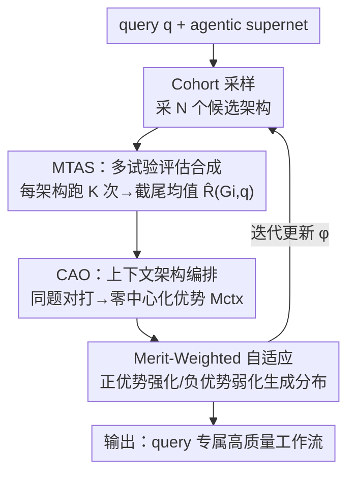

# RAAS: LLM Agentic System Architecture Search with GRPO

**会议**: CVPR 2026  
**论文**: [CVF Open Access](https://openaccess.thecvf.com/content/CVPR2026/html/Yang_RAAS_LLM_Agentic_System_Architecture_Search_with_GRPO_CVPR_2026_paper.html)  
**代码**: https://github.com/ridlog/raas  
**领域**: Agent  
**关键词**: 多智能体架构搜索, Agentic Supernet, 群组相对评估, 评估稳定性, GRPO

## 一句话总结
RAAS 把"群组相对评估"思想引入 agentic supernet 的架构搜索：让一批候选架构在**同一道题**上对打（CAO）、每个架构跑**多次独立试验取截尾均值**（MTAS），用零中心化的相对优势信号去更新生成分布，从而把"架构好坏"和"题目难易/执行随机性"解耦，在 MATH、HumanEval、GAIA 等六个基准上稳定超过最强基线 MaAS（平均 +5.41）。

## 研究背景与动机

**领域现状**：LLM 多智能体系统（MAS）靠多个 agent 协作解决复杂任务，但手工设计 agent 的角色、交互模式、决策协议代价高。自动化方向的最新范式是 **Agentic Supernet**（代表作 MaAS）：不再找一个"一招鲜"的固定工作流，而是优化一个**概率化的架构空间** $\mathcal{A}=\{\pi, O\}$，根据 query 动态采样出题目专属的工作流。

**现有痛点**：MaAS 这类方法在**评估候选架构**时继承了一个根本缺陷——它直接用某个采样架构在某道题上的**绝对得分** $R(G,q)$ 作为学习信号。这带来两类不稳定：(1) **难度纠缠**——弱架构碰到简单题能拿近满分、显得很强，强架构碰到难题只拿中等分、显得很弱；(2) **执行方差**——agentic 工作流本身有采样随机、中间决策随机，单次执行可能被幸运路径抬高或被偶发失败压低。

**核心矛盾**：搜索信号里"架构内在质量"被"题目难度"和"单次执行噪声"两个外生因素污染，导致简单题哄抬劣质设计、难题埋没优质设计，搜索动力学失稳。

**本文目标**：分解为两个子问题——Q1：如何把架构内在质量从题目难度中剥离？Q2：如何得到反映架构**一致能力**而非单次假象的稳定评估？

**切入角度**：评估不该问"这个架构表现多好"（绝对值），而该问"在同一道题上，它比同伴好多少"（相对值）。这正是 GRPO/SCST 那套"组内 peer 比较"思路——把它从 RL 训练搬到架构搜索的评估环节。

**核心 idea**：用"同题对打的群组相对优势 + 多试验统计聚合"替代"单次绝对得分"作为 supernet 的更新信号。

## 方法详解

### 整体框架
RAAS 在 MaAS 的 agentic supernet 之上构建一个**闭环搜索流程**：对每道 query $q$，先从分布里采一批 $N$ 个候选架构组成 cohort；每个架构在**同一道题**上跑 $K$ 次独立试验，由 MTAS 把多次结果聚合成稳健能力估计 $\hat R(G_i,q)$；CAO 以 cohort 的平均能力为基线、算出每个架构的零中心化"上下文优势" $M_{ctx}$；最后用这个优势对生成分布做 merit-weighted 更新，让正优势架构强化、负优势架构弱化。整个 supernet 的形式化沿用 MaAS：架构 $G$ 在各层激活算子集 $V_l$，联合概率 $p(G)=\prod_{l=1}^{L}\prod_{O\in O}\pi_l(O)^{\mathbb{I}_{O\in V_l}}$，优化目标是学一个 query 条件分布 $P(G|q)$ 去最大化代价调整后的效用 $U_\lambda(G;q)=U(G;q,a)-\lambda C(G;q)$。

> ⚠️ 标题写的是"with GRPO"，但正文并未直接套用一个名叫 GRPO 的损失；它借用的是 GRPO/SCST 的**群组相对、零中心化优势**这一核心思想，落地为 CAO（peer 比较）+ MTAS（多试验聚合），属于 GRPO-style 而非字面意义的 GRPO 训练（以原文为准）。

### 关键设计

**1. Contextual Architecture Orchestration（CAO）：用同题 peer 比较剥离题目难度**

针对"难度纠缠"痛点：与其问绝对得分，CAO 把一个 cohort $C_q=\{G_1,\dots,G_N\}$ 的所有候选放到**同一道题** $q$ 上跑，先求 cohort 的上下文基线 $\bar R_{ctx}(q)=\frac{1}{N}\sum_{i=1}^{N}\hat R(G_i,q)$——这个基线天然吸收了"这道题有多难"，因为难题让所有同伴一起降分、简单题让大家一起升分。然后每个架构的**上下文优势**就是它相对基线的偏离：$M_{ctx}(G_i,q)=\hat R(G_i,q)-\bar R_{ctx}(q)$。这是个**零中心化**信号，$M_{ctx}>0$ 表示在当前题境下优于同伴、$<0$ 表示劣于同伴，题目难易被基线约掉了。作者还给了方差分解 $\mathrm{Var}[\hat R_i]=\mathrm{Var}[\bar R_{ctx}(q)]+\mathrm{Var}[M_i]+2\mathrm{Cov}[\bar R_{ctx}(q),M_i]$：第一项是被 CAO 滤掉的题境波动，第二项才是想要的架构质量信号，协方差项在均衡 cohort 里可忽略。

**2. Multi-Trial Assessment Synthesis（MTAS）：用多试验截尾聚合压执行方差**

针对"执行方差"痛点：MTAS 不让架构只跑一次，而是对每个 $G_i$、每道 $q$ 实例化 $K$ 次**独立**工作流 $\{R^{(1)},\dots,R^{(K)}\}$（独立随机种子、独立 agent 初始化、独立中间决策），再用合成函数 $\hat R(G_i,q)=\Phi(\{R^{(k)}(G_i,q)\}_{k=1}^K)$ 聚合。$\Phi$ 取**截尾均值**（trimmed mean）——丢掉最高和最低 $\alpha$ 比例的试验再平均，对偶发的极端好/极端坏路径鲁棒，又保留中心趋势。由大数定律，随 $K$ 增大估计方差按 $\mathrm{Var}[\hat R]\propto \sigma^2/K_{\text{eff}}$ 下降（$K_{\text{eff}}$ 是截尾后有效样本数）。CAO 给 MTAS 提供"和谁比"的题境，MTAS 给 CAO 提供"信得过的分数"，二者必须串联：单有 CAO、分数本身抖，相对优势也抖；单有 MTAS、聚合得很稳但仍混着题目难度。

**3. Merit-Weighted Adaptation：把零中心化优势回传到具体算子**

有了稳定且去难度的 $M_{ctx}$，怎么更新 supernet？作者用影响权重把优势分摊到各层算子：单个架构的更新 $\Delta\phi(G_i;q)=\omega_i(\phi)\cdot M_{ctx}(G_i,q)$，其中 $\omega_i(\phi)=\nabla_\phi\log p(G_i;\phi)=\sum_{l=1}^{L}\sum_{O\in V_{i,l}}\nabla_\phi\log\pi_l(O)$ 量化每个被激活算子对该架构的贡献。cohort 聚合更新 $\Theta_{RAAS}(\phi;q)=\frac{1}{N}\sum_{i=1}^{N}\nabla_\phi\log p(G_i;\phi)\cdot M_{ctx}(G_i,q)$，再以 $\phi\leftarrow\phi+\eta\cdot\Theta_{RAAS}(\phi;q)$ 迭代。由于 $\sum_i M_{ctx}(G_i,q)=0$，更新天然平衡"强化好模式 / 抑制坏模式"，无需额外 baseline 调整；这与 GRPO 的零中心化优势同构——这也是标题"GRPO"的来处。

### 损失函数 / 训练策略
全程沿用 MaAS 的多域数据排布（数学、推理、代码、知识问答）来优化 supernet 参数；底座 LLM 用 GPT-4o-mini 与 qwen-2.5-72b。关键超参是 cohort 大小 $N$ 和试验次数 $K$，推荐 $N{=}5, K{=}5$（每 query 25 次运行），属于成本-效果的甜点。

## 实验关键数据

### 主实验
六个基准跨数学推理（MATH/GSM8K/MultiArith）、代码生成（HumanEval/MBPP）、多步工具使用（GAIA）。下表为 GPT-4o-mini 底座的代表结果（准确率 %，括号为相对 Vanilla 的提升，"vs MaAS"为本文相对最强基线 MaAS 的增量）：

| 基准 | Vanilla | MaAS（最强基线） | RAAS（本文） | vs MaAS |
|------|---------|------------------|--------------|---------|
| MATH | 46.30 | 52.08 | **60.87** | +8.79 |
| GSM8K | 87.45 | 91.84 | **95.16** | +3.32 |
| HumanEval | 87.08 | 92.23 | **96.31** | +4.08 |
| MBPP | 71.83 | 78.71 | **84.18** | +5.47 |
| GAIA（平均） | 3.98 | 18.06 | **20.84** | +2.78 |

六基准平均相对 MaAS **+5.41**。qwen-2.5-72b 底座结论一致（MATH 60.14、HumanEval 95.96）。GAIA 分难度看（Table 2），RAAS 在 Level-1/2/3 分别 29.53 / 25.32 / 7.68，均居首。

### 消融实验
作者按"逐步加回模块"做组件消融（Fig.5，数值为定性趋势，⚠️ 原文以柱状图给出、未列全部数字）：

| 配置 | 关键指标趋势 | 说明 |
|------|--------------|------|
| MaAS 基线 | 最低 | 绝对得分单次评估 |
| MaAS + 仅熵正则 | 略升 | 仅加探索正则，仍受难度纠缠 |
| RAAS（仅 CAO，无 MTAS） | 中等 | 有 peer 比较但执行方差未压 |
| Full RAAS（CAO + MTAS） | 最高 | 两机制协同，全基准最佳 |

### 关键发现
- **去掉 CAO**性能掉回 MaAS 附近——上下文基线是去难度纠缠的关键；**去掉 MTAS** 执行波动重新引入、终值下降，二者协同才达最佳。
- **超参敏感性**：MATH 上准确率随 $N$ 上升、约在 $N\approx 6$ 饱和（$K{=}5$ 时 $54.12\to58.26\to60.87\to61.24$）；$N$ 太小时增大 $K$ 收益有限（不稳基线限制了增益），$N\ge5$ 时把 $K$ 提到 5 带来 +4.45 显著可靠性提升。$N$ 提升 peer 多样性、稳住基线 $\bar R_{ctx}$；$K$ 过滤执行随机性。
- **成本-效果**：MATH 上 RAAS 以 \$0.31/query 拿到 60.87% 准确率，相比 MaAS **提 8.8 点同时省 6% 成本**——更准的架构选择避免了冗余探索与早熟收敛。
- **收敛**：2–3 个 checkpoint 内就超过 MaAS（MATH 第 4 点已到 57.8），轨迹近单调、置信带窄，最终 plateau 更高。

## 亮点与洞察
- **把 RL 里的"组内相对优势"迁移到架构搜索的评估环节**：GRPO/SCST 原本是给序列生成做零中心化优势的，本文洞察到 agentic supernet 的评估也吃"绝对分污染"的亏，对症下药——这是一个干净的跨领域思想搬运。
- **CAO 与 MTAS 是正交且互补的两根支柱**：一个治"和谁比"（题目难度），一个治"信不信这次分"（执行方差），缺一不可，方差分解和大数定律两条理论 sanity check 也分别对应这两点。
- **截尾均值是个低成本鲁棒选择**：相比训练一个 critic 模型，截尾聚合不引入额外可学习组件、不加重计算，却能抗极端 trial——这个"无 critic 的稳健评估"思路可迁移到任何带随机执行的搜索/评估场景。
- **成本不升反降**：稳定信号让搜索少走弯路，是"评估质量提升反哺搜索效率"的好例证。

## 局限与展望
- **多轮交互验证不足**：作者承认大多数基准是单轮推理/编码，只有 GAIA 是多步工具使用；CAO+MTAS 在真正多轮交互工作流上的有效性还需更广验证（作者列为未来工作）。
- **试验成本随 $N\times K$ 线性增长**：虽然甜点 $N{=}5,K{=}5$ 只比 MaAS 贵一点点，但每 query 25 次运行对超大模型仍是可观开销；作者提到未来要做 $N,K$ 的自适应分配。
- **缺理论收敛保证**：merit-weighted adaptation 目前是经验有效，作者将"为该更新建立收敛性理论"列为待办。
- **标题与方法措辞落差**："with GRPO"可能让读者期待一个标准 GRPO 训练流程，实际是 GRPO-style 的评估机制，阅读时需留意（⚠️ 以原文为准）。

## 相关工作与启发
- **vs MaAS（直接基线 / Agentic Supernet）**：MaAS 创新在于把搜索目标从固定工作流变成架构分布，但评估仍用单次绝对得分；本文不动 supernet 结构，只换评估信号（绝对→相对、单次→多试验），就拿下平均 +5.41——说明"评估信号质量"是这条线被低估的瓶颈。
- **vs AFlow / AgentSquare / ADAS / GPTSwarm 等自动化 agentic 系统**：它们在搜索算法/设计空间上各有创新，但都共享"绝对分评估"的脆弱性；RAAS 的贡献正交于它们，理论上可叠加。
- **vs GRPO / SCST（RL 中的群组/序列级相对评估）**：本文借其零中心化优势思想，但应用对象从"token 序列"变成"agent 架构"，并额外补上 MTAS 处理 agentic 工作流特有的执行方差，是对原思想的领域适配 + 扩展。

## 评分
- 新颖性: ⭐⭐⭐⭐ 把 GRPO-style 相对评估搬进 agentic supernet 搜索，角度清晰但属"已有思想的巧妙迁移+扩展"。
- 实验充分度: ⭐⭐⭐⭐ 六基准两底座 + 消融 + N/K 敏感性 + 成本分析较完整，但多轮交互场景仅 GAIA 一个。
- 写作质量: ⭐⭐⭐⭐ 问题-机制对应清楚、有方差分解等理论 sanity check；标题"GRPO"易引起字面误解。
- 价值: ⭐⭐⭐⭐ 即插即用换评估信号就能稳定提升，对做 agentic 架构搜索的人有直接借鉴。

<!-- RELATED:START -->

## 相关论文

- [\[CVPR 2026\] EpiAgent: An Agent-Centric System for Ancient Inscription Restoration](epiagent_agent_centric_system_for_ancient_inscription_restoration.md)
- [\[ACL 2026\] MAGMA: A Multi-Graph based Agentic Memory Architecture for AI Agents](../../ACL2026/llm_agent/magma_a_multi-graph_based_agentic_memory_architecture_for_ai_agents.md)
- [\[CVPR 2026\] HAVEN: Hierarchical Long Video Understanding with Audiovisual Entity Cohesion and Agentic Search](haven_hierarchical_long_video_understanding_with_audiovisual_entity_cohesion.md)
- [\[CVPR 2026\] SenseSearch: Empowering Vision-Language Models with High-Resolution Agentic Search-Reasoning via Reinforcement Learning](sensesearch_empowering_vision-language_models_with_high-resolution_agentic_searc.md)
- [\[ACL 2026\] BAPO: Boundary-Aware Policy Optimization for Reliable Agentic Search](../../ACL2026/llm_agent/bapo_boundary-aware_policy_optimization_for_reliable_agentic_search.md)

<!-- RELATED:END -->
