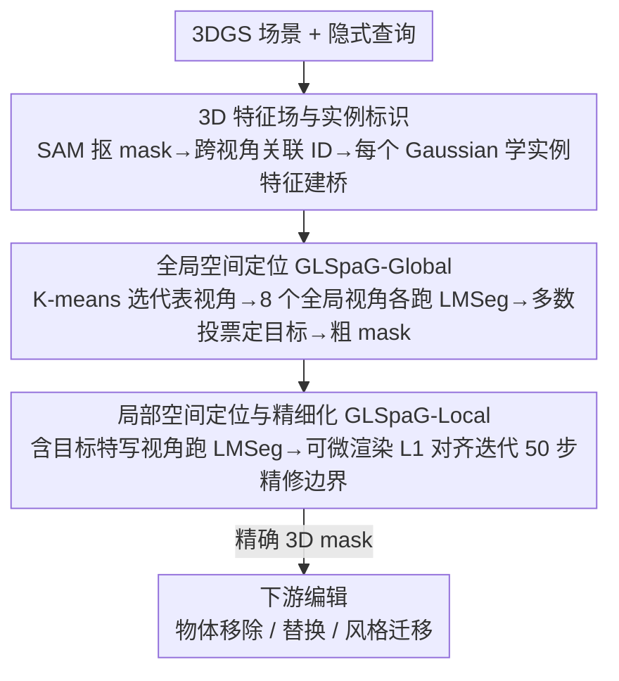

# REALM: An MLLM-Agent Framework for Open World 3D Reasoning Segmentation and Editing on Gaussian Splatting

**会议**: CVPR 2026  
**arXiv**: [2510.16410](https://arxiv.org/abs/2510.16410)  
**代码**: [https://ChangyueShi.github.io/REALM](https://ChangyueShi.github.io/REALM)  
**领域**: LLM Agent / 3D视觉  
**关键词**: 3D推理分割, MLLM-Agent, 3D高斯溅射, 全局到局部空间定位, 3D场景编辑

## 一句话总结
提出 REALM 框架，利用 MLLM 的推理能力通过全局到局部空间定位策略在 3DGS 上进行开放世界 3D 推理分割，无需 3D 后训练即可处理隐式指令，在 LERF 上 mIoU 达 92.88%，远超基线方法 40+ 个百分点，并支持物体移除、替换和风格迁移等编辑任务。

## 研究背景与动机

**领域现状**：让 AI 系统理解复杂人类指令并在 3D 场景中精确定位目标物体，是机器人和人机协作的基础能力。现有 3D 开放词汇分割方法（如 LERF、LangSplat、GS-Grouping）已能处理显式类别查询（如"分割杯子"），但面对需要推理的隐式指令（如"分割灯和书之间的物体"、"让桌子变得更整洁"）时表现不佳。

**现有痛点**：(1) 3D 分割方法缺乏推理能力——只能做显式关键词匹配，无法理解空间关系、语义属性或常识推理；(2) 2D MLLM 虽然擅长推理，但天然缺乏 3D 空间理解——直接将渲染视图输入 MLLM 对视角选择高度敏感，不同角度可能产生矛盾结果；(3) 已有尝试（如 ScanReason、ReasonGrounder）受限于预测 bounding box 或依赖俯视图，精度和适用性不足。

**核心矛盾**：MLLM 具备强大的 2D 推理能力但缺乏 3D 空间感知，如何在不对 MLLM 做 3D 特定后训练的情况下，稳定地将 2D 推理结果提升到 3D 空间并获得精确的分割 mask？

**本文目标**：实现一个能理解隐式推理指令、不需要 3D 后训练、且能生成精确 3D 分割 mask 的开放世界框架。

**切入角度**：以 3DGS 作为 3D 世界的高保真代理——它能渲染逼真的新视角供 MLLM 理解；通过全局到局部的两阶段多视角推理策略聚合不同视角的 MLLM 响应，消除单视角敏感性。

**核心 idea**：用 3DGS 渲染多视角给 MLLM 做推理，通过全局粗定位+局部精分割的两阶段策略获得精确 3D mask。

## 方法详解

### 整体框架
REALM 要解决的是一个绕不开的错配：会推理的 MLLM 只懂 2D 图片，而 3D 分割方法只会按关键词匹配、不会推理。它的破局思路是让 3DGS 充当"视角工厂"——把 3D 场景渲染成一张张照片级的图给 MLLM 看，让 MLLM 在 2D 上完成推理，再把答案稳定地抬回 3D。整条 pipeline 由三件事串起来：先离线为每个 3D Gaussian 学一个实例特征，建好一座 2D↔3D 的桥；推理时用一个叫 LMSeg 的封装，把"一张图 + 一句查询"交给 MLLM 拿到 bbox/类别/解释，再经 SAM 转成 2D mask 并查到目标实例 ID；最后用全局到局部的两阶段定位（GLSpaG），先在多个大视角投票出目标是谁、粗分割出来，再凑到目标跟前用特写视角把 mask 边界磨精细。拿到精确的 3D mask 后，物体移除、替换、风格迁移都只是对这组 Gaussian 的后续操作。

### 关键设计

**1. 3D 特征场与实例标识：把"2D 上选中的东西"翻译成"3D 里的哪堆 Gaussian"**

MLLM 的推理结果天然落在某一张 2D 视图上，可它指的目标到底对应哪些 3D Gaussian？REALM 不去做复杂的多视角 3D 融合，而是预先给每个 Gaussian 学一个实例特征，让这次翻译变成一步查表。具体做法是先用 SAM 逐帧抠出 2D 实例 mask，再用时序传播模型跨视角把同一物体的 mask 关联起来、赋予一致的实例 ID 作为监督。每个 Gaussian $G_i$ 带一个可学特征 $f_i \in \mathbb{R}^D$，渲染时和颜色一样走 alpha blending 得到 2D 特征图 $F = \sum_i f_i \alpha_i \prod_{j<i}(1-\alpha_j)$，再过一个分类器预测每个像素的实例 ID：$\hat{id}(u,v) = \arg\max_k (CLS(F)_{u,v,k})$。训练好之后，这座桥是双向的——2D 上 LMSeg 选中一块区域，立刻能反查出对应的 3D Gaussian 集合，无需任何 3D 后训练。

**2. 全局空间定位（GLSpaG-Global）：用多视角投票压掉"换个角度答案就变"的随机性**

直接把某个渲染视图丢给 MLLM 推理有个致命毛病：结果对视角极其敏感，论文 Fig.2 里同一查询换 10 次随机视角方差很大，纯属碰运气。全局阶段就是来稳住这件事的。它先对训练相机位姿做 K-means 聚类得到 $N^{cluster}$ 个代表视角（保证视角多样、互不冗余），再从中挑出"画面里物体最多"的 $N^{global}=8$ 个当全局相机（保证覆盖足够多候选）。对这 8 个视角各跑一遍 LMSeg 拿到各自投出的目标实例 ID，最后多数投票定下唯一目标 $ID^q = \arg\max_{c} |\{i: ID_i^q = c\}|$，据此在 3D 特征场里取出对应 Gaussian、生成一张粗 mask $M^{3D}$。消融印证了"聚类保多样 + Top-K-ID 保覆盖"两步缺一不可：单视角 Qwen2.5-VL 只有 mIoU 0.78，补上全局投票直接跳到 0.89。

**3. 局部空间定位与精细化（GLSpaG-Local）：凑到目标跟前把粗 mask 的边界磨精细**

全局投票解决了"目标是谁"，但 8 个大视角离物体远、粗 mask 的边界往往糊。局部阶段专治边界。它从聚类代表相机里挑出那些画面包含目标 ID 的视角当局部相机（相当于对目标的若干张特写），对每张特写跑 LMSeg 拿到精细的 2D mask $M_i^{2D\text{-Local}}$；再借可微分光栅化把当前 3D mask $M^{3D}$ 渲染回这些局部视角得到 $\hat{M}_i$，用 L1 损失把两者对齐：

$$\mathcal{L}_{local} = \|\hat{M}_i - M_i^{2D\text{-Local}}\|_1$$

只优化 3D mask 本身、迭代 50 步（3.67s）即可。步数是个甜区——10 步精度不够，500/1000 步反而过拟合退化；50 步把 mIoU 从全局阶段的 0.89 推到 0.95。

### 一个完整示例：分割"灯和书之间的物体"
以一条隐式查询走一遍，看候选怎么从一堆收敛到一个、mask 怎么从糊到精：
1. **建桥（离线）**：场景里 SAM 抠出灯、书、花瓶、杯子等若干实例，跨视角关联好 ID，特征场训练完毕——此刻任意视图选中一块区域都能查到它是哪个 3D 实例。
2. **全局投票**：K-means 选出代表视角，再挑 8 个物体最密集的当全局相机。8 个视角各让 MLLM 推理"灯和书之间是什么"，比如 6 票投给"花瓶"、2 票因角度遮挡投给"杯子"——多数投票锁定花瓶的实例 ID，特征场据此吐出一张粗的花瓶 mask（边界还糊，mIoU≈0.89 量级）。
3. **局部精修**：从代表相机里挑出几张拍到花瓶的特写，对每张特写 SAM 给出干净的 2D 花瓶 mask；把 3D 粗 mask 渲染回这几个视角、用 L1 对齐迭代 50 步，瓶口、瓶颈这些细边界被逐步收紧（mIoU≈0.95 量级）。
4. **落地编辑**：拿到这组精确的花瓶 Gaussian 后，"移除花瓶/换成别的/改风格"就只是对这堆 Gaussian 的增删改。

### 损失函数 / 训练策略
特征场训练阶段用交叉熵损失对齐渲染出的实例 ID 与 SAM 的 ground-truth ID。推理阶段的局部精细化用上面的 L1 损失对齐 3D 渲染 mask 与 LMSeg 的 2D mask，仅 50 步（3.67s）。整体框架无需任何 3D 特定后训练，MLLM（Qwen-2.5-VL）与 SAM 均为现成预训练模型直接调用。

## 实验关键数据

### 主实验

| 数据集 | 指标 | REALM | 之前最佳 | 提升 |
|--------|------|-------|----------|------|
| LERF | mIoU | 92.88% | 44.82% (Gaga) | +48.06% |
| LERF | mBIoU | 90.12% | 42.37% (Gaga) | +47.75% |
| 3D-OVS | mIoU | 93.68% | 58.46% (GAGS) | +35.22% |
| 3D-OVS | mBIoU | 86.02% | 50.34% (GAGS) | +35.68% |
| REALM3D | mIoU | 82.30% | 65.55% (GS-Group) | +16.75% |
| REALM3D | mBIoU | 70.37% | 55.99% (GS-Group) | +14.38% |

注：以上对比均在 **隐式查询** 条件下。基线方法主要依赖 CLIP 关键词匹配，无法有效处理需要推理的隐式指令。

### 消融实验

| 配置 | mIoU | mBIoU | 说明 |
|------|------|-------|------|
| GS-Group (Baseline) | 0.32 | 0.30 | 无推理能力 |
| +Qwen2.5-VL | 0.78 | 0.77 | 加入MLLM推理但不稳定 |
| +Global Reasoning | 0.89 | 0.88 | 多视角投票消除随机性 |
| +Local Refinement | 0.95 | 0.94 | 边界精细化 |

全局相机采样策略消融（LERF Figurines）：

| 策略 | mIoU |
|------|------|
| 无K-means | 0.38 |
| K-means+Random选择 | 0.76 |
| 完全随机 | 0.59 |
| K-means+Top-K-ID (最终) | 0.95 |

推理效率：渲染速度 354.72 FPS；总推理时间 <10s（全局 MLLM 2.53s + 局部 MLLM 2.48s + 局部精细化 3.67s）。

### 关键发现
- REALM 在隐式查询上的优势极为显著（LERF 上 mIoU 超基线 48%），因为基线方法根本无法处理推理型指令
- 全局相机采样策略至关重要：K-means 聚类确保视角多样性 + Top-K-ID 选择确保覆盖更多物体，两步缺一不可
- 局部精细化步数 50 为最优——过少(10)精度不够，过多(500/1000)导致过拟合退化
- 聚类数 $N^{cluster}=24$ 表现最佳，过少(2)覆盖不足，过多(128)引入噪声

## 亮点与洞察
- 将 3DGS 作为"视角工厂"的思路非常优雅——MLLM 最擅长理解 2D 照片级图像，3DGS 恰好能渲染这种图像，两者天然互补
- 全局到局部的两阶段策略本质上是一种 coarse-to-fine 的空间注意力机制，从全场景的粗检索到局部的精分割，逐步缩小不确定性
- 投票聚合机制简单但有效，将单视角的高方差转化为多视角的低方差稳定输出
- 新提出的 REALM3D 基准（100+ 场景、1444 prompt-mask pairs、含隐式指令）填补了 3D 推理分割评估的空白
- 一个 Agent 框架同时支持分割、移除、替换、风格迁移等多种 3D 交互任务

## 局限与展望
- 依赖 3DGS 重建质量——如果 3DGS 重建不佳（纹理缺失、几何错误），渲染视角质量下降会级联影响 MLLM 理解
- MLLM 的推理上限决定了系统天花板——对于极复杂的推理链或高度抽象的指令可能失效
- 多视角推理增加延迟（8 个全局视角 + N 个局部视角），总时间约 8.68s，难以实时交互
- 局部精细化是逐视角的 L1 优化，视角数量有限时 3D mask 可能在未覆盖区域不够精确
- 当前 REALM3D 数据集虽然较大（100+ 场景），但隐式指令的难度和多样性仍有提升空间

## 相关工作与启发
- **vs LERF/LangSplat**: 这些方法在辐射场/3DGS 中嵌入 CLIP 语言特征，只能处理显式类别查询（"杯子"），无法理解"帮我找到会发光的东西"这类推理指令；REALM 通过 MLLM 推理突破了这个限制
- **vs GS-Grouping/Gaga**: 基于对比学习分组 3D 实例，查询也局限于显式词汇；在隐式查询上 REALM mIoU 比 Gaga 高 48%
- **vs ReasonGrounder**: 概念上最接近，但 ReasonGrounder 依赖俯视图且只预测 bounding box，REALM 提供精细 mask 且不受限于特定视角
- **vs 2D 推理分割 (LISA)**: LISA 等方法在 2D 上做推理分割但缺乏 3D 一致性；REALM 通过多视角聚合+特征场保证 3D 一致

## 评分
- 新颖性: ⭐⭐⭐⭐ MLLM-Agent + 3DGS 的组合新颖，全局到局部空间定位策略设计巧妙
- 实验充分度: ⭐⭐⭐⭐⭐ 三个基准+详尽消融+效率分析+多种下游任务，极为全面
- 写作质量: ⭐⭐⭐⭐ 动机清晰，Fig.2 的视角敏感性可视化直观有力
- 价值: ⭐⭐⭐⭐ 开创了 3D 推理分割方向，REALM3D 基准对社区有长期价值

<!-- RELATED:START -->

## 相关论文

- [\[CVPR 2026\] Vinedresser3D: Towards Agentic Text-guided 3D Editing](vinedresser3d_towards_agentic_text-guided_3d_editing.md)
- [\[CVPR 2026\] SceneAssistant: A Visual Feedback Agent for Open-Vocabulary 3D Scene Generation](sceneassistant_a_visual_feedback_agent_for_openvoc.md)
- [\[CVPR 2026\] ModularAgent: A Task-Aware Modular Framework for Joint Optimization of Multimodal Large Language Models and World Models](modularagent_a_task-aware_modular_framework_for_joint_optimization_of_multimodal.md)
- [\[CVPR 2026\] RetouchIQ: MLLM Agents for Instruction-Based Image Retouching with Generalist Reward](retouchiq_mllm_agents_for_instruction-based_image_retouching_with_generalist_rew.md)
- [\[CVPR 2026\] Seeing as Experts Do: A Knowledge-Augmented Agent for Open-Set Fine-Grained Visual Understanding](seeing_as_experts_do_a_knowledge-augmented_agent_for_open-set_fine-grained_visua.md)

<!-- RELATED:END -->
