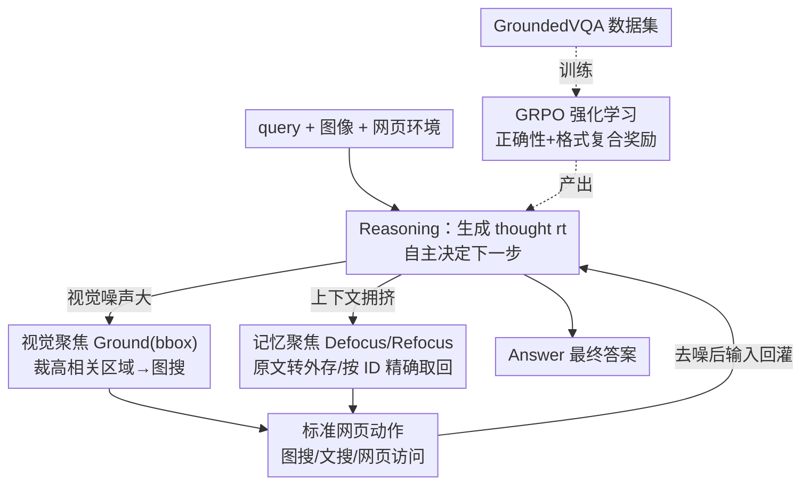

# ReFAct: Empowering Multimodal Web Agents with Visual and Context Focusing

**会议**: CVPR 2026  
**论文**: [CVF Open Access](https://openaccess.thecvf.com/content/CVPR2026/html/Wu_ReFAct_Empowering_Multimodal_Web_Agents_with_Visual_and_Context_Focusing_CVPR_2026_paper.html)  
**代码**: 待确认  
**领域**: Agent  
**关键词**: 多模态网页智能体, 视觉聚焦, Grounding, 外部记忆, GRPO

## 一句话总结
ReFAct 让多模态网页搜索 agent 学会**主动管理跨模态上下文**：用 Grounding 工具裁出高相关图像区域去对抗"视觉噪声"、用 Defocus/Refocus 外部记忆操作压缩并按需取回长文本去对抗"检索噪声"，再配上专为高噪声场景构建的 GroundedVQA 数据集做 GRPO 强化学习，训出的 ReFAct-7B 在高噪声基准上显著超过同量级 RL 智能体。

## 研究背景与动机

**领域现状**：文本 Web Search Agent（Search-R1、DeepResearcher 等）靠"推理-检索"迭代循环解决复杂问题已很成功；现实世界充满视觉信息，于是出现多模态网页智能体（MMSearch-R1、WebWatcher），给 MLLM 装上图像搜索、网页访问、OCR 等工具。

**现有痛点**：这些多模态 agent **继承了底座 MLLM 的被动感知**——把整张截图/整页搜索结果不加筛选地编码进上下文。于是两类噪声毒害它们：(1) **视觉噪声**——无关背景、复杂纹理分散注意力，比如窗外一栋无关建筑就能让 agent 把图搜成另一栋楼，建立"错误的事实基础"，后续推理全盘跑偏；(2) **检索噪声**——网页里的广告、导航栏等冗余元素稀释关键信息、淹没推理。

**核心矛盾**：agent 的注意力是有限资源，但被动感知把"什么都塞进来"，关键证据被噪声淹没 → 既导致初始检索 query 出错（视觉噪声），又导致长程上下文爆炸、推理被无关文本"淹死"（检索噪声）。

**本文目标**：让 agent 具备**主动的、跨模态的上下文管理能力**——既能主动聚焦图像的高相关区域，又能主动调节工作记忆的信息密度。

**切入角度**：把"聚焦（focusing）"作为统一概念，把信息过滤显式做成 agent 的**动作**，让它在推理过程中自主决定"看哪、记哪、何时取回"，而不是被动接收。

**核心 idea**：Reasoning + Focusing + Acting 三位一体——视觉聚焦（Grounding）治视觉噪声、记忆聚焦（Defocus/Refocus）治检索噪声，二者协同维持高保真工作记忆。

## 方法详解

### 整体框架
ReFAct 把 agent 与多模态网页环境的交互形式化为序列决策：每步 $t$ 观测状态 $o_t$、维护上下文历史 $H_t$。与"被动把所有观测堆进 $H_t$"的标准 agent 不同，ReFAct 把动作空间**扩展出显式的 Focusing 动作**，让 agent 主动管理视觉注意力与工作记忆负载。一个典型轨迹是：$\tau=(q, I_0,\dots, r_t, \text{Ground}(bbox), \text{ImgSearch}(I_{crop}),\dots, r_{t+k}, \text{Refocus}(id), r_{t+k+1}, \text{Answer})$——thought $r_t$ 驱动下一步，标准网页动作与内部聚焦操作无缝交织，保证每个外部动作都基于**主动整理过、去噪后**的输入。为训练和评估这种能力，作者还配套构建了 GroundedVQA 数据集，并用 GRPO 训出 ReFAct-7B。

### 关键设计

**1. 视觉聚焦 Visual Focusing（Grounding）：让 agent 主动裁区域而非整图搜**

针对视觉噪声痛点：标准 agent 拿整张图去做反向图搜，无关背景常把检索带偏。ReFAct 引入主动 Grounding——执行图搜前，agent 先生成动作 $\text{Ground}(I_t, bbox)$，其中 $bbox=[x_1,y_1,x_2,y_2]$ 指定目标裁剪框，环境随后用裁出的 $I_t[bbox]$ 作为精确 query 去检索。关键设计是**让 agent 自己直接预测 bbox**，而不是接一个第三方检测模型——这样既避免引入外部检测器的偏置，又让 grounding 能力在训练中和 agent 的推理过程**联合优化**（学会"什么时候该裁、什么时候裁是多余的"）。它把"小目标淹没在杂乱大图里"的难识别任务，转化成"聚焦后"的可解子问题。

**2. 记忆聚焦 Memory Focusing（Defocus / Refocus）：双记忆系统调节上下文密度**

针对检索噪声与长程上下文爆炸：ReFAct 区分有限的高价值**活跃工作记忆** $H_t$ 与无限的**外部记忆** $M_t$，两个互补工具在二者间搬运信息。**Defocus**：当 agent 遇到信息密集但当前非关键的内容（如一篇长文全文），主动把原始内容卸载进 $M_t$，只在 $H_t$ 里保留一条简洁的、带证据的摘要和一个唯一引用 ID，保持当下上下文干净。**Refocus**：当后续推理需要先前卸载的细节，agent 执行 $\text{Refocus}(id)$，按 $H_t$ 里摘要的具体 ID **精确取回** $M_t$ 中的原文——避免模糊检索带来的错误。这套机制让 agent 像人一样"先记要点、需要时翻原文"，主动调节工作记忆的信息密度。

**3. GroundedVQA 数据集：强制视觉 grounding 的高噪声评测/训练源**

针对"现有 VQA 太简单、整图搜就能答"的痛点：OKVQA 这类数据集目标实体高度显著，agent 不需要深度视觉理解。GroundedVQA 的核心区别是**强制视觉 grounding**——问题被构造成"不先精确定位区域就答不出来"。构建走"先建图、再采样"范式：基于 SA-1B 的高分辨率杂乱场景，先用 Qwen3-VL-235B 检测候选实体并生成视觉描述、经 Google Serper 图搜 + 二次核验筛出高置信度的 **Grounded Entities** 连到图像根节点，再用其文本身份去文搜、用 Jina Reader 解析 top-5 网页抽出 **Retrieved Entities** 迭代扩展成图像知识图谱 $G_I$；然后从子图采样生成 Level-1（聚焦单实体推理：定位→精确识别→知识推理）与 Level-2（跨实体关系推理）的 QA。训练集用 Qwen-2.5VL-32B **拒绝采样**（不给图能答对就丢弃，滤掉无需 grounding 的题），测试集人工核验剔除"全局启发式可解"的捷径题。最终训练 1200 个 Level-1 + 300 个 Level-2，评测 261 + 56。

**4. GRPO 强化学习 + 复合奖励：让聚焦策略从环境反馈中涌现**

针对"聚焦时机难以监督"：作者用 GRPO 端到端训 ReFAct-7B，让模型自己学会"何时裁剪 vs 何时多余"。GRPO 对每个 query+图像采一组 $G$ 条轨迹，目标 $\mathcal{J}_{GRPO}(\theta)=\mathbb{E}_{q\sim D}\big[\frac{1}{G}\sum_{i=1}^{G}\frac{\pi_\theta(\tau_i|q,I)}{\pi_{\theta_{old}}(\tau_i|q,I)}\hat A_i\big]-\beta\mathbb{D}_{KL}(\pi_\theta\|\pi_{ref})$，优势用组内相对归一化 $\hat A_i=\frac{R(\tau_i)-\text{mean}(\{R(\tau_j)\})}{\text{std}(\{R(\tau_j)\})+\epsilon}$（省去单独的 critic）。复合奖励 $R(\tau)=(1-\lambda)r_{acc}+\lambda r_{fmt}$：$r_{acc}$ 用 LLM-as-Judge 判语义等价（而非死板字符串匹配），稀疏的结果信号隐式激励出有效的中间 grounding 动作；$r_{fmt}$ 惩罚非法工具调用/畸形 bbox，保证动作空间可执行。⚠️ 训练阶段**主要只训视觉 grounding**，因为视觉噪声是当前 MLLM 更关键、更欠缺的能力，而 Defocus/Refocus 带来的剧烈上下文变化会让 RL 训练不稳定，故暂未纳入训练优化（以原文为准）。

## 实验关键数据

### 主实验
底座 Qwen2.5-VL-7B-Instruct，GRPO 训练（2 epoch、lr 2e-6、$\beta{=}0.01$、$\lambda{=}0.1$、group size $G{=}8$、8×A100），奖励与评测均用 Gemini-2.5-pro 做 judge，训练语料为 GroundedVQA 训练集 + 3000 条 FVQA。指标为 pass@1（LLM-as-Judge 判正确）。下表为 RL 训练智能体的对比（GroundedVQA 分 Level-1/2）：

| 模型 | 来源 | GroundedVQA L1 | GroundedVQA L2 | MMSearch | SimpleVQA | LiveVQA | 平均 |
|------|------|----------------|----------------|----------|-----------|---------|------|
| DeepEyes | Open | 0.184 | 0.179 | 0.281 | 0.463 | 0.168 | 0.255 |
| WebWatcher | Open | 0.372 | 0.232 | 0.491 | 0.543 | 0.512 | 0.430 |
| MMSearch-R1 | Open | 0.433 | 0.304 | 0.538 | 0.574 | 0.484 | 0.467 |
| **ReFAct-7B** | Open | **0.513** | **0.375** | 0.497 | 0.616 | 0.300 | 0.460 |

ReFAct-7B 在高噪声 GroundedVQA 上**决定性领先**（L1 0.513 vs MMSearch-R1 0.433，L2 0.375 vs 0.304），低噪声 SimpleVQA 也保持强适应性（0.616），说明不会在不需要 grounding 时"过度处理"。

### 消融实验
GroundedVQA 上逐项关组件（准确率 %，$\Delta$ 为相对完整模型的下降）：

| 变体 | Level-1 | $\Delta$ | Level-2 | $\Delta$ |
|------|---------|----------|---------|----------|
| ReFAct-7B（完整） | 51.3 | - | 37.5 | - |
| w/o GroundedVQA 数据 | 43.3 | -8.0 | 30.4 | -7.1 |
| w/o 记忆聚焦 | 49.4 | -1.9 | 33.9 | -3.6 |
| w/o 视觉聚焦 | 40.2 | -11.1 | 26.8 | -10.7 |

### 关键发现
- **视觉聚焦贡献最大**：关掉 Ground 工具 L1 掉 11.1%、L2 掉 10.7%，是过滤极端视觉噪声最关键的组件；这与"该基准的主要瓶颈是视觉过载而非文本"一致。
- **记忆聚焦贡献较小但确实有用**：关掉 Defocus/Refocus L1 仅掉 1.9%、L2 掉 3.6%——印证 GroundedVQA 的主瓶颈是视觉而非检索噪声。
- **GroundedVQA 数据不可替代**：只用通用 VQA 训练 L1 掉 8.0%、L2 掉 7.1%；缺了密集噪声场景，agent 学不会"何时触发主动 grounding"，常退回被动观察。
- **抗视觉噪声鲁棒性**：按目标空间占比分层（占比越小噪声越高），ReFAct-7B 在**极端噪声区**（目标占比 <5%）比 MMSearch-R1 高 **+6.3%**，而基线随目标变小快速退化。
- **即插即用依赖底座 grounding 能力**：把 ReFAct 框架（不训练）套到 Qwen2.5-VL-72B，GroundedVQA L1 +0.111；但对 Gemini-2.5-flash/GPT-5-mini 等闭源模型增益微乎其微甚至为负——作者推测因为框架是"利用"模型已有的 grounding 能力，Qwen 系底座 grounding 强故能用好工具，弱 grounding 模型聚焦不到正确区域则机制失效。

## 亮点与洞察
- **把"聚焦"做成显式动作**：视觉聚焦（裁区域）与记忆聚焦（卸载/取回）统一在 Reasoning-Focusing-Acting 循环里，是"主动上下文管理"这个抽象概念的干净落地，可迁移到任何长程多模态 agent。
- **agent 自己预测 bbox 而非接外部检测器**：避免第三方偏置 + 让 grounding 与推理联合优化，这个设计取舍很关键——既省去 pipeline 依赖，又让"何时该裁"成为可学习策略。
- **Defocus/Refocus 用摘要+ID 精确寻址**：相比向量模糊检索，按唯一 ID 取回原文避免了召回错误，是工程上很实用的外部记忆设计。
- **诚实暴露 trade-off**：作者明确指出视觉聚焦在需要整图理解的 LiveVQA 上会因"区域聚焦削弱搜索 query 丰富度"而吃亏，没有掩盖局限。

## 局限与展望
- **训练只覆盖视觉聚焦**：Defocus/Refocus 因 RL 稳定性问题未纳入训练优化，记忆聚焦的潜力可能未被充分释放（消融里它增益本就偏小，部分或源于此）。
- **整图理解任务上有短板**：在 LiveVQA、SimpleVQA 等需要holistic 理解的低噪声基准上落后顶级闭源模型（如 Gemini-2.5-flash），区域聚焦反而降低检索 query 丰富度。
- **强依赖底座 grounding 能力**：框架对弱 grounding 模型（部分闭源模型）几乎无效甚至负增益，泛化性受底座限制。
- **数据规模偏小**：GroundedVQA 评测集仅 261+56 条，Level-2 仅 56 条，结论的统计稳健性有待更大规模验证。
- **judge 依赖**：奖励与评测都用 Gemini-2.5-pro 做 LLM-as-Judge，judge 自身偏差可能传导到训练与评分（⚠️ 需注意）。

## 相关工作与启发
- **vs MMSearch-R1 / WebWatcher（多模态网页智能体）**：它们把工具装上 MLLM 但仍**被动感知**整图/整页；ReFAct 的区别是把过滤变成主动动作（视觉 Ground + 记忆 Defocus/Refocus），在高噪声场景拉开差距（GroundedVQA +0.08 量级）。
- **vs ReAct（经典 Reason-then-Act）**：ReFAct 在 Reason-Act 之间插入 Focusing 环节，把"主动上下文整理"显式化；论文还专门做了"同一 vanilla 模型套 ReFAct vs 套 ReAct"的架构对照来隔离框架贡献。
- **vs GUI agents（GUI-R1 等）**：那类 agent 目标是动作执行（点击、导航），与本文"检索+推理"范式不同；ReFAct 不解决 GUI 操作，专注跨模态噪声过滤。
- **vs 标准 MLLM（GPT-5/Gemini/Qwen-VL）**：标准 MLLM 闭世界假设 + 被动感知，杂乱场景下注意力稀释、幻觉增多；ReFAct 用主动检索补知识时效、用主动聚焦补注意力分配。

## 评分
- 新颖性: ⭐⭐⭐⭐ "主动上下文管理"概念清晰，视觉+记忆双聚焦组合新颖；但 Grounding 与外部记忆各自并非首创。
- 实验充分度: ⭐⭐⭐⭐ 多基准 + 消融 + 噪声分层 + 即插即用分析较全，但评测集偏小、记忆聚焦未训练。
- 写作质量: ⭐⭐⭐⭐ 问题动机（视觉/检索双噪声）讲得透，诚实暴露 trade-off。
- 价值: ⭐⭐⭐⭐ 给多模态网页 agent 的抗噪提供了可复用范式 + 配套高噪声基准 GroundedVQA。

<!-- RELATED:START -->

## 相关论文

- [\[CVPR 2026\] WebGym: Scaling Training Environments for Long-Horizon Visual Web Agents with Realistic Tasks](webgym_scaling_training_environments_for_long-horizon_visual_web_agents_with_rea.md)
- [\[CVPR 2026\] Learning to Select Visual Tools from Experience](learning_to_select_visual_tools_from_experience.md)
- [\[CVPR 2026\] Experience Transfer for Multimodal LLM Agents in Minecraft Game](experience_transfer_for_multimodal_llm_agents_in_minecraft_game.md)
- [\[ICCV 2025\] Less is More: Empowering GUI Agent with Context-Aware Simplification](../../ICCV2025/llm_agent/less_is_more_empowering_gui_agent_with_context-aware_simplification.md)
- [\[CVPR 2026\] ORCA: Orchestrated Reasoning with Collaborative Agents for Document Visual Question Answering](orca_orchestrated_reasoning_with_collaborative_agents_for_document_visual_questi.md)

<!-- RELATED:END -->
