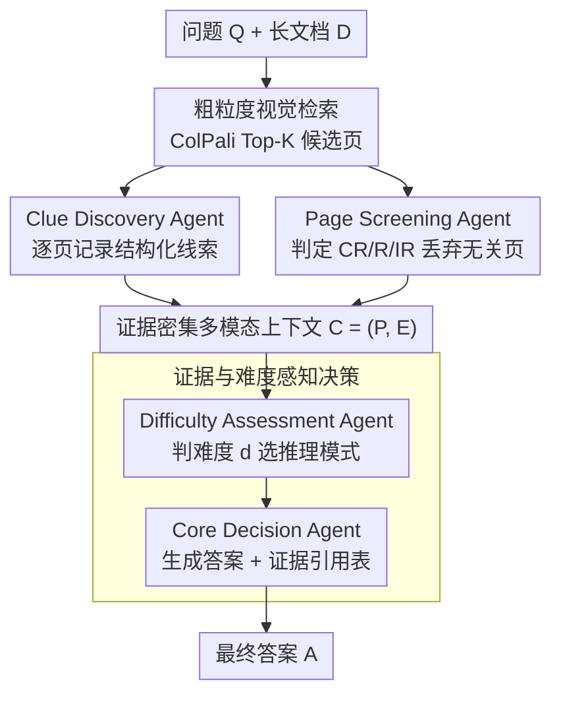

# Resolving Evidence Sparsity: Agentic Context Engineering for Long-Document Understanding

**会议**: CVPR 2026  
**论文**: [CVF Open Access](https://openaccess.thecvf.com/content/CVPR2026/html/Liu_Resolving_Evidence_Sparsity_Agentic_Context_Engineering_for_Long-Document_Understanding_CVPR_2026_paper.html)  
**代码**: 未公开  
**领域**: Agent / 多模态VLM / 文档理解  
**关键词**: 长文档理解, 多智能体, 上下文工程, 证据稀疏, 免训练

## 一句话总结
针对长文档问答里"关键证据稀疏散落、冗余上下文干扰判断"的痛点，提出免训练多智能体框架 SLEUTH，用"检索→线索挖掘+视觉筛选→难度评估→决策"的 coarse-to-fine 流水线，把噪声满满的 top-K 检索页蒸馏成简洁且证据密集的多模态上下文，在四个长文档基准上以模型无关方式刷到 SOTA。

## 研究背景与动机

**领域现状**：视觉语言模型（VLM）已成为文档理解的主流，在单页文档（DocVQA、ChartQA 等）上表现强劲。处理长文档时，常见做法分三条路线——增强 agent 推理（如 MACT 通过多 agent 协作与训练）、提高检索召回（各类 RAG 把相关页喂给 VLM）、以及二者结合（如 MDocAgent）。

**现有痛点**：长文档里大部分内容是冗余的，而回答一个问题真正需要的证据往往**稀疏且跨页跨模态散落**。纯推理增强方法仍把长上下文整体塞进模型，冗余信息干扰推理；RAG 虽然过滤出相关页，但检索结果里**依旧夹带大量无关信息**，VLM 很难从中精确定位那几条关键证据；二者结合的方法，推理时面对的上下文仍然又长又吵。

**核心矛盾**：作者点出一个被忽视的事实——即便 MLLM 拥有超长上下文窗口，**性能也会随上下文长度增加而急剧下降**。也就是说，把更多检索页直接堆给模型并不能线性提升效果，反而会放大幻觉。问题的根本不在"召回多少"或"推理多强"，而在喂进去的上下文质量。

**本文目标**：从"上下文工程"（context engineering）的视角，把"如何从海量内容里精确定位有用证据、并组织成适合推理的高质量上下文表示"作为长文档理解的核心子问题来攻。

**切入角度**：以页为最小处理单元，逐页挖掘证据、逐页筛选视觉相关性，让有效上下文长度**保持固定**，从而能在不放大幻觉的前提下随检索 top-K 增大而扩展精度。

**核心 idea**：用一组协作 agent 把"长而吵"的检索结果蒸馏成"短而证据密集"的多模态上下文——不去改 VLM、不去训练，纯靠免训练的层次化精炼（hierarchical refinement）即插即用地提升文档理解。

## 方法详解

### 整体框架
给定问题 $Q$ 与文档 $D=\{p_1,\dots,p_N\}$（每页 $p_i$ 是一张 RGB 图像），SLEUTH 以免训练、即插即用的方式生成答案 $A$。整条流水线是 coarse-to-fine：先用标准视觉检索器把搜索空间从 $N$ 页收缩到 top-K 候选页（$K\ll N$）；然后两个互补 agent 并行工作——线索发现 agent 逐页记录结构化文本/视觉线索，页面筛选 agent 判定每页与问题的相关性并丢弃无关页图；难度评估 agent 分析问题复杂度、产出推理策略指令；最后核心决策 agent 在蒸馏后的证据密集上下文上生成答案并附证据引用表。

### 关键设计

**1. 粗粒度视觉检索：先把搜索空间砍到 Top-K**

长文档动辄上百页，直接逐页跑 agent 既慢又贵，所以第一步要快速定位最可能相关的少量页。SLEUTH 直接复用现成的 ColPali-v1.3 做纯视觉的页级检索：把问题编码成文本 embedding 序列 $q_t$，每页图像编码成视觉 embedding 集合 $v_{i,j}$，页级相关度用晚交互（late-interaction）的最大相似度求和定义为 $s_i=\sum_{t=1}^{n_Q}\max_{1\le j\le n_i}\langle q_t,v_{i,j}\rangle$，再取 top-K 得到候选集 $P_K$。这一步保证 $K\ll N$、大幅压缩后续计算量，且整页以图像表示、保留版式结构——这与后两个 agent 的细粒度感知一脉相承。检索器本身是即插即用组件，不是本文创新，但它是后续精炼的入口。

**2. Clue Discovery Agent + Page Screening Agent：并行互补地把噪声页蒸馏成证据密集上下文**

这是 SLEUTH 的核心。检索后的候选集仍夹带大量冗余，必须进一步分离"真正含关键证据的部分"。两个 agent 并行、在不同层次互补：**线索发现 agent** 以页为最小单元，逐页在区域级别（文本行、表格单元、图表区域）抽取与问题相关的证据，输出**结构化记录** $e_{i,m}=(\text{page}=i,\ \text{region}=w_{i,m},\ \text{content}=c_{i,m},\ \text{insight}=k_{i,m},\ \text{rationale}=r_{i,m})$——每条线索不仅带语义内容，还保留来源页、空间位置、采纳理由以及完整的 CoT 推理轨迹，便于后续溯源与可解释性核验。**页面筛选 agent** 则对每个候选页做整页的语义—视觉联合推理，输出离散相关性标签 $y_i\in\{\text{CR},\text{R},\text{IR}\}$（完全相关 / 相关 / 无关）外加解释 $r_i^{\text{page}}$，只保留 $y_i\in\{\text{CR},\text{R}\}$ 的页：$P=\{p_i\in P_K\mid y_i\in\{\text{CR},\text{R}\}\}$。保留页数随问题动态变化——例如在 LongDocURL 上 top-5 检索时平均只留 2.1 页有效视觉页。二者合成多模态上下文 $C=(P,\ E=\bigcup_{p_i\in P_K}E_i)$：前者给细粒度可解释的文本证据，后者保证关键视觉元素（表/图/插画）被充分保留。当某些问题导致所有页图都被滤掉（缺视觉模态）或问题本身与文档无关（不可答），系统会按上下文里视觉模态的有无自动切换喂给决策 agent 的 prompt 模板，避免"给了视觉指令却没有视觉输入"的不一致。

**3. Difficulty Assessment Agent + Core Decision Agent：证据与难度感知的自适应决策**

不同问题需要不同深度的推理——有的直接从聚合证据就能答，有的要跨页整合或数值计算。**难度评估 agent** 先判定任务难度 $d=\arg\max_{c\in\{0,1\}}f(c;Q,C)$ 并产出指令集 $\Gamma_d=\Psi(Q,C,d)$：$d=0$ 走普通模式（Instruct 型模型，适合大多数基础查询），$d=1$ 走推理模式（Thinking 型模型，能跨页多步推理与数值计算）；$\Gamma_d$ 概括关键推理线索（如"需跨页聚合""涉及表格计算""需趋势比较"）。**核心决策 agent** 接收 $\Gamma_d$ 与结构化上下文 $C$，调用对应类型的 MLLM 生成最终答案 $A^\star=\Phi(Q,C,\Gamma_d)$，同时输出证据引用表 $S=\{\text{页码},\text{证据内容},\text{证据来源}\}$ 保证推理可验证。这套难度感知的模型选择机制让系统在保持免训练的同时，按问题复杂度动态平衡效率与推理深度。

> ⚠️ **框架↔关键设计一致**：框架图里 ColPali 检索是脚手架入口（设计 1 交代），两个并行 agent（设计 2）、难度评估+核心决策（设计 3）逐一对应；图中"证据密集多模态上下文 $C$"是两并行 agent 的产物、不是独立组件。

### 一个完整示例
以一个跨页表格问题为例走一遍：长文档 100 页 → ColPali 检索取 top-5 候选页 → 线索发现 agent 逐页记录结构化线索（"Clue1：第 1 页介绍模型由视觉编码器+projector+LLM 组成；Clue2：第 2 页给出数据集构成……Clue5：未发现证据"），页面筛选 agent 把 5 页判为 CR/R/IR，只留下 2 页含相关表/图的页、丢掉 3 张无关图 → 合成证据密集上下文 $C$ → 难度评估 agent 判这是"涉及表格计算"的难题（$d=1$）、产出指令"需跨页聚合+表格计算" → 核心决策 agent 启用 Thinking 模式，在固定长度的精炼上下文上推理出答案，并附"第 X 页 / 证据内容 / 来源"的引用表。整个过程有效上下文长度始终被压在少数几页，不随原文 100 页膨胀。

## 实验关键数据

### 主实验
默认 backbone 为 Qwen3VL-8B、检索器为 ColPali-v1.3、top-5。在 MMLongBench-Doc 上按证据类型分组评测（"None"表示不可答问题）：

| 数据集 | 指标 | SLEUTH | 次优(MoLoRAG) | 提升 |
|--------|------|--------|---------------|------|
| MMLongBench-Doc | Avg. Acc(%) | 52.77 | 48.75 | +4.02 |
| MMLongBench-Doc | Pure-text | 59.26 | 54.86 | +4.40 |
| MMLongBench-Doc | None | 67.38 | 51.67 | +15.71 |
| LongDocURL | Avg. Acc(%) | 59.96 | 57.57 | +2.39 |
| PaperTab | Acc(%) | 43.09 | 42.59 | +0.50 |
| FetaTab | Acc(%) | 70.46 | 69.41 | +1.05 |

相对各 baseline 在 MMLongBench-Doc 上的绝对提升：vs M3DocRAG +6.87、vs MDocAgent +4.95、vs MoLoRAG +4.02、vs Base +6.01、vs Direct(整篇直读) +10.06。作者还指出，SLEUTH 在 Pure-text 与 Figure 类别增益尤为显著——说明"逐页、记证据、筛页"的短上下文流程能有效抑制冗余长上下文带来的误导与幻觉。⚠️ 与商用闭源模型（如 GPT-5 直读长文档）的对比图原文记为 Figure 3，结论是 SLEUTH 仍保持明显优势，"高质量证据上下文比单纯堆大模型更关键"，具体数值以原文为准。

### 消融实验
在 MMLongBench-Doc 与 LongDocURL 上逐步开启各 agent（C=线索发现、P=页面筛选、D=难度评估）并改变检索 top-K：

| 配置 (Qwen3-VL-8B) | MMLongBench Avg. | LongDocURL Avg. | 说明 |
|------|------|------|------|
| Base (仅检索喂页) | 46.76 | 55.18 | 起点 |
| SLEUTH (C) | 48.61 | 57.15 | 加线索发现 agent |
| SLEUTH (P) | 51.29 | 59.49 | 加页面筛选 agent |
| SLEUTH (Top1) | 44.92 | 52.88 | 全 agent，仅检索 1 页 |
| SLEUTH (Top3) | 49.65 | 58.38 | 全 agent，检索 3 页 |
| SLEUTH (Top5) | **52.77** | **59.96** | 完整模型，最佳 |

### 关键发现
- **每个 agent 都正贡献**：从 Base 起逐个加 C、P，平均准确率单调上升（MMLongBench 46.76→48.61→51.29），完整 Top5 最高，验证层次化精炼范式的有效性。
- **精度可随 top-K 扩展**：因为有效上下文长度被固定，top-1→top-3→top-5 准确率稳步提升（44.92→49.65→52.77）而非被冗余淹没——这正是"页级固定上下文"设计的直接红利；top-1 反而最差，说明召回太少会漏证据。
- **模型无关**：换成 GLM-4.1V-Thinking-9B 作 backbone，SLEUTH(C) 仍能在 Base 上提升（MMLongBench 53.05→53.22、LongDocURL 57.75→58.08），证明框架可叠加在不同 VLM 上。

## 亮点与洞察
- **把"上下文工程"显式立为长文档理解的第一性问题**：不同于卷召回或卷推理，作者抓住"MLLM 性能随上下文变长而崩"这一被忽视的事实，主攻喂进去的上下文质量，思路清爽且解释力强。
- **结构化证据记录可溯源**：每条线索都带 region/content/insight/rationale/CoT，天然支持证据引用表 $S$，让答案可验证——这是把"可解释性"做进流水线而非事后补的好例子。
- **页级固定上下文 = 精度随召回扩展**：这个设计让 top-K 越大越好而不放大幻觉，是个可迁移的 trick——任何"检索越多越吵"的多模态 RAG 都能借鉴"逐页蒸馏、保持有效上下文长度恒定"。
- **难度感知的 Instruct/Thinking 双模式切换**：用一个轻量判别把简单题交给快模型、难题交给慢思考模型，免训练地平衡效率与深度，工程上很实用。

## 局限与展望
- **依赖 backbone 的单图推理与判别能力**：线索抽取、CR/R/IR 判定、难度判别都靠 VLM 自身完成，弱 backbone 上各 agent 的判断质量没有保障，误判会沿流水线传播。
- **逐页串行的开销**：虽然有效上下文被压短，但要对每个候选页分别跑线索发现+页面筛选，agent 调用次数随 top-K 线性增长，延迟/成本未在正文充分量化。⚠️ 具体推理耗时以原文/附录为准。
- **难度只二分（$d\in\{0,1\}$）**：现实问题难度是连续谱，粗暴二分可能把中等难度题误派模式；多档或连续难度估计或许更优。
- **筛选可能误删证据**：页面筛选把整页判 IR 会直接丢弃，若关键证据藏在被判 IR 的页中则不可逆丢失，召回与精炼之间仍有 trade-off。

## 相关工作与启发
- **vs MACT（推理增强多 agent）**：MACT 靠 agent 协作+训练强化推理，但答题时仍吃整段长上下文、冗余干扰；SLEUTH 免训练且先把上下文蒸馏短，主攻点不同。
- **vs M3DocRAG / MoLoRAG（RAG）**：它们提高召回、检索相关页，但检索结果仍含大量无关信息；SLEUTH 在检索之后再加一层 agent 精炼，把"召回的页"进一步压成"证据密集的上下文"。
- **vs MDocAgent（RAG+多 agent 结合）**：MDocAgent 用独立文本/图像 pipeline 分布推理，但推理时上下文依旧又长又吵；SLEUTH 用页级固定上下文+难度感知决策，避免长上下文导致的性能衰减。
- **vs DeepSeek-OCR 的统一视觉映射**：借鉴"用视觉表示压缩上下文同时保留版式线索"的直觉，SLEUTH 整页以图像表示来保结构、支持细粒度感知。

## 评分
- 新颖性: ⭐⭐⭐⭐ 首个从"构建简洁证据密集上下文"视角切长文档理解，免训练即插即用，角度新但单个组件多为成熟 agent 范式的组合。
- 实验充分度: ⭐⭐⭐⭐ 四基准 + 多 backbone + 逐 agent/top-K 消融较完整，但缺推理成本量化、难度判别本身的准确率分析。
- 写作质量: ⭐⭐⭐⭐ 动机清晰、流水线讲得明白，公式与算法齐全；部分图注与商用对比数值需查原文。
- 价值: ⭐⭐⭐⭐ "页级固定上下文 + 证据蒸馏"对多模态长文档 RAG 有直接可复用价值，工程落地友好。

<!-- RELATED:START -->

## 相关论文

- [\[CVPR 2026\] Think, Then Verify: A Hypothesis-Verification Multi-Agent Framework for Long Video Understanding](think_then_verify_a_hypothesis-verification_multi-agent_framework_for_long_video.md)
- [\[CVPR 2026\] HAVEN: Hierarchical Long Video Understanding with Audiovisual Entity Cohesion and Agentic Search](haven_hierarchical_long_video_understanding_with_audiovisual_entity_cohesion.md)
- [\[ACL 2025\] Self-Taught Agentic Long-Context Understanding](../../ACL2025/llm_agent/self_taught_agentic_long_ctx.md)
- [\[CVPR 2026\] ORCA: Orchestrated Reasoning with Collaborative Agents for Document Visual Question Answering](orca_orchestrated_reasoning_with_collaborative_agents_for_document_visual_questi.md)
- [\[ICLR 2026\] Agentic Context Engineering: Evolving Contexts for Self-Improving Language Models](../../ICLR2026/llm_agent/agentic_context_engineering_evolving_contexts_for_self-improving_language_models.md)

<!-- RELATED:END -->
