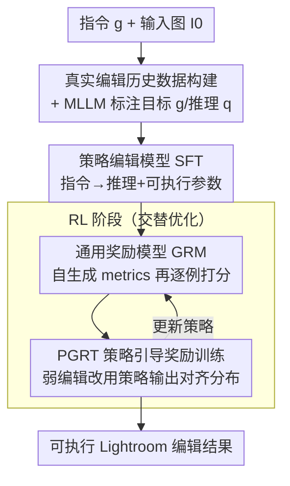

# RetouchIQ: MLLM Agents for Instruction-Based Image Retouching with Generalist Reward

**会议**: CVPR 2026  
**论文**: [CVF Open Access](https://openaccess.thecvf.com/content/CVPR2026/html/Wu_RetouchIQ_MLLM_Agents_for_Instruction-Based_Image_Retouching_with_Generalist_Reward_CVPR_2026_paper.html)  
**代码**: 未公开  
**领域**: Agent / 多模态VLM / 图像修饰  
**关键词**: MLLM agent, 图像修饰, 强化学习, 通用奖励模型, Lightroom

## 一句话总结
针对"创意修图本质主观、单一参考图的规则化奖励不可靠"的痛点，提出 RetouchIQ：让 MLLM agent 把自然语言指令翻译成可执行的 Lightroom 参数，并用一个会"逐例自生成评价 metrics 再打分"的通用奖励模型（GRM）配合策略引导奖励训练（PGRT）做 RL，在自建 RetouchEval 与 MIT-Adobe5K 上的语义一致性与感知质量都超过 MLLM/扩散基线。

## 研究背景与动机

**领域现状**：图像修饰（retouching）要在调整色调、色彩、光照的同时保住真实感与语义一致。早期方法学习预测可解释的编辑操作步骤，但几乎无法捕捉用户特定意图、处理不了多样的文本指令；近期扩散模型能读懂自然语言指令做增强/编辑，却因采样的随机性常常无意改动原图内容与环境。最新一波则是让 MLLM agent 去操控专业修图软件（如 Adobe Lightroom、PicsArt）做工具调用。

**现有痛点**：现有 MLLM-agent 方案多用强化学习去**复现人工编辑结果**，但创意修图天生主观——同一条指令可以有多个同样好的结果，不同用户会给出彼此不同却都有效的编辑。于是把训练锚定到**单一参考编辑**的规则化、像素级奖励（如与 GT 的像素差）就变得不可靠：好的编辑可能因为和参考图差得多而被打低分，差的编辑反而可能因偶然接近参考而得高分。

**核心矛盾**：可验证奖励（verifiable reward）在数学、编程这类有客观对错的领域很有效，但在主观、开放式的修图里失灵——不存在唯一可验证的 ground truth。强行用基于像素/参考的比较，捕捉不到语义质量或艺术偏好。

**本文目标**：（1）造一个能反映主观审美、对同一指令的多种合理结果都给出公允评价的奖励信号；（2）让 MLLM agent 把高层审美目标可靠地落到精确的 Lightroom 参数控制上；（3）解决奖励模型训练时的分布偏移问题。

**切入角度**：借鉴 LLM 领域的"通用奖励模型"思路——不再用固定规则，而让一个 RL 微调过的 MLLM 在**逐例（case-by-case）生成一组评价 metrics** 后再据此打分，用多模态推理给出标量反馈。

**核心 idea**：用"会自己定标准再打分"的通用奖励模型（GRM）替代"对单一参考图算像素差"的规则奖励来驱动 RL，并用 PGRT 把奖励模型对齐到策略模型实际产出的编辑分布上。

## 方法详解

### 整体框架
RetouchIQ 含一个**策略模型**，把用户的自然语言指令翻译成两个输出：一段描述语义解读与审美意图的**推理轨迹**，以及一串可在 Lightroom 运行时执行的**参数化编辑操作**（如 `{exposure=+0.9; contrast=-30}`）。训练分两阶段：先 SFT 让模型从真实用户编辑里学会"指令→推理→编辑参数"的映射；再 RL 让模型自探索多样推理路径与编辑方案、在 GRM 的标量反馈下逐步发现更优策略。GRM 自身也经 SFT+RL 训练，并用 PGRT 把它对齐到策略分布；训练时策略模型与奖励模型**交替优化**、互相增强。

### 关键设计

**1. 真实编辑历史的数据构建 + MLLM 标注：让训练数据贴近真实修图场景**

一条理想训练样本要含前后图对 $(I_0,I)$、自然语言编辑目标 $g$、规划最优策略的推理过程 $q$、以及 Lightroom 里的参数编辑序列 $e$。作者直接从 Lightroom 的**真实用户编辑历史**里采集 $(I_0,I)$ 与对应 $e$——不同于已有工作用预设 preset 合成 after 图，真实人类编辑天然更贴近现实。源数据缺的两样——用户当时的编辑目标 $g$ 和指导其用工具的推理 $q$——交给一个**固定的 MLLM 标注器**补：标注器吃三元组 $(I_0,I,e)$，先据前后差异与编辑步骤反推意图 $g$，再生成模拟 agent 如何推理并产出 $e$ 的推理 $q$，最后系统化过滤掉意图不清或意图与推理不一致的样本。最终策略模型训练集含 **190K** 图像-指令对，每图配三条长度/复杂度不同的指令变体增加多样性。

**2. 策略编辑模型：指令→推理+可执行 Lightroom 参数的 SFT**

策略模型从预训练 MLLM backbone（Qwen2.5-VL-7B）初始化，用上述指令-推理-编辑语料做 SFT。给定输入图 $I_0$ 与指令 $g$，模型自回归生成文本推理 $q$ 与结构化编辑步骤 $e$，目标是负对数似然 $L_{\text{SFT}}=-\sum_t\log p_\theta(y_t\mid y_{<t},I_0,g)$，其中输出序列同时含自然语言推理与结构化编辑操作。这一阶段让模型学到"语言审美意图 ↔ 可执行编辑参数"的语义落地映射，为后续 RL 提供强初始化。相比黑箱扩散，这种"先推理再给参数"的方式可控、透明、可执行。

**3. 通用奖励模型（GRM）：自生成评价 metrics 再逐例打分**

RL 的成败高度依赖奖励质量，而成功的编辑标准随图随指令而变，固定规则给不出。GRM 是一个 MLLM 奖励模型，吃前后图对 $(I_0,\text{Execute}(I_0,e))$ 与指令 $g$，**先自生成一组描述"成功编辑该具备哪些关键特征"的 metrics**（如"应有秋日色调黄橙调（25%）""白平衡良好（20%）"），**再据这些 metrics 给出标量奖励**（如各项打分加权 $6\times25\%+8\times20\%\dots=7.3$）。GRM 同样先 SFT 后 RL：SFT 阶段用配对数据 $(I_0,I,I_w)$（强编辑 $I$ 来自真实用户、弱编辑 $I_w$ 由冻结 MLLM 扰动编辑参数生成且经过滤保证确实更差），以自回归损失 $L_{\text{SFT}}^{\text{reward}}=-\sum_t\log p_\phi(y_t\mid y_{<t},I_0,I,I_w,g)$ 学会"先解释审美 metrics 再打分"。策略 RL 的目标是最大化期望奖励 $J(\theta)=\mathbb{E}_{q,s\sim\pi_\theta}[r_\phi(g,I_0,\text{Execute}(I_0,e))+r_{\text{format}}(q,s)]$，其中 $\text{Execute}(\cdot)$ 表示把预测编辑送进 Lightroom 引擎执行得到结果图。这样奖励就能逐例适配不同图像/指令、给出反映主观审美的精确反馈，而非死磕单一参考。

**4. PGRT 策略引导奖励训练：消除奖励模型的训练分布偏移**

GRM 的 SFT 依赖扰动生成的弱编辑，但作者发现扰动多是对曝光/色温的**单点调整**，而策略模型实际产出的常是**组合且复杂的编辑**——两者存在训练分布偏移，导致奖励模型评估真实策略输出时变差。PGRT 的做法是把奖励模型训练在与策略编辑分布一致的数据上：RL 阶段用**策略模型生成的结果**替换扰动图来充当弱编辑 $I_w$，奖励函数变为 $J(\phi)=\mathbb{E}_{m,r,r_w\sim\pi_\phi}[\mathbb{I}[r>r_w]+r_{\text{format}}(m,r,r_w)]$，$\mathbb{I}[\cdot]$ 是 0-1 指示——当模型错误地给更弱的编辑打更高分时就惩罚它。因为 PGRT 依赖策略输出，训练时策略模型与奖励模型**交替优化**逐步互相增强；首次训奖励模型时策略尚未训好，故 RL 阶段只用扰动编辑冷启动。

> ⚠️ **框架↔关键设计一致**：图中"数据构建"对应设计 1、"策略模型 SFT"对应设计 2、RL 子图里的 GRM 与 PGRT 分别对应设计 3、4 且二者交替更新；"可执行 Lightroom 编辑结果"是流水线输出、非独立模块。

### 一个完整示例
以指令"我想要它有秋日氛围、自然的感觉"为例：策略模型读 $I_0$ + 指令，输出推理（"先调曝光突出主体……提高色温营造暖调")与编辑参数 $e$ → Lightroom 执行得到 after 图 → GRM 先自生成 metrics（"应有秋日黄橙调（25%）""白平衡良好（20%）"……）→ 对策略产出的 after-u（强）与 after-w（弱，PGRT 下由策略自身另一次采样提供）分别打分，如 after-u 整体 8.2、after-w 5.4 → 据 $\mathbb{I}[r>r_w]$ 给策略反馈、梯度上升更新；策略与 GRM 交替迭代，逐步收敛到更符合指令审美的编辑参数。

## 实验关键数据

策略与奖励模型均基于 Qwen2.5-VL-7B；MLLM 标注器/扰动器用 GLM-4.5V。自建基准 **RetouchEval**（300 条指令-图对，分质量增强/风格转换/局部修饰三档）与公开 **MIT-Adobe5K**（400 张测试图）。指标定义：**L1/L2** 为输出与 GT 图的差异（越低越好）；**SC**=语义一致性、**PQ**=感知质量（均由 GLM-4.5V 评，越高越好）；**O**=综合；MIT-Adobe5K 用 PSNR/LPIPS/SSIM。

### 主实验
RetouchEval 三档场景对比（节选 SC/PQ/O，越高越好）：

| 方法 | 质量增强 O | 风格转换 O | 局部修饰 O | 类型 |
|------|------|------|------|------|
| FLUX-PRO | 6.10 | 6.42 | 6.22 | 扩散 |
| GPT-5 | 6.62 | 6.82 | 6.47 | 通用 MLLM |
| Gemini-2.5 | 6.64 | 6.05 | 6.31 | 通用 MLLM |
| MonetGPT | 6.78 | 5.95 | 6.48 | MLLM agent |
| JarvisArt | 6.90 | 7.13 | 6.42 | MLLM agent |
| RetouchIQ-GRM | **7.51** | **7.31** | **6.65** | 本文 |

MIT-Adobe5K（PSNR↑/LPIPS↓/SSIM↑）：

| 方法 | SSIM↑ | LPIPS↓ | PSNR↑ |
|------|------|------|------|
| GPT-5 | 0.72 | 0.26 | 20.82 |
| MonetGPT | 0.82 | 0.17 | 23.10 |
| JarvisArt | 0.76 | 0.23 | 21.03 |
| RetouchIQ-SFT | 0.84 | 0.20 | 22.37 |
| RetouchIQ-GRM | **0.86** | **0.16** | **23.14** |

### 消融实验
奖励信号方式的对照（RetouchEval 质量增强档，SC/PQ 越高越好）：

| 配置 | 质量增强 SC↑ | 质量增强 PQ↑ | 质量增强 O↑ | 说明 |
|------|------|------|------|------|
| RetouchIQ-SFT | 6.71 | 6.67 | 6.69 | 仅 SFT，无 RL |
| RetouchIQ-Rule | 7.14 | 6.61 | 6.87 | RL 用规则化奖励 |
| RetouchIQ-GRM | **7.57** | **7.48** | **7.51** | RL 用通用奖励模型 |

### 关键发现
- **GRM > 规则奖励 > 仅 SFT**：质量增强档综合分 6.69→6.87→7.51 逐级上升，说明通用奖励模型比规则化奖励更能驱动主观修图，且 RL 阶段确实带来增益。
- **PGRT 同时改善奖励与策略**：在 Figure 5（线图为奖励模型准确率、柱为对应策略模型得分）中，PGRT 把奖励模型分布拉向真实策略产出数据、在该集上准确率最高，进而训出综合表现最好的策略模型——验证"对齐策略分布"的核心假设。⚠️ 具体数值以原文图为准。
- **跨基准泛化**：在与训练指令集不同的 MIT-Adobe5K 上 RetouchIQ-GRM 仍全面领先（SSIM 0.86/LPIPS 0.16/PSNR 23.14），说明方法不止过拟合自建数据；RL+通用奖励对所有指标都带来一致提升。
- ⚠️ 作者注意到 JarvisArt 语义一致性分有时偏高，并在附录做了 case study 分析这一现象（正文未展开）。

## 亮点与洞察
- **把"通用奖励模型"从 LLM 搬到多模态修图**：让奖励模型先自生成逐例 metrics 再打分，巧妙绕开"主观任务没有唯一可验证 GT"的死结，是这篇最让人"啊哈"的地方。
- **PGRT 直指奖励模型的分布偏移**：明确指出扰动弱编辑（单点调整）与策略真实输出（组合复杂编辑）的分布差，并用策略输出替换扰动图来对齐——这个"奖励模型要训在策略分布上"的洞察可迁移到任何 RLHF/RLAIF 的奖励训练。
- **可执行 + 可解释的修图**：输出是 Lightroom 参数而非像素，编辑可控、可逆、可审计，比黑箱扩散更适合专业修图工作流。
- **真实人类编辑历史作数据源**：相比 preset 合成，真实前后对天然贴近现实，配 MLLM 反推意图/推理来补齐缺失标注，是一条务实的数据构建范式。

## 局限与展望
- **奖励模型本身是 MLLM，可能有审美偏见**：GRM 自生成的 metrics 与打分继承 backbone 的偏好，评测里 SC/PQ 又由 GLM-4.5V 打分，存在"裁判与奖励同源"的潜在循环，客观性需更多人评佐证（作者把人评放在附录）。
- **绑定 Lightroom 参数空间**：方法依赖 Lightroom 的工具/参数接口，迁移到其它修图软件或像素级局部编辑需重做数据与动作空间。
- **交替训练成本与稳定性**：策略与奖励模型交替优化、且 GRM 要先 SFT 后 RL，整体训练管线复杂，收敛稳定性与算力开销正文未充分量化。
- **局部修饰增益相对小**：三档里局部修饰的综合分提升最有限（6.65 vs JarvisArt 6.42），细粒度空间定位仍是难点。

## 相关工作与启发
- **vs 规则/可验证奖励（数学、编程类）**：可验证奖励在有客观对错的领域有效，但在主观修图失灵；本文用 GRM 的逐例 metrics 取代固定规则。
- **vs 扩散类编辑（FLUX-Pro 等）**：扩散能读指令但采样随机、常破坏原图结构与身份；RetouchIQ 输出可执行参数、保结构且可解释。
- **vs MLLM agent（JarvisArt / MonetGPT）**：JarvisArt 同样用 Lightroom，但用复现人工编辑的规则奖励、对定制化请求（如黑白转换、色温）常出错；MonetGPT 偏质量增强、风格转换弱。RetouchIQ 用通用奖励 + PGRT 在语义一致性与感知质量上整体领先。
- **vs 通用奖励模型（LLM 领域）**：把"LLM 当裁判自评打分"扩展为"MLLM 通过动态生成的评价 metrics 评图"，是该思路在视觉创意任务上的延伸。

## 评分
- 新颖性: ⭐⭐⭐⭐ 首个用通用奖励模型攻"主观修图无唯一 GT"的框架，PGRT 对齐分布的洞察扎实；但 GRM 思路本身借自 LLM 领域。
- 实验充分度: ⭐⭐⭐⭐ 自建 RetouchEval + 公开 MIT-Adobe5K、对比 6 类基线、含规则 vs GRM 与 PGRT 消融；但训练成本、奖励准确率细节、人评多放附录。
- 写作质量: ⭐⭐⭐⭐ 动机递进清晰、流水线与公式齐整；部分图（Fig.3/4/5）信息密集需对照原文。
- 价值: ⭐⭐⭐⭐ 可执行+可解释的专业修图 agent 有实用前景，PGRT 的奖励对齐思路对更广的 RL 训练有借鉴意义。

<!-- RELATED:START -->

## 相关论文

- [\[AAAI 2026\] PerTouch: VLM-Driven Agent for Personalized and Semantic Image Retouching](../../AAAI2026/llm_agent/pertouch_vlm-driven_agent_for_personalized_and_semantic_image_retouching.md)
- [\[CVPR 2026\] NitroGen: An Open Foundation Model for Generalist Gaming Agents](nitrogen_an_open_foundation_model_for_generalist_gaming_agents.md)
- [\[CVPR 2026\] Universal Guideline-Driven Image Clustering via a Hybrid LLM Agent](universal_guideline-driven_image_clustering_via_a_hybrid_llm_agent.md)
- [\[CVPR 2026\] REALM: An MLLM-Agent Framework for Open World 3D Reasoning Segmentation and Editing on Gaussian Splatting](realm_mllm_agent_3d_reasoning_gaussian.md)
- [\[ACL 2026\] Exploring Reasoning Reward Model for Agents](../../ACL2026/llm_agent/exploring_reasoning_reward_model_for_agents.md)

<!-- RELATED:END -->
