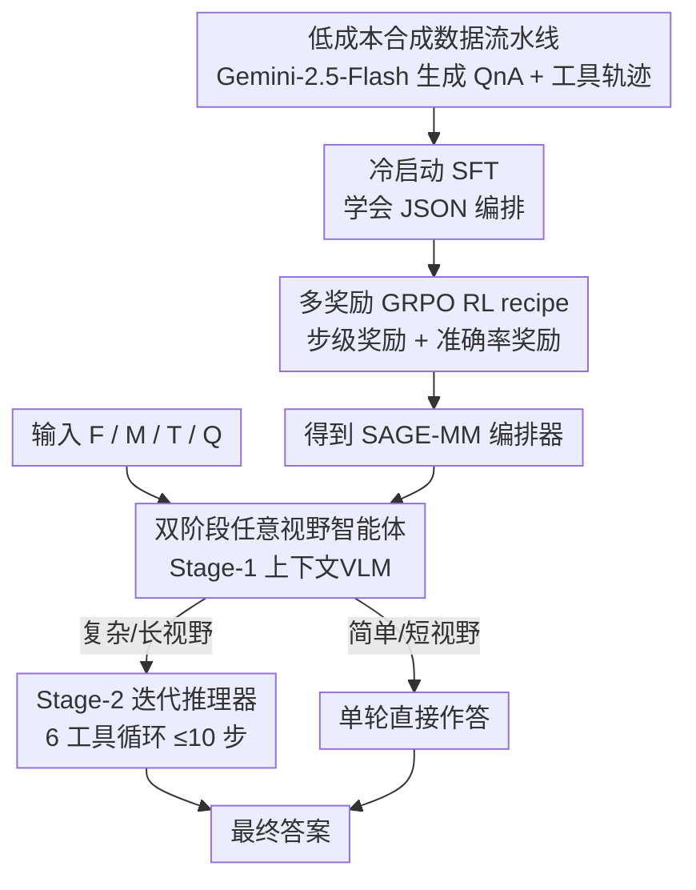

# SAGE: Training Smart Any-Horizon Agents for Long Video Reasoning with Reinforcement Learning

**会议**: CVPR 2026  
**论文**: [CVF Open Access](https://openaccess.thecvf.com/content/CVPR2026/html/Jain_SAGE_Training_Smart_Any-Horizon_Agents_for_Long_Video_Reasoning_with_CVPR_2026_paper.html)  
**代码**: https://github.com/allenai/SAGE  
**领域**: Agent / 视频理解 / LLM推理  
**关键词**: 长视频推理、任意视野智能体、工具调用、GRPO 强化学习、合成数据

## 一句话总结
SAGE 把长视频推理从"一口气塞进上千帧、单轮直答"的 DIRECT 范式，改造成"像人一样按需多轮检索、简单题直接答"的 AGENT 范式：用一个会编排 6 种工具的 orchestrator VLM（SAGE-MM）+ 低成本合成数据 + 多奖励 GRPO 后训练，在自建的 SAGE-Bench 上开放式问答提升最高 6.1%、>10 分钟长视频最高提升 14.6%。

## 研究背景与动机

**领域现状**：当前 SOTA 视频推理模型（Gemini-2.5、Qwen3-VL 等）几乎都走 DIRECT 范式——给定从视频里采样的一批帧（常常上千帧），一次序列预测直接吐出答案，相当于"把整段长视频从头看到尾"。

**现有痛点**：人类面对一段 2 小时的视频不会傻看全程，而是迭代式地"跳着看、回退、放大某段"去定位目标信息。把整段长视频一次喂进模型既昂贵又低效；而少数走 AGENT 范式的工作（VideoMind、VideoExplorer 等）又**过度依赖单一的时序定位（temporal grounding）工具**，试图在整段视频上 grounding 一个事件——但长视频上缺乏鲁棒的 grounding 模型，这条路常常失效。此外这些 agent 系统被"过度工程化"地优化到只擅长多选题（MCQ），在真实的开放式问答上反而拉胯。

**核心矛盾**：视频时长是高度可变的（几十秒到几小时），一个理想系统应当对简单/短视频问题**直接作答**、对复杂/长视频问题**多轮检索**——即具备 "any-horizon（任意视野）" 能力。但现有 RL 后训练 recipe 是为 DIRECT 模型设计的，面对视频时长动态变化时优化不稳定；而开放式问答又缺乏可验证奖励（RLVR 在数学/MCQ 上靠字符串匹配给奖励，到了开放式生成就失灵）。

**本文目标**：回答"能否在 AGENT 范式下用 RL 有效训练长视频推理模型"，并把它拆成三个子问题——训练数据（A1）、高效系统设计（A2）、多轮推理的 RL recipe（A3）。

**切入角度**：从人类"任意视野推理"的行为出发——既会跳着看长视频、也会把短视频一次看完。系统不该死磕整段视频的时序定位，而应像人一样借助外部知识（web 搜索）和语音转写缩小搜索空间，再在**短子片段**内做精确定位。

**核心 idea**：用一个能在"单轮直答"和"多轮工具调用"之间自主切换的 orchestrator VLM（SAGE-MM）做编排，配上低成本合成数据冷启动 + 多奖励 GRPO 后训练，把 any-horizon 推理能力"灌进"模型。

## 方法详解

### 整体框架
SAGE 是一个长视频推理 **agent 系统**，核心是 orchestrator VLM——SAGE-MM。系统接收 4 路输入：从视频均匀采样的 128 帧（F）、视频元数据（M，含路径与时长）、工具定义（T）、用户问题（Q）。SAGE-MM 分两个角色阶段运行：**Stage-1（上下文 VLM）** 先理解视频上下文与问题意图，要么直接给出答案（短视野），要么发起第一个工具调用；**Stage-2（迭代推理器）** 则在最多 10 步的循环里，依据历史工具结果不断决定"还能不能答"或"再调哪个工具"，直到给出最终答案。两阶段共享同一组 6 个工具：web-search、parse-website、transcribe-speech、ground-event、extract-video-parts、analyze。关键差异是——SAGE **不**在整段视频上 grounding，而是自主预测"粗事件边界"后，在**不超过 10 分钟的短子片段**内做 grounding。

要让一个开源 VLM 胜任 SAGE-MM 的编排角色，需要训练。训练侧是另一条流水线：用 Gemini-2.5-Flash 低成本合成 QnA + 工具调用轨迹 → 冷启动 SFT 让模型学会按 JSON 格式编排 → 多奖励 GRPO 后训练注入 any-horizon 能力。三个关键设计——智能体系统、合成数据、RL recipe——正对应下图三条主线。

### 关键设计

**1. 双阶段任意视野智能体系统：让模型像人一样按需切换单轮/多轮**

针对"DIRECT 范式一次塞满帧、低效且对长视频失效"和"现有 agent 过度依赖整段 grounding"这两个痛点，SAGE 设计了两阶段编排。Stage-1（上下文 VLM）只跑一步，吃 $\{T,F,Q,M\}$ 后输出一个 JSON 动作串，含 `video-context`（视频设定）、`query-intent`、`recommended-tool`（下一个工具调用）、`final-answer`（直答则填，否则 null）；如果问题简单就直接给答案，实现"短视频一次看完"。Stage-2（迭代推理器）则进入多步循环，每步吃历史所有工具结果与视频上下文，输出 `answerable`/`recommended-tool`/`final-answer` 三字段，决定继续调工具还是收尾，最多 10 步防止无限执行。

系统的另一关键是工具集与 grounding 策略：除了时序定位，还配了 web-search、transcribe-speech 等，让系统能利用视觉之外的**语言与外部知识**——比如知道 F1 2024 赛季排名，就能在看 2025 赛季涂装发布视频时大幅缩小时序搜索空间。更重要的是，SAGE **只在 ≤10 分钟的短子片段内**预测时间戳（作者实测现有 grounding 模型在更长视频上不可靠），比"整段 grounding"更高效鲁棒。

**2. 低成本合成数据流水线：用长上下文 LLM 一次生成全覆盖 QnA**

收集长视频的高质量 QnA 极贵——Prolific 上人工标一个 1 小时视频约 \$30；而传统"自底向上"切 10–30 秒子片段逐段处理的合成方式又慢（120 个子片段、每个 10 秒就要 20 分钟）。本文转而利用 Gemini-2.5-Flash 的长上下文能力，**一次性**为整段视频生成 10–20 个 QnA。关键 trick：让模型为每个 QnA 预测一个 `percent_video_parsed`（已解析视频百分比）字段，强制问题在时间轴上**全覆盖**而非扎堆在开头。人工抽检 1700+ 样本错误率仅 5%，相比人工标注省约 100× 成本、相比子片段流水线省约 10× 时间。

数据流水线还生成工具调用轨迹：因为开源 VLM 开箱即用做不了 SAGE-MM，作者用"以 Gemini-2.5-Flash 当 orchestrator 的 SAGE"为每个问题合成 4 条轨迹，取唯一轨迹的 input-action 对构成冷启动 SFT 数据集。最终合成 99.1k 问题 / 6659 视频 / 417.7k state–action 对，RL 阶段再筛出 7.68k 样本（一半需工具调用、一半单轮），刻意促成 any-horizon。

**3. 多奖励 GRPO 后训练 recipe：用 LLM-as-judge 解决开放式问答无可验证奖励**

针对"开放式生成缺乏可验证奖励、现有 RL recipe 对动态时长不稳定"的痛点，SAGE 用 GRPO 做**轨迹级**优化。一条轨迹 $\tau_i = \{(S_1,A_1),\dots,(S_N,A_N)\}$ 的标量奖励 $R_i$ 被**均匀赋给轨迹内所有动作**：$R_i = (s_1+s_2+\dots+s_N) + a_N$，其中 $s_j$ 是步级奖励、$a_N$ 是末步准确率奖励（因 rollout 同步生成，可在 batch 内所有轨迹完成后统一算 advantage）。

步级奖励 $s_j$ 是四项之和：`format`（仅含必需字段 +0.05、否则 −0.10）、`reasonable-tool`（让 GPT-4o 判断当前工具调用是否合理 ±0.10）、`args-repeat`（重复参数惩罚 $-0.05\cdot\sqrt{\text{num-repetitions}}$）、`args-valid`（非法参数 −0.1）。准确率奖励 $a_N$ 用 GPT-4o 当 judge 给开放式答案打二元裁决：JSON 非法 −2.0、答错且 $N\ge1$ 为 −0.5、答对且用了视觉工具 +1.25、其余答对 +1.0——其中 +1.25 鼓励模型把更难的视觉工具（extract-video-parts/ground-event）调对，而对"带工具却答错"的惩罚则抵消正的步级奖励、逼出 any-horizon 的直答能力。训练稳定性上有个细节：前 100 步把最大步数 $N_{\max}$ 从 11 降到 6，与并发工作训练长视野 LLM agent 的发现一致。

## 实验关键数据

### 主实验
评测在自建 **SAGE-Bench**（1744 个人工核验样本，平均时长 727 秒，侧重需要视觉信息回答的问题）上进行，用 GPT-4o 当 LLM-as-judge 对开放式与 MCQ 统一打分。SAGE-MM 用多个开源 backbone（Qwen2.5/3-VL、Molmo2）经 SFT+RL 训练。**SAGE-Flash** 指把 ground-event/analyze 两个工具的后端也换成 Gemini-2.5-Flash 的设定。

| 配置（SAGE-MM backbone） | overall | open-ended | visual | 说明 |
|--------|---------|-----------|--------|------|
| Qwen2.5-VL-7B（DIRECT 基线） | 58.6 | 45.4 | 55.2 | 基座 |
| SAGE: Qwen2.5-VL-7B [+SFT][+RL] | 63.4 | 51.5 | 62.2 | overall +4.8，open-ended **+6.1** |
| Qwen3-VL-8B（DIRECT 基线） | 64.9 | 54.0 | 61.9 | 更强基座 |
| SAGE: Qwen3-VL-8B [+SFT][+RL] | 68.0 | 55.6 | 64.0 | overall +3.1 |
| SAGE-Flash: Qwen3-VL-8B [+SFT][+RL] | **71.8** | 62.4 | 69.9 | overall +6.9，超过 GPT-4o(71.6) |

对比走 AGENT 范式的现有系统（VideoAgent 42.0、LVAgent 49.7、VideoMind 50.0、VideoExplorer 50.1），它们在开放式问题上明显更差（多在 28–35），印证了"现有 agent 被过度工程化到 MCQ"。RL 阶段相比纯 SFT 提升 4.1%、相比基座提升 5.7%。

### 长视频分桶与跨基准
| 评测 | 设定 | 长视频段表现 | 提升 |
|------|------|-------------|------|
| SAGE-Bench 600–1200s 桶 | SAGE (Qwen3-VL-8B) | 63.2 | **+8.2** |
| SAGE-Bench 600–1200s 桶 | SAGE-Flash | 69.6 | **+14.6** |
| MINERVA（>600s 长视频） | SAGE vs 基座 | — | +2.6，且超其他推理模型 |
| Video-MMMU | SAGE-Flash | 68.1 | 超 Video-R1(61.5) 等基线 |

按时长分桶看：SAGE 在短视频桶（0–300s）几乎与 DIRECT 基线持平甚至略降，但在长视频桶（>600s）显著领先——印证 any-horizon 设计"长视频靠多轮检索赚回来"的核心主张。

### 消融实验
| 配置 | Video-MMMU | Video-MME | 说明 |
|------|-----------|-----------|------|
| SAGE-Flash (Qwen3-VL-8B [+SFT][+RL]) | 68.1 | 63.5 | 完整 |
| w/o ground-event | 65.8 | 65.6 | 去掉时序定位，Video-MMMU 掉 2.3 |
| w/o ground-event & extract-video-parts | 61.8 | 66.2 | 再去抽帧，Video-MMMU 掉到 61.8 |

### 关键发现
- **视觉工具（ground-event + extract-video-parts）是长视频推理的主力**：在需要视觉知识获取的 Video-MMMU 上去掉它们，分数从 68.1 跌到 61.8；但在偏感知的 Video-MME 上这两个工具反而拖累（66.2 > 63.5），说明工具的有效性强依赖任务类型。⚠️ 这一对比提示横向比较需谨慎——不同基准的"感知 vs 推理"属性不同，工具增益方向可能相反。
- **微调过的 SAGE-MM 比直接用闭源大模型当 orchestrator 更好**：SAGE-Flash 甚至超过"用 Gemini-2.5-Flash 当 SAGE-MM"的变体，说明微调让模型不只学会调工具，也更会消化工具输出。
- **越长的视频增益越大**：600–1200s 桶提升最猛（SAGE +8.2 / SAGE-Flash +14.6），而短视频桶接近持平，验证了 any-horizon 的设计动机。

## 亮点与洞察
- **把"任意视野"形式化为可训练目标**：不是简单加工具，而是通过 RL 奖励（带工具答错重罚 + 直答正确给奖）显式逼出"简单题直答、难题多轮"的切换能力，这是把人类行为翻译成优化信号的巧妙一步。
- **`percent_video_parsed` 字段强制时间覆盖**：一个看似微小的 prompt 设计，却有效解决了"合成 QnA 扎堆开头"的覆盖偏差，是可直接迁移到其他长视频/长文档合成任务的 trick。
- **只在 ≤10 分钟子片段 grounding**：承认现有 grounding 模型在长视频上的局限，转而用 web/语音知识缩小搜索空间——这种"绕开弱组件而非硬刚"的工程思路很务实。
- **轨迹级奖励均匀回填 + 同步 rollout**：把末步的准确率奖励均摊到每个动作，规避了多轮 agent 信用分配难题，实现简单且训练稳定。

## 局限与展望
- **作者承认**：训练数据局限在 13 个 YouTube 娱乐频道，覆盖域窄；未来需扩到更广领域、引入更先进的 agent-centric 策略优化算法、并让系统自主选择/合成新工具。
- **重度依赖闭源 LLM-as-judge**：合成数据用 Gemini-2.5-Flash、奖励/评测用 GPT-4o，既带来成本与可复现性风险，也可能把闭源模型的偏好"蒸馏"进 SAGE-MM；JSON 解析失败时还需以 temperature 0.7 重试至多 4 次，引入推理非确定性。
- **工具增益方向依任务而反**：在 Video-MME 上视觉工具反而掉点，说明"调工具一定更好"不成立，何时不调工具仍靠 orchestrator 自身判断，缺乏理论保证。
- **短视频几乎无增益**：在短桶上与 DIRECT 基线持平甚至略降，说明 agent 化的开销在简单场景没有回报，系统价值主要体现在长视频。

## 相关工作与启发
- **vs DIRECT 视频推理（Video-R1 / VideoRFT / LongVILA-R1）**：它们一次塞满帧、单轮预测，且靠 option-matching/ROUGE 给奖励，对开放式问答失灵；SAGE 走多轮工具 agent + LLM-as-judge 奖励，开放式问答显著更强（这些 DIRECT 模型甚至在开放式上不如其基座）。
- **vs 依赖单一时序 grounding 的 agent（VideoMind / VideoExplorer / VideoChat-A1）**：它们过度依赖整段视频的 temporal grounding，且被优化到只擅长 MCQ；SAGE 引入 web/语音工具、只在短子片段 grounding，并专门面向真实开放式娱乐场景。
- **vs 并发工作 LongVT**：同样用 LLM-as-judge 算准确率奖励，但 LongVT 只支持 crop-video 单一工具调用，SAGE 的工具集与 any-horizon 编排更完整。

## 评分
- 新颖性: ⭐⭐⭐⭐ 把 any-horizon 行为系统化为可训练的 agent + RL 框架，工具集与数据 trick 有新意；但 GRPO、工具调用、LLM-as-judge 都是既有组件的巧妙组合。
- 实验充分度: ⭐⭐⭐⭐ 多 backbone、多基准、时长分桶 + 工具消融较完整；但短视频几乎无增益、且重度依赖自建 benchmark 与闭源 judge。
- 写作质量: ⭐⭐⭐⭐ A1/A2/A3 三问题拆解清晰、图示直观；reward 细节稍密集需对照公式。
- 价值: ⭐⭐⭐⭐ 为"从 DIRECT 转向 AGENT 范式做长视频推理"提供了有说服力的概念验证与可复用的数据/RL recipe。

<!-- RELATED:START -->

## 相关论文

- [\[CVPR 2026\] WebGym: Scaling Training Environments for Long-Horizon Visual Web Agents with Realistic Tasks](webgym_scaling_training_environments_for_long-horizon_visual_web_agents_with_rea.md)
- [\[CVPR 2026\] WorldMM: Dynamic Multimodal Memory Agent for Long Video Reasoning](worldmm_dynamic_multimodal_memory_agent_for_long_video_reasoning.md)
- [\[ACL 2026\] SOLAR-RL: Semi-Online Long-horizon Assignment Reinforcement Learning](../../ACL2026/llm_agent/solar-rl_semi-online_long-horizon_assignment_reinforcement_learning.md)
- [\[CVPR 2026\] SenseSearch: Empowering Vision-Language Models with High-Resolution Agentic Search-Reasoning via Reinforcement Learning](sensesearch_empowering_vision-language_models_with_high-resolution_agentic_searc.md)
- [\[CVPR 2026\] CGL: Advancing Continual GUI Learning via Reinforcement Fine-Tuning](cgl_advancing_continual_gui_learning_via_reinforcement_fine-tuning.md)

<!-- RELATED:END -->
