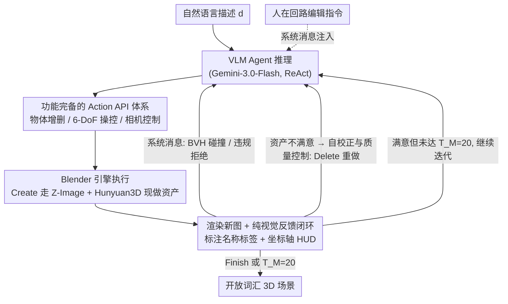

# SceneAssistant: A Visual Feedback Agent for Open-Vocabulary 3D Scene Generation

**会议**: CVPR 2026  
**arXiv**: [2603.12238](https://arxiv.org/abs/2603.12238)  
**代码**: [github.com/ROUJINN/SceneAssistant](https://github.com/ROUJINN/SceneAssistant)  
**领域**: 3D视觉 / LLM Agent  
**关键词**: 3D场景生成, 开放词汇, VLM Agent, 视觉反馈, ReAct, Action API

## 一句话总结

提出SceneAssistant——基于纯视觉反馈的VLM agentic框架，设计14个功能完备的Action API让Gemini-3.0-Flash在ReAct闭环中迭代生成和优化开放词汇3D场景，无需预定义空间关系模板或外部布局求解器，在30个场景的人类评估中Layout得分7.600（vs SceneWeaver 5.800），Human Preference 65%。

## 研究背景与动机

**领域现状**：Text-to-3D场景生成方法分为三类：(1) 数据驱动方法（3D-FRONT、ATISS等）受限于特定室内类别；(2) 程序化方法（Infinigen、ProcTHOR）需要复杂脚本/模板；(3) LLM-based方法（Holodeck、SceneWeaver、LayoutVLM）利用LLM推理能力生成空间约束，再通过求解器优化布局。

**核心痛点**：LLM-based方法依赖预定义的空间关系原语（如"on"、"face_to"、"in front of"），这些原语是领域特定的（通常为室内场景），当用户描述涉及预定义词汇之外的复杂空间配置时，优化过程失败或产生次优布局。大多数方法是开环的——生成布局后不根据渲染结果进行修正。

**关键观察**：现代VLM（预训练于互联网规模数据）已具备**潜在的空间感知和规划能力**。这些能力可以通过精心设计的操作接口被激发和利用，而非通过外部优化或预定义模板来替代。

**切入角度**：不将3D场景生成视为约束求解问题，而是模拟人类3D设计师的工作流程——观察→推理→操作→观察→迭代修正。通过完备的Action API让VLM保持在"推理最优区间"，通过视觉反馈闭环提供自校正能力。

## 方法详解

### 整体框架

整篇论文想绕开"约束求解"这条老路：不再让 LLM 吐出一堆空间原语再交给求解器优化布局，而是把 VLM 当成一个会用 Blender 的 3D 设计师，让它在"看一眼渲染图 → 想一步 → 动一下 → 再看一眼"的循环里把场景搭起来。具体地，用户给一句自然语言描述 $d$，VLM agent（Gemini-3.0-Flash）按 ReAct 范式迭代：每一步它拿到当前场景的渲染图、物体元数据和历史 action 序列，推理后选一批 Action API 执行，Blender 引擎落地这些 action 并渲染出新图回传，如此往复，直到 agent 主动调用 Finish 或撞到最大步数 $T_M = 20$。场景里的 3D 资产不是预先准备好的素材库，而是临场生成——Create 一个物体时走 Z-Image（文生图）+ Hunyuan3D（图生 3D mesh）的 pipeline 现做。整个系统 training-free，全靠 prompt engineering 约束 agent 行为（系统 prompt 规定 +Z 向上、增量建场景、每步都要看渲染图验证等）。

### 关键设计

**1. 功能完备的 Action API 体系：把 Blender 代码抽象掉，让 VLM 只管高层空间规划**

痛点是直接让 VLM 写 Blender Python 代码会引入大量语法开销，把模型的推理注意力从"东西该放哪"分散到"括号有没有写对"。SceneAssistant 把底层操作封装成 14 个语义直觉的原子命令，分三类刚好覆盖完整操作空间：**物体增删**（Create 把描述变成 3D 资产、Duplicate、Delete，其中 Create 出来的物体先默认丢在场景中心，agent 下一步看清外观再决定摆哪；Delete 则用来扔掉不满意的生成结果重做）；**6-DoF 操控**（Place 做绝对 XYZ 定位、Rotate 做 XYZ 旋转，两者合起来覆盖完整六自由度，Scale 调尺寸，Translate 做增量微调）；**相机控制**（ViewScene 切全景预设、FocusOn 聚焦某个物体、RotateCamera / MoveCamera 设任意相机状态）。这样 VLM 发出的是"把沙发向右平移 0.5 米"这种语义指令而非代码。消融印证了这层抽象的价值：把 API 换成裸 JSON 输出后，Layout 掉 0.595、Human Preference 掉 29pp——这就是逼 agent 自己管理低层数据结构带来的认知分散。

**2. 纯视觉反馈闭环：让渲染图成为 agent 唯一的决策依据，复刻人在 3D 软件里"看一眼调一下"的工作方式**

痛点是大多数 LLM-based 方法是开环的——布局生成完就不再看渲染结果，空间错位无从纠正。这里每一步只把**当前**渲染图喂回去（刻意不累积历史图像，避免上下文过载），配上历史 action 序列和当前物体坐标数据。光给图还不够，因为 2D 观察和 3D 操作之间有 gap，于是加了**视觉增强**：在渲染图上直接标注物体名称标签和坐标轴 HUD，让 agent 知道"这个叫 chair 的东西现在在哪、坐标轴朝哪"。此外用**系统消息机制**做硬约束——BVH-tree 碰撞检测一旦发现穿模就自动通知 agent，action 序列若违规（比如 Create 和 Manipulate 混在一步里）则直接拒绝并回告原因。消融里这块影响最大：去掉视觉反馈退化成 one-shot 生成后 Layout 暴跌 1.345、Preference 掉 38pp；而单独去掉 Visual Prompting（标签 + HUD），agent 就无法精确定位物体、布局直接乱掉——说明闭环和视觉增强缺一不可。

**3. 自校正与质量控制：用闭环吸收 3D 生成模型的随机性，不假设单次生成必然成功**

痛点是 Hunyuan3D 这类生成器有固有不确定性，可能产出质量差或外观不符描述的资产，开环系统对此束手无策。SceneAssistant 的应对是把"生成失败"也纳入反馈循环：agent 在下一步观察到新物体的真实外观，不满意就 Delete 掉、改写文本描述重新 Create。配合两条物理兜底——物体自动防穿地（低于 $Z=0$ 就上抬），碰撞检测结果通过系统消息持续回传——让系统对个别生成失败保持鲁棒。

### 一个完整示例：从一句话到一个客厅

以"a cozy living room with a sofa facing a TV"为例走一遍闭环：

- **第 1-2 步**：agent 调 Create("sofa")，物体生成后默认落在场景中心；下一步它通过 ViewScene 看全景渲染图，确认沙发外观 OK，于是 Place 把它挪到 $(-1.5, 0, 0)$ 并 Rotate 让正面朝向 +X。
- **第 3-4 步**：Create("TV")，观察发现这次生成的电视 mesh 偏粗糙、像柜子——于是 Delete 掉，把描述改成"a flat-screen TV on a stand"重新 Create，这一轮自校正正是设计 3 在起作用。
- **第 5 步**：把电视 Place 到沙发对面 $(1.8, 0, 0.5)$ 并旋转面向沙发；系统消息此时报 BVH 碰撞——电视和茶几位置冲突，agent 用 Translate 微调躲开。
- **人在回路**：初始场景搭完后，用户可在轨迹的任意节点注入一句编辑指令（同样走系统消息），比如"把地毯铺到沙发底下"或"再加一盏落地灯"。通常一轮人类反馈就够补齐细节，agent 据此继续 Create / Place 直到调用 Finish。

整个过程里候选不是一次定型而是逐步收敛——观察、纠错、微调交替进行，正是闭环 + 视觉增强 + 自校正三个设计协同的体现。

### 损失函数 / 训练策略

无训练。完全 training-free，纯 prompt engineering 驱动 VLM agent 行为，系统 prompt 定义操作规范（+Z 向上、增量构建场景、每步验证渲染图等）。

## 实验关键数据

### 主实验：人类评估（10位评估者，1-10分）

| 场景类型 | 方法 | Layout Correctness↑ | Object Quality↑ | Human Preference↑ |
|---------|------|:---:|:---:|:---:|
| Indoor (8场景) | Holodeck | 4.475 | 4.763 | 6.25% |
| Indoor (8场景) | SceneWeaver | 5.800 | 6.150 | 36.25% |
| Indoor (8场景) | **SceneAssistant** | **6.888** | **6.950** | **61.25%** |
| Open-vocab (22场景) | NoActionAPI | 7.005 | 6.591 | 35.91% |
| Open-vocab (22场景) | NoVisFeedback | 6.255 | 5.673 | 26.82% |
| Open-vocab (22场景) | **SceneAssistant** | **7.600** | **7.277** | **65.00%** |

### 消融实验

| 消融变体 | Layout↑ | Obj Quality↑ | Pref↑ | 与完整系统差距 |
|---------|:---:|:---:|:---:|------|
| **SceneAssistant（完整）** | **7.600** | **7.277** | **65.00%** | — |
| NoActionAPI（JSON输出） | 7.005 | 6.591 | 35.91% | Layout -0.595, Pref -29pp |
| NoVisFeedback（one-shot） | 6.255 | 5.673 | 26.82% | Layout -1.345, Pref -38pp |
| NoVisualPrompt（无标签/HUD） | — | — | — | 布局混乱，物体定位失败 |
| NoCollisionCheck（无碰撞反馈） | — | — | — | 物体穿透问题无法自修正 |

### 关键发现

- **视觉反馈是最重要的组件**：去掉后Layout降1.345（最大降幅），one-shot无法感知和纠正空间错位
- **Action API的认知减负效应显著**：同样有视觉反馈，API vs JSON→Preference差29pp，JSON迫使agent管理低层数据结构分散推理注意力
- Holodeck在Indoor场景仅6.25% Preference→预定义空间关系+Unity管线的局限性明显
- SceneAssistant在非室内场景表现更突出（Layout 7.600）→开放词汇能力是核心优势
- 碰撞检测反馈对物理合理性至关重要→纯视觉反馈不足以隐式推断穿透问题

## 亮点与洞察

- **Action API抽象层级精妙**——不是太底层（Blender代码）也不是太高层（预定义空间关系），恰好在VLM"推理最优区间"——"将沙发向右平移0.5米"这样的语义化指令
- **纯视觉反馈闭环范式**——不依赖场景图、超图等结构化中间表示，直接利用VLM的视觉理解能力，更通用更简洁
- **模块化可扩展架构**——添加新Action API（如GenerateFloorTexture）不需修改框架核心
- **人机协作设计务实**——承认VLM视觉感知的局限性，允许一轮人类反馈补齐最后差距

## 局限与展望

- 评估仅基于human evaluation（30场景×10评估者），缺乏可复现的自动化指标
- 受限于VLM（Gemini-3.0-Flash）和3D生成器（Hunyuan3D）能力天花板→模型升级可直接提升效果
- 最大20步限制→复杂场景可能不够用，但增加步数会累积错误和成本
- 未与SceneWeaver在开放词汇场景上直接对比（SceneWeaver不支持开放词汇）
- API调用的token成本未分析→实际部署的经济性待评估

## 相关工作与启发

- **vs Holodeck**：预定义空间关系+物理求解器→限定室内领域，Indoor Pref仅6.25%
- **vs SceneWeaver**：反射式agent但仍依赖预定义空间原语+混合工具接口，36.25%
- **vs SceneCraft/3D-GPT**：直接生成Blender代码→语法错误频繁+推理注意力分散
- **vs TreeSearchGen**：全局-局部树搜索有回溯能力但复杂度更高
- **启发**：VLM-as-Agent的API抽象设计范式对所有需要VLM与工具交互的系统有参考价值（不局限于3D生成）。"VLM已有潜在空间能力，关键是如何激发"这一观察值得深入研究

## 评分

⭐⭐⭐⭐ (4/5)

综合评价：提出了优雅的纯视觉反馈agentic框架，Action API设计精妙，开放词汇能力是关键差异化优势。主要遗憾在于评估不够充分（仅human evaluation，场景数量有限），且方法本身是VLM能力+工程设计的组合而非算法创新。但作为系统性工作，对3D场景生成领域有明确推动。

<!-- RELATED:START -->

## 相关论文

- [\[CVPR 2026\] REALM: An MLLM-Agent Framework for Open World 3D Reasoning Segmentation and Editing on Gaussian Splatting](realm_mllm_agent_3d_reasoning_gaussian.md)
- [\[CVPR 2026\] Seeing as Experts Do: A Knowledge-Augmented Agent for Open-Set Fine-Grained Visual Understanding](seeing_as_experts_do_a_knowledge-augmented_agent_for_open-set_fine-grained_visua.md)
- [\[CVPR 2026\] Vinedresser3D: Towards Agentic Text-guided 3D Editing](vinedresser3d_towards_agentic_text-guided_3d_editing.md)
- [\[CVPR 2026\] Learning to Select Visual Tools from Experience](learning_to_select_visual_tools_from_experience.md)
- [\[CVPR 2026\] NitroGen: An Open Foundation Model for Generalist Gaming Agents](nitrogen_an_open_foundation_model_for_generalist_gaming_agents.md)

<!-- RELATED:END -->
