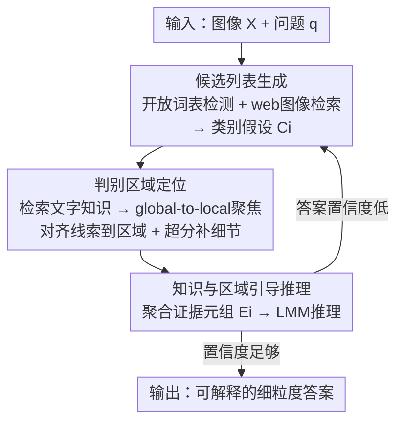

# Seeing as Experts Do: A Knowledge-Augmented Agent for Open-Set Fine-Grained Visual Understanding

**会议**: CVPR 2026  
**论文**: [CVF Open Access](https://openaccess.thecvf.com/content/CVPR2026/html/Chen_Seeing_as_Experts_Do_A_Knowledge-Augmented_Agent_for_Open-Set_Fine-Grained_CVPR_2026_paper.html)  
**代码**: 无  
**领域**: Agent / 多模态VLM  
**关键词**: 细粒度视觉理解, 知识增强Agent, 检索-grounding耦合, 开放集推理, FGExpertBench

## 一句话总结
把细粒度视觉理解从"贴一个标签"重新定义成"像专家一样举证推理"，提出三阶段闭环 Agent KFRA：先检索生成候选假设、再把检索到的文字知识 grounding 到判别性图像区域、最后让大模型基于多模态证据推理并自我纠错；在自建的 FGExpertBench 上相比基座模型最高提升 19%。

## 研究背景与动机

**领域现状**：细粒度视觉理解（区分相似鸟种、车型、犬种等）长期被当成"封闭分类"问题——在固定 taxonomy 内用局部 part 检测或注意力聚合，把一个复杂实例压成一个类别 token。即便近年引入了大多模态模型（LMM）和检索增强生成（RAG），优化目标依旧没变：从固定类别表里预测单一标签。

**现有痛点**：把实例压成一个分类 token，等于把专家知识坍缩成一条扁平的决策边界，对没见过的子类、异常状态、上下文相关的问题完全无力。论文引用的数据是：现有细粒度模型遇到未见物种或域时会掉 30–40% 准确率。LMM 虽然能开放词表识别，但它们的预测是"模式匹配"而非"基于证据的推理"，容易幻觉。

**核心矛盾**：识别 ≠ 推理。专家面对陌生实例不是靠记忆直接报答案，而是**先假设候选类别 → 检索参考 → 聚焦判别性特征 → 用事实知识验证假设**，形成一条把感知和外部知识连起来的"证据链"。现有 Agent 把检索和推理当成两个松耦合的独立步骤，检索到的知识只是被动塞进上下文，从不落到具体的视觉证据上，所以无法复现这条证据链。

**本文目标**：让机器复现专家的"观察—假设—验证"循环，把细粒度理解从标签预测转成**证据驱动的开放集推理**，且要 task-agnostic（同一框架覆盖识别、属性、动作、计数、因果、知识推断六类任务），无需针对任务重训。

**核心 idea**：建立 **retrieval–grounding coupling（检索-grounding 耦合）**——检索到的文字知识不是辅助上下文，而是一个**可执行信号**，主动指导空间 grounding 和假设验证；把 LMM 从被动的标签预测器变成主动的"证据构建器"。

## 方法详解

### 整体框架

KFRA（Knowledge-Augmented Fine-Grained Reasoning Agent）是一个由大多模态控制器（实现里用 Qwen3-A3B）协调一组专用感知/推理工具的 Agent。给定图像 $X$ 和自然语言问题 $q$，它跑一个**三阶段闭环推理循环**，每个阶段都在精炼并验证上一阶段的结果：

1. **候选列表生成**：开放词表检测出图中实体，再做 web 级图像检索，给每个实体凑出一批候选类别假设（带置信度）。
2. **判别区域定位**：对每个候选假设，检索它的文字知识（如"红喙""条纹翅膀"），用 global-to-local 聚焦机制把这些文字线索对齐到具体图像区域；细节缺失时调用超分增强。
3. **知识与区域引导推理**：把假设、文字知识、grounding 后的视觉掩码打包成证据元组，喂给 LMM 做跨对象推理产出答案；若答案置信度低，控制器重新调用前面的阶段精炼假设/定位，形成自纠错闭环。

为评测这种能力，论文还自建了 **FGExpertBench**（300 图 / 1500 QA，覆盖六个推理维度，由 GPT-4o 半自动生成 + 领域专家校验），它比 FOCI-Bench、FG-BMK、KVG-Bench 等现有 benchmark 维度更全（见实验 Table 1）。

### 关键设计

**1. 候选列表生成：把封闭分类换成检索增强的开放假设空间**

针对"封闭 taxonomy 装不下未见类别"这个痛点，这一阶段不直接出答案，而是先**构造一个开放集的假设空间**。先用开放词表检测器 $\mathcal{F}_{det}$（实现里是 Grounding-DINO）把图切成实体区域 $\{x_i\}_{i=1}^N = \mathcal{F}_{det}(X)$；再对每个 $x_i$ 用图像检索器 $\mathcal{S}_{img}$（实现里是 Google Lens）去 web 上搜视觉相似样本及其文字描述 $\mathcal{R}^{\text{img}}_i = \{(I_{ij}, T_{ij})\}_{j=1}^{M}$；最后让 LMM 把检索结果和问题 $q$ 融合，输出带置信度的候选类别排序 $C_i = \{(c, p_i(c)) \mid c \in \mathcal{Y}_i\}$，其中 $\mathcal{Y}_i$ 是从检索内容里**推断出来的**开放标签空间，而不是预设的固定类表。这样未见物种也能进候选，不需要数据集专属监督。

**2. 判别区域定位：让检索到的知识真正"落"到图像像素上（retrieval–grounding 耦合的核心）**

这是论文区别于普通检索 Agent 的关键。普通 Agent 检索完知识就直接丢给 LMM，知识和图像是脱节的；KFRA 要把每条文字线索 grounding 到具体区域去做验证。具体地，对每个候选 $c$，文字检索器 $\mathcal{S}_{tex}$（实现里查 Wikipedia）取出相关事实描述 $\mathcal{K}_{i,c} = \mathcal{S}_{tex}(c)$，再解析成一组结构化判别线索 $\mathcal{A}_{i,c} = \{a^{(k)}_{i,c}\}_{k=1}^{m_{i,c}}$（如某个身体部位、某种独特颜色）。然后 global-to-local 聚焦模块 $\mathcal{F}_{foc}$（基于 VisionReasoner）把每条线索对齐到区域，产出注意力掩码和对齐置信度 $(\mathcal{M}^{(k)}_{i,c}, s^{(k)}_{i,c}) = \mathcal{F}_{foc}(x_i, a^{(k)}_{i,c})$——其中 $\mathcal{M}^{(k)}_{i,c} \in [0,1]^{h\times w}$。它是**粗到细**两段：global 段用 CLIP 式语义相似度先粗定位，local 段用 patch 级注意力细化边界。

这里还有一个补救机制：当最优线索的对齐置信度都偏低（$\max_k s^{(k)}_{i,c} < \tau$，说明细节糊了或对不齐）时，用 OseDiff 超分增强器 $\mathcal{F}_{sr}$ 把最可信区域重建出高频细节：

$$\tilde{x}_i = \mathcal{F}_{sr}(x_i \odot \mathcal{M}^{(k^\star)}_{i,c}), \quad k^\star = \arg\max_k s^{(k)}_{i,c}$$

增强后的 patch 再回 $\mathcal{F}_{foc}$ 重新定位。整个阶段是**双向**的：文字知识指挥注意力定位，视觉证据又反过来迭代精炼检索到的线索，语义和感知形成闭环——这正是"检索-grounding 耦合"的落地形态。

**3. 知识与区域引导推理：聚合多模态证据 + 自纠错闭环**

最后一阶段把前面所有信息打包成证据元组 $E_i = \{(c, p_i(c), \mathcal{K}_{i,c}, \mathcal{A}_{i,c}, \mathcal{M}_{i,c}) \mid c \in C_i\}$（候选、置信度、文字知识、判别属性、grounding 掩码全在内），再让 LMM 在所有证据条件下推理：$P(y|X,q) = \mathcal{F}_{lmm}(X, q, \{E_i\}_{i=1}^N)$，取 $\hat{y} = \arg\max_y P(y|X,q)$。关键在于若 $\hat{y}$ 置信度低，控制器会**回头重新调用前面的阶段**精炼假设或定位，完成自纠错——这也是整体框架图里那条"答案置信度低 → 回到候选生成"的反馈边。正因为答案是基于一条可追溯的证据链而非一次性模式匹配，KFRA 的结论既 factual 又可解释，且换任务不用重训。

### 一个例子：哪只鸟是雄性？

输入两只啄木鸟 + 问题"which is male?"。阶段 1 检测出 Bird A / Bird B 两个实体，web 检索后给 Bird A 候选 [Red-cockaded Woodpecker, Nuttall's Woodpecker]、Bird B 候选 [Downy, Red-cockaded]。阶段 2 检索到 Red-cockaded 的判别知识"黑帽黑枕 + 大白颊斑 + 雄性独有的红色细纹（cockade）"，并把"头/背/腹"这些线索 grounding 到对应区域；同时对问题本身检索到知识"雄性黑帽两侧有小红条纹"。阶段 3 聚合证据：Bird A 显示一丝红色细纹，于是推理"上面那只是雄性"。整条链里每一步都有可见的证据支撑，而单独的 LMM 在这题上只会回答"无法判断性别"。

## 实验关键数据

### 主实验（FGExpertBench，六维度准确率 %）

KFRA 在六个推理维度上全面 SOTA，基于 GLM-4.5V 时平均 74.81%，超过最强商用模型 Gemini-2.5-Flash（69.98%）4.83 个点；基于 Qwen2.5-VL 时相比基座净涨 19.14 个点。两个 Agent baseline（VSA / MMSearch）只有 39.24% / 36.81%——因为它们的检索缺乏细粒度类别对齐、没建立证据 grounding。

| 模型 | Obj. | Attr. | Act. | Cnt. | Rsn. | Know. | Average |
|------|------|-------|------|------|------|-------|---------|
| GPT-4o | 66.50 | 65.31 | 67.35 | 61.33 | 68.46 | 61.19 | 65.03 |
| Gemini-2.5-Flash | 68.96 | 69.39 | 71.43 | 69.33 | 68.67 | 72.12 | **69.98** |
| VSA (Agent) | 31.68 | 44.90 | 51.02 | 31.33 | 38.67 | 37.81 | 39.24 |
| MMSearch (Agent) | 27.09 | 39.80 | 38.78 | 26.00 | 48.00 | 41.65 | 36.81 |
| Qwen2.5-VL-7B (基座) | 33.50 | 42.86 | 63.27 | 46.67 | 34.00 | 41.53 | 48.64 |
| **KFRA (Qwen2.5-VL-7B)** | 68.47 | 64.29 | 75.51 | 68.00 | 64.67 | 65.76 | 67.78 |
| **KFRA (GLM-4.5V-12B)** | 74.88 | 74.49 | 77.55 | 71.33 | 75.33 | 75.29 | **74.81** |

在六个传统细粒度分类（FGIC）数据集上 KFRA 同样有竞争力：GLM-4.5V 版平均 90.24%（超 Gemini-2.5-Flash 89.10% 和 DeepPerception-7B 83.21%）；即便用更轻的 Qwen2.5-VL-7B 也到 85.10%，相比基座涨 23.61 个点——说明这套闭环不仅增加可解释性，也实打实提升了识别鲁棒性。

### 消融实验（FGExpertBench，Qwen2.5-VL-7B 基座，基线 48.64%）

逐工具加入式消融。模块缩写：KR=知识参考（Wikipedia 文字知识）、VS=视觉检索（Google Lens）、OD=开放词表检测（Grounding-DINO）、GF=global-to-local 聚焦、SR=超分增强（OseDiff）。⚠️ 原表勾选模式排版有损，下表按论文正文描述还原各档准确率，具体勾选组合以原文 Table 4 为准。

| 配置 | Acc. % | 相比基线 | 说明 |
|------|--------|---------|------|
| 基座 standalone | 48.64 | — | 无任何工具 |
| 仅感知模块（VS+OD+GF+SR，无 KR） | 49.56 | +0.92 | 没有事实 grounding，提升有限 |
| 引入知识参考 KR | 50.21 | +1.57 | 外部知识开始起作用 |
| 渐进加入更多模块 | 52.83 / 57.15 / 63.42 | +4.19 / +8.51 / +14.78 | 随工具增多稳步上升 |
| Full（全模块） | **67.78** | **+19.14** | 完整闭环 |

### 关键发现
- **KR（外部知识）贡献最大**：只开感知模块（49.56%）几乎没涨，说明光有"看得更细"不够，必须有事实知识做 grounding 才能把推理拉起来；这印证了"检索-grounding 耦合"而非单纯检索或单纯感知是涨点关键。
- VS / OD 保证假设可靠，GF / SR 负责空间对齐和细节验证，几者**协同**才形成闭环——任一缺失都掉点。
- KFRA 在 **Reasoning 和 Knowledge** 两类上优势最明显，正是最需要显式证据构建和知识 grounding 的任务，符合方法初衷。
- "Fine-Grained Anything"扩展：用 LMM 生成 tag → Grounding-DINO 定位 → KFRA 细化，能把通用开放词表检测器变成细粒度专家（如把"Dog"细化成"Labrador Retriever / Wire-Haired Dachshund"）。

## 亮点与洞察
- **retrieval–grounding coupling 是真正的差异点**：别的 Agent 检索完知识就丢给 LLM，知识停留在文本层；KFRA 强制把每条文字线索 grounding 到像素掩码再验证，让"知识"变成可空间核对的证据。这个思路可迁移到任何"需要拿外部知识核对图像细节"的任务（医学读片、缺陷检测、商品比对）。
- **置信度触发的两处自适应**很巧妙：对齐置信度低就超分补细节、答案置信度低就回炉重跑前阶段——把"什么时候该多花算力"交给置信度门控，而不是一刀切全跑。
- **task-agnostic 且零训练**：同一套工具链覆盖识别/属性/动作/计数/因果/知识六类任务，靠的是把任务差异都吸收进"证据构建"这个统一抽象里，省掉了针对每类任务重训。
- FGExpertBench 本身是有价值的副产物：用"GPT-4o 找相关专业社群 → 领域专家圈定知识范围 → GPT-4o 生成 QA → 人工过滤"的半自动管线，在控制标注成本的同时保证专家级质量。

## 局限与展望
- 作者承认：框架依赖外部 API（Google Lens、Wikipedia）做检索，会引入延迟和检索错误；多步设计相比单次前向的模型计算开销更大；FGExpertBench 目前域覆盖有限。
- 自己发现的：⚠️ 整条链强依赖第一阶段检索召回——若 web 检索没把正确类别召进候选，后续 grounding 和推理都无从纠正（自纠错只在已有候选间精炼，不能凭空补回漏掉的真类）。
- 置信度阈值 $\tau$ 等门控超参的敏感性论文未给出消融，实际部署时这些阈值如何设可能影响算力/精度权衡。
- 改进思路：把检索召回率纳入端到端优化、或在候选生成阶段加一轮"是否需要重新检索"的判断，缓解对单次检索质量的依赖。

## 相关工作与启发
- **vs 传统细粒度模型（CNN / part 检测）**：它们在封闭 taxonomy 内做精细分类，遇未见类掉 30–40%；KFRA 用检索构造开放假设空间，不靠数据集专属监督，能处理未见子类与上下文相关问题。
- **vs 单体 LMM（LLaVA / Qwen3-VL / GPT-4o）**：LMM 是"基于模式"的被动识别器，缺证据构建与知识核对机制，易幻觉；KFRA 把 LMM 当主动推理引擎，外接检索 + grounding 做事实验证。
- **vs 通用知识增强 Agent（VSA / MMSearch）**：它们把检索和推理当独立步骤、检索到的信息从不落到视觉证据上；KFRA 的 retrieval–grounding 耦合把被动检索变成主动指导 grounding 的信号，在 FGExpertBench 上 67.78% vs 它们的 ~37–39%，差距悬殊。

## 评分
- 新颖性: ⭐⭐⭐⭐ 检索-grounding 耦合把"文字知识落到像素去验证"讲透了，是对现有松耦合 Agent 的实质改进，但底层组件都是现成工具的编排
- 实验充分度: ⭐⭐⭐⭐ 自建 benchmark + 6 个传统 FGIC 数据集 + 多基座 + 逐工具消融，覆盖全面；置信度阈值敏感性缺失
- 写作质量: ⭐⭐⭐⭐ "像专家一样看"的叙事线清晰，三阶段闭环和公式对应得上
- 价值: ⭐⭐⭐⭐ 即插即用提升各基座 19%+、零训练、task-agnostic，加上开源 benchmark，对细粒度推理方向有实用价值

<!-- RELATED:START -->

## 相关论文

- [\[CVPR 2026\] SceneAssistant: A Visual Feedback Agent for Open-Vocabulary 3D Scene Generation](sceneassistant_a_visual_feedback_agent_for_openvoc.md)
- [\[ACL 2026\] MOOSE-Copilot: A Web-Based Interactive Assistant for Unified Exploratory and Fine-Grained Scientific Hypothesis Discovery](../../ACL2026/llm_agent/moose-copilot_a_web-based_interactive_assistant_for_unified_exploratory_and_fine.md)
- [\[ECCV 2024\] VideoAgent: A Memory-augmented Multimodal Agent for Video Understanding](../../ECCV2024/llm_agent/videoagent_a_memory-augmented_multimodal_agent_for_video_understanding.md)
- [\[CVPR 2026\] Simple Agents Outperform Experts in Biomedical Imaging Workflow Optimization](simple_agents_outperform_experts_in_biomedical_imaging_workflow_optimization.md)
- [\[CVPR 2026\] CGL: Advancing Continual GUI Learning via Reinforcement Fine-Tuning](cgl_advancing_continual_gui_learning_via_reinforcement_fine-tuning.md)

<!-- RELATED:END -->
