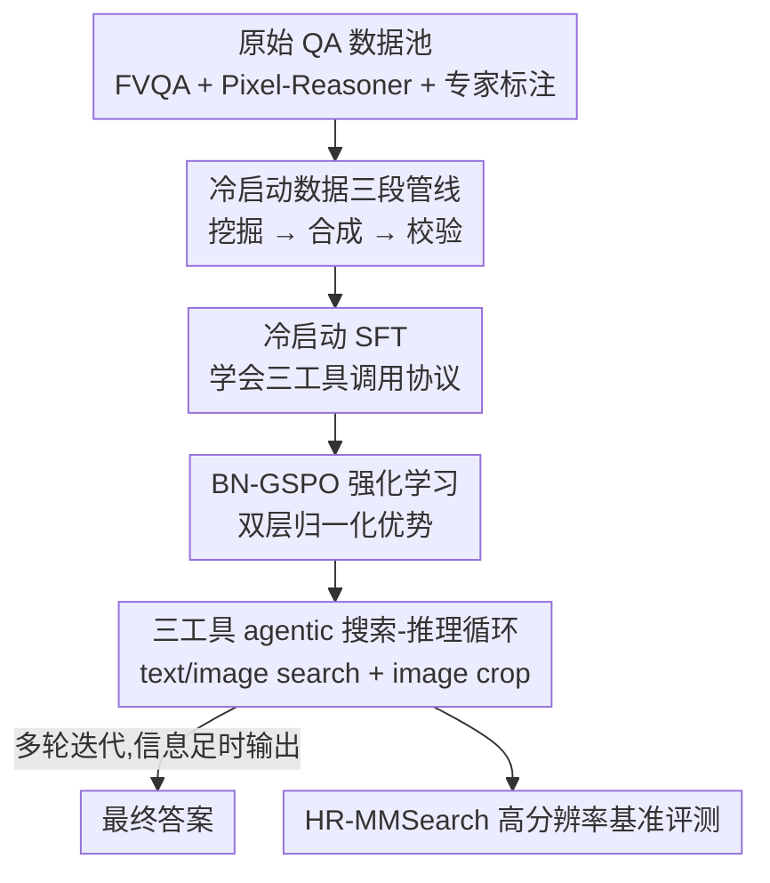

# SenseSearch: Empowering Vision-Language Models with High-Resolution Agentic Search-Reasoning via Reinforcement Learning

**会议**: CVPR 2026  
**论文**: [CVF Open Access](https://openaccess.thecvf.com/content/CVPR2026/html/Chng_SenseSearch_Empowering_Vision-Language_Models_with_High-Resolution_Agentic_Search-Reasoning_via_Reinforcement_CVPR_2026_paper.html)  
**代码**: https://github.com/OpenSenseNova/SenseNova-MARS （有）  
**领域**: 多模态VLM / Agent  
**关键词**: agentic VLM、多工具协同、强化学习、高分辨率视觉、搜索增强推理

## 一句话总结
SenseSearch 让一个 7B 的 VLM 在多轮推理过程中自主协调「文本搜索 + 图像搜索 + 图像裁剪」三种工具，用两阶段训练（冷启动 SFT + 自研 BN-GSPO 强化学习）学会同时应对「知识密集」和「高分辨率细粒度感知」两类难题，在新建的 HR-MMSearch 基准上比同规模基线高 19.18 个点。

## 研究背景与动机
**领域现状**：VLM 受限于训练语料的静态知识，且对高分辨率图像里的细小目标分析能力弱。为弥补前者，近期工作给模型挂上外部工具（文本搜索、图像搜索）并用端到端 RL（GRPO/DeepSeek-R1 范式）训练 agentic 搜索能力，如 Search-R1、MMSearch-R1；为弥补后者，「Thinking with Images」范式（OpenAI-o3、DeepEyes、Pixel Reasoner）让模型用裁剪/缩放工具在像素空间反复看图。

**现有痛点**：这两条线是割裂的。搜索类 agent 只做「整图级」的上下文获取，无法回答需要看清图中某个 5% 面积小目标的问题；而像素推理类 agent 的工具只有图像操作，碰到需要查外部知识（长尾、实时信息）的问题就束手无策。即便像 DeepMMSearch-R1 那样把裁剪当作图像搜索的预处理拼进来，也只是工具的串联，缺乏真正按需协调多工具的能力。

**核心矛盾**：真实世界的「知识密集 + 视觉复杂」问题同时要求两种能力——先在高分辨率图里精确定位并放大关键视觉线索，再据此发起外部搜索补全知识，二者还得在多轮推理里交替进行。单一工具或固定流水线都做不到这种自适应协调。

**本文目标**：构建一个端到端、能在推理过程中自适应调度多工具的 agentic VLM，并配一套能真正考察「高分辨率 + 搜索驱动」的评测基准。

**切入角度**：把图像裁剪（image crop）作为与搜索同级的「动作」纳入统一动作空间，让模型在每一轮自己决定该放大看图、该查文本、还是该反查图像；同时观察到纯 RL 在多工具、多轮场景下信号不稳，于是用冷启动先教会协议、再用改良的 RL 算法精修。

**核心 idea**：用「三工具统一动作空间 + 冷启动 SFT + 批归一化序列级 RL（BN-GSPO）」把搜索能力和细粒度感知能力捏进同一个 agent，让它按任务自适应地混用工具。

## 方法详解

### 整体框架
SenseSearch 把问题建模成一个多轮交互过程：给定一条自然语言问题 $q$ 和一张初始（通常 4K 高分辨率）图像 $I_0$，策略 VLM 在每一轮先输出一段 `<think>` 推理，再从四个动作里选一个——文本搜索、图像搜索、图像裁剪、或给出最终答案。工具返回的文本/图像被追加进交互历史 $\mathcal{T}_t$，形成不断生长的轨迹，直到模型认为信息充分给出 `<answer>`；若 $T$ 轮内没产出有效答案则判错。

整个能力来自两阶段训练：先用约 3000 条多轮轨迹做**冷启动 SFT**，教会模型遵守交互协议、会调三种工具；再用自研的 **BN-GSPO** 强化学习算法精修工具调用与推理策略，奖励由「答案正确性 + 格式合规」两部分组成、均由 GPT-4o 当裁判。评测则在新建的 **HR-MMSearch** 基准上进行。

### 关键设计

**1. 三工具统一的 agentic 搜索-推理动作空间：让"看清"和"查到"在同一循环里协同**

针对搜索 agent「看不清小目标」、像素推理 agent「查不到外部知识」的割裂，SenseSearch 把图像裁剪提升为与两种搜索并列的一等动作。在每一轮，模型观察完整历史 $\mathcal{T}_t$ 后生成推理步，然后选择：① `text search`（Serper API 检索网页文本，top-5 结果先用 Qwen3-32B 摘要再回灌，避免撑爆上下文）；② `image search`（Serper 反查相似图，返回 top-5 标题+缩略图）；③ `image crop`（给定归一化 bbox $[0,1]^4$ 和目标图索引，裁出局部供细粒度分析）；④ 输出最终答案。每轮必须「一段推理 + 一个有效动作」，缺一即轨迹无效。这种统一动作空间的关键在于：模型可以先 crop 放大赛车手胸前 5% 面积的 logo 看清品牌，再 text search 查该品牌成立年份，再 image search 反查赛车手身份——同一条推理链里自适应交替使用，而不是固定先搜后裁。

**2. 两阶段训练 + 冷启动数据三段管线：先把多工具协议教会，再用 RL 精修**

作者发现（与 Pixel Reasoner、Mini-o3 的观察一致）纯 RL 在多工具场景下会陷入「学习陷阱」——模型干脆绕过新工具、退化成只用最熟的文本搜索，无法生成深层轨迹。因此先做冷启动 SFT，目标是最大化目标轨迹的对数似然：

$$\mathcal{L}_{\text{SFT}} = -\sum_{(x_i, y_i) \in \mathcal{D}_{\text{SFT}}} \log \pi_\theta(y_i \mid x_i)$$

其中 $y_i$ 是含多工具调用的目标推理轨迹。这批冷启动数据由一条三段管线产出：**数据挖掘**——合并 FVQA、Pixel-Reasoner warm-start 语料和专家标注 QA，用 Qwen2.5-VL-7B 各 rollout 8 次，把「答对 ≤1 次」的判为难题；**轨迹合成**——对难题用 Gemini-2.5-Flash 合成完整的工具调用解题轨迹；**质量校验**——用 GPT-4o 核对格式合规、逻辑连贯、答案合理，只留通过的，最终约 3000 条高质量样本。SFT 阶段只微调语言模型、冻结视觉编码器和投影层。冷启动后再进 RL，这一步真正教模型「更有效、更高效地用工具」。

**3. BN-GSPO：批归一化的序列级策略优化，压住多工具 RL 的奖励尺度方差**

RL 阶段的核心难点是：agent 输出是含文本、工具调用、观测的长序列，监督只来自序列级外部奖励，所以需要序列级优化（GSPO 是自然起点）。但标准 GSPO 对多模态、工具增强任务里千差万别的轨迹结构和奖励量级很敏感——同一个 batch 内不同 prompt 的输出长度、奖励尺度、难度都不同，会让学习信号失真、训练不稳。

BN-GSPO 的做法是对优势估计做**两层归一化**。先算长度归一化的序列重要性比

$$s_{b,g}(\theta) = \left(\frac{\pi_\theta(y_{b,g}\mid x_b)}{\pi_{\theta_{\text{old}}}(y_{b,g}\mid x_b)}\right)^{1/|y_{b,g}|}$$

然后第一层是 GSPO 的组内标准化 $\bar{A}_{b,g} = (r_{b,g} - \text{mean}(\{r_{b,g'}\})) / \text{std}(\{r_{b,g'}\})$，第二层再把这些值在整个 minibatch 上做批归一化

$$\tilde{A}_{b,g} = \frac{\bar{A}_{b,g} - \text{mean}(\{\bar{A}_{b',g'}\}_{b'\in\mathcal{B}, g'\in\mathcal{G}})}{\text{std}(\{\bar{A}_{b',g'}\}_{b'\in\mathcal{B}, g'\in\mathcal{G}})}$$

第二层专门纠正同一 batch 内不同 prompt 之间的尺度/方差不一致。最后用裁剪的序列级目标 $\min(s_{b,g}\tilde{A}_{b,g}, \text{clip}(s_{b,g})\tilde{A}_{b,g}) - \beta D_{\text{KL}}(\pi_\theta\|\pi_{\text{ref}})$ 优化，并采用 DAPO 的 Clip-Higher（$\epsilon_{\text{low}}=0.2$、$\epsilon_{\text{high}}=0.28$）鼓励探索。奖励为 $R(\tau)=R_{\text{acc}}(\tau)+R_{\text{format}}(\tau)$，答案正确得 1.0、格式合规得 0.5，均由 GPT-4o 二值判定。消融显示这一层 batch normalization 正是 GSPO 在感知任务上崩盘、BN-GSPO 却稳的关键。

**4. HR-MMSearch：第一个高分辨率、搜索驱动的评测基准**

现有基准（FVQA、MMSearch）多用 HD 或更低分辨率、聚焦整图理解，无法考察 agent 的细粒度视觉能力。HR-MMSearch 用 305 张 4K 图像，覆盖体育、休闲文化、科技等 8 个高影响力领域；为防止 VLM 预训练知识泄漏，图像全部来自 2025 年的近期事件；每张图人工设计「知识密集 + 搜索驱动」的问题，且问题锚定在占图面积不到 5% 的小目标或文字上——这就强制 agent 必须先裁剪放大、再发起搜索，单靠整图搜索无法答对。

### 一个例子：赛车手谜题
给一张赛车场景 4K 图，问「赛车手左下方黑色 logo 所示公司的成立年份与车手出生年相差几年」。SenseSearch 先 `<think>` 判断 logo 太小需放大 → `image crop` bbox≈[0.35,0.45,0.38,0.48] 看清是 Castore；同时 `image search` 反查车手是 Max Verstappen → `text search` 查到 Verstappen 生于 1997、`text search` 查到 Castore 成立于 2015 → 推理 2015−1997=18 → `<answer> 18 </answer>`。一条链里 crop / image search / text search 三工具自适应交替，正是统一动作空间的价值所在。

## 实验关键数据

### 主实验
基于 Qwen2.5-VL-7B-Instruct，SFT 用 LLaMA-Factory、RL 用 veRL；RL 全局 batch 128、lr 1e-6、KL 系数 1e-4，单轨迹最多 $T=10$ 轮、每轮至多 8192 token、整轨迹至多 32768 token。

搜索类基准（Agentic Model 工作流，Pass@1，节选）：

| 基准/平均 | Qwen2.5-VL-7B(base) | MMSearch-R1 | SenseSearch-SFT | SenseSearch-RL |
|------|------|------|------|------|
| 平均 | 35.50 | 52.49 | 53.06 | **57.43** |
| MMSearch | 32.16 | 53.80 | 53.80 | **59.06** |
| HR-MMSearch | 19.34 | 20.33 | 29.80 | **38.52** |
| FVQA-test | 36.00 | 58.40 | 56.72 | **61.17** |
| MAT-Search | 67.33 | 74.00 | 74.67 | **78.33** |

SenseSearch-RL 平均超 MMSearch-R1 4.94 分、超 GPT-4o-mini 11.78 分，与 Gemini-2.5-Flash、GPT-4o 持平；在 HR-MMSearch 上比同规模 agentic 基线（base 19.34）高 19.18 分，正是论文标题强调的核心增益。

细粒度视觉理解（Table 2，Avg）：

| 模型 | V* | HR-Bench 4k | HR-Bench 8k | MME-RW | Avg |
|------|------|------|------|------|------|
| GPT-4o | 81.2 | 73.4 | 70.4 | 61.0 | 71.5 |
| Qwen2.5-VL-7B | 75.3 | 65.5 | 62.1 | 56.8 | 64.9 |
| DeepEyes-7B | 83.3 | 73.2 | 69.5 | 64.1 | 72.5 |
| SenseSearch-SFT | 82.2 | 72.8 | 67.3 | 63.6 | 71.5 |
| SenseSearch-RL | **83.8** | **73.6** | 69.8 | 63.9 | **72.8** |

SFT 即比 base 涨 +6.6（64.9→71.5），RL 再精修到 72.8，超过 GPT-4o、DeepEyes 等专用/闭源模型。

### 消融实验

BN-GSPO vs GRPO/GSPO（纯 RL、无冷启动，Table 3）：

| 算法 | MMSearch | V* Bench | HR-Bench 4K |
|------|---------|---------|---------|
| GRPO | 50.88 | 67.54 | 61.38 |
| GSPO | 53.80 | 53.93 | 44.50 |
| **BN-GSPO** | **56.72** | **79.05** | **69.12** |

RL 数据分布消融（Table 4，从 SFT 起 RL）：

| 配置 | MMSearch | HR-MMSearch | V* Bench |
|------|---------|---------|---------|
| SFT 基线 | 53.80 | 29.80 | 82.20 |
| 仅搜索数据 | 54.97 | 36.80 | 82.72 |
| 仅感知数据 | 54.09 | 33.11 | **85.24** |
| 搜索+感知（Full） | **59.06** | **38.52** | 83.84 |

### 关键发现
- **batch normalization 是稳定多工具 RL 的关键**：GSPO 在感知任务上直接崩盘（V* 53.93、HR-Bench 44.50），加了 batch 级归一化的 BN-GSPO 反而拉到 79.05/69.12，说明奖励尺度方差是多工具 RL 的主要不稳来源。
- **混合数据避免过拟合**：只用感知数据 RL 会让 agent 过度专精（V* 飙到 85.24 但搜索类掉点），只有搜索+感知混合才在搜索指标上大幅领先，印证「统一多工具策略」需要两类信号同时存在。
- **RL 让工具调用更省**：训练过程中平均工具调用次数从约 4 次稳步降到约 2 次，agent 学会按任务选最优策略——V* 几乎只用 image crop、MMSearch 只用搜索工具、复杂任务才混用，说明 RL 在剪掉冗余动作的同时提升了效率。

## 亮点与洞察
- **把"裁剪"提到与搜索同级的动作，统一了两条割裂的研究线**：以往「Thinking with Images」和「agentic search」各做各的，本文用一个动作空间把细粒度感知和外部知识检索缝进同一条多轮推理链，这是最关键的概念贡献，思路可迁移到任何「先看清局部再查证」的多模态任务。
- **BN-GSPO 的第二层批归一化是个轻量但有效的稳定 trick**：不改 RL 框架，只在组内标准化之上再叠一层 minibatch 级归一化，就压住了异构轨迹的奖励尺度方差，这个改动几乎零成本、可直接复用到其他序列级 RL 训练。
- **「冷启动教协议、RL 教效率」的分工很清晰**：SFT 负责让模型会用工具/守协议，RL 负责让它用得更准更省（工具数 4→2），两阶段各司其职，对训练任何 agentic 工具调用模型都有借鉴意义。
- **基准设计上的"5% 面积小目标 + 2025 年图像"双约束**很巧：前者强制必须裁剪、后者杜绝预训练知识泄漏，让 HR-MMSearch 真正能区分出会不会协调多工具。

## 局限与展望
- **强依赖外部裁判与商用 API**：奖励、评测都用 GPT-4o 当 judge，工具靠 Serper 商用搜索 API，结果的可复现性和成本都受第三方影响；裁判模型自身偏差也可能传导进奖励。
- **规模与轮次受限**：只在 7B、最多 10 轮、单轨迹 32K token 上验证，对更深层视觉搜索（需要更多轮）能否扩展、是否会再遇到「学习陷阱」未充分探讨。
- **基准偏小**：HR-MMSearch 仅 305 张图、8 个领域，统计稳健性和领域覆盖有限；且问题刻意构造成「必须裁剪+搜索」，与真实分布的偏差需注意。
- **横向比较需带 caveat**：表中不同工作流（Direct/RAG/Agentic）、不同模型规模混排，绝对分数不宜直接互比；闭源模型的「持平」结论也依赖于特定 judge 与 prompt。
- 改进方向：把 image crop 推广到更一般的图像操作（标注、对比、多图拼接）、引入工具调用成本进奖励以进一步压低无效检索、用更轻量的开源 judge 替代 GPT-4o。

## 相关工作与启发
- **vs MMSearch-R1**：MMSearch-R1 是直接对标的前 SOTA，集成了图像+文本搜索并用 RL 训练，但缺图像裁剪、做不了细粒度感知（HR-MMSearch 仅 20.33）；SenseSearch 加入 crop 工具 + BN-GSPO，把 HR-MMSearch 拉到 38.52、平均 +4.94。
- **vs Pixel Reasoner / DeepEyes（Thinking with Images）**：它们用裁剪/缩放在像素空间反复看图、提升细粒度视觉，但工具只有图像操作、无法访问外部知识；SenseSearch 把像素操作和外部搜索统一，既看得清又查得到。两者也都指出纯 RL 的「学习陷阱」，本文同样用冷启动规避。
- **vs DeepMMSearch-R1**：后者也把裁剪引入，但裁剪只是图像搜索的中间预处理（聚焦相关实体），仍是固定串联；SenseSearch 让三工具在同一动作空间里自适应交替调度，协同性更强。
- **vs GSPO/GRPO**：本文 RL 算法直接建立在 GSPO 序列级优化之上，针对多工具任务的奖励尺度方差补了一层 batch normalization，消融证明这对感知类任务尤其关键。

## 评分
- 新颖性: ⭐⭐⭐⭐ 首个把图像裁剪与搜索统一进同一 agentic 动作空间的搜索-推理 VLM，BN-GSPO 与 HR-MMSearch 也是实打实的新东西。
- 实验充分度: ⭐⭐⭐⭐ 覆盖 10+ 基准、三种工作流、算法与数据双消融、工具行为分析，较全面；但基准偏小、依赖商用 judge/API。
- 写作质量: ⭐⭐⭐⭐ 动机—方法—实验逻辑清晰，公式和工具协议交代到位，图示直观。
- 价值: ⭐⭐⭐⭐ 「裁剪+搜索」统一框架和轻量 BN 稳定 trick 都易迁移，对做 agentic 多工具 VLM 有实用参考价值。

<!-- RELATED:START -->

## 相关论文

- [\[CVPR 2026\] Towards GUI Agents: Vision-Language Diffusion Models for GUI Grounding](towards_gui_agents_vision-language_diffusion_models_for_gui_grounding.md)
- [\[CVPR 2026\] SAGE: Training Smart Any-Horizon Agents for Long Video Reasoning with Reinforcement Learning](sage_training_smart_any-horizon_agents_for_long_video_reasoning_with_reinforceme.md)
- [\[CVPR 2026\] ModularAgent: A Task-Aware Modular Framework for Joint Optimization of Multimodal Large Language Models and World Models](modularagent_a_task-aware_modular_framework_for_joint_optimization_of_multimodal.md)
- [\[CVPR 2026\] CGL: Advancing Continual GUI Learning via Reinforcement Fine-Tuning](cgl_advancing_continual_gui_learning_via_reinforcement_fine-tuning.md)
- [\[ACL 2025\] Auto-TA: Towards Scalable Automated Thematic Analysis (TA) via Multi-Agent Large Language Models with Reinforcement Learning](../../ACL2025/llm_agent/auto-ta_towards_scalable_automated_thematic_analysis_ta_via_multi-agent_large_la.md)

<!-- RELATED:END -->
