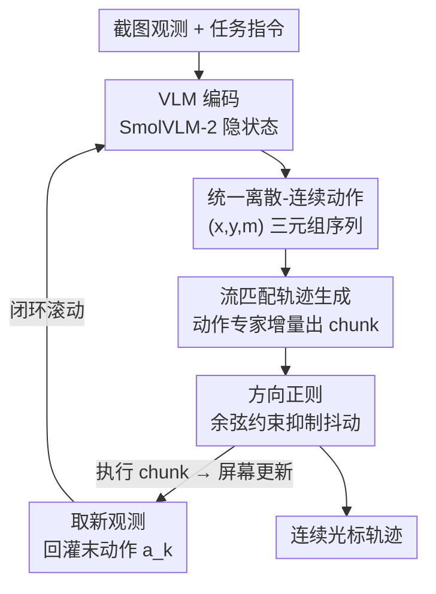

# ShowUI-π: Flow-based Generative Models as GUI Dexterous Hands

**会议**: CVPR 2026  
**论文**: [CVF Open Access](https://openaccess.thecvf.com/content/CVPR2026/html/Hu_ShowUI-p_Flow-based_Generative_Models_as_GUI_Dexterous_Hands_CVPR_2026_paper.html)  
**代码**: https://showlab.github.io/showui-pi （项目页）  
**领域**: GUI Agent / VLA / 流匹配  
**关键词**: GUI 自动化, 流匹配, 连续轨迹, 拖拽操作, 数字灵巧手

## 一句话总结
ShowUI-π 把机器人里用来做灵巧操作的「流匹配 VLA」搬到 GUI 上，用一个 450M 的轻量动作专家，把点击和拖拽统一成连续坐标轨迹来生成，从而让智能体能完成旋转、绘画、解滑块验证码这类需要边看边调的高自由度拖拽，并配套发布了 ScreenDrag 数据集与在线/离线评测基准。

## 研究背景与动机
**领域现状**：现在主流的 GUI agent（ShowUI、UI-TARS、OpenCUA、Operator、Gemini-CUA 等）几乎都是在 VLM 基础上微调，把动作表示成离散的文本 token——比如 `click(x, y)` 或 `drag(start, end)`，靠语言解码把坐标"说"出来。这套范式对点击、短拖拽这类一步到位的操作很顺手，也方便和 VLM planner 拼接。

**现有痛点**：但很多真实 GUI 操作不是"一个起点一个终点"就能描述清楚的。旋转 PPT 里的标题要画一段圆弧、手写要走一条非线性笔画、转盘验证码要边转边看角度对没对——这些任务本质上是**高自由度、需要实时观测并增量微调**的连续轨迹。离散 token 表示先天做不了这件事：它把拖拽压成了起止点对，丢掉了中间所有状态变化，更没法在执行途中根据屏幕反馈调整。

**核心矛盾**：动作的**离散 token 表示**与连续操作所需的**实时闭环轨迹**之间存在根本冲突。论文用一个数据说明这道坎有多高——在他们新建的 ScreenDrag 拖拽基准上，连闭源最强的 Gemini-2.5-CUA 在线成功率也只有 22.18%，Operator 仅 13.27%，参数量更大的 OpenCUA-32B 也才 20.79%，说明这不是"模型不够大"能解决的问题。

**切入角度**：作者注意到机器人领域早就用流匹配 / 扩散策略（diffusion policy、flow matching）来做这种连续、细粒度的实时控制（如 π0、OpenVLA 一系），于是类比提问：能不能在 GUI 里也造一只这样的"数字灵巧手"？人控制鼠标做精细移动时也是"持续感知 + 增量调整"，这正好对应流匹配那套从视觉观测增量预测速度场的机制。

**核心 idea**：把 GUI 动作建模成连续坐标轨迹，用一个轻量的流匹配动作专家从视觉观测里增量生成光标轨迹，并把点击重新理解为"位移可忽略的拖拽"，从而点击和拖拽共用一个模型、一个动作头。

## 方法详解

### 整体框架
ShowUI-π 建立在 SmolVLA-450M 之上，由两个组件耦合：一个由 SmolVLM-2 初始化的**预训练 VLM**，和一个用流匹配训练的**动作专家（action expert）**。VLM 负责把截图、语言指令、以及上一步动作状态编码进统一的 embedding 空间；动作专家是一个和 VLM 同层数（16 层）的 transformer，在预测时与 VLM 对应层做交错的自注意力 / 交叉注意力——动作专家用交叉注意力去"读"VLM 的隐状态，再把噪声动作逐步精修成干净的动作块（action chunk）$[a_1, \dots, a_k]$。

整体是一个**闭环滚动**的过程：拿到第一帧观测 $o_0$ 和指令 $\mathcal{Q}$，动作状态初始化为 $a_0 = [-1, -1]$，动作专家生成一个 $k$ 步动作块并在环境里执行；执行后屏幕状态更新，把新观测和上一步末动作 $a_k$ 重新喂回 VLM，再生成下一块。如此往复，实现"边看边调"的细粒度光标控制。三个核心设计分别解决：**怎么把点击和拖拽塞进一个表示**、**怎么生成平滑连续的轨迹**、**怎么保证轨迹方向不抖**。

### 关键设计

**1. 统一离散-连续动作表示：让点击和拖拽共用一个模型**

点击和拖拽在时空动态上差别很大，硬塞进一个模型并不平凡，但统一又很关键——这样模型在需要切换离散/连续动作的多样 GUI 任务里能灵活自适应，不用挑任务专属的动作头。作者的观察非常朴素："一次点击本质上就是位移可忽略的拖拽"。于是把所有交互都写成 $(x, y, m)$ 三元组序列 $\mathcal{A} = [a_1, \dots, a_H]$，其中 $(x, y)$ 是光标坐标、$m \in \{\text{down}, \text{up}\}$ 是鼠标按键状态。点击退化成最短的两步轨迹 $[(x_1, y_1, \text{down}), (x_1, y_1, \text{up})]$；拖拽则是按住不放的增量轨迹 $[(x_1, y_1, \text{down}), \dots, (x_T, y_T, \text{up})]$。这套表示去掉了旧 GUI agent 那些僵硬的预定义动作格式（语言 token），也让点击数据集和拖拽数据集能在同一框架里联合协同训练。消融里这个统一头（450M）对比分离头（550M）在线拖拽成功率反而高 3.7%，还省了 100M 参数，证明"统一"不只是优雅、也确实更实用。

**2. 流匹配增量轨迹生成 + 关键步重加权：把"实时平滑"做出来**

要实时交互就得平滑高效地出轨迹，所以用流匹配而非自回归解码。动作专家学一个条件向量场 $v_\theta$，沿连续参数 $s \in [0, 1]$ 把光标从段起点（$s=0$）平滑推到段终点（$s=1$）：$\frac{d\hat{a}(s)}{ds} = v_\theta(\hat{a}(s), s \mid o_t, \mathcal{Q})$。和扩散策略相比，流匹配直接回归时间条件的速度场、用确定性 ODE 采样，不需要显式 score 估计和迭代去噪，训练更稳、采样更快。

但作者发现裸的流匹配损失（对所有轨迹步一视同仁）有"表面化"的毛病——对 GUI 拖拽来说，**开头几步必须锚在起点、最后几步必须精确落到终点**，中间反而宽容。于是引入一个重加权方案，给关键步更大权重：

$$\mathcal{L}_{\text{weighted}} = \sum_{t=1}^{T} w_t \, \mathcal{L}_{\text{flow matching}}^{(t)}$$

具体方案很简单：起点和终点权重设 10，其余设 1。消融显示这一改动把在线成功率从 10.49% 直接拉到 26.98%，其中验证码任务暴涨 48.5%——说明"卡准首尾"对成功完成拖拽至关重要；而权重加到 15 反而掉点，过度强调首尾会损害中间动作的学习。

**3. 方向正则化：抑制光标抖动与转向错误**

标准流匹配只优化轨迹的"大小/位移量"，不显式约束方向一致性，这会在 GUI 里造成致命错误——光标朝向不对、或者轨迹发抖。验证码这种对方向极度敏感的任务，转错一点角度就直接失败。为此加一个方向正则项，用预测点与真值点之间的余弦相似度做惩罚：

$$\mathcal{L}_{\text{reg}} = \frac{1}{T}\sum_{t=1}^{T} (1 - \cos(\hat{a}_t, u_t))$$

最终目标是 $\mathcal{L}_{\text{total}} = \mathcal{L}_{\text{weighted}} + \lambda \mathcal{L}_{\text{reg}}$，取 $\lambda = 0.1$ 让两项量级相当。消融里加上方向正则后在线成功率从 12.63% 提到 26.98%，验证码、PPT 旋转这些方向敏感域提升最明显。

### 损失函数 / 训练策略
训练目标即上面的 $\mathcal{L}_{\text{total}}$（重加权流匹配 + 方向正则），$\lambda = 0.1$。动作专家每条轨迹执行 $k$ 次精修，把噪声动作逐步还原成干净预测。训练数据是 ScreenDrag 的 20K 条拖拽轨迹（人工采集 + 自动合成），覆盖 5 个领域、11 类任务，每条都带 UI 状态记录和稠密坐标。推理侧的关键超参是 chunk size（每次预测多少步）和 execution steps（预测后执行几步再重新观测），实验得出 chunk size 20 + execution step 1 在精度和可靠性间最平衡。

## 实验关键数据

ScreenDrag 基准含 5 个领域（OS 桌面/文件管理、PowerPoint、Adobe Premiere Pro、手写、验证码），每域 101 个、共 505 个真实拖拽任务；评测分**离线开环**（轨迹误差 + 端点精度）和**在线闭环**（任务成功率）两套协议。在线环境用数据驱动方式构造：把模型预测动作匹配到最近的录制状态（容差 20 像素内）来取下一帧观测，兼顾多样性和可复现。

### 主实验

| 评测 | 指标 | ShowUI-π-450M | Gemini-2.5-CUA | OpenCUA-7B | Operator |
|------|------|---------------|----------------|------------|----------|
| 在线闭环 | 总成功率(%)↑ | **26.98** | 22.18 | 21.98 | 13.27 |
| 离线开环 | 端点精度(%)↑ | **78.55** | 20.00 | 21.58 | 11.09 |
| 离线开环 | 轨迹误差(px)↓ | **159.05** | 189.15 | 425.55 | 422.17 |

ShowUI-π 仅 450M 参数，在线成功率超过最强闭源 Gemini-2.5-CUA 4.8 个点、超过最强开源 OpenCUA-7B 6.19 个点。值得注意的是：基线在 OS 文件拖拽（接近离散点击）上往往很强（OpenCUA-7B 离线端点精度 99%），但一到 PPT 旋转、手写、验证码这些真·连续轨迹任务就集体崩盘（多数为 0%），而 ShowUI-π 在这些域反而拿到 85%/93%/96% 的端点精度。Operator 因安全策略拒答全部验证码、Gemini-CUA 做手写时老误触发开浏览器工具，也暴露了通用 agent 的水土不服。

### 消融实验

| 配置 | 在线成功率(%)↑ | 端点精度(%)↑ | 轨迹误差(px)↓ | 说明 |
|------|---------------|-------------|--------------|------|
| 流匹配（完整） | **26.98** | **78.55** | **159.05** | 本文方法 |
| 换扩散策略 | — | 47.33 | 267.92 | 端点精度低 31.22% |
| 换语言建模(SmolVLM) | — | 0.40 | 412.10 | 端点精度低 78.15% |
| w/o 重加权（权重=1） | 10.49 | — | — | 验证码暴跌 48.5% |
| w/o 方向正则（λ=0） | 12.63 | — | — | 方向敏感域掉点最狠 |
| 分离头(550M) | 23.25 | 79.22 | — | 多 100M 参数还更差 |

### 关键发现
- **建模范式是决定性因素**：同样的 SmolVLM 骨干和 20K 数据，语言建模端点精度几乎为 0（0.40%），扩散策略 47.33%，流匹配 78.55%——证明连续操作上离散 token 表示是真·天花板，流匹配的确定性速度场最能拟合自由形拖拽。
- **首尾重加权贡献最大单点提升**：把在线成功率从 10.49% 抬到 26.98%（×2.5），且验证码 +48.5%，印证"拖拽成败系于起止两端"的直觉。
- **频繁重观测 > 一次预测一长串**：execution step 越小（每预测完执行 1 步就重新看屏幕）精度越高；但 chunk size 大（一次预测 20 步）能在 execution step 大的时候缓解退化。
- **大模型≠强操作**：OpenCUA-32B 反而不如 7B，说明对拖拽/点击这类细粒度控制，轻量专用模型更值得发展。

## 亮点与洞察
- **"点击是位移为零的拖拽"这个观察很精炼**：一句话就把离散和连续动作折叠进同一个 $(x, y, m)$ 序列表示，省掉了任务专属动作头，还顺带让点击数据和拖拽数据能联合训练——是那种"想通了就理所当然"的统一。
- **把机器人 VLA 的流匹配迁到 GUI 是漂亮的跨域类比**：物理灵巧手和数字灵巧手共享"持续感知+增量调整"的本质，作者抓住这点把 diffusion policy / flow matching 那套现成武器搬过来，并针对 GUI 特性补了首尾重加权和方向正则两个 GUI-specific 改造。
- **ScreenDrag 的数据驱动在线环境值得复用**：不真的去开 OS/软件（昂贵且难复现），而是预存视频+稠密轨迹，把预测动作匹配到最近录制状态来取下一帧——这种"用录制回放近似闭环"的思路可迁移到其他难以搭真环境的 agent 评测。
- **首尾重加权这个 trick 很通用**：任何"轨迹首尾比中段更关键"的序列生成任务（路径规划、笔迹生成、机械臂抓取）都能借鉴这种按位置给损失加权的做法。

## 局限与展望
- **总成功率仍然偏低**：26.98% 虽是 SOTA，但离实用还远，说明连续 GUI 操作整体仍是开放难题。
- **OS 文件拖拽反而是短板**：ShowUI-π 在最接近离散点击的 OS 域只有 13.11% 在线成功率，远低于基线（OpenCUA 97%+），说明统一连续建模在"本该简单的离散任务"上付出了代价——把点击当退化拖拽未必总是划算。
- **在线环境是近似而非真闭环**：用录制状态做最近邻匹配（20px 容差）来取观测，并非真实软件回滚，存在状态覆盖不全、匹配偏差的风险；论文也把每个基线限制到 3 步交互以控成本，可能低估了基线。
- **领域和分辨率受限**：训练数据主要在 Windows 下用 UI Automation SDK 自动采集，跨 OS、跨分辨率、跨陌生软件的泛化未充分验证；自动合成的轨迹质量也依赖规则验证器，可能引入系统性偏差。
- **可改进方向**：给离散点击任务保留更轻的快路径（而非一律当拖拽走流匹配）、引入真实可回滚的在线环境、把方向正则升级为对曲率/速度的更细约束。

## 相关工作与启发
- **vs 离散 token GUI agent（ShowUI / UI-TARS / OpenCUA / Operator / Gemini-CUA）**：它们把动作解码成文本 token，方便对接 VLM planner，但只能做点击和短拖拽，丢掉了拖拽中间态。ShowUI-π 直接建模连续空间轨迹，能做长、平滑、时序连贯的操作；代价是在纯离散任务上反而不占优。
- **vs 机器人 VLA（OpenVLA / RT-2 / π0 / diffusion policy）**：物理 VLA 把流匹配/扩散用于机械臂连续控制，ShowUI-π 是把这套搬到数字 GUI 的第一个工作，并补上 GUI 特有的首尾重加权和方向正则。相比离散化动作 token 的 RT-2/OpenVLA（每维 256 bin），流匹配避免了时间量化误差。
- **vs 扩散策略**：同为连续生成，扩散策略靠 score-based 去噪、迭代采样；流匹配回归确定性速度场、ODE 采样更快更稳，实验里端点精度高 31.22%，更适合实时 GUI 交互。

## 评分
- 新颖性: ⭐⭐⭐⭐⭐ 首个把流匹配 VLA 引入 GUI 连续操作，"点击=零位移拖拽"的统一表示和跨域迁移都很扎实。
- 实验充分度: ⭐⭐⭐⭐ 自建 ScreenDrag 双协议基准 + 丰富消融（建模范式/重加权/方向正则/chunk/统一头）覆盖到位，但在线环境是近似闭环、基线被限到 3 步是隐忧。
- 写作质量: ⭐⭐⭐⭐ 动机—方法—实验逻辑清晰，图表对照充分；部分公式排版（缓存里）较乱但原文应正常。
- 价值: ⭐⭐⭐⭐ 用 450M 小模型超过闭源 CUA，开辟了"GUI 灵巧手"这个新问题并配套数据/基准，对后续连续 GUI 控制研究有奠基意义。

<!-- RELATED:START -->

## 相关论文

- [\[CVPR 2026\] Towards GUI Agents: Vision-Language Diffusion Models for GUI Grounding](towards_gui_agents_vision-language_diffusion_models_for_gui_grounding.md)
- [\[CVPR 2026\] OS-Oracle: A Comprehensive Framework for Cross-Platform GUI Critic Models](os-oracle_a_comprehensive_framework_for_cross-platform_gui_critic_models.md)
- [\[CVPR 2026\] GUI-CEval: A Hierarchical and Comprehensive Chinese Benchmark for Mobile GUI Agents](gui-ceval_a_hierarchical_and_comprehensive_chinese_benchmark_for_mobile_gui_agen.md)
- [\[CVPR 2026\] ModularAgent: A Task-Aware Modular Framework for Joint Optimization of Multimodal Large Language Models and World Models](modularagent_a_task-aware_modular_framework_for_joint_optimization_of_multimodal.md)
- [\[CVPR 2026\] MMBench-GUI: A Unified Hierarchical Evaluation Framework for Multi-Platform GUI Agents](mmbench-gui_a_unified_hierarchical_evaluation_framework_for_multi-platform_gui_a.md)

<!-- RELATED:END -->
