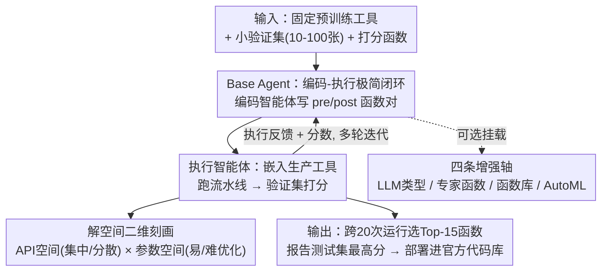

# Simple Agents Outperform Experts in Biomedical Imaging Workflow Optimization

**会议**: CVPR 2026  
**论文**: [CVF Open Access](https://openaccess.thecvf.com/content/CVPR2026/html/Wang_Simple_Agents_Outperform_Experts_in_Biomedical_Imaging_Workflow_Optimization_CVPR_2026_paper.html)  
**代码**: https://xuefei-wang.github.io/simpleagent-opt （项目页，框架已开源）  
**领域**: LLM Agent  
**关键词**: 代码优化智能体, 工具适配, 生物医学影像, 智能体设计空间, AutoML

## 一句话总结
针对科学工具"最后一公里"适配难题，本文用一个极简的"编码-执行"闭环智能体，仅凭几十张验证图就能自动生成预/后处理代码，在三条生产级生物医学影像流水线（Polaris/Cellpose/MedSAM）上稳定超过原作者手工调了数周到数月的专家代码，并系统证明：树搜索、函数库、AutoML 等复杂组件并非普遍有益。

## 研究背景与动机
**领域现状**：Polaris、Cellpose、MedSAM 这类预训练计算机视觉工具已成为临床和实验室的生产级方案，但科学家把它们用到自己实验室的"定制数据集"上时，常因显微镜、光照、分辨率、染色协议、伪影等采集条件差异而性能骤降。

**现有痛点**：弥合这道域差只有两条路，且都不实用——(1) 微调模型需要成千上万张标注图，而单个实验室往往拿不出；(2) 手写定制的预处理 / 后处理代码来桥接域差，要花科学家数周到数月，严重挤占科研时间。

**核心矛盾**：科学家手里通常只有一份 10–100 张图的"金标准"小验证集。能不能把这份小验证集当作目标函数，让 AI 智能体自动写出适配代码？但现有"科学智能体"要么是面向开放式发现的庞大复杂系统（分层规划、巨大工具空间），要么是 MLE 智能体（从零搭建新方案），都不直接对口"在已有生产工具上做适配"这个又窄又刚需的任务。

**本文目标**：回答"能可靠地把固定的预训练生产工具适配到新定制数据集的、最实用最简单的智能体框架长什么样"，并拆解智能体设计空间，逐一量化每个设计组件到底有没有用。

**切入角度**：作者不预设"越复杂越好"，而是自底向上从一个最小 Base Agent 出发，逐个加入复杂组件做受控消融，看哪些设计真正驱动了性能。

**核心 idea**：用一个极简的"编码智能体 + 执行智能体"闭环，把小验证集分数当反馈迭代生成处理函数；并提出"API 空间 × 参数空间"二维框架来解释为何同一个复杂组件在不同任务上时好时坏。

## 方法详解

### 整体框架
这是一篇"设计空间研究"论文：先搭一个最小可用的 Base Agent，再围绕它系统地增删复杂组件，从而厘清"工具适配"这个窄任务到底需要多复杂的智能体。核心闭环只有三件套——Task Prompt（任务说明）、Coding Agent（LLM 写出预/后处理函数对）、Execution Agent（把函数嵌进生产工具、跑流水线、在小验证集上打分并回传反馈）。Base Agent 在此基础上往 prompt 里再塞两块上下文（Data Prompt 数据语境 + API List 相关函数清单）作为研究基线。多轮迭代后，跨 20 次运行选出 Top-15 函数、报告测试集最高分，最优函数最终被合并进官方代码库部署。

### 关键设计

**1. Base Agent：极简"编码-执行"闭环 + 两块上下文**

痛点在于"科学智能体"为了开放式发现堆了分层规划、巨大工具空间，对"在已有工具上写适配代码"这个窄任务是杀鸡用牛刀。作者反其道而行，把智能体压到最小：Coding Agent 负责生成候选的预处理/后处理函数对，Execution Agent 把它嵌入真实生产工具执行并用小验证集打分，分数与报错作为反馈回灌 prompt，循环迭代。但纯三件套在专业科学域里缺语境，写不出能跑的代码，因此 Base Agent 额外补两块上下文：Data Prompt（说明数据是"医学/细胞/荧光/显微"以及通道含义如"细胞核/细胞质/空"）与 API List（从 OpenCV、Skimage、Scipy 精选的 98 个相关函数及其 docstring）。这套极简框架的有效性在于：它把昂贵的人工调参转化成一个由小验证集分数驱动的自动搜索，1–2 天算力即可找到解，省下科学家数周到数月的手工调试。

**2. 智能体设计空间的四条增强轴**

为回答"复杂组件到底要不要"，作者在 Base Agent 上识别出四条常见且影响实用性的增强轴，逐一受控开关：(a) **LLM 类型**——分别用大型通用模型（GPT-4.1）、强推理模型（o3）、小型开源模型（Llama 3.3-70B）做编码智能体；(b) **专家函数**——把人类专家写好的后处理函数塞进 prompt 当 in-context 示例；(c) **函数库（Function Bank）**——把历史生成的函数当持久记忆，每轮回灌表现最好的 Top-3 和最差的 Bottom-3 引导探索；(d) **AutoML 智能体**——每 5 轮触发一次，从函数库选 Top-3 函数、识别可优化超参、各跑 24 次试验做超参搜索。这条设计的价值不在"提出新组件"，而在于把文献里各自为政的复杂设计放进同一基线下可比，从而戳破"越复杂越好"的默认假设——实验显示这些组件多数是"时好时坏"，没有普适收益。

**3. "API 空间 × 参数空间"二维解空间刻画**

光看分数会发现一片混乱：专家函数让 Polaris 暴涨却让 MedSAM 变差，推理 LLM 帮了 MedSAM 却拖累 Polaris。作者引入两维框架来解释这种"时好时坏"：(1) **API 空间**——集中型（解依赖少数高频共现的关键 API）还是分散型（允许多样的 API 组合），用边权熵的离散度分数量化（MedSAM 显著更高即更分散）；(2) **参数空间**——易优化（落在 LLM 默认偏好内）还是难优化（需要高度特定的取值）。据此把三个任务定位为：Polaris=集中+难优化、Cellpose=集中+易优化、MedSAM=分散+易优化。框架立刻解释了现象：专家函数对"难优化参数空间"（Polaris）极有益、却会限制"分散 API 空间"（MedSAM）的必要探索；推理 LLM 擅长增多函数多样性（利好分散的 MedSAM）但在参数搜索上更受限（坑了难优化的 Polaris）。其有效性在于：它把"该不该加某组件"从拍脑袋变成可按任务解空间特征预测的工程决策路线图。

### 损失函数 / 训练策略
本文不训练模型，而是把适配当成黑盒优化：每个智能体配置用 20 个不同随机种子各跑一次，每次生成 60 个试验（20 轮 × 每轮 3 个函数对）。为缓解过拟合，最终性能不取单个验证最优函数，而是从 20 次运行里按验证分数选 Top-15 函数、报告其测试集最高分。打分目标按任务定制：Polaris 最大化验证集 F1，Cellpose 最大化 IoU=0.5 下的平均精度（AP），MedSAM 最大化归一化表面 Dice（NSD）与 Dice 相似系数（DSC）之和。

## 实验关键数据

三条流水线覆盖从分子到宏观的全尺度：Polaris（单分子荧光点检测，95 张验证图）、Cellpose（细胞实例分割，100 张验证图）、MedSAM（医学分割，皮肤镜模态 25 张验证图）。基线是原作者数周到数月调优的官方专家代码。

### 主实验（设计选择研究，Table 2）

| 配置 | Polaris (F1) | Cellpose (AP@IoU0.5) | MedSAM (NSD+DSC) |
|------|------|------|------|
| Expert Baseline（专家基线） | 0.841 | 0.402 | 0.820 |
| Base Agent | 0.867 | 0.409 | 0.971 |
| + 专家函数 | 0.929 | 0.410 | 0.888 |
| + 函数库 | 0.889 | 0.416 | 0.943 |
| 推理 LLM (o3) | 0.844 | 0.412 | 1.020 |
| 小模型 (Llama 3.3-70B) | 0.805 | 0.397 | 0.918 |
| 去掉 Data Prompt | 0.856 | 0.406 | 0.952 |
| 去掉 API List | 0.868 | 0.417 | 1.037 |

关键观察：除"小模型"在部分任务掉到专家基线以下外，所有智能体配置都超过专家基线，MedSAM 上增益最大（0.820→0.971）。同一组件却"时好时坏"——专家函数让 Polaris 从 0.867 冲到 0.929、却把 MedSAM 从 0.971 砸到 0.888。

### 消融与对照实验

| 配置 | Polaris | Cellpose | MedSAM | 说明 |
|------|------|------|------|------|
| 去掉 Data Prompt | 0.856↓ | 0.406↓ | 0.952↓ | 三任务全降，数据语境是必要的 |
| 去掉 API List | 0.868↑ | 0.417↑ | 1.037↑ | 三任务全升，API 清单反而引入有害偏置 |
| Base Agent | 0.867 | 0.409 | 0.971 | — |
| + 函数库 | 0.889 | 0.416 | 0.943 | 增多样性，但分散空间(MedSAM)反掉 |
| AIDE 树搜索智能体 | 0.872 | 0.414 | 0.971 | 复杂树搜索无显著优势 |

### 关键发现
- **两个稳定结论**：去掉 Data Prompt 三任务全降（数据语境必要）；去掉 API List 三任务全升——分析显示给清单会引入有害偏置（如 `remove_small_objects`/`remove_small_holes` 被异常高频调用），LLM 的内在知识已足够，默认应当省略 API 清单，除非任务用到超出 LLM 知识范围的 API。
- **AutoML 不是万灵药**：非智能体版 AutoML 三任务全输（单次 prompt 平均只识别出 4.8±1.5 个可优化函数）；把 AutoML 并入框架后改善了 MedSAM 却拖垮 Polaris，根因是在验证集上过拟合——降低 AutoML 运行频率或减少试验次数后，验证分降了、测试分反升（Polaris 测试 0.877→0.910）。
- **复杂树搜索没有甜头**：在校准到相当有效解数量的预算下，专有的 AIDE 树搜索智能体相比两种极简配置无显著优势（Polaris 0.872 vs 0.889，MedSAM 持平 0.971），说明对工具适配这个窄任务，树搜索的额外复杂度换不来开箱即用的好处。
- **单参数定生死**：Polaris 的"难优化"全卡在 `peak_local_max` 的 `threshold_abs` 上——LLM 系统性偏离最优区间，手动改成 0.9 即大幅提分，证实是 LLM 偏置而非搜索能力不足。

## 亮点与洞察
- **"简单打败复杂"的反直觉结论有真凭据**：在 AI 智能体普遍越做越复杂的当下，本文用受控消融证明对窄任务而言极简框架就够，且更透明、更可复现——这对一线科学家是实打实的可落地路径。
- **"API 空间 × 参数空间"是可迁移的诊断工具**：把"加哪个组件"从玄学变成可按任务解空间特征预测的决策。这套二维刻画思路可迁移到其他"该不该上重型组件"的智能体工程问题。
- **真实部署闭环**：智能体生成的函数被合并进了官方生产代码库（Polaris/Cellpose/MedSAM 之一），不是纸面 benchmark，验证了从研究到生产的通路。
- **"过拟合警报"对 agentic 优化普适**：把小验证集当目标函数时，过度超参搜索会在验证集上过拟合、测试反降——提醒所有用小验证集驱动的自动优化都要克制搜索强度。

## 局限与展望
- 仅在三条生物医学影像流水线上验证，是否推广到其他科学领域（如遥感、材料）的工具适配尚待检验。
- "API 空间 × 参数空间"的刻画依赖事后分析 Top-20 解，缺少在优化前就预判任务落点的先验方法，工程上仍需先跑一轮才能定策略。
- AutoML 过拟合问题只给出"减频率/减试验"的经验缓解，没有给出更原则化的平衡搜索协议（作者也承认需要后续研究）。
- 小模型（Llama 3.3-70B）在部分任务掉到专家基线以下，说明"极简框架"对底座 LLM 能力仍有下限要求，并非完全模型无关。

## 相关工作与启发
- **vs MLE 智能体（AIDE [15] 等）**: 它们用复杂树搜索从零构建新模型，本文做的是在固定生产工具上写适配代码；直接对照显示 AIDE 的树搜索在该任务上无显著优势，本文以更简单透明的框架达到相当效果。
- **vs 科学智能体（Biomni [12] 等）**: 它们面向开放式发现、靠庞大工具空间与 RAG，复杂度高；本文聚焦"工具适配"窄任务，证明 minimal code+exec 闭环就够，且做了系统化的组件级研究与生产部署（这正是前者所缺）。
- **vs 经典 AutoML（Optuna [1] 等）**: 经典 AutoML 受限于人工预定义的固定搜索空间、需专家精心策展函数与范围；LLM 智能体能动态生成代码与参数空间。本文进一步指出二者可协同——LLM 做结构搜索（选哪些函数组合）、经典 AutoML 做参数搜索（找最优 clip limit），但也实证发现简单拼接会带来过拟合等新问题。

## 评分
- 新颖性: ⭐⭐⭐⭐ 不提新模型，但"简单胜复杂"的系统性论证 + 二维解空间诊断框架很有洞见
- 实验充分度: ⭐⭐⭐⭐⭐ 三尺度任务、多组件受控消融、AutoML/树搜索对照、真实部署，扎实
- 写作质量: ⭐⭐⭐⭐ 逻辑清晰、图表支撑强；部分机制解释偏定性
- 价值: ⭐⭐⭐⭐⭐ 给一线科学家可落地路线图，并已合并进官方生产代码库

<!-- RELATED:START -->

## 相关论文

- [\[CVPR 2026\] Seeing as Experts Do: A Knowledge-Augmented Agent for Open-Set Fine-Grained Visual Understanding](seeing_as_experts_do_a_knowledge-augmented_agent_for_open-set_fine-grained_visua.md)
- [\[ICML 2026\] AgentXRay: White-Boxing Agentic Systems via Workflow Reconstruction](../../ICML2026/llm_agent/agentxray_white-boxing_agentic_systems_via_workflow_reconstruction.md)
- [\[ACL 2026\] Verified Critical Step Optimization for LLM Agents](../../ACL2026/llm_agent/verified_critical_step_optimization_for_llm_agents.md)
- [\[AAAI 2026\] A2Flow: Automating Agentic Workflow Generation via Self-Adaptive Abstraction Operators](../../AAAI2026/llm_agent/a2flow_automating_agentic_workflow_generation_via_self-adaptive_abstraction_oper.md)
- [\[AAAI 2026\] DEPO: Dual-Efficiency Preference Optimization for LLM Agents](../../AAAI2026/llm_agent/depo_dual-efficiency_preference_optimization_for_llm_agents.md)

<!-- RELATED:END -->
