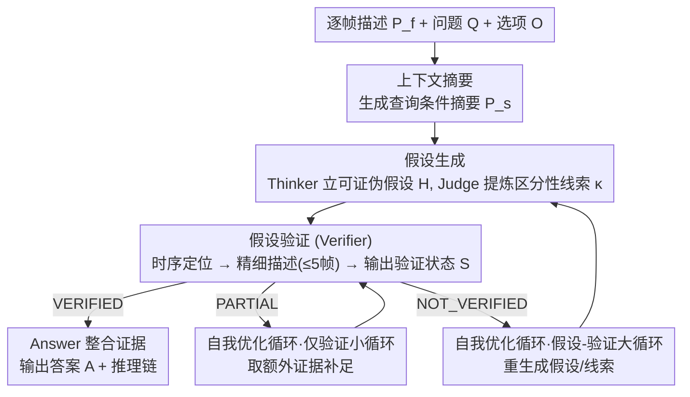

# Think, Then Verify: A Hypothesis-Verification Multi-Agent Framework for Long Video Understanding

**会议**: CVPR 2026  
**arXiv**: [2603.04977](https://arxiv.org/abs/2603.04977)  
**代码**: [GitHub](https://github.com/Haorane/VideoHV-Agent)  
**领域**: LLM Agent  
**关键词**: 长视频理解, 多智能体, 假设验证, VideoQA, 证据推理

## 一句话总结
提出 VideoHV-Agent，将长视频问答重新建模为"假设-验证"过程：Thinker 将答案选项改写为可测试假设，Judge 提取区分性线索，Verifier 在视频中定位证据进行验证，Answer 综合证据给出最终答案，在 EgoSchema/NextQA/IntentQA 三个基准上取得 SOTA，同时推理效率优于现有 Agent 方法。

## 研究背景与动机
**领域现状**：LLM 驱动的视频理解已取得显著进展，但长视频问答仍然困难——模型需要处理密集冗余内容并在长时间跨度上进行推理。现有方法包括关键帧选择、多阶段管线（先定位后推理）和 Agent 框架（迭代搜索聚合语义相关片段）。

**现有痛点**：(i) Chain-of-Thought 方法在长推理链中容易出现语义漂移和错误累积；(ii) 现有 Agent 框架本质上是"相关性驱动"的——反复搜索与当前计划相关的片段，然后基于找到的内容重新规划，导致昂贵的试错循环；(iii) 规划器只分解视频复杂性（长度、冗余），忽略了问题本身的复杂性（组合约束、时序排列、因果前提）。

**核心矛盾**：长视频问答的核心难题不是"如何找到相关片段"，而是"应该去找什么"。现有方法是"先搜索再推理"，而正确的顺序应该是"先思考再查找"。

**本文目标** 将反应式的相关性检索替换为结构化的假设验证推理。

**切入角度**："thinking before finding"原则——在收集证据之前，系统必须先明确每个候选答案需要什么视频证据才能成立。

**核心 idea**：将 VideoQA 重构为假设生成→线索提取→证据验证→答案整合的结构化推理流程。

## 方法详解

### 整体框架
VideoHV-Agent 把长视频问答从"看完整段再答"改成"先猜后验"：先根据问题给每个选项立一个可证伪的假设，再只去视频里查验证这些假设所必需的关键证据。四个 Agent 各司其职流水线协作——输入是逐帧文本描述 $\mathcal{P}_f$ + 问题 $Q$ + 选项 $O$，经过 查询条件摘要 $\mathcal{P}_s$ → 假设 $H$ → 区分性线索 $\kappa$ → 证据 $E$ → 验证状态 $S$，最终给出答案 $A$ 和一条透明的推理链。整条管线分三阶段：上下文摘要、两步推理（生成 + 验证）、自我优化。

### 关键设计

**1. 上下文摘要：把"全局"和"局部"解耦**

逐帧描述很详细但塞进上下文又长又吵。这里的设计是把它的两种用途拆开：**逐帧描述只留给后续的片段定位**（局部任务，需要精确时间戳），而**全局推理只用一份简洁的查询条件摘要 $\mathcal{P}_s$**。相比以往把所有帧描述硬拼进长上下文，这种解耦既保住了细节、又让全局上下文保持紧凑不被淹没。

**2. 假设生成（Step 1）：立靶子 + 找最小区分证据**

- **Thinker Agent**：对每个候选选项 $o_i$ 生成一个可测试假设 $h_i$，明确写出"若 $o_i$ 正确，视频里必须出现哪些实体/动作/时序因果约束"。它会先用摘要把明显错的选项滤掉，减少噪声。
- **Judge Agent**：从假设集合 $H$ 里提炼**区分性线索 $\kappa$**——即把各假设区分开所需的**最小**观察证据（某个物体交互、某段事件顺序、某个视觉结果）。
- 为什么要线索这一步？因为逐一硬验所有假设会忽略它们之间的逻辑关系；线索机制让验证只盯住真正能分胜负的那几个点。

**3. 假设验证（Step 2）：只看决策相关的少数帧**

**Verifier Agent** 三步走：(i) **时序定位**——用帧描述找到线索最可能出现的时间窗口；(ii) **精细描述**——只在该窗口内调用细粒度 captioning（每次最多 5 帧）；(iii) **线索验证**——输出 $\text{status}(\kappa) \in \{\text{VERIFIED}, \text{PARTIAL}, \text{NOT\_VERIFIED}\}$ 及简短理由。关键收益是只分析少量决策相关帧，而非全视频扫描，计算开销大幅下降。

**4. 自我优化循环：按验证结果决定补多少**

验证不是一锤子买卖，状态不同触发不同强度的回补：
- **PARTIAL**：触发"仅验证"小循环，从新时间戳取额外证据补足。
- **NOT_VERIFIED**：触发"假设-验证"大循环，重新生成假设和线索（做具体化增强或区分度增强）。
- 实验显示大多数样本 1 次循环即可定案，避免了无意义的反复扫描。

### 一个完整 walkthrough（"主角放下杯子后做了什么？"四选一）
1. **摘要**：生成 $\mathcal{P}_s$，过滤掉与"杯子"完全无关的选项，剩 A/B/C 三个。
2. **Thinker**：为 A=「打开门」、B=「接电话」、C=「拿起钥匙」各立假设，写明各自必须出现的动作。
3. **Judge**：提炼区分性线索 $\kappa$="放下杯子后右手的下一个交互对象"。
4. **Verifier**：时序定位到"放杯子"那一刻的时间窗 → 只对该窗 5 帧做精细描述 → 观察到"右手伸向门把手"。
5. **判定**：线索指向 A，status=VERIFIED，无需进循环，输出 A 及推理链。

整条链体现了"先猜后验"如何省算力：摘要砍掉无关选项、线索锁定唯一判别点、验证只碰几帧。

### 训练策略
本方法是**零样本推理框架，不涉及训练**。四个 Agent 共用 GPT-4o 作 LLM 骨干，帧级 captioner 用 LaViLa/CogAgent。

## 实验关键数据

### 主实验

| 基准 | 指标 | VideoHV-Agent | VideoAgent2 | VideoMultiAgents | 提升 |
|------|------|--------------|-------------|-----------------|------|
| EgoSchema (subset) | Accuracy | **81.0%** | 80.6% | 75.4% | +0.4% |
| NextQA (val) | Accuracy | **80.7%** | 80.5% | 79.6% | +0.2% |
| NextQA ATP-hard | Accuracy | **71.2%** | 68.2% | - | +3.0% |
| IntentQA (test) | Accuracy | **75.6%** | 73.9% | - | +1.7% |

### 消融实验

| 配置 | Accuracy | 说明 |
|------|---------|------|
| Full model | 81.0% | 完整 VideoHV-Agent |
| w/o hypothesis | 76.0% | 去掉假设生成，掉 5% |
| w/o clue | 78.6% | 去掉线索生成，掉 2.4% |
| w/o verification status | 74.0% | 去掉验证状态机制，掉 7% |

### 关键发现
- **验证状态机制贡献最大**（去掉后掉 7%），说明自适应自优化循环是关键——不是装饰性的解释，而是功能性必需
- **在 ATP-hard 困难子集上提升更显著**（+3%），说明假设验证范式在复杂推理问题上优势更大
- **推理效率优于所有对比方法**：平均 123.66s/问，低于 VideoAgent（129.46s）和 VideoTree（160.21s），同时准确率最高
- 大多数样本只需 1 次循环，额外循环收益递减

## 亮点与洞察
- **"先想再查"范式转变**非常巧妙——将 VideoQA 从反应式的"搜索→推理→再搜索"转变为主动的"假设→验证"，与科学方法论中的假设检验思想一脉相承。这个思路可以迁移到任何需要从大量数据中找证据的任务
- **验证状态的三级分类**（VERIFIED/PARTIAL/NOT_VERIFIED）设计精妙——不同状态触发不同粒度的自优化，避免了盲目的全链路重试
- **效率与精度的双重提升**：通过线索导向的定向搜索替代全视频扫描，既更准确又更快

## 局限与展望
- 依赖 GPT-4o 作为骨干，成本较高，未探索开源替代
- 帧级 captioner 的质量直接影响后续推理，但论文未深入分析 captioner 错误如何传播
- 仅在多选题格式上测试，未验证在开放式问答上的表现
- 自优化循环次数需要预设上限，如何动态决定何时停止是一个未解决的问题

## 相关工作与启发
- **vs VideoAgent2**：也是 Agent 框架但采用不确定性引导的信息检索，仍是相关性驱动；VideoHV-Agent 用假设驱动更有方向性
- **vs VideoMultiAgents**：按模态分配 Agent（视觉/语言），VideoHV-Agent 按推理角色分配（思考/判断/验证/回答），更符合科学推理流程
- **vs TraveLER**：CoT + 定位的"问-找-评-重规划"循环，但缺乏假设的明确性和验证状态的自适应

## 评分
- 新颖性: ⭐⭐⭐⭐⭐ 假设验证范式是长视频理解中的全新思路
- 实验充分度: ⭐⭐⭐⭐ 三个基准+详细消融，但少了开放式QA评测
- 写作质量: ⭐⭐⭐⭐⭐ 动机推导清晰，方法描述系统
- 价值: ⭐⭐⭐⭐ 假设验证范式可推广到其他信息检索+推理任务

<!-- RELATED:START -->

## 相关论文

- [\[CVPR 2026\] HAVEN: Hierarchical Long Video Understanding with Audiovisual Entity Cohesion and Agentic Search](haven_hierarchical_long_video_understanding_with_audiovisual_entity_cohesion.md)
- [\[CVPR 2026\] WorldMM: Dynamic Multimodal Memory Agent for Long Video Reasoning](worldmm_dynamic_multimodal_memory_agent_for_long_video_reasoning.md)
- [\[CVPR 2026\] Resolving Evidence Sparsity: Agentic Context Engineering for Long-Document Understanding](resolving_evidence_sparsity_agentic_context_engineering_for_long-document_unders.md)
- [\[CVPR 2026\] CarePilot: A Multi-Agent Framework for Long-Horizon Computer Task Automation in Healthcare](carepilot_a_multi-agent_framework_for_long-horizon_computer_task_automation_in_h.md)
- [\[ECCV 2024\] VideoAgent: A Memory-augmented Multimodal Agent for Video Understanding](../../ECCV2024/llm_agent/videoagent_a_memory-augmented_multimodal_agent_for_video_understanding.md)

<!-- RELATED:END -->
