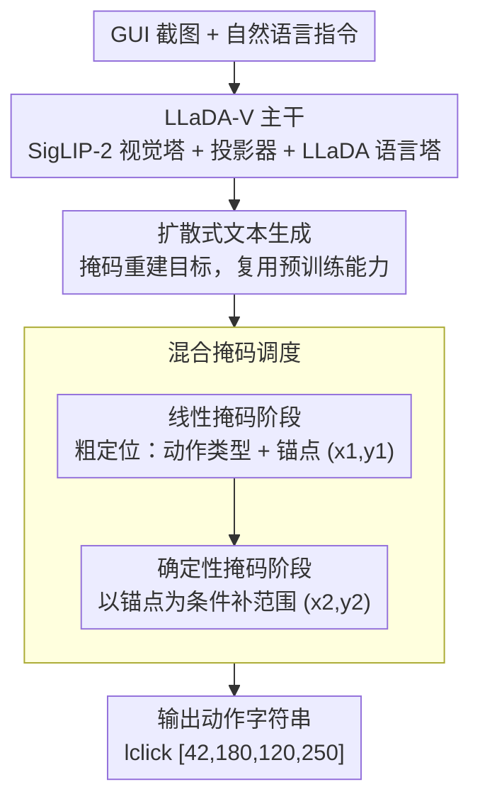

# Towards GUI Agents: Vision-Language Diffusion Models for GUI Grounding

**会议**: CVPR 2026  
**arXiv**: [2603.26211](https://arxiv.org/abs/2603.26211)  
**代码**: 无  
**领域**: GUI Agent / 视觉语言模型  
**关键词**: GUI Grounding, 离散扩散模型, LLaDA-V, 混合掩码, 界面理解

## 一句话总结

首次系统研究离散扩散视觉语言模型（DVLM）在 GUI Grounding 中的应用，将 LLaDA-V 适配为单步动作预测，并提出混合掩码调度（线性+确定性）以捕获边界框坐标间的几何层次依赖，在 Web/Desktop/Mobile 界面上展示了扩散模型作为 GUI Agent 基础的可行性。

## 研究背景与动机

GUI Grounding 是构建多模态 GUI Agent 的基础能力：给定自然语言指令和界面截图，模型需要定位目标元素并生成对应动作。这是实现软件操作和数字工作流自动化的关键。

**当前主流方案的局限**：
- 自回归（AR）视觉语言模型（如 Qwen2.5-VL、CogAgent、UI-TARS）主导了 GUI Grounding 研究
- AR 模型继承了固有的架构限制：**顺序解码**和**单向注意力**
- 这些限制使得模型在生成坐标 token 时无法利用后续上下文信息

**离散扩散模型的潜力**：
- LLaDA-V、MMaDA 等离散扩散视觉语言模型（DVLM）在多模态理解和推理中表现出色
- DVLM 具有三个独特优势：**双向注意力**、**并行 token 生成**、**迭代精炼**
- 但它们在 GUI Grounding 中的潜力完全未被探索

**核心挑战**：
GUI Grounding 输出是结构化的动作字符串（如 `lclick [42,180,120,250]`），包含动作类型和边界框坐标 $B = (x_1, y_1, x_2, y_2)$。其中 $(x_1, y_1)$ 是动作锚点，$(x_2, y_2)$ 定义空间范围，存在几何层次依赖。LLaDA-V 默认的线性掩码调度对所有 token 随机腐蚀，可能破坏模型学习这种一致几何依赖关系的能力。

## 方法详解

### 整体框架

这篇论文想回答一个此前没人验证过的问题：离散扩散视觉语言模型能不能胜任 GUI Grounding？为此作者直接拿现成的 LLaDA-V (8B) 来改——它由 LLaDA 离散扩散语言塔、SigLIP-2 视觉塔，以及一个把视觉嵌入对齐到语言 token 空间的两层 MLP 投影器组成。整条流程很直白：GUI 截图和自然语言指令一起进模型，模型输出一串动作字符串，比如 `lclick [42,180,120,250]` 或 `type_in [50,90,200,130] hello`，其中前面是动作类型、方括号里是目标元素的边界框。难点不在"生成文本"，而在让一个原本随机腐蚀所有 token 的扩散模型学会坐标之间的几何依赖，这正是后面混合掩码要解决的事。

### 关键设计

**1. 把 GUI Grounding 重写成扩散式文本生成：让坐标预测复用 LLaDA-V 的预训练能力**

作者没有为 GUI 任务设计新的检测头，而是把"定位元素"整体当成一个文本生成问题——给定图像 $v$ 和指令 $p_0^1$，模型要生成动作类型加边界框坐标这一串 token。训练上沿用离散扩散的掩码重建目标：随机把一部分响应 token 替换成掩码符 `[M]`，让模型把它们还原回来，损失只在被掩位置上计算：

$$L(\theta) = -\mathbb{E}\Big[\tfrac{1}{t} \sum_i \mathbb{1}[r_t^{1,i}=[M]] \times \log p_\theta(r_0^{1,i} \mid v, p_0^1, r_t^1)\Big]$$

推理时则从一条全掩码的序列出发，反向扩散逐步去噪，并用低置信度重掩码策略把没把握的位置再盖回去重猜。这样做的好处是几乎零改造就能继承 LLaDA-V 三阶段预训练（视觉-语言对齐、指令微调、推理增强）攒下的能力，而它天生的双向注意力也让模型在写坐标时能同时看到前后文，绕开了 AR 模型顺序解码、单向注意力的硬伤。

**2. 混合掩码调度：把边界框"先定锚点、再补范围"的几何层次烧进掩码策略**

这是全文的核心改动。一个边界框 $B=(x_1,y_1,x_2,y_2)$ 并不是四个对等的数：$(x_1,y_1)$ 是动作锚点、决定点在哪里，$(x_2,y_2)$ 在锚点确定后才框出范围，两者是条件关系而非并列。LLaDA-V 默认的线性掩码对所有 token 随机腐蚀，很少恰好凑出"锚点可见、范围被掩"这种配置，模型也就学不到这层依赖。作者于是把训练拆成两个阶段：线性掩码阶段保留标准调度，掩码概率 $p_{mask}=(1-\varepsilon)t+\varepsilon$，负责粗粒度定位，即预测动作类型和锚点 $(x_1,y_1)$；确定性掩码阶段则把所有响应 token 完全盖住，以图像 $I$、指令 $N$ 和已知锚点 $(x_1,y_1)$ 为条件去补出剩余坐标，强化模型对条件概率

$$p_\theta(x_2, y_2 \mid a_{type}, x_1, y_1, I, N)$$

的建模。直观地说，模型被强迫走一遍"从粗到细"：先认出这是一次 `lclick`、锚点落在 $(42,180)$，再在这个前提下补出范围到 $(120,250)$，凑成完整的 `lclick [42,180,120,250]`。把领域里"锚点先于范围"的先验显式写进掩码调度，正是混合掩码相对纯线性掩码的增益来源。

**3. 数据扩展与标注清洗：用更多、更干净的监督把扩散模型的先验喂饱**

作者先用 7k Mind2Web 样本做可行性验证，确认扩散模型确实能定位之后，再把训练集扩到 120K 的多领域混合：Mind2Web (20K) + WebLinX (20K) + OS-Atlas (60K，覆盖 Web/Mobile/Desktop) + Rico Widget Caption (20K)，让模型见过三类平台的界面。两个标注细节也很关键：对分辨率很大的截图做随机裁剪，但保证目标元素仍在裁剪框内，避免小元素被压没；同时用 OCR 文本关联的标注替代纯图标级标注，给坐标预测多一层文本锚点。数据这一步看似工程，但实验里它带来的 SSR 提升比混合掩码还大，说明对一个预训练规模本就吃亏的扩散模型，喂饱先验是补差距的关键杠杆。

**4. 推理参数权衡：扩散步数、生成长度、块长度三者协同定延迟-精度平衡点**

扩散模型推理绕不开三个旋钮——扩散步数、生成长度、块长度。作者扫了一遍发现把三者都设为 64 时精度和延迟最划算：再往上加，SSR 基本持平（如 64→128 时 80.67% 对 80.63%），延迟却继续涨。这条曲线说明坐标这种短输出并不需要很深的去噪步数就能收敛，盲目堆步数只是白白增加延迟，因此把三个参数锚在 64 是后续所有实验的默认设置。

### 损失函数 / 训练策略

训练目标就是上面离散扩散的掩码语言建模损失。初始可行性实验在 7k Mind2Web 上训 10 个 epoch；大规模实验换成 120K 多领域混合数据，混合掩码的线性阶段与全确定性阶段分别训练。评估用两个指标：**Action-Type F1** 衡量动作类型分类的对错，**Step Success Rate (SSR)** 看预测边界框的中心点是否落在 ground-truth 框内。

## 实验关键数据

### 主实验

AR vs NAR（非自回归）GUI Grounding 对比（120K 训练数据）：

| 数据集 | 指标 | Phi (3B) | Qwen2.5-VL (3B) | Qwen2.5-VL (7B) | LLaDA-V (线性) | LLaDA-V (混合,Ours) |
|--------|------|----------|------------------|------------------|----------------|---------------------|
| Mind2Web | SSR (%) | 56.8 | 79.3 | 81.9 | 82.4 | **83.9** |
|  | F1 (%) | 94.4 | 99.6 | 99.9 | 98.5 | **100.0** |
| ScreenSpot-Web-Icon | SSR (%) | 62.6 | 79.1 | 85.4 | 57.8 | 63.1 |
| ScreenSpot-Web-Text | SSR (%) | 77.0 | 83.0 | 83.0 | 73.5 | 74.8 |
| VisualWebArena | SSR (%) | 68.5 | 88.9 | 87.2 | 61.4 | **67.5** |

混合掩码 vs 线性掩码的 SSR 提升：
- Mind2Web: +1.6
- ScreenSpot-Web-Icon: +5.3
- ScreenSpot-Web-Text: +1.3
- VisualWebArena: **+6.1**

### 消融实验

**推理参数影响**（Mind2Web 7K）：

| 扩散步数 | 生成长度 | 块长度 | 收敛步数 | SSR (%) | 延迟(s) |
|----------|----------|--------|----------|---------|---------|
| 32 | 32 | 32 | 13 | 78.15 | 2.56 |
| 64 | 64 | 64 | 25 | 80.67 | 4.84 |
| 128 | 128 | 128 | 25 | 80.63 | 5.01 |

**裁剪 + OCR 标注的影响**（Mind2Web 7K）：

| 配置 | SSR (%) | 延迟(s) | 说明 |
|------|---------|---------|------|
| 原始截图 | 80.67 | 4.84 | 基线 |
| 裁剪 + OCR 标注 | **83.31** | **4.46** | +2.68 SSR, -0.38s |

**数据扩展效果**（线性掩码）：

| 数据集 | 7K 训练 SSR | 120K 训练 SSR | 提升 |
|--------|-----------|-------------|------|
| ScreenSpot-Web-Text | 54.4 | 73.5 | +19.1 |
| ScreenSpot-Web-Icon | 19.9 | 57.8 | +37.9 |
| VisualWebArena | 32.4 | 61.4 | +29.0 |

### 关键发现

1. **DVLM 具备 GUI Grounding 能力**：即使是仅用 7k 样本微调的 LLaDA-V，也能在 Mind2Web 上达到 80.67% SSR，证明扩散模型可进行空间定位
2. **混合掩码一致性改善精度**：在所有 4 个基准上 SSR 提升 1.3-6.1 点，验证了显式建模锚点-范围条件依赖的有效性
3. **数据扩展效果显著**：120K 多领域数据平均提升 20+ SSR 点，同时减少 1-1.5s 延迟和 8-9 个收敛步数
4. **与 AR 模型仍有差距**：LLaDA-V (8B) 在 ScreenSpot 和 VWA 上落后 Qwen2.5-VL (7B) 约 15-20 点，但考虑到预训练数据量差异巨大，差距合理
5. **延迟是主要瓶颈**：混合掩码引入额外延迟（3-6.5s vs AR 的 1.1s），因为需要两阶段顺序推理

## 亮点与洞察

- **首次探索扩散模型在 GUI Grounding 中的可行性**：填补了 DVLM 在这一重要应用方向的空白，发现扩散模型的双向注意力和迭代精炼对坐标预测确实有帮助
- **混合掩码的"从粗到细"设计巧妙**：将边界框的几何层次（锚点→范围）编码到掩码调度中，是一种将领域先验注入扩散过程的优雅方式
- **数据扩展带来的效率提升出乎意料**：更多数据不仅提高精度，还减少了收敛步数和延迟，说明更好的先验加速了去噪过程
- **诚实地呈现与 AR 模型的差距**：论文不回避 DVLM 在预训练规模和延迟上的劣势，定位为"探索性研究"而非声称全面超越

## 局限与展望

1. **延迟问题严重**：扩散模型的多步去噪导致延迟是 AR 模型的 3-6 倍，对实时交互场景不友好
2. **仅支持单步动作**：当前仅处理单步 Grounding，多步规划和依赖动作序列留待未来
3. **预训练数据不对等**：LLaDA-V 的预训练数据远少于 Qwen2.5-VL，性能差距可能随更充分的预训练缩小
4. **混合掩码的两阶段依赖增加复杂度**：线性阶段的输出作为确定性阶段的输入，引入了额外的顺序计算
5. **动作类型过于简单**：仅支持 lclick/hover/type_in 三种，实际 GUI 操作更复杂（滚动、拖拽等）
6. **缺乏对比最新 GUI Agent 系统**：未与 UI-TARS、OS-Atlas 等完整系统做端到端对比

## 相关工作与启发

- **LLaDA-V / MMaDA**：离散扩散 VLM 的基础架构，证明了扩散范式在多模态理解中的可行性
- **CogAgent / UI-TARS**：AR 方法的代表，通过大规模预训练和指令微调实现强 GUI Grounding
- **SeeClick / UGround**：GUI 预训练和合成数据增强的方法，可为 DVLM 的训练提供数据策略参考
- **D3PM**：离散扩散的理论基础，使用均匀类别转移

## 评分

- 新颖性: ⭐⭐⭐⭐ （首次将DVLM用于GUI Grounding，混合掩码设计有创意，但基于已有模型适配）
- 实验充分度: ⭐⭐⭐⭐ （4个基准、推理参数消融、数据扩展分析，但缺少与更多GUI Agent的对比）
- 写作质量: ⭐⭐⭐⭐ （定位清晰，诚实呈现优缺点，但部分表格格式略凌乱）
- 价值: ⭐⭐⭐⭐ （为GUI Agent开辟了扩散模型的新方向，但实用性受限于延迟和性能差距）

<!-- RELATED:START -->

## 相关论文

- [\[ICML 2026\] Scaling, Benchmarking, and Reasoning of Vision-Language Agents for Mobile GUI Navigation](../../ICML2026/llm_agent/scaling_benchmarking_and_reasoning_of_vision-language_agents_for_mobile_gui_navi.md)
- [\[CVPR 2026\] GUI-CEval: A Hierarchical and Comprehensive Chinese Benchmark for Mobile GUI Agents](gui-ceval_a_hierarchical_and_comprehensive_chinese_benchmark_for_mobile_gui_agen.md)
- [\[CVPR 2026\] EchoTrail-GUI: Building Actionable Memory for GUI Agents via Critic-Guided Self-Exploration](echotrail-gui_building_actionable_memory_for_gui_agents_via_critic-guided_self-e.md)
- [\[ACL 2025\] GUICourse: From General Vision Language Model to Versatile GUI Agent](../../ACL2025/llm_agent/guicourse_from_general_vision_language_model_to_versatile_gui_agent.md)
- [\[CVPR 2026\] HATS: Hardness-Aware Trajectory Synthesis for GUI Agents](hats_hardness-aware_trajectory_synthesis_for_gui_agents.md)

<!-- RELATED:END -->
