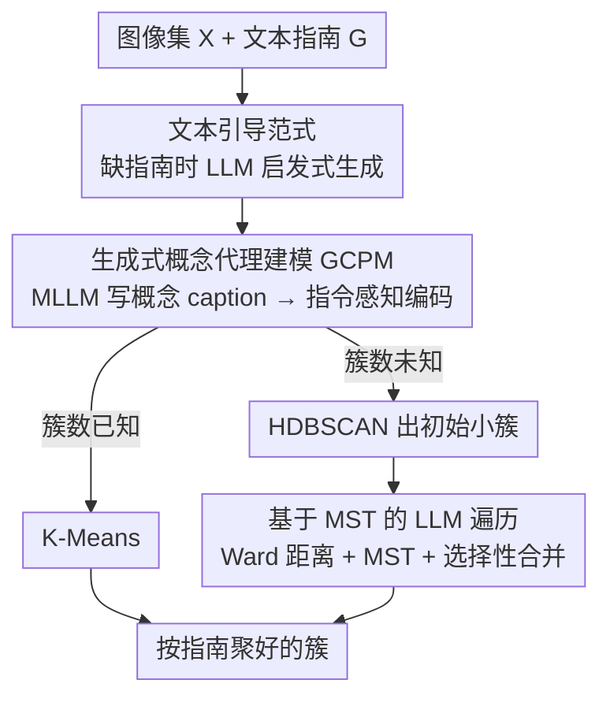

# Universal Guideline-Driven Image Clustering via a Hybrid LLM Agent

**会议**: CVPR 2026  
**论文**: [CVF Open Access](https://openaccess.thecvf.com/content/CVPR2026/html/Zhong_Universal_Guideline-Driven_Image_Clustering_via_a_Hybrid_LLM_Agent_CVPR_2026_paper.html)  
**代码**: https://clustering-agent.github.io/ (项目页)  
**领域**: LLM Agent / 图像聚类  
**关键词**: 文本引导聚类, 概念代理, 指令感知嵌入, 最小生成树, 免训练

## 一句话总结
本文提出首个用「文本指南」统一各类图像聚类场景（通用 / 细粒度 / 多视角 / 长尾）的免训练混合 LLM 智能体：先用 MLLM 把图像写成「概念代理 caption」再交给指令感知嵌入模型，得到对齐指南的嵌入直接喂给传统聚类算法；当簇数未知时再用一套基于最小生成树（MST）的 LLM 遍历选择性合并小簇，把昂贵的 LLM 调用从 $O(M^2)$ 降到 $O(M\log M)$，在四类任务上全面超越需要专门训练的方法。

## 研究背景与动机

**领域现状**：图像聚类的传统做法（K-Means、DBSCAN）靠静态编码器产生嵌入、再用数学距离度量分组，本质上不理解视觉语义；后来的深度聚类引入专门训练策略来引导聚类过程。

**现有痛点**：这些方法严重「碎片化」——为通用物体分类优化的方法做不了细粒度区分，为均衡分布设计的方法在长尾数据上崩溃，单视角聚类无法同时处理多个标准。每换一个场景就得换一套专门方案、甚至重新训练，实际部署极受限。已有的文本引导方法也只能一次处理单一、具体的标准（按颜色「或」按物种，不能两者兼顾），或要为新标准重新训练，或假设簇数已知。

**核心矛盾**：用户真实需求是「按一段自然语言指南聚类」——从简单指令（"按颜色分组"）到复合多属性要求（"按品牌和用途整理运动鞋"）。但一个直觉方案「把图像和指南直接丢给多模态指令感知嵌入器」会失败：一是现有多模态嵌入器处理不了复杂指南；二是指南里关键但视觉不显著的属性，会被视觉上强势却无关的特征「盖过」（比如卡牌按花色分组时，牌面数字的布局会主导花色这一意图）。

**本文目标**：构建第一个由文本指南驱动、免训练、能横跨「通用↔细粒度、全局↔局部、均衡↔长尾」的统一聚类框架，并且把 LLM 语义推理的强大与计算成本可控这两件事调和起来。

**切入角度**：与其让嵌入器直接「看图配指令」，不如插入一个文本中介——先用 MLLM 按指南把图像「翻译」成只聚焦相关属性的文字描述，借此把纠缠的视觉属性显式解开，再编码。这样既得到对齐指南的嵌入，又天然支持把多个标准组合进同一表示。

**核心 idea**：用「概念代理 caption」把视觉属性解纠缠后再编码（GCPM），再用「MST 引导的选择性 LLM 合并」处理簇数未知的自动发现——用嵌入的效率干常规判断，只在语义真正复杂处才花 LLM。

## 方法详解

### 整体框架
整个系统是一个免训练的两阶段混合智能体：输入是一组图像 $X=\{x_1,\dots,x_N\}$ 加一段文本指南 $G$（用户给定，或在缺失时由 LLM 用启发式提示自动生成），输出是按指南分好的簇 $C=\{C_1,\dots,C_M\}$，即 $C=f(G,X)$。

第一阶段 **GCPM** 负责把「图像 + 指南」转成对齐指南的嵌入：MLLM 按指南指定的属性集 $A\subseteq G$ 给每张图写概念代理 caption，再用指令感知嵌入模型编码，产物可直接喂给标准聚类算法。第二阶段按簇数是否已知分流：已知簇数时 K-Means 一步到位；簇数未知（真实世界更常见）时先用 HDBSCAN 得到初始小簇，再用 **MST-based LLM Traversal** 选择性地把同质小簇合并成大簇。

### 关键设计

**1. 文本引导范式与自动指南生成：把"聚类标准"从硬编码变成一段可组合的自然语言**

碎片化的根源在于「聚类标准」被写死进了模型或训练目标，换标准就得换方法。本文把标准抽象成文本指南 $G$，其中包含一组分组属性 $A=\{a_1,\dots,a_k\}\subseteq G$（如鸟类聚类里的"尾形""翼色"），框架只需读这段文字就能切换任务，因此天然支持复合、多视角、抽象语义这些以前要专门方案才能做的事。当用户给不出明确指南时（对数据集先验有限），作者用一套启发式提示让 LLM 调用自身知识生成合适的聚类指南，必要时再借助无监督的数据子结构探索找出基本标准、喂给 LLM 生成指南。注意全程保持无监督——任何提示都不含真值标签。这一层是整个「通用性」的来源：后面所有组件都只对 $G$ 负责，不对具体任务负责。

**2. 生成式概念代理建模（GCPM）：用文本中介把纠缠的视觉属性解开再编码**

直接拿多模态指令感知嵌入器「看图配指令」有两个硬伤：综合聚类里没被显式问到的细粒度属性会被淹没；维度特定聚类里视觉显著但无关的属性会喧宾夺主。GCPM 用一个文本中介绕开它：第一步用 MLLM 当 captioning 模型 $f_{caption}$ 抽取聚焦概念的描述

$$c_i = f_{caption}(A, x_i), \quad A \subseteq G,$$

这一步把指南指定的属性显式「surface」成文字，实现属性解纠缠；第二步用指令感知嵌入模型 $f_{embed}$ 编码这段概念代理 caption

$$h_i = f_{embed}(S, c_i), \quad S \subseteq G,$$

其中 $S$ 指定本次聚类的关注焦点（可以是单个属性，也可以是 $A$ 里全部属性的全局定义）。得到的嵌入 $H=\{h_1,\dots,h_N\}$ 可直接送进 K-Means 等标准算法：$C=\text{Clustering}(H)$。它有效的关键在于「先写成文字再编码」——文字这一中介强制把视觉上纠缠的属性拆成可读的条目（卡牌"数字"与"花色"被分开陈述），从而让嵌入按指南而非按视觉显著度组织，这是直接多模态编码做不到的。

**3. 基于 MST 的 LLM 遍历：只在语义复杂处花 LLM，把合并代价从 $O(M^2)$ 压到 $O(M\log M)$**

簇数未知时直觉是用 HDBSCAN，但作者观察到 HDBSCAN 倾向产出一致的小簇、却合并不了同质簇（高精度、极低召回）——它擅长把明显相似的样本聚在一起，但样本量大或变异复杂时因密度本质而乏力。让 LLM 来判断「哪些小簇该合并」语义上最靠谱，但朴素两两比较要 $O(M^2)$ 次 LLM 调用，太贵。MST 遍历的做法是：对 HDBSCAN 产出的簇（含孤立点 singleton）用 **Ward 距离** 算两两距离

$$d(C_1, C_2) = \frac{|C_1|\cdot|C_2|}{|C_1|+|C_2|}\,\lVert m_{C_1} - m_{C_2}\rVert^2,$$

其中 $m_{C_i}$ 是簇质心；Ward 距离同时考虑簇大小和质心间隔，适合层次合并。再由距离矩阵 $D\in\mathbb{R}^{M\times M}$ 构造最小生成树 $T=MST(D)$，它给出一个「优先评估最近簇对」的遍历顺序，保证最有希望合并的候选先被 LLM 看到。沿 $T$ 的边按距离升序，逐对询问合并 LLM $f_{merge}$：

$$p = f_{merge}(G, C_i, C_j), \quad p \in \{0,1\},$$

每个簇用「离质心最近的 Top-$K$（$K=5$）样本的 GCPM caption」来表示，$p=1$ 就合并并更新后续含 $C_i$ 或 $C_j$ 的边、$M$ 减一；一轮里若没有任何合并则停止。再加两个省钱技巧：缓存历史决策避免重复询问、跳过此前被拒绝的簇对。作者基于合理的合并概率假设证明期望 LLM 调用为 $O(M\log M)$（证明在附录），且该设计因为操作在「簇」而非「样本」上、天然支持把新样本当作新簇增量合并，无需像传统算法那样重聚类。

## 实验关键数据

### 主实验
四类任务统一评测：通用聚类 GC（CIFAR-10 / STL-10 / ImageNet-10）、多视角聚类 MC（Fruit / Card / CIFAR10-MC）、细粒度聚类 FC（CUB / Stanford Dogs / Cars / Oxford Flowers）、本文新提的长尾电商聚类 LC（ABO-LC）。骨干用 QWen2.5-VL-Instruct(7B) 同时做 captioning 与合并；三种嵌入器对应 GCPM-I（INSTRUCTOR-large 335M）/ GCPM-E（E5-Mistral 7B）/ GCPM-G（GME-Qwen2-VL 7B）。全部 inference、零训练。

通用聚类（簇数已知用 K-Means，ACC %）：

| 方法 | 是否需训练 | CIFAR-10 ACC | STL-10 ACC | ImageNet-10 ACC |
|------|-----------|------|------|------|
| IDCTCL（前 SOTA） | 是 | 92.7 | 92.7 | 97.2 |
| LFSS | 是 | 93.4 | 86.1 | 93.2 |
| IC\|TC（免训练 LLM） | 否 | 88.4 | 97.4 | - |
| **GCPM-G（本文）** | 否 | **94.1** | **98.8** | **98.8** |

GCPM-G 在 ImageNet-10 达 98.8% ACC，超过需训练的 IDCTCL 1.6%；MC 的 Fruit 数据集 GCPM-G 达 99.9% NMI，明显高于 Multi-Sub 的 98.5%。免训练却全面压过专门训练的方法。

长尾电商 ABO-LC（10,756 件商品 / 4,952 个真值簇，78.7% 的簇 ≤2 个样本，簇数未知）：

| 方法 | ACC | NMI | ARI |
|------|-----|-----|-----|
| IC\|TC（已知簇数） | 5.5 | 35.3 | 5.3 |
| GCPM-I + K-Means | 55.7 | 92.9 | 38.4 |
| GCPM-E + HDBSCAN（未合并） | - | 92.3 | 28.2 |
| **GCPM-E + MST Traversal** | - | 93.1 | **51.5** |

极端长尾下 K-Means 的「均衡簇」假设失效，HDBSCAN+MST 在不知道簇数的前提下反而拿到最高 ARI 51.5，比 K-Means 的 38.4 更适合真实分布。

### 消融实验

MST Traversal 对 HDBSCAN 初始结果的提升（BCubed 精度/召回，ImageNet-10 与 Card-Number）：

| 配置 | 簇数 | B-Prec. | B-Rec. |
|------|------|---------|--------|
| K-Means（已知簇数） | 10 | 98.6 | 98.6 |
| HDBSCAN（合并前） | 7034 | 99.7 | 19.9 |
| HDBSCAN + MST（合并后） | 251 | 93.5 | 62.3 |

GCPM 概念代理 caption 的价值（GME-Qwen 为嵌入器，K-Means，NMI %）：

| caption 策略 | ImageNet-10 | Card-Number | Stanford Cars |
|--------------|-------------|-------------|---------------|
| 仅图像 | 94.7 | 71.9 | 61.5 |
| 标准 caption | 93.7 | 73.3 | 69.2 |
| **GCPM 概念代理 caption** | **96.7** | **82.0** | **86.2** |

LLM 调用效率（MST Traversal 的 LLM 调用数 / 样本数比）：

| 数据集 | 样本数 | LLM 调用 | 调用/样本比 |
|--------|--------|----------|-------------|
| ImageNet-10 | 13000 | 11232 | 0.86 |
| Card-Number | 8029 | 6506 | 0.81 |
| Stanford Cars | 8041 | 10803 | 1.34 |

### 关键发现
- **MST Traversal 在自动簇发现里是决定性的**：ImageNet-10 的 ARI 从 0.3 直接拉到 72.1（Max Δ +72.1）；本质是补上了 HDBSCAN「高精度低召回」的短板——合并后簇数从 7034 收到 251、召回从 19.9% 升到 62.3%，只牺牲很小的精度。
- **嵌入器有清晰层级，但有反例**：总体 MLLM 嵌入（GCPM-G）> LLM 嵌入（GCPM-E）> 普通指令感知编码（GCPM-I）；但 Card 数据集上 GCPM-E（数字标准 91.1% NMI）反超 GCPM-G（82.0%），因为牌面数字与花色在单图里视觉高度纠缠，此时「先写成文字再编码」的概念代理路线比直接多模态嵌入更能解开纠缠——恰好印证 GCPM 的设计动机。
- **任务类型决定 MST 收益大小**：GC 提升巨大、抽象语义标准（Fruit 物种 +52.9 NMI）收益大、视觉模式清晰的标准收益小；FC 提升相对温和（因细粒度需极精确判断，作者用更保守的合并提示，宁可不合也不错合）。
- **效率可控**：LLM 调用/样本比仅 0.81–1.34，远低于朴素两两比较的 $O(M^2)$；MST 在「簇」而非「样本」上操作、加缓存与拒绝跳过，进一步压低调用。

## 亮点与洞察
- **「文本中介解纠缠」是最巧的一招**：与其指望多模态嵌入器自己分清纠缠属性，不如先用 MLLM 把图写成只谈相关属性的文字，强行把视觉属性拆成可读条目再编码——Card 数据集上的反例（文字路线反超多模态）正是这一思路最有说服力的证据。
- **把 LLM 当"贵但精的裁判"、用 MST 决定何时请它**：嵌入干常规、LLM 只在最有希望合并的簇对上出手，是一种很可复用的「贵推理选择性调用」范式，可迁移到任何「便宜近似 + 昂贵精判」的流水线（检索重排、主动学习、agent 工具调用）。
- **免训练却全面 SOTA**：全程 inference、零微调，却在四类任务上压过需要专门训练的方法，说明现代 VLM/LLM 的语义先验足以替代任务特定训练，工程落地价值大。
- **新建长尾基准 ABO-LC 有现实意义**：78.7% 簇 ≤2 样本的极端长尾，正是电商真实场景，填补了均衡假设基准的空白。

## 局限与展望
- **强依赖 LLM/MLLM 质量**：caption 抽取与合并判断都压在 QWen2.5-VL 上，模型若漏掉指南里的细属性或误判簇对相似性，错误会直接传导到聚类结果。
- **无监督指南带来的精度损失**：作者承认合并后精度略降，部分源于指南是无监督生成、缺真值而有歧义，以及 LLM 偶尔难以解读细微的指南差异；他们把改进寄望于提示优化（附录）。
- **FC 收益有限**：细粒度场景因需极精确判断只能用保守合并提示，MST 提升不大（多在 +1～3 NMI），说明该混合范式对「细微类间差异」尚未完全解决。
- **调用/样本比仍接近 1**：虽为 $O(M\log M)$，Stanford Cars 上调用/样本比达 1.34，大规模数据下的绝对 LLM 调用量与延迟仍是部署考量；可探索更激进的候选剪枝或更轻量的合并代理。

## 相关工作与启发
- **vs Multi-Sub / Multi-MaP**：它们用代理学习支持用户指定视角，但本质受限于单标准或特定场景的嵌入策略；本文用文本指南 + GCPM 一次处理复合标准，且免训练。
- **vs IC\|TC**：IC\|TC 开创了免训练 LLM 图像聚类流水线，但局限于单一具体标准、且要在整个数据集上昂贵迭代；本文支持复合/抽象指南，并用 MST 把 LLM 调用从全量两两压到选择性合并（ABO-LC 上 NMI 35.3 → 92+）。
- **vs ClusterLLM**：ClusterLLM 用三元组比较引导聚类却要微调嵌入、且只处理单标准；本文不微调、支持多标准，且用 MST 显著降低 LLM 调用。
- **vs DiFiC（细粒度）**：DiFiC 靠扩散模型语义抽取在细粒度上很强，但需数据集特定训练且无法纳入用户指南；本文以免训练、可指南化的方式覆盖含细粒度在内的多场景。

## 评分
- 新颖性: ⭐⭐⭐⭐⭐ 首个用文本指南统一四类聚类场景的免训练框架，「概念代理解纠缠 + MST 选择性 LLM 合并」两处设计都很有原创性。
- 实验充分度: ⭐⭐⭐⭐⭐ 覆盖 GC/MC/FC/LC 四类十余数据集、三种嵌入器、BCubed/效率/caption 多维消融，并自建长尾基准，三随机种子。
- 写作质量: ⭐⭐⭐⭐ 动机与方法链条清晰、算法伪代码完整；细节多压在附录，正文部分公式与超参需对照附录才能完全复现。
- 价值: ⭐⭐⭐⭐⭐ 免训练即 SOTA、统一多场景、LLM 调用可控，对实际部署（尤其电商长尾）有直接落地价值。

<!-- RELATED:START -->

## 相关论文

- [\[AAAI 2026\] PerTouch: VLM-Driven Agent for Personalized and Semantic Image Retouching](../../AAAI2026/llm_agent/pertouch_vlm-driven_agent_for_personalized_and_semantic_image_retouching.md)
- [\[ACL 2026\] CLAG: Adaptive Memory Organization via Agent-Driven Clustering for Small Language Model Agents](../../ACL2026/llm_agent/clag_adaptive_memory_organization_via_agent-driven_clustering_for_small_language.md)
- [\[ICLR 2026\] Exploratory Memory-Augmented LLM Agent via Hybrid On- and Off-Policy Optimization](../../ICLR2026/llm_agent/exploratory_memory-augmented_llm_agent_via_hybrid_on-_and_off-policy_optimizatio.md)
- [\[CVPR 2026\] RetouchIQ: MLLM Agents for Instruction-Based Image Retouching with Generalist Reward](retouchiq_mllm_agents_for_instruction-based_image_retouching_with_generalist_rew.md)
- [\[ACL 2025\] GuideBench: Benchmarking Domain-Oriented Guideline Following for LLM Agents](../../ACL2025/llm_agent/guidebench_guideline_following.md)

<!-- RELATED:END -->
