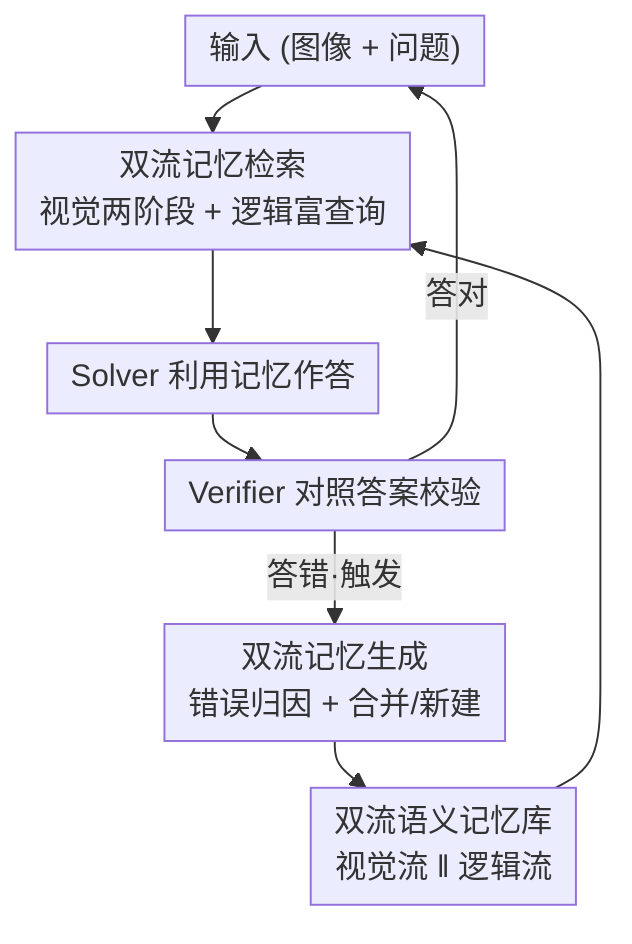

# ViLoMem: Agentic Learner with Grow-and-Refine Multimodal Semantic Memory

**会议**: CVPR 2026  
**论文**: [CVF Open Access](https://openaccess.thecvf.com/content/CVPR2026/html/Bo_ViLoMem_Agentic_Learner_with_Grow-and-Refine_Multimodal_Semantic_Memory_CVPR_2026_paper.html)  
**代码**: 项目页 https://weihao-bo.github.io/ViLoMeo-page/ （未明确开源仓库）  
**领域**: Agent / 多模态记忆  
**关键词**: 多模态记忆、Agent 自我改进、视觉感知错误、grow-and-refine、终身学习

## 一句话总结
ViLoMem 给多模态大模型外挂一套「视觉流 + 逻辑流」双通道语义记忆，让 agent 在解题失败后把感知错误和推理错误**分开归因、分开存储、分开检索**，用 grow-and-refine 的增量更新避免遗忘，在六个多模态推理 benchmark 上稳定提升 pass@1 并显著减少重复犯错。

## 研究背景与动机

**领域现状**：多模态大模型（MLLM）在单题推理上已经很强，但它们每道题都是「从零开始」（de novo）——独立求解、反复推导同样的结论、反复犯同样的错。为缓解这点，近期出现了「记忆增强 agent」，把过去成功/失败的轨迹存下来供后续查询复用（如 Dynamic Cheatsheet、ACE）。

**现有痛点**：作者指出当前记忆 agent 有三个致命缺陷。其一是 **brevity bias（简洁性偏置）**：记忆在反复重写中越来越短，关键领域知识被逐渐侵蚀。其二是只记**单一模态**：即便是多模态任务，记下来的也只是「高层逻辑摘要」这一条文本轨迹，完全丢掉了视觉 grounding 和感知线索。其三是 **logic-centric（逻辑中心）**：现有框架几乎只捕捉推理模式，忽视了视觉维度。

**核心矛盾**：作者用自己的消融统计戳穿了「逻辑记忆够用」这个假设——在六个 benchmark 上，**视觉错误占比（59%–93%）一直高于逻辑错误**（Fig. 4）。多模态数学题里，图形感知错误甚至超过逻辑推理错误，而且视觉错误会**级联**：看错图直接引发下游的逻辑幻觉。所以只记逻辑、不记视觉，等于堵了下游却放任上游决堤。

**切入角度**：作者从人脑的「hub-and-spoke 语义记忆」架构借灵感——视觉语义关联存在颞下/嗅周皮层（视觉 spoke），抽象推理规则存在颞顶皮层（逻辑 spoke），由前颞叶（ATL）这个中枢整合。语义记忆天生就是**多模态且分流**的。

**核心 idea**：用**双流记忆**替代单流逻辑记忆——把「视觉分心模式」和「逻辑幻觉错误」当成两类结构化 schema 分别建模，再通过统一检索协调，遵循 grow-and-refine 原则增量积累，既学成功经验也学失败经验。

## 方法详解

### 整体框架

ViLoMem 是一个**即插即用**的双流记忆插件，核心是一个闭环 **Memory Cycle**：给定多模态输入 $x_i=(I_i, q_i)$（图像 + 问题），系统维护两个记忆库——逻辑记忆 $\mathcal{M}^L$（纯文本推理准则）和视觉记忆 $\mathcal{M}^V$（视觉准则 + 配套源图像）。

一轮循环分四步：**Retrieval** 从两个库并行检索相关记忆 $R^L_i, R^V_i$ → **Utilization** 把它们喂给 Solver 生成候选答案 $\tilde{y}_i$ → **Verifier** 拿 ground truth $y_i$ 校验 → 一旦发现错误（$\tilde{y}_i \ne y_i$）就触发 **Generation**，并行更新两个记忆库得到 $\mathcal{M}^L_{i+1}, \mathcal{M}^V_{i+1}$。这样 agent 在不断的自我纠错中渐进式地提升能力，整个过程无需人工监督，错误自动归因到对应的流。

### 关键设计

**1. 双流语义记忆：把感知错误和推理错误彻底分家**

针对「单流逻辑记忆既丢视觉又会级联犯错」的痛点，ViLoMem 设两个独立的模态专属记忆库。逻辑记忆 $\mathcal{M}^L=\{m^L_1,\dots\}$ 只存文本推理准则；视觉记忆 $\mathcal{M}^V=\{(m^V_1, I^V_1),\dots\}$ 存「视觉准则 + 源图像」的配对——这一步关键，因为视觉知识必须挂在具体图像上才有意义。生成时由两个不同模型分工：纯语言的 LLM 负责逻辑错误归因（公式误用、逻辑谬误等），多模态 MLLM 负责视觉错误归因（物体混淆、漏看视觉符号、空间关系误判等）。这种「分流」直接对应人脑 hub-and-spoke 架构里视觉 spoke 与逻辑 spoke 的分工，消融实验也证明两流捕捉的是**互补而非冗余**的错误模式（去掉任一流都掉点）。

**2. Grow-and-Refine 记忆生成：用相似度门控的合并/新建对抗 brevity bias**

针对「反复重写导致细节侵蚀」的痛点，记忆生成不做粗暴的整体重写，而是先做**相似度过滤**再决定合并还是新建。视觉侧由 MLLM 一次调用同时产出错误指示符和纠正准则 $(e^V_i, g^V_i)=\text{AnalyzeGenerate}^V(I_i, q_i, \tilde{y}_i, y_i)$，存进库前先算新准则与库内每条的文本相似度 $s^V_j=\text{Sim}(\phi_T(g^V_i), \phi_T(m^V_j))$。若最大相似度超过阈值 $\tau^V$ 就触发合并，把最相似那条 $j^*$ 替换为融合版本：

$$\mathcal{M}^V_{i+1}=\mathcal{M}^V_i \setminus \{(m^V_{j^*}, I^V_{j^*})\} \cup \{(\text{Merge}^V(m^V_{j^*}, g^V_i), I^V_{j^*})\}$$

否则新建一条 $\mathcal{M}^V_{i+1}=\mathcal{M}^V_i \cup \{(g^V_i, I_i)\}$。逻辑侧同理，但多一道闸门——只有当错误确实被分类为 $e^L_i=\text{Logical}$ 且准则非空时才更新（视觉错误就不污染逻辑库）：

$$\mathcal{M}^L_{i+1}=\begin{cases} \mathcal{M}^L_i \setminus \{m^L_{j^*}\} \cup \{m^L_{\text{new}}\} & s^L_{j^*} > \tau^L \\ \mathcal{M}^L_i \cup \{g^L_i\} & s^L_{j^*} \le \tau^L \\ \mathcal{M}^L_i & \text{否则} \end{cases}$$

这种「相似就融、不相似就增」的策略既不让库无限膨胀，又保住了细节，从机制上避开了简单迭代重写的灾难性遗忘。

**3. 双流专属检索：视觉要「往哪看」、逻辑要「用哪条」**

针对「视觉记忆不能光靠图像相似度检索」的痛点，视觉流走**两阶段「多模态→文本」管线**。第一阶段用多模态嵌入算 query 图与库内图的视觉相似度 $s^M_j=\text{Sim}(\phi_M(I_i), \phi_M(I^V_j))$，快速召回 top-$k^M$ 候选；但光看图像像不够，第二阶段用「问题分析增强后的查询」$\tilde{q}_i$ 对候选做文本重排 $s^T_j=\text{Sim}(\phi_T(\tilde{q}_i), \phi_T(m^V_j))$，再按阈值 $\tau^V$ 过滤取 top-$k^V$。这保证检回的视觉记忆既图像相似又**语义对题**——精准锁定「这道题里容易踩的视觉陷阱区域」。更进一步，系统还用检回的视觉错误模式生成**问题感知注意力热图**，把历史上易错的区域高亮出来，作为辅助视觉输入和原图一起喂给 solver，显式告诉它「往哪看」。

逻辑流则是纯文本语义匹配，但关键在于**先分析再检索**：不直接拿原问题去匹配，而是先用 LLM 抽出问题的学科领域和核心概念 $a_i=\text{Analyze}^L(q_i, \tilde{y}_i)$，再拼成富查询 $\tilde{q}_i=[q_i; a_i]$，用它去算 $s^L_j$ 并取 top-$k^L$。这样能精准定位题型、挑出真正相关的逻辑 schema，而不是被表面词汇相似度带偏。

**4. 闭环 Solver–Verifier 自纠错：无监督地把错误归因到对应流**

最终生成 $\tilde{y}_i=\text{Gen}(I_i, q_i, R^L_i, R^V_i)$，solver 同时吃原始输入、逻辑准则（结构化推理框架）和视觉准则（显式感知先验）。整套循环由 Verifier 驱动：它对照 ground truth 判对错、过滤冗余/无效轨迹，只有出错时才激活记忆生成，并自动把这次错误归到视觉流还是逻辑流——全程不需要人工标注哪类错误。正是这个「检索→利用→校验→生成」的闭环，让 agent 能跨域迁移知识、渐进式地把重复错误压下去。

## 实验关键数据

### 主实验

在六个多模态推理 benchmark（MMMU / MathVista / MathVision / HallusionBench / MMStar / RealWorldQA）上，对 GPT-4.1、Qwen3-VL-235B、Qwen3-VL-8B 三种模型测三种配置（baseline / step 逐步推理 / +ViLoMem）。下表节选关键对比（pass@1 准确率）：

| 模型 / 配置 | MMMU | MathVista | MathVision | HallusionBench | RealWorldQA |
|---|---|---|---|---|---|
| GPT-4.1 (step) | 74.16 | 74.27 | 47.47 | 74.44 | 72.03 |
| GPT-4.1 (+ViLoMem) | **77.26** | **76.88** | **53.95** | **75.29** | **74.38** |
| Qwen3-VL-235B (step) | 75.97 | 83.66 | 62.17 | 74.58 | 78.66 |
| Qwen3-VL-235B (+ViLoMem) | **79.40** | **84.98** | **62.83** | **75.21** | 77.22 |
| Qwen3-VL-8B (step) | 65.52 | 77.80 | 48.35 | 73.08 | 70.85 |
| Qwen3-VL-8B (+ViLoMem) | **69.90** | **77.87** | **49.34** | **73.19** | **73.59** |

数学推理类提升最明显（GPT-4.1 在 MathVision +6.48、MathVista +2.61），印证了「数学题最依赖视觉 grounding 的思维链」这一动机。小模型 Qwen3-VL-8B 在 MMMU +4.38、RealWorldQA +2.74，说明结构化记忆能给参数容量有限的模型补充互补知识。

### 消融实验

在 GPT-4.1 上选 MMMU / MathVista 验证双流必要性：

| 配置 | MMMU | MathVista | 说明 |
|---|---|---|---|
| GPT-4.1 (step) | 74.16 | 74.27 | 仅逐步推理 |
| w/o logic memory | 76.64 | 75.59 | 去掉逻辑流 |
| w/o visual memory | 76.88 | 75.66 | 去掉视觉流 |
| + ViLoMem | 77.26 | 76.88 | 完整双流 |
| + ViLoMem & attention | **78.21** | 76.87 | 再加注意力热图 |

去掉任一流都掉点，证明两流互补不冗余；去逻辑流在 MathVista 上掉得更多（公式类错误高发），去视觉流则两个 benchmark 掉幅相当（视觉分心错误普遍存在）。注意力热图在 MMMU 上额外加分明显（+0.95 到 78.21），但在 MathVista 上几乎没变，因为图形题需要更细粒度的视觉理解（小尺度顶点、更高空间精度）。

### 关键发现

- **视觉才是主瓶颈**：跨六个 benchmark，视觉错误占生成记忆的 59%–93%，但检索时两流贡献相当（Fig. 4），说明视觉记忆生成多但逻辑记忆复用率也高，双流协调均衡。
- **跨模型蒸馏**：把强模型生成的记忆给弱模型用（Table 3），8B 模型反而超过自产记忆（MMMU +1.36、MathVista +1.33），说明强模型的错误模式编码了更高质量的泛化策略，可当作免微调的轻量知识蒸馏。
- **可扩展不遗忘**：在 WeMath 上做记忆规模压力测试（Table 5），记忆从 15k token 涨到 150k token，准确率从 72.53 单调升到 74.58，且跨 benchmark 渐进记忆（74.58）竟超过直接在 WeMath 上生成的记忆（73.85），证明抽象推理模式能跨任务迁移到未见问题。
- **跨域迁移有异质性**：MathVision/RealWorldQA 能受益于跨域记忆（都靠强空间推理），但 MathVista 与 HallusionBench（图形 vs 自然图像）领域差大时会冲突掉点（Table 4），印证了「分库维护」的设计选择。

## 亮点与洞察
- **「视觉错误级联成逻辑幻觉」这个观察很扎实**：作者不是空喊「视觉重要」，而是用自家消融统计量化了视觉错误占比 59%–93%，把「为什么必须单独建视觉记忆」论证得很硬。
- **视觉记忆存「准则+源图像」配对，而不是只存文本**，这是和 logic-centric 方法最本质的区别——视觉知识脱离图像就失真，配对存储 + 两阶段检索（图像召回→文本重排）解决了「视觉记忆怎么检索」这个非平凡问题。
- **问题感知注意力热图**把「往哪看」做成了可迁移的显式空间先验，相当于把历史踩坑区域标红再喂回去，思路可迁移到任何需要视觉 grounding 的 agent 任务。
- **grow-and-refine 的相似度门控合并**是对抗 brevity bias 的实用 trick：不整体重写、只做相似则融/不似则增，既控制库膨胀又保细节，可复用到任何长期记忆系统。

## 局限与展望
- **双流解耦不彻底**（作者承认）：当 solver 文本偏置强、几乎不看图时，轨迹里视觉信息不足，verifier 生不出有效视觉记忆；反过来当模型看不懂复杂图、视觉描述质量低时，verifier 难以识别清晰的视觉错误，会把所有错误都归到逻辑流，导致混杂更新。未来需要更专门的机制强化双流解耦。
- **依赖强 Verifier 和 ground truth**：整个循环靠 verifier 拿 ground truth 判对错来触发记忆生成，这在有标准答案的 benchmark 上成立，但开放域、无标准答案场景下如何归因错误是个开放问题。
- **知识密集型任务收益有限**：MMMU 这类主要靠事实回忆而非多步推理的任务提升温和，记忆机制对「记忆型」知识帮助不大。
- **检索/生成都靠多个外部大模型**（生成用 235B、嵌入用 Qwen3/Qwen2.5-VL-Embedding），整套 pipeline 的推理开销和延迟在实际部署中需要权衡，论文未给出端到端时延/成本分析。

## 相关工作与启发
- **vs Context Engineering（ReAct / Reflexion / TextGrad / GEPA）**：这类方法只改输入 prompt 不改权重，但上下文是为单次交互构造的、无法长期积累，还有 brevity bias。ViLoMem 用持久化双流记忆库实现跨题积累，正面解决了「短暂性」缺陷。
- **vs Dynamic Cheatsheet / ACE 等长期记忆 agent**：它们存成功/失败策略、做 generate-reflect-curate，但都是 logic-centric 单模态轨迹，丢掉视觉 grounding。ViLoMem 的核心增量就是补上视觉流，并证明视觉才是多模态任务的主瓶颈。
- **vs 人脑 hub-and-spoke 语义记忆**：本文把 ATL 中枢 + 视觉/逻辑 spoke 的认知架构落成 AI 系统——模态专属模块存储 + 语义 hub 整合 + executive verifier 监控冗余，这种「认知科学→工程」的映射本身很有启发。

## 评分
- 新颖性: ⭐⭐⭐⭐ 「双流（视觉+逻辑）多模态语义记忆 + 视觉记忆配对存储 + 注意力热图回灌」组合在记忆 agent 方向是清晰的新增量，动机扎实。
- 实验充分度: ⭐⭐⭐⭐ 六 benchmark × 三模型，外加消融、跨模型迁移、跨域泛化、可扩展性四组分析，覆盖面广；但缺端到端开销分析、verifier 依赖 ground truth 的局限未深究。
- 写作质量: ⭐⭐⭐⭐ 动机推导（视觉错误级联）讲得有说服力，框架图清晰；公式排版在 CVF 抽取版略乱但逻辑可还原。
- 价值: ⭐⭐⭐⭐ 即插即用、免微调、支持跨模型蒸馏，对「让 MLLM agent 从错误中持续学习」是有实用价值的范式。

<!-- RELATED:START -->

## 相关论文

- [\[CVPR 2026\] WorldMM: Dynamic Multimodal Memory Agent for Long Video Reasoning](worldmm_dynamic_multimodal_memory_agent_for_long_video_reasoning.md)
- [\[ICML 2026\] HawkesLLM: Semantic Uncertainty Propagation in Agentic Text Simulation](../../ICML2026/llm_agent/hawkesllm_semantic_uncertainty_propagation_in_agentic_text_simulation.md)
- [\[CVPR 2026\] Experience Transfer for Multimodal LLM Agents in Minecraft Game](experience_transfer_for_multimodal_llm_agents_in_minecraft_game.md)
- [\[ECCV 2024\] VideoAgent: A Memory-augmented Multimodal Agent for Video Understanding](../../ECCV2024/llm_agent/videoagent_a_memory-augmented_multimodal_agent_for_video_understanding.md)
- [\[CVPR 2026\] ReFAct: Empowering Multimodal Web Agents with Visual and Context Focusing](refact_empowering_multimodal_web_agents_with_visual_and_context_focusing.md)

<!-- RELATED:END -->
