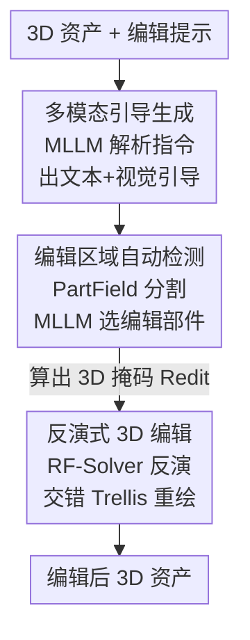

# Vinedresser3D: Towards Agentic Text-guided 3D Editing

**会议**: CVPR 2026  
**论文**: [CVF Open Access](https://openaccess.thecvf.com/content/CVPR2026/html/Chi_Vinedresser3D_Towards_Agentic_Text-guided_3D_Editing_CVPR_2026_paper.html)  
**领域**: Agent / 3D视觉  
**关键词**: 文本引导3D编辑, MLLM Agent, 原生3D生成, 反演式编辑, 无掩码

## 一句话总结
Vinedresser3D 把一个 MLLM（Gemini-2.5-Flash）当作大脑，让它在原生 3D 生成模型 Trellis 的潜空间里调度图像编辑、3D 分割、反演重绘三类工具，仅凭一句文本就能自动定位编辑区域、生成多模态引导并完成"加 / 改 / 删"三类高质量 3D 编辑，全程无需用户手画 3D 掩码。

## 研究背景与动机

**领域现状**：文本引导 3D 编辑（用自然语言改一个已有 3D 资产）目前主要有三条路线。一是 Score Distillation Sampling（SDS）类：把 2D 扩散模型的梯度反传回 3D 表示做逐场景优化；二是"2D 编辑 + 3D 重建"：先用多视图扩散改渲染图，再把编辑后的图重建成 3D；三是并发工作 VoxHammer，它直接在原生 3D 生成模型的潜空间里编辑。

**现有痛点**：SDS 路线逐场景优化极慢、调参不好就会引发全局意外改动；"2D 编辑 + 3D 重建"路线受制于多视图不一致和遮挡造成的空间信息丢失，未观测区域质量差、未编辑几何容易被破坏；VoxHammer 虽然在 3D 里编辑，但**仍需用户手动提供 3D 掩码**，且无法理解复杂指令。

**核心矛盾**：一个理想的文本引导 3D 编辑系统要同时满足三件事——语义上读懂复杂指令、自动在 3D 里精确定位要改的区域、改得既贴合提示又不破坏其余部分。现有任何单一模型都不能三者兼得：理解力强的（MLLM）不会直接操作 3D，能操作 3D 的（生成模型）又不懂高层语义、需要人喂掩码。

**本文目标**：把"读懂指令""定位区域""执行编辑并保护其余部分"拆成三个子问题，分别交给最擅长的专用工具，再用一个会规划的大脑把它们串起来。

**切入角度**：作者观察到 MLLM、图像编辑模型、3D 分割、原生 3D 流模型这几样近年都已成熟，于是主张从"单模型方法"转向"3D 编辑 agent"——让一个 MLLM 当核心，去协调多个专用工具。一个有意思的发现是：哪怕 MLLM 主要在 2D 图文数据上训练，它依然展现出隐式的 3D 语义理解能力（比如能正确推断哪些部件属于待编辑区）。

**核心 idea**：用 MLLM 作为规划核心，把"3D 编辑"重写成"理解指令 → 生成多模态引导 → 自动算出 3D 掩码 → 在 Trellis 潜空间反演重绘"的 agent 流水线，从而实现无掩码、保结构、贴提示的高质量 3D 编辑。

## 方法详解

### 整体框架
输入是一个 3D 资产 + 一句编辑提示，输出是编辑后的 3D 资产。Vinedresser3D 以 Gemini-2.5-Flash 为核心，把整条流水线分成三段：**先用 MLLM 把文字指令解析成结构化的文本引导，并选一个视角调图像编辑模型产出视觉引导；再用 3D 分割 + MLLM 自动算出该改哪些体素（编辑区域 $R_{\text{edit}}$）；最后在 Trellis 的潜空间里做反演 + 掩码重绘，只动编辑区、其余体素从原始反演轨迹里"抄回来"以保身份不变。** 因为 Trellis 的生成本身是两阶段（先结构后外观），整条编辑流水线也随之拆成结构级与外观级两路引导。

### 关键设计

**1. 多模态引导生成：把一句指令拆成结构 / 外观分层的文字 + 一张参考图**

痛点在于：原生 3D 生成模型只认"描述文本"或"单张图"做条件，根本读不懂"把车改成火车"这种需要语义推理、还要保留其余细节的指令。Vinedresser3D 让 MLLM 用多步提示把指令"翻译"成下游模块能吃的引导。具体地，先渲染原资产的多视图喂给 MLLM，让它：① 输出原资产的完整描述、点名要改的部件、判定编辑类型（addition / modification / deletion）；② 预测编辑后的完整描述，并被显式约束"在非编辑区最大程度保留原描述"以守住细粒度细节；③ 单独抽出新部件的描述；④ 因为 Trellis 是两阶段生成，再把这些描述**分解成结构相关（给 stage 1 几何）和外观相关（给 stage 2 潜特征）两套**。文本之外，MLLM 还从 24 个候选视角里挑一个"目标部件可见性 + 整体结构"最佳的视角，连同编辑提示和解耦后的新部件描述一起喂给图像编辑模型 Nano Banana，产出一张高保真参考图。这套分层引导之所以有效，是因为它把"语义理解"这件 3D 生成模型干不了的事，前置交给了真正会推理的 MLLM，并按生成阶段对齐切好，让结构和外观各取所需。

**2. 编辑区域自动检测：用 PartField + MLLM + KNN 投票算出免人工的 3D 掩码**

这是相对 VoxHammer 等工作最大的卖点——用户不用手画 3D 掩码。因为采用体素表示，检测本质上就是判定每个体素属不属于编辑区。对 modification / deletion，先用 3D 分割模型 PartField 把资产拆成 $S$ 个语义部件，把原资产、上色后的分割多视图、以及指定目标部件的文本引导一起喂给 MLLM，由它选出待编辑部件 $P_{\text{edit}}$，其余隐式记为保留部件 $P_{\text{pres}}=A\setminus P_{\text{edit}}$；由于 PartField 的粒度依赖 $S$，作者对 $S\in[3,8]$ 各算一遍分割全部喂给 MLLM，让它挑语义最精细的那套。难点在于把"部件"翻译成"体素编辑区 $R_{\text{edit}}$"：addition 时 $R_{\text{edit}}$ 是原资产之外的所有体素，deletion 时直接等于 $P_{\text{edit}}$，但 modification 不能简单把 $P_{\text{pres}}$ 之外全算成可改——否则 Trellis 可能改到紧贴保留几何上方的一层体素而误伤 $P_{\text{pres}}$。为此作者引入一道更细的判定：先把 $P_{\text{edit}}$ 划入 $R_{\text{edit}}$、$P_{\text{pres}}$ 划入保留区，对每个保留部件算包围盒并取并集 $\text{bbox}_{\text{pres}}$，盒外的空体素也算可编辑；对盒内每个空体素 $v$ 找其 $k$ 近邻原资产体素、算落在 $P_{\text{edit}}$ 的比例 $\text{PropKNN}(v)$，超过阈值 $\tau$ 才判为可编辑。形式化为：

$$R_{\text{edit}} = \begin{cases} C\setminus A & \text{addition}\\ P_{\text{edit}} & \text{deletion}\\ P_{\text{edit}}\cup(C\setminus \text{bbox}_{\text{pres}})\cup V & \text{modification} \end{cases}$$

其中 $V=\{v\mid v\in \text{bbox}_{\text{pres}}\setminus A,\ \text{PropKNN}(v)>\tau\}$，$C$ 是整个体素网格。这套局部化流水线给 agent 注入了空间推理能力，让它能借 MLLM 的世界知识在复杂资产里精确锁定编辑位置。

**3. 反演式 3D 编辑：RF-Solver 高精度反演 + 文本/图像交错的 Trellis 重绘**

有了多模态引导和掩码 $R_{\text{edit}}$，要在不破坏其余部分的前提下做局部编辑。作者走"反演 + 重绘"路线：先把资产反演回潜空间的初始结构噪声，再以重绘方式编辑。反演用 RF-Solver——标准一阶离散 $X_{i-1}=X_i+(t_{i-1}-t_i)v_\theta(X_i,t_i)$ 误差大，RF-Solver 加了二阶泰勒项 $X_{i-1}=X_i+(t_{i-1}-t_i)v_\theta(X_i,t_i)+\tfrac{1}{2}(t_{i-1}-t_i)^2 v_\theta^{(1)}(X_i,t_i)$ 显著提升反演保真。流程上以原资产完整描述为条件，先做 stage 2 反演得到 SLAT 的结构噪声，再把稀疏体素结构编码进 stage 1 潜空间做 stage 1 反演；作者经网格搜索发现把 CFG 强度设为 0 能最稳定地降低反演重建误差，故反演全程 CFG=0。重绘时用掩码引导：每个去噪步里，编辑区外（$R_{\text{edit}}$ 之外）的体素特征直接换成原始反演轨迹上对应位置的特征，从而锁住未编辑区身份。

关键创新是 **Interleaved Trellis 交错重绘**：作者发现只用 Trellis-text 会因文本对齐的 3D 训练数据稀缺而细节差，只用 Trellis-image 又因只看单一视角而在遮挡区失灵；于是构造去噪轨迹时**一步 Trellis-text、一步 Trellis-image 交替**，把两个模型的速度场交错使用——文本分支给广义语义对齐和提示遵从，图像分支给高保真细节，互补后整体质量明显提升。此外还有跨阶段掩码处理细节：Trellis 最终是 $64^3$ 体素而 stage 1 在 $16^3$ 潜空间，需按比例阈值降采样得到 stage 1 掩码；stage 2 受 VoxHammer 启发改用软掩码——对靠近编辑区边界的保留体素，用"去噪特征与反演特征加权平均"代替直接替换，有效消除边界漂浮伪影；对 deletion 则跳过 stage 1，直接删掉 $R_{\text{edit}}$ 内体素再用 stage 2 平滑边界。

## 实验关键数据

### 主实验
评测 57 个资产（24 个来自 Trellis 生成、33 个来自 GSO 与 PartObjaverse-Tiny），每个配一句符合常识的编辑提示，覆盖加/改/删与不同难度。指标：CLIP-T 量文本对齐，CD / PSNR / SSIM / LPIPS 量未编辑区保留，FID 量整体 3D 质量。注意三个 baseline 都需人工 3D 掩码，作者额外给出本方法用人工掩码（Ours w/ HM）的版本做公平对比。

| 方法 | 需人工掩码 | CLIP-T↑ | CD↓ | PSNR↑ | SSIM↑ | LPIPS↓ | FID↓ |
|------|:--:|--------|------|-------|-------|--------|------|
| Instant3dit | ✓ | 0.227 | 0.027 | 20.86 | 0.851 | 0.153 | 80.35 |
| VoxHammer | ✓ | 0.235 | 0.027 | 24.36 | 0.890 | 0.087 | 34.95 |
| Trellis | ✓ | 0.247 | 0.010 | 37.35 | 0.984 | 0.017 | 31.10 |
| **Ours**（无掩码） | ✗ | **0.252** | 0.016 | 29.45 | 0.953 | 0.045 | **29.49** |
| **Ours w/ HM** | ✓ | **0.252** | **0.008** | **37.69** | **0.984** | **0.015** | **27.38** |

无掩码版在 CLIP-T 和 FID 两项就拿了最好（说明文本对齐和整体质量最强），未编辑区保留虽不及需人工掩码的 Trellis 但依然有竞争力；给了人工掩码后则在**全部指标上最优**。

用户研究（二选一，报本方法胜率）进一步佐证主观偏好：

| 对比对象 | 文本对齐 | 未编辑区保留 | 整体 3D 质量 |
|----------|--------|------------|------------|
| vs. Trellis | 92.5% | 82.0% | 90.8% |
| vs. VoxHammer | 89.8% | 79.3% | 90.2% |

三个维度对两个强 baseline 都是压倒性胜率（最低也有 79.3%）。

### 消融实验

| 配置 | PSNR↑ | SSIM↑ | LPIPS↓ | FID↓ | 说明 |
|------|-------|-------|--------|------|------|
| Ours（完整） | 29.45 | 0.953 | 0.045 | 29.49 | 交错 Trellis + 编辑区掩码 |
| w/o Trellis-text | 28.06 | 0.943 | 0.054 | 30.59 | 只用 Trellis-image，FID 变差 |
| w/o $R_{\text{edit}}$ | 25.65 | 0.921 | 0.068 | 33.95 | 去掉编辑区掩码（纯生成不重绘） |

### 关键发现
- **去掉编辑区掩码（w/o $R_{\text{edit}}$）掉点最多**：PSNR 从 29.45 跌到 25.65、FID 从 29.49 升到 33.95。没有掩码注入保留区特征，去噪过程失去正则、会误改本该保留的部分甚至产出畸形结果——说明自动掩码不仅护住未编辑区，对整体质量也至关重要。
- **只用 Trellis-image（w/o Trellis-text）也会变差**：遮挡和渲染形变让图像分支信息受限，输出易扭曲；交错文本分支后语义对齐与细节兼得，验证了 Interleaved 设计的价值。
- 一个反直觉发现：反演阶段把 CFG 设为 0 反而最稳，能最小化重建误差——和常规生成里调大 CFG 增强提示遵从的直觉相反，因为反演阶段的目标是忠实还原而非增强语义。

## 亮点与洞察
- **"2D MLLM 干 3D 活"被打通**：核心 MLLM 只在 2D 图文上训练，却能隐式理解 3D 语义、规划编辑策略、生成分阶段引导、还能跨工具协调，展示了把 2D 大模型直接嵌进 3D 流水线的可行路径，这是最让人"啊哈"的地方。
- **无掩码定位是真正落地的关键**：把"用户手画 3D 掩码"这个最劝退的步骤，用 PartField 多粒度分割 + MLLM 选择 + KNN 投票补洞自动化掉，且针对 modification 设计了细致的体素归属判定，避免误伤紧贴保留区的那层体素——这套"部件→体素掩码"的工程化处理可迁移到其他需要 3D 局部编辑的任务。
- **交错采样的思路可复用**：当两个条件模型各有短板（一个语义强细节弱、一个细节强视角缺），逐步交替它们的速度场来取长补短，是个轻量又通用的 trick，可迁移到任何多条件扩散/流模型的协同生成。

## 局限与展望
- 作者承认 MLLM **不接受原生 3D 输入**，只能看渲染的多视图，3D 推理是"隔靴搔痒"；若未来 MLLM 能直接吃 3D 并做 3D 推理，结果有望进一步提升。
- 整条流水线**重度依赖外部工具的质量**，PartField 可能产出不合理的部件分割，错误会沿流水线传导——agent 的上限被这些专用工具的上限锁死。
- 自己发现的局限：评测仅 57 个资产，规模偏小；编辑提示由作者"按常识精心设计"，可能偏向工具擅长的场景，真实用户的模糊/刁钻指令下鲁棒性未充分检验；CFG=0、阈值 $\tau$、$S\in[3,8]$ 等都是经验性网格搜索得到，跨数据集是否稳定存疑。
- 改进思路：可以让 MLLM 对工具输出做"自检 + 重试"形成闭环（如分割不合理就换 $S$ 重选），把当前的单向流水线升级成带反馈的 agent 循环。

## 相关工作与启发
- **vs VoxHammer**（并发工作）：两者都在原生 3D 生成模型潜空间里直接编辑，但 VoxHammer 仍需用户提供 3D 掩码、且不能理解复杂指令；本文用 MLLM 自动定位编辑区并解析高层指令，实现无掩码、复杂指令可执行——这是本文相对它最核心的优势。
- **vs Trellis（编辑）**：Trellis 靠人工 3D 掩码 + Repaint 做编辑，未编辑区保留极好（PSNR 37.35）但不懂语义、要人喂掩码；本文在它之上加了 MLLM 规划与反演重绘，文本对齐（CLIP-T）和整体质量（FID）都更好，给人工掩码后保留指标也反超。
- **vs Instant3dit / "2D 编辑+3D 重建"路线**：这类先改多视图再重建的方法受多视图不一致和遮挡所限，未观测区质量与未编辑几何保留都差（Instant3dit FID 高达 80.35）；本文直接在 3D 潜空间操作，绕开了 2D 代理带来的不一致问题。
- **vs SDS 类**：SDS 逐场景优化慢且易引发全局意外改动；本文是反演 + 局部掩码重绘，定位精确、不做全局优化。

## 评分
- 新颖性: ⭐⭐⭐⭐⭐ 首个以纯文本为输入、MLLM 为核心调度多工具的高质量 3D 编辑 agent，无掩码自动定位与交错 Trellis 重绘都是扎实的新设计。
- 实验充分度: ⭐⭐⭐⭐ 主实验 + 用户研究 + 两组消融齐全且结论清晰，唯资产规模（57 个）偏小、提示由作者设计略有 cherry-pick 嫌疑。
- 写作质量: ⭐⭐⭐⭐ 动机与 pipeline 讲得清楚，三段流程和图示对应良好；部分掩码处理细节略密集。
- 价值: ⭐⭐⭐⭐⭐ 把"手画 3D 掩码"这个落地痛点自动化掉，并验证了 2D MLLM 嵌入 3D 流水线的范式，对 3D 内容创作工具有直接借鉴意义。

<!-- RELATED:START -->

## 相关论文

- [\[CVPR 2026\] REALM: An MLLM-Agent Framework for Open World 3D Reasoning Segmentation and Editing on Gaussian Splatting](realm_mllm_agent_3d_reasoning_gaussian.md)
- [\[ICML 2026\] HawkesLLM: Semantic Uncertainty Propagation in Agentic Text Simulation](../../ICML2026/llm_agent/hawkesllm_semantic_uncertainty_propagation_in_agentic_text_simulation.md)
- [\[CVPR 2026\] VULCAN: Tool-Augmented Multi Agents for Iterative 3D Object Arrangement](vulcan_tool-augmented_multi_agents_for_iterative_3d_object_arrangement.md)
- [\[CVPR 2025\] ATA: Adaptive Transformation Agent for Text-Guided Subject-Position Variable Background Generation](../../CVPR2025/llm_agent/ata_adaptive_transformation_agent_for_text-guided_subject-position_variable_back.md)
- [\[CVPR 2026\] SceneAssistant: A Visual Feedback Agent for Open-Vocabulary 3D Scene Generation](sceneassistant_a_visual_feedback_agent_for_openvoc.md)

<!-- RELATED:END -->
