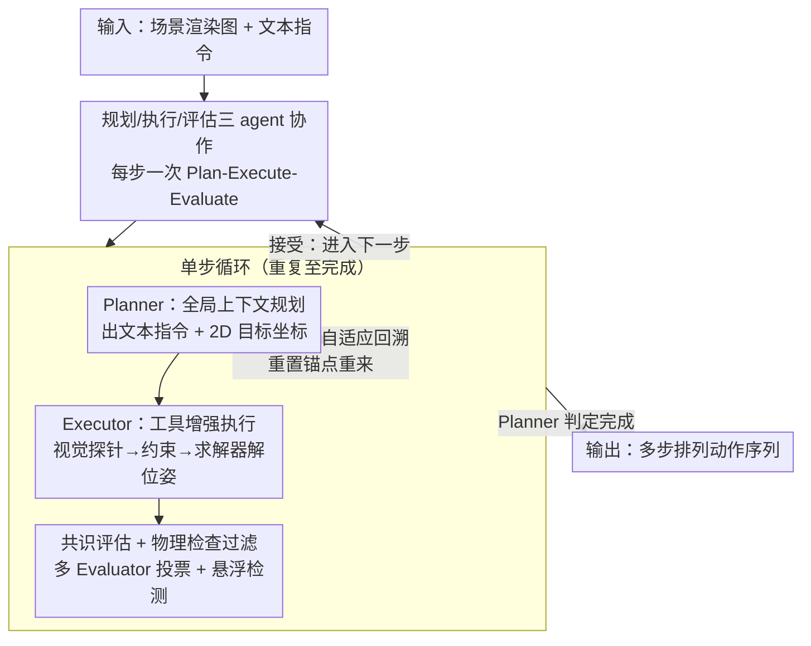

# VULCAN: Tool-Augmented Multi Agents for Iterative 3D Object Arrangement

**会议**: CVPR 2026  
**论文**: [CVF Open Access](https://openaccess.thecvf.com/content/CVPR2026/html/Kuang_VULCAN_Tool-Augmented_Multi_Agents_for_Iterative_3D_Object_Arrangement_CVPR_2026_paper.html)  
**代码**: [vulcan-3d.github.io](https://vulcan-3d.github.io)（项目页）  
**领域**: Agent / 3D视觉  
**关键词**: 多智能体, 工具增强, 3D 物体排列, MCP, 长程规划

## 一句话总结
VULCAN 把"按指令重新摆放 3D 场景里的物体"从一锤子单步编辑，升级成"规划—执行—评估"循环的多智能体长程任务：用 MCP 视觉 API + 约束求解器替代脆弱的原始脚本操作，用三类专职 agent 分担全局规划与局部执行，再加自适应回溯搜索从死局里恢复，在 25 个复杂场景上把碰撞率/悬浮率压到 0、显著超过所有基线。

## 研究背景与动机
**领域现状**：随着多模态大模型（MLLM）在 2D 视觉-语言任务上越来越强，一批工作开始让 MLLM 来做 3D 物体排列——根据一张渲染图和一句文本指令，移动/旋转/插入物体，摆出合理布局。主流做法是让 MLLM 读取某种中间表示（文本场景描述、代码脚本或渲染图），一次性生成一个完整编辑。

**现有痛点**：这些方法都把排列当成**单步过程**——从初始场景出发，做一次综合编辑就到目标态。但真实任务往往是多步的（"先清空桌面、再搬桌子、然后摆椅子"），单步范式根本无法表达"先做 A 才能做 B"的依赖关系。更糟的是，MLLM 视觉接地（visual grounding）很弱：它很难把"程序里的一行编辑"与"3D 空间里精确的落点"对应起来，要么被原始 3D 数据淹没、要么拿到的简化信息又不够推空间关系。

**核心矛盾**：迭代排列里，任何一步的分析或执行错误都会**沿链传播、不断累积**，几步之内就把整个流程带偏；而单个 MLLM 同时扛"长程全局策略 + 单步精细执行 + 物理合理性校验"会严重过载，上下文也撑不住。再加上多步排列的搜索空间随步数指数膨胀，穷举不可行。

**本文目标**：让系统能像人一样**弹性地分解任务**——简单请求就单步解决，复杂请求自动拆成有序多步计划，并在每一步都保证高保真、可恢复。

**切入角度**：近期 MLLM 工具调用与 Model Context Protocol（MCP）证明了一条新路——把 MLLM 不擅长的脏活交给外部定义的 API。作者顺着这个思路，把"分析"和"执行"两块都外包给专用模块，再用多 agent 分工 + 回溯搜索兜住多步的脆弱性。

**核心 idea**：用"MCP 视觉工具 + 约束求解器"替代脆弱的原始代码编辑，用"规划/执行/评估"三类专职 agent 的协作循环驱动长程排列，并用自适应回溯在指数搜索空间里高效找到通往目标的可行路径。

## 方法详解

### 整体框架
VULCAN 要解决的是：给定固定相机 $C$ 下渲染的图像 $I$、底层 3D 场景 $S$ 和文本指令 $T$，输出一串**单物体排列动作**，逐步达成目标且全程保持物理合理（每步后不碰撞 Collision-Free、不悬空 Floating-Free、语义合理 High Semantic Quality）。

整体是一个"规划—执行—评估"（Plan-Execute-Evaluate）循环，每一步由三个专职 agent 接力：**Planner**（看全局上下文，定下这一步搬什么、搬到哪）→ **Executor**（用工具库把这个高层意图落成精确的 3D 位姿）→ **Evaluator**（视觉检查这一步质量，连同规则化物理检查一起决定接受/拒绝）。循环反复，直到 Planner 判定最终布局满足原始指令。两条关键分工原则：① 只有 Planner 拿到全局上下文（指令 + 历史所有步的渲染），Executor/Evaluator 只在当前步的局部范围工作；② 只有 Executor 直接操作 3D 场景，另外两个 agent 都只看渲染图。当某步连续失败时，自适应回溯把"重启锚点"挪到合适深度重来，避免错误把整条链带死。

### 关键设计

**1. MCP 视觉工具库 + 约束求解器：把脆弱的脚本编辑换成可验证的 2D→3D 落点**

痛点在于让 MLLM 直接写 Blender 脚本太脆——它既要做指令接地、又要算 3D 几何、还要保证物理合理，任何一处崩了整步就废。VULCAN 把 Executor 的执行拆成三段固定流水线：**视觉探针 → 约束构造 → 优化求解**。视觉探针给了三个 MCP API 让 agent "主动去看"场景：`ListObjectsInArea(x0,y0,x1,y1)` 返回某图像区域内的物体名，`RayProbe(x,y)` 从相机沿像素射线打出去、返回首个命中点的 3D 位置/物体名/所在平面及其法向，`RenderWithHighlight(objs)` 渲一张实例分割高亮图来消歧（比如场景里有多本"Book"时确认到底是哪一本）。拿到 3D 元素后，agent 把意图组装成一组几何约束——词汇表包含 $\text{CloseToPix}(obj,x,y)$、$\text{Contact}(obj,dir,p)$、$\text{NoOverhang}$、$\text{Distance}(obj,obj_2,dist)$、$\text{FaceTo}$、$\text{Rotate}(obj,degree)$ 等，足以覆盖大多数排列关系。最后交给一个**采样式求解器**：先把 Planner 给的目标像素 $c$ 按方差 $\sigma_{pix}$ 扰动成一批变体 $c'_{1..n}$，对每个变体用 AdamW 最小化约束损失得到候选位姿，再用约束误差阈值 $\tau$ 预过滤，最后用碰撞检测筛掉相撞的、选约束误差最小的无碰撞解。

$$\{c'_1,\dots,c'_n\}\sim\mathcal{N}(c,\sigma_{pix}),\quad T_i=\arg\min_T \mathcal{L}_{\text{constraint}}(T;D,c'_i)$$

这样设计的好处是把"语言级意图"和"数值级位姿"之间那道鸿沟交给确定性模块来填，MLLM 只需输出符号意图，物理有效性由求解器+碰撞检测来兜底，比让 MLLM 直接吐坐标可靠得多。

**2. 三类专职 agent 协作 + 全局/局部上下文切分：让长程策略与单步执行各司其职**

让一个 MLLM 同时管"未来好几步的全局策略"和"当前这步的精细执行"，既过载又容易在长上下文里迷失。VULCAN 把它拆成三个角色：**Planner** 读用户指令 + 历史各步的渲染时间线，理解场景如何演化，决定下一步该干什么，并且**同时输出一句文本指令和一个归一化 2D 目标像素坐标** $c=(x,y)$——作者发现"语言 + 空间锚点"配合能给出歧义更小的计划。**Executor** 只关心当前这一步，用上面的工具库把 Planner 的 2D 指令投到 3D。**Evaluator** 对结果图做视觉检查。分工的精髓在两条切分上：全局上下文只给 Planner（执行/评估只看局部），3D 场景只让 Executor 碰（另两个只看渲染图）——这把"该用什么信息、该有什么权限"按职责严格隔开，既压住了单 agent 的上下文负担，又保住了每个角色的推理质量。消融里把它换成单 agent 后，虽然物理无瑕疵但视觉质量和指令一致性都掉了，印证了这种分解对复杂场景的推理质量是必要的。

**3. 共识评估 + 规则物理检查：用投票和确定性检查压住 MLLM 的幻觉评分**

Evaluator 会给排列打五档（terrible/bad/fair/good/excellent），但 MLLM 偶尔会幻觉——给一个完全错误的摆放打"excellent"。VULCAN 用**共识过滤**对冲：同时跑多个 Evaluator agent，把档位映射到 $-2$（terrible）到 $+2$（excellent）求平均，只有共识分为正才接受这个解。除了 MLLM 评估，再叠一层**规则化物理检查**（如悬浮检测），凡违反物理约束的动作直接拒掉。为了让 agent 看得更准，输入图还做了两类**视觉标注**：加像素坐标标签和归一化虚线网格（帮 Planner 出准坐标、帮 Executor 接地工具），以及用箭头把物体起点连到目标点可视化这次编辑（让 Planner 回看历史、让 Evaluator 评估最近一步）。论文实测：编辑可视化能让 MLLM 把"前后两张几乎一样的图"正确识别为发生了移动，坐标标注能显著提升物体定位精度。

**4. 自适应回溯搜索：在指数膨胀的搜索树里高效从死局恢复**

多步排列的搜索空间随步数指数膨胀，每个落点都分叉出无数未来状态，且前面摆错可能让后面无解（初始物体占了太多空间，后面的就放不下了）。VULCAN 引入受经典方法启发的**自适应回溯**：维护一个**锚点步（anchor step）**作为失败重启位置，并自适应地移动它——某步连续尝试失败时，锚点退回到当前深度的一半重来；当动作序列达到整轮新的最大长度时（例如成功把第 3 个瓶子放上桌、而之前最多只放成 2 个），锚点前移。每个排列步配 3 个 Evaluator、并行跑 4 次尝试，选有效解里平均评估分最高的；全失败则标记该步失败并触发回溯。这种"按进展动态调整重启深度"的策略，比固定回溯或穷举更能在剪掉无望分支的同时快速逼近目标。

### 损失函数 / 训练策略
VULCAN 是**纯推理时的 agentic pipeline，不训练模型**：底座用 Gemini-2.5-pro，排列框架基于 Blender 的 Python 扩展 + Blender-MCP 库实现。求解器层面优化的是约束损失 $\mathcal{L}_{\text{constraint}}$（用 AdamW），关键超参是像素扰动方差 $\sigma_{pix}$ 和误差阈值 $\tau$。每步 3 个 Evaluator + 4 次并行尝试。

## 实验关键数据

数据集为 25 个精选场景（来自 BlenderKit / InfiniGen / BlenderGym），共 111 个单位任务，故意设计了"后续步依赖前序步"的相互依赖。所有基线收到相同的逐步参考指令、执行相同的操作序列以保证公平。四个指标：碰撞率 Coll.%↓、悬浮率 Fl.%↓、合理性 Plausibility（MLLM 评 0–4）↑、一致性 Consistency（MLLM 评 0–4）↑。

### 主实验

| 方法 | Coll.%↓ | Fl.%↓ | Plausibility↑ | Consistency↑ |
|------|---------|-------|---------------|--------------|
| Blender-MCP | 0.459 | 0.774 | 3.348 | 2.973 |
| BlenderAlchemy | 0.631 | 0.676 | 3.368 | 2.770 |
| FirePlace* | 0.513 | 0.225 | 3.515 | 3.135 |
| **Ours** | **0.000** | **0.000** | **3.796** | **3.592** |

VULCAN 把碰撞率和悬浮率都压到 **0**（基线普遍 0.4–0.8），合理性/一致性也全面领先。三个基线各对应 VULCAN 的不同组件：BlenderAlchemy（执行-评估 MLLM 循环但无视觉工具/求解器）、FirePlace*（约束求解器但无多 agent 全局推理，因代码未公开作者按本任务重实现）、Blender-MCP（仅工具、无专职 agent/求解器/多步能力）。

### 人类评估（30 人配对偏好，Win%/Tie%）

| 对比 | 指令遵从 Const. | 视觉合理 Plaus. | 物理合理 Phys. |
|------|-----------------|------------------|-----------------|
| Ours vs. BlenderAlchemy | 62.1/22.7 | 65.9/24.7 | 70.0/20.0 |
| Ours vs. Blender-MCP | 60.5/25.0 | 59.0/25.8 | 62.9/26.1 |
| Ours vs. FirePlace* | 58.8/30.2 | 54.4/35.0 | 58.0/31.5 |

三项标准下用户都压倒性偏好 VULCAN。

### 消融实验

| 配置 | Coll.%↓ | Fl.%↓ | Plaus.↑ | Const.↑ |
|------|---------|-------|---------|---------|
| w/o Multi-Tool Library（求解器+视觉API 换回 Blender-MCP 函数） | 0.495 | 0.711 | 3.484 | 3.103 |
| w/o Backtracking（关回溯，无脑收最优可用解） | 0.036 | 0.054 | 3.703 | 3.549 |
| w/o MCP Tools（去掉所有 MCP 工具，直接生成原始脚本） | 0.603 | 0.738 | 3.357 | 3.067 |
| w/o Planner's Coordinates（去掉 Planner 的坐标引导） | 0.000 | 0.000 | 3.772 | 3.526 |
| Single Agent（单 MLLM 替代多 agent） | 0.000 | 0.000 | 3.623 | 3.328 |
| **Ours（完整）** | **0.000** | **0.000** | **3.796** | **3.592** |

### 关键发现
- **工具库/MCP 是物理正确性的命根子**：去掉 Multi-Tool Library 或 MCP Tools 后，碰撞率和悬浮率立刻飙到 0.5–0.7，合理性掉到 3.3–3.5；这两块负责"把符号意图落成无碰撞的精确位姿"，缺了它 MLLM 的视觉接地根本扛不住。
- **回溯主要救物理瑕疵**：关掉回溯后 Coll./Fl. 从 0 升到 0.036/0.054（rare 但非零），说明回溯的价值在于"遇到死局能退回去重摆"，避免偶发的碰撞/悬浮被强行接受。
- **多 agent 主要保推理质量**：Single Agent 变体物理上仍是 0 瑕疵（求解器兜底），但 Plaus./Const. 从 3.796/3.592 掉到 3.623/3.328——分工对"语义合理 + 指令一致"这类需要全局推理的部分贡献最大。
- **Planner 坐标是小而有效的锦上添花**：去掉坐标引导后物理仍 0 瑕疵，但 Plaus./Const. 略降（3.772/3.526），印证"语言+空间锚点"双输出能减少计划歧义。

## 亮点与洞察
- **把"评估"也做成可验证、抗幻觉的环节**：很多 agentic pipeline 用 MLLM 当裁判却不防它幻觉，VULCAN 用"多 Evaluator 投票映射到 [-2,+2] 求共识 + 规则物理检查"双保险，是个很可复用的"别让 LLM 自己说了算"的设计模式。
- **视觉标注是廉价但高杠杆的 trick**：给图加坐标网格、用箭头可视化"这次从哪搬到哪"，直接把 MLLM 那个著名的"两张几乎一样的图看不出区别"问题给解了——几乎零成本却显著提升接地与定位，可迁移到任何需要 MLLM 做空间对比的任务。
- **采样式约束求解的工程巧思**：借数值分析里的预条件思想，先把目标像素扰动成一批、并行求解再过滤选最优，既保住了"目标坐标已经圈出小搜索空间"的效率，又用碰撞检测兜住物理有效性。
- **自适应锚点回溯**：把"重启深度"做成随进展动态调整（失败退一半、破纪录就前进），比固定回溯更聪明地剪枝，思路可迁移到任何长程、易累积错误的多步决策任务。

## 局限与展望
- **单相机视角是硬约束**：为控制 MLLM 上下文长度和推理性能，系统只用单相机视图，因此对"需要看不见的视角"的任务（如把椅子放到墙后）力不从心；作者寄望长上下文 MLLM 成熟后扩到多视角。
- **重度依赖强底座 + 仿真环境**：全程用 Gemini-2.5-pro + Blender/Blender-MCP，换更弱的 MLLM 或迁到真实机器人/真实传感器场景的鲁棒性未验证。
- **评测规模偏小**：25 场景 / 111 单位任务虽精心设计，但相比真实开放世界的物体多样性和指令复杂度仍有限；FirePlace 基线是作者重实现（原代码未公开），横向比较需保留 caveat。
- **求解器超参敏感性**：$\sigma_{pix}$ 和 $\tau$ 的取值、并行尝试数（4）和 Evaluator 数（3）对最终质量/开销的权衡论文未充分扫描。

## 相关工作与启发
- **vs FirePlace / ScanEdit（约束求解器单步排列）**：它们也用带几何约束的专用求解器保证物理合理，但都局限于**单步操作**，无法处理"必须按序摆、要顾中间态"的多步场景。VULCAN 把求解器当作 Executor 的一个组件，外面套上多 agent 全局规划 + 回溯，直接补上了"迭代"这一维。
- **vs BlenderAlchemy（执行-评估 MLLM 循环）**：共享"多 agent"结构，但缺交互式视觉工具和约束求解器——VULCAN 实验里它在缺有效工具时几乎完全失败，说明光有 agent 循环、没有可靠的 2D→3D 落点机制不够。
- **vs Blender-MCP（仅工具基线）**：只提供基础可调用函数（GetSceneInfo / ExecuteCode 等），没有专职 agent 角色、约束求解器和多步能力，是 VULCAN 去掉所有上层设计后的"地板"。
- **vs 数据驱动的传统 3D 排列模型**：传统方法用大规模 3D 数据集训判别/生成模型，泛化性和常识合理性都不如 MLLM 路线；VULCAN 走的是"用 MLLM 常识推理 + 外部工具补 3D 短板"的范式。

## 评分
- 新颖性: ⭐⭐⭐⭐ 把单步 3D 排列推进到工具增强的多 agent 迭代范式，回溯 + 共识评估 + 视觉标注的组合很扎实，但每个零件多是已有思想的巧妙工程组装。
- 实验充分度: ⭐⭐⭐⭐ 主实验 + 30 人人评 + 5 变体消融，证据链完整；扣分在数据集规模偏小、底座单一、超参扫描不足。
- 写作质量: ⭐⭐⭐⭐ 三大挑战→三大设计的逻辑清晰，图示丰富；公式和算法表达到位。
- 价值: ⭐⭐⭐⭐ 给"MLLM 做长程 3D 操作"提供了一套可落地、可验证的工程范式，对具身智能/场景生成有直接借鉴。

<!-- RELATED:START -->

## 相关论文

- [\[ACL 2026\] Spec-o3: A Tool-Augmented Vision-Language Agent for Rare Celestial Object Candidate Identification](../../ACL2026/llm_agent/spec-o3_a_tool-augmented_vision-language_agent_for_rare_celestial_object_candida.md)
- [\[ICLR 2026\] PhyScensis: Physics-Augmented LLM Agents for Complex Physical Scene Arrangement](../../ICLR2026/llm_agent/physcensis_physics-augmented_llm_agents_for_complex_physical_scene_arrangement.md)
- [\[CVPR 2026\] Vinedresser3D: Towards Agentic Text-guided 3D Editing](vinedresser3d_towards_agentic_text-guided_3d_editing.md)
- [\[CVPR 2026\] Think, Then Verify: A Hypothesis-Verification Multi-Agent Framework for Long Video Understanding](think_then_verify_a_hypothesis-verification_multi-agent_framework_for_long_video.md)
- [\[CVPR 2026\] SceneAssistant: A Visual Feedback Agent for Open-Vocabulary 3D Scene Generation](sceneassistant_a_visual_feedback_agent_for_openvoc.md)

<!-- RELATED:END -->
