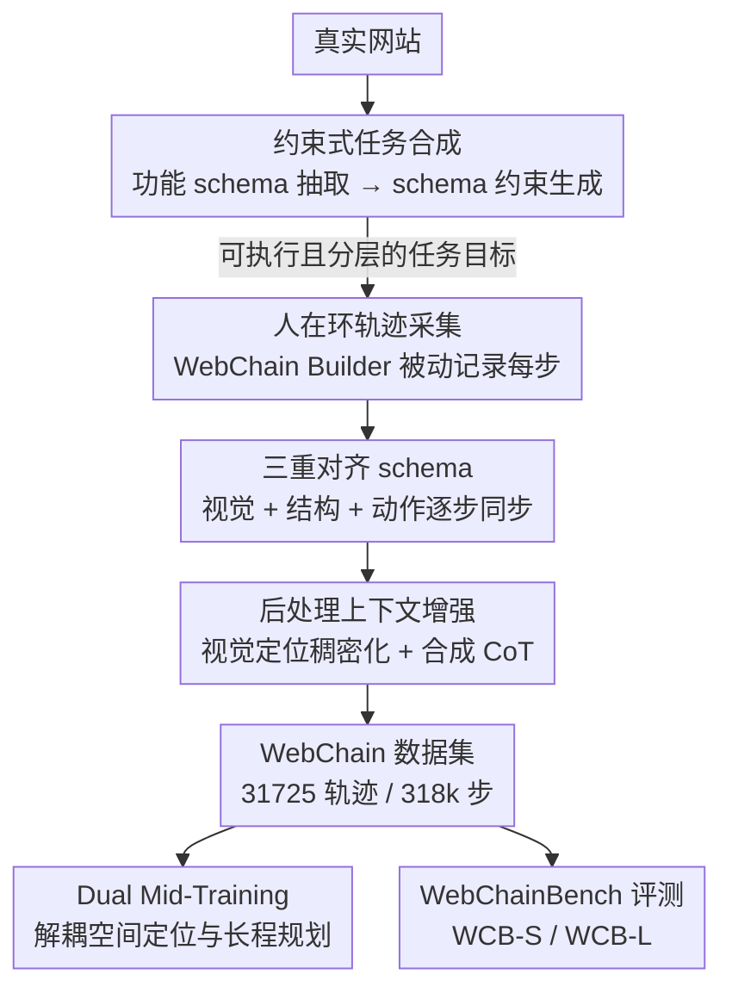

# WebChain: A Large-Scale Human-Annotated Dataset of Real-World Web Interaction Traces

**会议**: CVPR 2026  
**论文**: [CVF Open Access](https://openaccess.thecvf.com/content/CVPR2026/html/Fan_WebChain_A_Large-Scale_Human-Annotated_Dataset_of_Real-World_Web_Interaction_Traces_CVPR_2026_paper.html)  
**代码**: 待确认（作者声明全量开源数据、采集工具与 benchmark）  
**领域**: Web Agent / GUI Agent / 数据集  
**关键词**: web agent、人工标注轨迹、三重对齐、视觉定位、长程规划

## 一句话总结
WebChain 由真人在真实网站上操作采集，构建了目前最大规模的人工标注 Web 交互轨迹数据集（31,725 条轨迹、318k 步、428 个域名），核心是把视觉截图、结构 AX 树、动作坐标做"三重对齐"，并基于它提出解耦空间定位与长程规划的 Dual Mid-Training 训练配方，在自建 WebChainBench 及多个公开 GUI benchmark 上取得 SOTA。

## 研究背景与动机
**领域现状**：浏览器是绝大多数数字任务的入口，让 agent 学会"看懂页面 + 精准点击 + 长程规划"是 GUI agent 领域最有价值的目标之一。近年视觉-语言-动作（VLA）建模兴起，但训练这类 agent 高度依赖大规模、高质量的交互轨迹数据。

**现有痛点**：现有数据来源有两条路，各有硬伤。一条是**开源人工标注数据集**（Mind2Web、WebLINX、GUIAct 等），可信但规模偏小——Mind2Web 仅 2,350 条轨迹、WebLINX 2,337 条，不足以验证现代 GUI agent 的 scaling law；而且大多缺 AX 树这类结构监督。另一条是**数据合成方法**（Explorer、OS-Genesis 等），虽然能低成本在真实网页上"刨"轨迹，却被安全机制卡死：一遇反爬、CAPTCHA、需要登录认证的场景（如银行、电商下单）就崩，恰恰漏掉了最有价值的高价值工作流。

**核心矛盾**：规模、真实性、可复现性三者难以兼得。要规模就得合成，但合成进不去认证页面、覆盖不到复杂任务；要质量就得人工标注，但人工标注的数据集规模上不去。更糟的是，大量做模型 scaling 的工作用的是**私有数据集**，关键结论不可复现，阻碍社区形成共识。

**本文目标**：做一个"完全开源 + 最大规模 + 全人工标注 + 多模态对齐"的 Web 交互轨迹生态，既能验证 scaling 效应，又能支撑严谨可复现的评测。

**切入角度**：既然合成方法过不了安全门槛，那就让真人去操作真实网站——但要把真人操作时的每一层上下文（看到的像素、页面的结构、执行的动作）严格同步记录下来，形成密集监督信号。

**核心 idea**：用"三重对齐"（Triple Alignment）把视觉、结构、动作三层上下文逐步同步成一条轨迹，并配套一条可扩展的人在环采集流水线，再用这份数据验证出"空间定位与长程规划应当解耦训练"的 Dual Mid-Training 配方。

## 方法详解

### 整体框架
这是一篇数据集论文，"方法"主要由两部分组成：**怎么造出这份数据**（三阶段构建流水线 + 三重对齐 schema）和**怎么用这份数据训练/评测**（Dual Mid-Training 配方 + WebChainBench）。

数据构建是一条三阶段串行流水线：先用"功能约束"让 LLM 合成既可执行又多样的任务目标，再让真人标注员在真实网站上完成这些任务、被动且详尽地记录每一步的多模态轨迹，最后对原始轨迹做后处理增强（补全视觉定位负样本 + 合成 CoT 推理链）。产出的每一步都带视觉、结构、动作、推理四类标注，构成 (State, Action, Reward, Next State) 四元组。

### 关键设计

**1. 三重对齐（Triple Alignment）：让模型不只"看见"页面，还能理解每个像素背后的结构逻辑**

现有数据集要么只有截图（缺结构）、要么只有 DOM 文本（缺视觉），监督信号单一，模型容易产生空间幻觉、点歪元素。WebChain 的采集流水线在每一步严格同步三层上下文：**视觉上下文**（viewport 截图 + 整页截图）、**结构上下文**（HTML 与 Accessibility 树快照）、**动作对齐**（目标元素的像素坐标、bounding box、CSS selector、XPath、内部文本）。这样同一步里"我看到的画面""页面的结构语义""我点了哪里"三者一一对应，为视觉 grounding、注意力分配、DOM 感知导航同时提供监督。关键差异在于它是**唯一**同时覆盖真实网站、人工轨迹、bounding box、AX 树、事件时间戳的数据集（见下方对比表），而 Mind2Web 缺 AX 树、WebArena 缺人工轨迹。

**2. 约束式任务合成（Constraint-Based Task Synthesis）：让 LLM 生成的任务"真能在这个网站上做出来"**

直接让 LLM 出任务的最大问题是幻觉——它可能让标注员"在一个没有该功能的网站上按用户评分排序"。WebChain 用两步堵住这个洞。先对每个目标网站做**静态功能抽取**，得到一份结构化 functional schema：一层是 Domain Semantics（站点高层用途与服务粒度，如"只有国内航班"vs"含国际航班"），另一层是 Interactivity & Logic（枚举排序开关、faceted 过滤器，以及关键的条件依赖——如"选车型"下拉框只有先"选品牌"后才填充）。然后用一个 generator LLM **显式以该 schema 为条件**生成任务，并自动按复杂度分层为：简单信息检索（单步）、多约束导航（组合多个过滤/筛选）、条件依赖任务（动作依赖前序状态的序列逻辑）。这样合成出来的任务既不会越出网站真实能力边界，又能系统覆盖从简单到复杂的难度谱。

**3. 人在环轨迹采集（WebChain Builder）：被动而详尽地把真人操作录成密集监督**

合成好的任务作为给标注员的精确目标。标注员在真实网站上尝试完成任务时，WebChain Builder 工具**被动**记录每一步：动作前后的完整 DOM 快照、具体执行的动作（click / type / scroll）、高保真空间信息（viewport 坐标 + 目标元素 bounding box）、以及元素级元数据（XPath、CSS selector、内部文本）。因为是真人真站操作，它天然能进入需要登录认证、含反爬保护的高价值工作流——这正是合成方法做不到的。最终每条轨迹是一串 (State, Action, Reward, Next State) 四元组，平均链长 10.02 步、平均耗时 1.07 分钟，强调长程依赖。

**4. 后处理上下文增强：把"只标了点中的那个元素"补成稠密的版面理解 + 显式推理**

原始轨迹有两个缺口：一是每步只标了被交互的那个正样本元素，模型学不到完整版面认知；二是缺少"为什么这么点"的推理监督。WebChain 用两招补全。**视觉定位稠密化（Visual Grounding Densification, VGD）**：解析整个 viewport，抽取所有可见可交互元素的 bounding box、类型（button / input / a）与文本，提供丰富的负采样，把"点单个元素"升级成"版面感知的稠密分割问题"，让 agent 学会区分可操作元素与装饰性文本。**合成推理链（Synthetic Rationale Generation, CoT）**：用一个强 VLM 在完整轨迹上下文（总目标 + (state, action) 历史 + 当前 GUI 状态）下"think aloud"，为每个动作生成自然语言推理（如"目标是找 \$300 的电视，我已经按 TCL 过滤，现在看到价格区间过滤器，要点它输入价格上限"），把隐式认知过程显式化，作为鼓励可解释多步规划的监督信号。

**5. Dual Mid-Training：把空间定位和长程规划解耦成两段中训，再交给 RL 收尾**

这是用数据验证出的训练配方，也是性能 SOTA 的来源。作者把空间定位（SGRL，Spatial-Grounding RLVR）与长程规划（LCRL，Long-Chain RLVR）拆开。统一的奖励是两部分加权：
$$r_t = \alpha\, r_t^{\text{type}} + (1-\alpha)\, r_t^{\text{content}}$$
其中 $r_t^{\text{type}}$ 在预测动作类型匹配 ground-truth 时为 1（否则 0），$r_t^{\text{content}}$ 在动作参数满足正确性时为 1（如 click 要落进真值 bbox $b_t^*$、type 的预测文本要是目标串 $y_t^*$ 的词法超集）。空间定位最大化单步期望奖励 $\max_\theta \mathbb{E}_{(I_t,x_t)}[r_t(\hat a_t,\hat y_t)]$；长程规划则在全局目标 $g$、观测 $I_t$、历史 $h_{t-1}$ 上做序列决策优化。关键发现是：两个任务的感知需求不同——**空间定位**适合加 Reasoner Prompting（RP，先推理元素属性再预测坐标，当作降低空间幻觉的正则），而**长程规划**反而是 non-RP + VGD + LCRL 最好（端到端 RP 中训会限制对复杂任务结构的泛化）。再叠一段 CoT-SFT 中训稳定 warm start，最后 LCRL 专注长程奖励优化。Dual Mid-Training 就是把"空间感知"和"时序规划"在中训阶段解耦，各用最合适的 recipe。

### 与已有数据集对比

| 特性 | WebChain | Mind2Web | WebArena(Env) | WebLINX | GUIAct(multi) |
|------|----------|----------|---------------|---------|---------------|
| 轨迹数 | **31,725** | 2,350 | N/A | 2,337 | 5,696 |
| 步数 | **318k** | 17,155 | N/A | 100k+ | 44k |
| 网站数 | **428** | 137 | 4 域 | 155 | 121 |
| 真实网站 | ✓ | ✓ | × | ✓ | ✓ |
| 人工轨迹 | ✓ | ✓ | × | ✓ | ✓ |
| Bounding Box | ✓ | ✓ | × | ✓ | ✓ |
| Accessibility 树 | ✓ | × | ✓ | × | × |
| 事件时间戳 | ✓ | ✓ | × | ✓ | × |

WebChain 在规模上比次大的开源人工集高一个量级，且是唯一把 bounding box、AX 树、事件时间戳同时备齐的真实网站人工数据集。

## 实验关键数据

数据集高层统计：31,725 条人工核验轨迹、317,993 个原子交互步、428 个唯一域名、平均链长 10.02（中位数 9）、平均耗时 1.07 分钟。WebChainBench（WCB）从留出数据采样 1.2k 交互步，分 WCB-S（空间定位）与 WCB-L（长程规划），并在短（<6）、中（6–10）、长（>10 步）三档轨迹上均衡。

### 主实验：公开 GUI benchmark 上的整体步成功率（SR）

| 模型 | 训练数据 | Overall SR |
|------|----------|-----------|
| Qwen2.5-VL-3B | Zero-shot | 50.1 |
| Qwen2.5-VL-7B | Zero-shot | 70.9 |
| GUI-R1-3B | 其他数据集 | 70.5 |
| GUI-R1-7B | 其他数据集 | 74.2 |
| WebChain-LCRL-3B | WebChain | 73.5 |
| WebChain-LCRL-3B +CoT-SFT | WebChain | 75.3 |
| WebChain-LCRL-3B +SGRL+CoT-SFT | WebChain | **77.3** |
| WebChain-LCRL-7B | WebChain | 77.4 |
| WebChain-LCRL-7B +CoT-SFT | WebChain | 79.0 |
| WebChain-LCRL-7B +SGRL+CoT-SFT | WebChain | **81.4** |

在 AndroidControl、GUI-Act-Web、GUI-Odyssey、OmniAct 等覆盖移动/桌面/网页的 benchmark 上，WebChain 训练的 3B 模型整体超过用其他数据训练的 GUI-R1-3B，叠加 SGRL+CoT-SFT 后 7B 达到 81.4，展现强零样本与迁移能力。

### 消融：Dual Mid-Training 在 WCB-L 上的逐项收益

| 配置 | WCB-L | 说明 |
|------|-------|------|
| GUI-R1-3B | 0.487 | 外部基线 |
| Directly LCRL | 0.603 | 直接 LCRL，无中训 |
| +CoT-SFT | 0.629 | 加 CoT-SFT 中训 |
| +SGRL | 0.632 | 加空间定位中训 |
| +Both（Dual Mid-Training） | **0.658** | 两段中训叠加 |

### 关键发现
- **规模直接决定长程能力**：在 4k / 20k / 全量子集上对 Qwen2.5-VL-3B 做 LCRL 后训，WCB-L 成功率随数据量单调上升，全量模型能跟随更长的指令链，证实 WebChain 的规模是解锁鲁棒长程规划的关键。
- **空间定位与长程规划的"最优 recipe"相反**：空间定位任务里 RP（先推理后定位）是有效正则、能降空间幻觉；但长程规划里带 RP 的中训反而一致掉点，non-RP + VGD + LCRL 最强——这说明两类任务的感知需求本质不同，支撑了"解耦中训"的设计。
- **VGD 是任务无关的普惠增强**：无论空间定位还是长程规划，加入稠密化的指令-坐标增强对都能提升数据效率与奖励密度，是对两类任务都管用的知识富集手段。
- **CoT-SFT 提供 RL 的稳定 warm start**：CoT 中训显著抬高下游 RL 性能上限，定性上让模型产出更长、更结构化、整合视觉观测与历史状态的推理链。

## 亮点与洞察
- **"真人进认证页面"补上了合成方法的最大盲区**：银行登录、电商下单这类高价值工作流恰恰是反爬/CAPTCHA 挡住合成 agent 的地方，用人在环采集是绕开安全边界、拿到这些轨迹的务实做法。
- **三重对齐把"看图点击"重构成"版面感知 + 结构对齐"**：同时给 bbox 和 AX 树，让模型把高层意图对到精确 bbox 与 DOM 元素，这种密集 grounding 监督正是缓解 VLM 空间幻觉所缺的。
- **"不同任务要用不同中训配方"是可迁移的洞察**：RP 利于定位、害于规划这一非对称结论，提示训练 GUI agent 时不该用单一 recipe 一刀切，值得迁移到其他多能力 agent 的训练设计。
- **schema 约束生成是抑制 LLM 任务幻觉的通用招**：先抽功能边界再以之为条件生成，这套"先约束后生成"思路可迁移到任何需要 LLM 生成可执行任务/指令的数据合成场景。

## 局限与展望
- **CoT 是 VLM 合成而非真人推理**：第三阶段的推理链由强 VLM 事后"think aloud"生成，可能与标注员真实意图有偏差或引入合成噪声，作者未量化其可靠性。
- **奖励是规则式的代理信号**：$r^{\text{content}}$ 用"落进 bbox""文本是超集"这类规则判定正确性，对语义等价但形式不同的动作可能误判，长程任务的稀疏奖励问题也未根治。
- **横向 benchmark 比较需谨慎**：Table 3 跨 AndroidControl/OmniAct 等不同难度任务，整体 SR 的绝对值不宜直接横比；论文也未给出多次运行的方差。
- **采集成本与可持续性**：全人工标注 31k 条轨迹成本高，且真实网站会随时间改版导致轨迹失效，数据的时效维护是个隐性挑战。

## 相关工作与启发
- **vs Mind2Web / WebLINX**：同为真实网站人工轨迹离线数据集，但 WebChain 规模高一个量级（31,725 vs 2,350/2,337），且额外提供 AX 树结构监督；劣势是 Mind2Web/WebLINX 更早、被更多工作采用为标准。
- **vs WebArena / VisualWebArena**：后者提供可复现的交互式执行环境，但有"模拟 gap"——缺真实网页演化的 DOM、广告与视觉噪声；WebChain 用真实网站离线轨迹补足真实性，但本身不是可交互环境。
- **vs Explorer / OS-Genesis 等合成方法**：合成方法低成本但被安全机制限制、进不去认证页面；WebChain 用人在环换取高价值复杂轨迹的覆盖，代价是标注成本。
- **vs GUI-R1 / AReaL 等 RL 训练工作**：这些聚焦 RL 的算法/系统效率，但稳定性依赖好的 warm start；WebChain 的论点是它能提供高质量 SFT/CoT 初始化，从数据侧解锁 RL 的稳定性。

## 评分
- 新颖性: ⭐⭐⭐⭐ 三重对齐 + 全人工真实网站轨迹的组合在数据维度上确有突破，Dual Mid-Training 的非对称结论也有启发，但训练方法本身是 SFT/RL 既有范式的组合。
- 实验充分度: ⭐⭐⭐⭐ 覆盖 scaling、空间定位、长程规划三类问题，跨移动/桌面/网页多 benchmark，消融清晰；略缺方差与 CoT 质量的量化。
- 写作质量: ⭐⭐⭐⭐ 动机—痛点—方案逻辑顺畅，pipeline 与 schema 描述具体，表格信息密度高。
- 价值: ⭐⭐⭐⭐⭐ 最大规模全开源人工 Web 轨迹 + 工具 + benchmark，直击社区"数据垄断/不可复现"痛点，对 web/GUI agent 研究是高复用的基础设施。

<!-- RELATED:START -->

## 相关论文

- [\[ACL 2026\] YIELD: A Large-Scale Dataset and Evaluation Framework for Information Elicitation Agents](../../ACL2026/llm_agent/yield_a_large-scale_dataset_and_evaluation_framework_for_information_elicitation.md)
- [\[ICML 2026\] Video2GUI: Synthesizing Large-Scale Interaction Trajectories for Generalized GUI Agent Pretraining](../../ICML2026/llm_agent/video2gui_synthesizing_large-scale_interaction_trajectories_for_generalized_gui_.md)
- [\[CVPR 2026\] ModularAgent: A Task-Aware Modular Framework for Joint Optimization of Multimodal Large Language Models and World Models](modularagent_a_task-aware_modular_framework_for_joint_optimization_of_multimodal.md)
- [\[CVPR 2026\] Ego2Web: A Web Agent Benchmark Grounded in Egocentric Videos](ego2web_a_web_agent_benchmark_grounded_in_egocentric_videos.md)
- [\[ICLR 2026\] OpenAgentSafety: A Comprehensive Framework for Evaluating Real-World AI Agent Safety](../../ICLR2026/llm_agent/openagentsafety_a_comprehensive_framework_for_evaluating_real-world_ai_agent_saf.md)

<!-- RELATED:END -->
