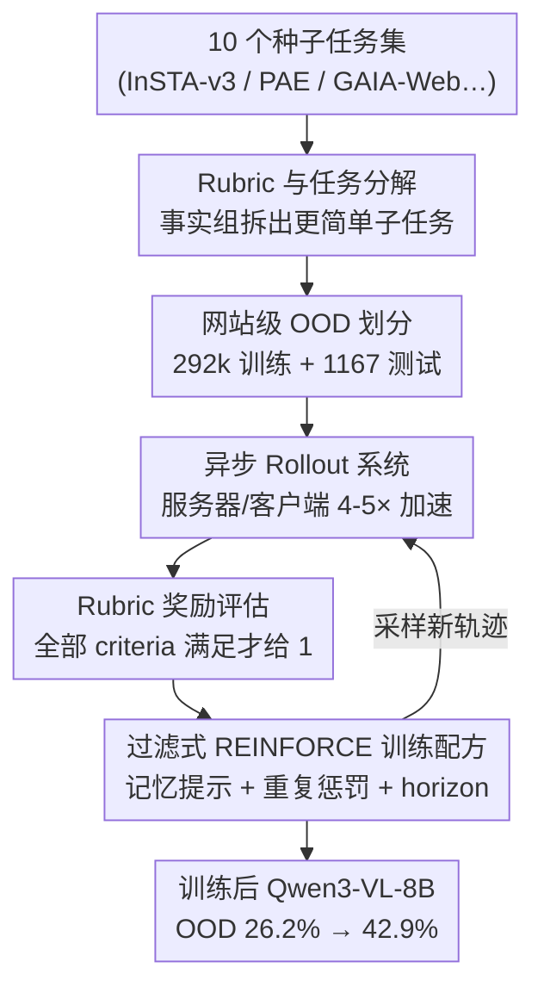

# WebGym: Scaling Training Environments for Long-Horizon Visual Web Agents with Realistic Tasks

**会议**: CVPR 2026  
**论文**: [CVF Open Access](https://openaccess.thecvf.com/content/CVPR2026/html/Bai_WebGym_Scaling_Training_Environments_for_Long-Horizon_Visual_Web_Agents_with_CVPR_2026_paper.html)  
**领域**: Agent  
**关键词**: 视觉网页智能体, 强化学习训练环境, 异步 rollout, 任务分解, rubric 评估

## 一句话总结
WebGym 把 10 个现成网页 benchmark 聚合并程序化扩展成近 30 万个带 rubric 评估的真实网页任务，再配一套 4-5× 加速的异步 rollout 系统，用最简单的 REINFORCE 就把开源 Qwen3-VL-8B 在「全是训练时没见过的网站」的 OOD 测试集上从 26.2% 拉到 42.9%，反超 GPT-4o（27.1%）和 GPT-5-Thinking（29.8%）。

## 研究背景与动机
**领域现状**：视觉网页智能体（visual web agent）以截图为观测、输出鼠标键盘动作来完成「在 Apple.com 比较 AirPod 3 和 AirPod 2 的价格和参数」这类多步任务。最近大家发现，给一个强 VLM 做监督微调或任务专属训练就能把它变成不错的 web agent，而在线强化学习（RL）在代码、数学这类纯文本域已经被证明能持续涨点。

**现有痛点**：把 RL 搬到视觉网页域却异常困难，卡在三件事上。其一，**任务太少太静态**——现有 benchmark 是为「评测」造的，规模小、网站固定，而真实网站本身是非平稳的（同一个电商首页每次刷新展示的商品都不同，同一串动作后果可能完全不同），小规模人造任务集喂不出能泛化的策略。其二，**没有可靠奖励**——网页任务大多没有参考答案（很多任务根本不是问答），轨迹常常「走到一个长得很像但其实错了的页面」，二值成败信号难判定。其三，**rollout 太慢**——模拟浏览器占满了墙钟时间，朴素同步采样让快的会话干等慢的，CPU/GPU 轮流空转。

**核心矛盾**：要 scale RL，就同时需要「大而多样的任务集 + 清晰的评估协议 + 高 rollout 吞吐」三者，而过去的训练环境（WebRL、PAE）要么任务单一、要么没有好的任务级评估标准、要么 rollout 系统没优化，三样很少能同时满足。

**本文目标**：造一个能真正支撑 RL scaling 的训练环境，把上面三个缺口一次补齐，并用它把一个开源 8B VLM 训到 SOTA。

**核心 idea**：用 LLM 把每个种子任务拆成结构化的「事实组（fact group）rubric」，既当评估标准又当任务分解的原料——大组才允许拆，于是程序化地批量生成「更简单但定义良好」的子任务；再配一套服务器/客户端式异步 rollout 系统消除同步屏障；最后用最朴素的过滤式 REINFORCE 训练。

## 方法详解

### 整体框架
WebGym 不是一个模型，而是「数据 + 评估 + 系统 + 训练配方」四件套组成的训练环境。整条管线是：先从社区聚合 10 个高频任务集当**种子**，用 GPT-4o 给每个种子生成 fact-group rubric 并据此**程序化分解**出大量更简单的子任务，得到近 30 万任务；划分出「网站级严格隔离」的 OOD 测试集；训练时用**异步 rollout 系统**高吞吐地采样智能体自己的交互轨迹，用 rubric 把轨迹判成二值奖励；最后用**过滤式 REINFORCE**（只保留成功轨迹做行为克隆）更新策略，配上记忆提示、重复惩罚、horizon 截断、采样比例几个关键训练设计。

### 关键设计

**1. Rubric 驱动的任务分解：把「大任务」程序化裂变成大量「定义良好的小任务」**

RL 需要海量、覆盖多难度、且 reward 信号密集的任务，但现有 benchmark 太小太静态。WebGym 的做法是给每个种子任务用 GPT-4o 生成一份结构化 rubric——把评估拆成若干**事实组（fact group）**，每组含一条或多条评估准则，并把任务**难度（difficulty）定义为所有组的事实总数**。有了这个结构就能程序化分解：当且仅当满足「至少 2 个事实组」且「至少一组是大组（含 ≥3 条事实）」时才允许拆，拆法是取事实组的**真子集**（不含全集），且每个子集必须含至少一个大组以保证不退化成 trivial 任务。例如种子任务「比较所有商品的价格和数量，把单价最低的加入购物车」含两组（一组 3 条准则、一组 1 条），只有那个大组参与分解，于是只生成 1 个更简单的新任务。这样生成的任务有三条保证：不会 trivial（限制了大组）、严格比原任务简单（reward 更密集）、原任务良定义时新任务也良定义。相比 PAE 直接合成可能无解或病态的任务、相比 AgentSynth 需要先 rollout 才能造任务，WebGym 的分解**不需要任何 rollout**，纯靠 rubric 组合，所以便宜且可控。最终训练集 258,595 个原始任务 + 33,497 个分解任务 = 292,092 个，覆盖 127,645 个网站。

**2. 网站级 OOD 划分：让「测试集全是训练没见过的网站」这件事可信**

很多前作把整个 benchmark 当 held-out，但不同 benchmark 之间常共享网站、领域、任务模式，benchmark 级的训练-测试隔离并不可靠。WebGym 改成在**任务和网站层面**自建划分：构造一个 1,167 个任务的 OOD 测试集，每个 OOD 任务来自一个**不同的网站**，并把训练集里所有「与测试网站相同」的任务全部删掉。这保证了 OOD 任务全部来自相对训练集完全没见过的网站——这也是本文 42.9% 这个数字比许多前作「更硬」的原因：它衡量的是真正的跨网站泛化，而不是在见过的网站上刷分。

**3. 结构化 rubric 奖励：用「全准则满足才给分」+ 关键帧筛选解决无参考答案的评估难题**

长程视觉任务的评估很难：轨迹常做出部分进展、停在长得像但错的页面、答案看着对但没接地气验证；而大多数任务根本没有参考答案。WebGym 用 LLM 评判 + 参考答案覆盖（reference answer override）来判分，关键是借用了设计 1 的结构化 rubric：每个任务配一份 fact-group rubric，**只有当所有 criteria 全部满足时轨迹才得 reward**，产出跨域、跨难度一致的二值信号。由于轨迹里大量截图无信息量，评判器先用一套高召回的**关键帧筛选**（受 Online Mind2Web 启发）保留承载证据的页面、过滤掉绕路和广告，再用 GPT-4o 对每条 criterion 逐一二值判定。在 80 条人工标注轨迹上验证，加 rubric 后 GPT-4o / Qwen3-VL-8B / Gemma3-27B 三个评判器的准确率和精确率都提升；强评判器在 recall 上有轻微回退（rubric 偶尔过严），但作者认为这个 trade-off 对 RL 有利——牺牲一点样本效率换更精确的学习信号，防止误差累积。

**4. 异步 rollout 系统：拆掉同步屏障，把 4-5× 吞吐还给 web agent RL**

scale RL 的首要瓶颈是 rollout 太慢，尤其多步设置下。朴素同步实现里，一组浏览器会话被迫齐步走：每步所有截图凑一批送 GPU 做一次策略调用，然后等最慢的会话完成才能继续，于是出现「突发-空闲」——快会话干等慢会话，硬件活动一阵猛冲一阵全闲。WebGym 换成**服务器/客户端架构**：CPU 端服务器用 master/worker 范式模拟浏览器，GPU 端客户端托管智能体并异步流式接收观测，新任务一旦有资源立刻开始推理，**任何 step 或 episode 之间都不再同步**。实测在固定 3 节点共 24 张 H100、收集 1,800 条平均 13.2 步（共 23,760 步）的轨迹时，仅用 64 CPU 就在 48.6 分钟完成，而同步系统要 264 分钟（约 5.4×）；CPU 加到约 128 后 GPU 成为瓶颈、吞吐趋平。这是据作者所知第一个面向异步多轮 web agent 模拟的开源 rollout 系统，可挂接到 veRL、SkyRL、AReaL 等任意 RL 框架。

### 损失函数 / 训练策略
策略更新用最朴素的 **REINFORCE**：二值终止奖励，无 baseline、无负梯度，等价于在线过滤式行为克隆（只保留成功轨迹、最大化其对数似然），动作空间在 Shen et al. 基础上加了导航动作（点击/输入/滚动/返回/跳转指定网址），用坐标模式而非 Set-of-Marks。训练侧有四个起作用的设计：

- **记忆提示（memory prompt）**：让模型每步额外输出一份更新后的记忆（借鉴 GLM-4.1v），解决「比较两个商品时记不住第一个」这种跨步信息保留问题，不用把全部历史截图塞进上下文。去掉它 RL 几乎不涨点。
- **重复动作惩罚**：模型常卡在同一截图反复发同一动作；用 `% Same Screenshot`（某步截图与下一步相同的比例）度量后，显式过滤掉「下一步截图与当前相同」的步骤（哪怕它属于成功轨迹），显著提升样本效率。
- **难度采样**：略偏向难任务，起始比例 easy : medium : hard = $2:5:3$；但消融发现**只用 easy** 反而出奇稳（因为 easy 任务量大、覆盖网站多，利于泛化），而过度上采样难任务会在 ~36k 轨迹后过拟合掉点；最终最优是**均匀采样**（约 $25:5:1$），兼顾深度。
- **horizon 截断**：把每 episode 步数上限从 (15,30,45) 收紧到 (10,20,30)，相当于对策略交互过程做正则——砍掉「绕一大圈才成功」的低效轨迹，把训练信号集中到早期高影响决策上，反而把峰值从 38.2% 提到 42.9%，连难任务也涨。

## 实验关键数据

### 主实验
所有数字来自网站级隔离的 OOD 测试集（训练完全没见过的网站），基座为 Qwen3-VL-8B-Instruct。

| 智能体 | 模型 | OOD 成功率 | 备注 |
|--------|------|-----------|------|
| WebGym（本文，最终） | Qwen3-VL-8B-Instruct + RL | **42.9%** | 记忆+重复惩罚+horizon(10,20,30)+均匀采样 |
| WebGym 起点 | Qwen3-VL-8B-Instruct（RL 前） | 26.2% | 未训练基座 |
| GPT-5-Thinking | 闭源 + SoM | 29.8% | 300 任务子集（预算限制） |
| GPT-4o | 闭源 + SoM | 27.1% | 全测试集 |

本文比 GPT-5-Thinking 高出约 13.1 个百分点，且这是「全在没见过的网站上」的成绩，含金量高于很多在见过网站上刷分的前作。

### 任务集与 rollout 统计

| 维度 | WebGym | 对比 |
|------|--------|------|
| 训练任务数 | 292,092（原始 258,595 + 分解 33,497） | InSTA-v3 146k、PAE-WebVoyager 128k |
| 训练网站数 | 127,645 | 现有最大；前作多在数十~数百量级 |
| OOD 测试任务 | 1,167（各来自不同网站） | — |
| rollout 速度 | 64 CPU 收 1.8k 轨迹 48.6 min | 同步系统 264 min（≈5.4×） |
| 轨迹长度（按难度） | easy 7.8 / medium 9.9 / hard 11.9 步 | 难度越高步数越多，验证难度定义有效 |

### 消融实验
| 配置 | 对最终成功率的影响 | 说明 |
|------|------|------|
| Full（记忆+惩罚+短 horizon+均匀采样） | 42.9% | 完整配方 |
| w/o 记忆提示 | 明显掉点，RL 几乎不涨 | 模型记不住跨步信息 |
| w/o 重复惩罚 | 样本效率显著下降 | 反复发无效动作、卡同一截图 |
| horizon (15,30,45) 而非 (10,20,30) | 峰值仅 38.2% | 长 horizon 留太多低效轨迹 |
| 排除一半子领域（仅 53% 任务） | 各难度切片均更慢更低 | 领域广度直接决定跨网站泛化 |
| only easy 采样 | 出奇稳、强于 only medium | easy 量大覆盖广，抗过拟合 |
| biased to hard（2:5:3） | ~36k 轨迹后过拟合掉点 | 有效任务集太小、重复难任务 |

### 关键发现
- **领域广度比难度配比更要命**：在难度配比不变的前提下，仅删掉一半子领域就让所有难度切片变慢变低；而且训练只采了 36k 轨迹、远小于剩余 ~150k 任务，掉点不是过拟合而是「多样性不足」直接限制了对未见网站的泛化。
- **「只用简单任务」反直觉地强且稳**：因为 WebGym 的 easy 任务量极大、横跨海量网站域，泛化收益盖过了「难任务带来的能力」；这和 LLM 推理里「难任务更值钱」的经验相反，源于网页域的结构差异。最终用均匀采样把少量中/难任务补回来拿到最高总分。
- **更短的 horizon 是个免费正则**：限制步数预算逼模型学会更高效的导航和果断收尾原语，这些原语反而能迁移到评测时更长的任务，连难任务都涨。
- **Thinking 变体初期更强但被反超**：Thinking 版每步推理更长（2139 vs 1088 字符）、latency 更高，训练推进后 Instruct 版很快赶上并超过，故最终选 Instruct。

## 亮点与洞察
- **rubric 一物两用**：同一份 fact-group rubric 既是评估标准（全满足才给分、降假阳）、又是任务分解的原料（大组才拆），把「造任务」和「判任务」统一在一个结构上，省掉了 PAE 式合成任务的病态与 AgentSynth 式分解所需的 rollout——这是全文最巧的结构性设计。
- **把「难度」定义成事实数**：用 rubric 里的事实总数当难度，简单可计算，还被轨迹长度统计（7.8/9.9/11.9 步）实证为真有区分度，让「难度采样/课程」有了可操作的标尺。
- **系统层面的诚实**：明确指出 CPU 加到 128 后 GPU 成瓶颈、吞吐趋平，没有把 4-5× 包装成无条件成立，区分了 CPU-limited 与 GPU-limited 两个 regime——这套异步 rollout 思路可直接迁移到任何「模拟环境慢、推理在 GPU」的多轮 agent RL。
- **网站级 OOD 这件事值得抄**：在任务/网站粒度而非 benchmark 粒度做隔离，是评估 web agent 泛化更可信的做法，可推广到其他「benchmark 间互相污染」的场景。

## 局限与展望
- **奖励仍是 LLM 评判**：二值 reward 由 GPT-4o 按 rubric 判，强评判器在 recall 上有不可消除的轻微回退（rubric 偶尔过严），过严会漏掉本该成功的轨迹，长期可能偏置策略；作者自己也承认这个 trade-off 只能权衡不能消除。
- **训练算法刻意最简**：用的是无 baseline、无负梯度的过滤式 REINFORCE（本质在线 BC），没探索更强的 RL 目标；论文把「biased to hard 会过拟合」归因于有效任务集太小，但更好的 loss 是否能直接解决并未验证。
- **Thinking 模型未被吃透**：每步推理虽初期有益但成本高、最终被 Instruct 反超，作者把「为 Thinking 模型设计省算力的 RL 配方」留作 future work。
- **依赖大量算力与闭源 GPT-4o**：任务构建、关键帧筛选、逐准则评估全靠 GPT-4o，rollout 又要几十张 H100 + 数百 CPU，复现门槛不低；同时 30 万任务里约 80% 是 easy（且大半来自 PAE 合成集），头部 20 网站占了近一半任务，长尾多样性是否足够仍可进一步审视。

## 相关工作与启发
- **vs PAE / WebRL（训练环境）**：PAE 直接合成任务，可能病态或无解，且 rollout 系统未优化、任务多样性有限；WebGym 用 rubric 分解保证任务良定义且严格更简单，又配异步 rollout，把「任务质量」和「采样速度」同时补上。
- **vs AgentSynth（任务分解）**：AgentSynth 也做分解但需要先 rollout 才能造任务；WebGym 纯靠 rubric 的事实组组合，无需任何 rollout，更便宜可控。
- **vs InSTA-v3 / PAE-WebVoyager（任务集）**：前者覆盖广但缺多难度结构，后者量大但领域窄；WebGym 把 10 个源聚合后程序化扩展，同时拿到规模（292k）、广度（127k 网站）和深度（多难度），并自带网站级 OOD 划分。
- **vs 基于 accessibility tree 的文本 web agent**：本文坚持纯视觉观测（截图），主张交互语义由渲染界面定义、对视觉 affordance 推理能在动态生成的页面上更鲁棒地泛化。
- **vs 纯文本域 RL（代码/数学）**：纯文本域 rollout 快、reward 易验证，难任务也更值钱；WebGym 揭示网页域里 rollout 慢、reward 难判、且 easy 任务因覆盖广反而更利于泛化——这些差异提醒「把文本 RL 经验直接搬到 agent 域」要小心。

## 评分
- 新颖性: ⭐⭐⭐⭐ rubric 一物两用做分解+评估、网站级 OOD、异步 rollout 三点组合扎实，单项算法朴素但工程与数据设计有真创新。
- 实验充分度: ⭐⭐⭐⭐⭐ 任务统计、评判器人评、rollout 基准、四维 scaling 与训练消融都给了，且诚实标注 GPU 瓶颈与 recall 回退。
- 写作质量: ⭐⭐⭐⭐ 逻辑清晰、图表充分，但大量细节甩到附录，正文 reward/系统部分偏密。
- 价值: ⭐⭐⭐⭐⭐ 最大开源视觉 web agent 训练环境 + 首个异步多轮 rollout 系统，用 8B 开源模型反超 GPT-5-Thinking，对社区基础设施意义大。

<!-- RELATED:START -->

## 相关论文

- [\[CVPR 2026\] SAGE: Training Smart Any-Horizon Agents for Long Video Reasoning with Reinforcement Learning](sage_training_smart_any-horizon_agents_for_long_video_reasoning_with_reinforceme.md)
- [\[ICLR 2026\] The Tool Decathlon: Benchmarking Language Agents for Diverse, Realistic, and Long-Horizon Task Execution](../../ICLR2026/llm_agent/the_tool_decathlon_benchmarking_language_agents_for_diverse_realistic_and_long-h.md)
- [\[CVPR 2026\] ReFAct: Empowering Multimodal Web Agents with Visual and Context Focusing](refact_empowering_multimodal_web_agents_with_visual_and_context_focusing.md)
- [\[ICML 2026\] Lifting Traces to Logic: Programmatic Skill Induction with Neuro-Symbolic Learning for Long-Horizon Agentic Tasks](../../ICML2026/llm_agent/lifting_traces_to_logic_programmatic_skill_induction_with_neuro-symbolic_learnin.md)
- [\[ICML 2026\] ACON: Optimizing Context Compression for Long-horizon LLM Agents](../../ICML2026/llm_agent/acon_optimizing_context_compression_for_long-horizon_llm_agents.md)

<!-- RELATED:END -->
