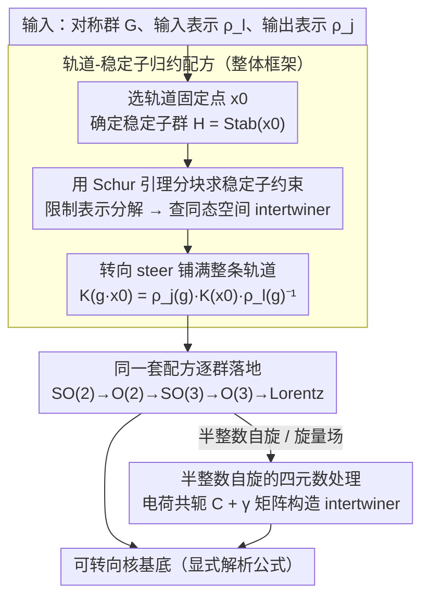

<!-- 由 src/gen_stubs.py 自动生成 -->
# Bases of Steerable Kernels for Equivariant CNNs: From 2D Rotations to the Lorentz Group

**会议**: CVPR 2026  
**arXiv**: [2603.12459](https://arxiv.org/abs/2603.12459)  
**代码**: 无  
**领域**: 等变CNN / 群表示论  
**关键词**: 等变卷积神经网络, 可转向核, Clebsch-Gordan系数, Lorentz群, 群表示论

## 一句话总结

提出一种绕过 Clebsch-Gordan 系数的方法来求解等变CNN中的可转向核（steerable kernel）约束，通过在稳定子群上求解简单的不变性条件再"转向（steer）"到任意点，为 SO(2) 到 Lorentz 群等不同对称群给出了显式的核基底。

## 研究背景与动机

**领域现状**：将对称性先验嵌入CNN设计已成为提升模型性能的关键手段。可转向等变CNN（steerable equivariant CNN）是一种通用框架，其中特征图在对称群 $G$ 下按特定表示变换，卷积核需满足可转向约束（steerability constraint）。

**痛点**：现有求解可转向核基底的标准方法（如 Lang & Weiler 2021）依赖三个数学工具：广义约化矩阵元素、Clebsch-Gordan（CG）系数和齐次空间上的调和基函数。计算 CG 系数对某些群来说计算代价很大，且需要在耦合基与非耦合基之间反复切换。

**核心矛盾**：可转向核约束本质上是一个线性方程 $K(g \cdot x) = \rho_{\text{out}}(g) K(x) \rho_{\text{in}}(g)^{-1}$，理论上有更直接的求解路径，但现有方法引入了不必要的复杂中间步骤。

**要解决什么**：能否找到一种不需要计算 CG 系数、直接利用输入输出表示矩阵元素的方法来求解任意对称群的可转向核基底？

**切入角度**：利用轨道-稳定子定理：在轨道上选取一个固定点 $x_0$，核在 $x_0$ 处只需满足对稳定子群 $H$ 的不变性条件（一个更简单的方程），然后用转向操作把 $K(x_0)$ 推广到整个轨道。

**核心 idea**：稳定子群 $H$ 的约束等价于求 $H$ 的限制表示之间的同态空间（homomorphism space），这可以通过 Schur 引理直接写出解析解，完全不需要 CG 系数。

## 方法详解

### 整体框架

这篇论文要解决的是：给定对称群 $G$、输入表示 $\rho_l$ 和输出表示 $\rho_j$，如何求出满足可转向约束的卷积核基底——而且不依赖计算代价高昂的 Clebsch-Gordan 系数。整体思路是"先在一个固定点把约束解出来，再转向到整条轨道"：在 $G$-轨道上挑一个固定点 $x_0$，此处的约束退化成只对稳定子群 $H=\mathrm{Stab}_{x_0}$ 的不变性条件（一个简单得多的线性方程），解完之后用群作用把解 steer 到轨道上每一点。要满足的约束写出来是

$$K^{(j,l)}(g \cdot x) = \rho_j(g) K^{(j,l)}(x) \rho_l(g)^{-1}, \quad \forall g \in G$$

落到三步：在轨道上选 $x_0$ 并确定 $H$；在 $x_0$ 处把约束化简为 $K(x_0) = \rho_j^H(h) K(x_0) \rho_l^H(h)^{-1}$ 并求解；再对每个陪集代表 $g \in G/H$ 令 $K(g \cdot x_0) = \rho_j(g) K(x_0) \rho_l(g)^{-1}$，把解铺满整条轨道。这套通用配方解出来后，再逐个具体群落地（SO(2) 一路推到 Lorentz 群），并对半整数自旋的旋量场做专门处理。

### 关键设计

**1. 用 Schur 引理分块求稳定子约束：把"解约束方程"换成"查同态空间"**

固定点处的约束 $K(x_0) = \rho_j^H(h) K(x_0) \rho_l^H(h)^{-1}$ 说的是 $K(x_0)$ 必须是限制表示 $\rho_l^H$ 到 $\rho_j^H$ 的同态映射（intertwiner）。把 $\rho_l^H$ 和 $\rho_j^H$ 都分解成 $H$ 的不可约表示直和后，$K(x_0)$ 就是一个分块矩阵，每块由 Schur 引理直接定死：不同构的不可约块之间映射为零，同构的块之间只能是"标量乘恒等"（实表示下可取 $a\mathbb{I} + bJ$ 的四元数式形式）。这一步是整套方法的命门——它把求解可转向核从"反复在耦合基/非耦合基之间换基、算 CG 系数"压缩成一次按不可约分量配对、查标量的操作。

**2. 同一套配方逐群落地：从 SO(2) 一路推到 Lorentz 群**

把上面的配方套到具体群上，每个群只是稳定子和限制表示分解不同：

- **SO(2)**：稳定子是平凡群 $\{e\}$，约束退化，核基底直接由表示矩阵元素（三角函数）给出——复表示得一维基底 $\{e^{i(j-l)\phi}\}$，实表示得四维基底。
- **O(2)**：稳定子含反射 $r_y$，多出的约束把 SO(2) 的解空间减半，如 $(j,l)$ 情形从四维降到二维。
- **SO(3)**：稳定子是绕 $z$ 轴的 SO(2)，限制表示无重数地分解为 SO(2) 不可约表示，Schur 引理给出 $2\min(j,l)+1$ 个独立 intertwiner，核基底用 Wigner D-矩阵的乘积表示，省掉了额外的调和基函数。
- **O(3)**：稳定子扩成 O(2)，要额外带宇称量子数 $\epsilon = \pm$；同宇称表示对的 intertwiner 用 $\mathbb{I}$、异宇称用 $\sigma_3$，最终给 $\min(j,l)+1$ 个复 intertwiner。
- **Lorentz 群 SO$^+(1,3)$**（最有新意处）：分有质量与无质量两种轨道。有质量粒子轨道是类时超曲面、稳定子为 SO(3)，把 Lorentz 表示限制到 SO(3) 后只需用已知好算的 SU(2) CG 系数分解，intertwiner 在时空张量里表现为投影算符（自旋-0 的 $u^\mu u_\nu$、自旋-1 的 $\Delta^\mu{}_\nu = \delta^\mu{}_\nu - u^\mu u_\nu$）；无质量粒子轨道是光锥、稳定子为 ISO(2) 的 SO(2) 子群，投影算符为 $\Delta^{\mu\nu} = \eta^{\mu\nu} - n^\mu \bar{n}^\nu - n^\nu \bar{n}^\mu$，并带规范自由度。

**3. 半整数自旋的四元数处理：让 Lorentz 等变核也能装下旋量场**

半整数自旋无法用上面的实/复标量直接配对，论文引入电荷共轭算符 $\mathcal{C}$ 和 $\gamma$ 矩阵，用四元数结构 $\{\mathbb{I}, i\mathbb{I}, \mathcal{C}, i\mathcal{C}\}$ 构造 intertwiner。自旋-1/2 的核基底就由正/负能量投影 $P_\pm(u) = \frac{1}{2}(1 \pm \not{u})$ 与四元数系数组合而成；由于 $\mathcal{C}$ 在 Lorentz 变换下不变，转向后 intertwiner 形式保持不变，这保证了旋量场上的可转向核仍然闭合。

### 损失函数 / 训练策略

本文为纯理论工作，不涉及具体训练目标或损失函数。核基底的系数是可学习参数，可直接替换现有等变 CNN 框架里的核参数化方式。一个实用差别是：与在耦合基上对耦合标签 $J$ 设统一截断不同，本方法可以对输入、输出表示标签 $l$ 和 $j$ 分别独立截断，理论上更灵活、网络表达能力更强。

## 实验关键数据

### 主实验

本文为纯数学/理论贡献，**没有实验部分**。所有结果都是解析的核基底公式，通过数学证明保证正确性。

| 群 | 稳定子 $H$ | 解空间维度 $(j,l)$ | 是否需要 CG 系数 |
|:---:|:---:|:---:|:---:|
| SO(2) | $\{e\}$ | 4（实）/ 2（复） | 否 |
| O(2) | $\mathbb{Z}_2$ | 2（实） | 否 |
| SO(3) | SO(2) | $2\min(j,l)+1$ | 否 |
| O(3) | O(2) | $\min(j,l)+1$（复） | 否 |
| SO$^+(1,3)$（massive） | SO(3) | 依表示类型 | 仅需 SU(2) 的 |
| SO$^+(1,3)$（massless） | SO(2) | 依自旋 | 否 |

| 对比项 | 本方法 | Lang & Weiler 2021 |
|:---:|:---:|:---:|
| 需要 CG 系数 | 否（紧致群）/ 仅需 SU(2) 的（Lorentz） | 是，目标群的 |
| 需要基变换 | 否 | 是（耦合基↔非耦合基） |
| 解的形式 | 表示矩阵元素的乘积 | 广义约化矩阵元素 |
| 适用范围 | 紧致群 + Lorentz 群 | 紧致群上的齐次空间 |
| 截断方式 | 对 $j$, $l$ 独立截断 | 对耦合表示标签 $J$ 截断 |

### 消融实验

无实验消融。但论文系统地对比了复表示与实表示的解空间关系：
- SO(2)：实表示标签 $j \geq 0$，复表示标签 $j \in \mathbb{Z}$，通过 $\rho_j \oplus \rho_{-j}$ 的实结构联系
- SO(3)：复情形有 $2\min(j,l)+1$ 个复线性 intertwiner（$4\min(j,l)+2$ 个实参数），实情形恰好是一半

### 关键发现

- 对 SO(2) 和 O(2)，本方法直接给出与 Weiler & Cesa 2019（E2CNN）完全相同的解空间，但推导过程显著简化
- 对 SO(3)，核基底的矩阵元素就是 Wigner D-矩阵的乘积，无需额外调和基函数
- Lorentz 群的 intertwiner 在时空张量表示中自然表现为投影算符（如正交于四速度的投影 $\Delta^\mu{}_\nu$）
- 半整数自旋情形出现四元数结构，电荷共轭算符 $\mathcal{C}$ 在 Lorentz 变换下不变，因此转向后 intertwiner 形式不变

## 亮点与洞察

1. **极致简洁的方法论**：核心思路可以用一句话概括——"在固定点解稳定子约束，然后转向"。数学技术门槛低，仅需 Schur 引理和基本的群表示论知识
2. **统一框架覆盖多个群**：从最简单的二维旋转到物理中最重要的 Lorentz 群，用同一套方法系统求解，展示了方法的普适性
3. **投影算符的物理直觉**：在 Lorentz 群情形中，互紧子就是向不同自旋子空间的投影算符，有清晰的物理图像（如正交于四速度 $u$ 的空间投影）
4. **实用价值**：给出的基底是显式的、可直接使用的解析公式，不需要数值计算 CG 系数

## 局限与展望

1. **缺乏实验验证**：没有任何数值实验证明本方法在实际等变网络中的效率提升或性能表现。作者承认"needs to be shown in different experiments"
2. **未讨论离散化/混叠问题**：实际CNN中核在离散网格上采样，论文仅处理连续情形，aliasing 问题仅一笔带过
3. **Lorentz 群半整数自旋的完整性**：作者在自旋-3/2 处注明需要进一步研究，因为 Rarita-Schwinger 场需要额外的微分约束
4. **未覆盖更广泛的非紧致群**：如 Poincaré 群的完整处理（含平移）、仿射群等
5. **与现有实现的接口**：未讨论如何与 e3nn、escnn 等主流等变网络库集成

## 相关工作与启发

- **Cohen et al. 2016 (G-CNN)**：最早的群等变CNN，本文方法是其理论延伸
- **Weiler & Cesa 2019 (E2CNN)**：SO(2)/O(2) 的完整可转向核基底，本文方法可复现其结果且推导更简
- **Weiler et al. 2018 (3D)**：数值求解基变换矩阵 $Q$ 以获得 SO(3) 核基底，本文完全绕开此步骤
- **Lang & Weiler 2021**：基于 CG 系数的通用方法，是本文的直接对比目标
- **Bogatskiy et al. 2020 (Lorentz Group Equivariant Neural Network)**：计算 Lorentz 群的 CG 系数实现等变网络，本文提供了避免 CG 系数的替代方案
- **Finzi et al. 2021, Zhdanov et al. 2023/2024**：用 MLP 隐式参数化可转向核，是本文显式解析方法的互补路线

## 评分

- **新颖性**: ⭐⭐⭐⭐ — 核心思想虽非全新（文中承认已在文献中提及），但将其系统化、推广到 Lorentz 群并给出显式公式确实有贡献
- **实验充分度**: ⭐ — 纯理论工作，完全没有实验，这是最大短板
- **写作质量**: ⭐⭐⭐⭐ — 数学推导层层递进，从简单群到复杂群的展示很有教学价值，但符号偶尔不一致
- **价值**: ⭐⭐⭐ — 对等变网络的理论基础有一定贡献，但缺乏实验验证限制了实际影响力；对需要构建 Lorentz 等变网络的研究者有参考价值

<!-- RELATED:START -->

## 相关论文

- [\[CVPR 2026\] Principled Steering via Null-space Projection for Jailbreak Defense in Vision-Language Models](principled_steering_via_null-space_projection_for_jailbreak_defense_in_vision-la.md)
- [\[ACL 2026\] MDP-GRPO: Stabilized Group Relative Policy Optimization for Multi-Constraint Instruction Following](../../ACL2026/llm_alignment/mdp-grpo_stabilized_group_relative_policy_optimization_for_multi-constraint_inst.md)
- [\[ICLR 2026\] Group-Relative REINFORCE Is Secretly an Off-Policy Algorithm: Demystifying Some Myths About GRPO and Its Friends](../../ICLR2026/llm_alignment/group-relative_reinforce_is_secretly_an_off-policy_algorithm_demystifying_some_m.md)
- [\[ICLR 2026\] A2D: Any-Order, Any-Step Safety Alignment for Diffusion Language Models](../../ICLR2026/llm_alignment/a2d_any-order_any-step_safety_alignment_for_diffusion_language_models.md)
- [\[AAAI 2026\] W2S-AlignTree: Weak-to-Strong Inference-Time Alignment for Large Language Models via Monte Carlo Tree Search](../../AAAI2026/llm_alignment/w2s-aligntree_weak-to-strong_inference-time_alignment_for_large_language_models_.md)

<!-- RELATED:END -->
