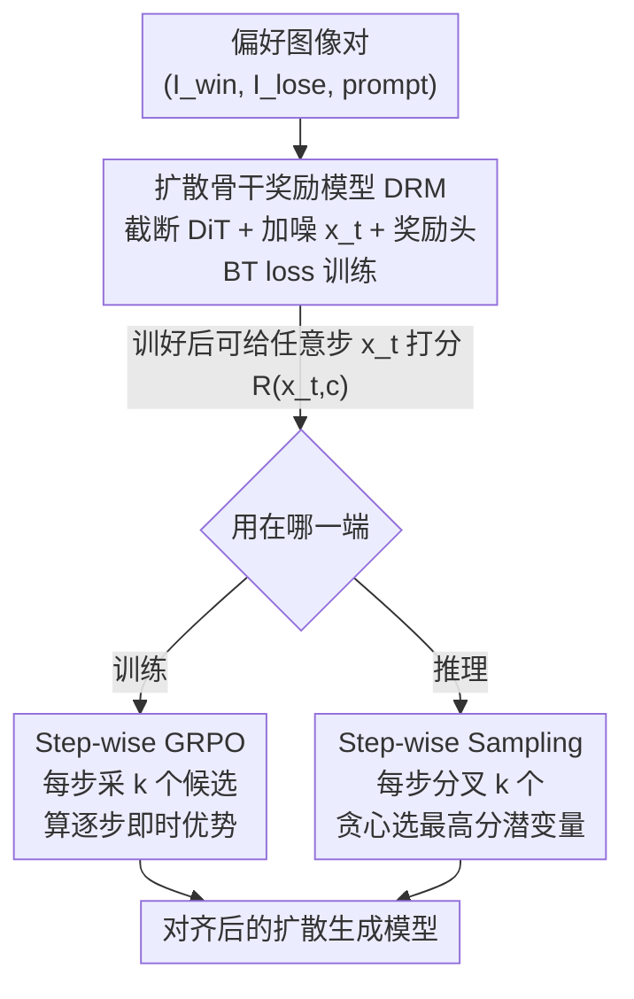

# DRM: Diffusion-based Reward Model With Step-wise Guidance

**会议**: CVPR 2026  
**论文**: [CVF Open Access](https://openaccess.thecvf.com/content/CVPR2026/html/Zhang_DRM_Diffusion-based_Reward_Model_With_Step-wise_Guidance_CVPR_2026_paper.html)  
**代码**: https://github.com/jjaxonx/DRM  
**领域**: 对齐RLHF / 扩散模型  
**关键词**: 扩散奖励模型, 人类偏好对齐, Step-wise GRPO, 中间噪声潜变量, credit assignment  

## 一句话总结
本文把预训练扩散模型本身当作奖励模型骨干（DRM），利用它能给任意去噪步的噪声潜变量打分这一独特能力，分别设计了密集逐步奖励的 Step-GRPO（训练）和"探索-择优"的 Step-wise Sampling（推理），在不增参数的前提下显著提升 SD3.5-Medium 的生成质量，且收敛速度快 2.5–3.5 倍。

## 研究背景与动机

**领域现状**：把扩散模型对齐到人类偏好，主流做法是先从有限偏好数据训一个奖励模型（RM），再用它生成合成偏好数据或做 RL 微调。早期 RM 从 CLIP 微调而来，近年则普遍换成视觉语言模型（VLM，如 HPSv3）做骨干，因为 VLM 的视觉理解更强。

**现有痛点**：VLM 骨干用的是 CLIP 式视觉编码器，预训练目标是图文语义对齐——它更关心"图里有什么"，而不是"画得好不好看"。这种信息瓶颈把图像压成语义重、感知弱的表征，对美学、构图、结构完整性这些真正左右人类偏好的属性反而不敏感。更要命的是，这些 RM 只会评判最终的干净图像，对生成过程中的噪声中间态完全是个黑盒。

**核心矛盾**：偏好对齐既要"懂美学"又要"懂过程"，而 CLIP/VLM 式骨干两头都不占。生成是逐步去噪的多步过程，但奖励只在终点给一次——这导致 GRPO 这类 RL 方法的 credit assignment（功劳分配）很粗糙：把终点那一个奖励平均摊到所有时间步，分不清哪一步是好动作、哪一步是坏动作。

**本文目标**：找一个天生对感知质量敏感、且能评估任意去噪时刻潜变量的骨干，用它来（1）给 RL 提供密集的逐步奖励、（2）在推理时直接引导采样。

**切入角度**：作者的直觉是"能高保真生成，就必然隐式理解了美学、构图和细节"——所以预训练扩散模型本身就是天然的感知质量评估器。而且扩散骨干在训练时见过各种噪声水平的潜变量，天然能给中间噪声态打分，这正好补上 VLM 缺的"懂过程"。

**核心 idea**：用预训练扩散模型（DiT）替代 VLM 当奖励骨干，把它"能评估任意步噪声潜变量"的能力同时用到训练（Step-GRPO 密集奖励）和推理（Step-wise Sampling 择优采样）两端。

## 方法详解

### 整体框架

DRM 的整条管线分三块：先把预训练 DiT 改造成一个奖励模型，用偏好图像对在随机噪声水平上训练它打分；训好的 DRM 因为继承了扩散先验，可以给任意时间步 $t$ 的噪声潜变量 $x_t$ 打一个偏好分 $R(x_t, c)$。这个"逐步可评估"的能力被分流到两个下游用法：训练时用 Step-GRPO 给每一步算密集奖励和优势，推理时用 Step-wise Sampling 在每一步分叉择优。三者共享同一个 DRM 打分函数，区别只在于谁来消费这些逐步分数。

### 关键设计

**1. 扩散骨干奖励模型（DRM）：把生成器改造成能评估噪声潜变量的打分器**

针对 VLM 骨干"懂语义不懂美学、且评不了中间态"的痛点，作者直接拿预训练扩散模型当奖励骨干。具体做法：以 SD3.5-Medium 的 DiT（2.5B）为初始权重，砍掉最后三层 transformer，使参数量与 HPSv3-2B 对齐以保证公平比较。给定某时间步 $t$ 的噪声潜变量 $x_t$，喂进改造后的 DiT 得到视觉特征 $f_v \in \mathbb{R}^{L\times d}$，再经奖励头投影成标量分数：

$$f_p = \mathrm{MLP}(f_v), \quad s = \mathrm{MLP}\big(\mathrm{Pooling}(\mathrm{Conv}(\mathrm{Reshape}(f_p)))\big)$$

训练数据是三元组 $(I_{win}, I_{lose}, p)$，共 140 万条（聚合自 HPDv3、Pick-A-Pic、ImageReward 子集）。关键巧思在训练方式：先用 VAE 把两张图编码到 $x_0$，然后在**随机采样的时间步 $t$** 加高斯噪声得到 $x_t^{win}, x_t^{lose}$，再让 DRM 在带噪状态下分别打分，用 Bradley-Terry 损失优化：

$$L_{DRM} = -\log\sigma(s_{win} - s_{lose})$$

正因为训练时见过各噪声水平的潜变量，DRM 才学会了给任意步打分——这是它区别于所有只看干净图的 RM 的根本能力，也是后面两个设计能成立的前提。消融证明这个能力来自生成先验：随机初始化训练的版本各项指标都明显落后于加载预训练权重的版本。

**2. Step-wise GRPO：用密集逐步奖励解决 credit assignment 难题**

针对标准 GRPO 把终点单一奖励均匀摊到所有步、分不清各步贡献的痛点，作者用 DRM 的逐步打分能力把奖励"下沉"到每一步。标准 Flow-GRPO 的优势是基于终点干净图 $x_0$ 算的（全局、粗粒度）：

$$\hat{A}^i_t = \frac{R(x^i_0, c) - \mathrm{mean}(\{R(x^j_0, c)\}_{j=1}^G)}{\mathrm{std}(\{R(x^j_0, c)\}_{j=1}^G)}$$

Step-GRPO 改成在每个反向去噪步 $t$ 做局部优化：从当前状态 $x_{t+1}$ 出发，用 SDE 采 $k$ 个候选下一步 $\{x_t^i\}_{i=1}^k$，让 DRM 直接给这些**中间噪声候选**打即时分，再在组内归一化算即时优势：

$$\hat{A}^i_t = \frac{R(x^i_t, c) - \mathrm{mean}(\{R(x^j_t, c)\}_{j=1}^k)}{\mathrm{std}(\{R(x^j_t, c)\}_{j=1}^k)}$$

这把评价焦点从"最终全局结果"挪到"当前步从 $x_t$ 转移到各候选 $x_t^i$ 的相对好坏"，给策略梯度提供了更精确、更细粒度的监督信号。和试图用精细分数分配机制（如 TempFlow-GRPO）但带来巨大采样开销的路线相比，DRM 直接评估中间态，更直接也更省。

**3. Step-wise Sampling：免训练的"探索-择优"推理引导**

针对确定性采样器"一条路走到黑、初始预测错了无法纠偏"的痛点，作者把 DRM 当推理时的动态向导，做成即插即用、无需微调的采样策略。在每个时间步 $t$，先"探索"：用 SDE 采样从 $x_t$ 分叉出 $k$ 个候选下一步 $\{x_{t-1}^i\}_{i=1}^k$；再"择优"：用 DRM 给每个候选打分，贪心选分最高的作为下一步状态：

$$x_{t-1} = \arg\max_{x_{t-1}^i} R(x_{t-1}^i, c)$$

逐步挑最有希望的路径，就能在生成早期主动避开会导致低质量的"坏轨迹"，防止固定轨迹里常见的级联失败。它的代价是生成时间随 $k$ 线性增加，但换来跨所有偏好指标的稳定提升，且 LPIPS 显示多样性不降反升（没有 mode collapse）。

> ⚠️ 设计 2 和设计 3 都依赖设计 1 的"评估任意步噪声潜变量"能力，三者在框架图中分别对应 DRM 骨干节点及其训练/推理两个下游分支，术语一致。

### 损失函数 / 训练策略
DRM 本体用 BT 负对数似然损失（式见设计 1），在 64 张 H20（96GB）上训 1 个 epoch，学习率恒定 $1\times10^{-5}$，全局 batch 128，图像 resize 到 $512\times512$。RL 微调阶段用 LoRA（rank 32、$\alpha=64$），学习率 1e-4，基座为 SD3.5-Medium，推理用 Flow Match Euler 调度器、50 步、CFG=4.5。Step-GRPO 默认 $k=6$，与标准 GRPO 保持同等算力预算（共 24 样本/6 每卡）。

## 实验关键数据

### 主实验：RL 微调对比（SD3.5-Medium，越高越好）

| 方法 | ImageReward | PickScore | HPSv3 |
|------|------------|-----------|-------|
| SD3.5-Medium（基线） | 1.01 | 16.76 | 8.95 |
| + PickScore & GRPO | 1.14 | 16.94 | 9.64 |
| + HPSv3 & GRPO | 1.15 | 16.90 | 9.71 |
| + DRM & GRPO | 1.14 | 16.95 | 10.07 |
| **+ DRM & Step-GRPO** | **1.17** | **17.04** | **10.28** |

DRM 即便只配标准 GRPO，HPSv3 就已达 10.07（领先所有同框架对手）；换上 Step-GRPO 后三项全部刷新到 SOTA。

### 消融：预训练权重 vs 随机初始化（偏好预测准确率 %）

| 配置 | 权重 | Epoch | PickScore | HPDv2 | HPDv3 |
|------|------|-------|-----------|-------|-------|
| (a) 随机初始化 | Random | 1 | 57.5 | 65.0 | 59.3 |
| (c) 随机初始化（多训） | Random | 3 | 59.0 | 70.1 | 63.0 |
| (e) 预训练 512px | Pre-trained | 1 | 73.4 | 82.2 | 74.0 |

预训练扩散权重一个 epoch 就全面碾压随机初始化训三个 epoch 的版本，证明生成先验对训练效率和性能上限都不可或缺。提高训练分辨率（256→512）也带来一致提升。

### Step-wise Sampling 的质量-效率权衡

| 候选数 k | 耗时(s) | ImageReward | PickScore | HPSv3 | LPIPS |
|---------|--------|------------|-----------|-------|-------|
| k=1 | 2.88 | 1.01 | 16.76 | 8.95 | 0.650 |
| k=2 | 5.63 | 1.08 | 16.84 | 9.02 | 0.661 |
| k=4 | 7.75 | 1.14 | 16.81 | 9.32 | 0.663 |
| k=6 | 9.83 | 1.15 | 16.93 | 9.49 | 0.662 |

完全免训练，仅靠推理时分叉择优，$k$ 越大质量越高；LPIPS 不降说明多样性未塌缩。

### 关键发现
- **生成先验是命门**：随机初始化即使加长训练也追不上预训练权重，"能生成就懂评估"的假设得到实证支持。
- **Step-GRPO 收敛更快**：相同算力下按步数算比 GRPO 收敛快 2.5×，按 GPU 小时算约快 3.5×；即便 $k=2$ 也优于 GRPO，$k$ 越大奖励增长越快。
- **干净图基准上的小让步是设计的必然**：DRM 在 PickScore 上拿到 64.1% 居首，但因为它训练目标是评估带噪潜变量（存在轻微 domain shift），在只含干净图的基准上相对纯净图 RM 有可预期的小幅 trade-off。
- **噪声越大越难评**：随时间步升高（噪声增大），HPSv3 测试集准确率从 74.0（t=0）降到 65.11（t=750），但整体仍稳健，证明逐步奖励信号可用。

## 亮点与洞察
- **"生成器即评估器"的视角转换**：不是去训一个新 RM，而是把现成扩散模型的隐式美学理解"激活"成打分能力——骨干免费、且自带对噪声中间态的评估能力，这是 VLM 骨干给不了的。
- **一把钥匙开两把锁**：同一个"逐步可评估"特性，既喂给 RL 解决 credit assignment（Step-GRPO），又喂给推理做择优采样（Step-wise Sampling），训练/推理两端复用同一能力，设计非常经济。
- **免训练涨点可迁移**：Step-wise Sampling 是 plug-and-play 的，任何带 DRM 式逐步打分器的扩散流程都能直接套用来换质量，不碰模型权重。

## 局限与展望
- 作者承认在只含干净图的标准基准上有轻微 trade-off（因评估目标包含噪声潜变量带来的 domain shift）。
- ⚠️ Step-wise Sampling 推理成本随 $k$ 线性增长（$k=6$ 比 $k=1$ 慢约 3.4 倍），高质量需求场景的延迟代价明显，实际部署需在质量与时延间取舍。
- 实验仅在 SD3.5-Medium + flow matching 框架验证，DRM 对其他扩散/采样器家族（如 DDPM、不同骨干）的可迁移性未充分检验。
- 逐步奖励在高噪声步准确率下滑（t=750 时仅 65%），早期步的引导信号噪声较大，是否对最终质量构成瓶颈值得进一步分析。

## 相关工作与启发
- **vs VLM 式 RM（HPSv3、PickScore）**：它们用 CLIP 式编码器，语义强但感知弱、且只能评干净图；DRM 用扩散骨干，感知敏感且能评任意步噪声潜变量。2B 的 DRM 在多项指标上超过同规模 HPSv3-2B，说明换骨干比单纯堆参数更高效。
- **vs Flow-GRPO / DanceGRPO**：它们把终点奖励均匀摊到所有步，credit assignment 粗糙；Step-GRPO 用 DRM 在每步给即时奖励和优势，更细粒度也更稳。
- **vs TempFlow-GRPO**：同样想解决 credit assignment，但靠精细分数分配机制引入大量训练时采样开销；DRM 直接评估中间态，路径更直接、开销更小。
- **vs LPO**：虽也探索过扩散式奖励模型，但缺乏系统研究；本文系统性地解锁了扩散骨干的评估能力并配套两个下游算法。

## 评分
- 新颖性: ⭐⭐⭐⭐⭐ "扩散模型即奖励骨干 + 逐步可评估"是真正换了视角，且一个能力打通训练与推理两端。
- 实验充分度: ⭐⭐⭐⭐ 偏好基准、RL 微调、推理采样、权重/分辨率/时间步消融都覆盖了，但只在单一基座 SD3.5 上验证。
- 写作质量: ⭐⭐⭐⭐⭐ 动机推导清晰，公式与图示对应到位，对干净图基准上的小让步也诚实交代。
- 价值: ⭐⭐⭐⭐⭐ 给扩散对齐提供了即插即用的新骨干与两个实用算法，收敛 2.5–3.5 倍提速且代码开源，落地价值高。

<!-- RELATED:START -->

## 相关论文

- [\[ICLR 2026\] A2D: Any-Order, Any-Step Safety Alignment for Diffusion Language Models](../../ICLR2026/llm_alignment/a2d_any-order_any-step_safety_alignment_for_diffusion_language_models.md)
- [\[CVPR 2026\] Thinking with Frames: Generative Video Distortion Evaluation via Frame Reward Model](thinking_with_frames_generative_video_distortion_evaluation_via_frame_reward_mod.md)
- [\[ACL 2025\] Rethinking Reward Model Evaluation Through the Lens of Reward Overoptimization](../../ACL2025/llm_alignment/rethinking_reward_model_evaluation_through_the_lens_of_reward_overoptimization.md)
- [\[ACL 2025\] Cheems: A Practical Guidance for Building and Evaluating Chinese Reward Models from Scratch](../../ACL2025/llm_alignment/cheems_chinese_reward_models.md)
- [\[ACL 2025\] Chain-of-Jailbreak Attack for Image Generation Models via Editing Step by Step](../../ACL2025/llm_alignment/chain-of-jailbreak_attack_for_image_generation_models_via_editing_step_by_step.md)

<!-- RELATED:END -->
