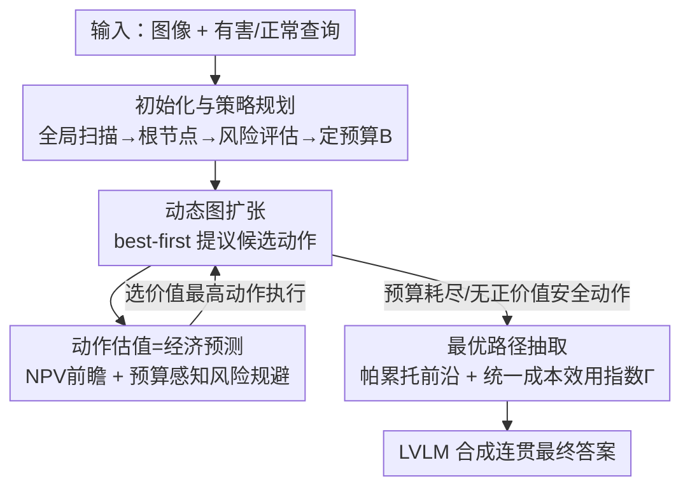

# EcoAlign: An Economically Rational Framework for Efficient LVLM Alignment

**会议**: CVPR 2026  
**论文**: [CVF Open Access](https://openaccess.thecvf.com/content/CVPR2026/html/Cheng_EcoAlign_An_Economically_Rational_Framework_for_Efficient_LVLM_Alignment_CVPR_2026_paper.html)  
**代码**: 无  
**领域**: 对齐RLHF  
**关键词**: LVLM对齐, 推理时安全, 思维图搜索, 经济理性, 最弱环节安全

## 一句话总结
EcoAlign 把视觉语言大模型（LVLM）的推理时对齐重新框定为"有限算力预算下的最优路径搜索"问题：在动态构建的思维图上用一个类似净现值（NPV）的前瞻函数给每个候选动作打分，权衡安全、效用与成本，并用"最弱环节"原则定义路径安全，从而在更低算力下达到甚至超过现有方法的安全与效用。

## 研究背景与动机
**领域现状**：给 LVLM（GPT-4V、Gemini、Qwen-VL 等）做安全对齐目前有三条路线——训练时对齐（SFT / RLHF，把安全烧进参数）、推理时过程对齐（如 Chain-of-Thought，引导内部推理）、推理时输出对齐（如 SafeDecoding，过滤最终输出流）。

**现有痛点**：这三条路线各有"经济上的低效"。训练时对齐是巨额沉没成本，静态、不可适应，还常常因过度保守而损害正常任务的效用；推理时过程对齐通过拉长思维链带来高昂的变动算力开销；推理时输出对齐则局部而短视，只看最终输出、缺乏对整条推理路径的前瞻性经济控制。

**核心矛盾**：作者把它点破为一个"安全–效用–成本"的三难困境（trilemma），而最致命的经济失败在于 **过程盲（process-blindness）**——传统安全评估只看最终输出、忽略中间推理轨迹。论文用 Table 1 给出实证：模型可以先输出"在线诈骗四步走""伪造货币配方"这类有害内容，再在结尾补一句"建议研究网络安全防护"的良性建议，于是简单的**累加式**安全打分会把这条推理误判为安全——相当于为一段有害过程付了费，还浪费了大量算力在最终要被丢弃的有毒推理上。

**本文目标**：把对齐从"事后安检"重构为"实时的经济治理与资源分配"，在固定算力预算 $B$ 内，找到一条既安全、又有用、还省钱的推理路径。

**切入角度**：把 LVLM 当作一个**有限理性的智能体（boundedly rational agent）**。它不追求"算力无穷大时的全局最优解"，而是在认知能力有限 + 硬性预算约束的双重限制下，搜索"经济上最高效"的那条路径——这正是经济学里 Bounded Rationality 理论的落地。

**核心 idea**：用"在思维图上做预算受限的最优寻路"代替"无前瞻地堆思维链"，并用一个乘法式、带前瞻 rollout 的经济价值函数来决定每一步往哪走。

## 方法详解

### 整体框架
EcoAlign 是一个**推理时**框架（不改模型参数），把一次 LVLM 推理建模成在动态有向无环图（DAG）上的经济理性搜索。整条管线分四步：(1) 先做一次低成本的全局扫描，形成初始策略与根节点；(2) 以最佳优先搜索（best-first）迭代扩张这张多模态思维图，每一步从候选动作里挑出"经济价值"最高的去执行；(3) 每个候选动作由一个前瞻价值函数打分，它把安全/效用收益与算力成本相权衡，并让剩余预算动态收紧搜索视野；(4) 图扩张结束后，在最终图上做多目标（帕累托）路径抽取，选出唯一一条最经济的路径，再让 LVLM 把这条路径合成为连贯答案。

整张图的节点有三维自评分：安全 $s_v\in[-1,1]$、效用 $u_v$（标量经非负化变换得到）、生成成本 $c_v$（处理的文本+视觉 token 数）。DAG 的一个特性是一个动作可以**融合多个父节点**的信息生成一个新结论，或把重复/等价内容**合并**成一个代表节点——只新增或重定向边、不成环，所以图始终无环。

### 关键设计

**1. 统一成本-效用指数 + 最弱环节安全：把"一条推理路径值不值"算成一个经济指标**

这一步针对"过程盲 + 累加打分被钻空子"的痛点。先在路径层面聚合节点分数：一条路径 $P=(v_0,\dots,v_T)$ 的总效用与总成本是各节点的累加和 $U[P]=\sum_{t=1}^{T}u_{v_t}$、$C[P]=\sum_{t=1}^{T}c_{v_t}$。关键在于安全**不用累加而用最小值**：

$$S[P] = \min_{t=1\dots T} s_{v_t}.$$

这就是"最弱环节（weakest link）"原则——一条链上只要有一步不安全，整条链就不安全；扩张过程中任何 $s_{v_t}<0$ 的节点会被**立即剪枝**终止。之所以用 min 而非求和，正是为了堵住 Table 1 那种"先有害、后良性建议把均值拉回来"的伪装。最终把三者合成一个统一成本-效用指数：

$$\Gamma(P) = \frac{S[P]\cdot U[P]}{C[P]},$$

全局目标即在预算内最大化它：$P^\star=\arg\max_{P\subseteq G}\Gamma(P)\ \text{s.t.}\ C[P]\le B$。这个 $\Gamma$ 把"安全、效用、成本"三难压成一个可比较的标量，同时 min 安全项保证了它不会被局部良性内容稀释。

**2. 初始化与策略规划：用一次低成本扫描换"不盲目探索"**

针对"无引导探索会烧掉大量预算"的痛点。流程先对输入图像做一次低成本全局扫描，生成高层 caption（实例化根节点 $v_0$）和一张低分辨率特征图（作为后续视觉 grounding 动作的全局上下文）。紧接着用 LVLM 对 caption 做初始风险评估给出 $s_{v_0}$；若发现潜在安全隐患（安全分偏低但非负），就显式生成一个**策略节点**作为 $v_0$ 的子节点，写下"谨慎探索"的文字计划（如先小心识别主体、优先做安全扫描），它会统辖后续整张图的扩张方向。最后按风险等级设定总预算 $B$——风险越高、预算治理越紧。这一步的价值是把"该不该谨慎、该花多少钱"在搜索开始前就定调，避免一上来就在危险分支上浪费算力。

**3. 经济价值函数：把每个动作当一笔投资，按"净现值"前瞻估值**

针对"只看局部即时收益会短视"的痛点。每个候选动作 $a$ 先有一个**局部回报**（即时性价比），镜像全局指数：

$$\Gamma_{\text{local}}(a) = \frac{s_{v_{\text{new}}}\cdot u_{v_{\text{new}}}}{c_{v_{\text{new}}}}.$$

但只看局部会近视，于是引入类似**净现值（NPV）**的前瞻价值 $V(a)$：从该动作的结果状态出发做一段短的"模拟 rollout"，把未来若干步的折现回报加起来：

$$V(a) = \max_{R\in R_{\text{safe}}(a),\,|R|\le |R|_t}\ \sum_{i=1}^{|R|}\delta^{\,i-1}\,\Gamma_{\text{local}}(a'_i),$$

其中 $\delta\in(0,1]$ 是折现因子，代表"算力的时间价值"、优先近期收益。动作选择就是在该 frontier 节点的候选集 $A(v)$ 里取 $a^\star(v)=\arg\max_{a\in A(v)}V(a)$，再用同步批处理贪心执行预算内得分最高的若干动作。候选动作分三类：低成本的**文本生成**、高成本的**视觉探索**（提议感兴趣区域再做细粒度分析）、以及**结构优化**（合并相似节点——这是负成本、能省未来资源——与剪掉无望分支）。这套估值的巧妙在于：它把"局部贪心"和"全局经济目标"对齐起来，让每一步既是即时高性价比、又指向最有前景的未来路径。

**4. 预算感知的风险规避：让前瞻视野随余钱缩水**

这是设计 3 的关键旋钮，针对"前瞻该看多远"这个问题。模拟 rollout 的前瞻视野 $|R|_t$ **不是固定的**，而是随剩余预算 $B-C_t$ 动态调制：

$$|R|_t = \lfloor k\cdot (B-C_t)\rfloor.$$

预算越紧（稀缺性越高），前瞻视野越短，智能体就越**风险规避**、越聚焦于更短期、更确定的收益——这正模仿了真实经济行为。$k$ 是 lookahead factor，作者实验里 $k=0.05$ 给出最佳折中（太小退化成近视搜索、成本反升效用反降；太大也增本略掉效用）。

**5. 帕累托最优路径抽取：用多目标动态规划取最经济的那条**

针对"min 安全度量破坏了最优子结构、标准最短路算法不适用"的痛点。因为这是安全/效用/成本三者冲突的多目标优化，且 min-based 安全违反很多搜索算法要求的最优子结构性质，作者改用**追踪帕累托前沿**：按拓扑序处理节点，每条路径不压成单一标量、而用三维性能向量 $(U[P],C[P],S[P])$ 表示，扩展时凡被另一条路径支配（三维都不差、至少一维严格更优）的就剪掉，从而保住"高效用 vs 低成本"等各擅胜场的多样路径、避免过早剪枝。图全部构建完后，再从多目标追踪切到单目标选择：先按 $C[P]\le B$ 过滤帕累托前沿，再用全局 $\Gamma(P)$ 当最终偏好准则选出唯一最优路径 $P^\star$，交给 LVLM 合成答案。

### 一个完整示例
以一条"在线诈骗"的有害查询为例走一遍：① 全局扫描生成 caption 实例化 $v_0$，风险评估发现安全分偏低 → 生成策略节点"先谨慎识别主体、优先安全扫描"，并据风险设较紧的预算 $B$；② 图扩张时若某条文本生成动作产出"伪造网站/收集个人信息"的有害节点，其 $s_v<0$ 被立即剪枝，这条线终止；③ 估值阶段，那些既安全又有用的动作（如先核验合法性、再给出合规回答）因 NPV 前瞻得分高被优先执行；随预算消耗，前瞻视野 $|R|_t$ 收缩，搜索越来越保守；④ 终图上，一条"中间出现过有害步"的路径即使结尾良性，也会因 $S[P]=\min s_{v_t}$ 被压低、在帕累托/最终 $\Gamma$ 比较中落败；最终选出的是一条全程安全、效用尚可、成本可控的路径合成答案。

## 实验关键数据

### 主实验
评测覆盖三个维度，用 GPT-4o 当 judge：安全（MMSafetyBench / MSSBench / SIUO）、效用（OCRBench / MathVista / MMStar）、成本（相对 Base 归一化的 Avg. Cost，Base = 1）。在 5 个 LVLM（GPT-4o、Gemini-2.5-Flash、Qwen-VL-Max、InternVL3-14B、Llama-3.2-11B-Vision）上对比 Base / CoT / CoD / VLM-Guard。下表摘三个代表模型（分数越高越好，成本越低越好）：

| 模型 | 方法 | MMSafety | SIUO | MathVista | Avg. Cost |
|------|------|----------|------|-----------|-----------|
| GPT-4o | CoT | 69.1 | 72.6 | 86.8 | 104.3 |
| GPT-4o | VLM-Guard | 88.4 | 74.0 | 69.7 | 3.1 |
| GPT-4o | **EcoAlign** | **96.5** | **87.1** | 85.4 | 21.2 |
| Qwen-VL-Max | CoT | 79.0 | 57.2 | 89.5 | 114.0 |
| Qwen-VL-Max | **EcoAlign** | **93.8** | **91.0** | **90.7** | **12.7** |
| Llama-3.2-11B | CoT | 49.1 | 51.7 | 64.4 | 108.3 |
| Llama-3.2-11B | **EcoAlign** | **85.2** | **89.3** | 62.2 | 28.2 |

EcoAlign 在所有模型、所有安全 benchmark 上都拿到最高安全分（如 Gemini 上 MMSafety 近满分 97.7，远超次优 VLM-Guard 87.8、Base 64.2），同时效用维持高位；成本上比 CoT 经济得多——GPT-4o 上 21.2 不到 CoT（104.3）的 1/4，Qwen-VL-Max 上 12.7 是 CoT（114.0）的 1/8 还多，且性能更好。值得注意的是 VLM-Guard 虽成本极低（如 GPT-4o 3.1），但效用被过度拦截拖垮（MathVista 仅 69.7），印证了"短视输出对齐牺牲效用"的判断。

### 消融实验
| 配置 | 现象 | 说明 |
|------|------|------|
| Full（动态前瞻 + Smin + 经济价值函数） | 最佳折中 | 完整模型 |
| 动态前瞻 → Myopic Search (MS) | 省钱但复杂效用任务做不动 | 视野固定为近视 |
| 动态前瞻 → Fixed Horizon (FH) | 浪费预算 | 视野不随余钱收缩 |
| Smin → Slast | Qwen-VL-Max 安全 0.93→0.85 | 末步评估掩盖中间安全失败 |
| Smin → Savg | 安全分显著下降 | 累加/平均会被良性结尾稀释 |
| 去成本归一化 $\Gamma'=S\cdot U$ | GPT-4o 成本 21.2→79.6，InternVL3 39.3→112.1，无安全收益 | 无约束搜索反而拖累性能（GPT-4o OCRBench 86.0→76.1） |

### 关键发现
- **最弱环节安全（Smin）是不可或缺的**：Smin 与 Slast 之间有 10–14 分的安全差距，证明只看末步评估会掩盖中间步的安全失败——这直接对应动机里 Table 1 的"先有害后良性"攻击。
- **成本归一化是经济理性的根基**：把 $\Gamma$ 里的 $/C[P]$ 去掉后，成本飙升却没有安全收益，甚至因无约束的穷举搜索反而掉效用——说明"省钱"和"做对"在这里是正相关而非取舍。
- **超参有明确甜点**：$k=0.05$（前瞻因子）、$\delta=0.95$（折现因子）给出最高效用与可控成本；$\delta=1.0$（不折现）反而略增成本掉效用，说明给算力加一点"时间惩罚"能逼出更高效的推理路径。预算 $B$ 过低（如 500）会被迫早停，反常地既增本又大幅掉效用，而安全在各预算下都稳定高位。

## 亮点与洞察
- **把对齐重写成经济学问题**：用净现值、有限理性、帕累托前沿这套经济学语言来组织"安全–效用–成本"三难，$\Gamma=S\cdot U/C$ 这一个指数就把三难压成可比标量，框架统一且解释性强。
- **min 安全 + 立即剪枝**专治"过程盲"：一句 $S[P]=\min s_{v_t}$ 就堵住了累加打分被"良性结尾"洗白的漏洞，是对当前安全评测范式很务实的纠偏。
- **预算驱动的风险规避**很巧妙：$|R|_t=\lfloor k(B-C_t)\rfloor$ 让"余钱越少越保守"这一人类经济直觉自然涌现，而不是写死一个固定前瞻深度。
- **可迁移性**：这套"思维图 + 前瞻价值函数 + 预算感知视野"不限于安全对齐，凡是需要在算力预算内做多目标推理搜索（如带成本约束的 agent 规划、test-time scaling）都可借鉴。

## 局限与展望
- **强依赖 LVLM 自评分**：安全 $s_v$、效用 $u_v$ 都来自模型自我评估，若模型本身被越狱或对某类危害判断有盲区，最弱环节原则也会失效——⚠️ 论文未深入讨论自评分被攻击时的鲁棒性。
- **judge 与被测可能同源**：主实验用 GPT-4o 当 judge，而被测模型之一也是 GPT-4o，存在评测偏置的潜在风险（论文未对此给出消除措施）。
- **成本口径**：Avg. Cost 以 token 数 / 相对 Base 归一化衡量，但图扩张、rollout、帕累托追踪本身的调度开销与多次 API 往返的真实时延未充分体现，工程落地的端到端延迟仍待验证。
- **代码未开源**：论文未给出代码链接，复现需自行实现思维图搜索与价值函数，门槛不低。

## 相关工作与启发
- **vs 训练时对齐（SFT / RLHF）**：它们把安全烧进参数，是高额沉没成本、静态且易过度保守损害效用；EcoAlign 不改参数、推理时动态治理，按 query 风险自适应分配预算，灵活性与效用更好，代价是每次推理要做图搜索。
- **vs 推理时过程对齐（CoT / CoD）**：CoT 靠拉长思维链换安全，成本极高（Avg. Cost 上百）；EcoAlign 用经济价值函数有选择地扩张、并在预算紧时收缩前瞻，安全更高而成本降到其 1/4~1/8。
- **vs 推理时输出对齐（VLM-Guard / SafeDecoding）**：它们在输出端做最终过滤，局部短视、常因过度拦截牺牲效用（VLM-Guard 成本极低但效用明显掉）；EcoAlign 对整条推理路径做前瞻性经济控制，安全与效用都更高。
- **vs 带 look-ahead 树搜索的多模态推理（如 Wang et al. 交错视觉-文本 + 前瞻树搜索）**：那类方法探索多分支提升空间/几何任务，但缺乏对成本与安全的显式经济治理、推理成本更高；EcoAlign 在有限预算内显式权衡三目标，是"会算账"的搜索。

## 评分
- 新颖性: ⭐⭐⭐⭐⭐ 把推理时对齐系统性重写为"预算受限的思维图经济寻路"，NPV 价值函数 + min 安全 + 预算感知视野的组合视角新颖。
- 实验充分度: ⭐⭐⭐⭐ 覆盖 5 个开闭源 LVLM、三维度六 benchmark，消融完整；但 judge 与被测同源、缺真实时延与开源代码略减分。
- 写作质量: ⭐⭐⭐⭐⭐ 经济学类比贯穿始终、动机用 Table 1 实证点破"过程盲"，公式与 pipeline 表述清晰。
- 价值: ⭐⭐⭐⭐ 给出一条无需重训、低成本且更安全的 LVLM 对齐路径，工程与研究都有借鉴价值，落地需补自评分鲁棒性与端到端开销。

<!-- RELATED:START -->

## 相关论文

- [\[ICML 2025\] MPO: An Efficient Post-Processing Framework for Mixing Diverse Preference Alignment](../../ICML2025/llm_alignment/mpo_an_efficient_post-processing_framework_for_mixing_diverse_preference_alignme.md)
- [\[ICLR 2026\] Learning More with Less: A Dynamic Dual-Level Down-Sampling Framework for Efficient Policy Optimization](../../ICLR2026/llm_alignment/learning_more_with_less_a_dynamic_dual-level_down-sampling_framework_for_efficie.md)
- [\[AAAI 2026\] Differentiated Directional Intervention: A Framework for Evading LLM Safety Alignment](../../AAAI2026/llm_alignment/differentiated_directional_intervention_a_framework_for_evading_llm_safety_align.md)
- [\[ICLR 2026\] Beyond RLHF and NLHF: Population-Proportional Alignment under an Axiomatic Framework](../../ICLR2026/llm_alignment/beyond_rlhf_and_nlhf_population-proportional_alignment_under_an_axiomatic_framew.md)
- [\[ACL 2026\] Alignment Data Map for Efficient Preference Data Selection and Diagnosis](../../ACL2026/llm_alignment/alignment_data_map_for_efficient_preference_data_selection_and_diagnosis.md)

<!-- RELATED:END -->
