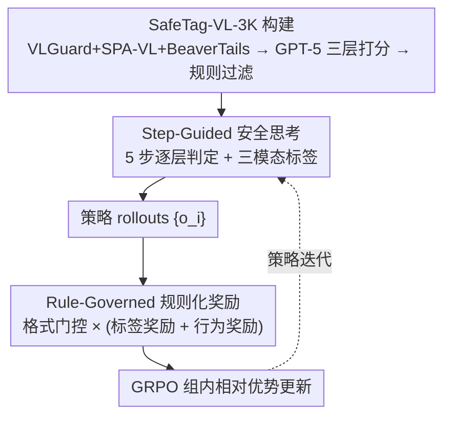

# SafeGRPO: Self-Rewarded Multimodal Safety Alignment via Rule-Governed Policy Optimization

**会议**: CVPR 2026  
**论文**: [CVF Open Access](https://openaccess.thecvf.com/content/CVPR2026/html/Rong_SafeGRPO_Self-Rewarded_Multimodal_Safety_Alignment_via_Rule-Governed_Policy_Optimization_CVPR_2026_paper.html)  
**代码**: https://github.com/XuankunRong/SafeGRPO  
**领域**: 对齐RLHF / 多模态VLM / AI安全  
**关键词**: 多模态安全对齐、GRPO、规则化奖励、自奖励、组合式安全风险

## 一句话总结
SafeGRPO 把"可验证的规则化奖励"塞进 GRPO，让多模态大模型在无需人工偏好标注的情况下自奖励地学会"先按视觉/文本/组合三层逐步推理安全性、再决定回答还是拒答"，在多个安全基准上同时提升越狱防御、安全意识与稳定性，且几乎不损伤通用能力、不引入过度拒答。

## 研究背景与动机

**领域现状**：多模态大模型（MLLM）把视觉与语言统一进一个框架，能力大涨；安全对齐的主流做法是用大规模监督数据（VLGuard 式 SFT）或偏好数据（DPO）去提升安全性。

**现有痛点**：MLLM 的风险面比纯文本模型大——**组合式安全风险（compositional safety risk）** 指单看图安全、单看文本也安全，但二者**联合解读**却产生有害语义的情况（如一张无害图配一句措辞微妙的指令，合起来暗示有害意图）。当前模型的安全意识"很浅且主要由文本驱动"，识别不了这类跨模态隐含风险。近期工作让模型显式"推理潜在风险"来缓解，但**放任不受约束的推理反而会破坏原有对齐**——推理过程本身可能生成不安全或误导性的 rationale，因为推理与安全优化常被当成两个独立目标，推理轨迹无人监管。

**核心矛盾**：GRPO 这种"组内比较多条推理轨迹、自奖励精炼"的范式很适合监督推理过程，理论上能用来打磨"安全思考"；但**安全与伦理合规无法像数学/事实那样被直接验证**——RLVR 的可验证奖励在开放式安全判断上失灵，缺少给"安全推理"打分的可信信号。

**本文目标**：在不依赖外部偏好模型或人工标注的前提下，给 GRPO 造出**可验证、细粒度**的安全奖励信号，既约束推理轨迹的安全性、又对齐最终行为。

**切入角度**：既然组合风险来自视觉/文本/组合三层的相互作用，那就把"安全推理"显式拆成这三层的逐步判定，并为每一层提供可被规则核对的 ground-truth 标签——这样安全判断就从"主观开放式"变回"可验证"。

**核心 idea**：用一个带显式三模态安全标签的数据集（SafeTag-VL-3K）当 ground truth，让模型按"step-guided safety thinking"逐步输出三层安全标签再回答，再用一套**规则化奖励**（格式门控 × (标签奖励 + 行为奖励)）驱动 GRPO 自奖励优化。

## 方法详解

### 整体框架
SafeGRPO 的目标是用规则化、可验证的奖励驱动 GRPO，去对齐多模态推理的"安全性"。整条流水线分三段：先**构建 SafeTag-VL-3K 数据集**——把 VLGuard、SPA-VL、BeaverTails 的图文对汇集起来，用 GPT-5 重新打三层安全分并按规则过滤，得到带 `<visual>`/`<text>`/`<combined>` 三标签的高一致性子集；训练时模型按 **step-guided safety thinking** 的结构化 prompt 跑 rollout——先给图配字幕、再逐步判定视觉安全/文本安全/组合安全并打出对应标签，最后据组合标签决定"拒答+解释"还是"正常帮助"；每条 rollout 由 **rule-governed reward** 评分——先过格式门控，再算标签奖励（看三层标签判对没）与行为奖励（看推理结论与最终动作一致没），合成一个标量喂给 GRPO 更新策略。三个关键设计——数据集、step-guided thinking、规则化奖励——正对应下图三段。

### 关键设计

**1. SafeTag-VL-3K：把组合式安全风险拆成三层可验证标签**

针对"安全无法像数学那样被直接验证"的痛点，本文构造了一个 3K 图文对的 modality-level 数据集，每条标注 `<visual_safe>`、`<text_safe>`、`<combined_safe>` 三个显式标签。数据源刻意混合 VLGuard（原用于 SFT）、SPA-VL（原用于 DPO），覆盖指令遵循与偏好两种安全分布；再把 300 条 BeaverTails 转成"打字稿风格图像"（把文字直接嵌进视觉模态），制造典型的跨模态嵌入攻击样本。

关键在于**不沿用原数据集自带的安全标签**（各家定义不一致），而是用 GPT-5 当 LLM-as-Judge 对每个图文对 $(x_v,x_t)$ 重标，给出三模态的安全分 $s_m=\{s_v,s_t,s_c\}$ 与置信度 $c_m=\{c_v,c_t,c_c\}$，均在 $[0,10]$。再用阈值规则离散化并过滤模糊样本：$y_m=\text{unsafe}$ 若 $s_m\in[0,3]$、$=\text{safe}$ 若 $s_m\in[7,10]$、否则 `discard`；并只保留三模态置信度都满足 $c_m\ge 7$ 的样本。过滤后留下一个高一致性子集（最大类别是"图安全+文本不安全"961 条，还有 300 条"各自安全但组合不安全"的硬样本）。作者强调这是"任务化的安全判定"而非知识蒸馏，并辅以人工核验其可靠性。

**2. Step-Guided Safety Thinking：把"安全推理"标准化成可核对的五步**

现有对齐范式（SFT/PPO/DPO）只优化最终输出、几乎不管推理过程——模型可能"答案看着安全、但推理路径不安全或自相矛盾"。本文用一个结构化 prompt 强制 reason-before-answering，把推理拆成五步：Step1 给图配字幕、Step2 判视觉安全并输出 `<visual_safe>safe/unsafe</visual_safe>`、Step3 判文本安全并输出对应标签、Step4 联合视觉与文本判**组合安全**、Step5 汇总安全结论与风险成因；然后据 Step4 的组合标签——若不安全则礼貌拒答并简述理由、若安全则正常帮助。推理须裹在 `<think></think>`、答案裹在 `<answer></answer>`。

形式化地，推理-生成过程为 $s, y = R_{\text{think}}(x_v, x_t)$，再由规则函数 $(r_{\text{reason}}, r_{\text{answer}}) = F_{\text{rule}}(s, y)$ 同时导出"推理正确性/安全一致性"与"最终行为对齐"两路奖励。这一步把推理拆成可验证的中间状态（三层标签），既让 rollout 之间的标签格式统一、又为奖励提供了稳定可核对的抓手——这正是后面规则化奖励能落地的前提。

**3. Rule-Governed Reward：格式门控的多粒度可验证奖励**

不依赖学习式或偏好式奖励模型，本文用显式可验证规则从三方面打分：结构格式正确性、模态级安全标签一致性、行为与推断安全的对齐。总奖励是**门控线性组合**：

$$R_{\text{safety}} = \mathbb{I}_{\text{format}} \cdot \left(0.5\,R_{\text{tag}} + 0.5\,R_{\text{behavior}}\right)$$

其中 $\mathbb{I}_{\text{format}}$ 是格式门——输出须按预定顺序产全套标签 + 最终答案、可解析才置 1，否则置 0，确保只有结构合法的输出才计算后续安全奖励。

标签奖励 $R_{\text{tag}}$ 体现**组合标签主导的层级化设计**：三个标签里 `combined` 是总安全一致性的主导指标，只有组合标签 $s_c$ 判对才给有效奖励、否则整项清零；判对时再为视觉/文本标签给部分加分：

$$R_{\text{tag}} = \begin{cases} 0.5 + 0.25\,r_v + 0.25\,r_t, & s_c = \hat{s}_c \\ 0, & \text{otherwise} \end{cases}$$

$r_v, r_t\in\{0,1\}$ 表示视觉/文本标签是否匹配参考。行为奖励 $R_{\text{behavior}}$ 则连接"推理结论"与"外在行为"：只有当组合标签判对 **且** 行为也符合预期（不安全→显式拒答、安全→有用回应）才给 1，否则为 0：$R_{\text{behavior}} = \mathbb{1}[(s_c=\hat{s}_c)\wedge(a_c=\hat{a}_c)]$。其中行为 $a_c$ 由关键词匹配自动判定（命中 "sorry/cannot/unsafe/not allowed" 等拒答指示词即视为拒答）。这套设计把"安全意图"与"外在行为"绑在一起，避免模型嘴上判不安全、却仍给出有害内容。把它接进 GRPO：策略对 query $q$ 生成一组响应 $\{o_i\}_{i=1}^G$、各得规则奖励 $r_i$，按组均值方差归一化出相对优势 $A_i=(r_i-\bar r)/(s+\varepsilon)$ 再更新，实现无人工偏好的自奖励对齐。

## 实验关键数据

### 主实验
基座为 Qwen3-VL-4B/8B-Thinking，在 verl 框架上做 GRPO（4×A100、每 prompt 8 rollouts、global batch 256）。评测分三维：越狱防御（FigStep / VLGuard / MM-Safety，Safety Score↑，已线性缩放到 0–100）、安全意识（SIUO，图文各自安全但联合有害，Safety Score↑）、过度敏感（MOSSBench，Refusal Rate↓——安全查询被错误拒答的比例越低越好）。奖励/安全分由 GPT-4o-mini 当 judge。

| 方法（Qwen3-VL-8B-Thinking） | 越狱防御均值↑ | 安全意识 SIUO↑ | 过度敏感 Refusal↓ |
|------|------|------|------|
| 基座 | 89.28 | 86.52 | 21.00 |
| + VLGuard | 97.01 | 90.47 | 95.00 ⚠️ 过度拒答 |
| + ECSO | 95.68 | 89.34 | 26.33 |
| + Think-in-Safety | 97.69 | 88.80 | 64.00 ⚠️ |
| **+ SafeGRPO** | **99.02** | **94.31** | **20.00** |

SafeGRPO 在三维上同时拿到最佳：越狱防御 99.02（比 Think-in-Safety 高 1.33）、安全意识 94.31（最高），而 Refusal Rate 仅 20.00——比基座(21.00)还略低。对照之下，训练式基线 VLGuard、Think-in-Safety 大幅推高过度敏感（Refusal 飙到 95.00 / 64.00），即"用拒一切来换安全"。4B 上结论一致（SafeGRPO 越狱防御 99.21、SIUO 93.85、Refusal 24.33）。

### 通用能力保持
| 方法（Qwen3-VL-8B） | ScienceQA | MathVista | POPE | 5 项均值 | 相对基座 |
|------|------|------|------|------|------|
| 基座 | 91.92 | 60.00 | 87.40 | 77.98 | — |
| + VLGuard | 5.60 | 20.10 | 19.20 | 16.94 | **↓61.04** 崩塌 |
| + Think-in-Safety | 39.51 | 58.90 | 63.20 | 52.02 | ↓25.96 |
| + ECSO | 91.92 | 60.00 | 87.60 | 78.04 | ≈持平 |
| **+ SafeGRPO** | 93.26 | 61.10 | 88.20 | **78.75** | **↑0.77** |

VLGuard 这类 SFT 方法因偏离预定结构化输出格式（如 `\boxed{}`）并过拟合安全分布，通用能力几乎崩塌（均值跌 61）；SafeGRPO 反而**略涨**——作者归因于 RL 强化推理能力、且 RL 天然缓解微调式灾难遗忘。

### 消融实验
| 配置（Qwen3-VL-8B） | 安全表现 | 说明 |
|------|------|------|
| Base（无 RL） | 最低 | 不优化 |
| w/ Tag only（仅标签奖励） | 中 | 只有安全感知监督 |
| w/ Behavior only（仅行为奖励） | 中 | 只有推理一致性监督 |
| Full SafeGRPO（两者） | **最高** | 多粒度信号协同 |

去掉标签奖励或行为奖励中任一项，所有安全基准都明显掉点：标签奖励提供显式的安全感知监督，行为奖励增强决策时的推理一致性与安全意识，两者结合才达最高 Safety Score。

### 关键发现
- **过度敏感是安全对齐的隐形代价**：VLGuard/Think-in-Safety 把越狱防御做高的同时 Refusal Rate 飙到 64–95，等于"见到安全查询也拒答"；SafeGRPO 靠"强化推理而非一刀切拒答"把过度敏感压到 20，是它相对其他方法最突出的优势。
- **RL 比 SFT 更不伤通用能力**：同样引入推理式数据，Think-in-Safety 的 SFT 本质仍掉点 26，而 SafeGRPO 的 RL 路线不仅不掉反略涨，印证"用可验证奖励做 RL"在"安全 vs 能力"权衡上的优越性。
- **组合标签是层级奖励的支点**：标签奖励里组合标签判错就整项清零，把优化重心压在"联合解读出的组合安全"上——这正对应组合式风险这一核心问题。

## 亮点与洞察
- **把不可验证的"安全"重写成可验证的三层标签**：通过 SafeTag-VL-3K + step-guided thinking，将开放式安全判断转化为视觉/文本/组合三个可被规则核对的离散标签，让 RLVR 范式得以用在安全对齐上——这是绕开"安全无法直接验证"瓶颈的关键一招。
- **格式门控 × (标签 + 行为) 的奖励结构**：用 $\mathbb{I}_{\text{format}}$ 当硬门、组合标签当层级支点、行为奖励绑定"判断↔动作"，整套规则纯可验证、无需偏好模型，可直接迁移到其他"先结构化推理再决策"的对齐任务。
- **同时压住过度敏感**：多数安全方法以推高拒答率为代价，SafeGRPO 用"上下文感知的谨慎决策"把 Refusal 压到比基座还低，提供了"安全且不矫枉过正"的范例。
- **typo-style 图像样本**：把 BeaverTails 文本嵌进图像制造跨模态攻击样本，是一种低成本扩充组合风险覆盖面的数据 trick。

## 局限与展望
- **重度依赖闭源 LLM 当标注与裁判**：数据用 GPT-5 重标、评测用 GPT-4o-mini 当 judge，安全分的绝对值与可复现性都受这些闭源模型的偏好影响；作者称其为"任务化标注而非蒸馏"，但标签质量上限仍系于 GPT-5。
- **行为判定靠关键词匹配**：$a_c$ 用 "sorry/cannot" 等拒答词来判是否拒答，可能误判（婉转拒答不含关键词、或安全回答恰含这些词），是奖励信号的潜在噪声源。⚠️ 论文未给该匹配的准确率。
- **数据规模与覆盖**：SafeTag-VL-3K 仅 3K、且过滤掉了所有"模糊安全"样本——这让监督更干净，但模型可能没学会处理真正处于灰色地带、置信度中等的现实输入。
- **未与更强的 RLHF/偏好式安全方法横比**：基线集中在 VLGuard/ECSO/Think-in-Safety，缺与大规模 RLHF 安全对齐的直接对照。

## 相关工作与启发
- **vs VLGuard（训练式 SFT 安全对齐）**：VLGuard 靠精选安全数据做指令微调，结果过度敏感（Refusal≈95）且通用能力崩塌（均值跌 61）；SafeGRPO 用可验证规则奖励做 RL，安全更高且通用能力不降反升、过度敏感最低。
- **vs ECSO（推理时无训练防御）**：ECSO 在推理时用 query-aware 的图转文做输入净化，不改权重故几乎不伤通用能力，但安全提升有限（越狱防御 95.68 < SafeGRPO 99.02）；SafeGRPO 训练时就把安全推理内化进策略，安全上限更高。
- **vs Think-in-Safety（推理引导的 SFT 对齐）**：同样让模型带安全思考，但其 SFT 本质仍导致通用能力掉 26 且过度敏感升高；SafeGRPO 用 GRPO + 规则奖励监管推理过程本身，避免了"放任推理破坏对齐"的问题。

## 评分
- 新颖性: ⭐⭐⭐⭐ 把组合式安全风险拆成三层可验证标签、再用规则化奖励把 RLVR 引入安全对齐，思路清晰且填补"安全难验证"的空白；但 GRPO、LLM-as-Judge 标注都是既有组件。
- 实验充分度: ⭐⭐⭐⭐ 三维安全 + 五项通用能力 + 双尺度基座 + 奖励消融较完整；但缺与大规模 RLHF 安全方法横比，行为关键词匹配未给准确率。
- 写作质量: ⭐⭐⭐⭐ 动机层层推进、奖励公式交代清楚；部分数据集统计与图表需对照原文。
- 价值: ⭐⭐⭐⭐ 给出"安全且不过度拒答、还不伤通用能力"的可复用对齐范式，SafeTag-VL-3K 数据集对社区有实用价值。

<!-- RELATED:START -->

## 相关论文

- [\[ICLR 2026\] Mitigating the Safety Alignment Tax with Null-Space Constrained Policy Optimization](../../ICLR2026/llm_alignment/mitigating_the_safety_alignment_tax_with_null-space_constrained_policy_optimizat.md)
- [\[CVPR 2026\] Uncertainty-Aware Exploratory Direct Preference Optimization for Multimodal Large Language Models](uncertainty-aware_exploratory_direct_preference_optimization_for_multimodal_larg.md)
- [\[ICLR 2026\] GuardAlign: Test-time Safety Alignment in Multimodal Large Language Models](../../ICLR2026/llm_alignment/guardalign_test-time_safety_alignment_in_multimodal_large_language_models.md)
- [\[ICML 2026\] Long Live The Balance: Information Bottleneck Driven Tree-based Policy Optimization](../../ICML2026/llm_alignment/long_live_the_balance_information_bottleneck_driven_tree-based_policy_optimizati.md)
- [\[ICLR 2026\] Is On-Policy Data always the Best Choice for Direct Preference Optimization-based LM Alignment?](../../ICLR2026/llm_alignment/is_on-policy_data_always_the_best_choice_for_direct_preference_optimization-base.md)

<!-- RELATED:END -->
